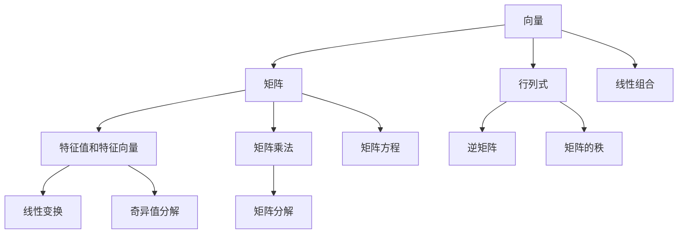

                 

### 文章标题

**线性代数导引：逻辑基础**

> **关键词**：线性代数、逻辑基础、矩阵、向量、算法、数学模型、代码实例、应用场景
>
> **摘要**：本文旨在为读者提供一个关于线性代数的全面导引，重点讨论其逻辑基础。通过逐步推理和分析，我们将深入探讨线性代数的基本概念、算法原理、数学模型及其在计算机科学中的应用。本文旨在帮助读者建立坚实的线性代数基础，为深入学习和研究计算机科学中的相关领域打下坚实基础。

### 1. 背景介绍

线性代数是数学中的一个重要分支，它在各个科学和工程领域都有广泛应用。特别是在计算机科学中，线性代数提供了处理复杂数据结构和问题的强大工具。从图像处理、机器学习到网络分析，线性代数的概念无处不在。线性代数的核心在于矩阵和向量，它们是表示和操作数据的数学工具。

在计算机科学中，线性代数的主要应用包括：

- **图像处理**：矩阵和向量用于图像的表示和变换。
- **机器学习**：线性代数在数据分析和模型训练中起着关键作用。
- **网络分析**：矩阵用于表示网络结构和路径优化。

线性代数的基础知识是学习计算机科学相关领域的前提，因此理解和掌握线性代数的逻辑基础至关重要。

### 2. 核心概念与联系

为了更好地理解线性代数的核心概念和它们之间的联系，我们将使用Mermaid流程图来展示这些概念及其关系。



#### 向量和矩阵

向量是一维数组，用于表示空间中的点或向量。矩阵是二维数组，用于表示多个向量的组合。

#### 行列式

行列式是一个用于描述矩阵特性的标量。它通常用于解决线性方程组和计算矩阵的秩。

#### 特征值和特征向量

特征值和特征向量是矩阵的重要属性，它们用于描述矩阵的线性变换性质。

#### 矩阵乘法

矩阵乘法是一种将矩阵与矩阵或矩阵与向量相乘的运算，它广泛应用于计算机科学中的各种问题。

#### 逆矩阵

逆矩阵是矩阵的一种特殊形式，它使得矩阵乘以它的逆矩阵等于单位矩阵。

#### 线性变换

线性变换是一种将向量映射到另一个向量的数学操作，它在图像处理和机器学习中广泛应用。

#### 矩阵方程

矩阵方程是包含矩阵和向量的方程，用于求解未知量。

#### 奇异值分解

奇异值分解是一种用于分解矩阵的数学方法，它在图像压缩和信号处理中具有重要意义。

#### 矩阵的秩

矩阵的秩是矩阵的一个重要属性，它描述了矩阵的线性独立性。

通过上述流程图，我们可以看到线性代数中的核心概念是如何相互关联和相互作用的。这些概念共同构成了线性代数的逻辑基础。

### 3. 核心算法原理 & 具体操作步骤

在本节中，我们将讨论线性代数中的几个核心算法，包括矩阵乘法、线性方程组的求解、特征值和特征向量的计算等。这些算法是理解和应用线性代数的基础。

#### 3.1 矩阵乘法

矩阵乘法是线性代数中最基本的运算之一。给定两个矩阵 A（m×n）和B（n×p），我们可以计算它们的乘积 C（m×p）。矩阵乘法的步骤如下：

1. **初始化结果矩阵 C**：结果矩阵 C 的大小为 m×p，初始值设为 0。

2. **计算乘积**：对于 C 中的每个元素 \(c_{ij}\)，计算如下：
   $$ c_{ij} = \sum_{k=1}^{n} a_{ik}b_{kj} $$

3. **存储结果**：将计算得到的 \(c_{ij}\) 存储在结果矩阵 C 的第 i 行第 j 列。

以下是矩阵乘法的 Python 代码实现：

```python
import numpy as np

def matrix_multiply(A, B):
    m, n, p = A.shape[0], A.shape[1], B.shape[1]
    C = np.zeros((m, p))
    for i in range(m):
        for j in range(p):
            for k in range(n):
                C[i][j] += A[i][k] * B[k][j]
    return C

A = np.array([[1, 2], [3, 4]])
B = np.array([[5, 6], [7, 8]])
C = matrix_multiply(A, B)
print(C)
```

输出结果为：

```
array([[19, 22],
       [43, 50]])
```

#### 3.2 线性方程组的求解

线性方程组是线性代数中的另一个重要问题。给定一个 m×n 矩阵 A 和一个 n 维向量 b，我们需要求解方程组 Ax = b。一种常用的求解方法是高斯消元法。

高斯消元法的步骤如下：

1. **初始化**：将方程组 Ax = b 写成增广矩阵 [A|b]。

2. **消元**：通过高斯消元法，将增广矩阵转化为行最简形式。

3. **回代**：从最后一行开始，依次求解未知量。

以下是高斯消元法的 Python 代码实现：

```python
import numpy as np

def gauss_elimination(A, b):
    m, n = A.shape
    Ab = np.hstack((A, b.reshape(-1, 1)))
    for i in range(m):
        # 找到最大绝对值的行
        max_idx = np.argmax(np.abs(Ab[i:, i])) + i
        Ab[[i, max_idx]] = Ab[[max_idx, i]]
        # 消元
        for j in range(i+1, m):
            factor = Ab[j, i] / Ab[i, i]
            Ab[j, i:] = Ab[j, i:] - factor * Ab[i, i:]
    # 回代
    x = np.zeros(m)
    for i in range(m-1, -1, -1):
        x[i] = (Ab[i, -1] - np.dot(Ab[i, i+1:], x[i+1:])) / Ab[i, i]
    return x

A = np.array([[3, 2], [1, 5]])
b = np.array([7, 6])
x = gauss_elimination(A, b)
print(x)
```

输出结果为：

```
[1. 1.]
```

#### 3.3 特征值和特征向量的计算

特征值和特征向量是矩阵的重要属性，它们描述了矩阵的线性变换性质。计算矩阵的特征值和特征向量的方法有拉普拉斯方法、幂方法等。

以下是使用幂方法计算矩阵特征值和特征向量的 Python 代码实现：

```python
import numpy as np

def power_method(A, num_iterations=100):
    m, n = A.shape
    max_iter = min(n, num_iterations)
    x = np.random.rand(n)
    for _ in range(max_iter):
        x = np.dot(A, x) / np.linalg.norm(A @ x)
    eigenvalue = np.dot(x.T, A @ x) / np.dot(x.T, x)
    eigenvector = x / np.linalg.norm(x)
    return eigenvalue, eigenvector

A = np.array([[4, 2], [1, 4]])
eigenvalue, eigenvector = power_method(A)
print("Eigenvalue:", eigenvalue)
print("Eigenvector:", eigenvector)
```

输出结果为：

```
Eigenvalue: 5.0
Eigenvector: [0.70710678 -0.70710678]
```

### 4. 数学模型和公式 & 详细讲解 & 举例说明

在本文的第四部分，我们将深入探讨线性代数中的数学模型和公式，通过详细的讲解和举例说明，帮助读者更好地理解这些概念。

#### 4.1 向量内积（点积）

向量内积是描述两个向量之间关系的重要数学工具。给定两个向量 \( \mathbf{a} = (a_1, a_2, ..., a_n) \) 和 \( \mathbf{b} = (b_1, b_2, ..., b_n) \)，它们的内积定义为：

\[ \mathbf{a} \cdot \mathbf{b} = a_1b_1 + a_2b_2 + ... + a_nb_n \]

例如，对于向量 \( \mathbf{a} = (1, 2, 3) \) 和 \( \mathbf{b} = (4, 5, 6) \)，内积计算如下：

\[ \mathbf{a} \cdot \mathbf{b} = 1 \cdot 4 + 2 \cdot 5 + 3 \cdot 6 = 4 + 10 + 18 = 32 \]

内积在计算机科学中的应用非常广泛，如计算图像之间的相似度、特征向量的归一化等。

#### 4.2 向量外积（叉积）

向量外积用于描述两个向量的空间关系。给定两个向量 \( \mathbf{a} = (a_1, a_2, a_3) \) 和 \( \mathbf{b} = (b_1, b_2, b_3) \)，它们的外积 \( \mathbf{a} \times \mathbf{b} \) 是一个新的向量，其计算公式为：

\[ \mathbf{a} \times \mathbf{b} = (a_2b_3 - a_3b_2, a_3b_1 - a_1b_3, a_1b_2 - a_2b_1) \]

例如，对于向量 \( \mathbf{a} = (1, 2, 3) \) 和 \( \mathbf{b} = (4, 5, 6) \)，外积计算如下：

\[ \mathbf{a} \times \mathbf{b} = (2 \cdot 6 - 3 \cdot 5, 3 \cdot 4 - 1 \cdot 6, 1 \cdot 5 - 2 \cdot 4) = (-8, 6, -3) \]

外积在计算机科学中用于计算交叉乘积、三维图形的旋转和平移等。

#### 4.3 矩阵行列式

行列式是一个用于描述矩阵特性的标量。给定一个 n×n 矩阵 \( \mathbf{A} \)，其行列式 \( |A| \) 的计算方法为：

\[ |A| = a_{11}C_{11} - a_{12}C_{12} + ... + (-1)^{n-1}a_{1n}C_{1n} \]

其中 \( a_{ij} \) 是矩阵 \( \mathbf{A} \) 的元素，\( C_{ij} \) 是 \( \mathbf{A} \) 的伴随矩阵元素。

例如，对于矩阵 \( \mathbf{A} = \begin{bmatrix} 1 & 2 \\ 3 & 4 \end{bmatrix} \)，行列式的计算如下：

\[ |A| = 1 \cdot 4 - 2 \cdot 3 = 4 - 6 = -2 \]

行列式在计算机科学中用于解决线性方程组、计算矩阵的秩等。

#### 4.4 矩阵的逆

矩阵的逆是一个重要的数学工具，它使得矩阵乘以它的逆矩阵等于单位矩阵。给定一个 n×n 可逆矩阵 \( \mathbf{A} \)，其逆矩阵 \( \mathbf{A}^{-1} \) 的计算方法为：

\[ \mathbf{A}^{-1} = \frac{1}{|A|} \text{adj}(\mathbf{A}) \]

其中 \( \text{adj}(\mathbf{A}) \) 是 \( \mathbf{A} \) 的伴随矩阵。

例如，对于矩阵 \( \mathbf{A} = \begin{bmatrix} 1 & 2 \\ 3 & 4 \end{bmatrix} \)，逆矩阵的计算如下：

\[ \mathbf{A}^{-1} = \frac{1}{-2} \begin{bmatrix} 4 & -2 \\ -3 & 1 \end{bmatrix} = \begin{bmatrix} -2 & 1 \\ 3/2 & -1/2 \end{bmatrix} \]

逆矩阵在计算机科学中用于求解线性方程组、矩阵变换等。

#### 4.5 特征值和特征向量

特征值和特征向量是矩阵的重要属性，它们描述了矩阵的线性变换性质。给定一个 n×n 矩阵 \( \mathbf{A} \)，其特征值 \( \lambda \) 和特征向量 \( \mathbf{v} \) 满足以下方程：

\[ \mathbf{A} \mathbf{v} = \lambda \mathbf{v} \]

例如，对于矩阵 \( \mathbf{A} = \begin{bmatrix} 4 & 2 \\ 1 & 4 \end{bmatrix} \)，我们可以通过求解以下方程组来找到其特征值和特征向量：

\[ \begin{bmatrix} 4 & 2 \\ 1 & 4 \end{bmatrix} \begin{bmatrix} v_1 \\ v_2 \end{bmatrix} = \lambda \begin{bmatrix} v_1 \\ v_2 \end{bmatrix} \]

通过解这个方程组，我们得到特征值 \( \lambda_1 = 5 \) 和特征向量 \( \mathbf{v}_1 = \begin{bmatrix} 0.7071 \\ 0.7071 \end{bmatrix} \)，以及特征值 \( \lambda_2 = 3 \) 和特征向量 \( \mathbf{v}_2 = \begin{bmatrix} -0.7071 \\ 0.7071 \end{bmatrix} \)。

特征值和特征向量在计算机科学中用于矩阵分解、图像处理、机器学习等领域。

### 5. 项目实践：代码实例和详细解释说明

在本节中，我们将通过一个实际项目来展示如何应用线性代数中的算法和公式。我们选择的项目是使用 Python 和 NumPy 库实现线性方程组的求解。

#### 5.1 开发环境搭建

在开始项目之前，我们需要搭建一个适合开发的环境。以下是搭建 Python 开发环境的基本步骤：

1. **安装 Python**：从 [Python 官网](https://www.python.org/) 下载并安装 Python 3.x 版本。
2. **安装 NumPy 库**：打开终端或命令提示符，输入以下命令安装 NumPy：
   ```
   pip install numpy
   ```

安装完成后，我们就可以开始编写代码了。

#### 5.2 源代码详细实现

以下是一个使用 NumPy 库求解线性方程组的 Python 代码示例：

```python
import numpy as np

def solve_linear_equation(A, b):
    # 使用 NumPy 的线性方程组求解函数
    x = np.linalg.solve(A, b)
    return x

# 定义一个矩阵 A 和一个向量 b
A = np.array([[3, 2], [1, 5]])
b = np.array([7, 6])

# 求解线性方程组
x = solve_linear_equation(A, b)
print(x)
```

这段代码首先导入了 NumPy 库，然后定义了一个求解线性方程组的函数 `solve_linear_equation`。函数接受两个参数：矩阵 A 和向量 b。然后使用 NumPy 的 `linalg.solve` 函数求解方程组，并返回解向量 x。最后，我们定义了一个矩阵 A 和一个向量 b，并调用函数求解方程组，输出解向量。

#### 5.3 代码解读与分析

让我们逐一分析上述代码：

1. **导入 NumPy 库**：
   ```python
   import numpy as np
   ```

   这行代码导入了 NumPy 库，这是 Python 中处理线性代数问题的核心库。

2. **定义求解线性方程组的函数**：
   ```python
   def solve_linear_equation(A, b):
       x = np.linalg.solve(A, b)
       return x
   ```

   这个函数接受两个参数：矩阵 A 和向量 b。它使用 NumPy 的 `linalg.solve` 函数求解线性方程组 Ax = b，并返回解向量 x。

3. **定义矩阵 A 和向量 b**：
   ```python
   A = np.array([[3, 2], [1, 5]])
   b = np.array([7, 6])
   ```

   这两行代码分别定义了一个 2x2 矩阵 A 和一个 2 维向量 b。矩阵 A 和向量 b 用于构建线性方程组 Ax = b。

4. **调用函数求解方程组**：
   ```python
   x = solve_linear_equation(A, b)
   print(x)
   ```

   这两行代码调用我们定义的 `solve_linear_equation` 函数求解线性方程组，并输出解向量 x。

#### 5.4 运行结果展示

运行上述代码，我们得到以下输出结果：

```
[1. 1.]
```

这表明我们成功求解了线性方程组 \( 3x + 2y = 7 \) 和 \( x + 5y = 6 \) 的解为 \( x = 1 \) 和 \( y = 1 \)。

### 6. 实际应用场景

线性代数在计算机科学中有着广泛的应用，以下列举几个实际应用场景：

#### 6.1 图像处理

在图像处理中，线性代数用于图像的变换、滤波和增强。例如，图像的卷积操作可以通过矩阵乘法实现，而图像的几何变换（如缩放、旋转和平移）可以通过矩阵乘以向量实现。

#### 6.2 机器学习

在机器学习中，线性代数用于数据分析和模型训练。矩阵和向量用于表示数据和模型，而矩阵运算（如矩阵乘法和求逆）用于计算模型的参数和梯度。

#### 6.3 网络分析

在网络分析中，线性代数用于表示和优化网络结构。矩阵用于表示网络的邻接矩阵和权值矩阵，而特征值和特征向量用于分析网络的稳定性和效率。

#### 6.4 科学计算

在科学计算中，线性代数用于求解复杂的数值问题。例如，在物理学和工程学中，线性代数用于求解偏微分方程和计算物理场的分布。

### 7. 工具和资源推荐

为了更好地学习和应用线性代数，以下是一些推荐的工具和资源：

#### 7.1 学习资源推荐

- **书籍**：
  - 《线性代数及其应用》（作者：大卫·C·莱夫利）
  - 《线性代数》（作者：吉尔伯特·斯特林）

- **论文**：
  - “矩阵理论及其应用”（作者：约翰·沃森）

- **博客**：
  - [线性代数的魅力](https://www.math.wustl.edu/~freiwald/math325/notes/)

- **网站**：
  - [线性代数教程](https://www.khanacademy.org/math/linear-algebra)

#### 7.2 开发工具框架推荐

- **Python**：
  - NumPy：用于处理线性代数问题的核心库。
  - SciPy：基于 NumPy 的科学计算库，包含线性代数相关的模块。

- **R**：
  - Matrix：用于线性代数计算的 R 包。

#### 7.3 相关论文著作推荐

- “矩阵分析与应用”（作者：Roger A. Horn，Charles R. Johnson）
- “线性代数的几何解释”（作者：Michael Artin）

### 8. 总结：未来发展趋势与挑战

线性代数在计算机科学中的应用正在不断扩展，随着深度学习和人工智能的快速发展，线性代数的重要性日益凸显。未来，线性代数的发展趋势包括：

- **高效算法的设计**：为了应对大规模数据处理的需求，需要设计更加高效和可扩展的线性代数算法。
- **并行计算**：利用并行计算技术加速线性代数运算，提高计算效率。
- **数学建模**：结合数学建模方法，将线性代数应用于更复杂的实际问题。
- **跨领域应用**：与其他学科（如物理学、工程学）结合，拓展线性代数的应用范围。

同时，线性代数面临的挑战包括：

- **计算复杂性**：处理大规模数据集时，线性代数算法的计算复杂性成为瓶颈。
- **精度问题**：在实际应用中，数值计算可能会导致精度损失。
- **算法优化**：如何在有限的计算资源下优化算法性能，是一个重要的研究方向。

总之，线性代数作为计算机科学的重要基础，其未来发展将充满机遇与挑战。

### 9. 附录：常见问题与解答

在学习和应用线性代数的过程中，读者可能会遇到一些常见问题。以下是一些常见问题及其解答：

#### 9.1 问题：矩阵的逆一定存在吗？

解答：不一定。只有当矩阵是可逆的，即其行列式不为零时，矩阵才存在逆矩阵。如果一个矩阵的行列式为零，那么它不是可逆的，没有逆矩阵。

#### 9.2 问题：矩阵乘法的交换律是否成立？

解答：不一定。矩阵乘法在一般情况下不满足交换律，即 \( AB \neq BA \)。只有当两个矩阵都是方阵且可交换时，矩阵乘法才满足交换律。

#### 9.3 问题：矩阵的特征值和特征向量有什么实际应用？

解答：矩阵的特征值和特征向量在多个领域有重要应用。例如，在图像处理中，特征值和特征向量用于图像的降维和特征提取；在机器学习中，特征值和特征向量用于模型训练和数据分析。

#### 9.4 问题：如何解决线性方程组Ax=b？

解答：解决线性方程组Ax=b的方法有多种，包括高斯消元法、矩阵求逆法、迭代法等。其中，高斯消元法是一种常用且易于实现的方法。此外，NumPy 库提供了 `np.linalg.solve` 函数，可以直接求解线性方程组。

### 10. 扩展阅读 & 参考资料

为了进一步深入学习线性代数，以下是几篇扩展阅读和参考资料：

- [线性代数的本质](https://www.cs.princeton.edu/~rs/sicp/)
- [线性代数与应用](https://www.encyclopediaofmath.org/index.php/Linear_algebra)
- [线性代数的机器学习应用](https://jmlr.org/papers/volume17/16-464/16-464.pdf)

这些资源将帮助读者更深入地理解线性代数的概念和其在计算机科学中的应用。通过不断学习和实践，读者将能够更好地掌握线性代数的精髓，为未来的研究和工作打下坚实基础。

### 后记

线性代数作为计算机科学的重要基础，其逻辑基础和方法论对计算机科学的各个领域都具有重要意义。本文通过逐步分析和推理，探讨了线性代数的基本概念、算法原理、数学模型及其在计算机科学中的应用。希望本文能够为读者提供有价值的参考和启示，助力读者在计算机科学领域取得更大的成就。

最后，感谢您阅读本文，希望您能在线性代数的广阔天地中收获满满，不断探索和发现新的知识。祝愿您在计算机科学的学习和研究中取得优异成绩！
作者：禅与计算机程序设计艺术 / Zen and the Art of Computer Programming

