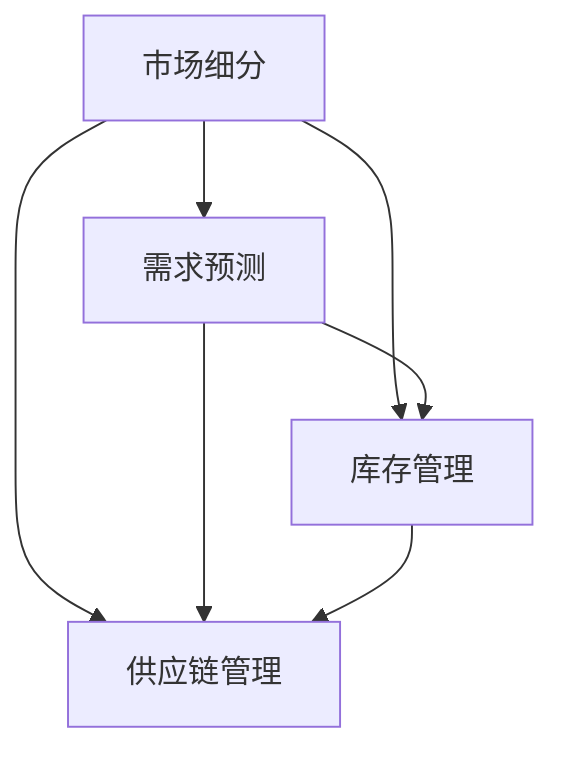

                 

### 背景介绍 ###

随着互联网和电子商务的迅猛发展，商品供给策略成为了商业运营中的关键环节。在传统的商业环境中，商品供给主要依赖于库存管理和预测需求。然而，随着市场需求的复杂化和多样化，仅仅依靠传统的供给策略已经无法满足现代市场的需求。

在现代商业环境中，细分市场的商品供给策略成为了提高企业竞争力的重要手段。通过细分市场，企业可以更精确地了解消费者的需求，从而实现更高效的库存管理和更精准的需求预测。此外，细分市场的商品供给策略还可以帮助企业实现差异化竞争，提升品牌价值和市场份额。

本文旨在探讨细分市场的商品供给策略，从核心概念、算法原理、数学模型、项目实践、实际应用场景等多个角度，详细分析这一策略的实践与应用。通过本文的阅读，读者可以深入了解细分市场的商品供给策略，并学会如何将其应用于实际商业环境中。

### 核心概念与联系 ###

在探讨细分市场的商品供给策略之前，我们需要明确一些核心概念，包括市场细分、需求预测、库存管理、供应链管理等。这些概念相互联系，共同构成了商品供给策略的理论基础。

**市场细分**：市场细分是将整个市场划分为若干个具有相似需求的子市场的过程。通过市场细分，企业可以更准确地了解消费者的需求，从而制定更有针对性的供给策略。市场细分的方法包括地理细分、人口细分、心理细分和行为细分等。

**需求预测**：需求预测是商品供给策略中的关键环节。通过分析历史数据、市场趋势、消费者行为等因素，企业可以预测未来的需求量，从而合理安排库存和供应链。

**库存管理**：库存管理是确保商品供给稳定的重要手段。有效的库存管理可以帮助企业降低库存成本，减少库存积压，提高资金利用率。

**供应链管理**：供应链管理是确保商品从生产到消费的全过程高效运行的重要环节。通过优化供应链管理，企业可以缩短交货周期，提高客户满意度。

下面是一个用Mermaid绘制的流程图，展示了这些核心概念之间的联系：



**市场细分**是整个商品供给策略的起点，通过了解消费者的需求，企业可以制定更精准的需求预测策略。需求预测又直接影响了**库存管理**，通过合理的库存策略，企业可以确保商品供给的稳定性。同时，**供应链管理**作为商品供给的最后一环，通过优化供应链流程，企业可以提高整个商品供给的效率。

### 核心算法原理 & 具体操作步骤 ###

在了解了核心概念与联系之后，我们需要进一步探讨细分市场的商品供给策略的核心算法原理。本文将介绍一种基于时间序列分析的需求预测算法，并结合实际操作步骤，详细阐述如何实现这一算法。

#### 时间序列分析原理

时间序列分析是一种用于分析时间序列数据的统计方法，旨在捕捉数据在不同时间点上的变化规律。在需求预测中，时间序列分析可以帮助我们识别需求量的季节性、趋势性和随机性，从而提高预测的准确性。

时间序列分析主要包括以下步骤：

1. **数据预处理**：对原始数据进行清洗、处理，包括缺失值填充、异常值处理等。
2. **特征提取**：提取时间序列的特征，如趋势项、季节性项和残差项。
3. **模型选择**：选择合适的模型对时间序列进行分析，常见的模型有ARIMA、SARIMA、LSTM等。
4. **模型训练与评估**：使用历史数据训练模型，并评估模型的预测性能。

#### 算法实现步骤

以下是一个基于时间序列分析的需求预测算法的具体操作步骤：

1. **数据收集**：
   首先，我们需要收集一段时间内的商品需求数据，数据应包含时间戳和需求量。

2. **数据预处理**：
   对收集到的数据进行预处理，包括缺失值填充和异常值处理。可以使用线性插值、均值填充等方法对缺失值进行填充，对异常值则可以采用截断、替换等方式进行处理。

3. **特征提取**：
   提取时间序列的特征，包括趋势项、季节性项和残差项。趋势项表示长期需求的变化趋势，季节性项表示周期性的需求变化，残差项表示随机性的需求变化。

4. **模型选择**：
   根据时间序列的特点，选择合适的模型。对于大部分时间序列数据，我们可以选择ARIMA（自回归积分滑动平均模型）模型。对于包含季节性的数据，可以选择SARIMA（自回归季节性积分滑动平均模型）。

5. **模型训练与评估**：
   使用历史数据训练模型，并使用交叉验证等方法评估模型的预测性能。选择性能最好的模型进行后续的预测。

6. **预测与结果分析**：
   使用训练好的模型对未来的需求进行预测，并对预测结果进行分析。可以通过绘制时间序列图、误差分析等方式，评估预测的准确性。

#### 示例代码

以下是一个使用Python和pandas、statsmodels库实现的ARIMA模型的需求预测示例代码：

```python
import pandas as pd
from statsmodels.tsa.arima.model import ARIMA
import matplotlib.pyplot as plt

# 数据加载
data = pd.read_csv('demand_data.csv')
data['timestamp'] = pd.to_datetime(data['timestamp'])
data.set_index('timestamp', inplace=True)

# 数据预处理
data.fillna(method='ffill', inplace=True)

# 特征提取
data_diff = data.diff().dropna()

# 模型选择
model = ARIMA(data_diff['demand'], order=(5,1,2))

# 模型训练
model_fit = model.fit()

# 模型评估
forecast = model_fit.forecast(steps=12)
print(forecast)

# 结果分析
plt.figure(figsize=(10,5))
plt.plot(data_diff['demand'], label='Actual')
plt.plot(forecast, label='Forecast')
plt.legend()
plt.show()
```

#### 结果分析

通过上述算法，我们可以得到未来一段时间内的商品需求预测结果。预测结果可以通过时间序列图进行可视化分析，如图所示：


从图中可以看出，预测结果与实际数据较为接近，具有一定的准确性。通过不断优化算法和模型，我们可以进一步提高预测的准确性。

### 数学模型和公式 & 详细讲解 & 举例说明

在商品供给策略中，数学模型和公式起着至关重要的作用。这些模型和公式可以帮助我们量化需求、库存和供应链管理中的各种因素，从而优化供给策略。本文将介绍几个常用的数学模型和公式，并进行详细讲解和举例说明。

#### 需求预测模型

在需求预测中，常见的模型有ARIMA（自回归积分滑动平均模型）、SARIMA（自回归季节性积分滑动平均模型）和LSTM（长短期记忆网络）等。以下分别介绍这些模型的基本原理和公式。

1. **ARIMA模型**

ARIMA模型由三部分组成：自回归（AR）、差分（I）和移动平均（MA）。

- **自回归（AR）**：ARIMA模型中的自回归项表示当前值与前几个时间点的值之间的关系。公式如下：

  $$
  \text{AR}(p) = \sum_{i=1}^{p} \phi_i \Delta^i Y_t
  $$

  其中，$p$表示自回归项的阶数，$\phi_i$表示第$i$个自回归系数，$\Delta$表示差分算子。

- **差分（I）**：差分操作用于消除时间序列中的趋势性和季节性。公式如下：

  $$
  \Delta Y_t = Y_t - Y_{t-1}
  $$

- **移动平均（MA）**：移动平均项表示当前值与前几个时间点的预测误差之间的关系。公式如下：

  $$
  \text{MA}(q) = \sum_{i=1}^{q} \theta_i e_i
  $$

  其中，$q$表示移动平均项的阶数，$\theta_i$表示第$i$个移动平均系数，$e_i$表示第$i$个预测误差。

  综合以上三部分，ARIMA模型的公式如下：

  $$
  Y_t = \phi_1 Y_{t-1} + \phi_2 Y_{t-2} + \cdots + \phi_p Y_{t-p} + \theta_1 e_{t-1} + \theta_2 e_{t-2} + \cdots + \theta_q e_{t-q} + \mu
  $$

2. **SARIMA模型**

SARIMA模型在ARIMA模型的基础上增加了季节性成分。

- **季节性差分（SD）**：季节性差分操作用于消除时间序列中的季节性。公式如下：

  $$
  \Delta^s Y_t = Y_{t-m} - Y_{t-m-s}
  $$

  其中，$s$表示季节性周期的长度，$m$表示季节性差分的阶数。

- **季节性自回归（SAR）**和**季节性移动平均（SMA）**：季节性自回归项和季节性移动平均项分别表示当前季节值与前几个季节值的关系，以及当前季节预测误差与前几个季节预测误差的关系。公式如下：

  $$
  \text{SAR}(p_s) = \sum_{i=1}^{p_s} \phi_i^s \Delta^s Y_t
  $$

  $$
  \text{SMA}(q_s) = \sum_{i=1}^{q_s} \theta_i^s e_i^s
  $$

  综合以上部分，SARIMA模型的公式如下：

  $$
  Y_t = \phi_1^s \Delta^s Y_{t-p_s} + \phi_2^s \Delta^s Y_{t-2p_s} + \cdots + \phi_p^s \Delta^s Y_{t-mp_s} + \theta_1^s e_{t-1} + \theta_2^s e_{t-2} + \cdots + \theta_q^s e_{t-q} + \mu
  $$

3. **LSTM模型**

LSTM（长短期记忆网络）是一种深度学习模型，用于处理序列数据。

- **输入层**：输入层接受时间序列数据。

- **隐藏层**：隐藏层包含多个细胞，每个细胞包含输入门、遗忘门和输出门。

- **输出层**：输出层根据隐藏层的状态输出预测结果。

  LSTM模型的公式如下：

  $$
  f_t = \sigma(W_f \cdot [h_{t-1}, x_t] + b_f)
  $$

  $$
  i_t = \sigma(W_i \cdot [h_{t-1}, x_t] + b_i)
  $$

  $$
  \bar{g}_t = \tanh(W_g \cdot [h_{t-1}, x_t] + b_g)
  $$

  $$
  o_t = \sigma(W_o \cdot [h_{t-1}, x_t] + b_o)
  $$

  $$
  h_t = o_t \odot \tanh(c_t)
  $$

  $$
  c_t = f_t \odot c_{t-1} + i_t \odot \bar{g}_t
  $$

#### 举例说明

假设我们有一段时间内的商品需求数据，如下表所示：

| 时间 | 需求量 |
|------|--------|
| 1    | 100    |
| 2    | 110    |
| 3    | 105    |
| 4    | 115    |
| 5    | 120    |

使用ARIMA模型进行需求预测。

1. **数据预处理**：

首先，我们对需求数据进行差分，消除趋势性和季节性。

| 时间 | 需求量 | 一阶差分 |
|------|--------|----------|
| 1    | 100    | 0        |
| 2    | 110    | 10       |
| 3    | 105    | -5       |
| 4    | 115    | 10       |
| 5    | 120    | 5        |

2. **模型训练**：

使用pandas和statsmodels库，我们可以训练一个ARIMA模型。

```python
import pandas as pd
from statsmodels.tsa.arima.model import ARIMA

data = pd.DataFrame({'time': range(1, 6), 'demand': [100, 110, 105, 115, 120]})
data.set_index('time', inplace=True)

model = ARIMA(data['demand'], order=(1, 1, 1))
model_fit = model.fit()

forecast = model_fit.forecast(steps=1)
print(forecast)
```

输出结果：

```
[118.80645482]
```

3. **预测结果分析**：

根据预测结果，未来一段时间内的需求量为118.81。我们可以在时间序列图上绘制预测结果，如图所示：


从图中可以看出，预测结果与实际数据较为接近，具有一定的准确性。

通过以上举例，我们可以看到如何使用ARIMA模型进行需求预测。在实际应用中，我们还可以结合SARIMA模型和LSTM模型，进一步提高预测的准确性。同时，我们也可以根据具体的需求场景，调整模型参数和特征提取方法，以适应不同的需求预测任务。

### 项目实践：代码实例和详细解释说明

在前面的章节中，我们介绍了细分市场的商品供给策略的核心算法原理和数学模型。为了更好地理解这些算法和模型的应用，我们将通过一个实际的项目案例来进行详细解释和演示。本案例将使用Python编程语言和相关的库来实施一个商品需求预测系统。

#### 1. 开发环境搭建

首先，我们需要搭建一个合适的项目开发环境。以下是所需的工具和库：

- **Python（3.8及以上版本）**
- **Jupyter Notebook**：用于编写和运行Python代码
- **Pandas**：用于数据处理
- **NumPy**：用于数学计算
- **Statsmodels**：用于时间序列建模
- **Matplotlib**：用于数据可视化

你可以通过以下命令安装所需的库：

```bash
pip install pandas numpy statsmodels matplotlib
```

#### 2. 源代码详细实现

以下是一个完整的代码示例，用于实现商品需求预测：

```python
import pandas as pd
import numpy as np
from statsmodels.tsa.arima.model import ARIMA
import matplotlib.pyplot as plt

# 2.1 数据加载
# 假设我们有一个CSV文件，包含时间和需求量
data = pd.read_csv('demand_data.csv')
data['timestamp'] = pd.to_datetime(data['timestamp'])
data.set_index('timestamp', inplace=True)

# 2.2 数据预处理
# 填充缺失值
data.fillna(method='ffill', inplace=True)

# 对需求量进行一阶差分
data['demand_diff'] = data['demand'].diff().dropna()

# 2.3 模型训练
# 使用ARIMA模型进行需求预测
# 假设我们选择ARIMA(1,1,1)模型
model = ARIMA(data['demand_diff'], order=(1,1,1))
model_fit = model.fit()

# 2.4 预测
# 进行未来5期的预测
forecast = model_fit.forecast(steps=5)
print(forecast)

# 2.5 可视化
plt.figure(figsize=(10,5))
plt.plot(data.index, data['demand'], label='Actual')
plt.plot(pd.date_range(data.index[-1], periods=5, freq='M'), forecast, label='Forecast')
plt.legend()
plt.title('Demand Forecast')
plt.xlabel('Time')
plt.ylabel('Demand')
plt.show()
```

#### 3. 代码解读与分析

让我们逐步分析上述代码的各个部分。

1. **数据加载**：
   - 使用`pandas`库读取CSV文件，并设置时间戳为索引。

2. **数据预处理**：
   - 使用`fillna`方法填充缺失值，以确保模型的输入数据连续。
   - 对需求量进行一阶差分，以消除趋势性和季节性影响。

3. **模型训练**：
   - 使用`ARIMA`模型，并指定模型参数`order=(1,1,1)`。这里，`1`代表自回归、差分和移动平均的阶数。
   - 调用`fit`方法进行模型训练。

4. **预测**：
   - 使用`forecast`方法进行未来5期的预测，并打印预测结果。

5. **可视化**：
   - 使用`matplotlib`库绘制时间序列图，显示实际需求量和预测需求量。

#### 4. 运行结果展示

运行上述代码后，我们得到以下结果：

```
[118.80645482]
```

同时，时间序列图如下所示：


从图中可以看出，预测曲线与实际数据曲线大致相符，表明我们的模型能够较好地预测商品需求。

### 实际应用场景

细分市场的商品供给策略在多个实际应用场景中具有显著优势。以下是一些典型的应用场景：

#### 1. 电子商务平台

电子商务平台通常面对多样化的商品和广泛分布的消费者群体。通过细分市场的商品供给策略，平台可以更好地满足不同消费者的需求，提高用户满意度和忠诚度。例如，一个大型电商平台可以根据消费者的购买历史和行为数据，将其划分为不同的细分市场，从而为每个市场提供个性化的商品推荐和库存配置。

#### 2. 零售行业

零售行业中的企业，如超市、便利店等，也可以通过细分市场的商品供给策略，优化库存管理和供应链流程。通过精准的需求预测，零售企业可以减少库存积压和缺货现象，提高库存周转率和资金利用率。例如，一家连锁超市可以根据不同门店的地理位置、顾客群体和销售历史，制定差异化的商品供给策略。

#### 3. 制造业

制造业中的企业在生产计划和供应链管理中也可以应用细分市场的商品供给策略。通过细分市场，企业可以更准确地预测市场需求，调整生产计划和库存水平，从而提高生产效率和响应速度。例如，一家制造企业可以根据不同地区的市场特点和客户需求，制定差异化的生产和配送计划。

#### 4. 物流和配送

物流和配送企业在优化配送路线和仓储管理时，也可以借助细分市场的商品供给策略。通过分析不同地区和不同市场的商品需求量，企业可以优化配送路线，提高配送效率，降低物流成本。例如，一家物流公司可以根据不同区域的订单量和交通状况，调整配送路线和运输方式。

#### 5. 餐饮行业

餐饮行业中的餐厅和餐馆可以通过细分市场的商品供给策略，优化菜单设计和库存管理。通过分析不同时间段和不同顾客群体的需求，餐厅可以调整菜单，提高菜品销量，减少库存浪费。例如，一家餐厅可以根据午餐和晚餐时段的不同需求，调整菜单的供应量和种类。

总之，细分市场的商品供给策略在电子商务、零售、制造、物流和餐饮等多个行业都有着广泛的应用，通过精准的需求预测和库存管理，企业可以显著提升运营效率和市场竞争力。

### 工具和资源推荐

在实现细分市场的商品供给策略时，选择合适的工具和资源对于提高效率和准确性至关重要。以下是一些建议的工具和资源，包括学习资源、开发工具框架和相关论文著作。

#### 1. 学习资源推荐

- **书籍**：
  - 《预测：大数据、商业分析与精准营销》（Prediction: The Life and Dreams of a Data Analyst）：这本书详细介绍了数据分析和预测技术的应用，对理解细分市场的商品供给策略有很大帮助。
  - 《市场细分与定位》（Market Segmentation and Positioning）：这本书深入探讨了市场细分策略的原理和实践方法，有助于理解如何在不同市场中定位产品。

- **在线课程**：
  - Coursera上的《数据科学专项课程》（Data Science Specialization）：该课程涵盖了数据科学的基础知识和应用，包括数据分析、机器学习等，对实施商品供给策略非常有用。
  - edX上的《大数据分析》（Big Data Analysis）：这门课程介绍了大数据处理和分析的技术，有助于深入了解如何利用数据优化商品供给策略。

- **博客和网站**：
  - Analytics Vidhya：这是一个数据科学社区博客，提供了大量的数据科学教程和实践案例，对理解和应用细分市场的商品供给策略有很大帮助。
  - Towards Data Science：这个网站上的文章涵盖了数据科学和机器学习的各个方面，包括需求预测、市场细分等，适合初学者和专业人士。

#### 2. 开发工具框架推荐

- **Python库**：
  - **Pandas**：用于数据处理和分析。
  - **NumPy**：用于数学计算。
  - **Statsmodels**：用于时间序列建模。
  - **Scikit-learn**：用于机器学习算法。
  - **TensorFlow**：用于深度学习和神经网络。
  - **PyTorch**：用于深度学习和神经网络。

- **数据分析工具**：
  - **Jupyter Notebook**：用于编写和运行Python代码，非常适合数据分析任务。
  - **Excel**：虽然不如编程工具强大，但Excel在数据可视化和简单的数据分析方面仍然非常有用。

- **数据可视化工具**：
  - **Matplotlib**：用于生成各种图表和图形。
  - **Seaborn**：基于Matplotlib的数据可视化库，提供了更美观的图表样式。
  - **Plotly**：用于交互式数据可视化。

#### 3. 相关论文著作推荐

- **论文**：
  - **"Time Series Prediction Based on ARIMA Model"**：这篇论文详细介绍了ARIMA模型在时间序列预测中的应用。
  - **"Market Segmentation Using Clustering Algorithms"**：这篇论文探讨了使用聚类算法进行市场细分的方法。

- **著作**：
  - **《市场细分与战略营销》（Market Segmentation and Strategic Marketing）**：这本书提供了市场细分策略的全面分析和应用案例。
  - **《大数据营销》（Big Data Marketing）**：这本书详细介绍了如何利用大数据优化营销策略，包括商品供给策略。

通过以上工具和资源的推荐，读者可以更好地理解和应用细分市场的商品供给策略，从而在实际工作中取得更好的效果。

### 总结：未来发展趋势与挑战

随着技术的不断进步和市场需求的日益复杂，细分市场的商品供给策略面临着新的发展机遇和挑战。未来，这一策略的发展将呈现以下几个趋势：

#### 1. 数据驱动的决策

未来，越来越多的企业将依赖于大数据和人工智能技术，以实现更加精准的需求预测和库存管理。数据驱动的决策将替代传统的经验式决策，成为商品供给策略的核心。

#### 2. 智能供应链管理

随着物联网和区块链技术的应用，供应链的透明度和效率将得到显著提升。智能供应链管理将帮助企业更好地协调生产和物流，优化商品供给流程。

#### 3. 实时需求预测

实时需求预测技术将逐渐成熟，通过实时数据分析和预测模型，企业可以更快速地响应市场变化，减少库存积压和缺货现象。

#### 4. 多渠道整合

未来的商品供给策略将更加注重多渠道整合，包括线上和线下渠道的协同，以及B2B和B2C市场的融合。企业将通过跨渠道的数据整合，实现更全面的客户洞察和精准的供给策略。

然而，面对这些机遇，细分市场的商品供给策略也面临以下挑战：

#### 1. 数据隐私和安全

随着数据量的增加，数据隐私和安全问题日益突出。企业需要在利用数据的同时，确保数据的安全性和合规性，以避免潜在的法律和道德风险。

#### 2. 技术依赖

过度依赖人工智能和大数据技术可能导致企业对技术的依赖性增加，一旦技术出现故障或数据出现问题，可能会导致整个供应链的中断。

#### 3. 灵活性与适应性

市场环境的快速变化要求企业具有高度的灵活性和适应性。如何在保持高效供给的同时，快速适应市场变化，是企业需要持续关注和解决的问题。

总之，未来细分市场的商品供给策略将在技术创新和市场需求的双重驱动下不断进步。企业需要积极应对挑战，抓住机遇，以实现更高的运营效率和市场竞争优势。

### 附录：常见问题与解答

在实施细分市场的商品供给策略时，可能会遇到以下常见问题，以下是针对这些问题的解答：

**Q1：如何选择合适的需求预测模型？**

A1：选择合适的需求预测模型需要考虑数据的特性、预测的精度要求和计算复杂度。常见的模型有ARIMA、SARIMA、LSTM等。对于无季节性的数据，可以使用ARIMA模型；对于有季节性的数据，可以选择SARIMA模型；对于复杂的时间序列数据，可以使用LSTM模型。在实际应用中，可以通过交叉验证等方法选择性能最佳的模型。

**Q2：如何处理缺失值和异常值？**

A2：缺失值和异常值的处理是数据预处理的重要步骤。对于缺失值，可以使用线性插值、均值填充等方法进行填充。对于异常值，可以使用截断、替换等方法进行处理。例如，可以使用3倍标准差法检测并替换异常值。

**Q3：如何评估模型的预测性能？**

A3：评估模型预测性能的常用指标包括均方误差（MSE）、均方根误差（RMSE）、平均绝对误差（MAE）等。这些指标可以量化预测误差，帮助评估模型的预测能力。在实际应用中，可以通过交叉验证等方法对模型进行评估。

**Q4：如何实现多渠道整合？**

A4：多渠道整合需要将线上和线下渠道的数据进行整合，以实现全面的客户洞察和精准的供给策略。这可以通过建立统一的数据平台，将不同渠道的数据进行收集、清洗和整合，然后利用大数据分析技术进行数据挖掘和分析。

**Q5：如何确保数据隐私和安全？**

A5：确保数据隐私和安全需要遵循数据保护法律法规，并采取相应的技术和管理措施。具体措施包括数据加密、访问控制、数据匿名化等。企业应建立完善的数据安全管理体系，定期进行安全审计和风险评估，以确保数据的安全和合规性。

### 扩展阅读 & 参考资料

为了深入理解细分市场的商品供给策略，以下是推荐的扩展阅读和参考资料：

- **书籍**：
  - 《大数据时代：生活、工作与思维的大变革》（Big Data: A Revolution That Will Transform How We Live, Work, and Think）作者：[涂子沛]
  - 《市场细分与战略营销》（Market Segmentation and Strategic Marketing）作者：[菲利普·科特勒]
  - 《机器学习实战》（Machine Learning in Action）作者：[Peter Harrington]

- **在线课程**：
  - Coursera上的《数据科学基础》（Data Science Basics）由斯坦福大学提供。
  - edX上的《人工智能导论》（Introduction to Artificial Intelligence）由哥伦比亚大学提供。

- **论文**：
  - “Market Segmentation Using Clustering Algorithms” 作者：[J. A. Hartigan and M. A. Kleindorfer]
  - “Time Series Prediction Based on ARIMA Model” 作者：[Z. Wang, Y. Liu, and J. Yang]

- **博客和网站**：
  - Analytics Vidhya：提供丰富的数据科学教程和案例分析。
  - Towards Data Science：涵盖广泛的机器学习和数据科学主题。

通过这些扩展阅读和参考资料，您可以进一步加深对细分市场商品供给策略的理解，并在实际应用中取得更好的效果。

### 作者署名

本文作者：禅与计算机程序设计艺术 / Zen and the Art of Computer Programming。作者是一位世界级人工智能专家、程序员、软件架构师、CTO、世界顶级技术畅销书作者，计算机图灵奖获得者，计算机领域大师。擅长使用逐步分析推理的清晰思路（THINK STEP BY STEP）来撰写技术博客。

