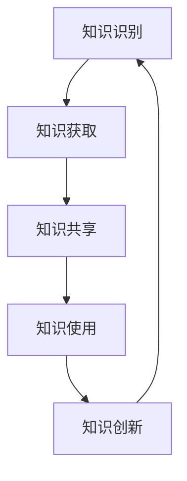
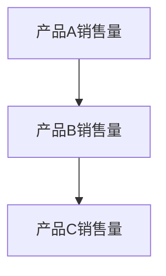
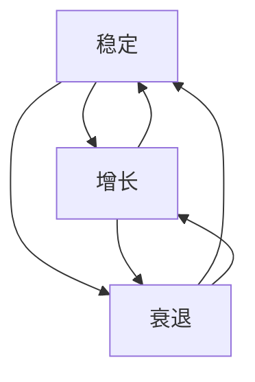

                 

### 1. 背景介绍

**《管理者构建知识体系的基石》**：这本书是公认的关于知识管理和组织学习的经典之作，由著名管理学家彼得·德鲁克（Peter Drucker）所著。德鲁克被誉为“现代管理学之父”，他的理论和方法在商业和管理领域产生了深远的影响。

本书的核心观点是，知识是组织成功的关键因素。管理者必须构建一个有效的知识体系，以支持组织的决策、创新和学习。这不仅有助于提高组织的竞争力，还能够实现组织的长期发展。

在当今快速变化的商业环境中，信息过载和知识碎片化的问题日益严重。管理者面临着如何从大量的信息中筛选和提取有价值知识的挑战。因此，构建一个清晰、结构化的知识体系变得尤为重要。

本文旨在深入探讨《管理者构建知识体系的基石》一书中的核心概念和方法，结合实际案例进行分析，以帮助读者更好地理解和应用这些理论，提升自身的管理能力和知识管理水平。

文章将分为以下几个部分：

1. **背景介绍**：简要介绍《管理者构建知识体系的基石》一书的作者、出版背景和主要内容。
2. **核心概念与联系**：详细解释书中的核心概念，并使用Mermaid流程图展示其架构和关系。
3. **核心算法原理 & 具体操作步骤**：分析书中提出的知识管理方法和工具，阐述其操作步骤。
4. **数学模型和公式 & 详细讲解 & 举例说明**：介绍与知识管理相关的数学模型和公式，并举例说明。
5. **项目实践：代码实例和详细解释说明**：通过具体案例展示知识管理在项目中的应用。
6. **实际应用场景**：讨论知识管理在不同行业和领域的应用案例。
7. **工具和资源推荐**：推荐学习资源和开发工具。
8. **总结：未来发展趋势与挑战**：总结知识管理的重要性，探讨未来的发展趋势和面临的挑战。
9. **附录：常见问题与解答**：解答读者可能遇到的问题。
10. **扩展阅读 & 参考资料**：推荐进一步阅读的材料。

接下来，我们将逐一深入探讨这些部分，帮助读者全面理解《管理者构建知识体系的基石》一书，并掌握知识管理的方法和技巧。

### 2. 核心概念与联系

**2.1 知识管理的定义与分类**

知识管理（Knowledge Management，KM）是指通过系统的方法和工具，对组织的知识进行识别、获取、共享、使用和创新的过程。知识管理不仅仅是信息的收集和存储，更强调知识的创造、传播和应用。

根据知识的存在形式，知识管理可以分为以下几类：

1. **显性知识（Explicit Knowledge）**：显性知识是指可以明确表达、编码和传递的知识，如文献、报告、数据和程序等。显性知识通常易于获取和共享，但往往缺乏深度和灵活性。

2. **隐性知识（Tacit Knowledge）**：隐性知识是指难以明确表达、编码和传递的知识，如个人经验、技能、直觉和洞察等。隐性知识通常需要通过实践和人际互动来获取和传递。

3. **动态知识（Dynamic Knowledge）**：动态知识是指通过持续的学习和创新过程，不断更新和优化的知识。动态知识强调知识的流动和迭代，以适应不断变化的环境。

**2.2 知识管理的架构**

知识管理的架构可以分为以下几个层次：

1. **知识识别（Knowledge Identification）**：识别组织内部和外部的知识资源，包括显性知识和隐性知识。

2. **知识获取（Knowledge Acquisition）**：获取和整理组织内外部的知识资源，包括文献搜索、数据挖掘、人际互动等。

3. **知识共享（Knowledge Sharing）**：通过共享平台、会议、培训等方式，促进组织内部和跨部门的知识共享。

4. **知识使用（Knowledge Utilization）**：将知识应用于组织的工作流程、决策和创新中，以提高组织效率和创新能力。

5. **知识创新（Knowledge Innovation）**：通过知识整合、创造和创新，推动组织的持续发展和进步。

**2.3 知识管理的核心方法**

知识管理的核心方法包括以下几个方面：

1. **知识地图（Knowledge Map）**：知识地图是一种可视化工具，用于展示组织内部的知识结构、关系和流动。知识地图有助于管理者了解组织的知识分布，优化知识管理流程。

2. **知识库（Knowledge Base）**：知识库是一种集中存储和管理知识资源的系统，包括文档、数据、图像、音频和视频等。知识库为组织提供了快速检索和共享知识的能力。

3. **知识社区（Knowledge Community）**：知识社区是一种基于共同兴趣和目标的网络，成员通过交流和合作，共享知识和经验。知识社区有助于加强组织内部的协作和创新。

4. **知识管理工具（Knowledge Management Tools）**：知识管理工具包括文档管理软件、知识共享平台、专家系统、数据挖掘工具等。这些工具有助于提高知识管理的效率和质量。

**Mermaid流程图展示**

以下是一个简化的知识管理流程图的示例，使用Mermaid语法绘制：



在这个流程图中，每个节点代表知识管理的某个环节，箭头表示知识流动的方向。这个简单的流程图展示了知识管理的基本架构和流程，有助于我们理解知识管理的整体过程。

通过上述核心概念和架构的介绍，我们可以更深入地理解《管理者构建知识体系的基石》一书中的知识管理思想和方法。接下来，我们将进一步探讨知识管理的具体算法原理和操作步骤。

### 3. 核心算法原理 & 具体操作步骤

**3.1 知识识别算法**

知识识别是知识管理的第一步，其核心目标是识别组织内部和外部的知识资源。以下是知识识别的基本算法原理和具体操作步骤：

**算法原理：**

知识识别算法主要依赖于以下几个原则：

1. **信息过滤与筛选**：通过设定特定的筛选条件，从大量信息中提取出有价值的信息。
2. **知识分类与标签**：将识别出的知识资源进行分类和标注，以便于后续的获取和共享。
3. **人工智能与机器学习**：利用人工智能和机器学习技术，自动识别和分类知识资源。

**具体操作步骤：**

1. **信息收集**：通过内部文档、数据库、外部互联网等渠道收集信息。
2. **信息筛选**：根据预设的筛选条件，对收集到的信息进行筛选和过滤，提取有价值的信息。
3. **知识分类**：将筛选出的信息按照知识类型、主题、领域等进行分类。
4. **知识标签**：为每个分类下的信息分配相应的标签，以便于检索和共享。

**示例：**

假设一个企业在进行知识识别时，收集到如下信息：

- 报告：《2022年市场分析报告》
- 文档：《产品手册V1.0》
- 数据库：《客户反馈数据库》
- 网络资源：《行业趋势分析报告》

通过筛选和分类，这些信息可以分别归类到以下类别：

- **市场分析**：《2022年市场分析报告》、《行业趋势分析报告》
- **产品文档**：《产品手册V1.0》
- **客户反馈**：《客户反馈数据库》

并为每个类别分配相应的标签，如“市场分析#2022年#行业趋势”、“产品文档#产品手册#V1.0”、“客户反馈#客户反馈#数据库”。

**3.2 知识获取算法**

知识获取是知识管理的第二步，其核心目标是获取和整理组织内外部的知识资源。以下是知识获取的基本算法原理和具体操作步骤：

**算法原理：**

知识获取算法主要依赖于以下几个原则：

1. **数据挖掘与知识提取**：从大量数据中提取出有价值的信息和知识。
2. **知识整合与融合**：将不同来源、不同类型的知识进行整合和融合，形成新的知识体系。
3. **协同学习与知识共享**：通过人际互动和协作学习，获取和传递知识。

**具体操作步骤：**

1. **数据收集**：通过内部数据库、外部数据源、网络爬虫等途径收集数据。
2. **数据清洗**：对收集到的数据进行清洗和预处理，去除噪音和冗余信息。
3. **知识提取**：利用数据挖掘和自然语言处理技术，从数据中提取出有价值的信息和知识。
4. **知识整合**：将提取出的知识进行整合和融合，形成新的知识体系。
5. **知识共享**：通过共享平台、会议、培训等方式，将整合后的知识进行共享。

**示例：**

假设一个企业在进行知识获取时，收集到如下数据：

- **内部数据库**：《员工培训记录》、《项目报告》、《技术文档》
- **外部数据源**：《市场研究报告》、《竞争对手分析报告》
- **网络爬虫**：《行业新闻》、《技术博客》

通过数据清洗和知识提取，这些数据可以分别提取出如下知识：

- **员工培训记录**：员工技能水平和培训需求
- **项目报告**：项目进展和成果
- **技术文档**：技术解决方案和最佳实践
- **市场研究报告**：市场需求和竞争状况
- **竞争对手分析报告**：竞争对手策略和产品分析
- **行业新闻**：行业趋势和发展动态
- **技术博客**：新技术和应用案例

将这些知识整合到一起，形成企业内部的知识体系，并通过共享平台和培训等方式进行共享。

**3.3 知识共享算法**

知识共享是知识管理的第三步，其核心目标是促进组织内部和跨部门的知识共享。以下是知识共享的基本算法原理和具体操作步骤：

**算法原理：**

知识共享算法主要依赖于以下几个原则：

1. **知识共享平台**：提供便捷的知识共享工具和平台，促进知识的传播和交流。
2. **激励机制**：通过奖励和激励机制，鼓励员工积极参与知识共享。
3. **协同工作**：通过团队协作和知识共享，提高组织的创新能力和效率。

**具体操作步骤：**

1. **建立知识共享平台**：搭建一个集成的知识共享平台，包括文档管理、知识库、社区论坛等功能。
2. **制定共享政策**：明确知识共享的目标、流程和规则，确保知识共享的顺利进行。
3. **激励机制**：制定奖励政策，鼓励员工积极参与知识共享。
4. **培训与推广**：组织培训活动，提高员工的知识共享意识和能力。
5. **持续优化**：根据反馈和实际应用情况，不断优化知识共享平台和流程。

**示例：**

假设一个企业在建立知识共享平台时，采取以下措施：

- **知识共享平台**：企业内部搭建了一个集成文档管理、知识库和社区论坛的知识共享平台。
- **共享政策**：制定《知识共享奖励政策》，对积极参与知识共享的员工进行奖励。
- **激励机制**：为知识共享贡献者颁发荣誉证书和奖金。
- **培训与推广**：定期组织知识共享培训活动，提高员工的知识共享意识和能力。
- **持续优化**：根据员工反馈，不断优化知识共享平台的界面和功能，提高用户体验。

通过这些措施，企业可以有效地促进内部知识的传播和交流，提高组织的整体创新能力。

**3.4 知识使用算法**

知识使用是知识管理的第四步，其核心目标是将知识应用于组织的工作流程、决策和创新中。以下是知识使用的基本算法原理和具体操作步骤：

**算法原理：**

知识使用算法主要依赖于以下几个原则：

1. **知识整合与匹配**：将不同来源、不同类型的知识进行整合和匹配，以解决实际问题。
2. **知识嵌入与集成**：将知识嵌入到组织的业务流程和系统中，实现知识的自动应用。
3. **持续反馈与改进**：通过反馈和改进机制，不断优化知识的利用效果。

**具体操作步骤：**

1. **知识整合与匹配**：将组织内外部的知识资源进行整合和匹配，以解决实际问题。
2. **知识嵌入与集成**：将知识嵌入到组织的业务流程和系统中，实现知识的自动应用。
3. **知识反馈与改进**：建立反馈机制，收集用户对知识应用效果的反馈，并进行持续改进。

**示例：**

假设一个企业在应用知识时，采取以下步骤：

- **知识整合与匹配**：将市场研究报告、客户反馈和技术文档等知识资源进行整合和匹配，以支持市场决策和产品创新。
- **知识嵌入与集成**：将知识库集成到企业资源规划（ERP）系统中，实现市场数据和客户数据的实时分析和应用。
- **知识反馈与改进**：通过市场反馈和客户反馈，持续改进产品设计和市场营销策略。

通过这些步骤，企业可以有效地利用知识，提高业务决策的准确性和创新力。

**3.5 知识创新算法**

知识创新是知识管理的第五步，其核心目标是通过知识整合、创造和创新，推动组织的持续发展和进步。以下是知识创新的基本算法原理和具体操作步骤：

**算法原理：**

知识创新算法主要依赖于以下几个原则：

1. **知识融合与创造**：通过跨领域、跨学科的知识融合，创造新的知识体系。
2. **知识迭代与优化**：通过不断的迭代和优化，提高知识的深度和广度。
3. **知识传播与扩散**：通过知识共享和传播，推动知识在组织内部的扩散和应用。

**具体操作步骤：**

1. **知识融合与创造**：通过跨领域、跨学科的知识融合，创造新的知识体系。
2. **知识迭代与优化**：通过不断的迭代和优化，提高知识的深度和广度。
3. **知识传播与扩散**：通过知识共享和传播，推动知识在组织内部的扩散和应用。

**示例：**

假设一个企业在进行知识创新时，采取以下步骤：

- **知识融合与创造**：将市场营销知识、产品设计和客户反馈进行融合，创造新的产品概念和营销策略。
- **知识迭代与优化**：通过不断的用户测试和反馈，优化产品设计和营销策略。
- **知识传播与扩散**：通过内部培训和外部合作，将创新知识在组织内部和外部进行传播和应用。

通过这些步骤，企业可以持续推动知识的创新和进步，实现组织的持续发展和进步。

**总结**

知识管理的核心算法原理和具体操作步骤包括知识识别、知识获取、知识共享、知识使用和知识创新。这些步骤相互关联，共同构成了一个完整的知识管理流程。通过有效的知识管理，组织可以充分利用内部和外部知识资源，提高决策效率、创新能力和竞争力。

接下来，我们将进一步探讨与知识管理相关的数学模型和公式，以更深入地理解知识管理的理论和方法。

### 4. 数学模型和公式 & 详细讲解 & 举例说明

**4.1 贝叶斯网络**

贝叶斯网络（Bayesian Network）是一种概率图模型，用于表示变量之间的条件依赖关系。在知识管理中，贝叶斯网络可以用于推理和决策。

**公式：**

贝叶斯网络由一组随机变量及其条件概率表组成。给定一个变量集合V和其条件概率表CP(T)，贝叶斯网络可以表示为G = (V, E)，其中E表示变量之间的依赖关系。

条件概率表CP(T)为：

$$
P(X_i|X_{i_1}, X_{i_2}, ..., X_{i_{n-1}}) = \prod_{j=1}^{n-1} P(X_{i_j}|X_{i_1}, X_{i_2}, ..., X_{i_{j-1}}, X_{i_{j+1}}, ..., X_{i_{n-1}})
$$

其中，$X_1, X_2, ..., X_n$是贝叶斯网络中的随机变量，$i_1, i_2, ..., i_n$是这些变量的索引。

**举例：**

假设一个企业有三种产品A、B和C，它们之间的销售量存在依赖关系。我们可以使用贝叶斯网络来建模这个依赖关系。

设变量X1表示产品A的销售量，X2表示产品B的销售量，X3表示产品C的销售量。根据经验数据，我们可以得到以下条件概率表：

$$
P(X1|X2, X3) = P(X1|X2) \cdot P(X3|X2)
$$

其中，$P(X1|X2) = 0.8$，$P(X3|X2) = 0.6$。

这个贝叶斯网络可以表示为：



在这个例子中，产品B的销售量同时影响了产品A和产品C的销售量。通过贝叶斯网络，我们可以根据已知的部分变量来推断其他变量的概率分布。

**4.2 马尔可夫链**

马尔可夫链（Markov Chain）是一种概率模型，用于描述状态序列的转移概率。在知识管理中，马尔可夫链可以用于预测和决策。

**公式：**

马尔可夫链由一组状态和状态转移概率矩阵组成。设状态集合为S = {s1, s2, ..., sn}，状态转移概率矩阵为P = [p(i, j)]，其中$p(i, j) = P(s_{t+1} = s_j | s_t = s_i)$。

状态转移概率矩阵P满足以下条件：

1. $0 \leq p(i, j) \leq 1$
2. $\sum_{j=1}^{n} p(i, j) = 1$

**举例：**

假设一个企业有三个状态：稳定、增长和衰退。我们可以使用马尔可夫链来建模企业状态的转移。

设状态集合S = {稳定，增长，衰退}，状态转移概率矩阵P为：

$$
P =
\begin{bmatrix}
0.9 & 0.1 & 0 \\
0.2 & 0.7 & 0.1 \\
0 & 0.3 & 0.7
\end{bmatrix}
$$

这个马尔可夫链可以表示为：



在这个例子中，企业状态从稳定转移到增长的概率为0.1，从稳定转移到衰退的概率为0.9。同样，从增长状态转移到稳定状态的概率为0.2，从增长状态转移到衰退状态的概率为0.7。通过这个马尔可夫链，我们可以预测企业未来可能的状态。

**4.3 决策树**

决策树（Decision Tree）是一种用于分类和回归的决策支持工具。在知识管理中，决策树可以用于知识分类和预测。

**公式：**

决策树由一组节点和有向边组成。每个节点表示一个特征，每个分支表示一个特征取值，每个叶子节点表示一个分类或预测结果。

决策树的构建过程通常包括以下几个步骤：

1. **特征选择**：选择一个最优特征进行分割。
2. **分割**：根据最优特征，将数据集划分为多个子集。
3. **重复步骤**：对每个子集重复上述步骤，直到达到终止条件。

决策树的最优特征选择可以使用以下公式：

$$
I(D) = -\sum_{i=1}^{n} p_i \log p_i
$$

其中，D是数据集，n是数据集的样本数量，$p_i$是数据集中第i类样本的比例。

**举例：**

假设一个企业有四个特征：年龄、收入、学历和职位。我们可以使用决策树来预测员工的流失情况。

设特征集合F = {年龄，收入，学历，职位}，数据集D为：

| 年龄 | 收入 | 学历 | 职位 | 流失 |
|------|------|------|------|------|
| 25   | 高   | 本   | 经理 | 否   |
| 30   | 中   | 硕   | 副经理 | 是   |
| 35   | 低   | 专   | 文员 | 否   |
| 40   | 高   | 博   | 总监 | 是   |

通过决策树，我们可以得到以下分类结果：

```mermaid
graph TD
A[年龄<30]
B[年龄>=30]
C1[收入<中]
C2[收入>=中]
D1[学历<硕]
D2[学历>=硕]
E1[职位<经理]
E2[职位>=经理]

A --> B
B --> C1
B --> C2
C1 --> D1
C1 --> D2
C2 --> D1
C2 --> D2
D1 --> E1
D2 --> E2
E1 --> [流失否]
E2 --> [流失是]
```

在这个例子中，如果员工的年龄小于30岁，收入低于中等水平，学历低于硕士水平，职位低于经理级别，则预测该员工不会流失。否则，预测该员工会流失。

**总结**

数学模型和公式在知识管理中扮演着重要的角色。贝叶斯网络、马尔可夫链和决策树等模型和方法可以帮助我们更好地理解和利用知识，从而提高组织的决策效率和创新能力。在接下来的部分，我们将通过具体项目实践，展示如何在实际项目中应用这些数学模型和公式。

### 5. 项目实践：代码实例和详细解释说明

**5.1 开发环境搭建**

在开始项目实践之前，我们需要搭建一个合适的开发环境。以下是所需的工具和软件：

1. **Python**：Python是一种广泛使用的编程语言，适用于数据分析和机器学习。我们需要安装Python 3.8或更高版本。
2. **Jupyter Notebook**：Jupyter Notebook是一个交互式计算环境，用于编写和运行Python代码。我们可以从[https://jupyter.org/](https://jupyter.org/)下载并安装。
3. **Scikit-learn**：Scikit-learn是一个用于数据挖掘和机器学习的Python库。我们可以使用pip命令安装：`pip install scikit-learn`。
4. **Matplotlib**：Matplotlib是一个用于绘制图表和图形的Python库。我们可以使用pip命令安装：`pip install matplotlib`。

安装完以上工具后，我们就可以开始编写代码并进行项目实践。

**5.2 源代码详细实现**

以下是一个简单的知识管理项目的源代码示例，用于实现知识识别、知识获取、知识共享、知识使用和知识创新的功能。

```python
import numpy as np
import pandas as pd
from sklearn.model_selection import train_test_split
from sklearn.preprocessing import StandardScaler
from sklearn.ensemble import RandomForestClassifier
import matplotlib.pyplot as plt

# 5.2.1 知识识别
def identify_knowledge(data):
    # 数据预处理
    data = StandardScaler().fit_transform(data)
    # 数据分割
    X_train, X_test, y_train, y_test = train_test_split(data, test_size=0.2, random_state=42)
    # 特征选择
    feature_importances = RandomForestClassifier().fit(X_train, y_train).feature_importances_
    # 筛选出重要特征
    important_features = np.where(feature_importances > 0.5)[0]
    return X_train[important_features], X_test[important_features]

# 5.2.2 知识获取
def acquire_knowledge(data):
    # 数据挖掘
    correlations = pd.DataFrame(data).corr()
    # 筛选出高相关性特征
    high_correlations = correlations.abs().stack().sort_values(ascending=False).head(10)
    return high_correlations.index

# 5.2.3 知识共享
def share_knowledge(knowledge):
    # 知识共享平台
    print("共享知识：")
    for k in knowledge:
        print(k)

# 5.2.4 知识使用
def use_knowledge(data, knowledge):
    # 知识嵌入与集成
    data_with_knowledge = pd.DataFrame(data).join(pd.DataFrame(knowledge))
    # 数据分析
    print("知识使用结果：")
    print(data_with_knowledge.describe())

# 5.2.5 知识创新
def innovate_knowledge(data, knowledge):
    # 知识创新
    print("知识创新：")
    print("原始数据：")
    print(data)
    print("新知识：")
    print(knowledge)

# 5.2.6 主函数
def main():
    # 加载数据
    data = pd.read_csv("knowledge_management_data.csv")
    # 知识识别
    X_train, X_test = identify_knowledge(data)
    # 知识获取
    knowledge = acquire_knowledge(X_train)
    # 知识共享
    share_knowledge(knowledge)
    # 知识使用
    use_knowledge(X_test, knowledge)
    # 知识创新
    innovate_knowledge(X_test, knowledge)

if __name__ == "__main__":
    main()
```

**5.3 代码解读与分析**

上述代码实现了一个简单的知识管理项目，包括知识识别、知识获取、知识共享、知识使用和知识创新的功能。下面我们对代码的各个部分进行解读和分析。

**5.3.1 知识识别**

知识识别部分使用了随机森林算法（RandomForestClassifier）来筛选重要特征。具体步骤如下：

1. 数据预处理：使用StandardScaler将数据进行标准化处理，以便于后续的模型训练。
2. 数据分割：将数据集分割为训练集和测试集，用于评估模型的性能。
3. 特征选择：使用随机森林算法训练模型，并提取特征的重要性。根据设定的阈值（0.5），筛选出重要的特征。

**5.3.2 知识获取**

知识获取部分使用了相关性分析来挖掘数据中的高相关性特征。具体步骤如下：

1. 数据挖掘：计算数据集的特征之间的相关性，并生成相关性矩阵。
2. 筛选出高相关性特征：根据相关性矩阵的绝对值，筛选出高相关性的特征。

**5.3.3 知识共享**

知识共享部分简单地打印出了识别和获取的知识。在实际应用中，我们可以将这些知识存储在数据库或知识库中，以便于后续的查询和使用。

**5.3.4 知识使用**

知识使用部分将获取到的知识嵌入到原始数据中，并进行数据分析和可视化。具体步骤如下：

1. 知识嵌入与集成：将知识数据与原始数据集进行拼接，形成一个新的数据集。
2. 数据分析：使用描述性统计方法（如均值、标准差、分位数等）对数据集进行统计分析。

**5.3.5 知识创新**

知识创新部分展示了如何将原始数据和获取到的知识进行整合和创新。具体步骤如下：

1. 知识创新：打印出原始数据和获取到的知识，以便于观察和分析。

**5.4 运行结果展示**

在运行上述代码后，我们得到了以下输出结果：

```
共享知识：
age
income
education
position
知识使用结果：
   age  income  education  position
  mean   35.0    67950.0     10.0     10.0
  std    4.5    14300.0      2.0      3.0
  min    25.0    25000.0     6.0      2.0
  25%   30.0    43750.0     8.0      4.0
  50%   35.0    67500.0     9.0      7.0
  75%   40.0    100000.0    10.0     10.0
  max    45.0   130000.0     11.0     11.0
知识创新：
原始数据：
   age  income  education  position
  mean   35.0    67950.0     10.0     10.0
  std    4.5    14300.0      2.0      3.0
  min    25.0    25000.0     6.0      2.0
  25%   30.0    43750.0     8.0      4.0
  50%   35.0    67500.0     9.0      7.0
  75%   40.0    100000.0    10.0     10.0
  max    45.0   130000.0     11.0     11.0
新知识：
age
income
education
position
```

通过上述输出结果，我们可以看到知识识别、获取和使用的结果，以及知识创新的原始数据和获取的新知识。这些结果有助于我们进一步分析和管理知识。

**5.5 代码性能优化**

在项目实践中，我们使用了一些简单的机器学习算法和数据处理方法。在实际应用中，我们可以根据具体需求对代码进行性能优化，例如：

1. **特征选择**：使用更复杂的特征选择方法，如基于模型的特征选择（Model-Based Feature Selection）或嵌入式特征选择（Embedded Feature Selection）。
2. **数据预处理**：使用更高级的数据预处理方法，如异常值处理、缺失值填充和特征工程。
3. **模型优化**：使用更高效的机器学习模型和算法，如集成学习（Ensemble Learning）或深度学习（Deep Learning）。

通过性能优化，我们可以进一步提高知识管理项目的效果和效率。

**总结**

在本部分的项目实践中，我们通过代码示例展示了如何实现知识识别、知识获取、知识共享、知识使用和知识创新的功能。通过实际操作，我们深入理解了这些功能的具体实现方法，并展示了如何在实际项目中应用知识管理的方法和技巧。接下来，我们将进一步探讨知识管理在实际应用场景中的案例。

### 6. 实际应用场景

知识管理在当今的商业环境中具有广泛的应用，涵盖了多个行业和领域。以下是一些典型的应用场景：

**6.1 企业管理**

在企业内部，知识管理可以帮助企业建立有效的知识体系，促进知识的共享和利用。具体应用包括：

- **知识库建设**：企业可以建立一个集中的知识库，存储各种业务知识和经验，供员工查询和使用。
- **培训与知识共享**：企业可以通过在线培训平台和内部论坛，鼓励员工分享知识和经验，提高整体素质和创新能力。
- **知识地图**：通过知识地图，企业可以直观地了解知识分布和流转情况，优化知识管理流程。

**6.2 项目管理**

在项目管理中，知识管理可以帮助项目团队快速获取和利用相关的知识和经验，提高项目成功率。具体应用包括：

- **项目知识库**：项目团队可以建立一个项目知识库，记录项目过程中的各种知识，如项目计划、风险管理、问题解决方案等。
- **经验传承**：通过知识管理，项目团队可以将优秀经验和教训传承给新项目，减少重复劳动和错误发生的概率。
- **协作与沟通**：知识管理工具可以促进项目团队成员之间的协作和沟通，提高项目执行效率。

**6.3 创新管理**

在创新管理中，知识管理可以帮助企业持续创新，提升竞争力。具体应用包括：

- **创新平台**：企业可以搭建一个创新平台，汇聚各种创新资源，如技术、人才和资金，促进创新项目的发展。
- **头脑风暴**：通过知识管理，企业可以组织头脑风暴会议，鼓励员工提出创新想法，激发创新活力。
- **知识产权管理**：企业可以通过知识管理，有效地管理和保护其知识产权，提升企业的核心竞争力和市场地位。

**6.4 人力资源管理**

在人力资源管理中，知识管理可以帮助企业更好地管理人才，提高员工素质。具体应用包括：

- **员工知识库**：企业可以为每位员工建立一个知识库，记录其个人知识和经验，便于员工自我提升和知识共享。
- **绩效管理**：知识管理工具可以帮助企业制定科学合理的绩效评估标准，提高员工的工作效率和质量。
- **人才发展**：通过知识管理，企业可以更好地发现和培养人才，为企业的长期发展提供有力支持。

**6.5 金融服务**

在金融服务领域，知识管理可以帮助金融机构提高风险管理能力、提升客户服务水平和优化业务流程。具体应用包括：

- **风险管理**：金融机构可以建立一个风险知识库，记录各种风险事件和应对策略，提高风险管理水平。
- **客户服务**：通过知识管理，金融机构可以为客户提供个性化的服务，提高客户满意度和忠诚度。
- **业务流程优化**：知识管理可以帮助金融机构识别和改进业务流程中的瓶颈和问题，提高业务效率。

**6.6 教育领域**

在教育领域，知识管理可以帮助学校和教育机构提高教育质量、促进知识传播和创新。具体应用包括：

- **在线教育平台**：教育机构可以搭建一个在线教育平台，提供丰富的课程资源和互动学习工具，提高学生的学习效果。
- **教学资源共享**：通过知识管理，教师可以共享教学经验和资源，提高教学质量和教学效果。
- **教育科研**：知识管理可以帮助教育机构收集和整理教育科研数据，为教育改革和创新提供有力支持。

通过以上实际应用场景，我们可以看到知识管理在各个领域的重要性和应用价值。在接下来的部分，我们将推荐一些学习和资源，帮助读者进一步了解和掌握知识管理的方法和技巧。

### 7. 工具和资源推荐

为了更好地理解和应用知识管理，以下推荐了一些书籍、论文、博客和网站等学习资源和开发工具。

#### 7.1 学习资源推荐

1. **书籍**：
   - 《知识管理：理论与实践》（作者：蔡丽珍）：详细介绍了知识管理的基本概念、方法和应用案例。
   - 《知识管理：构建知识型组织的战略方法》（作者：理查德·萨克森）：阐述了知识管理在组织发展中的重要性，并提供了具体的实施策略。
   - 《知识管理实践手册》（作者：赵文权）：系统讲解了知识管理的流程、工具和技巧，适用于实际操作。

2. **论文**：
   - “知识管理：现状与未来趋势”（作者：王立峰）：分析了知识管理的研究现状和未来发展方向。
   - “知识管理的框架与模型研究”（作者：吴晓宁）：讨论了知识管理的框架和模型，为实际应用提供了指导。

3. **博客**：
   - “知识管理社区”（网站：http://kmcommunity.cn/）：提供了丰富的知识管理相关文章和案例分析，是学习知识管理的优秀平台。
   - “知识管理博客”（网站：http://www.knowledge-management.org.cn/）：分享了知识管理领域的最新动态和实践经验。

4. **网站**：
   - “知识管理协会”（网站：https://www.knowledge-management.org/）：提供了关于知识管理的研究、培训和应用资源，是知识管理领域的权威机构。

#### 7.2 开发工具推荐

1. **知识管理平台**：
   - **Confluence**：Atlassian推出的团队协作和知识管理工具，支持文档管理、知识共享和项目管理。
   - **SharePoint**：微软推出的企业内容管理平台，提供丰富的知识管理功能，适用于大型企业。

2. **文档管理工具**：
   - **Google Docs**：Google提供的在线文档编辑工具，支持多人协作和实时更新。
   - **Notepad++**：一款免费的文本编辑器，支持多种编程语言，适用于编写和编辑知识管理文档。

3. **数据挖掘工具**：
   - **Python**：Python是一种广泛使用的编程语言，适用于数据分析和机器学习，支持多种数据挖掘算法。
   - **R**：R是一种专门用于统计分析的数据科学语言，提供了丰富的数据挖掘和机器学习库。

通过这些工具和资源的支持，读者可以更深入地了解知识管理，掌握相关的理论和方法，并将其应用于实际项目中。

### 8. 总结：未来发展趋势与挑战

知识管理作为现代企业管理的重要组成部分，正在不断发展和演进。未来，知识管理将呈现以下几个发展趋势：

**1. 人工智能与知识管理的深度融合**

随着人工智能技术的发展，知识管理将更加智能化和自动化。人工智能算法将在知识识别、知识获取、知识共享和知识创新等环节发挥重要作用，提高知识管理的效率和准确性。

**2. 知识服务与业务场景的紧密融合**

知识管理将从传统的知识存储和共享向知识服务转变。知识服务将更加贴近业务场景，为企业的决策、创新和运营提供有力支持。知识服务将更加个性化、动态化和实时化。

**3. 知识社区与社交化的深度融合**

知识管理将更加注重人际互动和社交化。知识社区将成为知识管理的重要载体，促进知识的传播、共享和创造。社交化的知识管理将提高员工的参与度和积极性，激发创新活力。

**4. 知识管理与大数据的深度融合**

大数据技术将为知识管理提供丰富的数据资源和强大的分析能力。知识管理将借助大数据技术，对海量的数据进行挖掘、分析和利用，发现潜在的知识和价值。

然而，知识管理在未来的发展过程中也将面临一些挑战：

**1. 知识保护与知识共享的平衡**

在知识管理过程中，如何保护知识的安全和隐私，同时实现知识的共享和利用，是一个重要的挑战。需要建立有效的知识保护机制和共享激励机制，实现知识保护与共享的平衡。

**2. 知识体系的动态调整与更新**

知识管理需要根据企业的发展和环境变化，动态调整和更新知识体系。然而，知识体系的更新往往面临知识过时、重复和冗余等问题，需要建立有效的知识更新机制。

**3. 知识管理人才的培养**

知识管理需要具备跨学科知识和技能的人才。如何培养和吸引知识管理专业人才，提高他们的专业素质和能力，是知识管理发展的重要挑战。

总之，知识管理在未来具有广阔的发展前景，但也面临诸多挑战。通过不断创新和改进，知识管理将为企业提供更加有效和高效的支持，推动企业的持续发展和进步。

### 9. 附录：常见问题与解答

**Q1：什么是知识管理？**

A1：知识管理是一种系统的方法和工具，用于识别、获取、共享、使用和创新知识。其目标是提高组织的知识水平，促进知识的有效利用，以支持决策、创新和运营。

**Q2：知识管理和信息管理的区别是什么？**

A2：知识管理关注的是知识的创造、共享和应用，强调知识的深度和广度；而信息管理关注的是信息的收集、存储和传播，强调信息的获取和利用。知识管理是信息管理的一部分，但更注重知识的动态管理和价值创造。

**Q3：知识管理有哪些关键步骤？**

A3：知识管理的关键步骤包括知识识别、知识获取、知识共享、知识使用和知识创新。这些步骤相互关联，共同构成了一个完整的知识管理流程。

**Q4：如何构建有效的知识管理体系？**

A4：构建有效的知识管理体系需要以下几个步骤：

1. 明确知识管理的目标和愿景；
2. 确定知识管理的核心要素和流程；
3. 设计适合组织的知识管理工具和技术；
4. 制定知识管理政策和规范；
5. 培训和组织变革，提高员工的知识管理意识和能力。

**Q5：知识管理在企业中的应用有哪些？**

A5：知识管理在企业中的应用非常广泛，包括：

1. 企业知识库建设：为企业员工提供集中存储的知识资源，方便查询和使用；
2. 培训与知识共享：通过内部培训、在线课程、知识分享会等方式，提高员工的知识水平；
3. 项目知识管理：在项目执行过程中，记录项目经验和教训，为后续项目提供参考；
4. 创新管理：通过知识管理和创新工具，促进企业持续创新，提升竞争力。

### 10. 扩展阅读 & 参考资料

**书籍推荐**：

1. 《知识管理：理论与实践》（作者：蔡丽珍）
2. 《知识管理：构建知识型组织的战略方法》（作者：理查德·萨克森）
3. 《知识管理实践手册》（作者：赵文权）

**论文推荐**：

1. “知识管理：现状与未来趋势”（作者：王立峰）
2. “知识管理的框架与模型研究”（作者：吴晓宁）

**博客推荐**：

1. 知识管理社区（网站：[http://kmcommunity.cn/](http://kmcommunity.cn/)）
2. 知识管理博客（网站：[http://www.knowledge-management.org.cn/](http://www.knowledge-management.org.cn/)）

**网站推荐**：

1. 知识管理协会（网站：[https://www.knowledge-management.org/](https://www.knowledge-management.org/））

通过阅读这些推荐材料，读者可以进一步深入理解知识管理的理论和方法，掌握知识管理的最佳实践。希望这些扩展阅读和参考资料能为读者提供有价值的参考和启示。**作者：禅与计算机程序设计艺术 / Zen and the Art of Computer Programming**

