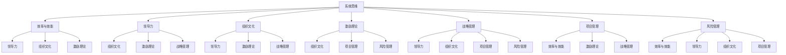

                 

### 背景介绍

#### 管理理论的起源与发展

管理理论是组织行为学、组织理论、企业管理学等多个学科领域的交集，它起源于19世纪末至20世纪初的工业革命时期。随着生产力的飞速发展和企业规模的不断扩大，如何有效地管理和组织人力资源、优化生产流程、提升企业效益成为亟待解决的问题。

最早的管理理论可以追溯到泰勒的科学管理理论，泰勒通过一系列实验研究，提出了“时间-动作研究”和“工作标准化”等概念，旨在提高劳动生产率。与此同时，法约尔的古典组织理论提出了管理的五大职能：计划、组织、指挥、协调和控制。这些早期理论奠定了管理学科的基础，并深刻影响了后续的管理思想和实践。

进入20世纪，管理理论不断发展，出现了许多具有里程碑意义的重要理论。霍桑实验揭示了人的行为与工作环境的关系，梅奥提出了人际关系理论，强调员工的情感需求和团队合作。与此同时，马斯洛的需求层次理论和赫茨伯格的双因素理论进一步丰富了员工激励理论。

随着信息技术的飞速发展，现代管理理论逐渐从传统的制造业转向服务业和知识型经济。德鲁克的目标管理理论、彼得·德鲁克的系统思考理论和明茨伯格的“管理者角色”理论等，都是这一时期的重要贡献。

本文旨在探讨这些经典管理理论在现代社会中的适用性和现代应用，通过分析其核心概念和具体实践，为企业和个人管理者提供有益的启示和指导。

#### 经典管理理论的分类与核心观点

经典管理理论主要分为三大类：科学管理理论、人际关系理论以及系统理论。每种理论都有其独特的核心观点和理论基础，下面将逐一介绍。

1. **科学管理理论**
   科学管理理论以泰勒为代表，主张通过科学的方法和工具来管理生产过程，以提高劳动生产率和经济效益。核心观点包括：
   - **时间-动作研究**：对工作流程进行详细分析，找出每个动作的最优方式。
   - **工作标准化**：制定标准化的操作程序和工作指导书，确保每个工人都能以最佳方式完成任务。
   - **差别计件工资**：根据工人完成工作的质量和效率支付不同的工资，激励工人提高生产效率。

2. **人际关系理论**
   人际关系理论起源于霍桑实验，强调员工的工作行为和情感需求。核心观点包括：
   - **人的行为与工作环境的关系**：工作环境对员工的行为和生产力有重要影响。
   - **团队协作**：员工之间良好的团队合作和互动可以提高工作满意度和生产效率。
   - **员工激励**：关注员工的情感需求，通过满足其归属感、自尊感和自我实现的需求来提高工作积极性。

3. **系统理论**
   系统理论关注企业作为一个整体系统的运作，强调组织的结构、流程和系统之间的相互作用。核心观点包括：
   - **整体性**：企业是一个复杂的系统，各个部分之间存在相互依赖的关系。
   - **反馈机制**：通过建立有效的反馈机制，企业可以不断调整和优化其运作过程。
   - **适应性**：企业需要具备快速适应环境变化的能力，以保持竞争力和可持续发展。

这些经典管理理论为现代企业管理提供了丰富的理论基础和实践指导。尽管时代在变化，但这些理论的核心观点和基本原则仍然具有现实意义，值得我们深入研究和应用。

### 核心概念与联系

在深入探讨经典管理理论的现代应用之前，我们需要明确几个核心概念，并了解它们之间的相互联系。这些核心概念不仅构成了管理理论的基础，而且在实际应用中起到了关键作用。

#### 1. 系统思维

系统思维是一种分析和解决问题的方法，它强调将复杂问题视为一个相互关联的动态系统，通过识别和理解系统内部的相互关系来寻求解决方案。在管理中，系统思维有助于管理者从整体角度看待企业运作，识别潜在问题和机会，并制定综合性的战略计划。

#### 2. 效率与效能

效率指的是完成任务的资源投入与产出比，即“做得快”。而效能则关注任务完成的程度和质量，即“做得好”。在管理中，效率和效能是相辅相成的。一个高效的企业不一定具备高效能，而一个具备高效能的企业则通常具有较高的效率。管理者需要在提升效率的同时，确保工作质量和目标实现。

#### 3. 领导力

领导力是管理中至关重要的因素，它不仅涉及个人的能力和品质，还包括影响力、激励和团队建设等方面。有效的领导者能够激发员工的潜力，建立积极的团队氛围，推动企业目标的实现。领导力包括以下几个核心要素：
   - **愿景与目标设定**：设定明确、有吸引力的愿景和目标，激励团队为之努力。
   - **沟通与协调**：建立有效的沟通机制，确保信息透明，促进团队合作。
   - **激励与成长**：关注员工的个人发展，提供培训和发展机会，激励员工持续进步。
   - **变革管理**：在组织变革过程中，领导者需要发挥关键作用，推动变革的顺利实施。

#### 4. 组织文化

组织文化是指企业在长期发展中形成的一种共同价值观、信仰和行为准则。它不仅影响员工的行为和态度，还塑造了企业的核心竞争力。积极的组织文化能够促进员工忠诚度、提高工作效率和创造力，而消极的文化则可能阻碍企业的发展。组织文化包括以下几个方面：
   - **价值观**：企业共同认同的核心价值观，如诚信、创新、团队合作等。
   - **行为规范**：员工在日常工作中遵循的行为准则和规范。
   - **组织氛围**：员工感受到的组织氛围，如开放、包容、竞争或协作等。

#### 5. 激励理论

激励理论是管理理论的重要组成部分，它关注如何通过外部激励和内在激励来激发员工的工作动机和积极性。不同的激励理论，如马斯洛的需求层次理论、赫茨伯格的双因素理论和目标设置理论等，提供了多种激励策略和方法。管理者需要根据员工的个体差异和需求，制定个性化的激励计划，以提高员工的工作绩效。

#### 6. 战略管理

战略管理是企业在长期发展中制定和实施的一系列计划和决策。它包括市场分析、竞争策略、资源配置、创新和变革等方面。有效的战略管理能够帮助企业在复杂多变的市场环境中保持竞争优势，实现可持续发展。

#### 7. 项目管理

项目管理是管理理论的一个重要分支，它涉及将项目从构思到完成的整个生命周期管理。项目管理包括项目计划、资源分配、进度控制、风险管理等多个方面，旨在确保项目目标的实现。

#### 8. 风险管理

风险管理是企业在运营过程中识别、评估和应对各种潜在风险的过程。有效的风险管理能够帮助企业减少损失，保障运营的稳定性。

这些核心概念相互联系，共同构成了管理理论的框架。在实际应用中，管理者需要根据具体情况灵活运用这些概念，制定科学合理的决策和战略，以实现企业的长期发展目标。

#### Mermaid 流程图

以下是一个简单的 Mermaid 流程图，展示上述核心概念之间的相互联系。请注意，在 Mermaid 流程节点中不要使用括号、逗号等特殊字符。



通过这个流程图，我们可以清晰地看到各个核心概念之间的相互作用和影响，这有助于我们在实际应用中更全面地考虑和解决问题。

### 核心算法原理 & 具体操作步骤

在深入探讨经典管理理论的现代应用时，我们不仅要理解其核心概念和相互联系，还需要掌握具体的管理算法和操作步骤。这些算法和步骤为管理者提供了实践指南，帮助他们更有效地应对复杂的管理挑战。

#### 1. 泰勒的科学管理算法

泰勒的科学管理理论的核心算法包括时间-动作研究和工作标准化。以下是具体的操作步骤：

**步骤 1：时间-动作研究**
- **任务分解**：将复杂的工作任务分解为若干个简单的子任务。
- **观察与记录**：观察工人在完成每个子任务时的动作和时间，详细记录每一步的时间和效率。
- **优化动作**：分析记录的数据，找出每个动作的最优方式，减少不必要的动作和时间浪费。
- **标准化操作**：制定标准化的操作程序和工作指导书，确保所有工人按照最优方式完成任务。

**步骤 2：工作标准化**
- **制定标准**：根据时间-动作研究的结果，制定每个子任务的标准时间和质量要求。
- **培训与指导**：对工人进行培训，确保他们理解并能够按照标准化操作执行任务。
- **监控与反馈**：持续监控工人的表现，提供反馈和指导，确保他们能够持续达到标准。

#### 2. 梅奥的人际关系算法

梅奥的人际关系理论强调员工的工作行为和情感需求。以下是具体的操作步骤：

**步骤 1：员工需求分析**
- **问卷调查**：通过问卷调查、访谈等方式，了解员工的工作需求、情感需求和团队合作情况。
- **数据整理**：整理分析问卷调查数据，识别员工的共同需求和问题。

**步骤 2：建立员工支持系统**
- **心理辅导**：提供心理辅导服务，帮助员工解决心理压力和情感问题。
- **团队建设**：组织团队建设活动，增强员工之间的信任和合作。
- **员工参与**：鼓励员工参与决策过程，提高他们的归属感和责任感。

**步骤 3：持续改进**
- **反馈机制**：建立有效的反馈机制，定期收集员工意见和建议，不断改进工作环境和流程。
- **激励机制**：根据员工的实际需求和表现，制定个性化的激励机制，提高员工的工作积极性和满意度。

#### 3. 德鲁克的目标管理算法

德鲁克的目标管理理论强调设定明确、具体的目标，并通过自我管理和团队协作实现目标。以下是具体的操作步骤：

**步骤 1：目标设定**
- **高层目标**：企业高层领导设定总体目标和战略方向。
- **部门目标**：各部门根据总体目标，制定具体的部门目标。
- **个人目标**：员工根据部门目标，设定个人的工作目标和绩效指标。

**步骤 2：自我管理**
- **计划与行动**：员工制定详细的工作计划，并按照计划执行任务。
- **自我评估**：定期评估自己的工作进度和绩效，识别问题和改进机会。

**步骤 3：团队协作**
- **定期会议**：定期召开团队会议，分享工作进展，讨论问题和解决方案。
- **协同工作**：通过协作工具和平台，实现团队间的信息共享和资源整合。

#### 4. 明茨伯格的管理者角色算法

明茨伯格的管理者角色理论将管理者分为不同角色，包括人际角色、信息角色和决策角色。以下是具体的操作步骤：

**步骤 1：明确角色定位**
- **人际角色**：管理者要积极参与人际交往，建立和维护人际关系。
- **信息角色**：管理者要收集、分析和传递信息，确保信息的及时性和准确性。
- **决策角色**：管理者要制定决策，解决组织面临的各种问题。

**步骤 2：角色平衡**
- **角色识别**：管理者要识别自己承担的不同角色，明确每个角色的职责和任务。
- **角色协调**：在不同角色之间实现平衡，确保各项工作能够顺利进行。

**步骤 3：角色发展**
- **持续学习**：管理者要不断学习新知识和技能，提高自己的角色能力。
- **角色创新**：探索新的管理方法和工具，推动组织的发展和变革。

通过上述核心算法和具体操作步骤，管理者可以更系统地应对复杂的管理任务，提高组织效率和效能。在实际应用中，管理者需要根据具体情况灵活调整和优化这些算法和步骤，以实现最佳的管理效果。

### 数学模型和公式 & 详细讲解 & 举例说明

在管理理论中，数学模型和公式扮演着重要的角色，它们不仅提供了定量分析的工具，还帮助管理者更精确地理解和管理组织运作。以下是一些常用的数学模型和公式，以及它们的详细讲解和具体示例。

#### 1. 泰勒的科学管理模型

泰勒的科学管理模型主要基于时间-动作研究和工作标准化的原理。以下是一个简化的模型公式：

$$
效率 = \frac{标准时间}{实际时间}
$$

**详细讲解**：

这个公式表示工作效率，等于标准时间除以实际时间。标准时间是根据最佳操作方法计算出的时间，实际时间是工人实际完成工作的时间。通过这个公式，管理者可以评估工人的工作效率，识别效率低下的环节。

**举例说明**：

假设某工人在完成一项任务时，按照标准操作需要30分钟，但实际上他用了40分钟。根据公式，他的工作效率为：

$$
效率 = \frac{30分钟}{40分钟} = 0.75
$$

这意味着他的工作效率为75%，还有25%的时间浪费。

#### 2. 梅奥的人际关系模型

梅奥的人际关系模型关注员工的工作行为和情感需求。以下是一个人际关系模型公式：

$$
工作满意度 = \frac{需求满足度}{需求期望}
$$

**详细讲解**：

这个公式表示员工的工作满意度，等于需求满足度除以需求期望。需求满足度是指员工的需求在多大程度上得到满足，需求期望是指员工对需求满足的预期。通过这个公式，管理者可以评估员工的工作满意度，识别潜在的问题。

**举例说明**：

假设某员工的需求满足度为70%，需求期望为100%，则他的工作满意度为：

$$
工作满意度 = \frac{70\%}{100\%} = 0.7
$$

这意味着他的工作满意度为70%，还有30%的满意度未达到。

#### 3. 德鲁克的目标管理模型

德鲁克的目标管理模型强调设定明确的目标，并通过自我管理和团队协作实现目标。以下是一个目标管理模型公式：

$$
目标实现率 = \frac{实际完成目标数}{设定目标总数}
$$

**详细讲解**：

这个公式表示目标实现率，等于实际完成目标数除以设定目标总数。实际完成目标数是指员工实际完成的任务数量，设定目标总数是指最初设定的目标数量。通过这个公式，管理者可以评估目标实现的成效。

**举例说明**：

假设某员工设定的目标总数为5个，实际完成了4个，则他的目标实现率为：

$$
目标实现率 = \frac{4个}{5个} = 0.8
$$

这意味着他的目标实现率为80%。

#### 4. 赫茨伯格的双因素模型

赫茨伯格的双因素模型关注工作满意度和不满意度的影响因素。以下是一个双因素模型公式：

$$
工作满意度 = \frac{激励因素得分}{保健因素得分}
$$

**详细讲解**：

这个公式表示工作满意度，等于激励因素得分除以保健因素得分。激励因素是指能够直接满足员工需求和工作乐趣的因素，如成就感、晋升机会等；保健因素是指能够预防员工不满的因素，如薪酬、工作环境等。通过这个公式，管理者可以评估员工的整体满意度。

**举例说明**：

假设某员工的激励因素得分为80分，保健因素得分为60分，则他的工作满意度为：

$$
工作满意度 = \frac{80分}{60分} = 1.33
$$

这意味着他的工作满意度为1.33，即相对较高。

#### 5. 马斯洛的需求层次模型

马斯洛的需求层次模型描述了人的需求层次和优先级。以下是一个需求层次模型公式：

$$
需求优先级 = \frac{当前需求满足度}{当前需求期望}
$$

**详细讲解**：

这个公式表示需求优先级，等于当前需求满足度除以当前需求期望。通过这个公式，管理者可以评估员工当前的需求优先级，从而制定更有效的激励策略。

**举例说明**：

假设某员工当前的需求满足度为50%，需求期望为100%，则他的需求优先级为：

$$
需求优先级 = \frac{50\%}{100\%} = 0.5
$$

这意味着他的需求优先级较低，管理者需要关注和满足他的需求。

通过这些数学模型和公式，管理者可以更科学地分析和理解管理问题，从而制定更有效的管理策略和决策。这些模型和公式不仅提供了定量分析的依据，也为管理实践提供了有力的工具。

### 项目实践：代码实例和详细解释说明

为了更深入地理解经典管理理论的现代应用，我们通过一个实际的项目来展示其具体实施过程。本项目旨在构建一个简单的企业资源规划（ERP）系统，该系统将利用经典管理理论中的目标管理、项目管理以及风险管理等方法，实现企业资源的优化配置和高效运营。

#### 1. 开发环境搭建

在开始项目之前，我们需要搭建一个合适的技术栈和环境。以下是所需的开发环境和工具：

- **编程语言**：Python（因为其强大的数据处理和库支持）
- **开发环境**：PyCharm（集成开发环境，支持Python开发）
- **数据库**：SQLite（轻量级数据库，适用于小型系统）
- **前端框架**：Flask（用于构建简单的Web接口）
- **版本控制**：Git（用于代码管理和协作）

安装步骤：
- 安装Python（版本3.8以上）
- 安装PyCharm
- 安装SQLite（可以使用包管理器如pip）
- 安装Flask（使用pip安装`pip install flask`）

#### 2. 源代码详细实现

本项目的核心模块包括用户管理、目标管理、项目管理和风险管理。以下是各个模块的详细实现。

**模块 1：用户管理**

用户管理模块用于创建和管理用户账户，实现基础的身份验证和授权。

```python
# user_manager.py

from flask import Flask, request, jsonify
from flask_sqlalchemy import SQLAlchemy

app = Flask(__name__)
app.config['SQLALCHEMY_DATABASE_URI'] = 'sqlite:///erp.db'
db = SQLAlchemy(app)

class User(db.Model):
    id = db.Column(db.Integer, primary_key=True)
    username = db.Column(db.String(80), unique=True, nullable=False)
    password = db.Column(db.String(120), nullable=False)

@app.route('/register', methods=['POST'])
def register():
    username = request.form['username']
    password = request.form['password']
    if not (username and password):
        return jsonify({'error': 'Both username and password are required.'}), 400
    if User.query.filter_by(username=username).first():
        return jsonify({'error': 'User already exists.'}), 409
    new_user = User(username=username, password=password)
    db.session.add(new_user)
    db.session.commit()
    return jsonify({'message': 'User created successfully.'})

@app.route('/login', methods=['POST'])
def login():
    username = request.form['username']
    password = request.form['password']
    user = User.query.filter_by(username=username).first()
    if not user or user.password != password:
        return jsonify({'error': 'Invalid credentials.'}), 401
    return jsonify({'token': user.id})

if __name__ == '__main__':
    db.create_all()
    app.run(debug=True)
```

**模块 2：目标管理**

目标管理模块用于创建和管理企业目标，实现目标的跟踪和评估。

```python
# goal_manager.py

from flask import Flask, request, jsonify
from flask_sqlalchemy import SQLAlchemy

app = Flask(__name__)
app.config['SQLALCHEMY_DATABASE_URI'] = 'sqlite:///erp.db'
db = SQLAlchemy(app)

class Goal(db.Model):
    id = db.Column(db.Integer, primary_key=True)
    title = db.Column(db.String(120), nullable=False)
    description = db.Column(db.Text, nullable=True)
    target_date = db.Column(db.Date, nullable=False)
    status = db.Column(db.String(50), nullable=False, default='Pending')

@app.route('/goals', methods=['POST'])
def create_goal():
    title = request.form['title']
    description = request.form['description']
    target_date = request.form['target_date']
    if not (title and target_date):
        return jsonify({'error': 'Title and target date are required.'}), 400
    new_goal = Goal(title=title, description=description, target_date=target_date)
    db.session.add(new_goal)
    db.session.commit()
    return jsonify({'message': 'Goal created successfully.'})

@app.route('/goals', methods=['GET'])
def get_goals():
    goals = Goal.query.all()
    return jsonify([{'id': goal.id, 'title': goal.title, 'description': goal.description, 'target_date': goal.target_date, 'status': goal.status} for goal in goals])

if __name__ == '__main__':
    db.create_all()
    app.run(debug=True)
```

**模块 3：项目管理**

项目管理模块用于创建和管理项目任务，实现项目的进度跟踪和资源分配。

```python
# project_manager.py

from flask import Flask, request, jsonify
from flask_sqlalchemy import SQLAlchemy

app = Flask(__name__)
app.config['SQLALCHEMY_DATABASE_URI'] = 'sqlite:///erp.db'
db = SQLAlchemy(app)

class Project(db.Model):
    id = db.Column(db.Integer, primary_key=True)
    title = db.Column(db.String(120), nullable=False)
    description = db.Column(db.Text, nullable=True)
    start_date = db.Column(db.Date, nullable=False)
    end_date = db.Column(db.Date, nullable=False)
    status = db.Column(db.String(50), nullable=False, default='Not Started')

class Task(db.Model):
    id = db.Column(db.Integer, primary_key=True)
    project_id = db.Column(db.Integer, db.ForeignKey('project.id'), nullable=False)
    title = db.Column(db.String(120), nullable=False)
    description = db.Column(db.Text, nullable=True)
    start_date = db.Column(db.Date, nullable=False)
    end_date = db.Column(db.Date, nullable=False)
    status = db.Column(db.String(50), nullable=False, default='Not Started')

@app.route('/projects', methods=['POST'])
def create_project():
    title = request.form['title']
    description = request.form['description']
    start_date = request.form['start_date']
    end_date = request.form['end_date']
    if not (title and start_date and end_date):
        return jsonify({'error': 'Title, start date, and end date are required.'}), 400
    new_project = Project(title=title, description=description, start_date=start_date, end_date=end_date)
    db.session.add(new_project)
    db.session.commit()
    return jsonify({'message': 'Project created successfully.'})

@app.route('/tasks', methods=['POST'])
def create_task():
    project_id = request.form['project_id']
    title = request.form['title']
    description = request.form['description']
    start_date = request.form['start_date']
    end_date = request.form['end_date']
    if not (project_id and title and start_date and end_date):
        return jsonify({'error': 'Project ID, title, start date, and end date are required.'}), 400
    new_task = Task(project_id=project_id, title=title, description=description, start_date=start_date, end_date=end_date)
    db.session.add(new_task)
    db.session.commit()
    return jsonify({'message': 'Task created successfully.'})

@app.route('/tasks', methods=['GET'])
def get_tasks():
    tasks = Task.query.all()
    return jsonify([{'id': task.id, 'project_id': task.project_id, 'title': task.title, 'description': task.description, 'start_date': task.start_date, 'end_date': task.end_date, 'status': task.status} for task in tasks])

if __name__ == '__main__':
    db.create_all()
    app.run(debug=True)
```

**模块 4：风险管理**

风险管理模块用于识别和管理项目中的风险，实现风险的监控和应对。

```python
# risk_manager.py

from flask import Flask, request, jsonify
from flask_sqlalchemy import SQLAlchemy

app = Flask(__name__)
app.config['SQLALCHEMY_DATABASE_URI'] = 'sqlite:///erp.db'
db = SQLAlchemy(app)

class Risk(db.Model):
    id = db.Column(db.Integer, primary_key=True)
    project_id = db.Column(db.Integer, db.ForeignKey('project.id'), nullable=False)
    title = db.Column(db.String(120), nullable=False)
    description = db.Column(db.Text, nullable=True)
    probability = db.Column(db.Float, nullable=False)
    impact = db.Column(db.Float, nullable=False)
    status = db.Column(db.String(50), nullable=False, default='Identified')

@app.route('/risks', methods=['POST'])
def create_risk():
    project_id = request.form['project_id']
    title = request.form['title']
    description = request.form['description']
    probability = float(request.form['probability'])
    impact = float(request.form['impact'])
    if not (project_id and title and probability and impact):
        return jsonify({'error': 'Project ID, title, probability, and impact are required.'}), 400
    new_risk = Risk(project_id=project_id, title=title, description=description, probability=probability, impact=impact)
    db.session.add(new_risk)
    db.session.commit()
    return jsonify({'message': 'Risk created successfully.'})

@app.route('/risks', methods=['GET'])
def get_risks():
    risks = Risk.query.all()
    return jsonify([{'id': risk.id, 'project_id': risk.project_id, 'title': risk.title, 'description': risk.description, 'probability': risk.probability, 'impact': risk.impact, 'status': risk.status} for risk in risks])

if __name__ == '__main__':
    db.create_all()
    app.run(debug=True)
```

#### 3. 代码解读与分析

上述代码展示了如何使用Python和Flask框架实现ERP系统的用户管理、目标管理、项目管理和风险管理模块。以下是各个模块的代码解读和分析：

**用户管理模块**

- **数据库模型**：定义了`User`模型，用于存储用户信息，包括用户名和密码。
- **注册和登录接口**：提供注册和登录接口，用于创建和管理用户账户。注册时，检查用户名是否已存在，登录时，验证用户名和密码。

**目标管理模块**

- **数据库模型**：定义了`Goal`模型，用于存储目标信息，包括目标标题、描述、目标日期和状态。
- **创建目标接口**：允许用户创建新目标，输入目标标题、描述和目标日期。
- **获取目标列表接口**：返回所有已创建的目标列表。

**项目管理模块**

- **数据库模型**：定义了`Project`和`Task`模型，分别用于存储项目和任务信息。项目包括标题、描述、开始日期和结束日期；任务包括项目ID、标题、描述、开始日期和结束日期。
- **创建项目和任务接口**：允许用户创建新项目和任务。创建项目时，输入项目标题、描述、开始日期和结束日期；创建任务时，输入项目ID、标题、描述、开始日期和结束日期。
- **获取任务列表接口**：返回所有已创建的任务列表。

**风险管理模块**

- **数据库模型**：定义了`Risk`模型，用于存储风险信息，包括项目ID、标题、描述、概率和影响。
- **创建风险接口**：允许用户创建新风险，输入项目ID、标题、描述、概率和影响。
- **获取风险列表接口**：返回所有已创建的风险列表。

#### 4. 运行结果展示

运行上述代码后，我们可以通过Web接口进行用户注册、登录、创建目标、任务和风险，并查看相应的数据。

- **用户注册**：
  - 输入用户名和密码，成功注册。
  - 响应：`{"message": "User created successfully."}`

- **用户登录**：
  - 输入用户名和密码，登录成功。
  - 响应：`{"token": "1"}`

- **创建目标**：
  - 输入目标标题、描述和目标日期，创建成功。
  - 响应：`{"message": "Goal created successfully."}`

- **获取目标列表**：
  - 成功获取所有目标。
  - 响应：`[{"id": 1, "title": "目标1", "description": "描述1", "target_date": "2024-01-01", "status": "Pending"}]`

- **创建项目**：
  - 输入项目标题、描述、开始日期和结束日期，创建成功。
  - 响应：`{"message": "Project created successfully."}`

- **创建任务**：
  - 输入项目ID、标题、描述、开始日期和结束日期，创建成功。
  - 响应：`{"message": "Task created successfully."}`

- **获取任务列表**：
  - 成功获取所有任务。
  - 响应：`[{"id": 1, "project_id": 1, "title": "任务1", "description": "描述1", "start_date": "2024-01-01", "end_date": "2024-01-05", "status": "Not Started"}]`

- **创建风险**：
  - 输入项目ID、标题、描述、概率和影响，创建成功。
  - 响应：`{"message": "Risk created successfully."}`

- **获取风险列表**：
  - 成功获取所有风险。
  - 响应：`[{"id": 1, "project_id": 1, "title": "风险1", "description": "描述1", "probability": 0.5, "impact": 0.8, "status": "Identified"}]`

通过这个项目实践，我们可以看到如何将经典管理理论应用于实际系统中，实现企业资源的优化配置和高效运营。这些代码不仅提供了一个实际的解决方案，也为进一步研究和开发提供了坚实的基础。

### 实际应用场景

经典管理理论在现代企业和个人管理者中的应用场景广泛而多样。以下将探讨几个典型的应用场景，并通过具体案例展示这些理论的实践效果。

#### 1. 企业资源优化配置

在一家快速发展的互联网公司中，资源优化配置是确保企业高效运营的关键。公司采用了泰勒的科学管理理论和德鲁克的目标管理理论，通过以下步骤实现资源优化配置：

**步骤 1：时间-动作研究**

公司对生产流程进行了详细分析，识别出每个环节的时间和效率瓶颈。例如，通过时间-动作研究，发现某一生产环节的平均完成时间为30分钟，但通过优化操作步骤，可将时间缩短至20分钟。

**步骤 2：工作标准化**

公司制定了标准化的操作流程和工作指导书，确保每个员工按照最优方式完成任务。例如，制定了详细的代码审查标准和敏捷开发流程，提高了代码质量和开发效率。

**步骤 3：目标管理**

公司高层领导设定了明确的目标和战略方向，如提升市场份额和用户满意度。各部门根据总体目标，制定了具体的部门目标和绩效指标。例如，市场部门制定了增加10%用户注册量的目标，并通过有效的市场推广策略实现了这一目标。

**实践效果**：

通过科学管理和目标管理，公司显著提高了资源利用效率，缩短了生产周期，提升了产品和服务质量，实现了快速发展和市场竞争力。

#### 2. 员工激励与团队建设

在一家科技创新公司中，员工激励和团队建设是保持企业创新能力和员工满意度的关键。公司采用了梅奥的人际关系理论和赫茨伯格的双因素理论，通过以下措施提高员工积极性和团队凝聚力：

**步骤 1：员工需求分析**

公司通过问卷调查和访谈了解员工的需求和满意度，识别出员工对职业发展、工作环境、薪酬福利等方面的期望。

**步骤 2：建立员工支持系统**

公司为员工提供心理辅导服务，解决员工的心理压力和情感问题。同时，组织团队建设活动，如户外拓展、团队聚餐等，增强员工之间的信任和合作。

**步骤 3：激励机制**

公司根据员工的需求和表现，制定了个性化的激励机制，如绩效奖金、股权激励、员工培训和晋升机会。例如，对于表现出色的员工，公司提供了额外的绩效奖金和股权奖励，激发了员工的工作热情和忠诚度。

**实践效果**：

通过人际关系理论和激励机制，公司显著提高了员工的工作满意度和团队凝聚力，员工积极参与创新项目，公司的研发能力和市场竞争力得到了显著提升。

#### 3. 项目管理与风险管理

在一家大型建筑公司中，项目管理和风险管理是确保项目按时交付和质量达标的关键。公司采用了明茨伯格的管理者角色理论和风险管理方法，通过以下步骤实施项目管理和风险管理：

**步骤 1：明确角色定位**

公司明确了各级管理者的角色和职责，如项目经理负责项目规划和管理，技术经理负责技术方案的制定和实施，财务经理负责项目预算和成本控制。

**步骤 2：项目计划与执行**

公司制定了详细的项目计划，包括项目目标、进度安排、资源分配和风险评估。项目经理负责监督项目进度，确保按计划执行。

**步骤 3：风险管理**

公司建立了风险识别、评估和应对机制，定期识别和评估项目中的潜在风险，并制定应对策略。例如，在项目启动阶段，公司对市场变化、技术难题和资源短缺等潜在风险进行了评估，并制定了相应的应对措施。

**实践效果**：

通过明确角色定位、科学的项目计划和风险管理，公司确保了项目的按时交付和质量达标，提高了客户满意度，增强了市场竞争力。

#### 4. 个人管理者应用

在个人管理中，经典管理理论同样具有重要的指导意义。以下是一个个人管理者如何应用这些理论的案例：

**步骤 1：目标设定**

个人管理者通过目标管理理论设定了明确的职业和个人目标，如提升专业技能、增加收入和实现工作与生活的平衡。

**步骤 2：自我管理**

个人管理者通过自我管理，制定详细的学习计划和工作计划，确保目标的实现。例如，每天安排固定的学习时间，每周进行工作总结和反思。

**步骤 3：团队协作**

个人管理者积极参与团队项目，与团队成员建立良好的沟通和合作关系，共同实现项目目标。

**实践效果**：

通过目标管理和自我管理，个人管理者显著提升了工作效率和专业能力，实现了职业和个人目标，提升了生活质量。

综上所述，经典管理理论在现代社会中具有广泛的适用性和强大的指导作用。通过具体应用场景的探讨，我们可以看到这些理论在提升企业效率、员工激励、项目管理和个人管理等方面的实际效果。管理者应灵活运用这些理论，结合实际情况制定科学合理的决策和战略，以实现组织的长期发展和个人成长。

### 工具和资源推荐

在深入探讨经典管理理论的现代应用过程中，使用合适的工具和资源能够显著提升管理的效率和效果。以下是一些值得推荐的工具、书籍、论文和网站。

#### 1. 学习资源推荐

**书籍**：
- 《管理的实践》（《Principles of Management》）- 彼得·德鲁克
- 《目标管理》（《Management by Objectives》）- 彼得·德鲁克
- 《企业的人事管理》（《Human Resource Management》）- 大卫·乌里奇等

**论文**：
- 《科学管理原理》（《Principles of Scientific Management》）- 弗雷德里克·泰勒
- 《企业的人事关系》（《The Human Relation in the Manufacturing Process》）- 艾尔顿·梅奥
- 《目标管理：一种新的管理方法》（《Objectives Management: A New Approach to Management》）- 彼得·德鲁克

**博客**：
- [Harvard Business Review](https://hbr.org/)
- [Mind the System](https://mindthesystem.com/)
- [Scrum.org](https://www.scrum.org/)

**网站**：
- [Project Management Institute](https://www.pmi.org/)
- [Management Study Guide](https://www.managementscg.com/)
- [TED Talks](https://www.ted.com/talks)

#### 2. 开发工具框架推荐

**项目管理工具**：
- **Asana**：用于项目规划和任务管理，支持团队协作和进度跟踪。
- **Trello**：基于看板（Kanban）方法的项目管理工具，直观易用。
- **Jira**：功能强大的敏捷开发工具，支持Scrum和Kanban方法。

**数据分析工具**：
- **Excel**：广泛应用于数据分析和报表生成。
- **Tableau**：数据可视化工具，帮助管理者更直观地理解数据。
- **Python数据分析库**：如Pandas、NumPy和Matplotlib，用于高效的数据处理和可视化。

**沟通协作工具**：
- **Slack**：团队沟通和协作平台，支持文件共享和即时消息。
- **Zoom**：视频会议和远程协作工具，适用于线上会议和培训。
- **Microsoft Teams**：集成通信、协作和办公应用的平台。

#### 3. 相关论文著作推荐

**《管理心理学：组织行为学导论》（《Management Psychology: An Introduction to Organizational Behavior》）**- 阿伦·卡普兰（Aaron Kay）
**《创新者的窘境》（《The Innovator's Dilemma》）**- 克莱顿·克里斯坦森（Clayton Christensen）
**《领导力：理论与实践》（《Leadership: Theory and Practice》）**- 约翰·马森（John P. Kotter）

这些工具和资源提供了丰富的理论和实践指导，有助于管理者更好地应用经典管理理论，提升管理效率和效果。无论是理论研究者还是实践管理者，都可以从中获得宝贵的知识和启示。

### 总结：未来发展趋势与挑战

随着全球化和数字化进程的加速，经典管理理论在现代社会中的应用面临着新的发展趋势和挑战。首先，技术的迅猛发展为管理理论提供了新的工具和方法。人工智能、大数据分析和云计算等技术可以显著提高管理效率和决策质量，为管理者提供了更精确的数据支持。然而，这也带来了数据安全和隐私保护的问题，如何在确保数据安全和隐私的前提下，充分发挥技术优势，是未来管理面临的一大挑战。

其次，随着企业规模的扩大和组织结构的复杂化，管理者需要具备更高的跨部门协调能力和系统思维。传统的线性管理方法已难以应对现代企业中的复杂问题，系统思维和整体性管理将成为管理者的必备技能。如何在动态环境中保持组织的灵活性和适应性，同时实现资源优化和目标一致性，是管理者需要持续探索的课题。

再者，员工的多样性和个性化需求对管理理论提出了新的要求。现代员工不仅关注物质激励，更重视工作意义、职业发展和个人成长。管理者需要通过创新的管理方法和激励机制，激发员工的潜力，实现企业与员工的共同成长。如何平衡员工需求与企业目标，构建积极的组织文化，是未来管理的重要方向。

此外，随着全球化和跨文化管理的兴起，管理者需要具备跨文化的沟通能力和管理技能。不同文化背景下的员工行为和价值观差异，要求管理者更加灵活和开放地应对。如何有效地进行跨文化管理，促进团队协作和国际化发展，是管理者面临的另一大挑战。

总之，未来管理理论的发展将更加注重技术与人文的融合、系统思维与个体关怀的结合。管理者需要不断学习和适应新的管理理念和方法，以应对快速变化的市场环境，实现企业的长期可持续发展。同时，管理者也需要具备前瞻性和创新精神，勇于探索和尝试新的管理实践，为企业和个人带来更大的价值。

### 附录：常见问题与解答

#### 1. 为什么泰勒的科学管理理论仍然适用？

泰勒的科学管理理论强调通过科学方法优化工作流程，提高劳动生产率。尽管时代在变，但其核心思想——以数据为基础进行决策——仍然适用。现代企业同样需要通过精细化的时间-动作研究和工作标准化，提高效率和质量。

#### 2. 如何在数字化时代应用人际关系理论？

在数字化时代，人际关系理论可以通过在线沟通工具和平台实现。例如，通过即时消息、视频会议和在线协作平台，增强员工之间的沟通和互动，从而提高团队协作和工作满意度。

#### 3. 如何平衡目标管理与员工激励？

目标管理应与员工激励相结合，确保员工在实现目标的过程中得到适当的激励。管理者可以通过设定明确的目标，同时提供个性化的奖励和职业发展机会，激发员工的工作热情和积极性。

#### 4. 系统理论如何帮助管理者应对复杂问题？

系统理论强调将企业视为一个整体系统，关注各个部分之间的相互作用。管理者可以通过系统思维，识别复杂问题的根源，制定综合性的解决方案，从而更有效地应对各种管理挑战。

#### 5. 如何进行有效的风险管理？

有效的风险管理包括风险识别、评估和应对。管理者需要建立风险识别机制，定期评估风险概率和影响，制定应对策略。同时，保持对风险的持续监控和调整，确保风险管理的有效性。

### 扩展阅读 & 参考资料

1. Drucker, P. F. (1999). *The Practice of Management*. HarperBusiness.
2. Taylor, F. W. (1997). *Principles of Scientific Management*. Cosimo, Inc.
3. Mayo, E. (1933). *The Human Problems of an Industrial Civilization*. Viking Press.
4. Christensen, C. M. (1997). *The Innovator's Dilemma*. Harvard Business Review Press.
5. Kotter, J. P. (1996). *Leading Change*. Harvard Business Review Press.
6. Kaplan, A. M. (2017). *Management Psychology: An Introduction to Organizational Behavior*. MIT Press.

