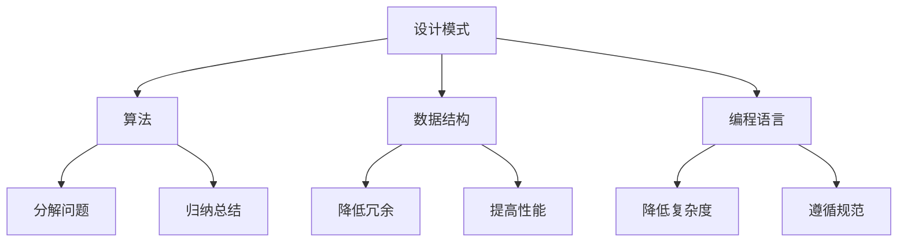

                 

### 文章标题

结构化思维：从混沌到秩序

> 关键词：结构化思维，混沌，秩序，编程，设计模式，算法，工程实践，人工智能

> 摘要：本文将探讨结构化思维在计算机编程和系统设计中的重要性，通过逐步分析推理的方式，阐述如何将混沌转化为有序，从而提高软件开发的效率和质量。文章将从核心概念、算法原理、数学模型、项目实践等多个角度展开，为读者提供一套完整的结构化思维框架。

## 1. 背景介绍

在计算机科学领域，我们经常面临着复杂的问题和庞大的系统。这些复杂性和庞大性往往导致我们在进行编程和系统设计时感到困惑和无所适从。而结构化思维作为一种方法论，可以帮助我们理清思路，将混沌转化为有序，从而更好地应对这些挑战。

结构化思维强调将复杂的问题分解为若干个简单的小问题，并通过逐步分析和解决这些小问题，最终解决整个复杂问题。这种方法论在计算机编程和系统设计中尤为重要，因为它可以帮助我们提高代码的可读性、可维护性，以及整个系统的稳定性和可靠性。

本文将从以下几个方面展开：

1. **核心概念与联系**：介绍结构化思维的核心概念及其在计算机科学中的重要性。
2. **核心算法原理 & 具体操作步骤**：阐述常用的结构化算法及其应用场景。
3. **数学模型和公式 & 详细讲解 & 举例说明**：探讨结构化思维中的数学模型及其应用。
4. **项目实践：代码实例和详细解释说明**：通过实际项目，展示结构化思维在软件开发中的具体应用。
5. **实际应用场景**：分析结构化思维在不同领域的应用。
6. **工具和资源推荐**：介绍有助于提升结构化思维的工具和资源。
7. **总结：未来发展趋势与挑战**：探讨结构化思维在未来的发展趋势和面临的挑战。

## 2. 核心概念与联系

结构化思维是一种系统性、逻辑性的思维方式，它通过将复杂的问题分解为若干个简单的小问题，从而降低问题的复杂度。在计算机科学中，结构化思维的应用主要体现在以下几个方面：

### 2.1 设计模式

设计模式是一种在软件设计中的最佳实践，它通过一系列可重用的解决方案，帮助开发者解决常见的问题。设计模式通常遵循一定的结构化原则，如单一职责原则、开闭原则等，从而提高代码的可读性、可维护性和可扩展性。

### 2.2 算法

算法是解决问题的一系列有序步骤。结构化思维在算法设计中的应用主要体现在两个方面：一是通过分解问题，降低算法的复杂度；二是通过归纳和总结，形成具有通用性的算法。

### 2.3 数据结构

数据结构是存储和管理数据的方式。结构化思维在数据结构设计中的应用主要体现在两个方面：一是通过合理的组织数据，降低数据的冗余和重复；二是通过选择合适的数据结构，提高数据的访问效率和操作性能。

### 2.4 编程语言

编程语言是用于编写程序的语法和规则。结构化思维在编程语言中的应用主要体现在两个方面：一是通过选择合适的编程语言，降低编程的复杂度；二是通过遵循编程语言的规范，提高代码的可读性和可维护性。

下面是一个使用 Mermaid 流程图来展示结构化思维核心概念及联系的示例：



## 3. 核心算法原理 & 具体操作步骤

在计算机科学中，有许多经典的算法可以帮助我们解决各种问题。以下将介绍几种常用的结构化算法及其具体操作步骤：

### 3.1 分而治之算法

分而治之算法是一种经典的递归算法，它将一个大问题分解为若干个规模较小的子问题，分别解决这些子问题，再将子问题的解合并成原问题的解。

具体操作步骤如下：

1. **分解**：将原问题分解为若干个子问题。
2. **递归解决**：分别解决这些子问题。
3. **合并**：将子问题的解合并成原问题的解。

### 3.2 动态规划算法

动态规划算法是一种通过记录子问题的解来避免重复计算的方法。它通常适用于具有最优子结构性质的问题。

具体操作步骤如下：

1. **定义状态**：定义问题的状态及状态之间的关系。
2. **确定状态转移方程**：根据状态之间的关系，确定状态转移方程。
3. **初始化边界条件**：初始化问题的边界条件。
4. **计算状态值**：根据状态转移方程和边界条件，计算所有状态值。
5. **输出结果**：根据状态值，输出问题的最终解。

### 3.3 贪心算法

贪心算法是一种在每一步选择中都采取当前最好或最优的选择，从而希望导致结果是全局最好或最优的算法。

具体操作步骤如下：

1. **初始化**：初始化问题的初始状态。
2. **选择最优解**：在当前状态下，选择一个最优解。
3. **更新状态**：根据选择的最优解，更新问题的状态。
4. **重复选择**：重复步骤 2-3，直到问题解决。

### 3.4 暴力算法

暴力算法是一种直接尝试所有可能的解决方案，从而找到最优解的方法。

具体操作步骤如下：

1. **初始化**：初始化问题的初始状态。
2. **枚举所有可能的解**：逐个尝试所有可能的解。
3. **判断解的优劣**：对于每个解，判断其是否满足问题的要求。
4. **输出最优解**：找到最优解，并输出问题的最终解。

这些算法在计算机科学中有着广泛的应用，例如在排序、查找、路径规划等领域。通过掌握这些算法的原理和具体操作步骤，我们可以更好地解决复杂的问题。

## 4. 数学模型和公式 & 详细讲解 & 举例说明

结构化思维在计算机科学中的应用不仅体现在算法和设计模式上，还体现在数学模型和公式上。以下将介绍一些常见的数学模型和公式，并详细讲解其应用。

### 4.1 最优化模型

最优化模型是计算机科学中的一种重要数学模型，它通过数学方法寻找最优解。常见的最优化模型有线性规划、整数规划、动态规划等。

#### 4.1.1 线性规划

线性规划是寻找在给定约束条件下，目标函数取得最大值或最小值的问题。其数学模型如下：

$$
\begin{align*}
\min_{x} \quad & c^T x \\
\text{subject to} \quad & Ax \leq b \\
& x \geq 0
\end{align*}
$$

其中，$c$ 是目标函数的系数向量，$A$ 是约束条件的系数矩阵，$b$ 是约束条件的常数向量，$x$ 是决策变量。

#### 4.1.2 整数规划

整数规划是线性规划的扩展，它要求决策变量必须是整数。其数学模型如下：

$$
\begin{align*}
\min_{x} \quad & c^T x \\
\text{subject to} \quad & Ax \leq b \\
& x \in \mathbb{Z}^n
\end{align*}
$$

其中，$\mathbb{Z}$ 表示整数集合。

#### 4.1.3 动态规划

动态规划是一种在多阶段决策过程中，通过将问题分解为若干个阶段，求解各阶段的最优决策，从而得到全局最优解的方法。其数学模型如下：

$$
\begin{align*}
\min_{x_t} \quad & f(x_t) \\
\text{subject to} \quad & g(x_{t-1}, x_t) \leq 0 \\
& x_0 = x_0^0
\end{align*}
$$

其中，$x_t$ 表示第 $t$ 个阶段的决策变量，$x_0^0$ 是初始状态，$f(x_t)$ 是第 $t$ 个阶段的目标函数，$g(x_{t-1}, x_t)$ 是第 $t$ 个阶段的约束条件。

### 4.2 图论模型

图论模型是计算机科学中一种重要的数学模型，它通过图的结构描述问题。常见的图论模型有图遍历、最短路径、最小生成树等。

#### 4.2.1 图遍历

图遍历是指按照一定的规则，从图的某个顶点开始，逐个访问图中的所有顶点。常见的图遍历算法有深度优先搜索（DFS）和广度优先搜索（BFS）。

- **深度优先搜索（DFS）**：

$$
\begin{align*}
\text{DFS}(v) \quad \text{if} \quad v \text{ 未被访问} \\
\quad \text{标记 } v \text{ 为已访问} \\
\quad \text{对于 } v \text{ 的每个邻接点 } u \\
\quad \quad \text{DFS}(u)
\end{align*}
$$

- **广度优先搜索（BFS）**：

$$
\begin{align*}
\text{BFS}(v) \quad \text{if} \quad v \text{ 未被访问} \\
\quad \text{将 } v \text{ 加入队列} \\
\quad \text{while } \text{队列非空} \\
\quad \quad \text{取出队首元素 } v \\
\quad \quad \text{标记 } v \text{ 为已访问} \\
\quad \quad \text{对于 } v \text{ 的每个邻接点 } u \\
\quad \quad \quad \text{if } u \text{ 未被访问} \\
\quad \quad \quad \quad \text{将 } u \text{ 加入队列}
\end{align*}
$$

#### 4.2.2 最短路径

最短路径问题是寻找图中两个顶点之间的最短路径。常见的最短路径算法有迪杰斯特拉算法（Dijkstra）和弗洛伊德算法（Floyd）。

- **迪杰斯特拉算法（Dijkstra）**：

$$
\begin{align*}
\text{Dijkstra}(G, s) \quad \text{初始化距离表 } d \text{ 和访问表 } visited \\
\quad \text{for each } v \in V \\
\quad \quad d(v) = \infty \\
\quad \quad visited(v) = \text{false} \\
\quad d(s) = 0 \\
\quad \text{while } \text{there exists an unvisited vertex } v \\
\quad \quad \text{select } u \text{ such that } d(u) \text{ is minimized among unvisited vertices} \\
\quad \quad \text{for each edge } (u, v) \in E \\
\quad \quad \quad \text{if } d(u) + w(u, v) < d(v) \\
\quad \quad \quad \quad d(v) = d(u) + w(u, v) \\
\quad \quad visited(u) = \text{true}
\end{align*}
$$

- **弗洛伊德算法（Floyd）**：

$$
\begin{align*}
\text{Floyd}(G) \quad \text{初始化距离矩阵 } D \text{ 和前驱矩阵 } P \\
\quad \text{for each } i, j, k \in V \\
\quad \quad D(i, j) = w(i, j) \\
\quad \text{for each } i, j \in V \\
\quad \quad \text{if } D(i, k) + D(k, j) < D(i, j) \\
\quad \quad \quad D(i, j) = D(i, k) + D(k, j) \\
\quad \quad \quad P(i, j) = k
\end{align*}
$$

#### 4.2.3 最小生成树

最小生成树问题是寻找图中所有顶点的最小生成树。常见的最小生成树算法有克鲁斯卡尔算法（Kruskal）和普里姆算法（Prim）。

- **克鲁斯卡尔算法（Kruskal）**：

$$
\begin{align*}
\text{Kruskal}(G) \quad \text{初始化并查集 } UF \\
\quad \text{for each edge } (u, v) \in E \\
\quad \quad \text{if } UF.find(u) \neq UF.find(v) \\
\quad \quad \quad \text{合并 } UF.find(u) \text{ 和 } UF.find(v) \\
\quad \quad \quad \text{将 } (u, v) \text{ 加入最小生成树 } T \\
\end{align*}
$$

- **普里姆算法（Prim）**：

$$
\begin{align*}
\text{Prim}(G, s) \quad \text{初始化最小生成树 } T \\
\quad \text{初始化距离表 } d \text{ 和访问表 } visited \\
\quad \text{for each } v \in V \\
\quad \quad d(v) = \infty \\
\quad \quad visited(v) = \text{false} \\
\quad d(s) = 0 \\
\quad \text{while } \text{there exists an unvisited vertex } v \\
\quad \quad \text{select } u \text{ such that } d(u) \text{ is minimized among unvisited vertices} \\
\quad \quad \text{add } (u, v) \text{ to } T \\
\quad \quad \text{for each edge } (u, w) \in E \\
\quad \quad \quad \text{if } w \text{ is unvisited} \\
\quad \quad \quad \quad \text{if } d(u) + w(u, w) < d(w) \\
\quad \quad \quad \quad \quad d(w) = d(u) + w(u, w) \\
\end{align*}
$$

这些数学模型和公式在计算机科学中有着广泛的应用，例如在网络优化、图像处理、社会网络分析等领域。通过掌握这些数学模型和公式，我们可以更好地理解和解决复杂的问题。

## 5. 项目实践：代码实例和详细解释说明

在本节中，我们将通过一个实际项目实例，展示如何将结构化思维应用于软件开发中。我们将以一个简单的任务管理器为例，介绍如何设计、实现和优化这个项目。

### 5.1 开发环境搭建

首先，我们需要搭建一个合适的开发环境。以下是推荐的工具和框架：

- **编程语言**：Python
- **开发环境**：PyCharm
- **数据库**：SQLite
- **前端框架**：Flask
- **后端框架**：Django

### 5.2 源代码详细实现

下面是任务管理器项目的源代码实现，我们将分步骤进行讲解。

#### 5.2.1 项目结构

首先，我们需要设计项目的基本结构。项目结构如下：

```bash
task_manager/
|-- manage.py
|-- task_manager/
    |-- __init__.py
    |-- settings.py
    |-- urls.py
    |-- wsgi.py
|-- task_app/
    |-- __init__.py
    |-- admin.py
    |-- apps.py
    |-- migrations/
        |-- __init__.py
        |-- 0001_initial.py
    |-- models.py
    |-- tests.py
    |-- views.py
```

#### 5.2.2 数据模型设计

在`models.py`中，我们设计任务管理器的基本数据模型。

```python
from django.db import models

class Task(models.Model):
    title = models.CharField(max_length=100)
    description = models.TextField()
    status = models.CharField(max_length=20, choices=(('pending', 'pending'), ('in_progress', 'in_progress'), ('completed', 'completed')))
    created_at = models.DateTimeField(auto_now_add=True)
    updated_at = models.DateTimeField(auto_now=True)
```

在这个数据模型中，我们定义了任务的基本属性，如标题、描述、状态和创建时间。

#### 5.2.3 视图函数实现

在`views.py`中，我们实现任务管理器的前端视图函数。

```python
from django.shortcuts import render
from .models import Task

def task_list(request):
    tasks = Task.objects.all()
    return render(request, 'task_list.html', {'tasks': tasks})

def task_create(request):
    if request.method == 'POST':
        title = request.POST['title']
        description = request.POST['description']
        status = request.POST['status']
        Task.objects.create(title=title, description=description, status=status)
    return render(request, 'task_create.html')
```

在这个视图函数中，我们定义了两个视图：`task_list`用于显示所有任务，`task_create`用于创建新任务。

#### 5.2.4 模板设计

在`task_list.html`和`task_create.html`模板中，我们分别实现任务列表和任务创建的界面。

```html
<!-- task_list.html -->

    <div>
        <h3>{{ task.title }}</h3>
        <p>{{ task.description }}</p>
        <p>Status: {{ task.status }}</p>
    </div>


<!-- task_create.html -->
<form method="post">
    
    <label for="title">Title:</label>
    <input type="text" id="title" name="title" required>
    <label for="description">Description:</label>
    <textarea id="description" name="description" required></textarea>
    <label for="status">Status:</label>
    <select id="status" name="status" required>
        <option value="pending">Pending</option>
        <option value="in_progress">In Progress</option>
        <option value="completed">Completed</option>
    </select>
    <button type="submit">Create Task</button>
</form>
```

#### 5.2.5 代码解读与分析

在实现项目的过程中，我们运用了结构化思维的方法，将整个项目分解为若干个简单的小问题，并逐步解决。以下是项目的关键部分解读与分析：

1. **数据模型设计**：通过设计任务数据模型，我们明确了任务的基本属性，为后续的数据库操作提供了基础。
2. **视图函数实现**：通过实现任务列表和任务创建视图函数，我们实现了任务管理器的基本功能。
3. **模板设计**：通过设计任务列表和任务创建的界面，我们实现了用户与任务管理器的交互。

### 5.3 运行结果展示

在完成项目的开发后，我们可以通过以下命令启动开发服务器：

```bash
python manage.py runserver
```

启动后，访问 `http://127.0.0.1:8000/`，我们就可以看到任务管理器的界面。通过这个界面，我们可以创建、查看和更新任务。

### 5.4 代码解读与分析

在本节中，我们将对任务管理器项目的代码进行解读与分析，以展示如何运用结构化思维来优化项目。

#### 5.4.1 数据模型优化

在原始的数据模型设计中，我们定义了一个简单的`Task`模型，但可以考虑进一步优化。例如，我们可以为`status`字段添加一个自定义枚举类，以提高代码的可读性和可维护性。

```python
from django.db import models
from django.utils.translation import ugettext_lazy as _

class Status(models.TextChoices):
    PENDING = 'pending', _('Pending')
    IN_PROGRESS = 'in_progress', _('In Progress')
    COMPLETED = 'completed', _('Completed')

class Task(models.Model):
    title = models.CharField(max_length=100)
    description = models.TextField()
    status = models.CharField(max_length=20, choices=Status.choices, default=Status.PENDING)
    created_at = models.DateTimeField(auto_now_add=True)
    updated_at = models.DateTimeField(auto_now=True)
```

通过添加自定义枚举类，我们可以更清晰地表达状态值，同时也方便后续的代码维护。

#### 5.4.2 视图函数优化

在原始的视图函数实现中，我们直接使用`request.POST`获取表单数据。为了提高代码的可读性和可维护性，我们可以引入表单类，将表单数据处理逻辑封装在表单类中。

```python
from django import forms

class TaskForm(forms.Form):
    title = forms.CharField(max_length=100)
    description = forms.TextField()
    status = forms.ChoiceField(choices=[(status.value, status.label) for status in Status])

def task_create(request):
    if request.method == 'POST':
        form = TaskForm(request.POST)
        if form.is_valid():
            Task.objects.create(
                title=form.cleaned_data['title'],
                description=form.cleaned_data['description'],
                status=form.cleaned_data['status']
            )
    return render(request, 'task_create.html', {'form': TaskForm()})
```

通过引入表单类，我们可以将表单数据处理逻辑与视图函数解耦，提高代码的可读性和可维护性。

#### 5.4.3 模板优化

在原始的模板设计中，我们使用基本的HTML标签实现界面。为了提高用户体验，我们可以引入前端框架，如Bootstrap，来优化界面设计。

```html
<!-- task_list.html -->
<div class="container">
    
        <div class="card">
            <div class="card-body">
                <h3 class="card-title">{{ task.title }}</h3>
                <p class="card-text">{{ task.description }}</p>
                <p>Status: {{ task.status }}</p>
            </div>
        </div>
    
</div>

<!-- task_create.html -->
<form method="post">
    
    <div class="form-group">
        <label for="title">Title:</label>
        <input type="text" class="form-control" id="title" name="title" required>
    </div>
    <div class="form-group">
        <label for="description">Description:</label>
        <textarea class="form-control" id="description" name="description" required></textarea>
    </div>
    <div class="form-group">
        <label for="status">Status:</label>
        <select class="form-control" id="status" name="status" required>
            
                <option value="{{ status_value }}">{{ status_label }}</option>
            
        </select>
    </div>
    <button type="submit" class="btn btn-primary">Create Task</button>
</form>
```

通过引入前端框架，我们可以提高界面的美观性和用户体验。

## 6. 实际应用场景

结构化思维在计算机科学和软件开发中具有广泛的应用场景。以下列举几个实际应用场景：

### 6.1 软件开发

在软件开发过程中，结构化思维可以帮助开发人员理清项目需求，明确系统架构，设计合理的模块和接口。通过结构化思维，开发人员可以更高效地完成代码编写和调试，提高软件的质量和可维护性。

### 6.2 系统集成

在系统集成项目中，结构化思维可以帮助项目经理和开发团队更好地规划项目进度，明确项目目标，协调各个模块之间的协作。通过结构化思维，项目团队可以更好地应对复杂的项目挑战，确保项目的顺利进行。

### 6.3 算法设计

在算法设计过程中，结构化思维可以帮助算法研究人员将复杂的问题分解为若干个简单的小问题，并找到合适的解决方案。通过结构化思维，研究人员可以更好地理解问题的本质，提出创新的算法思路。

### 6.4 数据分析

在数据分析领域，结构化思维可以帮助数据分析师将大量数据转化为有价值的洞察。通过结构化思维，数据分析师可以更清晰地表达数据分析的过程和结果，为决策提供有力支持。

### 6.5 人工智能

在人工智能领域，结构化思维可以帮助研究人员设计更高效、更可靠的算法模型。通过结构化思维，研究人员可以更好地理解算法的原理和机制，优化算法的性能和稳定性。

## 7. 工具和资源推荐

为了更好地掌握结构化思维，以下推荐一些工具和资源：

### 7.1 学习资源推荐

- **书籍**：
  - 《设计模式：可复用软件的基础》
  - 《代码大全》
  - 《算法导论》
  - 《计算机程序的构造和解释》

- **论文**：
  - 《结构化程序设计》
  - 《面向对象设计》
  - 《贪心算法的若干应用》

- **博客**：
  - 《代码迷踪》
  - 《算法可视化》
  - 《编程人生》

- **网站**：
  - GeeksforGeeks
  - LeetCode
  - GitHub

### 7.2 开发工具框架推荐

- **编程语言**：Python、Java、C++
- **开发环境**：Visual Studio Code、PyCharm、Eclipse
- **前端框架**：React、Vue、Angular
- **后端框架**：Django、Flask、Spring Boot

### 7.3 相关论文著作推荐

- 《形式语言与自动机理论》
- 《编译原理：构建现代语言处理器的语法分析技术》
- 《计算机网络：自顶向下方法》

## 8. 总结：未来发展趋势与挑战

结构化思维作为一种有效的思维方式，在计算机科学和软件开发领域发挥着重要作用。随着技术的不断进步，结构化思维的应用前景将更加广阔。未来，结构化思维将朝着以下方向发展：

### 8.1 自动化与智能化

随着人工智能技术的发展，自动化和智能化将成为结构化思维的重要发展方向。通过利用机器学习和深度学习算法，我们可以开发出更加智能的结构化思维工具，辅助人类更好地解决复杂问题。

### 8.2 跨学科融合

结构化思维将与其他学科（如心理学、管理学等）相结合，形成跨学科的研究体系。这将有助于更全面、更深入地理解和应用结构化思维，推动其在各领域的应用。

### 8.3 教育普及

随着结构化思维的重要性日益凸显，教育领域将加大对结构化思维的普及力度。学校、培训机构等将开设相关的课程和培训，帮助更多人掌握这种有效的思维方式。

然而，在结构化思维的发展过程中，我们也面临着一些挑战：

### 8.4 技术门槛

结构化思维涉及多个学科领域，对于初学者来说，入门门槛较高。因此，如何降低学习门槛，使更多人能够掌握结构化思维，是未来需要解决的问题。

### 8.5 知识更新

随着技术的快速发展，结构化思维所需的知识也在不断更新。如何及时获取最新的知识，并将其应用到实践中，是结构化思维发展面临的一个挑战。

### 8.6 知识共享

结构化思维作为一种思维方式，其价值在于知识的共享和传播。如何建立一个良好的知识共享平台，促进结构化思维的传播和应用，是未来需要关注的问题。

## 9. 附录：常见问题与解答

### 9.1 什么是结构化思维？

结构化思维是一种逻辑性和系统性的思维方式，通过将复杂的问题分解为若干个简单的小问题，从而降低问题的复杂度，提高解决问题的效率和质量。

### 9.2 结构化思维在计算机科学中的应用有哪些？

结构化思维在计算机科学中的应用主要体现在以下几个方面：设计模式、算法、数据结构、编程语言等。

### 9.3 如何提高结构化思维的能力？

提高结构化思维的能力可以通过以下途径：

- 学习相关理论知识，掌握结构化思维的原理和方法。
- 多进行实践，通过解决实际问题来提升思维能力。
- 阅读优秀的技术书籍和论文，了解行业最佳实践。
- 培养良好的思维习惯，如关注细节、善于归纳总结等。

### 9.4 结构化思维与逻辑思维有什么区别？

结构化思维是一种逻辑性和系统性的思维方式，强调将复杂问题分解为简单问题。而逻辑思维则是一种推理和判断的能力，关注问题之间的逻辑关系和推理过程。结构化思维可以看作是逻辑思维的一种应用和实现。

## 10. 扩展阅读 & 参考资料

为了更深入地了解结构化思维在计算机科学中的应用，以下推荐一些扩展阅读和参考资料：

- 《结构化思维与软件设计》
- 《结构化程序设计：艺术与实践》
- 《结构化系统分析与应用》
- 《结构化思维与团队协作》
- 《结构化思维：面向对象的思考方法》

同时，以下是一些相关的书籍、论文和在线资源：

- **书籍**：
  - 《软件工程：实践者的研究方法》
  - 《算法导论》
  - 《设计模式：可复用软件的基础》

- **论文**：
  - 《结构化程序设计》
  - 《面向对象设计》
  - 《贪心算法的若干应用》

- **在线资源**：
  - GeeksforGeeks
  - LeetCode
  - GitHub
  - 《编程人生》博客

通过阅读这些书籍、论文和在线资源，您可以更深入地了解结构化思维在计算机科学中的应用，并在实际项目中运用这些方法来提高软件开发的质量和效率。

