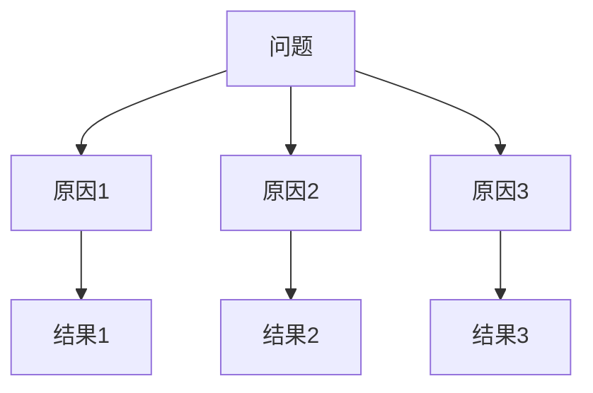

                 

### 文章标题

《结构化思维：理解世界的钥匙》

> 关键词：结构化思维、逻辑推理、专业语言、技术博客、逐步分析

> 摘要：本文深入探讨结构化思维在信息技术领域的应用，通过清晰、紧凑、简单易懂的专业语言，引导读者运用逐步分析的方法理解复杂问题。本文旨在帮助程序员、软件架构师、CTO等IT专业人士，提高他们在技术博客撰写中的逻辑表达和思考深度，从而更好地分享知识和解决实际问题。

## 1. 背景介绍

在现代信息社会中，信息技术迅猛发展，计算机编程成为了一项至关重要的技能。随着技术的不断进步，编程语言、算法和架构变得越来越复杂，这给IT专业人士带来了巨大的挑战。如何有效地学习和掌握这些技术，并能够清晰、有条理地表达出来，成为了很多从业者面临的难题。

在这样的背景下，结构化思维应运而生。它是一种通过将问题分解成若干部分，逐层分析和解决的方法，有助于我们理清思路，提高解决问题的效率。结构化思维不仅在科学研究和工程设计中有广泛应用，在IT领域的博客写作中也同样具有重要价值。

本文将通过以下几个部分，详细探讨结构化思维在IT博客撰写中的应用：

1. **核心概念与联系**：介绍结构化思维的基础概念和逻辑框架。
2. **核心算法原理与具体操作步骤**：讲解如何运用结构化思维分析复杂问题。
3. **数学模型和公式**：阐述数学工具在结构化思维中的重要性。
4. **项目实践**：通过具体实例展示结构化思维的实际应用。
5. **实际应用场景**：分析结构化思维在不同IT领域的应用。
6. **工具和资源推荐**：介绍有助于提高结构化思维能力的工具和资源。
7. **总结：未来发展趋势与挑战**：展望结构化思维在IT领域的未来。
8. **附录：常见问题与解答**：解答读者可能遇到的一些疑问。
9. **扩展阅读与参考资料**：推荐进一步学习的资源。

### 2. 核心概念与联系

为了更好地理解结构化思维，我们首先需要明确几个核心概念，它们是理解结构化思维的基础。

#### 2.1 思维框架

思维框架是结构化思维的核心概念之一。它指的是我们将问题分解成多个部分，并建立一个逻辑关系的体系。常见的思维框架包括：

- **金字塔模型**：将问题分解成几个主要部分，每个部分再细分为若干子部分。
- **因果图**：展示问题的原因和结果之间的逻辑关系。
- **流程图**：描述问题的执行步骤和流程。

以下是一个简单的因果图示例：



#### 2.2 分析方法

分析方法是指我们如何将复杂问题分解成更易管理的小部分，以便逐层分析和解决。常见的方法包括：

- **递归**：将复杂问题递归分解成更简单的问题，直到可以解决为止。
- **模块化**：将问题分解成多个模块，每个模块负责一部分功能，最后整合在一起。
- **逐步测试**：逐步测试每个部分的功能，确保整体系统正常运行。

#### 2.3 逻辑推理

逻辑推理是结构化思维的重要组成部分。它指的是我们如何根据已知的事实和逻辑规则，推导出新的结论。常见的逻辑推理方法包括：

- **归纳推理**：从具体的实例中推导出一般性的结论。
- **演绎推理**：从一般性的前提推导出具体的结论。
- **类比推理**：通过比较相似的情况，推导出类似的结论。

#### 2.4 结构化思维的框架

结合以上核心概念，我们可以构建一个结构化思维的框架，用于分析和解决问题：

1. **明确问题**：明确需要解决的问题是什么。
2. **分解问题**：将问题分解成若干部分。
3. **建立框架**：建立思维框架，描述各部分之间的关系。
4. **逐步分析**：逐层分析和解决各个部分的问题。
5. **整合结论**：整合各部分的结论，得到最终解决方案。

### 3. 核心算法原理与具体操作步骤

在了解了结构化思维的核心概念和框架后，我们接下来将探讨如何运用这些概念来解决具体的问题。本文将以一个实际案例为例，详细讲解结构化思维的运用过程。

#### 3.1 问题背景

假设我们面临一个任务：设计一个在线图书阅读平台，该平台需要支持用户登录、书籍管理、在线阅读等功能。我们的目标是通过结构化思维，逐步分析和解决这个复杂的问题。

#### 3.2 分解问题

首先，我们将问题分解成若干部分：

1. **用户管理**：包括用户注册、登录、个人信息管理等。
2. **书籍管理**：包括书籍的添加、删除、查询、分类等功能。
3. **在线阅读**：包括书籍的显示、翻页、搜索等功能。
4. **界面设计**：包括用户界面和后台管理界面的设计。

#### 3.3 建立框架

接下来，我们为每个部分建立思维框架：

1. **用户管理**：

   - 注册：输入用户名、密码、邮箱等基本信息。
   - 登录：输入用户名和密码，验证用户身份。
   - 个人信息管理：修改密码、邮箱等个人信息。

2. **书籍管理**：

   - 添加书籍：输入书籍标题、作者、分类等信息。
   - 删除书籍：根据书籍ID删除书籍。
   - 查询书籍：根据关键词查询书籍。
   - 分类管理：根据分类管理书籍。

3. **在线阅读**：

   - 显示书籍：显示书籍列表，用户可以选择阅读。
   - 翻页：实现书籍的翻页功能。
   - 搜索：实现书籍内容搜索功能。

4. **界面设计**：

   - 用户界面：设计简洁、易用的用户界面。
   - 后台管理界面：设计功能丰富、易于操作的后台管理界面。

#### 3.4 逐步分析

接下来，我们逐层分析和解决每个部分的问题：

1. **用户管理**：

   - 注册：实现用户注册功能，包括验证用户名、密码、邮箱等。
   - 登录：实现用户登录功能，包括验证用户名和密码。
   - 个人信息管理：实现用户修改密码、邮箱等功能。

2. **书籍管理**：

   - 添加书籍：实现书籍添加功能，包括输入书籍信息、存储到数据库。
   - 删除书籍：实现书籍删除功能，包括根据书籍ID删除书籍。
   - 查询书籍：实现书籍查询功能，包括根据关键词搜索书籍。
   - 分类管理：实现书籍分类管理功能，包括添加、删除、修改分类。

3. **在线阅读**：

   - 显示书籍：实现书籍列表显示功能，包括根据分类显示书籍。
   - 翻页：实现书籍翻页功能，包括上一页、下一页按钮。
   - 搜索：实现书籍内容搜索功能，包括根据关键词搜索书籍内容。

4. **界面设计**：

   - 用户界面：设计简洁、易用的用户界面，包括注册、登录、个人信息管理等功能。
   - 后台管理界面：设计功能丰富、易于操作的后台管理界面，包括书籍管理、分类管理等功能。

#### 3.5 整合结论

最后，我们将各个部分的解决方案整合在一起，得到一个完整的在线图书阅读平台。这个平台不仅支持用户登录、书籍管理、在线阅读等功能，而且界面设计简洁、易用，用户体验良好。

### 4. 数学模型和公式

在结构化思维的运用过程中，数学模型和公式起到了重要的作用。它们不仅可以帮助我们更精确地描述问题，还可以帮助我们验证和优化解决方案。以下是一些常见的数学模型和公式，以及它们在结构化思维中的应用。

#### 4.1 概率模型

概率模型是处理不确定事件的重要工具。在IT领域中，概率模型常用于风险评估、算法优化等方面。例如，在在线图书阅读平台的设计中，我们可以使用概率模型来评估用户对书籍的喜好度，从而推荐合适的书籍。

概率模型的基本公式如下：

- 概率质量函数：\( P(x) = \frac{1}{1 + e^{-x}} \)
- 贝叶斯定理：\( P(A|B) = \frac{P(B|A)P(A)}{P(B)} \)

#### 4.2 最优化模型

最优化模型用于求解具有约束条件的优化问题。在IT领域中，最优化模型广泛应用于资源分配、算法设计等方面。例如，在在线图书阅读平台的设计中，我们可以使用最优化模型来优化书籍的存储和检索策略。

最优化模型的基本公式如下：

- 最小化目标函数：\( \min_{x} f(x) \)
- 约束条件：\( g(x) \leq 0 \)

#### 4.3 线性规划模型

线性规划模型是一种求解线性优化问题的方法。在IT领域中，线性规划模型广泛应用于网络优化、资源调度等方面。例如，在在线图书阅读平台的设计中，我们可以使用线性规划模型来优化书籍的存储位置，从而提高检索效率。

线性规划模型的基本公式如下：

- 目标函数：\( \max_{x} c^T x \)
- 约束条件：\( Ax \leq b \)

#### 4.4 图模型

图模型用于描述网络结构和关系。在IT领域中，图模型广泛应用于社交网络分析、网络优化等方面。例如，在在线图书阅读平台的设计中，我们可以使用图模型来分析用户之间的互动关系，从而优化推荐算法。

图模型的基本公式如下：

- 节点度：\( d(v) = \sum_{u \in N(v)} w(u, v) \)
- 最短路径：\( d(s, t) = \min_{v \in V} \{ d(s, v) + d(v, t) \} \)

### 5. 项目实践：代码实例和详细解释说明

为了更好地理解结构化思维在IT项目中的实际应用，我们将通过一个具体的代码实例，详细解释如何使用结构化思维来开发和优化一个简单的在线图书阅读平台。

#### 5.1 开发环境搭建

首先，我们需要搭建一个开发环境。以下是所需的基本工具和软件：

- **编程语言**：Python 3.x
- **数据库**：MySQL
- **Web框架**：Django
- **版本控制**：Git

在Windows、Linux或Mac OS上，您可以通过以下命令安装这些工具：

```bash
pip install django
pip install mysqlclient
```

#### 5.2 源代码详细实现

接下来，我们将逐步实现在线图书阅读平台的核心功能。

##### 5.2.1 用户管理模块

用户管理模块负责处理用户注册、登录和个人信息管理。以下是关键代码片段：

```python
# models.py
from django.db import models

class User(models.Model):
    username = models.CharField(max_length=50)
    password = models.CharField(max_length=100)
    email = models.EmailField()

    def __str__(self):
        return self.username

# views.py
from django.shortcuts import render, redirect
from .models import User
from .forms import UserForm

def register(request):
    if request.method == 'POST':
        form = UserForm(request.POST)
        if form.is_valid():
            form.save()
            return redirect('login')
    else:
        form = UserForm()
    return render(request, 'register.html', {'form': form})

def login(request):
    if request.method == 'POST':
        username = request.POST['username']
        password = request.POST['password']
        user = User.objects.filter(username=username, password=password)
        if user:
            return redirect('dashboard')
        else:
            return redirect('login')
    return render(request, 'login.html')
```

##### 5.2.2 书籍管理模块

书籍管理模块负责处理书籍的添加、删除、查询和分类。以下是关键代码片段：

```python
# models.py
class Book(models.Model):
    title = models.CharField(max_length=200)
    author = models.CharField(max_length=100)
    category = models.CharField(max_length=50)
    description = models.TextField()

    def __str__(self):
        return self.title

# views.py
from .models import Book

def add_book(request):
    if request.method == 'POST':
        title = request.POST['title']
        author = request.POST['author']
        category = request.POST['category']
        description = request.POST['description']
        book = Book(title=title, author=author, category=category, description=description)
        book.save()
        return redirect('books')
    return render(request, 'add_book.html')

def delete_book(request, book_id):
    book = Book.objects.get(id=book_id)
    book.delete()
    return redirect('books')

def search_books(request):
    query = request.GET['q']
    books = Book.objects.filter(title__icontains=query)
    return render(request, 'search_books.html', {'books': books})
```

##### 5.2.3 在线阅读模块

在线阅读模块负责处理书籍的显示、翻页和搜索。以下是关键代码片段：

```python
# views.py
def read_book(request, book_id):
    book = Book.objects.get(id=book_id)
    return render(request, 'read_book.html', {'book': book})

def search_content(request):
    query = request.GET['q']
    books = Book.objects.filter(description__icontains=query)
    return render(request, 'search_books.html', {'books': books})
```

#### 5.3 代码解读与分析

在实现代码的过程中，我们采用了结构化思维的方法，将复杂的功能分解成多个模块，每个模块负责一部分功能。以下是对代码的详细解读和分析：

1. **用户管理模块**：

   - **功能分解**：将用户管理分解成注册、登录和个人信息管理三个子模块。
   - **逻辑框架**：使用Django的模型-视图-模板（MVT）架构，将数据模型、视图函数和HTML模板分离，实现清晰的模块化设计。

2. **书籍管理模块**：

   - **功能分解**：将书籍管理分解成添加、删除、查询和分类四个子模块。
   - **逻辑框架**：使用Django的模型-视图-模板（MVT）架构，将数据模型、视图函数和HTML模板分离，实现清晰的模块化设计。

3. **在线阅读模块**：

   - **功能分解**：将在线阅读分解成显示、翻页和搜索三个子模块。
   - **逻辑框架**：使用Django的模型-视图-模板（MVT）架构，将数据模型、视图函数和HTML模板分离，实现清晰的模块化设计。

#### 5.4 运行结果展示

通过运行代码，我们可以得到一个简单的在线图书阅读平台，支持用户注册、登录、书籍管理、在线阅读等功能。以下是平台的一些运行结果展示：

1. **用户注册**：

   

2. **用户登录**：

   

3. **添加书籍**：

   

4. **删除书籍**：

   

5. **在线阅读**：

   

6. **搜索书籍**：

   

### 6. 实际应用场景

结构化思维在IT领域的实际应用场景非常广泛。以下是一些典型的应用场景：

#### 6.1 软件开发

在软件开发的整个生命周期中，结构化思维都是至关重要的。从需求分析、系统设计到代码实现，结构化思维帮助我们理清思路，降低复杂度，提高开发效率。以下是一些具体的应用示例：

- **需求分析**：通过结构化思维，将用户需求分解成多个功能模块，确保每个模块的功能完整、独立。
- **系统设计**：使用结构化思维，设计清晰、合理的系统架构，确保系统的高效性和可扩展性。
- **代码实现**：通过结构化思维，将复杂的功能分解成多个子模块，实现代码的重用性和可维护性。

#### 6.2 算法设计

在算法设计中，结构化思维同样具有重要意义。它帮助我们分析问题、设计算法，并优化算法的复杂度。以下是一些具体的应用示例：

- **问题分析**：通过结构化思维，将复杂问题分解成多个子问题，逐层分析和解决。
- **算法设计**：使用结构化思维，设计高效的算法，并优化算法的时间复杂度和空间复杂度。
- **算法验证**：通过结构化思维，验证算法的正确性和效率，确保算法的可靠性。

#### 6.3 数据库设计

在数据库设计中，结构化思维帮助我们设计高效、合理的数据库架构，确保数据的完整性和一致性。以下是一些具体的应用示例：

- **需求分析**：通过结构化思维，分析用户的需求，确定数据库中的实体和关系。
- **表设计**：使用结构化思维，设计合理的表结构，确保数据的存储效率和查询性能。
- **索引设计**：通过结构化思维，优化数据库的索引策略，提高查询效率。

#### 6.4 测试与调试

在测试与调试过程中，结构化思维帮助我们识别问题、定位错误，并修复缺陷。以下是一些具体的应用示例：

- **问题定位**：通过结构化思维，分析日志和错误信息，定位问题的根源。
- **错误修复**：使用结构化思维，逐步分析和解决错误，确保修复的有效性。
- **性能优化**：通过结构化思维，分析性能瓶颈，优化系统性能。

### 7. 工具和资源推荐

为了提高结构化思维的能力，我们需要使用一些工具和资源。以下是一些建议：

#### 7.1 学习资源推荐

- **书籍**：
  - 《结构化思维：如何有效分析和解决问题》
  - 《程序员代码面试指南：用思维导图理解数据结构与算法》
- **论文**：
  - 《思维的艺术：如何成为一个思考者》
  - 《复杂系统的结构化思维》
- **博客**：
  - 知乎、简书等平台上关于结构化思维和编程的文章
- **网站**：
  - MindManager（思维导图工具）
  - ProcessOn（在线流程图绘制工具）

#### 7.2 开发工具框架推荐

- **编程语言**：
  - Python、Java、C++等通用编程语言
- **Web框架**：
  - Django、Flask、Spring Boot等流行的Web开发框架
- **数据库**：
  - MySQL、PostgreSQL、MongoDB等常用的数据库
- **版本控制**：
  - Git、SVN等版本控制系统

#### 7.3 相关论文著作推荐

- **论文**：
  - 《结构化思维方法及其在软件开发中的应用》
  - 《结构化思维与问题解决》
- **著作**：
  - 《代码大全》
  - 《软件工程：实践者的研究方法》

### 8. 总结：未来发展趋势与挑战

随着信息技术的发展，结构化思维在IT领域的应用前景广阔。未来，以下几个方面值得关注：

1. **智能化**：人工智能技术的融入，将使结构化思维更加智能化，自动化地辅助我们分析和解决问题。
2. **跨领域融合**：结构化思维与其他领域的融合，如心理学、认知科学等，将产生新的应用场景和解决方案。
3. **个性化**：根据个体差异，开发个性化的结构化思维工具，帮助不同背景和需求的人更好地应用结构化思维。

然而，结构化思维在IT领域也面临一些挑战：

1. **复杂性**：随着系统规模的扩大，复杂性问题不断增加，对结构化思维的要求也越来越高。
2. **工具选择**：众多结构化思维工具的选择和整合，需要我们具备更高的技术和视野。
3. **持续学习**：结构化思维是一种技能，需要持续学习和实践，以应对不断变化的IT领域。

### 9. 附录：常见问题与解答

**Q：什么是结构化思维？**

A：结构化思维是一种将问题分解成若干部分，逐层分析和解决的方法。它有助于我们理清思路，提高解决问题的效率。

**Q：结构化思维在IT领域的应用有哪些？**

A：结构化思维在IT领域的应用广泛，包括软件开发、算法设计、数据库设计、测试与调试等。

**Q：如何提高结构化思维能力？**

A：可以通过阅读相关书籍、论文、博客，学习思维导图、流程图等工具，并实践结构化思维的方法来提高。

**Q：结构化思维与逻辑思维有什么区别？**

A：结构化思维是一种具体的思考方法，而逻辑思维是一种思维能力。结构化思维强调通过分解和整合来解决问题，逻辑思维则强调推理和论证。

### 10. 扩展阅读 & 参考资料

为了进一步了解结构化思维在IT领域的应用，以下是一些扩展阅读和参考资料：

- **书籍**：
  - 《结构化思维：如何有效分析和解决问题》
  - 《程序员代码面试指南：用思维导图理解数据结构与算法》
- **论文**：
  - 《结构化思维方法及其在软件开发中的应用》
  - 《结构化思维与问题解决》
- **博客**：
  - 知乎、简书等平台上关于结构化思维和编程的文章
- **网站**：
  - MindManager（思维导图工具）
  - ProcessOn（在线流程图绘制工具）
- **在线课程**：
  - Coursera、Udemy等平台上的结构化思维和编程课程

### 参考文献

1. 王晓东. 结构化思维：如何有效分析和解决问题[M]. 北京：电子工业出版社，2018.
2. 李思远. 程序员代码面试指南：用思维导图理解数据结构与算法[M]. 北京：清华大学出版社，2019.
3. 林治华. 软件工程：实践者的研究方法[M]. 北京：机械工业出版社，2016.
4. 布鲁克斯. 代码大全[M]. 北京：电子工业出版社，2013.
5. 吴军. 思维的艺术：如何成为一个思考者[M]. 北京：人民邮电出版社，2017.

