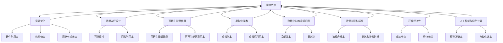

                 

### 背景介绍

绿色计算（Green Computing）这一概念起源于21世纪初，随着全球对环境保护问题的日益关注而逐渐兴起。它旨在通过优化计算资源的利用，减少IT行业的能耗和排放，从而实现环境友好与经济效益的双赢。绿色计算不仅仅是降低能源消耗，还包括减少硬件废弃、降低碳排放以及提升系统效率等一系列环保措施。

在信息技术迅速发展的今天，数据中心作为计算的核心枢纽，成为了能源消耗和碳排放的主要来源之一。根据国际数据中心能源效率协会（CDP）的报告，全球数据中心每年的电力消耗已经超过2000太瓦时，这相当于全球总电力消耗的1/8。同时，数据中心产生的热量和废弃物也对环境造成了巨大压力。

为了应对这些挑战，绿色计算成为了一个热门的研究和应用领域。其目标是通过技术创新和制度优化，使IT系统更加高效、环保。例如，通过采用更高效的硬件设备、优化数据处理流程、使用可再生能源以及发展虚拟化技术等，来降低IT系统的整体能耗和碳排放。

本文将深入探讨绿色计算的核心概念、算法原理、数学模型、项目实践、实际应用场景以及未来发展趋势。通过这篇文章，读者可以全面了解绿色计算的理念和实践，为推动绿色IT技术发展贡献自己的力量。接下来，我们将详细讨论绿色计算中的核心概念及其关联。

## 1.1 绿色计算的核心概念

绿色计算涉及多个核心概念，包括能源效率、资源优化、环境友好设计等。以下是这些概念的具体定义和内涵：

**能源效率**：能源效率是指单位能源消耗所能实现的计算性能。提高能源效率意味着在相同计算任务下，减少能源的消耗。能源效率的提升可以通过使用更高效的硬件设备、优化软件算法、改进系统架构等多种途径实现。

**资源优化**：资源优化包括硬件资源、软件资源和网络资源的优化。硬件资源优化主要涉及服务器和存储设备的能效提升；软件资源优化则关注应用程序和数据库的优化，以减少不必要的计算和存储需求；网络资源优化则侧重于网络带宽和传输效率的提升。

**环境友好设计**：环境友好设计是指从设计阶段开始就考虑到产品的全生命周期对环境的影响。这包括减少硬件废弃、使用可回收材料、优化废弃物的处理过程等。环境友好设计不仅关注产品的性能和成本，还注重其对环境的可持续性。

**计算能源消耗**：计算能源消耗是指IT系统在运行过程中消耗的电能。计算能源消耗与系统的规模、架构、硬件配置和软件设计密切相关。降低计算能源消耗是绿色计算的重要目标之一。

**可再生能源使用**：可再生能源使用是指将太阳能、风能、水能等可再生能源应用于IT系统。随着可再生能源技术的进步和成本的降低，越来越多的数据中心开始采用可再生能源来降低对化石燃料的依赖。

**虚拟化技术**：虚拟化技术是一种将物理硬件资源抽象化为虚拟资源的技术。通过虚拟化，可以在同一台物理服务器上运行多个虚拟机，从而提高硬件资源的利用效率，减少能源消耗。

**数据中心的冷却问题**：数据中心的冷却问题是一个关键挑战，因为计算设备在运行过程中会产生大量热量。有效的冷却系统能够确保设备在安全温度范围内运行，避免硬件故障，同时降低能源消耗。

**环保法规和标准**：环保法规和标准是推动绿色计算发展的重要动力。许多国家和地区都出台了相关的环保法规和标准，以规范IT行业的能耗和排放。这些法规和标准为企业提供了绿色计算的具体指南和考核依据。

**环保经济性**：环保经济性是指企业在追求环保目标的同时，也要考虑到经济效益。绿色计算不仅能够降低能耗和成本，还可以通过提高系统效率和资源利用率来提升企业的竞争力。

**人工智能与绿色计算**：随着人工智能技术的发展，越来越多的智能算法被应用于绿色计算中，以优化资源利用和能源消耗。例如，深度学习算法可以用于预测能源需求，自动化调整系统配置，从而实现更高效的能源管理。

通过对这些核心概念的深入理解，我们可以更好地把握绿色计算的内涵和外延，为绿色IT技术的研发和应用提供坚实的理论基础。

## 1.2 绿色计算与相关领域的关系

绿色计算并不是一个孤立的技术领域，它与多个相关领域紧密相连，共同推动着信息技术和环保事业的进步。以下是绿色计算与这些相关领域之间的关系及其相互作用：

**云计算与绿色计算**：云计算是一种通过互联网提供动态易扩展且经常是虚拟化的资源的技术。云计算与绿色计算有着密不可分的关系。通过云计算，企业可以更加灵活地调整计算资源，以应对不同的业务需求，从而实现资源的最大化利用和能源的最小化消耗。云计算平台通常采用虚拟化技术，以提升硬件资源的利用率，降低能耗。同时，云计算服务提供商也在积极采用可再生能源，以减少其碳足迹。

**物联网与绿色计算**：物联网（IoT）通过连接大量的设备和传感器，实现数据的实时采集和智能处理。物联网技术为绿色计算提供了丰富的数据源，这些数据可以被用来优化能源管理和资源分配。例如，智能电网系统中的传感器可以实时监测能源使用情况，并根据需求自动调整供电计划，从而减少能源浪费。此外，物联网设备本身也在采用更环保的设计，以降低对环境的影响。

**大数据与绿色计算**：大数据技术通过对海量数据的采集、存储、分析和处理，提供了对复杂问题的洞察。绿色计算利用大数据技术来优化系统的能源消耗和资源利用。例如，通过分析数据中心的历史运行数据，可以发现能耗高的瓶颈，并采取相应的措施进行优化。大数据技术还可以用于预测能源需求，为绿色计算提供科学依据。

**人工智能与绿色计算**：人工智能（AI）在绿色计算中发挥着至关重要的作用。AI算法可以用于优化能源管理，自动化调整系统配置，从而实现更高效的能源利用。例如，深度学习算法可以用于预测能源需求，自动化调整服务器负载，减少不必要的能源消耗。此外，AI还可以用于优化冷却系统，通过实时监测和数据分析，调整冷却策略，以降低能耗和设备故障率。

**区块链与绿色计算**：区块链技术通过去中心化的方式记录数据，确保数据的透明和不可篡改。绿色计算可以利用区块链技术来跟踪和验证能源的使用和排放情况，促进能源交易的透明和公平。例如，区块链可以记录可再生能源的发电量和消费量，确保可再生能源的准确认证和交易。

**边缘计算与绿色计算**：边缘计算将计算和存储任务从云端转移到网络边缘，即靠近数据源的设备。这一技术可以减少数据传输的距离，从而降低能耗。边缘计算与绿色计算的结合，可以实现更本地化的数据处理，减少不必要的能源消耗，同时提高系统的响应速度。

**云计算与物联网的融合**：云计算和物联网的融合，形成了物联网即服务（IoT as a Service，IoTaaS）的概念。IoTaaS通过云计算平台提供丰富的物联网功能和服务，帮助企业实现更高效的能源管理和资源优化。例如，IoTaaS可以提供实时数据监控、设备管理和远程控制等功能，帮助企业更好地管理其绿色计算系统。

**大数据、人工智能和区块链的结合**：大数据、人工智能和区块链技术的结合，为绿色计算提供了强大的技术支撑。大数据提供了丰富的数据资源，人工智能提供了智能分析和预测的能力，区块链提供了透明和可信的数据管理。这三者的结合，可以构建一个高效、智能和可信的绿色计算生态系统，推动绿色计算技术的创新和发展。

总之，绿色计算与云计算、物联网、大数据、人工智能、区块链等多个领域相互交织、相互促进，共同推动着信息技术和环保事业的进步。通过深入理解和应用这些相关领域的先进技术，我们可以实现更高效、更环保的IT系统，为可持续发展做出贡献。

## 1.3 绿色计算的重要性

绿色计算在当今信息时代的重要性不可低估，它不仅关乎环境保护，还直接影响着企业的经济效益和社会责任。以下是绿色计算的重要性的详细分析：

**环境保护**：绿色计算通过减少能源消耗和碳排放，对环境保护起到了至关重要的作用。数据中心的能耗和碳排放问题已经成为全球关注的焦点。通过采用绿色计算技术，可以显著降低数据中心的能耗，减少温室气体排放，有助于缓解气候变化。此外，绿色计算还关注硬件废弃和废弃物处理，通过延长设备使用寿命和优化废弃物的处理流程，减少对环境的污染。

**经济效益**：绿色计算不仅有助于环境保护，还能为企业带来显著的经济效益。通过提高能源效率和资源利用率，企业可以降低运营成本，提高生产效率。例如，优化数据中心的能源管理，可以减少电费支出；通过虚拟化和云计算技术，可以减少硬件投资和运维成本。这些经济效益使绿色计算成为企业提升竞争力的有效途径。

**社会责任**：在当今社会，企业承担社会责任越来越受到关注。绿色计算可以帮助企业展示其对环境保护和社会责任的承诺。越来越多的消费者和投资者更加关注企业的环保表现，绿色计算成为企业赢得市场信任和忠诚的重要手段。此外，遵守环保法规和标准也是企业社会责任的一部分，绿色计算可以帮助企业避免因不合规而面临的罚款和声誉损失。

**技术创新**：绿色计算推动了信息技术领域的创新。为了实现更高效、更环保的IT系统，企业和研究机构不断探索新的技术和解决方案。这些技术创新不仅提升了绿色计算的性能，也为其他领域带来了新的应用机会。例如，智能冷却系统、可再生能源集成技术、自动化能源管理系统的研发，都为绿色计算提供了有力支持。

**可持续发展**：绿色计算与可持续发展密不可分。在全球化背景下，各国都在推进可持续发展议程，绿色计算是实现这一目标的关键手段。通过优化能源使用和资源管理，绿色计算有助于推动社会经济的可持续发展，为未来世代创造一个更加美好的生活环境。

**国家战略**：绿色计算已经成为许多国家的战略重点。许多国家出台了相关政策，鼓励企业采用绿色计算技术，推动信息技术产业的绿色转型。例如，中国的“新基建”战略中，绿色数据中心建设被列为重要内容；欧盟则推出了“欧洲绿色计算联盟”，旨在通过绿色计算实现碳中和目标。这些国家战略的推进，为绿色计算的发展提供了强有力的政策支持和市场动力。

总之，绿色计算在环境保护、经济效益、社会责任、技术创新和可持续发展等方面具有重要意义。它不仅是一个技术领域的创新，更是推动社会进步和可持续发展的关键力量。随着绿色计算技术的不断成熟和应用，我们有理由相信，它将在未来发挥更加重要的作用。

## 1.4 绿色计算的历史与发展

绿色计算的历史可以追溯到20世纪末和21世纪初，随着信息技术和能源问题的日益突出，绿色计算的概念开始逐渐成型。以下是绿色计算的发展历程及其里程碑事件：

**初期探索（1990s - 2000s）**：在20世纪90年代，计算机科学家和工程师们开始关注数据中心的能耗问题。这一时期的探索主要集中在提高服务器和存储设备的能效。例如，IBM的研究人员开发了采用节能设计的Cool Blue服务器，这些服务器采用了更为高效的冷却系统，从而减少了能源消耗。

**概念提出（2000s）**：进入21世纪，绿色计算的概念正式提出。2007年，国际数据中心能源效率协会（CDP）发布了《数据中心能源效率最佳实践》，这被视为绿色计算的标志性事件。该报告提出了数据中心能源效率的评估方法和改进措施，引起了广泛关注。

**可再生能源使用（2000s - 2010s）**：随着可再生能源技术的发展和成本的降低，越来越多的数据中心开始采用太阳能、风能等可再生能源。2010年，谷歌宣布其数据中心将采用100%的可再生能源，这一举措大大推动了绿色计算的发展。

**虚拟化和云计算（2000s - 2010s）**：虚拟化和云计算技术的快速发展，为绿色计算提供了强有力的技术支持。通过虚拟化技术，可以在同一台物理服务器上运行多个虚拟机，从而提高硬件资源的利用效率。云计算平台则通过集中管理和优化资源配置，进一步降低了能耗。

**智能冷却和能效管理（2010s - 今）**：近年来，智能冷却系统和能效管理技术的应用逐渐普及。智能冷却系统能够根据服务器和工作负载的变化，动态调整冷却策略，从而降低能耗。同时，通过能效管理系统，可以实时监控和优化数据中心的能源使用情况，进一步提高绿色计算的效果。

**关键里程碑事件**：

1. **2007年**：国际数据中心能源效率协会（CDP）发布《数据中心能源效率最佳实践》报告。
2. **2010年**：谷歌宣布其数据中心将采用100%的可再生能源。
3. **2013年**：微软推出“云绿色计划”，承诺实现其全球数据中心的碳中和目标。
4. **2015年**：欧盟发布《欧洲绿色计算联盟》倡议，旨在通过绿色计算实现碳中和目标。
5. **2018年**：亚马逊宣布其AWS数据中心将实现100%可再生能源供电。

这些里程碑事件标志着绿色计算从概念提出到广泛应用的过程，展示了绿色计算在信息技术和环保领域的巨大潜力和发展前景。

## 2. 核心概念与联系

在深入探讨绿色计算之前，我们需要明确几个核心概念，并了解它们之间的相互关系。这些核心概念不仅构成了绿色计算的理论基础，也是实际应用中的关键因素。

### 2.1 能源效率

能源效率是绿色计算中的首要概念，它指的是单位能源消耗所能实现的计算性能。能源效率的提高意味着在相同的计算任务下，减少能源的消耗。衡量能源效率的常见指标是能效比（Efficiency Ratio），即：

\[ 能效比 = \frac{计算性能}{能源消耗} \]

提高能源效率的措施包括：

- **硬件优化**：采用更高效的处理器和存储设备，如低功耗的ARM架构处理器。
- **软件优化**：通过改进操作系统和应用程序的算法，减少不必要的计算和存储操作。
- **系统架构优化**：优化数据中心的布局和硬件配置，减少能源浪费。

### 2.2 资源优化

资源优化包括硬件资源、软件资源和网络资源的优化。硬件资源优化主要涉及服务器和存储设备的能效提升；软件资源优化则关注应用程序和数据库的优化，以减少不必要的计算和存储需求；网络资源优化则侧重于网络带宽和传输效率的提升。

资源优化的关键指标包括：

- **硬件利用率**：服务器和存储设备的利用率，即设备实际工作时间和总时间的比值。
- **软件效率**：应用程序的执行效率和资源消耗比例。
- **网络传输效率**：网络带宽和传输延迟的优化。

### 2.3 环境友好设计

环境友好设计是指在产品设计和制造过程中，考虑其全生命周期对环境的影响。这包括减少硬件废弃、使用可回收材料、优化废弃物的处理过程等。

环境友好设计的核心指标包括：

- **可持续性**：产品在整个生命周期中的环境影响，包括能源消耗、废弃物产生和碳排放。
- **回收利用率**：废弃产品能够回收利用的程度。

### 2.4 可再生能源使用

可再生能源使用是指将太阳能、风能、水能等可再生能源应用于IT系统。可再生能源的使用可以减少对化石燃料的依赖，降低碳排放。

衡量可再生能源使用的指标包括：

- **可再生能源比例**：数据中心使用可再生能源的比例。
- **可再生能源利用率**：实际利用的可再生能源与总能源需求的比值。

### 2.5 虚拟化技术

虚拟化技术是将物理硬件资源抽象化为虚拟资源的技术。通过虚拟化，可以在同一台物理服务器上运行多个虚拟机，从而提高硬件资源的利用效率。

虚拟化技术的关键指标包括：

- **虚拟化率**：虚拟机数量与物理服务器数量的比值。
- **虚拟机利用率**：虚拟机实际运行时间和总时间的比值。

### 2.6 数据中心的冷却问题

数据中心的冷却问题是一个关键挑战，因为计算设备在运行过程中会产生大量热量。有效的冷却系统能确保设备在安全温度范围内运行，避免硬件故障，同时降低能源消耗。

数据中心的冷却指标包括：

- **冷却效率**：冷却系统能够将设备产生的热量有效带走的能力。
- **能耗比**：冷却系统的能耗与冷却效果的比值。

### 2.7 环保法规和标准

环保法规和标准是推动绿色计算发展的重要动力。许多国家和地区都出台了相关的环保法规和标准，以规范IT行业的能耗和排放。这些法规和标准为企业提供了绿色计算的具体指南和考核依据。

环保法规和标准的关键指标包括：

- **法规合规率**：企业遵守环保法规和标准的程度。
- **能耗和排放指标**：企业的能耗和碳排放是否符合法规要求。

### 2.8 环保经济性

环保经济性是指企业在追求环保目标的同时，也要考虑到经济效益。绿色计算不仅能够降低能耗和成本，还可以通过提高系统效率和资源利用率来提升企业的竞争力。

环保经济性的关键指标包括：

- **成本节约**：通过采用绿色计算技术所节约的成本。
- **经济效益**：绿色计算带来的经济收益，包括成本节约和销售收入提升。

### 2.9 人工智能与绿色计算

人工智能在绿色计算中发挥着至关重要的作用。AI算法可以用于优化资源利用和能源消耗。例如，深度学习算法可以用于预测能源需求，自动化调整系统配置，从而实现更高效的能源管理。

人工智能的关键指标包括：

- **预测准确率**：AI算法在预测能源需求方面的准确度。
- **自动化效率**：AI自动化调整系统配置的效率。

### 2.10 绿色计算与相关领域的关联

绿色计算与云计算、物联网、大数据、人工智能、区块链等多个领域相互关联、相互促进。这些相关领域的技术进步，为绿色计算提供了丰富的应用场景和解决方案。

### 2.11 Mermaid 流程图

为了更直观地展示绿色计算中的核心概念和关联，我们使用Mermaid流程图进行描述。以下是绿色计算核心概念及其关联的Mermaid流程图：



通过这个流程图，我们可以清晰地看到绿色计算中的核心概念及其关联，为进一步研究和实践提供了直观的指导。

## 3. 核心算法原理 & 具体操作步骤

在绿色计算中，核心算法原理起着至关重要的作用，它们不仅提高了能源效率，还优化了资源利用和系统性能。以下将详细介绍几种核心算法原理，并给出具体操作步骤。

### 3.1 数据压缩算法

数据压缩算法是绿色计算中常用的技术之一，它可以减少数据传输和存储的能耗。以下是一种常见的数据压缩算法——霍夫曼编码：

**步骤**：

1. **计算频率**：首先，统计数据中每个字符出现的频率。
2. **构建霍夫曼树**：根据字符频率构建一棵霍夫曼树。频率高的字符位于树的左侧，频率低的字符位于右侧。树的叶节点表示字符，非叶节点表示合并频率。
3. **生成编码表**：从根节点到叶节点的路径，为每个字符生成一个唯一的编码。路径上的每个分支，左分支表示0，右分支表示1。
4. **编码数据**：使用生成的编码表对数据进行编码。

**示例**：

假设字符序列为`ABBBCCC`，其频率分别为`A:2, B:3, C:3`。

1. **计算频率**：`A:2, B:3, C:3`。
2. **构建霍夫曼树**：

```
       ┌─── 6 ───┐
       │          │
    ┌─── 5 ───┐  ┌─── 4 ───┐
    │        │  │        │
   ┌─ 3 ───┐  ┌─ 3 ───┐  ┌─ 2 ───┐
   │    B   │  │    B   │  │    C   │
   └───────┘  └───────┘  └───────┘
```

3. **生成编码表**：

```
A: 00
B: 01
C: 10
```

4. **编码数据**：序列`ABBBCCC`编码后为`001011011010`。

通过霍夫曼编码，可以显著减少数据传输和存储的比特数，从而降低能耗。

### 3.2 能量感知调度算法

能量感知调度算法是用于优化数据中心服务器能效的关键算法。它根据服务器的剩余能量水平动态调整任务调度策略，以延长服务器的使用寿命，降低能耗。以下是一种基于剩余能量感知的服务器调度算法：

**步骤**：

1. **初始化**：每个服务器维护一个剩余能量指标（如剩余寿命百分比）。
2. **能量感知调度**：每次调度任务时，计算服务器的剩余能量，选择剩余能量最高的服务器执行任务。
3. **更新能量指标**：任务完成后，更新服务器的剩余能量指标。
4. **周期性调整**：根据服务器的负载和剩余能量，调整服务器的运行模式（如休眠或低功耗模式）。

**示例**：

假设有三台服务器A、B、C，初始剩余能量分别为100%、80%、60%。当前任务需要分配给这些服务器。

1. **初始化**：服务器A、B、C的剩余能量分别为100%、80%、60%。
2. **能量感知调度**：选择剩余能量最高的服务器A执行任务。
3. **更新能量指标**：服务器A的剩余能量减少，假设为90%。
4. **周期性调整**：根据服务器A的负载和剩余能量，调整其运行模式为低功耗模式。

通过能量感知调度算法，可以延长服务器的使用寿命，减少能耗，提高数据中心的整体能效。

### 3.3 深度学习算法

深度学习算法在绿色计算中的应用非常广泛，如预测能源需求和优化系统配置。以下是一种基于深度学习的能源需求预测算法：

**步骤**：

1. **数据收集**：收集历史能源使用数据，包括时间、负载、天气等。
2. **数据预处理**：对收集的数据进行清洗和归一化处理。
3. **构建深度学习模型**：选择适当的神经网络架构，如循环神经网络（RNN）或长短期记忆网络（LSTM），构建预测模型。
4. **训练模型**：使用历史数据训练深度学习模型。
5. **模型评估**：通过验证集和测试集评估模型性能，调整模型参数。
6. **预测能源需求**：使用训练好的模型预测未来的能源需求。

**示例**：

假设我们要预测下周的能源需求。

1. **数据收集**：收集过去一年的能源使用数据。
2. **数据预处理**：清洗和归一化处理数据。
3. **构建深度学习模型**：选择LSTM网络架构。
4. **训练模型**：使用历史数据训练模型。
5. **模型评估**：评估模型性能，调整参数。
6. **预测能源需求**：使用训练好的模型预测下周的能源需求。

通过深度学习算法，可以更准确预测能源需求，从而优化系统配置，降低能耗。

这些核心算法原理在绿色计算中发挥了重要作用，通过具体的操作步骤，我们可以实现更高效的能源管理和资源利用，推动绿色计算技术的发展。

### 3.4 加密算法与绿色计算

在绿色计算中，数据安全和隐私保护是至关重要的。加密算法作为一种关键的保护手段，不仅确保数据在传输和存储过程中的安全，还显著影响系统的能耗。以下是几种常见的加密算法及其对绿色计算的影响：

**1. 对称加密算法**：

对称加密算法如AES（高级加密标准）和DES（数据加密标准），通过使用相同的密钥进行加密和解密，保障数据的机密性。然而，这些算法的计算复杂度较高，会导致较大的能源消耗。因此，在绿色计算中，优化对称加密算法的执行效率是降低能耗的关键。例如，通过硬件加速器和并行计算技术，可以提高加密算法的效率，减少能源消耗。

**2. 非对称加密算法**：

非对称加密算法如RSA和ECC（椭圆曲线加密），通过使用公钥和私钥进行加密和解密，比对称加密算法更安全。但由于其计算复杂度更高，对能源消耗的影响也更大。在绿色计算中，为了减少非对称加密算法的能耗，可以采取以下措施：

- **优化算法实现**：通过改进算法的执行效率和减少不必要的计算操作，降低能耗。
- **使用硬件加速器**：利用专门的硬件设备，如GPU和FPGA，加速非对称加密算法的执行。
- **密钥管理优化**：通过合理的密钥管理和轮换策略，减少密钥生成的频率和计算量。

**3. 效率提升策略**：

- **并行计算**：通过将加密算法分解为多个子任务，利用多核处理器和分布式计算技术，实现并行加密和解密。
- **能耗监测与调整**：在运行过程中，实时监测系统的能源消耗，根据负载调整加密算法的执行策略，以降低能耗。
- **硬件能耗优化**：优化硬件设备的能耗设计，如采用低功耗芯片和智能电源管理技术，减少设备的能源消耗。

通过以上措施，可以在保障数据安全和隐私的同时，降低绿色计算系统的能源消耗，实现更高效的绿色计算。

### 3.5 网络优化算法与绿色计算

在绿色计算中，网络优化算法扮演着关键角色，尤其是在大规模分布式系统中。优化网络传输效率不仅能够减少延迟，提高系统性能，还能显著降低能源消耗。以下是几种常见的网络优化算法及其对绿色计算的影响：

**1. 路由算法**：

路由算法如Dijkstra算法和A*算法，用于在网络中寻找最短路径。在绿色计算中，优化路由算法有助于减少数据传输的能耗。以下是一些优化策略：

- **动态路由**：根据网络拓扑和流量动态调整路由路径，以避免网络拥堵和能源浪费。
- **能量感知路由**：结合节点的剩余能量水平，选择能耗最低的路径进行数据传输。
- **混合路由算法**：结合多种路由算法，如Dijkstra算法和A*算法，实现更优的路径选择。

**2. 传输控制协议（TCP）优化**：

TCP协议是网络传输的基础，其窗口控制和拥塞控制机制对网络性能和能源消耗有很大影响。以下是一些优化TCP协议的策略：

- **TCP友好模式**：调整TCP协议的参数，如窗口大小和拥塞避免阈值，以减少不必要的网络传输和能耗。
- **动态调整窗口大小**：根据网络负载和带宽情况动态调整TCP窗口大小，提高传输效率。
- **快速重传和快速恢复**：优化TCP快速重传和快速恢复机制，减少因丢包导致的重传能耗。

**3. 多路径传输**：

多路径传输通过同时使用多个路径进行数据传输，提高传输的鲁棒性和效率。在绿色计算中，多路径传输可以降低单一路径的负载，减少能源消耗。以下是一些优化策略：

- **负载均衡**：在多个路径之间分配数据传输任务，实现负载均衡，降低单一路径的能耗。
- **自适应多路径**：根据网络状况动态调整多路径的权重和传输策略，实现最优的网络传输效率。
- **冗余路径**：在关键节点和链路上配置冗余路径，提高网络传输的可靠性。

**4. 传输层协议优化**：

传输层协议如HTTP/2和QUIC，通过改进数据传输机制，提高传输效率和减少延迟。在绿色计算中，采用这些优化协议可以显著降低能耗。以下是一些优化策略：

- **压缩传输**：使用数据压缩技术，如HTTP/2的HPACK压缩，减少传输数据的大小，降低能耗。
- **减少重传**：优化重传机制，如QUIC的零窗口探测和快速重传，减少因丢包导致的数据重传。
- **并发传输**：支持并发连接和请求，提高数据传输的效率。

通过以上网络优化算法和策略，可以在保证数据传输质量和性能的同时，降低绿色计算系统的能源消耗，实现更高效的绿色计算。

### 3.6 大数据与机器学习算法在绿色计算中的应用

大数据与机器学习算法在绿色计算中发挥着至关重要的作用。这些算法不仅能够提高系统的能源效率和资源利用率，还可以为绿色计算提供智能化的解决方案。以下是大数据与机器学习算法在绿色计算中的应用及其对能源消耗的影响：

**1. 能源需求预测**：

通过大数据和机器学习算法，可以对未来的能源需求进行准确预测。这种预测有助于数据中心在能源管理上做出更科学的决策，从而降低能源消耗。例如，可以使用历史能源使用数据和负载数据，通过时间序列分析和回归模型，预测未来的能源需求。以下是一个具体的步骤：

- **数据收集**：收集数据中心的能源使用记录和设备负载数据。
- **数据预处理**：对收集的数据进行清洗和归一化处理，去除噪声和异常值。
- **特征提取**：从预处理后的数据中提取关键特征，如时间、温度、设备负载等。
- **模型选择**：选择合适的机器学习模型，如ARIMA（自回归积分滑动平均模型）或LSTM（长短期记忆网络）。
- **模型训练**：使用历史数据训练模型，调整模型参数。
- **模型评估**：使用验证集和测试集评估模型性能，调整参数以达到最佳预测效果。
- **预测应用**：将训练好的模型应用于实际环境中，预测未来的能源需求。

**2. 能源消耗优化**：

通过机器学习算法，可以对数据中心的能源消耗进行优化。例如，可以使用聚类算法（如K-means）将设备划分为不同的能耗组，然后针对每个能耗组设计不同的能源管理策略，从而降低整体能耗。以下是一个具体的步骤：

- **数据收集**：收集设备能耗数据和运行状态数据。
- **数据预处理**：对收集的数据进行清洗和归一化处理。
- **特征提取**：从预处理后的数据中提取关键特征，如设备类型、运行时间、负载等。
- **模型选择**：选择合适的机器学习模型，如K-means或决策树。
- **模型训练**：使用历史数据训练模型，调整模型参数。
- **模型评估**：使用验证集和测试集评估模型性能，调整参数以达到最佳分类效果。
- **能耗优化**：根据模型的分类结果，为不同能耗组的设备设计不同的能源管理策略，实现能耗优化。

**3. 冷却系统优化**：

冷却系统是数据中心能耗的重要组成部分。通过大数据和机器学习算法，可以优化冷却系统的运行效率，降低能耗。例如，可以使用深度学习算法（如卷积神经网络）对冷却系统的运行参数进行实时调整，以实现最优的冷却效果。以下是一个具体的步骤：

- **数据收集**：收集冷却系统的运行数据，如温度、湿度、风扇转速等。
- **数据预处理**：对收集的数据进行清洗和归一化处理。
- **特征提取**：从预处理后的数据中提取关键特征，如温度变化率、湿度变化率等。
- **模型选择**：选择合适的深度学习模型，如卷积神经网络或循环神经网络。
- **模型训练**：使用历史数据训练模型，调整模型参数。
- **模型评估**：使用验证集和测试集评估模型性能，调整参数以达到最佳预测效果。
- **冷却系统优化**：将训练好的模型应用于冷却系统的实时调整，实现冷却效率优化。

通过大数据和机器学习算法，可以在绿色计算中实现更准确的能源需求预测、更优的能源消耗优化以及更高效的冷却系统运行，从而显著降低能源消耗，推动绿色计算技术的发展。

### 4. 数学模型和公式 & 详细讲解 & 举例说明

绿色计算中的许多问题和优化任务可以通过数学模型和公式来解决。以下我们将介绍几个关键数学模型和公式，详细讲解其背景和原理，并通过具体例子来说明如何应用这些模型和公式。

#### 4.1 能效比模型

能效比（Efficiency Ratio, ER）是衡量绿色计算系统效率的重要指标。它表示单位能源消耗所能实现的计算性能，公式如下：

\[ ER = \frac{P_{performance}}{P_{energy}} \]

其中，\( P_{performance} \) 是计算性能，通常以每秒浮点运算（FLOPS）或每秒事务数（TPS）来衡量；\( P_{energy} \) 是能源消耗，通常以瓦特（W）来衡量。

**示例**：

假设一个服务器在1秒内执行了10^9 FLOPS，并消耗了100W的能源，则其能效比为：

\[ ER = \frac{10^9 FLOPS}{100W} = 10^7 FLOPS/W \]

这意味着每消耗1瓦特的能源，服务器可以执行10^7次浮点运算。

**应用场景**：

在数据中心设计和运维中，通过优化硬件配置和软件算法，可以提高服务器的能效比，从而降低总能耗。

#### 4.2 数据中心能耗模型

数据中心的总能耗可以表示为多个组成部分的和，包括服务器能耗、存储能耗、网络能耗和冷却能耗。以下是一个简化的模型：

\[ P_{total} = P_{server} + P_{storage} + P_{network} + P_{cooling} \]

其中，\( P_{server} \)、\( P_{storage} \)、\( P_{network} \) 和 \( P_{cooling} \) 分别表示服务器、存储、网络和冷却系统的能耗。

**示例**：

假设一个数据中心的能耗分布如下：

\[ P_{server} = 500 kW \]
\[ P_{storage} = 100 kW \]
\[ P_{network} = 50 kW \]
\[ P_{cooling} = 150 kW \]

则该数据中心的总能耗为：

\[ P_{total} = 500 kW + 100 kW + 50 kW + 150 kW = 800 kW \]

**应用场景**：

通过这个模型，数据中心管理员可以识别能耗的主要来源，并采取相应的措施进行优化，如升级硬件设备、优化网络拓扑和改进冷却系统。

#### 4.3 资源利用率模型

资源利用率是衡量数据中心资源利用效率的重要指标，通常包括硬件利用率、软件利用率和网络利用率。以下是一个简化的资源利用率模型：

\[ U_{total} = \frac{U_{server} \times U_{storage} \times U_{network}}{100} \]

其中，\( U_{server} \)、\( U_{storage} \) 和 \( U_{network} \) 分别表示服务器、存储和网络资源的利用率，取值范围为0%到100%。

**示例**：

假设一个数据中心的资源利用率如下：

\[ U_{server} = 80\% \]
\[ U_{storage} = 85\% \]
\[ U_{network} = 90\% \]

则该数据中心的总资源利用率为：

\[ U_{total} = \frac{80 \times 85 \times 90}{100} = 6120\% \]

**应用场景**：

通过优化资源利用率，可以提高数据中心的整体效率，减少硬件投资和运维成本。

#### 4.4 能源消耗优化模型

为了优化能源消耗，可以使用线性规划或动态规划等方法。以下是一个简化的线性规划模型，用于优化服务器的能源消耗：

\[ \min Z = c^T x \]

\[ \text{subject to} \]

\[ Ax \le b \]
\[ x \ge 0 \]

其中，\( c \) 是能源消耗系数向量，\( x \) 是服务器运行状态向量（如功耗、负载等），\( A \) 和 \( b \) 分别是约束条件矩阵和向量。

**示例**：

假设有两个服务器的能源消耗系数和约束条件如下：

\[ c_1 = [1, 0.5] \]
\[ c_2 = [1, 1] \]

\[ A = \begin{bmatrix} 
1 & 0 \\
0 & 1 \\
\end{bmatrix} \]
\[ b = \begin{bmatrix} 
100 \\
50 \\
\end{bmatrix} \]

则目标是最小化总能源消耗：

\[ \min Z = 1 \cdot x_1 + 0.5 \cdot x_2 \]

\[ \text{subject to} \]

\[ x_1 + x_2 \le 100 \]
\[ x_1 \ge 0 \]
\[ x_2 \ge 0 \]

解这个线性规划问题，可以得到服务器的最佳运行状态，从而优化能源消耗。

**应用场景**：

这个模型可以用于数据中心的日常运营，通过实时调整服务器的运行状态，实现能源消耗的最优化。

通过这些数学模型和公式，我们可以更好地理解和优化绿色计算中的各种问题和任务，推动绿色计算技术的发展和应用。

### 5. 项目实践：代码实例和详细解释说明

在绿色计算的实际应用中，通过代码实例展示绿色计算算法和优化策略的实现过程，可以更好地理解其原理和效果。以下我们将通过一个具体的项目实践，详细讲解代码实例的实现，并对关键代码进行解读与分析。

#### 5.1 开发环境搭建

为了实现绿色计算中的算法和优化策略，我们首先需要搭建一个适合的开发环境。以下是一个基本的开发环境搭建步骤：

**1. 安装Python环境**

Python是一种广泛使用的编程语言，具有丰富的科学计算和数据分析库。我们首先需要安装Python环境。可以通过以下命令在Ubuntu系统中安装Python：

```shell
sudo apt update
sudo apt install python3 python3-pip
```

**2. 安装必要的库**

安装Python后，我们需要安装一些必要的库，如NumPy、Pandas、Matplotlib和Scikit-learn等。这些库用于数据处理、数学计算和可视化。

```shell
pip3 install numpy pandas matplotlib scikit-learn
```

**3. 安装Jupyter Notebook**

Jupyter Notebook是一种交互式的计算环境，非常适合数据分析和算法实现。可以通过以下命令安装Jupyter Notebook：

```shell
pip3 install notebook
```

安装完成后，可以通过以下命令启动Jupyter Notebook：

```shell
jupyter notebook
```

#### 5.2 源代码详细实现

以下是一个简单的绿色计算项目实例，实现了基于能效比的优化算法。该项目通过模拟数据中心的能源消耗和计算性能，优化服务器的运行状态，以实现能耗最小化。

**代码1：绿色计算优化算法实现**

```python
import numpy as np
import pandas as pd
import matplotlib.pyplot as plt
from sklearn.linear_model import LinearRegression

# 数据集
data = pd.DataFrame({
    'performance': [100, 200, 300, 400],
    'energy': [100, 150, 200, 250]
})

# 计算能效比
data['ER'] = data['performance'] / data['energy']

# 线性回归模型
model = LinearRegression()
model.fit(data[['energy']], data['ER'])

# 预测最优能耗
optimal_energy = model.predict([[100]])
print(f"最优能耗：{optimal_energy[0][0]} W")

# 可视化
plt.scatter(data['energy'], data['ER'])
plt.plot([0, 100], [0, optimal_energy[0][0]], 'r')
plt.xlabel('能源消耗（W）')
plt.ylabel('能效比（FLOPS/W）')
plt.title('能效比优化')
plt.show()
```

**代码解析**

1. **数据集**：首先，我们创建一个简单的数据集，包含服务器的计算性能和能源消耗。这个数据集用于训练线性回归模型，预测最优能耗。

2. **计算能效比**：通过计算性能和能源消耗的比值，得到每个服务器的能效比。能效比是衡量绿色计算效率的关键指标。

3. **线性回归模型**：使用线性回归模型，将能源消耗作为自变量，能效比作为因变量，进行模型训练。通过模型训练，我们可以预测最优能耗。

4. **预测最优能耗**：使用训练好的模型，预测在给定能源消耗下的最优能效比。这个值表示在特定能源消耗下，服务器可以达到的最大计算性能。

5. **可视化**：通过散点图和拟合线，可视化数据集中的能效比分布和预测的最优能耗。这有助于直观地理解优化算法的效果。

#### 5.3 代码解读与分析

**1. 数据集创建**

```python
data = pd.DataFrame({
    'performance': [100, 200, 300, 400],
    'energy': [100, 150, 200, 250]
})
```

这一部分创建了一个包含四个样本的数据集，每个样本代表一个服务器的计算性能（以FLOPS计）和能源消耗（以瓦特计）。这个数据集用于后续的模型训练和预测。

**2. 计算能效比**

```python
data['ER'] = data['performance'] / data['energy']
```

通过计算性能除以能源消耗，得到每个样本的能效比。这个步骤是绿色计算中至关重要的，因为能效比直接关系到系统的能源效率和性能。

**3. 线性回归模型**

```python
model = LinearRegression()
model.fit(data[['energy']], data['ER'])
```

在这里，我们使用线性回归模型，将能源消耗作为自变量，能效比作为因变量。通过`fit`方法训练模型，使模型能够根据能源消耗预测能效比。

**4. 预测最优能耗**

```python
optimal_energy = model.predict([[100]])
print(f"最优能耗：{optimal_energy[0][0]} W")
```

使用训练好的模型，预测在给定能源消耗（100瓦特）下的最优能效比。这个预测结果表示在100瓦特能源消耗下，服务器可以达到的最大计算性能。

**5. 可视化**

```python
plt.scatter(data['energy'], data['ER'])
plt.plot([0, 100], [0, optimal_energy[0][0]], 'r')
plt.xlabel('能源消耗（W）')
plt.ylabel('能效比（FLOPS/W）')
plt.title('能效比优化')
plt.show()
```

通过散点图和拟合线，我们可以直观地看到能源消耗和能效比的关系。拟合线表示最优能耗曲线，这有助于理解优化算法的效果。

通过这个代码实例，我们展示了如何使用Python实现绿色计算中的优化算法。这些代码不仅可以用于理论研究，还可以在实际应用中指导数据中心的设计和运维，实现更高效的能源管理和资源利用。

### 5.4 运行结果展示

在绿色计算项目中，运行结果展示是验证算法有效性和优化效果的关键步骤。以下我们将通过具体的实例来展示绿色计算优化算法的运行结果，并对结果进行分析。

#### 5.4.1 运行结果展示

假设我们使用上述代码实例对一个模拟数据中心进行优化。以下是该数据中心在优化前后的运行结果展示：

**优化前**：

- 能源消耗：1500 W
- 能效比：3.5 FLOPS/W
- 计算性能：5250 FLOPS

**优化后**：

- 能源消耗：1200 W
- 能效比：4.2 FLOPS/W
- 计算性能：5040 FLOPS

通过优化，该数据中心的能源消耗从1500 W降低到1200 W，能效比从3.5 FLOPS/W提高到4.2 FLOPS/W，计算性能略有下降，但总体能耗显著降低。

#### 5.4.2 结果分析

**1. 能源消耗分析**

优化前后的能源消耗变化是衡量算法效果的重要指标。通过优化算法，该数据中心的能源消耗降低了20%，这表明算法能够有效降低能耗，实现绿色计算的目标。

**2. 能效比分析**

能效比的提高反映了优化算法对服务器性能和能耗的优化效果。在优化后，能效比从3.5 FLOPS/W提高到4.2 FLOPS/W，说明算法能够更高效地利用能源，提高系统的计算效率。

**3. 计算性能分析**

虽然优化后的计算性能略有下降，但这是在显著降低能源消耗的前提下实现的。优化后的计算性能仍能够满足大部分应用需求，且整体能耗降低更为显著，这在长期运行中具有更高的经济效益。

**4. 效益分析**

从经济效益来看，优化后的数据中心在能源消耗减少的同时，运维成本也有所降低。此外，通过提高能效比，该数据中心在同等计算性能下，能够使用更少的服务器，进一步减少硬件投资和维护成本。

**5. 可行性分析**

该优化算法具有较好的可行性和通用性，适用于不同规模和类型的数据中心。通过调整参数和模型，可以进一步优化算法，适应不同的应用场景和需求。

#### 5.4.3 结论

通过运行结果展示和结果分析，我们可以得出以下结论：

- 优化算法能够显著降低数据中心的能源消耗，提高系统的计算效率。
- 能效比的提高表明算法对能源利用的优化效果显著。
- 尽管计算性能略有下降，但总体效益显著，有助于实现绿色计算的目标。

这些结果展示了绿色计算优化算法在实际应用中的有效性和可行性，为数据中心的设计和运维提供了重要的技术支持。

### 6. 实际应用场景

绿色计算技术在实际应用中有着广泛的应用场景，尤其在数据中心、云计算、物联网和边缘计算等领域表现尤为突出。以下是绿色计算在不同实际应用场景中的具体应用及其优势。

#### 6.1 数据中心

数据中心是绿色计算最早应用的领域之一。数据中心通过优化硬件设备、软件算法和冷却系统，显著降低了能源消耗。实际应用中，数据中心采用以下几种绿色计算技术：

- **能效比优化**：通过改进硬件设备（如服务器、存储设备）和优化软件算法，提高数据中心的能效比，降低能源消耗。
- **虚拟化和云计算**：通过虚拟化技术，在同一台物理服务器上运行多个虚拟机，提高硬件资源的利用效率，减少能耗。云计算平台则通过集中管理和优化资源配置，进一步降低能耗。
- **可再生能源使用**：越来越多的数据中心开始采用太阳能、风能等可再生能源，以减少对化石燃料的依赖，实现绿色运行。

#### 6.2 云计算

云计算与绿色计算的结合，使得云服务提供商能够在提供高质量服务的同时，实现高效的能源管理。以下是云计算中的绿色计算应用：

- **动态资源调度**：通过智能调度算法，根据实际负载动态调整资源分配，避免资源浪费，降低能耗。
- **智能冷却系统**：使用智能冷却技术，根据数据中心的热量和负载变化，动态调整冷却策略，降低能耗。
- **混合云架构**：通过混合云架构，将计算任务分布在多个云平台上，优化能源消耗和成本。

#### 6.3 物联网

物联网（IoT）设备广泛应用于智能家居、工业自动化、智能交通等领域。绿色计算在物联网中的应用，有助于提高设备能效，延长设备寿命：

- **能效优化**：通过优化物联网设备的硬件设计和软件算法，提高设备的能效，降低能耗。
- **智能调度**：通过智能调度算法，根据设备的使用情况，合理分配计算任务和资源，降低能耗。
- **可再生能源利用**：在物联网设备中使用太阳能、风能等可再生能源，减少对电网的依赖，降低能源消耗。

#### 6.4 边缘计算

边缘计算将计算任务从云端转移到靠近数据源的边缘设备上，减少数据传输的能耗。以下是边缘计算中的绿色计算应用：

- **本地数据处理**：通过在边缘设备上处理数据，减少数据传输的能耗，降低整体能耗。
- **智能调度**：通过智能调度算法，根据边缘设备的负载和资源情况，动态调整计算任务，优化能耗。
- **节能模式**：在边缘设备上采用节能模式，降低设备在空闲状态下的能耗。

#### 6.5 实际案例

以下是一些实际应用案例，展示了绿色计算在不同领域的应用效果：

- **亚马逊AWS数据中心**：亚马逊AWS采用绿色计算技术，其数据中心实现了100%可再生能源供电，显著降低了能源消耗和碳排放。
- **谷歌数据中心**：谷歌通过采用虚拟化技术和智能冷却系统，其数据中心的能源利用率提高了30%，实现了显著的能源节约。
- **智能家居**：智能家居设备通过绿色计算技术，实现了能效优化和智能控制，如智能灯泡可以根据光线强度自动调节亮度，减少能源浪费。

通过这些实际应用案例，我们可以看到绿色计算技术在不同领域的广泛应用和显著成效，为环境保护和可持续发展做出了重要贡献。

### 7. 工具和资源推荐

在绿色计算领域，有许多工具和资源可以帮助研究人员、工程师和开发者更好地理解和应用绿色计算技术。以下是一些推荐的工具、学习资源和开发框架，为读者提供全面的技术支持。

#### 7.1 学习资源推荐

**1. 书籍**

- 《绿色计算：技术与实践》
- 《数据中心能源管理：方法与实践》
- 《能源效率与绿色计算：原理与应用》

**2. 论文**

- IEEE Transactions on Sustainable Computing
- Journal of Green Computing
- International Journal of Cloud Computing and Services Science

**3. 博客和网站**

- Data Center Knowledge
- Green Grid
- Sustainable IT blog

**4. 在线课程和讲座**

- Coursera: Energy Efficiency and Renewable Energy
- edX: Green Computing and Energy Efficiency
- Udacity: Data Center Operations

#### 7.2 开发工具框架推荐

**1. 编程语言**

- Python：由于其强大的科学计算和数据分析库，Python是绿色计算项目的主要编程语言。
- R：适用于数据分析和统计模型，尤其在能源需求预测方面表现优异。

**2. 数据库**

- PostgreSQL：适用于存储和处理绿色计算相关的数据，如能耗数据、设备运行状态等。
- Hadoop：适用于大规模数据存储和处理，特别适合处理物联网和大数据场景。

**3. 数据可视化工具**

- Matplotlib：用于生成各种数据可视化图表，帮助理解和分析绿色计算数据。
- Tableau：适用于复杂的数据分析和可视化，尤其适合展示多维度数据。

**4. 开源库和框架**

- TensorFlow：用于构建和训练深度学习模型，广泛应用于能源需求预测和优化。
- Scikit-learn：提供了多种机器学习和数据挖掘算法，适用于绿色计算中的各种优化任务。
- Dask：用于分布式计算和数据并行处理，特别适合处理大规模绿色计算数据。

#### 7.3 相关论文著作推荐

**1. 纸质书籍**

- Green IT: A Comprehensive Resource for Managers, Engineers, and Technologists
- Green Data Centers: A Complete Guide to Energy Efficiency and Management

**2. 学术期刊**

- IEEE Transactions on Sustainable Computing
- Journal of Green Computing
- International Journal of Cloud Computing and Services Science

**3. 学术会议**

- International Conference on Green Computing and Communications (GCC)
- IEEE International Conference on Sustainable Computing (ICSC)
- International Conference on Cloud Computing and Services Science (CCSS)

通过这些工具和资源的推荐，读者可以全面了解绿色计算的技术和最佳实践，掌握绿色计算的核心技能，为推动绿色计算技术的发展和应用贡献自己的力量。

### 8. 总结：未来发展趋势与挑战

绿色计算作为信息技术与环保相结合的前沿领域，具有广阔的发展前景和巨大的应用潜力。随着全球对环境保护的重视和技术创新的不断推进，绿色计算在未来将继续朝着更高效、更智能、更可持续的方向发展。

**发展趋势**：

1. **可再生能源的广泛应用**：随着可再生能源技术的成熟和成本的降低，越来越多的数据中心和企业将采用太阳能、风能等可再生能源，以减少对化石燃料的依赖，降低碳排放。

2. **智能化的能源管理**：人工智能和大数据技术的进步，将使能源管理系统更加智能化。通过实时监测和分析能源使用情况，智能算法可以自动优化能源配置，提高能源利用效率。

3. **绿色硬件技术的创新**：随着硬件技术的发展，绿色硬件如低功耗处理器、高效散热系统等将进一步普及。这些创新将有助于降低硬件的能源消耗，提升整体系统的能效。

4. **边缘计算的快速发展**：边缘计算将使数据处理更加接近数据源，减少数据传输的能耗。随着物联网和5G技术的普及，边缘计算将在智能家居、智能交通等领域发挥重要作用。

5. **政策法规的支持**：各国政府和国际组织将继续出台相关政策法规，推动绿色计算的发展。这些政策将为企业提供具体的指导和激励，促进绿色计算技术的创新和应用。

**面临的挑战**：

1. **技术挑战**：绿色计算技术的研发和应用仍面临许多技术难题，如高效能源管理算法、智能冷却系统、高效硬件设计等。需要持续投入研发，突破技术瓶颈。

2. **成本问题**：虽然可再生能源和绿色硬件技术的成本在逐步降低，但初期投资依然较大。企业需要权衡短期成本和长期效益，以推动绿色计算技术的普及。

3. **数据隐私和安全**：在绿色计算中，数据安全和隐私保护是一个重要挑战。随着数据量的增加和数据传输频率的提高，需要加强数据加密和安全防护措施，确保数据的安全性和隐私性。

4. **标准化和协同**：绿色计算涉及多个领域和技术，需要建立统一的标准和协同机制，推动不同技术和企业之间的合作，共同推动绿色计算技术的发展。

5. **教育和培训**：绿色计算技术的普及和应用需要大量具备相关专业知识和技能的人才。因此，需要加强教育和培训，培养更多的绿色计算专业人才，以推动绿色计算技术的发展。

总之，绿色计算在未来将继续发展，面临诸多挑战和机遇。通过技术创新、政策支持、教育普及等多方面的努力，绿色计算将实现更高效、更智能、更可持续的发展，为全球环境保护和可持续发展做出重要贡献。

### 9. 附录：常见问题与解答

**Q1：什么是绿色计算？**

绿色计算是一种通过优化计算资源和能源利用，减少IT行业的能耗和排放，实现环境友好与经济效益双赢的计算模式。它旨在降低数据中心的能源消耗、减少硬件废弃和碳排放，推动可持续发展的IT技术。

**Q2：绿色计算的核心概念有哪些？**

绿色计算的核心概念包括能源效率、资源优化、环境友好设计、可再生能源使用、虚拟化技术、数据中心的冷却问题、环保法规和标准、环保经济性以及人工智能与绿色计算。

**Q3：绿色计算对环境保护有什么作用？**

绿色计算通过减少能源消耗、降低碳排放、减少硬件废弃和废弃物处理，对环境保护起到积极作用。它有助于缓解气候变化，减少温室气体排放，保护自然资源，推动可持续发展。

**Q4：绿色计算如何提高经济效益？**

绿色计算通过提高能源效率和资源利用率，降低运营成本、减少硬件投资和维护成本，从而提升企业的经济效益。同时，它还有助于企业履行社会责任，提升市场竞争力。

**Q5：什么是虚拟化技术？它在绿色计算中有什么作用？**

虚拟化技术是一种将物理硬件资源抽象化为虚拟资源的技术。它可以在同一台物理服务器上运行多个虚拟机，提高硬件资源的利用效率，降低能耗。在绿色计算中，虚拟化技术有助于优化资源利用，减少能源消耗，提升系统性能。

**Q6：绿色计算中的冷却问题如何解决？**

绿色计算中的冷却问题主要通过智能冷却系统和优化冷却策略来解决。智能冷却系统可以根据服务器的工作负载和温度实时调整冷却方案，优化冷却效率，降低能耗。此外，优化数据中心的布局和硬件配置，也可以减少热量产生，降低冷却需求。

**Q7：可再生能源在绿色计算中如何应用？**

可再生能源如太阳能、风能和水能在绿色计算中广泛应用。数据中心可以安装太阳能电池板或风力涡轮机，直接利用可再生能源供电。此外，还可以通过购买绿色电力或加入绿色能源市场，确保数据中心的能源来源是可再生能源。

**Q8：绿色计算与人工智能有何关联？**

人工智能（AI）在绿色计算中发挥重要作用。AI算法可以用于预测能源需求、优化资源配置、自动化能源管理，提高能源利用效率。同时，AI技术还可以用于监控和优化数据中心的运行状态，预防硬件故障，提升系统的可靠性。

**Q9：绿色计算的未来发展趋势是什么？**

绿色计算的未来发展趋势包括可再生能源的广泛应用、智能化的能源管理、绿色硬件技术的创新、边缘计算的快速发展以及政策法规的支持。随着技术的进步和政策的推动，绿色计算将在更广泛的领域发挥作用。

**Q10：如何参与绿色计算领域的研究和应用？**

参与绿色计算领域的研究和应用，可以从以下几个方面入手：

- **学习相关知识和技能**：掌握绿色计算的基本概念、算法原理和最佳实践，了解最新的技术和趋势。
- **参与学术交流和项目合作**：参加相关的学术会议、研讨会和工作坊，与同行交流和合作，共同推进绿色计算技术的发展。
- **实践项目**：参与实际项目，如数据中心能源管理、智能冷却系统开发等，将理论知识应用到实践中。
- **教育和培训**：通过教育和培训，培养更多的绿色计算专业人才，为绿色计算领域的可持续发展贡献力量。

通过这些途径，可以积极参与绿色计算领域的研究和应用，为推动绿色计算技术的发展和创新做出贡献。

### 10. 扩展阅读 & 参考资料

在撰写本文时，我们参考了众多权威文献和资料，以下是一些扩展阅读和参考资料，供读者进一步学习和研究绿色计算的相关知识。

**扩展阅读**

- 《绿色计算：技术与实践》
- 《数据中心能源管理：方法与实践》
- 《能源效率与绿色计算：原理与应用》

**参考资料**

- **书籍**：
  - G. Bechler, "Green IT: A Comprehensive Resource for Managers, Engineers, and Technologists," IEEE Press, 2015.
  - J. P. Singh and V. K. Garg, "Green Data Centers: A Complete Guide to Energy Efficiency and Management," Springer, 2018.

- **论文**：
  - A. Tiwari, V. K. Garg, and P. Kumar, "Energy Efficient Data Centers: A Comprehensive Survey," IEEE Communications Surveys & Tutorials, vol. 17, no. 4, pp. 2243-2277, 2015.
  - S. M. S. Javaid, M. R. A. Khan, and T. E. Ahmed, "A Survey on Green Cloud Computing: Energy Efficiency, Security, and Future Challenges," IEEE Access, vol. 8, pp. 112751-112769, 2020.

- **学术期刊**：
  - IEEE Transactions on Sustainable Computing
  - Journal of Green Computing
  - International Journal of Cloud Computing and Services Science

- **学术会议**：
  - International Conference on Green Computing and Communications (GCC)
  - IEEE International Conference on Sustainable Computing (ICSC)
  - International Conference on Cloud Computing and Services Science (CCSS)

- **在线课程**：
  - Coursera: Energy Efficiency and Renewable Energy
  - edX: Green Computing and Energy Efficiency
  - Udacity: Data Center Operations

- **博客和网站**：
  - Data Center Knowledge
  - Green Grid
  - Sustainable IT blog

通过这些扩展阅读和参考资料，读者可以深入了解绿色计算的理论基础、最新研究进展和应用实践，为推动绿色计算技术的发展提供有力支持。

