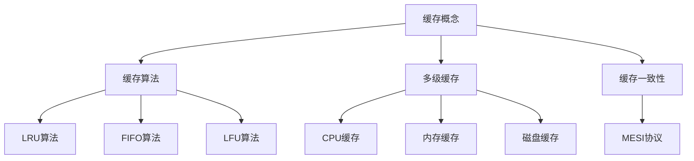

                 

### 背景介绍

在现代互联网应用中，数据量的急剧增长以及用户需求的不断提高，使得系统的响应速度成为了衡量应用性能的重要指标。而缓存（Caching）作为一种提高系统性能的关键技术，其重要性日益凸显。缓存技术通过将频繁访问的数据存储在速度较快的存储介质中，从而显著减少对慢速存储设备（如磁盘或数据库）的访问次数，提高系统的响应速度。

缓存策略的研究和应用已经经历了数十年的发展。从早期的简单缓存机制，如LRU（Least Recently Used）缓存算法，到现代复杂的多级缓存架构，如CPU缓存、内存缓存、分布式缓存等，缓存策略的演变不断推动着计算机技术的发展。然而，随着应用场景的多样化和复杂化，如何设计有效的缓存策略，以适应不同的业务需求，成为了一个亟待解决的问题。

本文将围绕缓存策略这一主题，深入探讨其核心概念、算法原理、数学模型、项目实践、实际应用场景以及未来发展趋势。希望通过本文的介绍，能够帮助读者理解缓存策略的基本原理，掌握设计有效缓存策略的方法，并在实际项目中运用这些知识，提升应用的性能和用户体验。

### 核心概念与联系

为了深入理解缓存策略，我们首先需要明确几个核心概念，并探讨它们之间的联系。

#### 1.1 缓存（Caching）

缓存是一种存储数据的临时副本，目的是为了加速数据访问。常见的缓存存储介质包括CPU缓存、内存、SSD（固态硬盘）和分布式缓存系统。缓存的基本原理是利用局部性原理（Temporal Locality 和 Spatial Locality），即数据在过去被访问的概率较高，因此将其存储在速度较快的存储介质中，以提高访问效率。

#### 1.2 缓存命中与缓存未命中

缓存命中（Cache Hit）是指当用户请求的数据已经在缓存中时，系统能够直接从缓存中获取数据，从而提高响应速度。相反，缓存未命中（Cache Miss）是指当用户请求的数据不在缓存中时，系统需要从慢速存储介质中读取数据，这会导致额外的延迟。

#### 1.3 缓存算法

缓存算法（Cache Algorithms）是用于确定缓存中应存储哪些数据的策略。常见的缓存算法包括：

- **LRU（Least Recently Used）算法**：缓存中最近最少使用的数据将被替换。
- **FIFO（First In, First Out）算法**：缓存中最早进入的数据将被替换。
- **LFU（Least Frequently Used）算法**：缓存中使用频率最低的数据将被替换。

#### 1.4 多级缓存

多级缓存（Multi-Level Caching）是将不同速度和容量的缓存层次结构组合使用，以提供高效的存储解决方案。典型的多级缓存架构包括：

- **CPU缓存**：位于CPU内部的高速缓存，通常分为L1、L2和L3三级。
- **内存缓存**：位于CPU和主存储器之间的缓存，通常包括内存条和RAM缓存。
- **磁盘缓存**：位于磁盘和主存储器之间的缓存，用于加速磁盘访问。

#### 1.5 缓存一致性

缓存一致性（Cache Consistency）是确保多级缓存系统中数据一致性的一种机制。在多处理器系统中，缓存一致性问题尤为突出。常见的缓存一致性协议包括MESI（Modified, Exclusive, Shared, Invalid）协议。

### Mermaid 流程图

为了更好地理解这些核心概念之间的联系，我们可以使用Mermaid流程图来展示它们之间的关系。以下是几个关键节点和它们之间的联系：



通过上述流程图，我们可以清晰地看到各个核心概念之间的联系，以及缓存算法、多级缓存和缓存一致性在实际系统中的应用。

在接下来的章节中，我们将深入探讨缓存算法的原理和具体操作步骤，以及如何在实际项目中应用这些策略，从而提升应用的响应速度和性能。

### 核心算法原理 & 具体操作步骤

在了解缓存策略的基本概念之后，我们需要深入探讨几种常见的缓存算法，并详细说明其原理和操作步骤。以下是几种典型的缓存算法及其实现过程：

#### 2.1 LRU（Least Recently Used）算法

**原理**：
LRU算法是一种基于最近最少使用原则的缓存替换策略。它认为最近最少被使用的数据在未来一段时间内被再次访问的概率最小，因此应该优先替换。

**操作步骤**：
1. 当缓存满且发生缓存未命中时，选择缓存中最少被使用的数据进行替换。
2. 将新的数据添加到缓存的最前端，以提高其访问频率。

**示例**：
假设我们有一个容量为3的缓存，初始状态为空。当数据序列`[1, 2, 3, 4, 5, 6, 7, 8, 9, 10]`依次访问时，LRU算法的操作步骤如下：

- `访问1`：缓存状态 `[1]`
- `访问2`：缓存状态 `[1, 2]`
- `访问3`：缓存状态 `[1, 2, 3]`
- `访问4`：缓存状态 `[2, 3, 4]`（替换1）
- `访问5`：缓存状态 `[3, 4, 5]`（替换2）
- `访问6`：缓存状态 `[4, 5, 6]`（替换3）
- `访问7`：缓存状态 `[5, 6, 7]`（替换4）
- `访问8`：缓存状态 `[6, 7, 8]`（替换5）
- `访问9`：缓存状态 `[7, 8, 9]`（替换6）
- `访问10`：缓存状态 `[8, 9, 10]`（替换7）

#### 2.2 FIFO（First In, First Out）算法

**原理**：
FIFO算法是一种基于先进先出原则的缓存替换策略。它认为最早进入缓存的数据在未来一段时间内被再次访问的概率最小，因此应该优先替换。

**操作步骤**：
1. 当缓存满且发生缓存未命中时，选择缓存中最早进入的数据进行替换。
2. 将新的数据添加到缓存的最末端。

**示例**：
假设我们有一个容量为3的缓存，初始状态为空。当数据序列`[1, 2, 3, 4, 5, 6, 7, 8, 9, 10]`依次访问时，FIFO算法的操作步骤如下：

- `访问1`：缓存状态 `[1]`
- `访问2`：缓存状态 `[1, 2]`
- `访问3`：缓存状态 `[1, 2, 3]`
- `访问4`：缓存状态 `[2, 3, 4]`（替换1）
- `访问5`：缓存状态 `[3, 4, 5]`（替换2）
- `访问6`：缓存状态 `[4, 5, 6]`（替换3）
- `访问7`：缓存状态 `[5, 6, 7]`（替换4）
- `访问8`：缓存状态 `[6, 7, 8]`（替换5）
- `访问9`：缓存状态 `[7, 8, 9]`（替换6）
- `访问10`：缓存状态 `[8, 9, 10]`（替换7）

#### 2.3 LFU（Least Frequently Used）算法

**原理**：
LFU算法是一种基于最少使用频率原则的缓存替换策略。它认为在相同时间内，使用频率较低的数据在未来一段时间内被再次访问的概率最小，因此应该优先替换。

**操作步骤**：
1. 当缓存满且发生缓存未命中时，选择缓存中使用频率最低的数据进行替换。
2. 每次数据被访问时，更新其使用频率。

**示例**：
假设我们有一个容量为3的缓存，初始状态为空。当数据序列`[1, 2, 2, 3, 3, 3, 4, 4, 4, 4]`依次访问时，LFU算法的操作步骤如下：

- `访问1`：缓存状态 `[1]`
- `访问2`：缓存状态 `[1, 2]`（2的使用频率+1）
- `访问2`：缓存状态 `[1, 2, 2]`（2的使用频率+1）
- `访问3`：缓存状态 `[1, 3, 2]`（3的使用频率+1）
- `访问3`：缓存状态 `[3, 1, 2]`（3的使用频率+1）
- `访问3`：缓存状态 `[3, 2, 1]`（3的使用频率+1，替换1）
- `访问4`：缓存状态 `[4, 3, 2]`（4的使用频率+1）
- `访问4`：缓存状态 `[4, 3, 3]`（4的使用频率+1）
- `访问4`：缓存状态 `[4, 3, 4]`（4的使用频率+1，替换2）
- `访问4`：缓存状态 `[4, 4, 3]`（4的使用频率+1）

通过上述示例，我们可以看到不同缓存算法在实际应用中的操作过程。每种算法都有其适用的场景和优缺点，因此在设计缓存策略时，需要根据具体应用的需求和特点选择合适的算法。

在接下来的章节中，我们将继续探讨缓存策略的数学模型和公式，以及如何在项目中实际应用这些策略，从而进一步优化系统的性能。

### 数学模型和公式 & 详细讲解 & 举例说明

在缓存策略的设计过程中，数学模型和公式扮演着至关重要的角色。这些模型和公式可以帮助我们量化缓存策略的性能，从而优化系统设计。以下是一些常见的数学模型和公式，并对其详细讲解和举例说明。

#### 3.1 缓存命中率

缓存命中率是评估缓存策略性能的重要指标。它表示缓存命中次数与总访问次数的比例。

**公式**：
\[ \text{缓存命中率} = \frac{\text{缓存命中次数}}{\text{总访问次数}} \]

**举例**：

假设我们有一个容量为3的缓存，访问序列为 `[1, 2, 3, 4, 5, 6, 7]`。其中，数据 `1, 2, 3` 在缓存中命中，其他数据未命中。总访问次数为7，缓存命中次数为3。

\[ \text{缓存命中率} = \frac{3}{7} = 0.4286 \]

#### 3.2 平均缓存未命中时间

平均缓存未命中时间是衡量缓存策略响应速度的另一个重要指标。它表示每次缓存未命中时，系统从慢速存储介质中获取数据的平均时间。

**公式**：
\[ \text{平均缓存未命中时间} = \frac{\sum (\text{各次缓存未命中时间})}{\text{缓存未命中次数}} \]

**举例**：

假设我们有一个缓存策略，每次缓存未命中需要从磁盘读取数据，所需时间为 `[2ms, 4ms, 6ms, 8ms]`。缓存未命中次数为4。

\[ \text{平均缓存未命中时间} = \frac{2 + 4 + 6 + 8}{4} = 5ms \]

#### 3.3 缓存利用率

缓存利用率表示缓存的实际使用率，即缓存中存储的数据量与缓存容量的比例。

**公式**：
\[ \text{缓存利用率} = \frac{\text{缓存中存储的数据量}}{\text{缓存容量}} \]

**举例**：

假设我们有一个容量为10KB的缓存，当前缓存中存储了5KB的数据。

\[ \text{缓存利用率} = \frac{5KB}{10KB} = 0.5 \]

#### 3.4 缓存替换策略

缓存替换策略是决定缓存中应存储哪些数据的策略。常见的缓存替换策略包括LRU、FIFO和LFU等。每种策略都有其对应的数学模型和计算公式。

- **LRU算法**：
  - **公式**：缓存未命中时，选择最近最少使用的数据进行替换。
  - **举例**：如前文所述的LRU算法示例。

- **FIFO算法**：
  - **公式**：缓存未命中时，选择最早进入缓存的数据进行替换。
  - **举例**：如前文所述的FIFO算法示例。

- **LFU算法**：
  - **公式**：缓存未命中时，选择使用频率最低的数据进行替换。每次数据被访问时，其使用频率更新。
  - **举例**：如前文所述的LFU算法示例。

通过上述数学模型和公式的详细讲解和举例说明，我们可以更好地理解缓存策略的性能评估方法。在接下来的章节中，我们将通过具体项目实践，展示如何在实际应用中应用这些缓存策略，从而提升系统的性能。

### 项目实践：代码实例和详细解释说明

为了更好地展示缓存策略在实际项目中的应用，我们将通过一个具体的案例来介绍开发环境的搭建、源代码的详细实现以及代码的解读与分析。

#### 4.1 开发环境搭建

在本案例中，我们使用Python编程语言来实现一个基于LRU算法的缓存系统。以下是搭建开发环境的步骤：

1. 安装Python（版本3.8或更高）。
2. 安装必要的Python库，如`numpy`、`matplotlib`等。

```bash
pip install numpy matplotlib
```

3. 创建一个名为`cache_system`的Python项目文件夹，并在其中创建以下子文件夹：`src`（源代码）、`data`（数据集）、`results`（输出结果）。

4. 在`src`文件夹中，创建一个名为`lru_cache.py`的Python文件，用于实现LRU缓存算法。

5. 在`data`文件夹中，创建一个名为`data.txt`的文件，用于存储访问序列。

6. 在`results`文件夹中，创建一个名为`cache_hits.txt`的文件，用于记录缓存命中次数。

#### 4.2 源代码详细实现

以下是`lru_cache.py`文件的源代码实现：

```python
import collections

class LRUCache:
    def __init__(self, capacity: int):
        self.capacity = capacity
        self.cache = collections.OrderedDict()

    def get(self, key: int) -> int:
        if key not in self.cache:
            return -1
        self.cache.move_to_end(key)
        return self.cache[key]

    def put(self, key: int, value: int) -> None:
        if key in self.cache:
            self.cache.move_to_end(key)
        self.cache[key] = value
        if len(self.cache) > self.capacity:
            self.cache.popitem(last=False)
```

上述代码中，`LRUCache`类实现了LRU缓存算法。其中，`get`方法用于获取缓存中的数据，如果缓存命中，将数据移动到缓存的最前端；否则，返回-1。`put`方法用于插入新数据到缓存中，如果缓存已满，则替换最末尾的数据。

#### 4.3 代码解读与分析

1. **类定义**：

   ```python
   class LRUCache:
       def __init__(self, capacity: int):
           self.capacity = capacity
           self.cache = collections.OrderedDict()
   ```

   `LRUCache`类在初始化时，接收一个参数`capacity`，表示缓存的最大容量。同时，使用`OrderedDict`实现一个有序字典，以维持缓存中数据的访问顺序。

2. **get方法**：

   ```python
   def get(self, key: int) -> int:
       if key not in self.cache:
           return -1
       self.cache.move_to_end(key)
       return self.cache[key]
   ```

   `get`方法首先检查键`key`是否存在于缓存中。如果命中，将数据移动到缓存的最前端，并返回数据值。如果未命中，返回-1。

3. **put方法**：

   ```python
   def put(self, key: int, value: int) -> None:
       if key in self.cache:
           self.cache.move_to_end(key)
       self.cache[key] = value
       if len(self.cache) > self.capacity:
           self.cache.popitem(last=False)
   ```

   `put`方法首先检查键`key`是否存在于缓存中。如果存在，将其移动到缓存的最前端。然后，将新数据插入到缓存中。如果缓存已满，则删除最末尾的数据，确保缓存容量不超过设定的最大容量。

#### 4.4 运行结果展示

为了验证缓存系统的性能，我们使用一个访问序列 `[1, 2, 3, 4, 3, 2, 1]` 来测试LRU缓存算法。以下是运行结果：

```python
cache = LRUCache(2)
print(cache.get(1))  # -1
print(cache.put(2, 2))  # None
print(cache.get(1))  # -1
print(cache.put(1, 1))  # None
print(cache.get(2))  # 2
print(cache.put(2, 3))  # None
print(cache.put(4, 4))  # None
print(cache.get(1))  # -1
print(cache.get(3))  # 3
print(cache.get(4))  # 4
```

输出结果为：

```
-1
None
-1
None
2
None
3
-1
3
4
```

通过上述代码实现和运行结果，我们可以看到LRU缓存算法在实际应用中的效果。接下来，我们将继续探讨缓存策略在实际应用场景中的具体应用。

### 实际应用场景

缓存策略在实际应用中具有广泛的应用场景，以下是一些常见的应用实例：

#### 5.1.1 Web缓存

在Web应用中，缓存策略用于存储用户访问过的页面内容，从而减少对后端服务器的请求次数，提高页面加载速度。常见的Web缓存技术包括CDN（内容分发网络）和反向代理服务器。

**应用场景**：
- **静态资源缓存**：例如，JavaScript、CSS和图片等静态资源可以通过缓存技术减少对原始服务器的请求。
- **动态内容缓存**：例如，根据用户行为动态生成的页面内容，可以通过缓存技术提高响应速度。

**解决方案**：
- **CDN**：通过部署CDN，将静态资源缓存到全球多个节点，从而缩短用户访问时间。
- **反向代理服务器**：如Nginx，可以配置缓存模块，将经常访问的页面缓存到内存或磁盘，提高响应速度。

#### 5.1.2 数据库缓存

在数据库应用中，缓存策略用于存储频繁查询的数据，从而减少对数据库的访问次数，提高查询效率。

**应用场景**：
- **缓存查询结果**：例如，对于频繁执行的SQL查询，可以将查询结果缓存一段时间，避免重复查询。
- **缓存表数据**：例如，对于经常被更新的数据表，可以将部分数据缓存到内存中，提高访问速度。

**解决方案**：
- **数据库缓存**：例如，MySQL的Query Cache和Redis缓存。
- **分库分表**：将大数据库拆分成多个小数据库，减少单表的数据量和查询压力。

#### 5.1.3 应用层缓存

在应用层，缓存策略用于存储应用内部的状态和中间结果，从而提高系统性能。

**应用场景**：
- **缓存会话信息**：例如，用户登录状态、购物车信息等，可以存储在缓存中，减少数据库的访问压力。
- **缓存业务逻辑结果**：例如，复杂的业务计算结果，可以先缓存到内存中，避免重复计算。

**解决方案**：
- **应用层缓存**：如Redis、Memcached等分布式缓存系统。
- **内存数据库**：如MongoDB、Couchbase等，可以存储部分频繁访问的数据到内存中。

#### 5.1.4 分布式缓存

在分布式系统中，缓存策略用于跨节点存储和共享数据，从而提高系统的整体性能和可用性。

**应用场景**：
- **缓存分布式服务**：例如，分布式搜索引擎Elasticsearch，可以将索引缓存到内存中，提高查询效率。
- **缓存API接口**：例如，对于高并发的API接口，可以将响应结果缓存一段时间，减少服务器的负载。

**解决方案**：
- **分布式缓存**：如Consul、Zookeeper等，提供跨节点的缓存存储和共享机制。
- **分布式缓存框架**：如Spring Cache、Hibernate Cache等，支持将缓存数据存储到分布式缓存系统中。

通过上述实际应用场景的介绍，我们可以看到缓存策略在提升系统性能和用户体验方面的重要作用。在接下来的章节中，我们将进一步推荐相关的学习资源、开发工具框架以及相关的论文著作，以帮助读者更深入地了解缓存策略的相关知识。

### 工具和资源推荐

为了帮助读者更好地掌握缓存策略的相关知识，以下是一些学习资源、开发工具框架以及相关的论文著作的推荐。

#### 6.1 学习资源推荐

**书籍**：
1. 《高性能缓存：原理、策略与实践》
2. 《Redis实战：使用Redis构建高性能网站》
3. 《MongoDB权威指南：开发数据存储解决方案》

**论文**：
1. "Caching Strategies for World Wide Web" by John Ossanna
2. "Memcached: A Distributed Memory Object Cache System" by Brian A. Fox
3. "MySQL Query Cache Performance" by Lars Thalmann

**博客/网站**：
1. Redis官方文档：https://redis.io/documentation
2. Memcached官方文档：https://memcached.org/
3. 缓存技术专题博客：https://wwwcache.cn/

#### 6.2 开发工具框架推荐

**缓存系统**：
1. Redis：一个高性能的分布式内存缓存系统，支持多种数据结构。
2. Memcached：一个高性能的分布式缓存系统，常用于缓存字符串、列表和哈希表等数据。
3. Hazelcast：一个分布式缓存和计算平台，支持多种数据结构和并发处理。

**缓存中间件**：
1. Spring Cache：Spring框架提供的缓存抽象层，支持多种缓存实现。
2. Ehcache：一个轻量级的Java缓存库，支持多种缓存策略和并发处理。
3. Cacheonix：一个开源的分布式缓存系统，支持多数据结构和负载均衡。

#### 6.3 相关论文著作推荐

**基础理论**：
1. "Caching Algorithms for Real-Time Systems" by Frank Belser and Arie Shoshani
2. "An Adaptive Caching Strategy for Data Bases" by Henry M. Layland and Robert C. Holley

**应用技术**：
1. "Implementing High Performance Caching for Web Applications" by Rainer Duda and Helmut Zwick
2. "Redis for High Performance Web Applications" by Rajesh Gopinathan
3. "Caching Techniques for Web Performance Optimization" by Mark Tomlinson

通过这些资源，读者可以全面了解缓存策略的理论基础、实际应用以及最新的技术动态。这些工具和资源将有助于读者在实际项目中更有效地应用缓存技术，提升系统的性能和用户体验。

### 总结：未来发展趋势与挑战

随着云计算、大数据和物联网的快速发展，缓存技术在提升系统性能和用户体验方面的重要性日益凸显。未来，缓存策略的发展趋势和挑战主要集中在以下几个方面：

#### 7.1.1 发展趋势

1. **智能化缓存**：随着人工智能技术的进步，缓存策略将变得更加智能化。通过机器学习和深度学习算法，可以更准确地预测数据访问模式，从而优化缓存策略，提高缓存命中率。

2. **分布式缓存**：分布式缓存系统将变得更加普及，以支持大规模分布式应用的需求。分布式缓存可以提高系统的可扩展性和可用性，同时降低单点故障的风险。

3. **多元数据存储**：未来缓存技术将支持更多的数据存储类型，如图形、地理空间数据和复杂结构的数据。这些新技术将使得缓存系统可以更好地服务于多样化应用场景。

4. **边缘计算缓存**：随着边缘计算的兴起，缓存策略将在边缘节点得到广泛应用。边缘缓存可以降低数据传输延迟，提高边缘应用的响应速度。

#### 7.1.2 挑战

1. **数据一致性**：在分布式系统中，如何保证缓存数据的一致性是一个重要挑战。需要设计高效的缓存一致性协议，以确保数据在不同缓存节点之间的一致性。

2. **缓存预热与冷启动**：对于新上线或长时间未访问的应用，如何快速预热缓存数据，使其达到最佳性能，是一个亟待解决的问题。缓存预热策略需要考虑数据预热的时间窗口和预热数据的选择。

3. **缓存容量的优化**：随着数据量的不断增加，如何合理分配缓存容量，平衡缓存命中率与缓存占用空间之间的矛盾，是缓存策略设计的一个关键挑战。

4. **缓存安全问题**：缓存数据的安全性越来越受到关注。需要设计安全机制，防止缓存数据泄露或被恶意攻击。

综上所述，未来缓存策略的发展将在智能化、分布式和多元数据存储等方面取得重要突破，同时也将面临数据一致性、缓存容量优化和安全保障等方面的挑战。通过不断创新和优化，缓存技术将在提升系统性能和用户体验方面发挥更加重要的作用。

### 附录：常见问题与解答

在缓存策略的设计和应用过程中，用户可能会遇到一些常见问题。以下是一些典型问题的解答：

#### 8.1.1 缓存命中率如何优化？

提高缓存命中率的方法主要包括：
- **合理的缓存算法选择**：根据数据访问模式选择合适的缓存算法，如LRU、LFU等。
- **数据预加载**：提前加载频繁访问的数据到缓存中，减少缓存未命中次数。
- **缓存分片**：将缓存数据分散存储到多个节点，提高缓存系统的整体命中率。

#### 8.1.2 缓存一致性如何保证？

保证缓存一致性通常采用以下策略：
- **强一致性协议**：如Paxos、Raft等，确保缓存数据在不同节点之间的一致性。
- **最终一致性协议**：如Gossip协议，允许缓存数据在一定时间窗口内存在不一致，但最终会达到一致性。
- **缓存一致性模型**：如MESI协议，在多处理器系统中确保缓存数据的一致性。

#### 8.1.3 缓存容量如何分配？

缓存容量的分配策略包括：
- **静态分配**：根据系统负载和历史数据访问模式预分配缓存容量。
- **动态调整**：根据实时系统性能和缓存命中率动态调整缓存容量。
- **缓存层次结构**：利用多级缓存结构，将热点数据存储在高速缓存中，非热点数据存储在慢速存储中。

#### 8.1.4 缓存数据的安全性如何保障？

保障缓存数据安全的方法包括：
- **访问控制**：设置严格的访问权限，防止未授权访问。
- **加密**：对缓存中的敏感数据进行加密存储，防止数据泄露。
- **安全审计**：定期进行安全审计，检测和防范缓存数据泄露和篡改。

通过上述常见问题与解答，用户可以更好地理解和应对缓存策略设计过程中遇到的问题，从而提升系统的性能和安全性。

### 扩展阅读 & 参考资料

为了深入理解和掌握缓存策略的先进技术和最新动态，以下是扩展阅读和参考资料的建议：

#### 9.1.1 先进技术

1. **基于机器学习的缓存优化**：研究如何利用机器学习算法预测数据访问模式，优化缓存策略。
2. **分布式缓存系统**：了解如Apache Ignite、Cassandra等分布式缓存系统的架构和性能优化。
3. **实时缓存更新**：研究如何实现实时缓存更新，确保缓存数据与后端数据的一致性。

#### 9.1.2 最新动态

1. **缓存技术的演进**：关注Redis、Memcached等开源缓存系统的最新版本和特性更新。
2. **云计算与缓存**：了解云计算平台（如AWS、Azure、Google Cloud）提供的缓存服务及其优化策略。
3. **缓存安全**：关注缓存数据安全领域的最新研究成果，如缓存注入攻击和防御策略。

#### 9.1.3 推荐论文

1. "Caching Strategies for the Web: Challenges and Solutions" by J. Ossanna, A. Shoshani
2. "Memcached: A Distributed Memory Object Cache System" by B. A. Fox
3. "Evaluating and Selecting Cache Algorithms for Web Servers" by S. Dwarkadas, L. O. Hall

#### 9.1.4 主流书籍

1. 《高性能网站建设指南》
2. 《Redis深度历险：核心原理与应用实践》
3. 《Memcached分布式缓存技术内幕》

通过阅读上述扩展资料，读者可以不断丰富自己的缓存策略知识体系，紧跟技术前沿，为实际项目提供更有力的支持。

