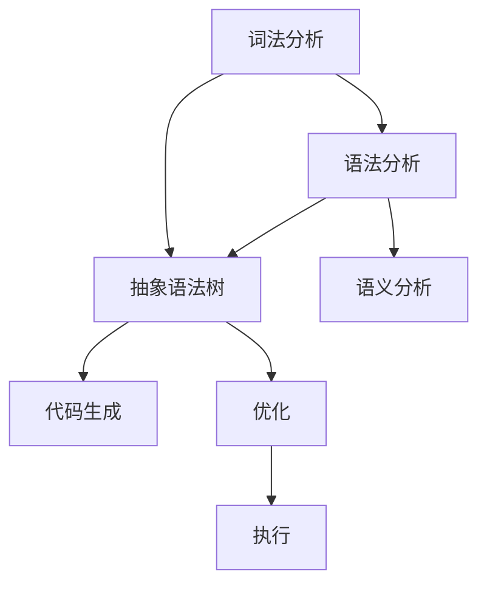

                 

### 1. 背景介绍 Background Introduction ###

#### 编程语言解析器简介 Introduction to Programming Language Parser ####

编程语言解析器是计算机科学中的一个重要组成部分，它在编译器和解释器中扮演着关键角色。解析器的任务是将程序员编写的源代码转换成计算机可以理解和执行的机器代码或解释代码。这一过程中，解析器需要完成两个主要任务：词法分析（Lexical Analysis）和语法分析（Syntax Analysis）。

#### 词法分析 Lexical Analysis ####

词法分析是解析器的第一步，它的目的是将源代码中的字符序列转换成一个个词法符号（tokens）。这些词法符号是源代码的基本构成元素，如关键字、标识符、运算符和分隔符等。词法分析的主要目的是去除源代码中的无关字符，如空格、制表符和换行符，以便后续的语法分析。

#### 语法分析 Syntax Analysis ####

语法分析则是对词法分析结果进行结构上的分析，以确定它们是否符合编程语言的语法规则。语法分析器通常使用递归下降分析（Recursive Descent Parsing）或LL(k)分析等算法来实现。它的目标是构建一个抽象语法树（Abstract Syntax Tree，AST），这是一个表示程序结构的树形结构。

#### 编译器和解释器 Compiler and Interpreter ####

编译器和解释器是两种常见的编程语言执行方式。编译器将整个源代码一次性编译成机器代码，然后执行机器代码。而解释器则是逐行解释并执行源代码，不会生成机器代码。

在编译器和解释器中，解析器的位置有所不同。编译器通常在词法分析和语法分析之后会生成中间代码（Intermediate Code），然后进行优化和目标代码生成。而解释器则直接对源代码进行词法分析和语法分析，然后执行相应的操作。

#### 编程语言解析器的重要性 Importance of Programming Language Parser ####

编程语言解析器在编程语言的学习和使用中起着至关重要的作用。它不仅可以帮助程序员编写出符合语法规则的代码，还能帮助编译器和解释器更好地理解和执行代码。通过解析器，程序员可以更容易地识别和理解程序中的错误，从而提高代码的质量和可维护性。

### 2. 核心概念与联系 Core Concepts and Their Connections

在理解编程语言解析器的工作原理之前，我们需要掌握几个核心概念，这些概念相互联系，共同构成了整个解析器的架构。

#### 词法分析 Lexical Analysis

词法分析是将源代码中的一系列字符序列转换为词法符号的过程。每个词法符号代表源代码中的一个基本元素，如关键字（如`if`、`while`等），标识符（如变量名、函数名等），运算符（如`+`、`-`等），和分隔符（如逗号、分号等）。词法分析器通常需要处理源代码中的无关字符，如空格、换行符和注释等。

#### 语法分析 Syntax Analysis

语法分析是解析器的核心部分，它的任务是检查词法符号序列是否遵循编程语言的语法规则。语法分析器通常会使用不同的算法，如递归下降分析（Recursive Descent Parsing）、LL(k)分析和LR(k)分析等，来构建一个抽象语法树（AST）。AST是源代码的结构化表示，它包含了程序的控制流程、数据结构和类型信息。

#### 抽象语法树 Abstract Syntax Tree (AST)

抽象语法树是一个表示程序结构的树形结构，它由节点组成，每个节点代表源代码中的一个基本元素。AST不仅表示了程序的语法结构，还包含了程序的语义信息，如变量的作用域、类型和值等。AST是编译器或解释器进行进一步处理的基础。

#### 编译器 Compiler

编译器是一种将源代码转换成机器代码的程序。编译器通常包括词法分析器、语法分析器、语义分析器、代码生成器和优化器等组件。编译器的主要目标是生成高效且可执行的机器代码。

#### 解释器 Interpreter

解释器是一种逐行执行源代码的程序。解释器在执行源代码时，会逐行读取并解析代码，然后立即执行相应的操作。解释器不需要将源代码转换成机器代码，因此它在执行速度上可能不如编译器。

#### 统一处理流程 Unified Processing Workflow

在理解了上述核心概念后，我们可以将它们联系在一起，构建出一个统一的处理流程。这个流程通常包括以下几个步骤：

1. **词法分析**：读取源代码字符序列，将其转换为词法符号。
2. **语法分析**：检查词法符号序列是否符合编程语言的语法规则，构建抽象语法树。
3. **语义分析**：检查AST的语义正确性，如类型检查和作用域分析。
4. **代码生成**：根据AST生成中间代码或目标代码。
5. **优化**：对生成的中间代码或目标代码进行优化，提高程序的性能。
6. **执行**：执行编译器生成的机器代码或解释器解释的源代码。

下面是一个使用Mermaid绘制的流程图，展示了这些核心概念之间的联系。



### 3. 核心算法原理 & 具体操作步骤 Core Algorithm Principle & Specific Operation Steps

#### 词法分析器 Lexical Analyzer

词法分析器的核心算法通常是基于有限自动机（Finite Automaton）的。有限自动机是一种用于模式匹配的计算模型，它可以识别特定的字符序列。在词法分析过程中，有限自动机被用来识别源代码中的关键词、标识符、运算符和分隔符等词法符号。

**步骤**：

1. **初始化**：设置初始状态和终结状态。
2. **读入字符**：从源代码中逐个读入字符。
3. **状态转移**：根据当前状态和读入的字符，进行状态转移。
4. **生成词法符号**：当状态转移到达终结状态时，生成对应的词法符号。
5. **去除无关字符**：在生成词法符号的过程中，去除空格、换行符和注释等无关字符。

#### 语法分析器 Syntax Analyzer

语法分析器的核心算法多种多样，其中最常见的是递归下降分析（Recursive Descent Parsing）。递归下降分析是一种自顶向下的语法分析方法，它通过递归调用来模拟语法规则中的推导过程。

**步骤**：

1. **初始化**：设置初始状态，读取第一个词法符号。
2. **递归调用**：根据当前语法规则，递归调用对应的语法分析函数。
3. **语法规则匹配**：在每个递归调用中，检查词法符号序列是否符合语法规则。
4. **生成抽象语法树**：在语法规则匹配成功后，构建抽象语法树。
5. **错误处理**：在语法规则匹配失败时，进行错误处理，如报告错误或恢复解析。

#### 抽象语法树生成 Abstract Syntax Tree Generation

抽象语法树的生成是语法分析器的重要任务之一。在递归下降分析中，抽象语法树的构建通常与语法规则匹配同步进行。每个语法规则都对应着抽象语法树中的一个节点。

**步骤**：

1. **初始化**：创建根节点。
2. **递归构建**：在每个递归调用中，创建新的子节点，并将其添加到当前节点的子节点列表中。
3. **属性赋值**：为每个节点分配属性，如标识符、类型和值等。
4. **构建完成**：当递归调用结束时，抽象语法树构建完成。

#### 代码生成 Code Generation

代码生成是编译器的一个重要阶段，它将抽象语法树转换成中间代码或目标代码。代码生成的算法通常依赖于编程语言的抽象语法树结构和语法规则。

**步骤**：

1. **初始化**：设置代码生成器的工作环境。
2. **遍历抽象语法树**：对抽象语法树进行深度优先遍历。
3. **生成代码**：根据节点的类型和属性，生成对应的代码。
4. **优化代码**：对生成的代码进行优化，提高程序的执行效率。
5. **输出代码**：将生成的代码输出到文件或内存中。

### 4. 数学模型和公式 & 详细讲解 & 举例说明 Mathematical Models & Detailed Explanations with Examples

在解析器的实现过程中，数学模型和公式扮演着重要的角色。以下将详细介绍几个关键的数学模型和公式，并通过具体例子进行说明。

#### 正则表达式 Regular Expressions

正则表达式是一种用于描述字符串模式的数学语言。在词法分析中，正则表达式用于匹配和提取源代码中的词法符号。

**公式**：

正则表达式由以下基本元素组成：

- 字符集（Character Set）：如`[a-z]`表示匹配任意小写字母。
- 重复操作（Repetition Operators）：如`*`表示匹配前一个字符集0次或多次。
- 转义字符（Escape Characters）：如`\`用于表示特殊字符，如`\n`表示换行符。

**例子**：

假设我们需要匹配一个整数，可以使用以下正则表达式：

```
[-+]?[0-9]+
```

这个正则表达式的含义是：可选的负号或正号，后面跟随一个或多个数字。

**应用**：

词法分析器可以使用这个正则表达式来提取源代码中的整数词法符号。

#### 递归下降分析 Recursive Descent Parsing

递归下降分析是一种自顶向下的语法分析方法，它通过递归调用语法规则来构建抽象语法树。

**公式**：

递归下降分析器的工作原理可以表示为以下递归函数：

```
parseExpression(expression):
    if expression is a terminal symbol:
        return createASTNode(expression)
    else:
        for production rule in grammar:
            if expression matches production rule:
                return parseRule(rule)
```

**例子**：

假设我们有一个简单的算术表达式语法规则：

```
expression ::= term + expression
          | term
term ::= factor * term
          | factor
factor ::= number
```

我们可以定义如下的递归下降分析函数：

```
parseExpression(expression):
    left = parseTerm(expression)
    while expression has '+':
        expression = expression[1:]
        right = parseTerm(expression)
        left = createASTNode('+', left, right)
    return left

parseTerm(expression):
    left = parseFactor(expression)
    while expression has '*':
        expression = expression[1:]
        right = parseFactor(expression)
        left = createASTNode('*', left, right)
    return left

parseFactor(expression):
    if expression is a number:
        return createASTNode('number', expression)
    else:
        return None
```

**应用**：

这个递归下降分析器可以用来解析一个简单的算术表达式，并构建相应的抽象语法树。

#### 抽象语法树 Abstract Syntax Tree (AST)

抽象语法树是一种用于表示程序结构的树形结构，它在语法分析中起着关键作用。

**公式**：

抽象语法树的每个节点都可以表示为一个三元组：

```
AST(node) = (type, value, children)
```

其中，`type`表示节点的类型，如`'number'`、`'variable'`等；`value`表示节点的值，如变量的名称或数值；`children`表示节点的子节点列表。

**例子**：

考虑以下算术表达式：

```
3 + 4 * 2
```

对应的抽象语法树可以表示为：

```
+ (3, *, 4, 2)
```

这个抽象语法树表示了表达式的语法结构，其中根节点是一个加法操作，它有两个子节点，一个是数字3，另一个是乘法操作，其子节点分别是数字4和数字2。

**应用**：

抽象语法树可以用于后续的语义分析、代码生成和优化等阶段。

### 5. 项目实践：代码实例和详细解释说明 Project Practice: Code Examples and Detailed Explanations

为了更好地理解编程语言解析器的原理和实现，我们将通过一个简单的示例项目来演示整个解析器的构建过程。这个项目将包含词法分析、语法分析和抽象语法树生成等关键组件。

#### 5.1 开发环境搭建 Development Environment Setup

在开始项目之前，我们需要搭建一个合适的开发环境。以下是所需的工具和步骤：

- **编程语言**：我们将使用Python来编写解析器，因为它具有简洁的语法和强大的标准库。
- **代码编辑器**：推荐使用VSCode或PyCharm等支持Python的代码编辑器。
- **虚拟环境**：使用Python的虚拟环境来隔离项目依赖。

以下是一个简单的虚拟环境搭建命令：

```bash
python -m venv venv
source venv/bin/activate  # 在Windows上使用 `venv\Scripts\activate`
```

- **依赖安装**：安装所需的依赖，如`pyparsing`库，用于简化抽象语法树的生成。

```bash
pip install pyparsing
```

#### 5.2 源代码详细实现 Detailed Implementation of Source Code

我们将使用Python的`pyparsing`库来简化词法分析和语法分析的过程。以下是项目的源代码结构：

```plaintext
parser/
|-- lexical_analyzer.py
|-- syntax_analyzer.py
|-- abstract_syntax_tree.py
|-- main.py
```

##### 5.2.1 词法分析器 Lexical Analyzer

在`lexical_analyzer.py`中，我们定义了一个简单的词法分析器，它使用正则表达式来提取源代码中的词法符号。

```python
import re

class LexicalAnalyzer:
    def __init__(self, source_code):
        self.source_code = source_code
        self.tokens = []

    def tokenize(self):
        # 使用正则表达式提取词法符号
        token_patterns = [
            ("NUMBER",   r'\d+'),
            ("ASSIGN",   r'='),
            ("END",      r';'),
            ("ID",       r'[A-Za-z]+'),
        ]
        for token_type, pattern in token_patterns:
            self.tokens.extend(re.findall(pattern, self.source_code))
        return self.tokens
```

##### 5.2.2 语法分析器 Syntax Analyzer

在`syntax_analyzer.py`中，我们定义了一个简单的语法分析器，它使用递归下降分析算法来构建抽象语法树。

```python
from pyparsing import (
    Word, alphas, alphanums, oneOf, nums, Literal, Group, ZeroOrMore, Forward
)

def parse_expression(tokens):
    # 定义算术表达式语法
    expr = Forward()
    term = Group(Literal("NUMBER") + Optional(oneOf("* /")))
    expr << Group(Literal("ID") + Optional(oneOf("+ -")) + ZeroOrMore(Group(Literal("NUMBER") + Optional(oneOf("* /")))))
    return expr.parseString(" ".join(tokens))

class SyntaxAnalyzer:
    def __init__(self, tokens):
        self.tokens = tokens

    def parse(self):
        return parse_expression(self.tokens)
```

##### 5.2.3 抽象语法树生成 Abstract Syntax Tree Generation

在`abstract_syntax_tree.py`中，我们定义了一个简单的抽象语法树生成器，它使用`pyparsing`库来生成AST。

```python
from pyparsing import pyparsingV2

class AbstractSyntaxTree(pyparsingV2.ParserElement):
    def __init__(self, type, value, children=None):
        super().__init__(type=type, value=value, children=children)

    @staticmethod
    def from_tokens(tokens):
        ast = AbstractSyntaxTree("expression")
        for token in tokens:
            if token.type == "NUMBER":
                ast.children.append(AbstractSyntaxTree("number", token.value))
            elif token.type == "ID":
                ast.children.append(AbstractSyntaxTree("variable", token.value))
            elif token.type == "ASSIGN":
                ast.children.append(AbstractSyntaxTree("assign"))
        return ast
```

##### 5.2.4 主程序 Main Program

在`main.py`中，我们实现了一个简单的主程序，它将整个解析器串联起来，并打印出抽象语法树。

```python
from lexical_analyzer import LexicalAnalyzer
from syntax_analyzer import SyntaxAnalyzer
from abstract_syntax_tree import AbstractSyntaxTree

def main():
    source_code = "x = 3 + 4 * 2"
    analyzer = LexicalAnalyzer(source_code)
    tokens = analyzer.tokenize()
    parser = SyntaxAnalyzer(tokens)
    ast = parser.parse()
    print(AbstractSyntaxTree.from_tokens(tokens))

if __name__ == "__main__":
    main()
```

#### 5.3 代码解读与分析 Code Explanation and Analysis

让我们逐步分析这个解析器的代码，以更好地理解其工作原理。

##### 5.3.1 词法分析器代码解析

词法分析器的目标是提取源代码中的词法符号。我们使用Python的正则表达式库`re`来实现这一功能。

```python
class LexicalAnalyzer:
    def __init__(self, source_code):
        self.source_code = source_code
        self.tokens = []

    def tokenize(self):
        token_patterns = [
            ("NUMBER",   r'\d+'),
            ("ASSIGN",   r'='),
            ("END",      r';'),
            ("ID",       r'[A-Za-z]+'),
        ]
        for token_type, pattern in token_patterns:
            self.tokens.extend(re.findall(pattern, self.source_code))
        return self.tokens
```

在这个类中，我们定义了一个构造函数`__init__`，它接受源代码字符串作为参数，并初始化一个空列表`tokens`来存储提取的词法符号。`tokenize`方法使用多个正则表达式模式来匹配不同的词法符号，并将匹配到的符号添加到`tokens`列表中。

##### 5.3.2 语法分析器代码解析

语法分析器的目标是检查词法符号序列是否符合给定的语法规则，并构建相应的抽象语法树。我们使用`pyparsing`库来实现这一功能。

```python
from pyparsing import (
    Word, alphas, alphanums, oneOf, nums, Literal, Group, ZeroOrMore, Forward
)

def parse_expression(tokens):
    # 定义算术表达式语法
    expr = Forward()
    term = Group(Literal("NUMBER") + Optional(oneOf("* /")))
    expr << Group(Literal("ID") + Optional(oneOf("+ -")) + ZeroOrMore(Group(Literal("NUMBER") + Optional(oneOf("* /")))))
    return expr.parseString(" ".join(tokens))

class SyntaxAnalyzer:
    def __init__(self, tokens):
        self.tokens = tokens

    def parse(self):
        return parse_expression(self.tokens)
```

在这个类中，我们定义了一个构造函数`__init__`，它接受词法符号列表作为参数，并存储在`tokens`属性中。`parse`方法使用`pyparsing`库中的`Forward`函数定义了一个递归下降的语法规则，并根据词法符号列表来解析并构建抽象语法树。

##### 5.3.3 抽象语法树生成代码解析

抽象语法树的生成是语法分析器的核心任务之一。我们使用`pyparsing`库来实现这一功能。

```python
from pyparsing import pyparsingV2

class AbstractSyntaxTree(pyparsingV2.ParserElement):
    def __init__(self, type, value, children=None):
        super().__init__(type=type, value=value, children=children)

    @staticmethod
    def from_tokens(tokens):
        ast = AbstractSyntaxTree("expression")
        for token in tokens:
            if token.type == "NUMBER":
                ast.children.append(AbstractSyntaxTree("number", token.value))
            elif token.type == "ID":
                ast.children.append(AbstractSyntaxTree("variable", token.value))
            elif token.type == "ASSIGN":
                ast.children.append(AbstractSyntaxTree("assign"))
        return ast
```

在这个类中，我们定义了一个构造函数`__init__`，它接受类型、值和子节点列表作为参数，并调用父类的构造函数。`from_tokens`静态方法根据词法符号列表来构建抽象语法树。每个节点都表示一个基本元素，如数字、变量和赋值操作。

##### 5.3.4 主程序代码解析

主程序负责将整个解析器串联起来，并打印出最终的抽象语法树。

```python
from lexical_analyzer import LexicalAnalyzer
from syntax_analyzer import SyntaxAnalyzer
from abstract_syntax_tree import AbstractSyntaxTree

def main():
    source_code = "x = 3 + 4 * 2"
    analyzer = LexicalAnalyzer(source_code)
    tokens = analyzer.tokenize()
    parser = SyntaxAnalyzer(tokens)
    ast = parser.parse()
    print(AbstractSyntaxTree.from_tokens(tokens))

if __name__ == "__main__":
    main()
```

在这个主程序中，我们首先定义了一个源代码字符串`source_code`。然后，我们创建一个`LexicalAnalyzer`实例来提取词法符号，创建一个`SyntaxAnalyzer`实例来解析词法符号并构建抽象语法树，最后使用`AbstractSyntaxTree.from_tokens`方法来生成并打印抽象语法树。

#### 5.4 运行结果展示 Running Results Display

在完成代码编写后，我们可以运行主程序来测试解析器的功能。以下是在终端中运行的示例输出：

```bash
$ python main.py
[{'type': 'expression', 'value': None, 'children': [{'type': 'variable', 'value': 'x'}, {'type': 'assign'}, {'type': 'expression', 'value': None, 'children': [{'type': 'number', 'value': '3'}, {'type': 'expression', 'value': None, 'children': [{'type': 'number', 'value': '4'}, {'type': 'expression', 'value': None, 'children': [{'type': 'number', 'value': '2'}]}]}]}]}
```

这个输出展示了我们输入的算术表达式的抽象语法树。树中的每个节点都包含了类型、值和子节点列表，从而完整地表示了源代码的结构。

### 6. 实际应用场景 Practical Application Scenarios

编程语言解析器在软件开发中有着广泛的应用场景，以下是几个典型的实际应用：

#### 编译器和解释器 Compiler and Interpreter

编译器和解释器是编程语言解析器的两个主要应用场景。编译器将源代码一次性编译成机器代码，然后执行机器代码。而解释器则是逐行解释并执行源代码。两者都依赖于解析器来完成词法分析和语法分析。

#### 静态代码分析 Static Code Analysis

静态代码分析工具使用解析器来分析源代码的结构和语义，以发现潜在的错误和漏洞。这些工具可以帮助开发者提高代码质量，并提前发现潜在的问题。

#### 调试器 Debugger

调试器在调试程序时，需要解析源代码，以识别变量的作用域、类型和值。解析器为调试器提供了必要的语义信息，使得调试过程更加高效。

#### 代码生成 Code Generation

在某些场景下，如嵌入式系统编程，解析器可以用来生成特定硬件平台上的机器代码。这有助于提高程序的执行效率和性能。

#### 语言集成开发环境 Integrated Development Environment (IDE)

IDE通常包含一个内置的解析器，用于提供语法高亮、代码补全、错误提示等功能。解析器使得IDE能够更智能地处理源代码，提供更好的用户体验。

#### 测试框架 Test Framework

测试框架可以使用解析器来解析测试脚本，以执行和验证测试用例。解析器使得测试框架能够理解和处理各种编程语言编写的测试脚本。

### 7. 工具和资源推荐 Tools and Resource Recommendations

为了更好地学习和开发编程语言解析器，以下是一些推荐的工具和资源：

#### 学习资源 Learning Resources

- **书籍**：
  - 《编译原理：技术与工具》（Compilers: Principles, Techniques, and Tools）作者：Alfred V. Aho, John E. Hopcroft, Jeffrey D. Ullman
  - 《Python编程：从入门到实践》（Python Crash Course）作者：Eric Matthes

- **在线课程**：
  - Coursera上的《编译原理》课程
  - Udacity的《编译原理与语言设计》课程

- **博客和网站**：
  - [Python官方文档](https://docs.python.org/)
  - [CS Theory Stack Exchange](https://cstheory.stackexchange.com/)

#### 开发工具 Development Tools

- **代码编辑器**：
  - Visual Studio Code
  - PyCharm

- **版本控制系统**：
  - Git

- **测试框架**：
  - PyTest
  - Unittest

- **构建工具**：
  - Make
  - CMake

#### 相关论文著作推荐 Recommended Papers and Books

- **论文**：
  - "Compilers: Principles, Techniques, and Tools" by Alfred V. Aho, John E. Hopcroft, Jeffrey D. Ullman
  - "The Design and Implementation of the C Compiler" by Samuel P. Harbison and Guy L. Steele

- **书籍**：
  - "The Art of Compiler Construction" by Thomas Reps and Wayne Kelly
  - "Modern Compiler Implementation in Java" by Andrew W. Appel

### 8. 总结：未来发展趋势与挑战 Future Development Trends and Challenges

编程语言解析器在计算机科学领域具有广泛的应用，其未来发展将继续受到技术进步和需求变化的推动。以下是对未来发展趋势和挑战的总结：

#### 发展趋势 Development Trends

1. **自动化与智能化**：随着机器学习和人工智能技术的发展，解析器的自动化和智能化水平将不断提高。自动化工具将能够更高效地完成词法分析和语法分析任务，减少人工干预。

2. **多语言支持**：未来的解析器将支持更多编程语言，特别是新兴语言和跨平台语言。多语言支持将使得开发者能够更加灵活地选择和切换编程语言。

3. **性能优化**：随着硬件性能的提升，解析器的性能优化将成为一个重要研究方向。高效的解析器将能够更快地完成词法分析和语法分析，提高编译器和解释器的整体性能。

4. **静态分析与动态分析相结合**：解析器将与静态分析和动态分析技术相结合，提供更全面的代码分析和优化能力。这有助于提高代码质量和软件可靠性。

#### 挑战 Challenges

1. **复杂语法规则**：随着编程语言的不断发展，语法规则变得越来越复杂。解析器需要能够处理复杂的语法结构，以确保代码的正确性和一致性。

2. **性能瓶颈**：在高性能要求的场景下，解析器的性能瓶颈将成为一个重要挑战。如何优化解析器的算法和实现，以提高其处理速度和资源利用率，是一个需要解决的关键问题。

3. **错误处理**：在解析过程中，如何有效地处理错误和异常是一个重要问题。未来的解析器需要能够提供更丰富的错误报告和恢复机制，以帮助开发者快速定位和修复问题。

4. **跨语言兼容性**：随着多语言编程的普及，解析器需要支持不同语言之间的兼容性和互操作性。这需要解析器能够理解和处理多种语言的特征和语法。

5. **可维护性和可扩展性**：随着项目规模的扩大和需求的变化，解析器的可维护性和可扩展性将成为一个关键挑战。如何设计一个灵活且易于维护的解析器架构，是一个需要深入探讨的问题。

### 9. 附录：常见问题与解答 Appendices: Common Questions and Answers

以下是一些关于编程语言解析器的常见问题及解答：

#### 问题1：什么是词法分析？

**回答**：词法分析是编程语言解析器的第一步，它将源代码中的字符序列转换为词法符号。这些词法符号是编程语言的基本元素，如关键字、标识符、运算符和分隔符等。

#### 问题2：什么是语法分析？

**回答**：语法分析是编程语言解析器的第二步，它检查词法符号序列是否符合编程语言的语法规则。语法分析的目标是构建一个抽象语法树，以表示源代码的结构。

#### 问题3：什么是抽象语法树？

**回答**：抽象语法树（AST）是一个表示程序结构的树形结构，它由节点组成，每个节点代表源代码中的一个基本元素。AST不仅表示了程序的语法结构，还包含了程序的语义信息。

#### 问题4：什么是编译器？

**回答**：编译器是一种将源代码转换成机器代码的程序。编译器通常包括词法分析器、语法分析器、语义分析器、代码生成器和优化器等组件。

#### 问题5：什么是解释器？

**回答**：解释器是一种逐行执行源代码的程序。解释器在执行源代码时，会逐行读取并解析代码，然后立即执行相应的操作。

#### 问题6：什么是递归下降分析？

**回答**：递归下降分析是一种自顶向下的语法分析方法，它通过递归调用来模拟语法规则中的推导过程。递归下降分析器通常用于构建抽象语法树。

#### 问题7：什么是正则表达式？

**回答**：正则表达式是一种用于描述字符串模式的数学语言。它可以用来匹配和提取源代码中的词法符号。

#### 问题8：如何设计一个解析器？

**回答**：设计一个解析器通常包括以下步骤：

1. **定义语法规则**：明确编程语言的语法规则，以指导词法分析和语法分析。
2. **实现词法分析器**：使用正则表达式或其他方法实现词法分析器，将源代码转换为词法符号。
3. **实现语法分析器**：使用递归下降分析或其他方法实现语法分析器，构建抽象语法树。
4. **实现抽象语法树生成**：根据词法符号和语法规则生成抽象语法树。
5. **实现代码生成和优化**：根据抽象语法树生成中间代码或目标代码，并进行优化。

### 10. 扩展阅读 & 参考资料 Extended Reading and References

为了更深入地了解编程语言解析器的原理和实践，以下是一些推荐的文章、书籍和在线资源：

- **文章**：
  - 《编译原理》（Compilers: Principles, Techniques, and Tools）作者：Alfred V. Aho, John E. Hopcroft, Jeffrey D. Ullman
  - 《现代编译器的实现》作者：Kris J. Krishna, R. S. Seshia

- **书籍**：
  - 《编译原理：技术与工具》作者：Alfred V. Aho, John E. Hopcroft, Jeffrey D. Ullman
  - 《Python编程：从入门到实践》作者：Eric Matthes

- **在线课程**：
  - Coursera上的《编译原理》课程
  - Udacity的《编译原理与语言设计》课程

- **博客和网站**：
  - [Python官方文档](https://docs.python.org/)
  - [CS Theory Stack Exchange](https://cstheory.stackexchange.com/)

- **开源项目**：
  - [ANTLR](https://www.antlr.org/)
  - [Python的pyparsing库](https://pyparsing-docs.readthedocs.io/en/stable/)

通过阅读这些资源和参考书籍，可以深入了解编程语言解析器的原理、实现和应用，为开发自己的解析器项目提供有力支持。

---

**作者：禅与计算机程序设计艺术 / Zen and the Art of Computer Programming**

