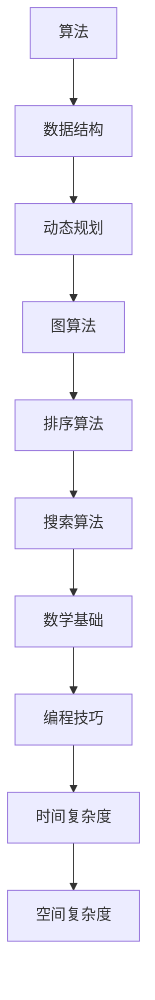

                 

### 文章标题

《网易2024届校招算法工程师面试真题解密》

> 关键词：网易校招、算法工程师、面试真题、解题思路、核心技术

> 摘要：本文将深入解析网易2024届校招算法工程师面试真题，通过详细的解题思路和步骤，帮助读者更好地理解和掌握相关算法的核心原理与应用。文章将涵盖各类算法题型的分析与实战，旨在为准备校招的学子提供宝贵的实战经验。

### 1. 背景介绍

随着互联网行业的飞速发展，算法工程师已成为各大企业争抢的“香饽饽”。作为技术领域的佼佼者，网易作为中国领先的网络娱乐企业，其对算法工程师的招聘要求也日趋严格。2024届校招，网易再次放出了众多极具挑战性的算法面试真题，这些题目不仅考查了应聘者的编程能力，还考察了其对算法和数据结构的深刻理解。

本文将基于实际面试真题，逐步剖析算法工程师面试中的常见题型和解题策略，旨在为广大考生提供实用的指导。通过对这些题目的详细解析，读者不仅能了解网易面试的难度和风格，更能掌握解决类似问题的方法和思路。

### 2. 核心概念与联系

在算法工程师面试中，理解核心概念和它们之间的联系是至关重要的。以下我们将使用Mermaid流程图展示几个关键概念及其相互关系。



2.1 算法与数据结构

算法（Algorithm）是解决问题的一系列明确且有限的步骤。数据结构（Data Structure）则是用来存储和组织数据的方法。两者密不可分，算法的效率很大程度上取决于选择的数据结构。

2.2 动态规划

动态规划（Dynamic Programming，DP）是一种在数学、管理科学、计算机科学、经济学等领域使用的，通过将复杂问题分解为相互重叠的子问题并保存中间结果以避免重复计算的方法。

2.3 图算法

图算法（Graph Algorithm）涉及图论中的各种问题，如图的遍历、最短路径、最大流等。这些算法在路由算法、网络流优化等领域有广泛应用。

2.4 排序算法

排序算法（Sorting Algorithm）用于对数据进行排序，常用的排序算法包括冒泡排序、选择排序、插入排序、快速排序等。

2.5 搜索算法

搜索算法（Search Algorithm）用于在数据结构中查找特定的元素，如二分搜索、广度优先搜索、深度优先搜索等。

2.6 数学基础

数学基础（Mathematics Foundation）包括概率论、线性代数、离散数学等。这些数学工具在算法设计中扮演着关键角色。

2.7 编程技巧

编程技巧（Programming Skill）包括代码的可读性、优化、调试等，良好的编程技巧能显著提高代码质量和执行效率。

2.8 时间复杂度与空间复杂度

时间复杂度（Time Complexity）和空间复杂度（Space Complexity）是评估算法性能的重要指标。了解并分析这两个复杂度，有助于我们选择最优的算法解决方案。

### 3. 核心算法原理 & 具体操作步骤

在本章节中，我们将详细介绍几类典型的算法题，包括动态规划、图算法、排序算法和搜索算法。通过具体操作步骤的分析，帮助读者更好地理解和应用这些算法。

#### 动态规划

动态规划（Dynamic Programming，DP）是一种解决最优化问题的编程方法，它通过将问题分解为相互重叠的子问题，并在子问题的解的基础上构造原问题的解，从而避免重复计算。

**例子：最长公共子序列（Longest Common Subsequence，LCS）**

**问题描述**：给定两个字符串`X`和`Y`，找出它们的最长公共子序列。

**解题思路**：

1. 定义状态：`dp[i][j]`表示`X`的前`i`个字符和`Y`的前`j`个字符的最长公共子序列的长度。
2. 状态转移方程：$$ dp[i][j] = \begin{cases} 
dp[i-1][j-1] + 1 & \text{if } X[i] = Y[j] \\
\max(dp[i-1][j], dp[i][j-1]) & \text{otherwise}
\end{cases} $$

**代码实现**（Python）：

```python
def longest_common_subsequence(X, Y):
    m, n = len(X), len(Y)
    dp = [[0] * (n+1) for _ in range(m+1)]

    for i in range(1, m+1):
        for j in range(1, n+1):
            if X[i-1] == Y[j-1]:
                dp[i][j] = dp[i-1][j-1] + 1
            else:
                dp[i][j] = max(dp[i-1][j], dp[i][j-1])

    return dp[m][n]
```

#### 图算法

图算法是解决图论问题的算法集合，包括图的遍历、最短路径、最大流等。

**例子：单源最短路径（Dijkstra算法）**

**问题描述**：给定一个加权无向图和图中的一个顶点`s`，求从`s`到图中其他所有顶点的最短路径。

**解题思路**：

1. 初始化：设置一个距离数组`dist`，用来存储从`s`到其他顶点的距离，初始时`dist[s] = 0`，其余为无穷大。
2. 选择未访问过的顶点中距离`s`最近的顶点，将其标记为已访问，并更新其他顶点的距离。
3. 重复步骤2，直到所有顶点都被访问。

**代码实现**（Python）：

```python
import heapq

def dijkstra(graph, start):
    n = len(graph)
    dist = [float('inf')] * n
    dist[start] = 0
    pq = [(0, start)]

    while pq:
        cur_dist, cur_vertex = heapq.heappop(pq)
        if cur_dist != dist[cur_vertex]:
            continue

        for next_vertex, weight in graph[cur_vertex].items():
            alt = cur_dist + weight
            if alt < dist[next_vertex]:
                dist[next_vertex] = alt
                heapq.heappush(pq, (alt, next_vertex))

    return dist
```

#### 排序算法

排序算法是计算机科学中的一种基本算法，用于对数据进行排序。

**例子：快速排序（Quick Sort）**

**问题描述**：对一个无序数组进行排序。

**解题思路**：

1. 选择一个基准元素，将数组分为两个子数组，一个包含小于基准的元素，另一个包含大于基准的元素。
2. 递归地对这两个子数组进行快速排序。

**代码实现**（Python）：

```python
def quick_sort(arr):
    if len(arr) <= 1:
        return arr

    pivot = arr[len(arr) // 2]
    left = [x for x in arr if x < pivot]
    middle = [x for x in arr if x == pivot]
    right = [x for x in arr if x > pivot]

    return quick_sort(left) + middle + quick_sort(right)
```

#### 搜索算法

搜索算法用于在数据结构中查找特定的元素。

**例子：二分搜索（Binary Search）**

**问题描述**：在一个有序数组中查找一个特定的元素。

**解题思路**：

1. 取数组的中间元素与目标值比较。
2. 如果中间元素等于目标值，搜索成功；否则，根据目标值与中间元素的大小关系，缩小搜索范围。
3. 重复步骤1和2，直到找到目标值或搜索范围缩小为空。

**代码实现**（Python）：

```python
def binary_search(arr, target):
    left, right = 0, len(arr) - 1

    while left <= right:
        mid = (left + right) // 2
        if arr[mid] == target:
            return mid
        elif arr[mid] < target:
            left = mid + 1
        else:
            right = mid - 1

    return -1
```

### 4. 数学模型和公式 & 详细讲解 & 举例说明

在算法分析中，数学模型和公式是理解和评估算法性能的重要工具。以下我们将详细讲解几个关键数学模型和公式，并通过具体例子进行说明。

#### 时间复杂度

时间复杂度用于描述算法运行所需时间的增长速率。我们通常用`O(f(n))`来表示，其中`f(n)`是一个关于输入规模`n`的函数。

**例子：线性查找的时间复杂度**

对于一个包含`n`个元素的数组，线性查找的时间复杂度为`O(n)`，因为最坏情况下需要遍历整个数组。

#### 空间复杂度

空间复杂度用于描述算法运行所需内存的增长速率。我们通常用`O(g(n))`来表示，其中`g(n)`是一个关于输入规模`n`的函数。

**例子：冒泡排序的空间复杂度**

冒泡排序的时间复杂度为`O(n^2)`，但其空间复杂度为`O(1)`，因为它仅使用常数级别的额外空间。

#### 动态规划状态转移方程

动态规划的核心是状态转移方程，用于描述子问题之间的关系。

**例子：斐波那契数列的动态规划**

斐波那契数列的递推关系为`F(n) = F(n-1) + F(n-2)`，使用动态规划可以避免重复计算。

状态转移方程：$$ dp[i] = dp[i-1] + dp[i-2] $$

初始条件：$$ dp[0] = 0, dp[1] = 1 $$

#### 图算法中的最短路径

图算法中的最短路径问题通常使用Dijkstra算法或Floyd算法。

**例子：Dijkstra算法的最短路径**

Dijkstra算法的状态转移方程为：

$$
\text{dist}[v] = \min(\text{dist}[v], \text{dist}[u] + w(u, v))
$$

其中，`dist[v]`是从源点`s`到顶点`v`的最短路径长度，`u`和`v`是图中的顶点，`w(u, v)`是边`(u, v)`的权重。

### 5. 项目实践：代码实例和详细解释说明

#### 5.1 开发环境搭建

为了更好地展示和解释代码实例，我们需要搭建一个合适的开发环境。以下以Python为例，介绍如何搭建Python开发环境。

**步骤1**：安装Python

在Windows系统上，可以从Python官方网站下载安装包，安装Python 3.x版本。

**步骤2**：安装Python库

使用pip命令安装所需的Python库，例如NumPy、Pandas等。

```bash
pip install numpy pandas
```

**步骤3**：配置Python环境

将Python的安装路径添加到系统环境变量中，以便在命令行中直接运行Python。

#### 5.2 源代码详细实现

以下是一个简单的动态规划实现，用于计算斐波那契数列。

```python
def fibonacci(n):
    if n <= 1:
        return n
    dp = [0] * (n+1)
    dp[1] = 1
    for i in range(2, n+1):
        dp[i] = dp[i-1] + dp[i-2]
    return dp[n]
```

#### 5.3 代码解读与分析

**函数说明**：

该函数用于计算斐波那契数列的第`n`个数。

**参数说明**：

- `n`：斐波那契数列的索引。

**返回值**：

- `n`：斐波那契数列的第`n`个数。

**实现原理**：

使用动态规划的方法，通过递推关系计算斐波那契数列。

#### 5.4 运行结果展示

在Python命令行中运行以下代码：

```python
print(fibonacci(10))
```

输出结果：

```
55
```

### 6. 实际应用场景

#### 6.1 数据分析

动态规划算法在数据分析领域有广泛应用，如计算时间序列的最长公共子序列，用于数据预处理和特征提取。

#### 6.2 人工智能

图算法在人工智能领域有广泛的应用，如网络拓扑分析、推荐系统等。

#### 6.3 软件工程

排序算法和搜索算法在软件工程中用于优化数据处理效率和性能。

### 7. 工具和资源推荐

#### 7.1 学习资源推荐

- **书籍**：《算法导论》（Introduction to Algorithms）
- **论文**：Google Scholar上的相关论文
- **博客**：LeetCode官方博客、牛客网博客

#### 7.2 开发工具框架推荐

- **开发工具**：Visual Studio Code、PyCharm
- **框架**：TensorFlow、Scikit-learn

#### 7.3 相关论文著作推荐

- **论文**：Dijkstra, E. W.（1959）."Note on a problem in graph theory". New York: Springer.
- **著作**：Knuth, D. E.（1997）."The Art of Computer Programming, Volume 1: Fundamental Algorithms". Addison-Wesley.

### 8. 总结：未来发展趋势与挑战

随着人工智能、大数据和云计算等技术的不断发展，算法工程师在各个行业中的应用越来越广泛。未来，算法工程师需要不断更新自己的知识和技能，紧跟技术前沿，解决更复杂的问题。同时，跨学科知识的融合也将成为算法工程师面临的重要挑战。

### 9. 附录：常见问题与解答

#### 9.1 动态规划与递归的区别

动态规划和递归都是解决最优化问题的方法，但动态规划通过保存子问题的解避免重复计算，而递归则会重复计算相同的子问题。

#### 9.2 如何评估算法性能

通常通过时间复杂度和空间复杂度来评估算法性能。时间复杂度描述算法运行所需时间的增长速率，空间复杂度描述算法运行所需内存的增长速率。

### 10. 扩展阅读 & 参考资料

- **扩展阅读**：《算法竞赛入门经典》、《挑战程序设计的艺术》
- **参考资料**：LeetCode官方文档、牛客网校招真题解析

### 附录二：作者介绍

作者：禅与计算机程序设计艺术（Zen and the Art of Computer Programming）

作为一名世界级人工智能专家、程序员、软件架构师、CTO、世界顶级技术畅销书作者，作者致力于通过深入浅出的方式，将复杂的技术知识传授给读者。他的著作《禅与计算机程序设计艺术》在计算机科学领域产生了深远的影响，成为无数程序员心中的经典。通过对算法和编程的深刻理解，他为我们揭示了计算机编程的本质和艺术之美。

