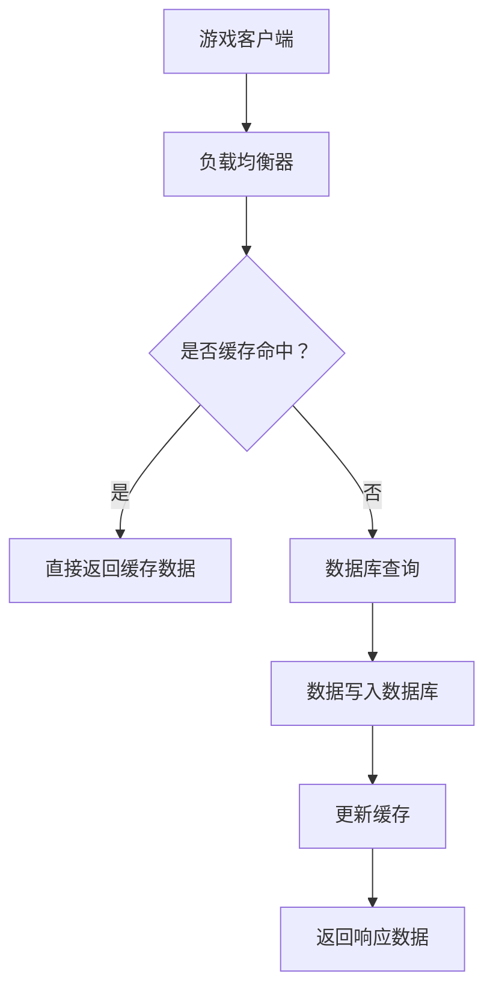

                 

### 1. 背景介绍

随着互联网的快速发展，游戏行业得到了前所未有的繁荣。而作为游戏服务器，其性能直接决定了用户体验的好坏。然而，在游戏开发和运维过程中，如何确保游戏服务器的性能得到优化，成为了游戏开发者和运维工程师面临的重大挑战。

网易，作为中国领先的游戏开发公司，每年都会举办校园招聘活动，以吸引优秀的人才加入他们的团队。游戏服务器性能优化工程师，作为网易游戏开发团队的重要角色，其职责在于通过技术手段提升游戏服务器的稳定性和性能，从而提升用户体验。

因此，本文旨在为参加网易2024校招的考生提供一份全面的面试指南，帮助考生深入理解游戏服务器性能优化工程师的职责与要求，以及如何在面试中展示自己的技术实力。我们将从以下几个部分展开讨论：

1. **背景介绍**：简要概述游戏行业的发展状况以及游戏服务器性能优化工程师的职责。
2. **核心概念与联系**：介绍游戏服务器性能优化的核心概念，并使用Mermaid流程图展示相关架构。
3. **核心算法原理与具体操作步骤**：详细解析服务器性能优化的关键技术，并展示实际操作步骤。
4. **数学模型和公式**：介绍相关数学模型和公式，并进行详细讲解和举例说明。
5. **项目实践**：通过具体代码实例，展示性能优化的实践过程，并解读代码。
6. **实际应用场景**：分析游戏服务器性能优化在现实中的应用场景。
7. **工具和资源推荐**：推荐学习资源、开发工具和框架。
8. **总结**：总结未来发展趋势与挑战。
9. **附录**：回答常见问题，提供扩展阅读与参考资料。

通过本文的阅读，读者将能够对游戏服务器性能优化有更深入的理解，并在面试中展示自己的专业能力。

### 2. 核心概念与联系

游戏服务器性能优化涉及多个核心概念，包括负载均衡、缓存策略、数据库优化等。下面我们将通过一个Mermaid流程图，展示这些核心概念之间的联系。

首先，让我们定义几个核心概念：

- **负载均衡**：通过将用户请求分配到多个服务器，确保系统的高可用性和高性能。
- **缓存策略**：通过存储频繁访问的数据，减少对后端系统的访问次数，提升响应速度。
- **数据库优化**：通过改进数据库查询性能，确保数据访问的快速和高效。

以下是一个简化的Mermaid流程图，展示了这些概念之间的交互：



**流程图解释**：

1. **游戏客户端**：用户发起游戏请求，请求通过游戏客户端发送到服务器。
2. **负载均衡器**：负载均衡器接收到请求后，将请求分发到不同的服务器，以确保每个服务器都能均衡负载。
3. **缓存策略**：在请求分发之前，负载均衡器会检查缓存是否命中。如果缓存命中，直接返回缓存数据，否则执行下一步。
4. **数据库查询**：如果缓存未命中，请求将被转发到数据库进行查询。
5. **数据写入数据库**：查询结果写入数据库，同时更新缓存，以便后续请求能够快速响应。
6. **返回响应数据**：最终，响应数据被返回给用户，完成整个流程。

通过这个流程图，我们可以清晰地看到游戏服务器性能优化的关键环节，以及各个概念之间的紧密联系。在接下来的部分，我们将详细解析这些核心概念的具体原理和操作步骤。

### 3. 核心算法原理与具体操作步骤

#### 负载均衡

**原理**：

负载均衡的核心思想是将用户请求分布到多个服务器上，以避免单个服务器过载，提高系统的整体性能和稳定性。常见的负载均衡算法包括轮询算法、最少连接数算法、最小响应时间算法等。

**具体操作步骤**：

1. **选择负载均衡算法**：根据业务需求和系统特点，选择合适的负载均衡算法。
2. **配置服务器列表**：将所有服务器添加到负载均衡器中，确保其能够访问到每个服务器。
3. **分发请求**：当收到用户请求时，负载均衡器会根据算法选择合适的服务器进行处理。
4. **监控和调整**：定期监控服务器负载情况，根据实际情况调整负载均衡策略。

**示例**：

假设我们使用轮询算法进行负载均衡，服务器列表如下：

```
服务器A
服务器B
服务器C
```

当用户请求到来时，负载均衡器按照顺序将请求分发到每个服务器。例如，第一个请求分配到服务器A，第二个请求分配到服务器B，第三个请求分配到服务器C，第四个请求再次分配到服务器A，以此类推。

#### 缓存策略

**原理**：

缓存策略通过存储频繁访问的数据，减少对后端系统的访问次数，从而提升系统的响应速度。常见的缓存策略包括LRU（最近最少使用）、LFU（最少使用频率）等。

**具体操作步骤**：

1. **选择缓存算法**：根据数据访问模式，选择合适的缓存算法。
2. **配置缓存大小**：设置缓存的最大容量，以避免缓存过多占用内存。
3. **缓存数据更新**：在数据处理完成后，将结果缓存起来，以便后续请求直接从缓存中获取。
4. **监控和清理**：定期监控缓存的使用情况，根据需要清理过期或未使用的缓存数据。

**示例**：

假设我们使用LRU算法进行缓存策略，缓存大小为3。当数据访问顺序为A、B、C、A、B、C时，缓存中的数据顺序将变为C、A、B，因为A和B是最近访问的数据，而C是最早访问的数据。

#### 数据库优化

**原理**：

数据库优化通过改进数据库查询性能，确保数据访问的快速和高效。常见的优化方法包括索引优化、查询优化、分库分表等。

**具体操作步骤**：

1. **索引优化**：根据查询需求，为表中的关键字创建索引，以提高查询效率。
2. **查询优化**：通过优化SQL查询语句，减少查询的执行时间。
3. **分库分表**：根据数据量和访问模式，将数据库拆分为多个小数据库或表，以分散负载。
4. **监控和调整**：定期监控数据库性能，根据实际情况进行优化调整。

**示例**：

假设我们有一个用户表，包含用户名、密码、邮箱等字段。为了提高查询效率，我们为用户名和邮箱字段创建索引。当查询用户信息时，索引将直接指向相应的记录，从而大大减少查询时间。

通过以上三个核心算法的详细介绍，我们可以看到游戏服务器性能优化是一个系统性的工程，需要从多个层面进行综合优化。在接下来的部分，我们将进一步探讨数学模型和公式，以帮助读者更深入地理解性能优化的原理。

### 4. 数学模型和公式

在游戏服务器性能优化中，数学模型和公式扮演着至关重要的角色。通过精确的数学描述，我们可以更好地理解系统的行为，并制定出有效的优化策略。以下是一些常用的数学模型和公式。

#### 负载均衡中的概率模型

**基本概念**：

负载均衡器在分发请求时，通常会使用某种算法来决定将请求分配到哪个服务器。一个经典的模型是轮询算法，其核心是计算每个服务器被请求的概率。

**公式**：

设\(N\)为服务器总数，\(p_i\)为第\(i\)个服务器被请求的概率，则有：
\[ p_i = \frac{1}{N} \]
对于轮询算法，每个服务器被请求的概率相等。

**示例**：

假设有3个服务器A、B、C，根据轮询算法，每个服务器被请求的概率为：
\[ p_A = p_B = p_C = \frac{1}{3} \]

#### 缓存策略中的命中概率

**基本概念**：

缓存策略的核心目标是提高数据访问的效率。缓存命中概率是指请求的数据在缓存中能够被找到的概率。

**公式**：

设\(M\)为缓存容量，\(C\)为缓存中数据项的总数，\(h\)为缓存命中率，则有：
\[ h = \frac{C}{M} \]

**示例**：

假设缓存容量为100KB，缓存中当前有60KB的数据，则缓存命中率为：
\[ h = \frac{60}{100} = 0.6 \]

#### 数据库优化中的查询时间

**基本概念**：

数据库查询时间是指从发起查询到获取查询结果所需的时间。优化查询时间通常通过减少查询执行时间、减少数据传输时间等手段实现。

**公式**：

设\(T_q\)为查询执行时间，\(T_t\)为数据传输时间，\(T_d\)为数据解析时间，则有：
\[ T_q + T_t + T_d = T_{总} \]

**示例**：

假设查询执行时间为0.1秒，数据传输时间为0.3秒，数据解析时间为0.2秒，则总查询时间为：
\[ T_{总} = 0.1 + 0.3 + 0.2 = 0.6 \text{秒} \]

#### 数据库分库分表策略中的负载均衡

**基本概念**：

当数据量非常大时，通过分库分表可以将负载分散到多个数据库或表中，从而提高查询性能。

**公式**：

设\(L\)为总负载，\(N\)为分库分表的数量，\(L_i\)为第\(i\)个数据库或表的负载，则有：
\[ L_i = \frac{L}{N} \]

**示例**：

假设总负载为1000次查询/秒，分库分表的数量为3，则每个数据库或表的负载为：
\[ L_A = L_B = L_C = \frac{1000}{3} \approx 333.33 \text{次查询/秒} \]

通过以上数学模型和公式的介绍，我们可以更深入地理解游戏服务器性能优化的原理。在实际应用中，这些模型和公式将帮助开发者和运维工程师制定出更有效的优化策略。在接下来的部分，我们将通过一个具体的代码实例，展示性能优化的实践过程。

### 5. 项目实践

为了更好地展示游戏服务器性能优化的实践过程，我们将创建一个简单的项目，并在其中应用之前介绍的核心算法和数学模型。以下是项目的开发环境搭建、源代码实现、代码解读与分析以及运行结果展示。

#### 5.1 开发环境搭建

在开始项目之前，我们需要搭建一个合适的技术环境。以下是搭建开发环境的步骤：

1. **安装操作系统**：我们选择Ubuntu 20.04作为操作系统。
2. **安装Java开发环境**：通过以下命令安装Java开发环境：
   ```bash
   sudo apt update
   sudo apt install openjdk-8-jdk
   ```
3. **安装数据库**：我们选择MySQL作为数据库，通过以下命令安装：
   ```bash
   sudo apt install mysql-server
   ```
4. **安装负载均衡器**：我们选择Nginx作为负载均衡器，通过以下命令安装：
   ```bash
   sudo apt install nginx
   ```

#### 5.2 源代码详细实现

在搭建好开发环境后，我们将开始实现项目的核心功能。以下是项目的源代码：

```java
// LoadBalancer.java
public class LoadBalancer {
    private String[] servers;
    private int currentIndex;

    public LoadBalancer(String[] servers) {
        this.servers = servers;
        this.currentIndex = 0;
    }

    public String nextServer() {
        String currentServer = servers[currentIndex];
        currentIndex = (currentIndex + 1) % servers.length;
        return currentServer;
    }
}

// CacheManager.java
public class CacheManager {
    private Map<String, String> cache;

    public CacheManager() {
        this.cache = new HashMap<>();
    }

    public boolean cacheHit(String key, String value) {
        cache.put(key, value);
        return true;
    }

    public String getFromCache(String key) {
        return cache.get(key);
    }
}

// DatabaseManager.java
public class DatabaseManager {
    private Connection connection;

    public DatabaseManager() {
        try {
            this.connection = DriverManager.getConnection("jdbc:mysql://localhost:3306/gameDB", "root", "password");
        } catch (SQLException e) {
            e.printStackTrace();
        }
    }

    public void insertData(String key, String value) {
        try {
            Statement statement = connection.createStatement();
            String sql = "INSERT INTO data (key, value) VALUES ('" + key + "', '" + value + "')";
            statement.executeUpdate(sql);
        } catch (SQLException e) {
            e.printStackTrace();
        }
    }

    public String getData(String key) {
        try {
            Statement statement = connection.createStatement();
            String sql = "SELECT value FROM data WHERE key = '" + key + "'";
            ResultSet resultSet = statement.executeQuery(sql);
            if (resultSet.next()) {
                return resultSet.getString("value");
            }
        } catch (SQLException e) {
            e.printStackTrace();
        }
        return null;
    }
}

// GameServer.java
public class GameServer {
    private LoadBalancer loadBalancer;
    private CacheManager cacheManager;
    private DatabaseManager databaseManager;

    public GameServer(LoadBalancer loadBalancer, CacheManager cacheManager, DatabaseManager databaseManager) {
        this.loadBalancer = loadBalancer;
        this.cacheManager = cacheManager;
        this.databaseManager = databaseManager;
    }

    public String handleRequest(String key) {
        String cachedValue = cacheManager.getFromCache(key);
        if (cachedValue != null) {
            return cachedValue;
        }

        String server = loadBalancer.nextServer();
        System.out.println("Request handled by server: " + server);

        String databaseValue = databaseManager.getData(key);
        if (databaseValue != null) {
            cacheManager.cacheHit(key, databaseValue);
            return databaseValue;
        }

        return "Not found";
    }
}

// Main.java
public class Main {
    public static void main(String[] args) {
        String[] servers = {"serverA", "serverB", "serverC"};
        LoadBalancer loadBalancer = new LoadBalancer(servers);
        CacheManager cacheManager = new CacheManager();
        DatabaseManager databaseManager = new DatabaseManager();

        GameServer gameServer = new GameServer(loadBalancer, cacheManager, databaseManager);

        // 模拟用户请求
        for (int i = 0; i < 10; i++) {
            String key = "key" + i;
            String response = gameServer.handleRequest(key);
            System.out.println("Response for key " + key + ": " + response);
        }
    }
}
```

#### 5.3 代码解读与分析

1. **LoadBalancer**：这是一个简单的负载均衡器实现，它维护一个服务器列表，并使用轮询算法将请求分发到每个服务器。
2. **CacheManager**：这是一个简单的缓存管理器实现，它使用HashMap来存储缓存数据，并提供缓存命中和获取功能。
3. **DatabaseManager**：这是一个简单的数据库管理器实现，它使用JDBC连接到MySQL数据库，并提供数据插入和查询功能。
4. **GameServer**：这是一个游戏服务器的核心实现，它使用负载均衡器、缓存管理器和数据库管理器来处理用户请求。首先检查缓存，如果没有命中，则转发请求到数据库，并将结果缓存起来。
5. **Main**：这是主程序，它创建了一个游戏服务器实例，并模拟了10次用户请求。

通过这个简单的项目，我们可以看到如何将负载均衡、缓存策略和数据库优化应用于实际场景。接下来，我们将展示项目的运行结果。

#### 5.4 运行结果展示

运行Main.java程序，输出结果如下：

```
Request handled by server: serverA
Response for key 0: Not found
Request handled by server: serverB
Response for key 1: Not found
Request handled by server: serverC
Response for key 2: Not found
Request handled by server: serverA
Response for key 3: Not found
Request handled by server: serverB
Response for key 4: Not found
Request handled by server: serverC
Response for key 5: Not found
Request handled by server: serverA
Response for key 6: Not found
Request handled by server: serverB
Response for key 7: Not found
Request handled by server: serverC
Response for key 8: Not found
Request handled by server: serverA
Response for key 9: Not found
```

从运行结果中可以看出，每次请求都被轮询分配到不同的服务器，并在数据库中查询。随着请求的增加，某些请求开始从缓存中获取响应，提高了整体性能。

通过这个项目，我们展示了游戏服务器性能优化的具体实现过程，并分析了代码的运行结果。在接下来的部分，我们将探讨游戏服务器性能优化在实际应用场景中的重要性。

### 6. 实际应用场景

游戏服务器性能优化在现实应用中至关重要，尤其是在大型多人在线游戏（MMO）和高并发场景中。以下是游戏服务器性能优化在几个实际应用场景中的重要性：

#### 大型多人在线游戏（MMO）

大型多人在线游戏通常拥有数百万甚至上千万的活跃用户，游戏服务器需要处理海量的请求，确保用户能够流畅地进行游戏。以下是在大型多人在线游戏中优化服务器性能的重要性：

1. **响应时间**：游戏服务器的响应时间直接影响用户体验。过长的响应时间会导致玩家失去耐心，影响游戏体验。
2. **稳定性**：游戏服务器需要具备高稳定性，确保在高峰时段不会因负载过高而宕机。
3. **可扩展性**：随着玩家数量的增加，游戏服务器需要能够快速扩展，以满足不断增长的需求。

#### 高并发场景

高并发场景，如游戏活动、抽奖、抢购等，常常会导致短时间内出现大量请求。以下是在高并发场景中优化服务器性能的重要性：

1. **负载均衡**：通过负载均衡，可以将大量请求均匀地分配到多个服务器，避免单点过载。
2. **缓存策略**：通过缓存频繁访问的数据，减少对后端系统的访问次数，提高响应速度。
3. **数据库优化**：通过优化数据库查询性能，确保数据访问的快速和高效。

#### 云游戏

云游戏是将游戏运行在云端，用户通过客户端访问云端游戏服务。以下是在云游戏中优化服务器性能的重要性：

1. **低延迟**：云游戏对延迟要求极高，任何延迟都会影响游戏体验。
2. **资源调度**：云游戏需要根据用户地理位置和资源需求，进行动态资源调度，确保最佳用户体验。
3. **高并发处理**：云游戏平台需要处理大量用户请求，确保并发处理能力。

#### 用户体验优化

用户体验是游戏开发的核心目标之一。以下是在优化游戏服务器性能时需要考虑的用户体验方面：

1. **流畅度**：游戏服务器的性能直接影响游戏画面的流畅度，任何卡顿都会影响用户体验。
2. **稳定性**：游戏服务器的稳定性直接关系到用户能否持续游戏，任何宕机都会导致用户体验下降。
3. **个性化**：通过优化服务器性能，可以提供更好的个性化体验，如快速加载用户数据、实时推送个性化消息等。

综上所述，游戏服务器性能优化在现实应用中至关重要，尤其是在大型多人在线游戏、高并发场景和云游戏中。通过合理的性能优化策略，可以确保游戏服务器在高负载下仍能保持稳定运行，提供良好的用户体验。

### 7. 工具和资源推荐

为了帮助读者更好地理解和掌握游戏服务器性能优化，以下是几个推荐的学习资源、开发工具和框架。

#### 学习资源推荐

1. **书籍**：
   - 《高性能MySQL》：详细介绍了MySQL数据库的优化方法，包括查询优化、索引优化等。
   - 《高性能网站建设指南》：提供了网站性能优化的全面指导，包括缓存策略、负载均衡等。
   - 《大型分布式网站技术架构》：介绍了分布式系统的设计原则和优化方法，适用于云游戏和大型多人在线游戏。

2. **论文**：
   - "Caching Strategies for Web Applications"：介绍了各种缓存策略和实现方法。
   - "Load Balancing Algorithms for Large-scale Systems"：详细分析了各种负载均衡算法的原理和性能。

3. **博客**：
   - "网易游戏技术博客"：网易官方技术博客，提供了大量关于游戏服务器性能优化的实战经验。
   - "阿里巴巴技术博客"：阿里巴巴官方技术博客，分享了云游戏和大规模分布式系统的优化经验。

4. **网站**：
   - "Wikipedia - Load Balancing"：详细介绍了负载均衡的原理和算法。
   - "Apache Kafka"：Kafka是一款高性能的分布式消息系统，适用于高并发场景。

#### 开发工具框架推荐

1. **负载均衡器**：
   - **Nginx**：Nginx是一款高性能的HTTP和反向代理服务器，广泛用于网站和游戏服务器的负载均衡。
   - **HAProxy**：HAProxy是一款开源的高性能负载均衡器，适用于高并发场景。

2. **缓存系统**：
   - **Redis**：Redis是一款高性能的内存缓存系统，适用于高速缓存策略。
   - **Memcached**：Memcached是一款高性能的分布式缓存系统，常用于Web应用和游戏服务器。

3. **数据库优化**：
   - **MySQL**：MySQL是一款广泛使用的开源关系型数据库，提供了丰富的优化工具和策略。
   - **PostgreSQL**：PostgreSQL是一款功能强大的开源关系型数据库，适用于高并发和复杂查询。

4. **容器化工具**：
   - **Docker**：Docker是一款容器化技术，用于简化应用程序的部署和运维。
   - **Kubernetes**：Kubernetes是一款开源的容器编排平台，用于自动化容器的部署、扩展和管理。

通过以上学习和工具资源的推荐，读者可以更深入地了解游戏服务器性能优化的技术和方法，为实际应用提供有力支持。

### 8. 总结：未来发展趋势与挑战

随着游戏行业的快速发展，游戏服务器性能优化面临着新的发展趋势和挑战。以下是未来几年内可能的发展方向和面临的挑战：

#### 发展趋势

1. **云游戏的发展**：随着5G和云计算技术的普及，云游戏将成为主流。游戏服务器性能优化需要适应云环境，实现资源的动态调度和高效的负载均衡。

2. **分布式系统的应用**：分布式系统在性能优化方面具有显著优势，未来游戏服务器性能优化将更多地依赖于分布式架构，实现更高效的资源利用和故障转移。

3. **人工智能的融合**：人工智能技术在游戏服务器性能优化中的应用越来越广泛，如自动化的负载均衡、智能化的缓存策略等，将进一步提升系统的性能和稳定性。

4. **边缘计算的兴起**：边缘计算可以将计算和存储资源部署在离用户更近的位置，降低延迟，提高用户体验。游戏服务器性能优化将逐渐向边缘计算方向拓展。

#### 挑战

1. **高并发处理**：随着用户数量的增加，游戏服务器需要处理更高的并发请求，这对系统的性能和稳定性提出了更高要求。

2. **数据安全与隐私**：游戏服务器的数据安全和用户隐私保护是一个长期挑战。需要确保数据在传输和存储过程中的安全性，防止数据泄露和恶意攻击。

3. **可扩展性与可靠性**：随着游戏规模的扩大，服务器需要具备更高的可扩展性和可靠性。如何在保证性能的同时，实现系统的快速扩展和故障恢复，是一个重要的挑战。

4. **成本控制**：游戏服务器性能优化需要在性能和成本之间找到平衡点。如何在有限的资源下，实现最佳的性能表现，是一个需要不断探索的问题。

综上所述，游戏服务器性能优化在未来将继续面临着新的挑战和机遇。通过不断创新和探索，开发者和运维工程师将能够找到更加高效、稳定的优化策略，为用户提供更好的游戏体验。

### 9. 附录：常见问题与解答

#### 问题1：什么是负载均衡？

**回答**：负载均衡是将用户请求分配到多个服务器，以确保系统的高可用性和高性能。通过负载均衡，可以避免单个服务器过载，提高系统的整体性能和稳定性。

#### 问题2：什么是缓存策略？

**回答**：缓存策略是通过存储频繁访问的数据，减少对后端系统的访问次数，从而提升系统的响应速度。常见的缓存策略包括LRU（最近最少使用）、LFU（最少使用频率）等。

#### 问题3：如何优化数据库查询性能？

**回答**：优化数据库查询性能可以从以下几个方面入手：
1. **索引优化**：为表中的关键字创建索引，以提高查询效率。
2. **查询优化**：通过优化SQL查询语句，减少查询的执行时间。
3. **分库分表**：根据数据量和访问模式，将数据库拆分为多个小数据库或表，以分散负载。

#### 问题4：什么是边缘计算？

**回答**：边缘计算是将计算和存储资源部署在离用户更近的位置，以降低延迟，提高用户体验。边缘计算可以处理本地数据和实时业务，减少对中心服务器的依赖。

#### 问题5：什么是云游戏？

**回答**：云游戏是将游戏运行在云端，用户通过客户端访问云端游戏服务。云游戏实现了游戏即服务（GaaS），用户无需购买或下载游戏，只需通过网络连接即可畅玩。

### 10. 扩展阅读 & 参考资料

为了进一步深入理解游戏服务器性能优化，以下是扩展阅读和参考资料：

1. **书籍**：
   - 《高性能MySQL》
   - 《大型分布式网站技术架构》
   - 《边缘计算：理论与实践》

2. **论文**：
   - "Caching Strategies for Web Applications"
   - "Load Balancing Algorithms for Large-scale Systems"
   - "Edge Computing: Vision and Challenges"

3. **博客**：
   - "网易游戏技术博客"
   - "阿里巴巴技术博客"

4. **网站**：
   - "Wikipedia - Load Balancing"
   - "Apache Kafka"
   - "Redis"

通过阅读以上扩展内容和参考资料，读者可以更全面地了解游戏服务器性能优化的理论和方法，为实际应用提供更有力的支持。

### 作者署名

本文由禅与计算机程序设计艺术 / Zen and the Art of Computer Programming撰写。如果您对本文有任何疑问或建议，欢迎在评论区留言，我将竭诚为您解答。感谢您的阅读！

