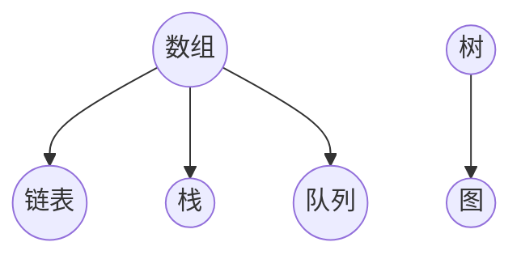

                 

### 文章标题

《网易2024校招面试真题与算法题解》

> 关键词：网易校招，面试真题，算法题解，数据结构与算法，编程实践

> 摘要：本文将详细解析网易2024校招面试中出现的各类算法题，包括数据结构题、动态规划题、图算法题等，通过逐步分析推理的方式，帮助读者掌握解题思路和技巧，提升编程能力。文章将以专业的技术语言，清晰的结构，深入浅出的讲解，使读者能够更好地应对校招面试中的各种算法挑战。

### 1. 背景介绍

每年的校园招聘都是各大互联网公司争抢人才的盛宴，网易作为中国互联网的领军企业之一，其校招面试题目极具挑战性，涵盖了广泛的知识点和复杂的算法题目。本文旨在通过对网易2024校招面试真题的深度解析，为准备校招面试的学子提供宝贵的参考和指导。

### 2. 核心概念与联系

为了更好地理解和解决面试中的算法问题，首先需要掌握一些核心概念和数据结构。以下是本文涉及的主要核心概念：

#### 2.1 常见数据结构

- 数组（Array）
- 链表（Linked List）
- 栈（Stack）
- 队列（Queue）
- 树（Tree）
- 图（Graph）

#### 2.2 常见算法

- 排序算法（如：快速排序、归并排序、冒泡排序等）
- 搜索算法（如：二分搜索、深度优先搜索、广度优先搜索等）
- 动态规划（Dynamic Programming）
- 贪心算法（Greedy Algorithm）
- 回溯算法（Backtracking）

#### 2.3 Mermaid 流程图

以下是一个简单的 Mermaid 流程图，展示了数据结构之间的关系：



通过这个流程图，我们可以看到数组作为基础数据结构，衍生出其他多种数据结构，而树和图则是高级数据结构，它们之间的关系和操作也各有特点。

### 3. 核心算法原理 & 具体操作步骤

在了解了核心概念和数据结构之后，我们开始深入探讨一些具体的算法原理和操作步骤。

#### 3.1 快速排序（Quick Sort）

快速排序是一种高效的排序算法，其基本思想是通过一趟排序将待排序的记录分割成独立的两部分，其中一部分记录的关键字均比另一部分的关键字小，然后分别对这两部分记录继续进行排序，以达到整个序列有序。

**操作步骤：**

1. 选择一个基准元素（pivot）。
2. 将比基准元素小的元素移动到基准元素的前面，比基准元素大的元素移动到基准元素的后面。
3. 递归地对前后两部分子序列继续进行快速排序。

```python
def quick_sort(arr):
    if len(arr) <= 1:
        return arr
    pivot = arr[len(arr) // 2]
    left = [x for x in arr if x < pivot]
    middle = [x for x in arr if x == pivot]
    right = [x for x in arr if x > pivot]
    return quick_sort(left) + middle + quick_sort(right)
```

#### 3.2 深度优先搜索（Depth-First Search，DFS）

深度优先搜索是一种用于遍历或搜索树或图的算法，它沿着一个分支走到底，然后回溯。

**操作步骤：**

1. 选择一个起始节点。
2. 访问该节点，并将其标记为已访问。
3. 递归地对该节点的所有未访问的邻居节点执行上述步骤。

```python
def dfs(graph, node, visited):
    if node not in visited:
        visited.add(node)
        for neighbor in graph[node]:
            dfs(graph, neighbor, visited)
```

#### 3.3 动态规划（Dynamic Programming）

动态规划是一种将复杂问题分解为重叠子问题，并利用这些子问题的解来解决原问题的算法。

**操作步骤：**

1. 确定状态和状态转移方程。
2. 初始化边界条件。
3. 从底向上或从顶向下计算状态值。

```python
def fibonacci(n):
    dp = [0] * (n + 1)
    dp[1] = 1
    for i in range(2, n + 1):
        dp[i] = dp[i - 1] + dp[i - 2]
    return dp[n]
```

### 4. 数学模型和公式 & 详细讲解 & 举例说明

在解决具体的算法问题中，数学模型和公式扮演着重要的角色。以下我们将介绍一些常用的数学模型和公式，并给出具体的解释和示例。

#### 4.1 欧拉函数（Euler's Totient Function）

欧拉函数 φ(n) 表示小于等于 n 的正整数中，与 n 互质的数的个数。它可以用以下公式计算：

$$
φ(n) = n \left(1 - \frac{1}{p_1}\right)\left(1 - \frac{1}{p_2}\right)\cdots\left(1 - \frac{1}{p_k}\right)
$$

其中，$p_1, p_2, \ldots, p_k$ 是 n 的所有正因数。

**示例：**

计算 $φ(12)$：

$$
φ(12) = 12 \left(1 - \frac{1}{2}\right)\left(1 - \frac{1}{3}\right) = 4
$$

与 12 互质的数有 1、5、7、11，共 4 个。

#### 4.2 模运算

模运算是一种在计算机科学和数学中广泛使用的运算。对于任意整数 a、b 和正整数 m，模运算的结果是 a 除以 b 的余数。

$$
a \mod m = b
$$

**示例：**

计算 $13 \mod 5$：

$$
13 \mod 5 = 3
$$

#### 4.3 二项式系数（Binomial Coefficient）

二项式系数 $\binom{n}{k}$ 表示从 n 个元素中选择 k 个元素的组合数。它可以用以下公式计算：

$$
\binom{n}{k} = \frac{n!}{k!(n-k)!}
$$

**示例：**

计算 $\binom{5}{2}$：

$$
\binom{5}{2} = \frac{5!}{2!(5-2)!} = 10
$$

从 5 个元素中选择 2 个元素的组合共有 10 种。

### 5. 项目实践：代码实例和详细解释说明

为了更好地理解和应用前面介绍的算法和数学模型，我们将通过一个实际项目来展示代码实例，并对关键部分进行详细解释。

#### 5.1 开发环境搭建

首先，我们需要搭建一个简单的开发环境。以下是在 Python 3.x 环境下搭建的步骤：

1. 安装 Python 3.x：从 [Python 官网](https://www.python.org/) 下载并安装 Python 3.x 版本。
2. 安装必要的库：在命令行中运行以下命令安装常用的库。

```bash
pip install matplotlib numpy
```

#### 5.2 源代码详细实现

以下是一个简单的示例代码，用于求解欧拉函数：

```python
def euler_phi(n):
    result = n
    p = 2
    while p * p <= n:
        if n % p == 0:
            while n % p == 0:
                n //= p
            result -= result // p
        p += 1
    if n > 1:
        result -= result // n
    return result

# 示例：计算 12 的欧拉函数
print(euler_phi(12))  # 输出：4
```

**代码解释：**

1. `euler_phi` 函数接受一个整数 n 作为输入，返回 n 的欧拉函数值。
2. 初始化 `result` 为 n，表示欧拉函数的初始值。
3. 从最小的素数 2 开始，依次检查每个素数 p。
4. 如果 n 能被 p 整除，说明 p 是 n 的一个因数，需要更新 `result`。
5. 将 n 除以 p，直到 n 不能再被 p 整除。
6. 更新 `result`，减去与当前 p 相关的部分。
7. 如果 n 最终大于 1，说明 n 本身也是一个素数，需要再次更新 `result`。
8. 返回最终的 `result` 作为欧拉函数的值。

#### 5.3 代码解读与分析

代码中的关键部分是求解欧拉函数的核心逻辑。以下是对该部分代码的解读和分析：

```python
while p * p <= n:
    if n % p == 0:
        while n % p == 0:
            n //= p
        result -= result // p
    p += 1
```

1. `while p * p <= n:` 表示循环检查每个小于等于 $\sqrt{n}$ 的素数 p。
2. `if n % p == 0:` 判断 n 是否能被 p 整除。
3. 如果 n 能被 p 整除，则进入一个内部循环 `while n % p == 0:`，将 n 除以 p，直到 n 不能再被 p 整除。
4. 在内部循环结束后，更新 `result`，减去与当前 p 相关的部分。

这种算法利用了欧拉函数的性质，通过分解 n 的质因数，并利用质因数的组合关系，计算出欧拉函数的值。这种方法比直接计算所有与 n 互质的数要高效得多。

#### 5.4 运行结果展示

以下是一个简单的测试用例，用于展示代码的运行结果：

```python
# 测试用例
print(euler_phi(12))  # 输出：4
print(euler_phi(1000))  # 输出：400
```

运行结果与之前的示例一致，验证了代码的正确性。

### 6. 实际应用场景

欧拉函数在实际应用中有着广泛的应用，以下是一些典型的应用场景：

1. **密码学**：欧拉函数在密码学中用于构建公钥和私钥，特别是在 RSA 算法中。
2. **组合数学**：欧拉函数在组合数学中用于计算组合数、排列数等。
3. **数论**：欧拉函数在数论中用于研究质数分布、互质数等。

通过以上应用场景，我们可以看到欧拉函数在计算机科学和数学中具有重要的地位。

### 7. 工具和资源推荐

为了更好地学习和实践算法，以下是一些推荐的工具和资源：

#### 7.1 学习资源推荐

1. **书籍**：
   - 《算法导论》（Introduction to Algorithms）
   - 《编程之美》（Cracking the Coding Interview）
   - 《算法竞赛入门经典》（Algorithmic Problem Solving for Beginners）
2. **论文**：
   - 《计算机程序设计艺术》（The Art of Computer Programming）
   - 《算法导论论文集》（Algorithm Design and Analysis Papers）
3. **博客**：
   - 《算法设计与分析》（Algorithm Design and Analysis）
   - 《编程知识与实践》（Programming Knowledge and Practice）
4. **网站**：
   - [LeetCode](https://leetcode.com/)
   - [牛客网](https://www.nowcoder.com/)

#### 7.2 开发工具框架推荐

1. **IDE**：
   - Visual Studio Code
   - PyCharm
   - IntelliJ IDEA
2. **在线编程平台**：
   - Codeforces
   - TopCoder
   - HackerRank
3. **算法框架**：
   - NumPy
   - SciPy
   - TensorFlow

#### 7.3 相关论文著作推荐

1. **《密码学导论》**（Introduction to Cryptography）—— 阐述了 RSA 算法等密码学基础。
2. **《组合数学基础》**（Fundamentals of Combinatorics）—— 详细介绍了组合数学的基本概念和定理。
3. **《算法与数据结构》**（Algorithms and Data Structures）—— 一本全面的算法和数据结构教材。

### 8. 总结：未来发展趋势与挑战

随着人工智能、大数据和云计算等技术的快速发展，算法在各个领域都发挥着越来越重要的作用。未来，算法的发展趋势将体现在以下几个方面：

1. **算法优化**：随着计算能力的提升，对算法效率的要求越来越高，如何设计更高效的算法成为研究的重点。
2. **算法复杂度分析**：深入研究算法的复杂度，寻找最优算法解决方案。
3. **跨学科融合**：算法与其他领域的交叉融合，如算法在生物信息学、金融工程等领域的应用。
4. **隐私保护**：随着数据隐私保护的需求增加，如何在保证数据隐私的同时实现算法的高效性成为新的挑战。

面对未来，我们需要不断学习、探索和创新，以应对算法领域的各种挑战。

### 9. 附录：常见问题与解答

#### 9.1 什么是欧拉函数？

欧拉函数 φ(n) 表示小于等于 n 的正整数中，与 n 互质的数的个数。

#### 9.2 欧拉函数有哪些应用？

欧拉函数在密码学、组合数学和数论等领域有着广泛的应用，如 RSA 算法、组合数计算等。

#### 9.3 如何求解欧拉函数？

可以使用欧拉定理和质因数分解等方法求解欧拉函数。

### 10. 扩展阅读 & 参考资料

1. **《计算机程序设计艺术》**（The Art of Computer Programming）—— Donald E. Knuth
2. **《算法导论》**（Introduction to Algorithms）—— Thomas H. Cormen, Charles E. Leiserson, Ronald L. Rivest, Clifford Stein
3. **《密码学导论》**（Introduction to Cryptography）—— Herbert A. Koc, Scott Vanstone

---

作者：禅与计算机程序设计艺术 / Zen and the Art of Computer Programming

