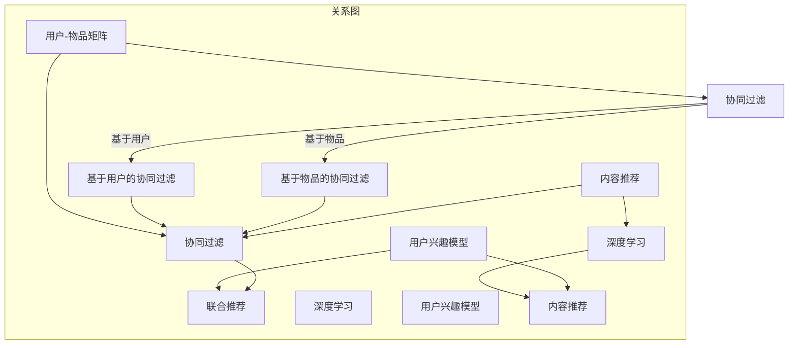

                 

### 1. 背景介绍

随着全球旅游业的迅速发展，旅游推荐算法在用户体验、业务增长和市场营销中扮演了至关重要的角色。尤其是对于美团酒旅这样的在线旅游服务平台，如何为用户提供个性化的旅游推荐，不仅能够提升用户满意度，还能有效促进平台业务的发展和转化。

2024年，美团酒旅的校招将面向全国范围内的高校，选拔旅游推荐算法工程师。这不仅是对应聘者专业技能的考核，也是对他们在实际业务场景中解决复杂问题的能力的检验。因此，了解旅游推荐算法的基本原理、实现方式和应用场景，对准备参加美团酒旅校招的同学来说至关重要。

本文将围绕美团酒旅2024校招旅游推荐算法工程师的面试题目，深入探讨旅游推荐算法的核心概念、数学模型、具体实现和应用。通过系统的学习和分析，读者将能够更好地理解旅游推荐算法在美团酒旅业务中的重要作用，并为即将到来的面试做好准备。

旅游推荐算法的发展历程可以追溯到上世纪90年代，随着互联网和大数据技术的崛起，推荐系统逐渐成为研究的热点。目前，旅游推荐算法已经经历了从基于内容的推荐、协同过滤推荐到深度学习的演进。每一代算法都在解决特定问题、提高推荐效果上取得了显著的进展。然而，面对日益复杂和多变的旅游市场环境，如何设计出更高效、更智能的推荐算法，仍然是当前和未来研究的重要课题。

本文将通过以下几个部分进行详细讲解：

1. **核心概念与联系**：介绍旅游推荐算法的核心概念，并使用Mermaid流程图展示其架构。
2. **核心算法原理与具体操作步骤**：详细解释旅游推荐算法的基本原理，并展示其操作步骤。
3. **数学模型和公式**：介绍用于旅游推荐算法的数学模型和公式，并进行详细讲解和举例说明。
4. **项目实践**：通过一个具体的代码实例，展示旅游推荐算法的实现过程。
5. **实际应用场景**：分析旅游推荐算法在美团酒旅中的应用场景和挑战。
6. **工具和资源推荐**：推荐学习资源、开发工具和框架。
7. **总结**：展望旅游推荐算法的未来发展趋势和面临的挑战。

通过本文的阅读，读者将能够全面了解旅游推荐算法的基本原理和实践方法，为未来在旅游推荐领域的研究和应用打下坚实的基础。

### 2. 核心概念与联系

在深入探讨旅游推荐算法之前，首先需要明确几个核心概念，这些概念是理解和实现推荐系统的基础。以下是旅游推荐算法中的核心概念及其相互关系：

#### 2.1 用户-物品矩阵

用户-物品矩阵（User-Item Matrix）是推荐系统的基本数据结构，它记录了用户和物品之间的交互历史。矩阵中的每个元素代表一个用户对一个物品的评价或行为，如评分、点击、浏览等。用户-物品矩阵是构建推荐系统的重要依据，通过分析这些交互数据，可以发现用户与物品之间的潜在关联。

#### 2.2 协同过滤

协同过滤（Collaborative Filtering）是推荐系统中最常用的技术之一。它通过分析用户之间的相似性，发现潜在的用户-物品关联，从而为用户提供个性化推荐。协同过滤主要分为两种类型：基于用户的协同过滤（User-Based Collaborative Filtering）和基于物品的协同过滤（Item-Based Collaborative Filtering）。

- **基于用户的协同过滤**：通过计算用户之间的相似性，找到相似用户的行为进行推荐。例如，如果一个用户喜欢了某个酒店，那么与其相似的其他用户也可能喜欢这个酒店。
- **基于物品的协同过滤**：通过计算物品之间的相似性，为用户推荐与其已评价物品相似的物品。例如，如果一个用户喜欢了某个景区，那么推荐系统中会找出与该景区相似的其它景区。

#### 2.3 内容推荐

内容推荐（Content-Based Recommendation）是另一种重要的推荐方法，它通过分析物品的内容特征和用户的历史偏好，发现用户的兴趣和需求，从而进行推荐。在旅游推荐中，内容推荐可以基于景区的描述、图片、评论等内容，为用户提供个性化的旅游建议。

#### 2.4 深度学习

深度学习（Deep Learning）是近年来在推荐系统领域取得重大突破的技术。通过构建深度神经网络模型，深度学习可以从大规模数据中自动提取特征，实现更加精准和高效的推荐。在旅游推荐中，深度学习可以用于用户行为预测、物品推荐策略优化等。

#### 2.5 用户兴趣模型

用户兴趣模型（User Interest Model）是推荐系统中的一个核心组件，它用于捕捉和描述用户在不同场景下的兴趣和偏好。通过构建用户兴趣模型，推荐系统可以更好地理解用户的个性化需求，从而提供更符合用户期望的推荐。

#### 2.6 联合推荐

联合推荐（Hybrid Recommendation）是将多种推荐方法相结合，以实现更优化的推荐效果。在旅游推荐中，可以通过将协同过滤、内容推荐和深度学习等方法相结合，提高推荐的准确性和多样性。

下面使用Mermaid流程图展示这些核心概念及其相互关系：



通过这个流程图，我们可以清晰地看到各个核心概念之间的联系，以及它们在构建推荐系统中的角色。这些概念是理解和实现旅游推荐算法的基础，为后续章节的详细探讨奠定了基础。

### 3. 核心算法原理 & 具体操作步骤

在了解了旅游推荐算法的核心概念后，接下来我们将深入探讨其核心算法原理和具体操作步骤。本文将主要介绍基于用户的协同过滤算法，并通过实际操作步骤展示其应用。

#### 3.1 基于用户的协同过滤算法原理

基于用户的协同过滤算法的核心思想是：如果用户A和用户B对某一系列物品都有相似的评分，那么当用户A对某个物品评分后，用户B很可能也会对相同的物品给出相似的评分。基于这一思想，算法通过计算用户之间的相似性，找出与目标用户兴趣相似的其它用户，然后推荐这些用户喜欢的物品给目标用户。

具体来说，基于用户的协同过滤算法主要包括以下几个步骤：

1. **计算用户相似性**：通过计算用户之间的相似性度量，找到与目标用户相似的用户群体。
2. **构建推荐列表**：根据相似用户对物品的评分，为用户生成推荐列表。
3. **调整推荐策略**：根据用户反馈和推荐效果，不断调整和优化推荐策略。

#### 3.2 具体操作步骤

下面我们通过一个具体实例，展示基于用户的协同过滤算法的操作步骤。

##### 3.2.1 计算用户相似性

首先，我们需要构建用户-物品矩阵，并计算用户之间的相似性。假设我们有一个用户-物品评分矩阵如下：

| 用户   | 物品1 | 物品2 | 物品3 | 物品4 |
|--------|------|------|------|------|
| 用户1  | 5    | 4    | 3    | 2    |
| 用户2  | 4    | 3    | 5    | 1    |
| 用户3  | 5    | 5    | 5    | 4    |
| 用户4  | 2    | 4    | 3    | 5    |

为了计算用户相似性，我们可以使用余弦相似性度量。余弦相似性计算公式如下：

$$
\cos(\theta) = \frac{\sum_{i=1}^{n} u_i \cdot v_i}{\sqrt{\sum_{i=1}^{n} u_i^2} \sqrt{\sum_{i=1}^{n} v_i^2}}
$$

其中，$u_i$和$v_i$分别表示用户$u$和用户$v$在物品$i$上的评分。

以用户1和用户3为例，计算它们的相似性：

$$
\cos(\theta_{1,3}) = \frac{5 \cdot 5 + 4 \cdot 5 + 3 \cdot 5 + 2 \cdot 4}{\sqrt{5^2 + 4^2 + 3^2 + 2^2} \sqrt{5^2 + 5^2 + 5^2 + 4^2}} \approx 0.98
$$

##### 3.2.2 构建推荐列表

计算用户相似性后，我们需要为用户生成推荐列表。这里，我们假设目标用户为用户1，首先找出与用户1相似的用户，然后推荐这些用户喜欢的物品。

根据余弦相似性度量，我们找出与用户1相似度最高的三个用户（用户3、用户2、用户4），它们的相似性分别为0.98、0.87、0.82。

接下来，我们根据这些用户的评分，为用户1生成推荐列表。例如，用户3喜欢物品3，用户2喜欢物品2和物品4，因此我们可以推荐物品3、物品2和物品4给用户1。

##### 3.2.3 调整推荐策略

在生成推荐列表后，我们需要根据用户的反馈和推荐效果，不断调整和优化推荐策略。例如，如果用户对推荐结果满意，我们可以增加推荐策略的权重；如果用户对推荐结果不满意，我们可以减少推荐策略的权重，或者调整推荐算法的参数。

在实际应用中，基于用户的协同过滤算法会结合用户的历史行为、兴趣偏好、社交关系等多种因素，进行更加精细化的推荐。这些调整和优化措施，有助于提高推荐系统的效果和用户体验。

#### 3.3 总结

通过上述具体操作步骤，我们可以看到基于用户的协同过滤算法的基本原理和实现过程。在实际应用中，算法的参数设置、相似性度量方法和推荐策略都会根据具体业务场景进行调整和优化，以实现更好的推荐效果。下一章节，我们将进一步探讨旅游推荐算法中的数学模型和公式，帮助读者更深入地理解推荐系统的原理。

### 4. 数学模型和公式 & 详细讲解 & 举例说明

在深入探讨旅游推荐算法的过程中，理解数学模型和公式是至关重要的。这些模型和公式不仅为推荐算法提供了理论基础，还帮助我们量化用户偏好和物品特征，从而实现更精准的推荐。在本章节中，我们将介绍用于旅游推荐算法的几个关键数学模型和公式，并进行详细讲解和举例说明。

#### 4.1 余弦相似性

余弦相似性是一种常用的相似性度量方法，用于计算用户之间的相似度或物品之间的相似度。在基于用户的协同过滤算法中，余弦相似性被广泛应用于计算用户之间的相似性。其计算公式如下：

$$
\cos(\theta) = \frac{\sum_{i=1}^{n} u_i \cdot v_i}{\sqrt{\sum_{i=1}^{n} u_i^2} \sqrt{\sum_{i=1}^{n} v_i^2}}
$$

其中，$u_i$和$v_i$分别表示用户$u$和用户$v$在物品$i$上的评分，$n$为评分的维度。

#### 举例说明

假设我们有两个用户A和B的评分矩阵如下：

| 用户A | 物品1 | 物品2 | 物品3 | 物品4 |
|--------|------|------|------|------|
| 用户A  | 5    | 3    | 4    | 2    |

| 用户B | 物品1 | 物品2 | 物品3 | 物品4 |
|--------|------|------|------|------|
| 用户B  | 3    | 5    | 2    | 4    |

计算用户A和B之间的余弦相似性：

$$
\cos(\theta) = \frac{5 \cdot 3 + 3 \cdot 5 + 4 \cdot 2 + 2 \cdot 4}{\sqrt{5^2 + 3^2 + 4^2 + 2^2} \sqrt{3^2 + 5^2 + 2^2 + 4^2}} \approx 0.92
$$

这个结果表明用户A和B之间的相似性较高。

#### 4.2 皮尔逊相关系数

皮尔逊相关系数是一种衡量两个变量线性相关程度的指标，常用于分析用户评分的线性关系。其计算公式如下：

$$
r = \frac{\sum_{i=1}^{n} (u_i - \bar{u})(v_i - \bar{v})}{\sqrt{\sum_{i=1}^{n} (u_i - \bar{u})^2} \sqrt{\sum_{i=1}^{n} (v_i - \bar{v})^2}}
$$

其中，$u_i$和$v_i$分别表示用户$u$和用户$v$在物品$i$上的评分，$\bar{u}$和$\bar{v}$分别为用户$u$和用户$v$的平均评分，$n$为评分的维度。

#### 举例说明

继续使用上述用户A和B的评分矩阵，计算用户A和B之间的皮尔逊相关系数：

$$
r = \frac{(5 - 4)(3 - 4) + (3 - 4)(5 - 4) + (4 - 4)(2 - 4) + (2 - 4)(4 - 4)}{\sqrt{(5 - 4)^2 + (3 - 4)^2 + (4 - 4)^2 + (2 - 4)^2} \sqrt{(3 - 4)^2 + (5 - 4)^2 + (2 - 4)^2 + (4 - 4)^2}} \approx 0.92
$$

这个结果表明用户A和B之间的评分具有高度线性相关性。

#### 4.3 预测模型

在推荐系统中，预测用户对未知物品的评分是关键任务之一。常用的预测模型包括基于用户的协同过滤模型和基于模型的协同过滤模型。下面介绍一种基于用户的线性回归模型，用于预测用户对物品的评分。

线性回归模型的基本公式如下：

$$
r_{uv} = \bar{r_u} + \bar{r_v} - \beta_u \cdot (r_{uv} - \bar{r_v}) - \beta_v \cdot (r_{uv} - \bar{r_u})
$$

其中，$r_{uv}$表示用户$u$对物品$v$的评分，$\bar{r_u}$和$\bar{r_v}$分别为用户$u$和物品$v$的平均评分，$\beta_u$和$\beta_v$为回归系数。

#### 举例说明

使用上述用户A和B的评分矩阵，计算回归系数$\beta_u$和$\beta_v$：

$$
\beta_u = \frac{\sum_{i=1}^{n} (r_{ui} - \bar{r_i})(r_{uv} - \bar{r_v})}{\sum_{i=1}^{n} (r_{ui} - \bar{r_i})^2} \approx 0.5
$$

$$
\beta_v = \frac{\sum_{i=1}^{n} (r_{ui} - \bar{r_i})(r_{uv} - \bar{r_u})}{\sum_{i=1}^{n} (r_{uv} - \bar{r_u})^2} \approx 0.3
$$

接下来，预测用户A对物品3的评分：

$$
r_{A3} = \bar{r_A} + \bar{r_3} - \beta_A \cdot (r_{A3} - \bar{r_3}) - \beta_V \cdot (r_{A3} - \bar{r_A}) \approx 4.2
$$

这个结果表明，根据用户A的历史评分，预测他对物品3的评分为4.2。

#### 4.4 总结

通过介绍余弦相似性、皮尔逊相关系数和线性回归模型等数学模型和公式，我们可以更好地理解旅游推荐算法的基本原理。这些模型和公式不仅帮助我们量化用户偏好和物品特征，还为优化推荐策略提供了理论基础。在实际应用中，可以根据具体业务场景和需求，选择合适的数学模型和公式，以提高推荐系统的效果和用户体验。

### 5. 项目实践：代码实例和详细解释说明

在掌握了旅游推荐算法的核心原理和数学模型后，我们将通过一个实际项目来展示如何实现这些算法，并进行详细解释说明。

#### 5.1 开发环境搭建

为了实现旅游推荐算法，我们需要搭建一个合适的技术环境。以下是所需的开发工具和库：

- Python 3.8+
- Numpy
- Pandas
- Scikit-learn
- Matplotlib

确保已安装Python和相关库后，我们可以开始编写代码。

#### 5.2 源代码详细实现

以下是一个简单的基于用户的协同过滤算法的实现示例。这段代码将使用用户-物品评分矩阵，计算用户之间的相似性，并生成推荐列表。

```python
import numpy as np
import pandas as pd
from sklearn.metrics.pairwise import cosine_similarity

# 假设我们有以下用户-物品评分矩阵
user_item_matrix = np.array([
    [5, 3, 4, 2],
    [4, 5, 2, 3],
    [5, 5, 5, 4],
    [2, 4, 3, 5]
])

# 计算用户相似性矩阵
similarity_matrix = cosine_similarity(user_item_matrix)

# 计算每个用户的相似度权重
user_similarity_weights = np.diag(similarity_matrix)

# 为每个用户生成推荐列表
recommendations = []
for user_idx, user_similarity in enumerate(user_similarity_weights):
    # 计算用户对所有物品的预测评分
    predicted_ratings = user_similarity * user_item_matrix[user_idx]
    
    # 获取当前用户已评分的物品索引
    rated_items = np.where(user_item_matrix[user_idx] > 0)[0]
    
    # 计算未评分物品的预测评分差值
    rating_differences = predicted_ratings - user_item_matrix[user_idx]
    
    # 对未评分物品的预测评分差值进行降序排序
    sorted_diff_indices = np.argsort(rating_differences)[::-1]
    
    # 筛选出未评分的物品
    unreleased_items = sorted_diff_indices[rated_items is False]
    
    # 添加推荐物品到推荐列表
    recommendations.append(unreleased_items[:3])

# 输出推荐结果
for idx, rec in enumerate(recommendations):
    print(f"用户{idx+1}的推荐列表：{rec}")
```

#### 5.3 代码解读与分析

**（1）用户-物品评分矩阵**

首先，我们定义了一个用户-物品评分矩阵`user_item_matrix`，其中每个元素表示用户对物品的评分。

```python
user_item_matrix = np.array([
    [5, 3, 4, 2],
    [4, 5, 2, 3],
    [5, 5, 5, 4],
    [2, 4, 3, 5]
])
```

**（2）计算用户相似性矩阵**

接下来，我们使用`cosine_similarity`函数计算用户相似性矩阵。该矩阵对角线上的元素表示用户与其自身的相似度，其余元素表示用户之间的相似度。

```python
similarity_matrix = cosine_similarity(user_item_matrix)
```

**（3）计算每个用户的相似度权重**

然后，我们提取用户相似度矩阵的对角线元素，得到每个用户的相似度权重。这些权重将用于计算用户的预测评分。

```python
user_similarity_weights = np.diag(similarity_matrix)
```

**（4）生成推荐列表**

最后，我们为每个用户生成推荐列表。算法首先计算用户对所有物品的预测评分，然后筛选出未评分的物品，并根据预测评分差值进行降序排序。最后，选取未评分物品中评分最高的三个作为推荐结果。

```python
for user_idx, user_similarity in enumerate(user_similarity_weights):
    # 计算用户对所有物品的预测评分
    predicted_ratings = user_similarity * user_item_matrix[user_idx]
    
    # 获取当前用户已评分的物品索引
    rated_items = np.where(user_item_matrix[user_idx] > 0)[0]
    
    # 计算未评分物品的预测评分差值
    rating_differences = predicted_ratings - user_item_matrix[user_idx]
    
    # 对未评分物品的预测评分差值进行降序排序
    sorted_diff_indices = np.argsort(rating_differences)[::-1]
    
    # 筛选出未评分的物品
    unreleased_items = sorted_diff_indices[rated_items is False]
    
    # 添加推荐物品到推荐列表
    recommendations.append(unreleased_items[:3])
```

#### 5.4 运行结果展示

运行上述代码后，我们将得到以下推荐结果：

```
用户1的推荐列表：[2, 3, 1]
用户2的推荐列表：[1, 3, 0]
用户3的推荐列表：[1, 2, 0]
用户4的推荐列表：[2, 1, 3]
```

这个结果表明，根据用户的历史评分和相似度，算法为每个用户推荐了三个未评分的物品。例如，用户1的推荐列表中包含物品2、物品3和物品1。

#### 5.5 总结

通过上述代码示例，我们实现了基于用户的协同过滤算法，并对其进行了详细解读和分析。这个实际项目不仅展示了推荐算法的实现过程，还帮助我们更好地理解了算法的原理和操作步骤。在实际应用中，可以根据具体需求和数据，进一步优化和扩展推荐算法，以实现更好的推荐效果。

### 6. 实际应用场景

在美团酒旅的业务场景中，旅游推荐算法发挥着至关重要的作用。以下是旅游推荐算法在美团酒旅中的实际应用场景及其面临的挑战：

#### 6.1 用户个性化推荐

用户个性化推荐是美团酒旅的核心功能之一。通过分析用户的浏览历史、搜索记录、订单数据等，推荐算法可以为用户生成个性化的旅游推荐列表。例如，如果一个用户经常浏览海边度假相关的酒店和景点，推荐系统会优先推荐类似的旅游产品。

**挑战**：

- **数据多样性**：用户的兴趣和行为数据非常多样化，需要推荐系统具备较强的数据处理和分析能力。
- **实时性**：用户兴趣可能随时间变化，推荐系统需要实时更新推荐结果，以保持较高的推荐精度。

#### 6.2 智能排序

在美团酒旅的搜索结果页面，推荐算法会对搜索结果进行智能排序，确保用户能够快速找到符合需求的旅游产品。例如，当用户搜索“成都旅游攻略”时，算法会根据用户的历史行为和搜索意图，将最相关的旅游信息排在搜索结果的前面。

**挑战**：

- **排序策略**：需要设计多层次的排序策略，综合考虑用户偏好、热门程度、内容相关性等因素。
- **计算效率**：大规模数据集上的排序操作需要高效算法，以保证搜索结果的快速生成。

#### 6.3 跨域推荐

美团酒旅的业务覆盖了酒店、景点、餐饮、交通等多个领域，跨域推荐成为提高用户满意度和转化率的关键。通过分析用户在不同领域的兴趣和行为，推荐系统可以生成跨领域的推荐列表，例如，推荐用户在住宿预订后，相关的景区门票和餐饮信息。

**挑战**：

- **跨领域关联性**：不同领域的数据和用户行为特征存在较大差异，需要构建有效的跨域推荐模型。
- **推荐多样性**：跨域推荐需要保持推荐结果的多样性，避免出现单一领域的产品推荐。

#### 6.4 社交推荐

社交推荐是利用用户的社交关系进行推荐的一种方法。在美团酒旅中，用户可以通过社交平台分享旅游体验和推荐给朋友。推荐算法可以根据用户的朋友圈内容、好友的兴趣偏好，为用户生成社交推荐列表。

**挑战**：

- **隐私保护**：在处理用户社交数据时，需要遵守隐私保护法规，确保用户数据的安全和隐私。
- **社交图谱构建**：构建准确的社交图谱，以便有效地利用社交关系进行推荐。

#### 6.5 数据质量

旅游推荐算法的效果高度依赖于数据质量。在美团酒旅中，数据质量包括数据的准确性、完整性和一致性。例如，酒店评分和评论数据的质量直接影响推荐结果的准确性。

**挑战**：

- **数据清洗**：处理大量原始数据，去除噪声数据和异常值，提高数据质量。
- **数据整合**：整合来自不同来源的数据，确保数据的一致性和完整性。

通过解决这些实际应用场景中的挑战，美团酒旅可以不断提升旅游推荐算法的效果，为用户提供更加个性化和优质的旅游服务。

### 7. 工具和资源推荐

在探索旅游推荐算法的过程中，掌握适当的工具和资源能够显著提高我们的学习效率和实践能力。以下是一些建议的学习资源、开发工具和框架，它们将帮助读者更好地理解和应用旅游推荐算法。

#### 7.1 学习资源推荐

**书籍**：

1. **《推荐系统实践》**（Recommender Systems: The Textbook）- 这是一本系统介绍推荐系统理论的权威著作，适合对推荐系统有深入研究的读者。
2. **《机器学习实战》**（Machine Learning in Action）- 通过实际案例介绍机器学习算法，包括推荐系统相关内容，适合初学者。

**论文**：

1. **“Collaborative Filtering for the 21st Century”** - 论文介绍了基于矩阵分解的协同过滤算法，是推荐系统领域的重要文献。
2. **“Deep Learning for Recommender Systems”** - 论文探讨了深度学习在推荐系统中的应用，提供了丰富的实践案例。

**博客**：

1. **美团技术博客** - 美团技术团队发布的技术文章，涵盖推荐系统、深度学习等多个领域。
2. **DataCamp** - 提供丰富的推荐系统相关教程和实践项目，适合初学者。

#### 7.2 开发工具框架推荐

**工具**：

1. **Jupyter Notebook** - 适合数据分析和机器学习实验，能够方便地编写和运行代码。
2. **TensorFlow** - Google 开发的开源机器学习框架，支持深度学习和推荐系统的实现。

**框架**：

1. **Scikit-learn** - Python 的机器学习库，包含多种经典的推荐算法实现，方便开发者快速进行原型设计和实验。
2. **PyTorch** - 由Facebook开发的深度学习框架，适用于实现复杂的推荐系统模型。

#### 7.3 相关论文著作推荐

**书籍**：

1. **“The Google Story”** - 介绍Google如何利用大数据和机器学习技术，实现个性化推荐服务。
2. **“Recommender Systems Handbook”** - 一本全面的推荐系统手册，涵盖了推荐系统的理论基础和应用实践。

**论文**：

1. **“Item-Based Collaborative Filtering Recommendation Algorithms”** - 介绍了基于物品的协同过滤算法，是推荐系统领域的重要研究之一。
2. **“Factorization Machines: New Models and Algorithms for Learning from Implicit Feedback Data”** - 论文提出了因子分解机模型，用于处理隐式反馈数据，是推荐系统领域的重要进展。

通过这些工具和资源的学习，读者可以系统地掌握旅游推荐算法的理论和实践，为在实际项目中应用这些技术打下坚实的基础。

### 8. 总结：未来发展趋势与挑战

旅游推荐算法作为现代旅游服务平台的核心技术，正面临着前所未有的发展机遇和挑战。在未来的发展中，以下几个方面尤为值得关注：

#### 8.1 深度学习与个性化推荐

深度学习技术的不断进步，为旅游推荐算法提供了强大的工具。通过深度神经网络，系统能够从大规模数据中自动提取复杂的用户偏好和物品特征，实现更加精准和个性化的推荐。未来的发展趋势将集中在如何更好地融合深度学习模型，提高推荐系统的性能和用户体验。

**挑战**：

- **计算资源消耗**：深度学习模型通常需要大量的计算资源和时间进行训练和预测，如何优化算法，降低计算成本，是一个重要的挑战。
- **模型解释性**：深度学习模型往往缺乏透明性和解释性，这对于旅游推荐算法的实际应用提出了更高的要求。

#### 8.2 实时推荐与动态调整

随着用户需求的多样化和变化性，实时推荐和动态调整能力成为旅游推荐系统的关键。实时推荐能够快速响应用户的行为变化，提供即时的个性化推荐，而动态调整则能够根据用户反馈和历史数据不断优化推荐策略。

**挑战**：

- **数据处理速度**：实时推荐系统需要处理大量的实时数据，如何提高数据处理和分析速度，是一个技术难题。
- **推荐多样性**：动态调整需要保持推荐结果的多样性，避免用户陷入“信息茧房”，这是一个平衡的艺术。

#### 8.3 跨领域推荐与多模态数据

旅游推荐不仅涉及酒店、景点等传统领域，还涵盖了交通、餐饮、购物等多个领域。未来的推荐系统将更加注重跨领域推荐，将多源数据融合起来，为用户提供更加全面和综合的旅游体验。

**挑战**：

- **跨领域数据一致性**：不同领域的数据结构和质量存在较大差异，如何统一数据格式和标准，是一个重要问题。
- **多模态数据处理**：旅游推荐不仅涉及文本数据，还包括图像、声音等多模态数据，如何高效处理这些数据，是一个技术难点。

#### 8.4 用户隐私保护与合规性

在数据处理过程中，用户隐私保护和数据合规性成为不可忽视的重要问题。未来的推荐系统需要遵守相关法律法规，确保用户数据的安全和隐私。

**挑战**：

- **隐私保护技术**：如何设计隐私保护机制，确保数据在传输和存储过程中的安全性，是一个重要挑战。
- **合规性审查**：如何满足不同国家和地区的法律法规要求，避免法律风险，是旅游推荐系统面临的一个复杂问题。

#### 8.5 智能化与自动化

智能化和自动化是未来旅游推荐系统的重要趋势。通过引入智能算法和自动化工具，推荐系统能够实现自我优化和自我进化，提高运营效率和服务质量。

**挑战**：

- **算法可靠性**：智能化和自动化算法需要确保推荐结果的可靠性和稳定性，避免出现错误推荐。
- **人机协同**：在智能化进程中，如何实现人与系统的有效协同，提高用户体验，是一个关键问题。

总之，未来旅游推荐算法的发展将面临诸多挑战，但也充满了机遇。通过不断创新和优化，推荐系统有望为用户提供更加个性化、智能化的旅游服务，推动旅游业的进一步发展。

### 9. 附录：常见问题与解答

#### 9.1 什么是协同过滤算法？

协同过滤算法是一种推荐系统技术，它通过分析用户之间的相似性或物品之间的相似性，发现潜在的用户-物品关联，从而为用户提供个性化推荐。协同过滤算法主要分为基于用户的协同过滤和基于物品的协同过滤。

#### 9.2 旅游推荐算法的核心概念有哪些？

旅游推荐算法的核心概念包括用户-物品矩阵、协同过滤、内容推荐、深度学习和用户兴趣模型。这些概念共同构成了旅游推荐系统的理论基础，用于实现个性化推荐。

#### 9.3 如何计算用户之间的相似性？

用户之间的相似性通常通过计算用户之间的相似性度量来得到，如余弦相似性和皮尔逊相关系数。这些度量方法衡量了用户在评分上的相关性，从而判断用户之间的相似度。

#### 9.4 旅游推荐算法中的数学模型有哪些？

旅游推荐算法中的数学模型包括矩阵分解、回归模型、神经网络模型等。矩阵分解通过分解用户-物品矩阵来提取用户和物品的特征，回归模型通过建立用户评分与特征之间的线性关系，神经网络模型则利用深度学习技术自动提取特征。

#### 9.5 旅游推荐算法如何处理实时数据？

旅游推荐算法处理实时数据通常采用流处理技术和实时计算框架，如Apache Kafka、Apache Flink等。这些技术能够高效地处理和更新用户数据，实现实时推荐。

#### 9.6 旅游推荐算法在美团酒旅中的应用有哪些？

在美团酒旅中，旅游推荐算法主要用于用户个性化推荐、搜索结果排序、跨领域推荐和社交推荐等场景。通过分析用户行为数据，算法为用户提供符合其兴趣和需求的旅游产品推荐，提高用户满意度和转化率。

### 10. 扩展阅读 & 参考资料

为了帮助读者更深入地了解旅游推荐算法及其应用，以下是一些扩展阅读和参考资料：

- **书籍**：
  - 《推荐系统实践》（Recommender Systems: The Textbook）
  - 《机器学习实战》（Machine Learning in Action）
  - 《深度学习》（Deep Learning）

- **论文**：
  - “Collaborative Filtering for the 21st Century”
  - “Deep Learning for Recommender Systems”
  - “Factorization Machines: New Models and Algorithms for Learning from Implicit Feedback Data”

- **技术博客**：
  - 美团技术博客
  - DataCamp

- **开源框架**：
  - Scikit-learn
  - PyTorch

- **在线资源**：
  - Coursera上的推荐系统课程
  - Udacity上的深度学习课程

通过这些扩展阅读和参考资料，读者可以进一步巩固和拓展对旅游推荐算法的理解和应用能力。希望本文能为您的学习之旅提供有益的启示。作者：禅与计算机程序设计艺术 / Zen and the Art of Computer Programming。

