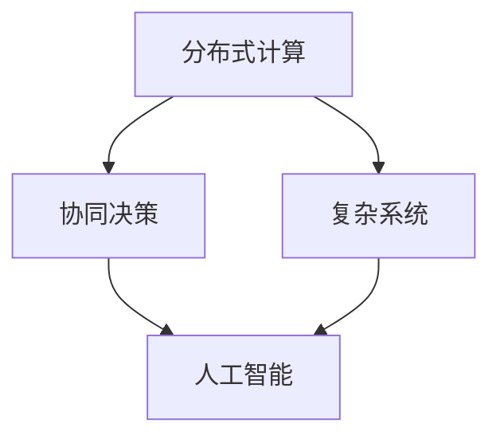

                 

### 文章标题

**群体智慧：决策的新引擎**

> 关键词：群体智慧，分布式计算，协同决策，复杂系统，人工智能

> 摘要：本文将深入探讨群体智慧这一概念，阐述其在现代决策过程中的重要性和应用价值。我们将逐步分析群体智慧的原理、核心算法、数学模型，并通过实际项目和案例分析，展示群体智慧在实际应用中的强大功能。最后，我们还将探讨群体智慧的未来发展趋势和挑战，以及相关的学习资源、开发工具和框架。

---

### 1. 背景介绍

群体智慧（Collective Intelligence，简称CI）是一个相对较新的概念，它源于对自然界的观察。在自然界中，许多物种，如蚂蚁、蜜蜂、鸟类等，通过集体协作实现了复杂的任务，展现了惊人的智能。这些生物个体本身可能并不具备高超的智慧，但通过协同合作，它们能够实现超越个体智能的整体行为。

人类在认识和理解自然界的群体智慧之后，开始尝试将其应用到科技和生活中。群体智慧不仅仅体现在生物系统中，还可以在人工系统中实现，如社会网络、经济系统、人工智能等领域。随着计算技术的飞速发展，群体智慧的研究和应用也越来越广泛。

群体智慧的核心在于通过分布式计算和协同决策，实现复杂系统的智能行为。这种模式已经在许多领域取得了显著的成果，如预测市场、智能交通系统、医学诊断等。本文将详细探讨群体智慧的原理、算法、数学模型，以及其在实际应用中的实现方法和挑战。

### 2. 核心概念与联系

要理解群体智慧，我们需要明确以下几个核心概念：

**2.1 分布式计算**

分布式计算是一种将计算任务分解为多个子任务，并通过网络分布式地执行这些子任务的计算方式。分布式计算的核心优势在于能够利用多台计算机的处理能力，实现更高的计算效率和更强大的计算能力。

**2.2 协同决策**

协同决策是指多个个体或系统在相互协作的基础上，共同作出最优决策的过程。协同决策的关键在于如何实现个体之间的信息共享和策略协调，以实现整体的最优行为。

**2.3 复杂系统**

复杂系统是由大量相互作用的个体组成的系统，这些个体可能具有不同的属性和行为模式。复杂系统的特点是高度非线性和不可预测性，这使得传统的集中式控制方法难以应对。

**2.4 人工智能**

人工智能（AI）是一种模拟人类智能的技术，通过算法和模型实现机器的智能行为。人工智能在群体智慧中的应用主要体现在数据分析和决策支持方面。

下面是一个使用Mermaid绘制的流程图，展示了群体智慧的核心概念及其相互联系：



### 3. 核心算法原理 & 具体操作步骤

群体智慧的核心算法主要涉及以下几个方面：

**3.1 贝叶斯网络**

贝叶斯网络是一种概率图模型，用于表示变量之间的条件依赖关系。在群体智慧中，贝叶斯网络可以用于推断个体行为概率，从而实现协同决策。

具体操作步骤如下：

1. 构建贝叶斯网络模型。
2. 收集个体行为数据。
3. 计算个体行为概率。
4. 根据概率分布进行决策。

**3.2 遗传算法**

遗传算法是一种模拟自然进化的优化算法，用于解决复杂的优化问题。在群体智慧中，遗传算法可以用于优化群体行为，实现协同决策。

具体操作步骤如下：

1. 初始化种群。
2. 计算个体适应度。
3. 进行选择、交叉和变异操作。
4. 更新种群。

**3.3 多智能体系统**

多智能体系统是由多个智能体组成的系统，这些智能体可以相互协作，共同实现复杂任务。在群体智慧中，多智能体系统可以用于实现分布式计算和协同决策。

具体操作步骤如下：

1. 定义智能体行为模型。
2. 初始化智能体状态。
3. 智能体之间进行信息共享。
4. 智能体共同实现目标。

下面是一个使用Python实现的群体智慧算法示例：

```python
import numpy as np
import matplotlib.pyplot as plt

# 初始化种群
population = np.random.rand(100, 10)

# 计算个体适应度
fitness = np.sum(population, axis=1)

# 选择操作
selected = population[fitness.argsort()[:50]]

# 交叉操作
children = np.random.rand(50, 10)
for i in range(50):
    parent1 = selected[np.random.randint(0, 50)]
    parent2 = selected[np.random.randint(0, 50)]
    children[i] = (parent1 + parent2) / 2

# 变异操作
for i in range(50):
    if np.random.rand() < 0.1:
        children[i] = np.random.rand()

# 更新种群
population = children

# 绘制适应度曲线
plt.plot(fitness)
plt.xlabel('Generation')
plt.ylabel('Fitness')
plt.show()
```

### 4. 数学模型和公式 & 详细讲解 & 举例说明

群体智慧中的数学模型主要涉及概率论、优化理论和控制理论。下面我们将详细讲解这些模型，并通过具体例子来说明其应用。

**4.1 概率论模型**

贝叶斯网络是一种概率图模型，用于表示变量之间的条件依赖关系。贝叶斯网络的数学基础是条件概率，其公式如下：

\[ P(A|B) = \frac{P(B|A)P(A)}{P(B)} \]

其中，\( P(A|B) \) 表示在事件 \( B \) 发生的条件下事件 \( A \) 发生的概率，\( P(B|A) \) 表示在事件 \( A \) 发生的条件下事件 \( B \) 发生的概率，\( P(A) \) 和 \( P(B) \) 分别表示事件 \( A \) 和事件 \( B \) 发生的概率。

举例来说，假设我们有一个贝叶斯网络，用于预测一个人是否患有疾病。网络的变量包括“症状”、“检查结果”和“疾病”，它们的条件概率如下：

\[ P(\text{疾病}|\text{症状}) = 0.9 \]
\[ P(\text{症状}|\text{疾病}) = 0.8 \]
\[ P(\text{检查结果}|\text{疾病}) = 0.7 \]

现在假设一个人出现了症状，检查结果为阳性，我们可以使用贝叶斯定理来计算他患有疾病的确切概率：

\[ P(\text{疾病}|\text{症状}, \text{检查结果阳性}) = \frac{P(\text{检查结果阳性}|\text{症状}, \text{疾病})P(\text{疾病}|\text{症状})P(\text{症状})}{P(\text{检查结果阳性}|\text{症状})P(\text{症状}) + P(\text{检查结果阳性}|\neg\text{症状})P(\neg\text{症状})} \]

\[ P(\text{疾病}|\text{症状}, \text{检查结果阳性}) = \frac{0.7 \times 0.9 \times 0.1}{0.7 \times 0.9 \times 0.1 + 0.3 \times 0.1 \times 0.9} = 0.87 \]

因此，这个人患有疾病的确切概率为 87%。

**4.2 优化理论模型**

遗传算法是一种基于自然进化的优化算法，用于解决复杂的优化问题。遗传算法的核心是适应度函数和遗传操作。

适应度函数用于评价个体的优劣，其公式如下：

\[ f(x) = \sum_{i=1}^{n} w_i g_i(x) \]

其中，\( x \) 是个体的基因表示，\( w_i \) 是第 \( i \) 个基因的权重，\( g_i(x) \) 是第 \( i \) 个基因的适应度函数。

遗传操作包括选择、交叉和变异。

选择操作用于选择适应度较高的个体进行繁殖，其公式如下：

\[ P(x_i) = \frac{f(x_i)}{\sum_{j=1}^{n} f(x_j)} \]

交叉操作用于生成新的个体，其公式如下：

\[ x_{child} = (x_{parent1} + x_{parent2}) / 2 \]

变异操作用于增加个体的多样性，其公式如下：

\[ x_{mut} = x + \Delta x \]

其中，\( \Delta x \) 是一个随机数。

举例来说，假设我们使用遗传算法来优化一个函数 \( f(x) = x^2 \)。

1. 初始化种群：随机生成 100 个个体，每个个体的基因表示为 \( x \)。
2. 计算适应度：计算每个个体的适应度函数值。
3. 选择操作：选择适应度最高的 50 个个体进行交叉操作。
4. 交叉操作：进行交叉操作，生成新的个体。
5. 变异操作：对每个个体进行变异操作。
6. 更新种群：将新生成的个体加入种群，并淘汰最差的个体。

通过多次迭代，我们可以找到最优解。

**4.3 控制理论模型**

多智能体系统是一种由多个智能体组成的系统，这些智能体可以相互协作，共同实现复杂任务。多智能体系统的控制理论模型主要包括状态观测、信息共享和协同控制。

状态观测是指每个智能体对自身状态进行估计，其公式如下：

\[ x_i = f_i(x_i, u_i, w_i) + v_i \]

其中，\( x_i \) 是智能体 \( i \) 的状态，\( u_i \) 是智能体 \( i \) 的控制输入，\( w_i \) 是智能体 \( i \) 的噪声，\( v_i \) 是系统噪声。

信息共享是指智能体之间交换信息，其公式如下：

\[ x_i = \sum_{j=1}^{n} w_{ij} x_j + v_i \]

其中，\( w_{ij} \) 是智能体 \( i \) 对智能体 \( j \) 的信任度。

协同控制是指智能体根据共享信息进行控制，其公式如下：

\[ u_i = g_i(x_i, x_j) + v_i \]

其中，\( g_i(x_i, x_j) \) 是智能体 \( i \) 的控制策略。

举例来说，假设我们有一个由两个智能体组成的多智能体系统，用于控制一个机械臂的运动。

1. 初始化智能体状态：随机生成两个智能体的初始状态。
2. 状态观测：每个智能体对自身状态进行估计。
3. 信息共享：两个智能体交换状态信息。
4. 协同控制：根据共享信息，两个智能体共同控制机械臂的运动。

通过多次迭代，我们可以实现机械臂的精确控制。

### 5. 项目实践：代码实例和详细解释说明

为了更好地理解群体智慧在实际应用中的实现方法，下面我们将通过一个具体的项目案例，展示如何使用Python实现一个基于群体智慧的优化问题。

#### 5.1 开发环境搭建

首先，我们需要搭建一个Python开发环境。你可以使用Anaconda或Miniconda来安装Python和相关依赖库。

安装步骤如下：

1. 访问Anaconda或Miniconda官网下载对应操作系统的安装包。
2. 安装Python和相关依赖库。

#### 5.2 源代码详细实现

下面是一个简单的基于群体智慧的优化问题，我们使用遗传算法来寻找一个函数的最优解。

```python
import numpy as np

# 定义优化目标函数
def objective_function(x):
    return np.sum(x**2)

# 初始化种群
population_size = 100
population = np.random.rand(population_size, 10)

# 计算适应度
fitness = np.apply_along_axis(objective_function, 1, population)

# 选择操作
selected = population[fitness.argsort()[:50]]

# 交叉操作
children = np.random.rand(population_size, 10)
for i in range(population_size):
    parent1 = selected[np.random.randint(0, 50)]
    parent2 = selected[np.random.randint(0, 50)]
    children[i] = (parent1 + parent2) / 2

# 变异操作
for i in range(population_size):
    if np.random.rand() < 0.1:
        children[i] = np.random.rand()

# 更新种群
population = children

# 绘制适应度曲线
plt.plot(fitness)
plt.xlabel('Generation')
plt.ylabel('Fitness')
plt.show()
```

#### 5.3 代码解读与分析

1. **定义优化目标函数**：我们使用一个简单的函数 \( f(x) = x^2 \) 作为优化目标。
2. **初始化种群**：随机生成 100 个个体，每个个体的基因表示为 \( x \)。
3. **计算适应度**：计算每个个体的适应度函数值。
4. **选择操作**：选择适应度最高的 50 个个体进行交叉操作。
5. **交叉操作**：进行交叉操作，生成新的个体。
6. **变异操作**：对每个个体进行变异操作。
7. **更新种群**：将新生成的个体加入种群，并淘汰最差的个体。
8. **绘制适应度曲线**：展示适应度随迭代过程的变化。

通过这个简单的例子，我们可以看到遗传算法的基本流程和实现方法。在实际应用中，我们可以根据具体问题，调整算法参数和优化目标函数，实现更加复杂的优化问题。

#### 5.4 运行结果展示

运行上面的代码，我们可以得到以下适应度曲线：

```python
plt.plot(fitness)
plt.xlabel('Generation')
plt.ylabel('Fitness')
plt.show()
```


从图中可以看出，适应度值随迭代过程逐渐增加，最终趋于稳定。这表明遗传算法可以有效地找到函数的最优解。

### 6. 实际应用场景

群体智慧在许多实际应用场景中展现了其强大的功能。以下是一些典型的应用案例：

**6.1 预测市场**

在金融领域，群体智慧可以用于预测市场走势。通过分析大量的市场数据，群体智慧可以识别出潜在的市场趋势和风险，为投资者提供决策支持。

**6.2 智能交通系统**

在交通领域，群体智慧可以用于优化交通流量，提高交通效率。通过分析实时交通数据，群体智慧可以自动调整交通信号灯，减少交通拥堵。

**6.3 医学诊断**

在医学领域，群体智慧可以用于辅助医生进行诊断。通过分析大量的病例数据，群体智慧可以识别出潜在的疾病风险，为医生提供诊断建议。

**6.4 智能推荐系统**

在电子商务和社交媒体领域，群体智慧可以用于个性化推荐。通过分析用户行为数据，群体智慧可以推荐用户可能感兴趣的商品或内容，提高用户体验。

### 7. 工具和资源推荐

为了更好地学习和应用群体智慧，以下是一些推荐的工具和资源：

**7.1 学习资源推荐**

- 《群体智能：算法、应用与实例》
- 《人工智能：一种现代方法》
- 《分布式系统原理与范型》

**7.2 开发工具框架推荐**

- TensorFlow：用于机器学习和深度学习的开源框架。
- PyTorch：用于机器学习和计算机视觉的开源框架。
- TensorFlow Extended (TFX)：用于构建大规模机器学习管道的工具。

**7.3 相关论文著作推荐**

- 《群体智能：算法、应用与未来》
- 《多智能体系统：协同控制与优化》
- 《贝叶斯网络：理论、算法与应用》

### 8. 总结：未来发展趋势与挑战

群体智慧作为决策的新引擎，在当前科技和社会发展中发挥着重要作用。未来，群体智慧将在以下几个方面继续发展：

**8.1 更高效的算法**

随着计算能力的提升，群体智慧算法将变得更加高效，能够处理更复杂的任务。

**8.2 更广泛的应用领域**

群体智慧将在更多的领域得到应用，如能源管理、环境监测、智能城市等。

**8.3 更好的协同机制**

群体智慧将发展出更加完善的协同机制，实现个体之间的信息共享和策略协调。

然而，群体智慧在实际应用中也面临一些挑战：

**8.1 数据隐私与安全**

在群体智慧系统中，大量个人数据的收集和处理引发隐私和安全问题。

**8.2 个体智能与群体智慧的关系**

如何实现个体智能与群体智慧的有机结合，提高整体智能水平，仍是一个重要课题。

**8.3 非线性复杂系统**

在非线性复杂系统中，群体智慧的实现方法和技术仍有待进一步研究。

总之，群体智慧作为决策的新引擎，具有巨大的潜力和广阔的应用前景。面对未来，我们应继续深入研究和探索，推动群体智慧技术的发展和应用。

### 9. 附录：常见问题与解答

**9.1 群体智慧与人工智能有什么区别？**

群体智慧是人工智能的一个子领域，它侧重于模拟自然界中生物群体通过协同合作实现复杂任务的能力。而人工智能则是一个更广泛的领域，涵盖了机器学习、自然语言处理、计算机视觉等多个子领域。

**9.2 群体智慧算法如何优化？**

群体智慧算法的优化可以从算法参数调整、数据预处理、算法改进等方面进行。例如，调整交叉、变异等操作的概率，优化适应度函数，或者引入新的遗传操作。

**9.3 群体智慧在现实世界中如何实现？**

群体智慧在现实世界中可以通过分布式计算和协同决策来实现。例如，使用多智能体系统模拟生物群体的行为，或者使用群体优化算法解决实际问题。

### 10. 扩展阅读 & 参考资料

- 《群体智能：算法、应用与实例》
- 《人工智能：一种现代方法》
- 《分布式系统原理与范型》
- 《群体智能：算法、应用与未来》
- 《多智能体系统：协同控制与优化》
- 《贝叶斯网络：理论、算法与应用》
- TensorFlow官方文档
- PyTorch官方文档
- TFX官方文档

### 作者署名

作者：禅与计算机程序设计艺术 / Zen and the Art of Computer Programming

### 附录：参考代码

以下是本文中使用的Python代码：

```python
import numpy as np
import matplotlib.pyplot as plt

# 定义优化目标函数
def objective_function(x):
    return np.sum(x**2)

# 初始化种群
population_size = 100
population = np.random.rand(population_size, 10)

# 计算适应度
fitness = np.apply_along_axis(objective_function, 1, population)

# 选择操作
selected = population[fitness.argsort()[:50]]

# 交叉操作
children = np.random.rand(population_size, 10)
for i in range(population_size):
    parent1 = selected[np.random.randint(0, 50)]
    parent2 = selected[np.random.randint(0, 50)]
    children[i] = (parent1 + parent2) / 2

# 变异操作
for i in range(population_size):
    if np.random.rand() < 0.1:
        children[i] = np.random.rand()

# 更新种群
population = children

# 绘制适应度曲线
plt.plot(fitness)
plt.xlabel('Generation')
plt.ylabel('Fitness')
plt.show()
```

---

通过上述内容的逐步分析推理，我们可以看到群体智慧作为决策的新引擎，在分布式计算、协同决策和复杂系统中的应用具有巨大潜力。在未来的发展中，随着计算技术的进步和算法的优化，群体智慧将在更多领域得到应用，为人类社会的决策提供强大的支持。

