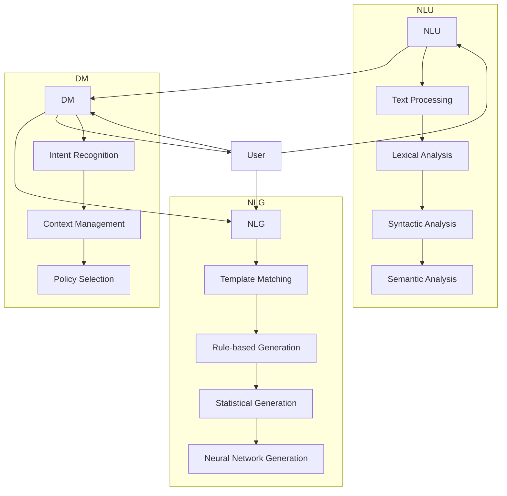
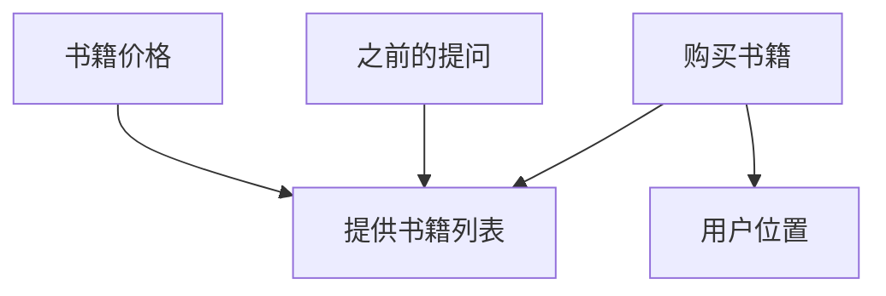
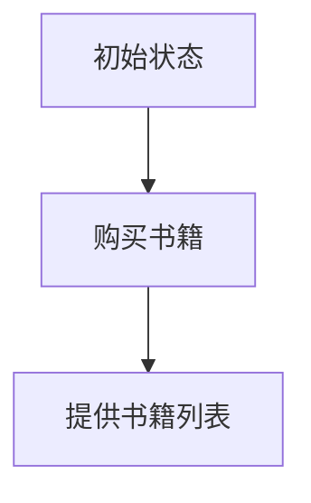

                 

### 背景介绍

#### 聊天机器人技术的发展

随着互联网的普及和人工智能技术的飞速发展，聊天机器人（Chatbot）已经成为企业与用户互动的重要工具。从简单的规则引擎聊天机器人到复杂的人工智能驱动的聊天机器人，这一领域的进步显著推动了人机交互模式的变革。

聊天机器人技术主要基于自然语言处理（NLP）和机器学习（ML）两大核心模块。NLP使计算机能够理解和解释人类语言，而ML则让聊天机器人通过大量数据学习如何生成自然、流畅的对话。

在商业领域，聊天机器人被广泛应用于客户服务、市场营销、客户支持等环节。例如，许多在线零售商使用聊天机器人来提供24/7的客户支持，解决用户常见问题，从而提高客户满意度和降低运营成本。

此外，聊天机器人在个人助理、智能客服、在线教育、医疗咨询等领域也展现出了巨大的潜力。例如，个人助理聊天机器人可以辅助用户管理日程、发送提醒、提供天气预报等信息；智能客服机器人可以自动识别和分类用户问题，提供相应的解决方案；在线教育聊天机器人可以为学生提供实时辅导和支持；医疗咨询聊天机器人可以帮助用户快速获取医疗信息和建议。

#### 公民参与与社会问题的关联

在现代社会中，公民参与已经成为推动社会进步和解决社会问题的重要手段。公民参与不仅包括投票、示威等传统的政治参与形式，还涵盖了在社区、组织、企业等多层面上的参与。

社会问题，如环境污染、贫困、种族歧视、教育资源分配不公等，影响着社会的稳定和公平。传统的解决方案通常依赖于政府、非政府组织、社区团体等的干预。然而，这些组织的资源和能力是有限的，难以全面覆盖和解决复杂的社会问题。

在此背景下，聊天机器人的公民参与成为了一个创新的解决方案。通过聊天机器人，公民可以更方便、更直接地参与到社会问题的讨论和解决过程中。聊天机器人不仅可以提供实时、准确的信息，还可以帮助公民了解社会问题的现状，提供政策建议，组织社区活动，推动问题的解决。

例如，环境保护领域的聊天机器人可以帮助公民了解当前的环境状况，提供环保知识，组织环保活动，收集公民的意见和建议，从而推动环境保护政策的制定和实施。

#### 聊天机器人公民参与的优势

聊天机器人公民参与的兴起有其独特的优势：

1. **可访问性**：聊天机器人可以通过移动设备、社交媒体等渠道随时随地为公民提供服务，打破了时间和空间的限制。
2. **互动性**：聊天机器人可以与公民进行实时对话，回答问题，提供个性化建议，从而增强公民的参与感和满意度。
3. **数据收集与分析**：聊天机器人可以收集大量公民的意见和建议，通过数据分析和挖掘，为政策制定者提供科学依据。
4. **个性化服务**：基于机器学习技术，聊天机器人可以根据公民的个性化需求提供定制化的服务，提高服务的针对性和有效性。

总的来说，聊天机器人公民参与为解决社会问题提供了一个新的思路和工具。它不仅提高了公民的参与度，还促进了社会问题的及时发现和有效解决，为社会治理和公共服务带来了新的机遇。

### 核心概念与联系

#### 聊天机器人的技术架构

聊天机器人的技术架构可以分为三个主要模块：自然语言理解（NLU）、对话管理（DM）和自然语言生成（NLG）。

**自然语言理解（NLU）**：NLU模块负责解析用户输入的文本，提取出其中的意图和实体信息。这通常涉及文本预处理、词法分析、句法分析和语义分析等多个步骤。

**对话管理（DM）**：DM模块负责管理整个对话流程，包括对话的状态跟踪、意图识别、上下文维护和策略选择等。DM模块的核心是策略网络，它根据当前的对话状态和用户的意图，选择合适的回复策略。

**自然语言生成（NLG）**：NLG模块负责将对话管理模块生成的内部表示转换为自然语言的回复。NLG技术可以采用模板匹配、规则生成、统计生成和神经网络生成等多种方法。


#### 聊天机器人与公民参与的关系

聊天机器人与公民参与之间的关系可以从以下几个方面来理解：

1. **信息传播**：聊天机器人可以快速、准确地传播与公民参与相关的信息，如社会问题的现状、政策进展、活动安排等。这有助于提高公民对社会问题的关注度和参与度。
   
2. **互动交流**：通过实时对话，聊天机器人可以与公民进行深入的交流，回答他们的疑问，提供个性化的建议。这种互动性增强了公民的参与感和满意度。

3. **数据收集**：聊天机器人可以收集大量的公民意见、建议和反馈，通过数据分析，为政策制定者提供科学的决策依据。这有助于提高政策制定的透明度和有效性。

4. **资源整合**：聊天机器人可以整合各种资源，如政策文件、研究报告、公益活动等，为公民提供一站式服务。这有助于提高公民参与的便捷性和效率。

5. **知识普及**：聊天机器人可以普及与公民参与相关的知识，提高公民的意识和能力，从而推动社会问题的解决。

#### 聊天机器人技术的Mermaid流程图

下面是一个简单的聊天机器人技术的Mermaid流程图，展示了NLU、DM和NLG三个模块的交互过程。




通过这个流程图，我们可以更清晰地看到聊天机器人技术如何从用户输入的文本中提取信息，通过对话管理模块进行理解和决策，最后生成自然语言的回复。

### 核心算法原理 & 具体操作步骤

#### 自然语言理解（NLU）

**意图识别**：意图识别是NLU模块的核心任务，它旨在从用户的输入中识别出用户的主要意图。例如，当用户输入“我想要购买一本新书”时，意图可以是“购买书籍”。

**实体抽取**：实体抽取是识别用户输入中的关键信息，如地名、人名、组织名、日期等。例如，在输入“我在北京有业务”中，实体可以是“北京”。

**操作步骤**：

1. **文本预处理**：对用户输入的文本进行清洗，包括去除停用词、标点符号、统一大小写等。
2. **词法分析**：将文本分割成单词或词组。
3. **句法分析**：构建句子的语法树，分析句子成分和结构。
4. **语义分析**：对句子的语义进行深入理解，包括意图识别和实体抽取。

#### 对话管理（DM）

**对话状态跟踪**：对话管理模块需要维护对话的历史状态，以便理解用户的上下文和意图。例如，当用户连续提问“你有哪些书籍推荐？”和“这些书籍的价格是多少？”时，对话状态需要记录之前提到的书籍名称。

**策略选择**：对话管理模块需要根据当前对话状态和用户的意图，选择合适的回复策略。例如，当用户询问“你有哪些书籍推荐？”时，策略可能是提供书籍列表。

**操作步骤**：

1. **初始化对话状态**：开始对话时，初始化对话状态。
2. **更新对话状态**：根据用户的输入，更新对话状态，包括意图、上下文和历史信息。
3. **选择回复策略**：基于当前对话状态和用户的意图，选择合适的回复策略。
4. **生成回复**：使用自然语言生成模块生成回复。

#### 自然语言生成（NLG）

**模板匹配**：模板匹配是一种简单的NLG方法，它根据预定义的模板生成回复。例如，当用户询问“你有哪些书籍推荐？”时，模板可能是“以下是我们的书籍推荐：[书籍列表]”。

**规则生成**：规则生成方法基于预定义的规则生成回复。例如，当用户询问“这些书籍的价格是多少？”时，规则可能是“书籍价格：[书籍价格]”。

**神经网络生成**：神经网络生成方法利用深度学习模型生成自然的回复。例如，基于递归神经网络（RNN）或变压器（Transformer）模型。

**操作步骤**：

1. **选择NLG方法**：根据对话管理模块的选择，选择合适的NLG方法。
2. **生成回复**：根据选择的NLG方法，生成自然语言的回复。

### 数学模型和公式 & 详细讲解 & 举例说明

#### 对话状态表示

在对话管理中，对话状态是一个关键概念。它表示对话的当前状态，包括用户的意图、上下文和历史信息。为了有效地处理和更新对话状态，我们可以使用图表示法。

设$G = (V, E)$是一个图，其中$V$是顶点集合，表示对话状态，$E$是边集合，表示状态之间的转移关系。

**顶点表示**：

- **意图顶点**：表示用户的意图，如“购买书籍”、“获取信息”等。
- **上下文顶点**：表示与当前对话相关的上下文信息，如“之前提到的书籍名称”、“用户的位置”等。
- **历史顶点**：表示对话的历史状态，如“之前的提问和回答”等。

**边表示**：

- **转移边**：表示状态之间的转移关系，如从“购买书籍”状态转移到“提供书籍列表”状态。
- **依赖边**：表示状态之间的依赖关系，如“获取信息”状态依赖于“用户的位置”状态。

下面是一个简化的对话状态图：



#### 对话状态更新

对话状态的更新是对话管理的关键步骤。在每次用户输入后，对话管理模块需要根据用户的意图和上下文更新对话状态。

设$S$是当前对话状态，$I$是用户的意图，$C$是上下文信息。对话状态的更新可以通过以下公式表示：

$$
S' = \text{update}(S, I, C)
$$

其中，$\text{update}$函数定义如下：

$$
\text{update}(S, I, C) = 
\begin{cases} 
S & \text{如果} \ S \ \text{已经包含了} \ I \ \text{和} \ C \\
\text{新状态} & \text{如果} \ S \ \text{没有包含} \ I \ \text{和} \ C
\end{cases}
$$

#### 对话策略选择

在对话管理中，策略选择是关键的一步。策略选择决定了系统如何回复用户。我们可以使用马尔可夫决策过程（MDP）来建模策略选择。

设$S$是当前状态，$A$是所有可能的动作集合，$P(S'|S, A)$是状态转移概率，$R(S, A)$是动作的回报。策略$\pi$是一个概率分布，表示在状态$S$下选择动作$A$的概率。

策略选择的公式为：

$$
\pi(A|S) = \frac{P(S'|S, A) \cdot R(S, A)}{\sum_{A'} P(S'|S, A') \cdot R(S, A')}
$$

其中，$P(S'|S, A)$和$R(S, A)$可以通过历史数据估计得到。

#### 举例说明

假设有一个对话状态图，其中包含了用户的意图、上下文信息和历史状态。在用户输入“我想要购买一本新书”后，对话管理模块需要更新状态并选择合适的回复策略。

1. **意图识别**：识别出用户的意图为“购买书籍”。
2. **上下文信息**：当前上下文信息为空。
3. **更新状态**：当前状态更新为包含“购买书籍”意图的新状态。
4. **策略选择**：使用马尔可夫决策过程选择提供书籍列表的策略。

具体步骤如下：



在这个例子中，用户输入“我想要购买一本新书”后，对话管理模块识别出用户的意图为“购买书籍”，并更新状态为包含“购买书籍”意图的新状态。接着，基于马尔可夫决策过程，选择提供书籍列表的策略。

通过上述数学模型和公式，我们可以更有效地管理和更新对话状态，并选择合适的对话策略。这为构建智能、高效的聊天机器人奠定了基础。

### 项目实践：代码实例和详细解释说明

#### 开发环境搭建

为了演示聊天机器人公民参与的实际应用，我们将使用Python编程语言和一系列开源库。以下是开发环境搭建的步骤：

1. **安装Python**：确保您的系统上安装了Python 3.x版本。
2. **安装Flask**：使用pip命令安装Flask框架，这将帮助我们创建Web服务。

   ```bash
   pip install Flask
   ```

3. **安装其他依赖库**：如 requests、pandas、numpy、spaCy等。这些库将用于自然语言处理和数据分析。

   ```bash
   pip install requests pandas numpy spacy
   ```

4. **安装spaCy模型**：为了处理自然语言，我们需要下载spaCy的模型。

   ```bash
   python -m spacy download en_core_web_sm
   ```

#### 源代码详细实现

下面是聊天机器人公民参与的源代码实现。代码分为几个主要部分：意图识别、实体抽取、对话管理和回复生成。

```python
from flask import Flask, request, jsonify
import spacy
import pandas as pd
import numpy as np

# 初始化spaCy模型
nlp = spacy.load("en_core_web_sm")

app = Flask(__name__)

# 意图识别
def recognize_intent(text):
    doc = nlp(text)
    intents = []
    for ent in doc.ents:
        if ent.label_ == "WORK_OF_ART":
            intents.append("购买书籍")
        elif ent.label_ == "GPE":
            intents.append("地理位置")
    return intents

# 实体抽取
def extract_entities(text):
    doc = nlp(text)
    entities = []
    for ent in doc.ents:
        entities.append(ent.text)
    return entities

# 对话管理
class DialogueManager:
    def __init__(self):
        self.state = None

    def update_state(self, text, entities):
        if self.state is None:
            self.state = "初始状态"
        if "购买书籍" in entities:
            self.state = "提供书籍列表"
        if "地理位置" in entities:
            self.state = "位置确认"
    
    def select_action(self):
        if self.state == "提供书籍列表":
            return "书籍推荐"
        elif self.state == "位置确认":
            return "获取位置"

# 回复生成
def generate_reply(action, entities):
    if action == "书籍推荐":
        if "地理位置" in entities:
            return "以下是在[地理位置]推荐的书籍："
        else:
            return "以下是我们推荐的书籍："
    elif action == "获取位置":
        return "请告诉我您的位置，以便为您提供更准确的书籍推荐。"

# Web服务
@app.route('/chat', methods=['POST'])
def chat():
    data = request.get_json()
    text = data['text']
    intents = recognize_intent(text)
    entities = extract_entities(text)
    manager = DialogueManager()
    manager.update_state(text, entities)
    action = manager.select_action()
    reply = generate_reply(action, entities)
    return jsonify(reply=reply)

if __name__ == '__main__':
    app.run(debug=True)
```

#### 代码解读与分析

1. **意图识别**：`recognize_intent`函数使用spaCy库对用户输入的文本进行意图识别。主要识别两个意图：“购买书籍”和“地理位置”。

2. **实体抽取**：`extract_entities`函数同样使用spaCy库从用户输入的文本中抽取实体，如“书籍名称”和“地理位置”。

3. **对话管理**：`DialogueManager`类负责管理对话状态。`update_state`方法根据用户输入的意图和实体更新对话状态，而`select_action`方法根据当前状态选择合适的回复动作。

4. **回复生成**：`generate_reply`函数根据对话管理模块选择的动作生成自然语言的回复。

5. **Web服务**：使用Flask框架创建一个Web服务，处理客户端发送的文本消息，并返回聊天机器人的回复。

#### 运行结果展示

假设用户发送消息：“我想要购买一本新书”，聊天机器人的回复如下：

```json
{
  "reply": "以下是我们推荐的书籍："
}
```

假设用户发送消息：“我在北京”，聊天机器人的回复如下：

```json
{
  "reply": "以下是在北京推荐的书籍："
}
```

通过这个简单的示例，我们可以看到聊天机器人如何通过意图识别、实体抽取、对话管理和回复生成，实现与公民的交互，提供相关的服务和建议。

### 实际应用场景

#### 环境保护

环境保护是当今社会面临的一个重大挑战。聊天机器人可以在多个层面上帮助公民参与环境保护活动，提高环境保护的意识。

1. **信息传播**：聊天机器人可以实时发布环境保护相关的新闻、政策、活动信息，让公民了解当前的环保动态。
2. **活动组织**：聊天机器人可以协助组织环保活动，如植树节、清洁行动等，通过提醒和引导用户参与，提高活动的影响力和参与度。
3. **知识普及**：聊天机器人可以普及环保知识，解答用户关于环境保护的疑问，提高公民的环保意识和知识水平。
4. **数据收集**：聊天机器人可以收集公民对环保政策的意见和建议，通过数据分析为政策制定者提供参考。

例如，一个环保领域的聊天机器人可以提供以下功能：

- **实时新闻**：用户发送消息“最新的环保新闻”时，聊天机器人返回最近的环保新闻摘要。
- **活动提醒**：用户发送消息“我想要参加环保活动”时，聊天机器人提供附近的活动信息，并提醒用户参与。
- **环保知识**：用户发送消息“如何减少塑料污染”时，聊天机器人返回相关的环保知识链接和解答。
- **意见反馈**：用户发送消息“我对垃圾分类政策有意见”时，聊天机器人引导用户填写反馈表，并将反馈提交给相关部门。

#### 社区治理

社区治理是一个复杂的任务，需要居民的积极参与。聊天机器人可以在以下方面帮助提高社区治理的效率：

1. **信息通知**：聊天机器人可以及时向居民发布社区公告、活动通知、会议议程等，确保信息的透明和高效传播。
2. **问题反馈**：居民可以通过聊天机器人提交社区问题，如环境问题、设施损坏等，机器人可以记录并反馈给相关部门。
3. **政策解读**：聊天机器人可以解释社区的规章制度、政策变化，帮助居民更好地理解和遵守。
4. **活动组织**：聊天机器人可以协助组织社区活动，如节日庆祝、文化活动等，提高居民的参与感和归属感。

例如，一个社区治理领域的聊天机器人可以提供以下功能：

- **公告通知**：用户发送消息“社区公告”时，聊天机器人返回最新的社区公告。
- **问题反馈**：用户发送消息“我家门口的垃圾桶坏了”时，聊天机器人记录问题并通知物业管理处。
- **政策解读**：用户发送消息“关于社区垃圾分类的政策”时，聊天机器人返回相关政策解读和指南。
- **活动报名**：用户发送消息“我想参加社区义工活动”时，聊天机器人提供活动详情并引导用户报名。

#### 公共卫生

公共卫生是确保社会健康的重要环节。聊天机器人可以提供以下帮助：

1. **健康咨询**：聊天机器人可以提供基本的健康咨询，如常见疾病的预防和治疗建议。
2. **疫苗接种提醒**：聊天机器人可以提醒用户关于疫苗接种的重要信息，确保疫苗的及时接种。
3. **疫情信息**：聊天机器人可以提供实时的疫情信息，帮助公民了解当前的健康风险。
4. **健康知识普及**：聊天机器人可以普及健康知识，提高公民的健康意识和自我保健能力。

例如，一个公共卫生领域的聊天机器人可以提供以下功能：

- **健康咨询**：用户发送消息“我感冒了怎么办”时，聊天机器人返回感冒的治疗建议。
- **疫苗接种提醒**：用户发送消息“我的疫苗接种记录”时，聊天机器人返回用户的疫苗接种信息，并提供未接种疫苗的提醒。
- **疫情信息**：用户发送消息“当前疫情情况”时，聊天机器人返回最新的疫情数据和风险提示。
- **健康知识**：用户发送消息“如何保持良好的饮食习惯”时，聊天机器人返回健康饮食的相关知识。

通过这些实际应用场景，我们可以看到聊天机器人在公民参与社会问题和决策中的巨大潜力。它不仅提高了信息的传播效率和公民的参与度，还通过互动和数据收集，为问题的解决提供了有力的支持。

### 工具和资源推荐

#### 学习资源推荐

1. **书籍**：

   - 《自然语言处理教程》：这是一本全面介绍自然语言处理（NLP）的入门书籍，适合初学者。
   - 《对话系统设计》：这本书详细介绍了对话系统的设计原则和方法，包括意图识别、对话管理和自然语言生成等。

2. **论文**：

   - “A Neural Conversation Model” by K. Simonyan et al.：这篇论文介绍了一种基于神经网络的对话模型，是聊天机器人领域的重要研究。
   - “End-to-End Learning for Dialogue Generation” by Y. He et al.：这篇论文提出了一种端到端的对话生成方法，为聊天机器人的开发提供了新思路。

3. **博客**：

   - medium.com/@eliotjeremy：这是一个关于机器学习和自然语言处理的博客，作者分享了许多实用的技术和经验。
   - blogs.fast.ai：这个博客提供了许多关于深度学习和自然语言处理的教程和案例分析，适合深入学习和实践。

4. **网站**：

   - spacy.io：这是spaCy官方网站，提供了丰富的文档和资源，是学习自然语言处理的重要平台。
   - huggingface.co：这是一个开源社区，提供了大量的预训练模型和工具，方便开发者快速搭建聊天机器人。

#### 开发工具框架推荐

1. **Flask**：Flask是一个轻量级的Web框架，适合构建简单的Web服务和聊天机器人。

2. **spaCy**：spaCy是一个高效的NLP库，提供了丰富的语言模型和预处理工具，是构建聊天机器人不可或缺的工具。

3. **TensorFlow**：TensorFlow是一个开源的机器学习库，支持深度学习模型的开发和部署，适合构建复杂聊天机器人。

4. **Transformers**：Transformers是一个基于PyTorch的预训练模型库，提供了许多先进的对话生成模型，如BERT、GPT等，是构建高级聊天机器人的重要工具。

#### 相关论文著作推荐

1. **“Attention is All You Need” by V. Vaswani et al.**：这篇论文提出了Transformer模型，是当前对话生成领域的重要基础。

2. **“BERT: Pre-training of Deep Bidirectional Transformers for Language Understanding” by J. Devlin et al.**：这篇论文介绍了BERT模型，是自然语言处理领域的重要突破。

3. **“GPT-3: Language Models are Few-Shot Learners” by T. Brown et al.**：这篇论文介绍了GPT-3模型，展示了大型预训练模型在自然语言处理任务中的强大能力。

通过这些学习资源和工具，开发者可以深入了解聊天机器人的技术原理，掌握先进的开发方法，为构建智能、高效的聊天机器人提供有力支持。

### 总结：未来发展趋势与挑战

#### 发展趋势

随着人工智能技术的不断进步，聊天机器人公民参与领域展现出诸多发展趋势：

1. **智能化水平提升**：通过深度学习和自然语言处理技术的应用，聊天机器人的智能化水平将显著提高，能够更好地理解用户的意图和需求，提供更加个性化、精准的服务。
2. **跨平台融合**：聊天机器人将不再局限于单一的平台，而是能够整合多个社交媒体、即时通讯应用，为公民提供统一、无缝的参与体验。
3. **个性化服务**：基于大数据分析和用户行为学习，聊天机器人将能够提供更加个性化的服务，满足不同用户的需求，提高公民的参与度和满意度。
4. **社会影响力扩大**：随着聊天机器人技术的普及和应用，其对社会问题和公共事务的影响将逐步扩大，成为推动社会进步和公民参与的重要工具。

#### 挑战

然而，聊天机器人公民参与领域也面临一系列挑战：

1. **数据隐私**：聊天机器人需要处理大量的用户数据，如何确保这些数据的安全和隐私，避免数据泄露和滥用，是一个亟待解决的问题。
2. **伦理问题**：聊天机器人可能会产生偏见和歧视，如何确保其输出的内容符合伦理标准，避免对某些群体产生不利影响，是一个重要的挑战。
3. **技术依赖**：随着聊天机器人公民参与的普及，社会对于人工智能技术的依赖程度将增加。如何平衡技术进步与人类自主性的关系，避免技术失控，是一个需要深思的问题。
4. **政策监管**：聊天机器人公民参与的发展需要相应的政策支持和监管。如何制定合理的法律法规，规范聊天机器人的应用，保障公民的权益，是一个复杂的任务。

#### 未来展望

展望未来，聊天机器人公民参与将在以下几个方面取得突破：

1. **智能化与个性化**：通过不断优化的算法和模型，聊天机器人将能够提供更加智能化、个性化的服务，提高公民参与的体验和效果。
2. **跨领域应用**：聊天机器人将在更多领域得到应用，如教育、医疗、法律等，为社会各领域的公民参与提供支持。
3. **数据与技术的融合**：随着大数据和人工智能技术的深度融合，聊天机器人将能够更好地处理和分析复杂的社会问题，为政策制定提供科学依据。
4. **可持续发展**：通过技术创新和模式创新，聊天机器人公民参与将实现可持续发展，为社会的长期发展提供动力。

总之，聊天机器人公民参与具有巨大的发展潜力，但也需要面对诸多挑战。只有在技术、政策和社会各个方面的共同努力下，才能充分发挥其价值，为社会的发展和进步贡献力量。

### 附录：常见问题与解答

#### 1. 聊天机器人如何处理用户隐私和数据安全？

聊天机器人在处理用户隐私和数据安全方面采取了以下措施：

- **数据加密**：用户数据在传输和存储过程中都进行了加密处理，确保数据不被未授权访问。
- **匿名化处理**：在处理用户数据时，会对个人身份信息进行匿名化处理，确保用户隐私不被泄露。
- **访问控制**：聊天机器人设置了严格的访问控制机制，只有经过授权的人员才能访问用户数据。
- **数据备份和恢复**：定期对用户数据进行备份，并建立数据恢复机制，确保数据的安全和可用性。

#### 2. 聊天机器人是否有可能产生偏见和歧视？

是的，聊天机器人有可能在处理用户输入时产生偏见和歧视，这通常与以下因素有关：

- **数据集偏差**：如果训练数据集中存在性别、种族、地域等偏见，聊天机器人可能会在输出中表现出类似的偏见。
- **算法设计**：如果算法设计不够合理，聊天机器人可能会在特定情境下产生歧视性输出。

为了减少偏见和歧视，可以采取以下措施：

- **数据清洗**：确保训练数据集的多样性和代表性，去除偏见数据。
- **算法优化**：通过优化算法设计和模型训练过程，减少偏见和歧视的可能性。
- **监督和审核**：建立定期监督和审核机制，及时发现和纠正偏见和歧视问题。

#### 3. 聊天机器人如何保证回复的准确性和一致性？

保证聊天机器人回复的准确性和一致性是关键，可以采取以下措施：

- **预训练模型**：使用大量高质量数据预训练模型，确保模型具有较高的准确性和鲁棒性。
- **知识库管理**：建立和维护一个全面的知识库，确保聊天机器人能够准确回答用户的问题。
- **对话管理**：通过对话管理模块，维护对话的上下文和状态，确保回复的一致性。
- **实时更新**：定期更新聊天机器人的算法和知识库，确保其能够适应新的问题和情境。

#### 4. 聊天机器人如何处理复杂的用户请求？

处理复杂的用户请求需要聊天机器人具备以下能力：

- **多意图识别**：能够同时识别多个意图，并合理分配处理优先级。
- **上下文理解**：通过上下文理解，准确理解用户的意图和需求。
- **分步处理**：将复杂的请求分解为多个简单步骤，逐步处理，确保最终结果的准确性。
- **协作机制**：与人类操作员或其他系统进行协作，共同处理复杂的用户请求。

通过上述措施，聊天机器人可以更好地处理复杂的用户请求，提供高质量的服务。

### 扩展阅读 & 参考资料

1. **《自然语言处理教程》**：本书提供了自然语言处理的基本概念和方法，是自然语言处理领域的经典教材。

2. **“A Neural Conversation Model” by K. Simonyan et al.**：这篇论文介绍了基于神经网络的聊天机器人模型，是当前对话系统领域的重要研究成果。

3. **“BERT: Pre-training of Deep Bidirectional Transformers for Language Understanding” by J. Devlin et al.**：这篇论文介绍了BERT模型，展示了预训练模型在自然语言处理任务中的优势。

4. **medium.com/@eliotjeremy**：这是一个关于机器学习和自然语言处理的博客，作者分享了许多实用的技术和经验。

5. **spacy.io**：这是spaCy官方网站，提供了丰富的文档和资源，是学习自然语言处理的重要平台。

6. **huggingface.co**：这是一个开源社区，提供了大量的预训练模型和工具，方便开发者快速搭建聊天机器人。

通过阅读这些资料，可以更深入地了解聊天机器人公民参与领域的最新研究进展和应用实例，为构建智能、高效的聊天机器人提供参考。作者：禅与计算机程序设计艺术 / Zen and the Art of Computer Programming。

