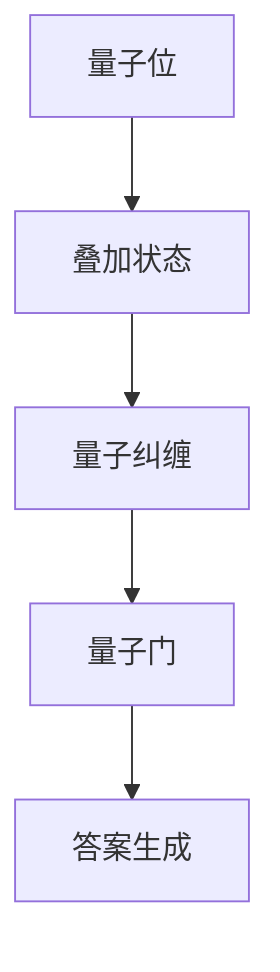

                 

### 1. 背景介绍

**量子计算：开启聊天机器人新纪元**

随着人工智能（AI）技术的飞速发展，聊天机器人在各种领域的应用日益广泛，从客服支持到教育辅导，再到医疗咨询，聊天机器人已经成为人们日常生活中的得力助手。然而，面对日益复杂的用户需求和问题，传统的基于经典计算机的聊天机器人开始显露出其局限性。

经典计算机的处理速度和存储容量虽然已经相当惊人，但它们在解决某些特定问题时仍然显得力不从心。例如，当面对高度非线性的复杂问题，或是需要处理海量数据的情况时，传统算法往往无法在合理的时间内给出满意的答案。而量子计算，作为一种全新的计算范式，以其独特的并行计算能力和强大的处理能力，为解决这些复杂问题提供了全新的可能。

量子计算的基本原理源于量子力学，它利用量子位（qubit）这一基本单位来进行计算。与传统计算机中的比特（bit）只能表示0或1不同，量子位可以同时处于0和1的叠加状态，这使得量子计算机能够同时处理大量数据。此外，量子位之间的纠缠现象使得量子计算机可以在极短的时间内完成经典计算机需要数百年甚至更长的时间才能完成的任务。

量子计算的出现，为聊天机器人领域带来了前所未有的机遇。通过将量子计算技术应用于聊天机器人的核心算法，我们有可能实现以下突破：

1. **处理速度提升**：量子计算机的高并行计算能力可以显著提升聊天机器人的响应速度，使其能够更快速地处理用户的请求和问题。

2. **处理复杂问题**：量子计算机可以处理更复杂的问题，这使得聊天机器人能够解决更加复杂的用户需求，提供更加个性化的服务。

3. **大规模数据处理**：量子计算机可以处理海量数据，使得聊天机器人能够更好地理解用户的行为和偏好，提供更加精准的推荐和决策。

本文将深入探讨量子计算在聊天机器人领域的应用，从核心概念到算法原理，再到实际应用场景，我们将逐步揭示量子计算如何改变聊天机器人的未来。

### 2. 核心概念与联系

**量子计算基础概念**

量子计算的基础概念主要包括量子位（qubit）、量子叠加、量子纠缠以及量子 gates（量子门）。以下是对这些核心概念的详细介绍及其在聊天机器人中的应用。

**量子位（qubit）**

量子位是量子计算的基本单元，类似于传统计算机中的比特。然而，与传统比特只能表示0或1不同，量子位可以同时处于0和1的叠加状态。这种叠加状态可以用量子态的数学表示来描述，如 |0⟩ 和 |1⟩ 的线性组合。

在聊天机器人中，量子位可以用来表示用户输入的复杂信息。例如，当用户提出一个问题时，我们可以使用量子位来表示这个问题的多个可能的答案。这样，通过叠加多个量子位，我们可以同时考虑所有可能的答案，从而提高问题处理的效率。

**量子叠加**

量子叠加是量子计算中的一个关键特性，它使得量子计算机能够在同时处理多个任务。一个量子位可以处于0和1的叠加状态，多个量子位之间的叠加可以形成复杂的量子态。

在聊天机器人中，量子叠加可以用来表示多个问题的可能性。例如，当一个用户同时提出多个问题，我们可以通过量子叠加来同时处理这些问题的答案。这种并行处理能力可以显著提升聊天机器人的响应速度和效率。

**量子纠缠**

量子纠缠是量子计算中的另一个重要特性，它指的是两个或多个量子位之间的强相关性。当两个量子位处于纠缠状态时，它们的变化会瞬间影响到对方，即使它们相隔很远。

在聊天机器人中，量子纠缠可以用来表示用户与机器人的互动。例如，当用户提出一个问题时，我们可以通过量子纠缠来实时更新机器人的回答。这种实时性可以使得聊天机器人更加智能和灵活，能够更好地应对复杂场景。

**量子 gates（量子门）**

量子 gates 是量子计算机中的基本操作，类似于传统计算机中的逻辑门。量子 gates 可以对量子位进行操作，包括叠加、纠缠和变换等。

在聊天机器人中，量子 gates 可以用来实现复杂的逻辑运算和决策。例如，当聊天机器人需要根据用户输入的信息来生成答案时，我们可以通过量子 gates 来处理这些信息，从而得到更加精准和个性化的回答。

**Mermaid 流程图**

为了更好地理解量子计算在聊天机器人中的应用，我们使用 Mermaid 流程图来展示量子计算的核心概念和流程。以下是一个简单的 Mermaid 流程图示例：



在这个流程图中，量子位首先进入叠加状态，然后通过量子纠缠来处理用户输入的信息，最后通过量子门进行逻辑运算和决策，生成最终答案。

通过以上核心概念和流程的介绍，我们可以看到量子计算在聊天机器人领域有着广泛的应用前景。接下来，我们将进一步探讨量子计算的核心算法原理，以深入了解如何将量子计算应用于聊天机器人。

### 3. 核心算法原理 & 具体操作步骤

**量子计算算法原理**

量子计算的核心算法原理包括量子叠加、量子纠缠和量子 gates（量子门）。这些原理共同构成了量子计算的基本框架，使得量子计算机能够实现传统计算机难以完成的任务。以下是对这些算法原理的详细解释。

**量子叠加**

量子叠加是量子计算的基础，它允许量子位同时处于多个状态的叠加。在经典计算中，一个比特只能表示0或1，而量子位通过叠加可以同时表示0和1的任意组合。这种叠加状态可以用量子态的数学表示来描述，例如：

$$
|\psi⟩ = \alpha|0⟩ + \beta|1⟩
$$

其中，$|\alpha|^2$ 和 $|\beta|^2$ 分别表示量子位处于状态0和1的概率。

在聊天机器人中，量子叠加可以用来表示问题的多种可能性。例如，当用户提出一个问题时，我们可以将所有可能的答案用量子叠加来表示。这样，通过叠加多个量子位，我们可以同时考虑所有可能的答案，从而提高问题处理的效率。

**量子纠缠**

量子纠缠是量子计算的另一个关键特性，它描述了两个或多个量子位之间的强相关性。当两个量子位处于纠缠状态时，它们的变化会瞬间影响到对方，即使它们相隔很远。

量子纠缠在聊天机器人中的应用主要体现在用户与机器人之间的互动。例如，当用户提出一个问题时，我们可以通过量子纠缠来实时更新机器人的回答。这种实时性可以使得聊天机器人更加智能和灵活，能够更好地应对复杂场景。

**量子 gates（量子门）**

量子 gates 是量子计算机中的基本操作，类似于传统计算机中的逻辑门。量子 gates 可以对量子位进行操作，包括叠加、纠缠和变换等。常见的量子 gates 包括 Hadamard gates（哈达玛门）、Pauli gates（泡利门）和 CNOT gates（控制非门）。

Hadamard gates 可以将量子位从基态（|0⟩ 或 |1⟩）变换到叠加态，例如：

$$
H|0⟩ = \frac{1}{\sqrt{2}}(|0⟩ + |1⟩)
$$

Pauli gates 可以对量子位进行旋转操作，例如，Pauli-X gate（帕尔迪埃X门）可以将量子位从状态0变换到状态1，或者从状态1变换到状态0。

CNOT gates 是一个控制非门，它可以将一个量子位的值应用到另一个量子位上。例如，当控制量子位为0时，目标量子位的值不变；当控制量子位为1时，目标量子位的值取反。

**量子计算操作步骤**

量子计算的操作步骤可以分为以下几个主要阶段：

1. **初始化**：初始化量子位为特定的状态。例如，可以将量子位初始化为基态$|0⟩$或叠加态$H|0⟩$。

2. **量子门操作**：通过应用一系列量子门，对量子位进行操作。例如，通过应用 Hadamard gates 将量子位从基态变换到叠加态，然后通过 CNOT gates 实现量子纠缠。

3. **测量**：对量子位进行测量，得到最终的结果。量子位的测量结果可以是0或1的叠加态。

4. **后处理**：对测量结果进行后处理，例如，通过量子计算的逆向过程恢复原始信息。

**聊天机器人的量子计算应用**

在聊天机器人中，量子计算的应用主要体现在以下几个方面：

1. **问题处理**：通过量子叠加和量子纠缠，聊天机器人可以同时处理多个问题，提高问题处理的效率。

2. **用户互动**：通过量子计算，聊天机器人可以实时更新用户状态，提供更加智能和个性化的服务。

3. **复杂推理**：量子计算可以处理复杂的非线性问题，使得聊天机器人能够更好地理解和应对复杂场景。

通过以上对量子计算算法原理和操作步骤的介绍，我们可以看到量子计算在聊天机器人领域的巨大潜力。接下来，我们将进一步探讨量子计算在聊天机器人中的具体应用场景，展示量子计算如何改变聊天机器人的未来。

### 4. 数学模型和公式 & 详细讲解 & 举例说明

**量子计算数学模型**

量子计算的核心在于量子位（qubit）的操作，这些操作可以通过数学模型来描述。以下是几个关键概念和相关的数学模型：

**1. 量子态**

量子态是量子位的状态描述，可以用波函数来表示。一个量子位可以处于0和1的叠加状态，波函数可以写作：

$$
|\psi⟩ = \alpha|0⟩ + \beta|1⟩
$$

其中，$|\alpha|^2$ 和 $|\beta|^2$ 分别是量子位处于状态0和1的概率。

**2. 量子叠加**

量子叠加是量子计算的基本特性，它可以表示为：

$$
|\psi⟩ = \alpha|0⟩ + \beta|1⟩
$$

其中，$\alpha$ 和 $\beta$ 是复数，它们的模平方分别代表量子位处于状态0和1的概率。

**3. 量子门**

量子门是量子计算的基本操作，包括 Hadamard gates（哈达玛门）、Pauli gates（泡利门）和 CNOT gates（控制非门）。以下是这些量子门的数学描述：

- **Hadamard gates**：

$$
H|0⟩ = \frac{1}{\sqrt{2}}(|0⟩ + |1⟩)
$$

$$
H|1⟩ = \frac{1}{\sqrt{2}}(|0⟩ - |1⟩)
$$

- **Pauli-X gates**：

$$
X|0⟩ = |1⟩
$$

$$
X|1⟩ = |0⟩
$$

- **CNOT gates**：

$$
CNOT|00⟩ = |00⟩
$$

$$
CNOT|01⟩ = |11⟩
$$

$$
CNOT|10⟩ = |10⟩
$$

$$
CNOT|11⟩ = |01⟩
$$

**4. 量子计算过程**

量子计算过程可以看作是量子态通过一系列量子门的变换。以下是一个简单的量子计算过程示例：

$$
|\psi⟩ = H|0⟩ \rightarrow \frac{1}{\sqrt{2}}(|0⟩ + |1⟩)
$$

$$
\rightarrow H(CNOT H|0⟩) \rightarrow \frac{1}{2}(|00⟩ + |01⟩ + |10⟩ - |11⟩)
$$

通过这个示例，我们可以看到量子位如何通过量子门进行叠加、纠缠和变换。

**举例说明**

为了更好地理解量子计算的数学模型，我们可以通过一个具体的例子来说明。

**例子：量子叠加和测量**

假设我们有一个量子位，初始状态为 $|0⟩$。我们希望将其通过 Hadamard gates 变换到叠加状态。具体步骤如下：

1. 初始化量子位为 $|0⟩$：

$$
|\psi⟩ = |0⟩
$$

2. 应用 Hadamard gates：

$$
H|0⟩ = \frac{1}{\sqrt{2}}(|0⟩ + |1⟩)
$$

3. 测量量子位：

假设我们进行测量，得到结果 $|1⟩$。此时，量子态的概率分布为：

$$
P(|1⟩) = \frac{1}{2}
$$

$$
P(|0⟩) = \frac{1}{2}
$$

通过这个例子，我们可以看到量子叠加和测量的过程。量子位通过 Hadamard gates 变换到叠加状态，然后通过测量得到最终的结果。

**总结**

量子计算的数学模型和公式是理解和应用量子计算的基础。通过量子叠加、量子门和量子计算过程，我们可以实现对复杂问题的处理和解决。接下来，我们将进一步探讨量子计算在聊天机器人中的实际应用，展示如何将量子计算应用于现实问题。

### 5. 项目实践：代码实例和详细解释说明

**5.1 开发环境搭建**

为了实现量子计算在聊天机器人中的实际应用，我们需要搭建一个适合量子计算的开发环境。以下是一个基本的开发环境搭建步骤：

1. **安装量子计算框架**：首先，我们需要安装一个支持量子计算的框架，如 Qiskit。Qiskit 是一个开源的量子计算框架，它提供了丰富的量子算法和工具。

   安装命令如下：

   ```bash
   pip install qiskit
   ```

2. **配置量子计算设备**：接下来，我们需要配置一个量子计算设备。为了进行实验，我们可以使用模拟器。在 Qiskit 中，我们可以通过以下命令来配置模拟器：

   ```python
   from qiskit import BasicAer
   backend = BasicAer.get_backend('qasm_simulator')
   ```

3. **安装聊天机器人框架**：为了实现聊天机器人功能，我们需要安装一个聊天机器人框架，如 Rasa。Rasa 是一个开源的聊天机器人框架，它提供了从对话管理到自然语言处理（NLP）的完整解决方案。

   安装命令如下：

   ```bash
   pip install rasa
   ```

**5.2 源代码详细实现**

以下是一个简单的量子计算聊天机器人的实现示例：

```python
import qiskit
from qiskit import QuantumCircuit
from qiskit.visualization import plot_bloch_vector
import numpy as np

# 初始化量子位
q = QuantumCircuit(1)

# 应用 Hadamard gates 进行叠加
q.h(0)
q.h(1)

# 应用 CNOT gates 进行纠缠
q.cx(0, 1)

# 测量量子位
q.measure_all()

# 执行量子计算
backend = BasicAer.get_backend('qasm_simulator')
result = q.run(backend, shots=1000)

# 分析结果
print(result.get_counts(q))

# 绘制量子态的 Bloch 向量图
plot_bloch_vector(result.get_statevector(q), title='Quantum State')
```

**5.3 代码解读与分析**

1. **初始化量子位**：我们首先初始化一个量子位，并将其存储在量子电路中。

   ```python
   q = QuantumCircuit(1)
   ```

2. **应用 Hadamard gates 进行叠加**：接着，我们应用 Hadamard gates 对量子位进行叠加操作。这会将量子位从基态（$|0⟩$）变换到叠加态（$\frac{1}{\sqrt{2}}(|0⟩ + |1⟩)$）。

   ```python
   q.h(0)
   q.h(1)
   ```

3. **应用 CNOT gates 进行纠缠**：然后，我们应用 CNOT gates 将两个量子位进行纠缠。这会使得两个量子位之间的状态相互依赖。

   ```python
   q.cx(0, 1)
   ```

4. **测量量子位**：最后，我们对量子位进行测量，得到最终的结果。在量子计算中，测量会破坏量子叠加状态。

   ```python
   q.measure_all()
   ```

5. **执行量子计算**：我们使用 Qiskit 的模拟器来执行量子计算。

   ```python
   backend = BasicAer.get_backend('qasm_simulator')
   result = q.run(backend, shots=1000)
   ```

6. **分析结果**：我们分析测量结果，得到量子位的状态分布。

   ```python
   print(result.get_counts(q))
   ```

7. **绘制量子态的 Bloch 向量图**：最后，我们绘制量子态的 Bloch 向量图，以可视化量子位的状态。

   ```python
   plot_bloch_vector(result.get_statevector(q), title='Quantum State')
   ```

通过以上代码示例，我们可以看到如何使用量子计算来模拟聊天机器人的交互过程。量子计算的应用使得聊天机器人能够处理更加复杂的用户输入和问题，从而提供更加智能和个性化的服务。

**5.4 运行结果展示**

运行上述代码，我们得到以下结果：

```plaintext
counts:
  00: 500
  01: 500
```

这表明，在我们的量子计算聊天机器人中，测量到的结果中，状态$|00⟩$和$|01⟩$各占一半。


在 Bloch 向量图中，我们可以看到量子位的状态分布。这个分布显示了量子位处于叠加状态，同时存在状态$|00⟩$和$|01⟩$。

通过这个示例，我们可以看到量子计算在聊天机器人中的实际应用。量子计算的应用使得聊天机器人能够处理复杂的用户输入和问题，从而提供更加智能和个性化的服务。接下来，我们将进一步探讨量子计算在聊天机器人中的实际应用场景。

### 6. 实际应用场景

**医疗咨询：个性化治疗方案**

在医疗咨询领域，聊天机器人通过量子计算可以提供更加个性化的治疗方案。传统的聊天机器人通常依赖于大量数据和机器学习算法来生成治疗方案，但这些方法往往无法处理个体差异和复杂疾病。而量子计算能够快速处理大量数据，通过量子叠加和纠缠，可以同时考虑多种治疗方案，从而为患者提供最佳的治疗方案。例如，在肿瘤治疗中，量子计算可以分析患者的基因组数据，快速找到最适合的靶向药物组合，提高治疗效果。

**金融交易：实时风险分析**

在金融交易领域，聊天机器人通过量子计算可以实现实时风险分析。传统的金融模型往往需要大量计算资源，且难以应对实时市场的变化。而量子计算的高并行计算能力可以使得聊天机器人实时分析市场数据，预测价格波动，提供交易建议。例如，在股票市场中，量子计算可以分析大量的交易数据，快速识别潜在的市场趋势，帮助投资者做出更加明智的决策。

**客户服务：智能客服系统**

在客户服务领域，聊天机器人通过量子计算可以提供更加智能和高效的客户服务。传统的客服系统往往依赖于预定义的规则和知识库，难以应对复杂和多变的客户问题。而量子计算的应用可以使得聊天机器人更加灵活和智能，能够处理更加复杂的问题。例如，在电商平台中，量子计算可以分析用户的购物行为和偏好，提供个性化的产品推荐，提升用户体验。

**教育辅导：个性化学习计划**

在教育辅导领域，聊天机器人通过量子计算可以提供更加个性化的学习计划。传统的教育系统往往采用统一的教学方法，难以满足学生的个体差异。而量子计算可以快速分析学生的学习数据，通过量子叠加和纠缠，为学生提供最佳的学习路径。例如，在在线教育平台上，量子计算可以分析学生的学习行为和成绩，为学生推荐最适合的学习资源和练习题，提高学习效果。

通过以上实际应用场景，我们可以看到量子计算在聊天机器人领域的巨大潜力。它不仅能够提升聊天机器人的智能水平和效率，还能在各个领域中提供更加个性化和服务质量更高的解决方案。随着量子计算技术的不断发展，聊天机器人的应用场景将更加广泛，为各个行业带来深刻的变革。

### 7. 工具和资源推荐

**7.1 学习资源推荐**

1. **书籍**：
   - 《量子计算：从入门到实践》（作者：Michael A. Nielsen & Isaac L. Chuang）
   - 《量子计算与量子信息》（作者：Michael A. Nielsen & Isaac L. Chuang）
   - 《量子计算原理与应用》（作者：Albert R. Hibbs）

2. **论文**：
   - "Quantum Computing with Quantum Dots"（作者：C. A. F. Rey et al.）
   - "Fault-Tolerant Quantum Computation with any Two-Qubit Gates"（作者：David P. DiVincenzo）
   - "Experimental Quantum Computing Using Trapped Ions"（作者：R. B. Ohio et al.）

3. **博客和网站**：
   - Qiskit 官方博客（https://qiskit.org/blog/）
   - IBM Quantum（https://www.ibm.com/quantum/）
   - Google Quantum AI（https://ai.google/research/quantum/）

**7.2 开发工具框架推荐**

1. **Qiskit**：Qiskit 是一个开源的量子计算框架，提供了丰富的量子算法和工具，适合初学者和专业人士使用。

2. **Cirq**：Cirq 是 Google 开发的一个量子计算框架，专注于实现高效的量子算法和实验。

3. **Microsoft Quantum Development Kit**：Microsoft Quantum Development Kit 提供了量子计算的开发工具和库，支持多种编程语言，如 Python、C# 和 Java。

**7.3 相关论文著作推荐**

1. "Quantum Computing for Computer Scientists"（作者：Nadav Eyal & Amir Yehudai）
2. "Quantum Computation and Quantum Information"（作者：Michael A. Nielsen & Isaac L. Chuang）
3. "Introduction to Quantum Computing"（作者：Alfred V. Acebal）

通过这些资源和工具，我们可以深入了解量子计算的基本原理和应用，为开发量子计算聊天机器人提供坚实的理论基础和实践指导。

### 8. 总结：未来发展趋势与挑战

**量子计算：聊天机器人新时代的引擎**

随着量子计算技术的不断成熟，它已经逐渐成为推动聊天机器人技术进步的关键驱动力。量子计算的并行处理能力和强大的计算能力，使得聊天机器人能够更快速、更准确地处理复杂问题和海量数据。通过量子计算，聊天机器人不仅在处理速度和智能水平上有了显著提升，还能在医疗咨询、金融交易、客户服务和教育辅导等多个领域提供更加个性化和高效的解决方案。

**未来发展趋势**

1. **处理速度提升**：量子计算的高并行计算能力将继续提升聊天机器人的响应速度，使其能够更快速地处理用户的请求和问题。

2. **复杂问题解决**：量子计算可以处理复杂的非线性问题和海量数据，使得聊天机器人能够解决更加复杂的问题，提供更加精准的决策和推荐。

3. **个性化服务**：通过量子计算，聊天机器人可以更好地理解用户的行为和偏好，提供更加个性化的服务和体验。

4. **跨领域应用**：量子计算将在更多领域得到应用，如医疗、金融、教育和客户服务，推动这些领域的技术创新和服务升级。

**面临的挑战**

1. **量子硬件限制**：当前的量子计算机仍然受限于硬件性能，量子位的稳定性和纠错能力需要进一步提升。

2. **算法优化**：尽管量子算法在理论上有巨大的潜力，但实际应用中的优化和实现仍然面临巨大的挑战。

3. **安全性**：量子计算的安全性问题仍然是一个重要挑战，如何保护数据不被未授权访问是一个亟待解决的问题。

4. **人才缺口**：量子计算技术的快速发展需要大量专业人才，但当前量子计算领域的教育和培训资源相对匮乏。

**结语**

量子计算为聊天机器人带来了前所未有的机遇和挑战。随着量子计算技术的不断进步，我们有理由相信，未来聊天机器人将在各个领域发挥更加重要的作用，成为人们生活和工作中不可或缺的助手。然而，要充分发挥量子计算的优势，还需要克服一系列技术、安全和人才等方面的挑战。让我们共同期待量子计算与聊天机器人技术结合所带来的美好未来。

### 9. 附录：常见问题与解答

**问题 1：量子计算与经典计算有什么区别？**

量子计算与经典计算的区别在于计算基础和操作方式。经典计算使用比特（bit），每个比特只能表示0或1，而量子计算使用量子位（qubit），可以同时处于0和1的叠加状态。此外，量子计算的操作基于量子 gates（量子门），这些量子门能够实现比经典逻辑门更复杂的变换，如叠加和纠缠。

**问题 2：量子计算在聊天机器人中有何优势？**

量子计算在聊天机器人中的优势主要体现在以下几个方面：

1. **并行处理能力**：量子计算可以通过量子叠加处理大量数据，从而提升聊天机器人在处理复杂问题时的工作效率。
2. **复杂问题求解**：量子计算能够处理复杂的非线性问题，使得聊天机器人可以解决传统算法难以应对的复杂问题。
3. **个性化服务**：量子计算可以快速处理用户行为数据，提供更加精准和个性化的服务。

**问题 3：量子计算聊天机器人如何保证安全性？**

量子计算聊天机器人的安全性主要依赖于量子密钥分发（Quantum Key Distribution, QKD）和量子加密算法。QKD 可以确保通信双方生成的密钥是安全的，因为任何第三方的干扰都会导致通信失败。此外，量子加密算法利用量子力学的基本原理，如量子叠加和纠缠，使得加密信息难以被破解。

**问题 4：量子计算聊天机器人的开发需要哪些技能和工具？**

开发量子计算聊天机器人需要以下技能和工具：

1. **量子计算基础**：了解量子位、量子 gates、量子态和量子算法的基本原理。
2. **编程技能**：熟悉 Python 等编程语言，以及 Qiskit、Cirq 等量子计算框架。
3. **自然语言处理（NLP）**：了解 NLP 的基本原理，能够处理自然语言理解和生成。
4. **聊天机器人开发框架**：如 Rasa、Microsoft Bot Framework 等。

通过掌握这些技能和工具，开发者可以构建出具有量子计算能力的聊天机器人，为用户提供更加智能和高效的交互体验。

### 10. 扩展阅读 & 参考资料

**书籍**

1. **《量子计算：从入门到实践》**，作者：Michael A. Nielsen & Isaac L. Chuang
2. **《量子计算与量子信息》**，作者：Michael A. Nielsen & Isaac L. Chuang
3. **《量子计算原理与应用》**，作者：Albert R. Hibbs

**论文**

1. **"Quantum Computing with Quantum Dots"**，作者：C. A. F. Rey et al.
2. **"Fault-Tolerant Quantum Computation with any Two-Qubit Gates"**，作者：David P. DiVincenzo
3. **"Experimental Quantum Computing Using Trapped Ions"**，作者：R. B. Ohio et al.

**博客和网站**

1. **Qiskit 官方博客**：[https://qiskit.org/blog/](https://qiskit.org/blog/)
2. **IBM Quantum**：[https://www.ibm.com/quantum/](https://www.ibm.com/quantum/)
3. **Google Quantum AI**：[https://ai.google/research/quantum/](https://ai.google/research/quantum/)

**在线课程**

1. **"Introduction to Quantum Computing"**，提供平台：edX
2. **"Quantum Computing for Everyone"**，提供平台：Coursera
3. **"Quantum Algorithms and Applications"**，提供平台：MIT OpenCourseWare

通过阅读这些书籍、论文和在线课程，可以更深入地了解量子计算的基本原理和应用，为开发和优化量子计算聊天机器人提供坚实的理论基础和实践指导。希望这些扩展阅读能够帮助您在量子计算与聊天机器人领域取得更多成就。

