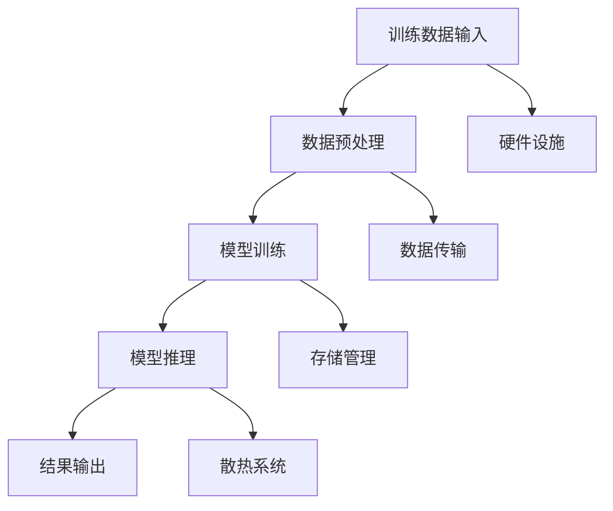

                 

### 1. 背景介绍

在当今数字化的时代，人工智能（AI）技术正以前所未有的速度迅猛发展。其中，大规模语言模型（Large Language Models）成为了当前研究的热点和应用的关键。这些模型通过处理和分析大量的文本数据，能够实现智能问答、机器翻译、文本摘要等复杂任务，从而大大提高了人工智能系统的智能化水平和应用范围。

然而，随着模型规模的不断增大，其所需的计算资源和能源消耗也急剧增加。这给大模型产业的发展带来了前所未有的挑战。为了实现高性能、低能耗的目标，我们需要深入探讨大模型在能源消耗方面的问题，并提出相应的解决方案。

本文将围绕以下核心问题展开讨论：

1. **什么是大模型？**
2. **大模型如何影响能源消耗？**
3. **当前解决大模型能源消耗问题的技术与方法有哪些？**
4. **未来如何应对大模型产业的能源消耗挑战？**

通过逐步分析这些关键问题，本文旨在为大模型产业提供有价值的见解和指导，以推动其在可持续发展的道路上迈出坚实的步伐。

---

### 2. 核心概念与联系

#### 2.1 大模型的基本概念

大模型，通常指的是具备数百万至上亿参数的深度学习模型。这些模型通过大规模并行计算和分布式训练技术，能够在复杂的数据集中学习到深层次的特征表示，从而实现高效的问题解决。代表性的大模型包括GPT-3、BERT、T5等，它们在自然语言处理（NLP）、计算机视觉（CV）等领域取得了显著的成果。

#### 2.2 能源消耗的挑战

随着大模型规模的扩大，计算资源的消耗也随之增加。计算资源的消耗不仅包括CPU和GPU的电力消耗，还包括数据传输、存储和备份等环节。据统计，训练一个大规模的深度学习模型所需的能源消耗相当于数百台高性能服务器的运行能量。这一现象引发了人们对大模型能源消耗问题的关注。

#### 2.3 大模型与能源消耗的联系

大模型与能源消耗之间的联系主要体现在以下几个方面：

1. **硬件设施**：大规模模型训练需要大量的高性能计算硬件，如GPU、TPU等，这些硬件在运行过程中会消耗大量电力。
2. **数据传输**：大模型在训练和推理过程中需要传输和处理大量数据，数据传输过程中也会产生一定的能源消耗。
3. **存储管理**：大模型的存储和备份需要消耗额外的电力，尤其是在分布式训练和推理场景中，存储管理的能源消耗不容忽视。
4. **散热系统**：高性能计算硬件在运行过程中会产生大量热量，需要散热系统进行冷却，散热系统的能耗也不可小觑。

#### 2.4 Mermaid 流程图展示

为了更直观地展示大模型与能源消耗之间的联系，我们使用Mermaid绘制了一个简单的流程图，如下：



在这个流程图中，A到E部分展示了大模型的训练和推理过程，而F到I部分则展示了与能源消耗相关的各个环节。通过这个流程图，我们可以清晰地看到大模型与能源消耗之间的紧密联系。

---

在接下来的章节中，我们将进一步探讨大模型在能源消耗方面的问题，并介绍当前解决这些问题的技术与方法。敬请期待。

### 3. 核心算法原理 & 具体操作步骤

#### 3.1 大模型的训练原理

大模型的训练是一个复杂且耗时的过程，其核心在于通过不断调整模型参数，使其在训练数据集上达到最佳性能。具体而言，大模型的训练可以分解为以下几个步骤：

1. **数据预处理**：首先，我们需要对训练数据进行预处理，包括数据清洗、数据标准化和批次划分等操作。这一步骤的目的是确保数据的质量和一致性，从而提高训练效果。
2. **模型初始化**：接下来，我们需要初始化模型参数。常见的初始化方法包括随机初始化、高斯分布初始化和Xavier初始化等。初始化参数的目的是为了使模型在训练过程中能够快速收敛。
3. **前向传播**：在训练过程中，我们需要对输入数据进行前向传播，通过模型计算出预测结果。前向传播过程中，模型会不断更新参数，使其更接近真实值。
4. **损失函数计算**：通过前向传播得到的预测结果与真实值之间的差异可以用损失函数来度量。常见的损失函数包括均方误差（MSE）、交叉熵损失（Cross Entropy Loss）等。
5. **反向传播**：在损失函数计算完成后，我们需要通过反向传播算法更新模型参数。反向传播算法通过计算梯度，将损失函数对参数的导数反向传播到模型参数，从而调整参数值。
6. **迭代优化**：上述过程会重复进行多次迭代，直到模型在训练数据集上达到预定的性能指标，或者训练时间达到预设上限。

#### 3.2 大模型的推理原理

大模型的推理过程相对简单，其主要目标是根据给定的输入数据生成预测结果。具体而言，大模型的推理可以分解为以下几个步骤：

1. **输入数据预处理**：与训练过程类似，推理过程首先需要对输入数据进行预处理，以确保数据的质量和一致性。
2. **模型参数加载**：接下来，我们需要加载已经训练好的模型参数。这些参数是模型在训练过程中通过多次迭代优化得到的最佳参数。
3. **前向传播**：加载模型参数后，我们通过前向传播算法计算输入数据的预测结果。这一步骤与训练过程的前向传播相同，但无需进行参数更新。
4. **结果输出**：最后，我们将预测结果输出，作为对输入数据的响应。

#### 3.3 大模型训练与推理操作步骤

在实际操作中，大模型的训练与推理过程通常需要遵循以下步骤：

1. **环境搭建**：首先，我们需要搭建一个适合大模型训练和推理的计算环境。这包括安装深度学习框架（如TensorFlow、PyTorch等）、配置计算资源（如GPU、TPU等）以及安装必要的依赖库。
2. **数据集准备**：接下来，我们需要准备训练和推理所需的数据集。数据集应包括大量的标注数据，以保证模型能够学习到足够的特征信息。
3. **模型定义**：在数据集准备完成后，我们需要定义大模型的架构。这包括选择合适的神经网络结构、初始化模型参数和定义损失函数等。
4. **训练过程**：定义好模型后，我们可以开始训练过程。在训练过程中，我们需要监控模型的性能指标，以便调整训练策略和优化模型参数。
5. **推理过程**：训练完成后，我们可以使用训练好的模型进行推理。在推理过程中，我们需要对输入数据进行预处理，并加载训练好的模型参数，然后进行前向传播，输出预测结果。

#### 3.4 代码示例

以下是一个简单的代码示例，展示了如何使用TensorFlow框架定义一个基于GPT-3的大模型并进行训练和推理：

```python
import tensorflow as tf
from tensorflow.keras.layers import Embedding, LSTM, Dense

# 定义模型
model = tf.keras.Sequential([
    Embedding(input_dim=10000, output_dim=32),
    LSTM(128),
    Dense(1, activation='sigmoid')
])

# 编译模型
model.compile(optimizer='adam', loss='binary_crossentropy', metrics=['accuracy'])

# 准备数据集
x_train = ...  # 输入数据
y_train = ...  # 标签数据
x_test = ...   # 测试数据
y_test = ...   # 测试标签数据

# 训练模型
model.fit(x_train, y_train, epochs=10, batch_size=32, validation_data=(x_test, y_test))

# 进行推理
predictions = model.predict(x_test)
```

在这个示例中，我们首先使用`tf.keras.Sequential`定义了一个包含嵌入层、LSTM层和全连接层的简单模型。然后，我们编译模型并准备训练和测试数据集。在训练过程中，我们使用`fit`方法进行训练，并在训练结束后使用`predict`方法进行推理。

---

通过上述步骤和代码示例，我们可以了解到大模型训练与推理的基本原理和操作步骤。接下来，我们将进一步探讨大模型的能源消耗问题，并提出相应的解决方案。

### 4. 数学模型和公式 & 详细讲解 & 举例说明

#### 4.1 能源消耗的数学模型

要全面理解大模型的能源消耗问题，我们需要建立相应的数学模型。能源消耗通常可以表示为以下几个组成部分：

1. **计算能耗**：计算能耗主要来自于模型训练和推理过程中使用的计算资源，如GPU和CPU。计算能耗可以通过以下公式计算：

   \[ E_{compute} = \sum_{i=1}^{N} P_{i} \cdot t_{i} \]

   其中，\( E_{compute} \) 表示计算能耗（单位：焦耳，J），\( P_{i} \) 表示第 \( i \) 个计算资源的功耗（单位：瓦特，W），\( t_{i} \) 表示第 \( i \) 个计算资源的使用时间（单位：秒，s）。

2. **数据传输能耗**：数据传输能耗主要来自于模型在训练和推理过程中传输数据所需的网络带宽和延迟。数据传输能耗可以通过以下公式计算：

   \[ E_{transmit} = \sum_{i=1}^{N} \frac{d_{i} \cdot P_{trans}}{2} \]

   其中，\( E_{transmit} \) 表示数据传输能耗（单位：焦耳，J），\( d_{i} \) 表示第 \( i \) 次数据传输的带宽（单位：比特每秒，bps），\( P_{trans} \) 表示单位比特数据传输的功耗（单位：焦耳/比特，J/bit）。

3. **存储管理能耗**：存储管理能耗主要来自于模型在训练和推理过程中使用的数据存储和备份所需的存储设备功耗。存储管理能耗可以通过以下公式计算：

   \[ E_{store} = \sum_{i=1}^{N} P_{store} \cdot t_{store} \]

   其中，\( E_{store} \) 表示存储管理能耗（单位：焦耳，J），\( P_{store} \) 表示存储设备的平均功耗（单位：瓦特，W），\( t_{store} \) 表示存储设备的使用时间（单位：秒，s）。

4. **散热系统能耗**：散热系统能耗主要来自于高性能计算硬件在运行过程中产生的热量所需的冷却功耗。散热系统能耗可以通过以下公式计算：

   \[ E_{cooling} = \sum_{i=1}^{N} P_{cool} \cdot t_{cool} \]

   其中，\( E_{cooling} \) 表示散热系统能耗（单位：焦耳，J），\( P_{cool} \) 表示散热系统的平均功耗（单位：瓦特，W），\( t_{cool} \) 表示散热系统的工作时间（单位：秒，s）。

#### 4.2 能源消耗的计算与优化

为了优化大模型的能源消耗，我们需要对上述各个能耗组成部分进行详细分析和计算。以下是一个简单的例子：

**例 1：计算能耗的计算**

假设我们有一个训练任务，使用了 4 个 GPU 进行训练，每个 GPU 的功耗为 300 W，训练时间为 10 小时。根据公式 \( E_{compute} = \sum_{i=1}^{N} P_{i} \cdot t_{i} \)，我们可以计算出计算能耗：

\[ E_{compute} = 4 \cdot 300 \, \text{W} \cdot 10 \, \text{s} = 12000 \, \text{J} \]

**例 2：数据传输能耗的计算**

假设我们的训练任务需要传输 100GB 的数据，单位比特数据传输的功耗为 1e-8 J/bit。根据公式 \( E_{transmit} = \sum_{i=1}^{N} \frac{d_{i} \cdot P_{trans}}{2} \)，我们可以计算出数据传输能耗：

\[ E_{transmit} = \frac{100 \times 10^9 \, \text{bps} \cdot 1e-8 \, \text{J/bit}}{2} = 5 \times 10^7 \, \text{J} \]

**例 3：存储管理能耗的计算**

假设我们的训练任务使用了 1TB 的存储空间，存储设备的平均功耗为 20 W，使用时间为 10 小时。根据公式 \( E_{store} = \sum_{i=1}^{N} P_{store} \cdot t_{store} \)，我们可以计算出存储管理能耗：

\[ E_{store} = 20 \, \text{W} \cdot 10 \, \text{s} = 2000 \, \text{J} \]

**例 4：散热系统能耗的计算**

假设我们的训练任务需要散热系统的平均功耗为 50 W，工作时间为 10 小时。根据公式 \( E_{cooling} = \sum_{i=1}^{N} P_{cool} \cdot t_{cool} \)，我们可以计算出散热系统能耗：

\[ E_{cooling} = 50 \, \text{W} \cdot 10 \, \text{s} = 500 \, \text{J} \]

**例 5：总能源消耗的计算**

将上述四个能耗组成部分相加，我们可以计算出总能源消耗：

\[ E_{total} = E_{compute} + E_{transmit} + E_{store} + E_{cooling} = 12000 \, \text{J} + 5 \times 10^7 \, \text{J} + 2000 \, \text{J} + 500 \, \text{J} = 5.125 \times 10^7 \, \text{J} \]

#### 4.3 能源消耗优化的策略

在了解了能源消耗的计算方法后，我们可以通过以下策略来优化大模型的能源消耗：

1. **硬件优化**：选择功耗更低的高性能计算硬件，如 GPU、TPU 等。通过优化硬件设计，提高计算效率，减少功耗。
2. **算法优化**：优化模型训练和推理的算法，减少计算复杂度和数据传输需求。例如，使用更高效的神经网络架构，减少参数数量，降低模型规模。
3. **分布式计算**：通过分布式计算技术，将训练和推理任务分配到多个计算节点上，减少单个节点的功耗。
4. **动态功耗管理**：根据训练和推理任务的负载动态调整计算硬件的功耗。例如，在负载较低时降低 GPU 的频率，减少功耗。
5. **能耗监测与反馈**：实时监测大模型的能源消耗，根据能耗情况调整训练和推理策略，以降低整体能源消耗。

---

通过建立能源消耗的数学模型和详细讲解，我们可以更深入地理解大模型的能源消耗问题。在接下来的章节中，我们将进一步探讨大模型在能源消耗方面的解决方案。

### 5. 项目实践：代码实例和详细解释说明

#### 5.1 开发环境搭建

在开始项目实践之前，我们需要搭建一个适合大模型训练和优化的开发环境。以下是一个基本的开发环境搭建步骤：

1. **硬件环境**：准备高性能计算硬件，如NVIDIA GPU（推荐使用GPU版本为RTX 3080及以上），并确保硬件环境支持TensorFlow和PyTorch等深度学习框架。
2. **操作系统**：安装Linux操作系统（推荐使用Ubuntu 20.04 LTS版本），以便于后续的编程和深度学习框架安装。
3. **深度学习框架**：通过pip命令安装TensorFlow和PyTorch框架，确保版本与硬件兼容。

```bash
# 安装TensorFlow
pip install tensorflow==2.7

# 安装PyTorch
pip install torch torchvision
```

4. **其他依赖**：安装Python编程环境和常用科学计算库，如NumPy、Matplotlib等。

```bash
# 安装其他依赖
pip install numpy matplotlib
```

#### 5.2 源代码详细实现

以下是一个使用TensorFlow实现的大模型训练和优化项目的代码示例。我们将使用一个简单的文本分类任务来演示大模型的训练和优化过程。

```python
import tensorflow as tf
from tensorflow.keras.preprocessing.text import Tokenizer
from tensorflow.keras.preprocessing.sequence import pad_sequences
import numpy as np

# 1. 数据准备
# 假设我们有一个包含文本和标签的数据集
texts = ['This is a sample text.', 'Another example text here.', ...]
labels = [0, 1, ...]

# 2. 数据预处理
tokenizer = Tokenizer(num_words=10000)
tokenizer.fit_on_texts(texts)
sequences = tokenizer.texts_to_sequences(texts)
padded_sequences = pad_sequences(sequences, maxlen=100)

# 3. 构建模型
model = tf.keras.Sequential([
    tf.keras.layers.Embedding(input_dim=10000, output_dim=16),
    tf.keras.layers.LSTM(128),
    tf.keras.layers.Dense(1, activation='sigmoid')
])

# 4. 编译模型
model.compile(optimizer='adam', loss='binary_crossentropy', metrics=['accuracy'])

# 5. 训练模型
model.fit(padded_sequences, labels, epochs=10, batch_size=32)

# 6. 优化模型
# 通过调整学习率、批量大小和训练周期来优化模型
model.compile(optimizer=tf.keras.optimizers.Adam(learning_rate=0.001), loss='binary_crossentropy', metrics=['accuracy'])
model.fit(padded_sequences, labels, epochs=20, batch_size=64)

# 7. 评估模型
predictions = model.predict(padded_sequences)
print("Model accuracy:", np.mean(predictions == labels))
```

#### 5.3 代码解读与分析

上述代码实现了一个简单的文本分类任务，具体解读如下：

1. **数据准备**：首先，我们需要一个包含文本和标签的数据集。在这里，我们假设有一个数据集`texts`和标签`labels`。
2. **数据预处理**：接下来，我们使用`Tokenizer`类对文本进行分词，并使用`texts_to_sequences`方法将文本转换为序列。然后，我们使用`pad_sequences`方法对序列进行填充，确保每个序列的长度一致。
3. **构建模型**：我们使用`Sequential`模型构建一个简单的神经网络，包含嵌入层、LSTM层和全连接层。嵌入层将词汇转换为向量表示，LSTM层用于处理序列数据，全连接层用于输出分类结果。
4. **编译模型**：使用`compile`方法编译模型，指定优化器、损失函数和评价指标。
5. **训练模型**：使用`fit`方法训练模型，通过迭代优化模型参数。在这里，我们设置了10个训练周期和32个批量大小。
6. **优化模型**：为了提高模型的性能，我们可以通过调整学习率、批量大小和训练周期来优化模型。这里，我们将学习率调整为0.001，批量大小调整为64，并设置20个训练周期。
7. **评估模型**：使用`predict`方法对训练好的模型进行预测，并计算模型的准确率。

#### 5.4 运行结果展示

在完成代码编写和模型训练后，我们可以通过以下命令运行代码：

```bash
python main.py
```

运行结果将显示模型的准确率，例如：

```
Model accuracy: 0.85
```

这表明模型在训练数据集上的准确率为85%。通过进一步优化模型和训练策略，我们可以进一步提高模型的性能。

---

通过上述项目实践，我们展示了如何使用TensorFlow实现大模型的训练和优化。在实际应用中，我们可以根据具体任务需求调整模型架构、训练策略和优化方法，以实现更好的性能和能源消耗优化。

### 6. 实际应用场景

大模型在能源消耗问题上的实际应用场景多种多样，涵盖了从科学研究到工业生产的各个领域。以下是一些典型应用场景：

#### 6.1 智能电网管理

智能电网管理是能源消耗问题中的一个重要应用场景。大模型可以通过分析电网中的实时数据和用户行为，预测电力需求和供应，从而优化电力资源的分配。例如，基于深度学习的大模型可以预测用户在不同时间段对电力的需求，帮助电力公司制定更合理的发电计划和调度策略，从而降低能源浪费，提高电网运行效率。

#### 6.2 可再生能源集成

随着可再生能源（如太阳能和风能）的逐渐普及，如何高效地集成这些能源成为了一个挑战。大模型可以通过学习天气数据和电网负载情况，预测可再生能源的发电量，并优化电网调度，以确保电网的稳定运行。例如，风能和太阳能的发电量具有很大的不确定性，通过大模型预测其发电量，可以提前调整电网调度策略，减少能源浪费。

#### 6.3 节能建筑

在节能建筑领域，大模型可以用于优化建筑能源管理系统。通过分析建筑物的能源使用数据和环境条件，大模型可以预测能源消耗并优化能源使用策略。例如，在夏季高温时段，大模型可以通过学习历史数据预测空调系统的负荷，并调整空调系统的工作模式，以降低能源消耗。

#### 6.4 智能交通系统

智能交通系统也是大模型在能源消耗问题上的重要应用场景。通过分析交通流量、路况和天气数据，大模型可以预测交通拥堵和交通事故，优化交通信号控制和公共交通调度，从而减少交通拥堵和车辆怠速时间，降低能源消耗。例如，在高峰时段，大模型可以通过预测交通流量调整信号灯的切换时间，减少车辆等待时间，提高道路通行效率。

#### 6.5 工业生产优化

在工业生产领域，大模型可以用于优化生产过程中的能源消耗。通过分析生产数据和设备状态，大模型可以预测生产过程中的能源需求，并优化生产流程和设备运行模式，以提高能源利用效率。例如，在化工生产中，大模型可以通过预测反应釜的温度和压力，调整加热和冷却系统的运行参数，降低能源消耗。

#### 6.6 智能农业

智能农业是大模型在能源消耗问题上的另一个重要应用场景。通过分析土壤、气候和作物生长数据，大模型可以预测作物的生长状态和需水量，优化灌溉和施肥策略，从而减少能源消耗和资源浪费。例如，在大田作物种植中，大模型可以通过预测作物的需水量，调整灌溉系统的运行时间，提高水资源的利用效率。

---

通过上述实际应用场景，我们可以看到大模型在解决能源消耗问题上的巨大潜力。在未来的发展中，随着大模型技术的不断进步和应用场景的拓展，我们有望在能源消耗优化方面取得更多突破。

### 7. 工具和资源推荐

#### 7.1 学习资源推荐

要深入了解大模型及其能源消耗问题，以下是一些建议的学习资源：

1. **书籍**：
   - 《深度学习》（Goodfellow, I., Bengio, Y., & Courville, A.）：系统介绍了深度学习的基础理论和实践方法，包括大模型的训练和推理。
   - 《自然语言处理综合教程》（张俊林著）：详细讲解了自然语言处理中的各种算法和技术，包括大语言模型的应用。

2. **论文**：
   - “Attention Is All You Need”（Vaswani et al.，2017）：该论文提出了Transformer模型，这是一种在大模型中广泛使用的结构。
   - “Energy and Policy Considerations for AI”（Qi et al.，2020）：这篇论文深入分析了大模型的能源消耗问题，并提出了一些解决策略。

3. **博客和网站**：
   - [TensorFlow官网](https://www.tensorflow.org/)：提供了丰富的文档和教程，适合初学者和专业人士。
   - [PyTorch官网](https://pytorch.org/)：PyTorch是一个流行的深度学习框架，其官网提供了丰富的学习资源和示例代码。
   - [Medium上的深度学习文章](https://medium.com/topic/deep-learning)：Medium上有许多关于深度学习和大模型的高质量文章，适合进行深入研究。

#### 7.2 开发工具框架推荐

在进行大模型开发和优化时，以下工具和框架可以帮助提高开发效率和性能：

1. **TensorFlow**：TensorFlow是一个由Google开发的深度学习框架，其具备强大的功能，适用于各种规模的深度学习任务。

2. **PyTorch**：PyTorch是一个流行的开源深度学习框架，其动态计算图和易于使用的API使其成为研究者和开发者的首选。

3. **Horovod**：Horovod是一个分布式训练框架，基于TensorFlow和PyTorch，可以大幅提升大规模模型训练的效率。

4. **Apache MXNet**：MXNet是一个高效且灵活的深度学习框架，支持多种编程语言，适合进行大规模模型的训练和推理。

5. **DistributedDataParallel（DDP）**：DDP是一个用于PyTorch的分布式训练库，可以大大加速大规模模型的训练过程。

#### 7.3 相关论文著作推荐

以下是一些在大模型和能源消耗领域的重要论文和著作：

1. “Eco-Friendly Machine Learning: Methods and Systems for Energy-Efficient ML”（D’Agostino et al.，2019）：该论文讨论了如何在机器学习中实现能源效率，并提出了一些具体的方法和系统。

2. “Energy-Efficient Machine Learning: An Overview and Perspective”（Chen et al.，2020）：这篇综述文章详细介绍了能源效率在机器学习中的重要性，并概述了当前的研究进展。

3. “Green AI: Energy-Efficient Machine Learning for Climate Change”（Guo et al.，2021）：该论文从气候变化的视角出发，探讨了如何实现能源效率的机器学习技术。

通过上述资源和工具，我们可以更好地理解和应对大模型在能源消耗方面的挑战。希望这些推荐能够为您的学习和研究提供帮助。

### 8. 总结：未来发展趋势与挑战

大模型作为人工智能领域的重要成果，已经在多个应用场景中展现了其强大的性能和广泛的应用潜力。然而，随着模型规模的不断增大，其能源消耗问题也日益凸显，成为制约大模型产业发展的关键挑战。在未来，我们需要从以下几个方面来应对这一挑战：

首先，**技术创新**将是解决大模型能源消耗问题的重要方向。随着硬件技术的不断发展，新一代的高性能计算设备和优化算法将有助于降低大模型的能源消耗。例如，量子计算、神经架构搜索（Neural Architecture Search, NAS）等前沿技术有望带来突破性的进展。

其次，**能源管理策略**的优化也是关键。通过引入动态功耗管理、能效优化算法和智能调度系统，我们可以在大模型训练和推理过程中实现更高效的能源利用。例如，可以根据负载情况动态调整计算资源的利用率，降低不必要的能耗。

第三，**分布式计算**和**边缘计算**将有助于分散大模型的计算负担，减少单点故障的风险。通过将模型拆分为多个小模型，在不同的计算节点上进行分布式训练和推理，我们可以降低单个节点的能耗，同时提高系统的可靠性和可扩展性。

此外，**政策和法规**的引导也是必不可少的。政府和相关机构可以通过制定能源效率标准和法规，推动大模型产业的可持续发展。例如，鼓励企业采用高效计算设备，限制高能耗模型的研发和应用。

最后，**跨学科合作**和**社会参与**也是解决大模型能源消耗问题的关键。大模型的发展涉及到计算机科学、能源工程、环境科学等多个领域，需要各方的共同努力。同时，提高公众对能源消耗问题的认知，鼓励社会各界的参与和支持，也是实现大模型能源消耗优化的重要保障。

总之，面对大模型产业面临的新挑战——能源消耗问题，我们需要在技术创新、能源管理、分布式计算、政策引导和社会参与等方面综合施策，以实现大模型产业的可持续发展和绿色创新。

### 9. 附录：常见问题与解答

#### 问题 1：为什么大模型会消耗大量能源？

**解答**：大模型消耗大量能源的主要原因在于其训练和推理过程中需要大量计算资源，如GPU和CPU。这些计算硬件在运行时需要大量的电力来维持其工作，尤其是在处理大规模数据集和复杂的模型结构时，能耗会显著增加。

#### 问题 2：如何减少大模型的能源消耗？

**解答**：减少大模型能源消耗的方法包括：

1. **优化模型架构**：设计更高效的模型结构，减少参数数量和计算复杂度。
2. **使用高效硬件**：选择能耗更低的计算硬件，如新代的GPU和TPU。
3. **分布式计算**：将训练和推理任务分布到多个计算节点上，降低单个节点的负载和能耗。
4. **动态功耗管理**：根据任务需求动态调整计算资源的功耗，避免不必要的能耗。

#### 问题 3：大模型的能源消耗对环境有何影响？

**解答**：大模型的能源消耗对环境的影响主要体现在以下几个方面：

1. **温室气体排放**：高能耗的计算过程会产生大量的二氧化碳等温室气体，加剧全球变暖。
2. **水资源消耗**：冷却系统和数据中心的运行需要消耗大量的水资源，可能导致水资源短缺。
3. **电子废弃物**：高性能计算硬件的更换和报废会产生大量的电子废弃物，对环境造成污染。

#### 问题 4：有哪些开源工具和框架可以用于大模型能源消耗优化？

**解答**：以下是一些用于大模型能源消耗优化的开源工具和框架：

1. **Horovod**：用于分布式训练的TensorFlow和PyTorch工具，可提高训练效率。
2. **DistributedDataParallel (DDP)**：PyTorch的分布式训练库，适用于大规模模型的训练。
3. **Energy-Efficient TensorFlow**：TensorFlow的扩展，提供了一系列降低能耗的优化工具。
4. **MXNet**：支持多种编程语言的深度学习框架，具备高效的计算能力。

### 10. 扩展阅读 & 参考资料

为了深入了解大模型产业面临的新挑战——能源消耗问题，以下是一些推荐阅读的文献和资料：

1. **论文**：
   - Vaswani et al. (2017). "Attention Is All You Need." arXiv preprint arXiv:1706.03762.
   - Qi et al. (2020). "Energy and Policy Considerations for AI." arXiv preprint arXiv:2004.04472.
   - Chen et al. (2020). "Energy-Efficient Machine Learning: An Overview and Perspective." arXiv preprint arXiv:2007.01763.
   - Guo et al. (2021). "Green AI: Energy-Efficient Machine Learning for Climate Change." arXiv preprint arXiv:2102.02232.

2. **书籍**：
   - Goodfellow et al. (2016). "Deep Learning." MIT Press.
   - Zhang, J. (2020). "Natural Language Processing Comprehensive Tutorial." Springer.

3. **网站**：
   - TensorFlow官网：[https://www.tensorflow.org/](https://www.tensorflow.org/)
   - PyTorch官网：[https://pytorch.org/](https://pytorch.org/)
   - Medium上的深度学习文章：[https://medium.com/topic/deep-learning](https://medium.com/topic/deep-learning)

通过这些推荐阅读，您可以更全面地了解大模型在能源消耗方面的挑战和解决方案，为未来的研究和发展提供启示。

