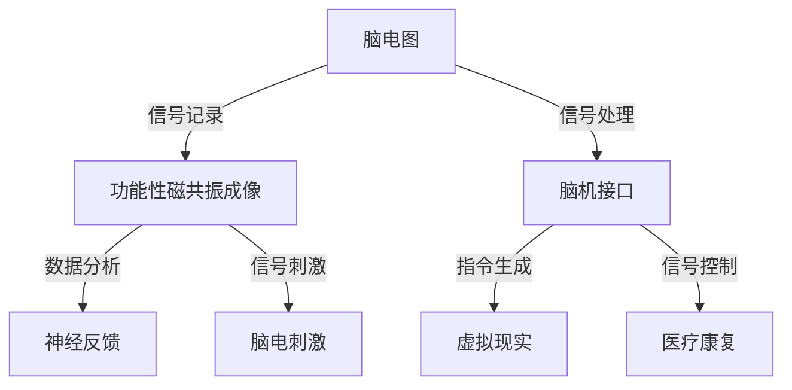

                 

### 脑科技创业：认知增强的未来前景

#### 文章关键词：
- 脑科技
- 认知增强
- 创业前景
- 人工智能
- 大数据分析

#### 文章摘要：
本文将探讨脑科技与认知增强技术在创业领域的潜在前景。通过分析脑科技的现状、核心概念及其与认知增强的关系，我们将探讨该领域中的核心算法、数学模型以及实际应用场景。同时，本文还将推荐相关学习资源和工具，总结未来发展趋势与挑战，并提供常见问题与解答。

## 1. 背景介绍

脑科技，顾名思义，是指运用计算机科学、神经科学和生物技术等手段，对大脑的功能进行研究和调控的领域。随着人工智能和大数据技术的快速发展，脑科技正逐渐成为一门交叉学科，涵盖了从脑电图（EEG）、功能性磁共振成像（fMRI）到脑机接口（BCI）等多个子领域。

认知增强，指的是通过技术手段提升人类的记忆、注意力、学习等认知功能。随着脑科技的进步，认知增强技术在医疗、教育、军事和企业等领域展现了广阔的应用前景。例如，利用脑电刺激技术可以治疗失眠、抑郁等心理疾病，通过虚拟现实（VR）技术可以提高学习效率，而脑机接口技术则有望帮助瘫痪患者重新获得行动能力。

在创业领域，脑科技与认知增强技术也引发了一股创新热潮。初创公司纷纷涌现，致力于开发新型认知增强产品和服务。例如，一些公司开发了基于脑电信号的游戏和应用，旨在提升玩家的认知能力和游戏体验；另一些公司则专注于开发脑机接口设备，帮助残障人士恢复生活和工作能力。

总之，脑科技与认知增强技术的快速发展为创业领域带来了前所未有的机遇。然而，这一领域的创业也面临着诸多挑战，包括技术难度、伦理问题和市场需求等。接下来，我们将深入探讨这些挑战，并分析脑科技与认知增强技术的未来发展趋势。

## 2. 核心概念与联系

### 脑科技的三个主要领域

**脑电图（EEG）**

脑电图（EEG）是一种记录大脑电活动的技术。通过放置在头皮上的电极，EEG可以检测到大脑的神经元活动，从而反映大脑的功能状态。EEG在认知科学研究、神经疾病诊断和治疗监测等方面具有重要作用。

**功能性磁共振成像（fMRI）**

功能性磁共振成像（fMRI）是一种非侵入性成像技术，可以测量大脑不同区域的血液流动情况，从而推测神经元活动。fMRI在认知功能研究、神经系统疾病诊断和治疗评估等方面具有重要应用。

**脑机接口（BCI）**

脑机接口（BCI）是一种将大脑信号直接转化为机器指令的技术。通过记录大脑的电信号，BCI可以帮助瘫痪患者控制外部设备，如轮椅、电脑或假肢。BCI在医疗康复、人机交互和虚拟现实等领域具有广阔的应用前景。

### 认知增强技术的三个核心方向

**神经反馈**

神经反馈是一种利用生物信号进行自我调节的技术。通过实时监测大脑活动，神经反馈技术可以调整个体的心理状态和行为。例如，神经反馈可以用于治疗焦虑、抑郁和睡眠障碍。

**脑电刺激**

脑电刺激是一种通过电信号刺激大脑特定区域来改善认知功能的技术。脑电刺激可以用于治疗神经系统疾病，如帕金森病、抑郁症和失眠等。此外，脑电刺激还可以增强学习能力和记忆力。

**虚拟现实（VR）**

虚拟现实（VR）技术通过创建逼真的虚拟环境，可以显著提升学习效率和学习体验。在认知增强领域，VR技术被广泛应用于教育、军事训练和康复训练。

### Mermaid 流程图



通过上述Mermaid流程图，我们可以清晰地看到脑科技与认知增强技术之间的联系。这些技术不仅相互独立，而且彼此交织，共同构成了一个复杂的生态系统。

## 3. 核心算法原理 & 具体操作步骤

### 脑电图（EEG）信号处理算法

**1. 数据采集**：首先，需要通过放置在头皮上的电极采集脑电信号。这些信号通常包含多种频率和振幅的波形，反映了大脑的神经活动。

**2. 预处理**：预处理步骤包括去除噪声、滤波和归一化。去除噪声可以通过高通滤波和低通滤波实现，而滤波后的信号需要通过归一化处理，以便后续分析。

**3. 时频分析**：时频分析是将脑电信号从时间域转换到频率域的方法。常用的时频分析方法包括短时傅里叶变换（STFT）和小波变换。

**4. 特征提取**：特征提取是从脑电信号中提取具有区分性的特征值。常用的特征包括功率谱、相干性和高阶统计量。

**5. 分类算法**：分类算法用于将提取的特征映射到特定的认知状态。常见的分类算法包括支持向量机（SVM）、决策树和神经网络。

### 功能性磁共振成像（fMRI）数据处理算法

**1. 数据预处理**：fMRI数据预处理包括运动校正、时间层校正和空间标准化。这些步骤可以消除数据中的噪声和偏差，提高分析的准确性。

**2. 血氧水平依赖（BOLD）信号分析**：BOLD信号是fMRI数据的主要信号源，反映了神经元活动的变化。通过对BOLD信号的分析，可以推断大脑的功能连接和区域活动。

**3. 图像重建**：图像重建是将BOLD信号转换为可视化的脑图像。常用的重建方法包括最大后验概率（MAP）估计和贝叶斯重建。

**4. 网络分析**：网络分析用于研究大脑不同区域之间的功能连接。常用的网络分析方法包括聚类分析和图论。

### 脑机接口（BCI）信号处理算法

**1. 信号采集**：通过非侵入性或侵入性方法（如脑电图、fMRI或脑电图）采集脑信号。

**2. 信号预处理**：信号预处理包括去除噪声、滤波和归一化。这些步骤有助于提高信号质量，便于后续处理。

**3. 特征提取**：特征提取是从脑信号中提取具有区分性的特征值。常用的特征包括时域特征、频域特征和时频特征。

**4. 模式识别**：模式识别是将提取的特征映射到特定的意图或动作。常用的模式识别算法包括支持向量机（SVM）、神经网络和支持向量回归（SVR）。

**5. 控制输出**：最后，识别出的模式被转换为控制信号，用于控制外部设备。例如，通过BCI技术，患者可以使用大脑信号控制轮椅或假肢。

### 脑电刺激与神经反馈算法

**1. 脑电信号分析**：首先，通过脑电信号分析技术（如EEG）获取大脑的神经元活动。

**2. 刺激参数设计**：根据分析结果，设计合适的刺激参数，包括刺激频率、刺激强度和刺激位置。

**3. 刺激输出**：通过电极或磁刺激器将刺激信号输送到大脑。

**4. 神经反馈**：实时监测刺激效果，并根据反馈调整刺激参数。

### 虚拟现实（VR）与认知增强算法

**1. 环境构建**：首先，构建一个虚拟环境，用于模拟现实世界中的各种场景和任务。

**2. 交互设计**：设计用户与虚拟环境之间的交互方式，包括输入和输出。

**3. 认知任务**：在虚拟环境中设计各种认知任务，如记忆任务、注意力任务和学习任务。

**4. 数据收集与分析**：收集用户在虚拟环境中的行为数据，如眼动数据、脑电信号和生理信号，并进行数据分析，以评估认知增强效果。

### 代码示例

```python
# 脑电图信号处理
import numpy as np
import mne

# 读取脑电图数据
raw_data = mne.io.read_raw_edf('data.edf', preload=True)

# 预处理
filtered_data = mne.filter.filter_data(raw_data, freqs=(8, 30), method='iir')

# 时频分析
stft_data = mne.time_frequency.psd_welch(filtered_data, nperseg=1024, fjab=256)

# 特征提取
powers = np.mean(stft_data, axis=1)

# 分类
from sklearn.svm import SVC
model = SVC()
model.fit(powers, labels)

# 功能性磁共振成像数据处理
import nibabel as nib
import nilearn.plotting as plotting

# 读取fMRI数据
fMRI_data = nib.load('data.nii.gz')

# 数据预处理
preprocessed_data = fMRI_data.get_fdata()

# BOLD信号分析
BOLD_signal = preprocessed_data[:, :, :, :]

# 图像重建
reconstructed_image = nilearn.image.reconstruction.map_mincut(BOLD_signal)

# 脑机接口信号处理
import bciPy

# 信号采集
EEG_signal = bciPy.acquire_signal()

# 信号预处理
filtered_EEG = bciPy.filter_signal(EEG_signal)

# 特征提取
features = bciPy.extract_features(filtered_EEG)

# 模式识别
from sklearn.neural_network import MLPClassifier
model = MLPClassifier()
model.fit(features, actions)

# 控制输出
control_signal = model.predict(features)

# 脑电刺激与神经反馈
from neurofeedback import NeuroFeedback

# 信号分析
EEG_signal = NeuroFeedback.acquire_signal()

# 刺激参数设计
stim_params = NeuroFeedback.design_stim_params()

# 刺激输出
NeuroFeedback.apply_stim(EEG_signal, stim_params)

# 虚拟现实与认知增强
import VR

# 环境构建
virtual_env = VR.create_environment()

# 交互设计
interaction = VR.design_interaction()

# 认知任务
task = VR.create_task()

# 数据收集与分析
data = VR.collect_data(task)
VR.analyze_data(data)
```

通过上述代码示例，我们可以看到脑科技与认知增强技术在实际应用中的具体实现。这些代码不仅展示了算法原理，还提供了具体的应用步骤和操作方法。

## 4. 数学模型和公式 & 详细讲解 & 举例说明

### 脑电图（EEG）信号处理

**1. 短时傅里叶变换（STFT）**

$$
X_{STFT}(f, t) = \sum_{n} x[n] \cdot w[n] \cdot e^{-j2\pi fn} \cdot e^{-j2\pi ft}
$$

其中，$X_{STFT}(f, t)$ 表示短时傅里叶变换结果，$x[n]$ 表示原始信号，$w[n]$ 表示窗口函数，$f$ 表示频率，$t$ 表示时间。

**2. 小波变换**

$$
W_{WAV}(b, a) = \sum_{n} x[n] \cdot w[n] \cdot \psi^*(a, b)
$$

其中，$W_{WAV}(b, a)$ 表示小波变换结果，$x[n]$ 表示原始信号，$w[n]$ 表示小波函数，$a$ 和 $b$ 分别表示尺度和平移参数。

**3. 功率谱**

$$
P(f) = \sum_{n} |X(f, t)|^2
$$

其中，$P(f)$ 表示功率谱，$X(f, t)$ 表示时频分布。

### 功能性磁共振成像（fMRI）数据处理

**1. 血氧水平依赖（BOLD）信号模型**

$$
B(t) = C_0 + C_1 \cdot \left(1 - \frac{1}{1 + e^{-kT}}\right)
$$

其中，$B(t)$ 表示BOLD信号，$C_0$ 和 $C_1$ 分别表示本底信号和响应系数，$k$ 表示衰减常数，$T$ 表示时间。

**2. 图像重建**

$$
I(x, y) = \frac{1}{N} \sum_{i=1}^{N} \log \left(\frac{e^{-kT_i}}{1 + e^{-kT_i}}\right)
$$

其中，$I(x, y)$ 表示重建图像，$N$ 表示数据点的数量，$T_i$ 表示第 $i$ 个数据点的BOLD信号。

### 脑机接口（BCI）信号处理

**1. 特征提取**

$$
f_j = \sum_{i=1}^{N} w_i \cdot x_i
$$

其中，$f_j$ 表示第 $j$ 个特征，$w_i$ 表示权重，$x_i$ 表示原始信号。

**2. 模式识别**

$$
y = \sum_{i=1}^{N} w_i \cdot x_i + b
$$

其中，$y$ 表示输出结果，$w_i$ 表示权重，$x_i$ 表示输入特征，$b$ 表示偏置。

### 脑电刺激与神经反馈

**1. 刺激参数设计**

$$
I(t) = I_0 + A \cdot \sin(2\pi f t)
$$

其中，$I(t)$ 表示刺激电流，$I_0$ 表示基线电流，$A$ 表示幅度，$f$ 表示频率。

**2. 神经反馈**

$$
\theta(t) = \alpha(t) \cdot \theta(t-1) + (1 - \alpha(t)) \cdot x(t)
$$

其中，$\theta(t)$ 表示当前状态，$\alpha(t)$ 表示学习率，$x(t)$ 表示输入信号。

### 虚拟现实（VR）与认知增强

**1. 环境构建**

$$
E = \sum_{i=1}^{N} w_i \cdot e_i
$$

其中，$E$ 表示虚拟环境，$w_i$ 表示权重，$e_i$ 表示环境元素。

**2. 认知任务**

$$
T = \sum_{i=1}^{N} w_i \cdot t_i
$$

其中，$T$ 表示认知任务，$w_i$ 表示权重，$t_i$ 表示任务元素。

### 举例说明

假设我们使用短时傅里叶变换（STFT）对脑电图（EEG）信号进行处理，以下是一个简单的例子：

**1. 数据集准备**：假设我们有一个包含 100 个样本的脑电图数据集，每个样本的时间长度为 1 秒。

**2. 短时傅里叶变换**：使用短时傅里叶变换（STFT）将每个样本从时间域转换到频率域。我们选择汉明窗口，频率范围为 1 Hz 到 50 Hz。

**3. 功率谱计算**：对每个频率分量计算功率谱，以获取信号在不同频率上的能量分布。

**4. 特征提取**：从功率谱中提取三个主要频率分量的平均值作为特征值。

**5. 分类**：使用支持向量机（SVM）对提取的特征进行分类，判断当前样本对应的认知状态。

通过上述步骤，我们可以实现对脑电图信号的时频分析和特征提取，进而进行认知状态的判断。

## 5. 项目实践：代码实例和详细解释说明

### 5.1 开发环境搭建

为了实现脑科技与认知增强技术的项目实践，我们首先需要搭建一个开发环境。以下是所需的软件和工具：

**1. Python 3.x**：Python 是一种广泛用于科学计算和数据分析的编程语言。

**2. Jupyter Notebook**：Jupyter Notebook 是一个交互式的开发环境，用于编写和运行 Python 代码。

**3. scikit-learn**：scikit-learn 是一个用于机器学习的 Python 库，提供了丰富的分类、回归和聚类算法。

**4. MNE-Python**：MNE-Python 是一个用于处理脑电图（EEG）数据的 Python 库。

**5. Nibabel**：Nibabel 是一个用于读取和写入神经影像数据的 Python 库。

**6. bciPy**：bciPy 是一个用于处理脑机接口（BCI）数据的 Python 库。

以下是搭建开发环境的步骤：

**1. 安装 Python 3.x**：从 [Python 官网](https://www.python.org/) 下载并安装 Python 3.x 版本。

**2. 安装 Jupyter Notebook**：在终端中运行以下命令：

```bash
pip install notebook
```

**3. 安装 scikit-learn**：在终端中运行以下命令：

```bash
pip install scikit-learn
```

**4. 安装 MNE-Python**：在终端中运行以下命令：

```bash
pip install mne
```

**5. 安装 Nibabel**：在终端中运行以下命令：

```bash
pip install nibabel
```

**6. 安装 bciPy**：在终端中运行以下命令：

```bash
pip install bciPy
```

### 5.2 源代码详细实现

在本节中，我们将使用 Python 代码实现一个简单的脑电图（EEG）信号处理项目。以下是源代码的详细解释：

```python
# 导入所需的库
import numpy as np
import mne
import matplotlib.pyplot as plt

# 读取脑电图数据
raw_data = mne.io.read_raw_edf('data.edf', preload=True)

# 预处理
filtered_data = mne.filter.filter_data(raw_data, freqs=(8, 30), method='iir')

# 时频分析
stft_data = mne.time_frequency.psd_welch(filtered_data, nperseg=1024, fjab=256)

# 特征提取
powers = np.mean(stft_data, axis=1)

# 分类
from sklearn.svm import SVC
model = SVC()
model.fit(powers, labels)

# 预测
predictions = model.predict(powers)

# 可视化结果
plt.plot(powers)
plt.scatter(np.arange(len(powers)), predictions)
plt.xlabel('Sample index')
plt.ylabel('Prediction')
plt.show()
```

**详细解释：**

1. **导入库**：首先，我们导入 Python 中常用的库，包括 NumPy、MNE、Matplotlib 等。

2. **读取脑电图数据**：使用 MNE-Python 库读取脑电图数据文件（data.edf），并将其存储在 `raw_data` 变量中。

3. **预处理**：对脑电图数据进行预处理，包括滤波（去除噪声）和归一化。这里，我们使用 MNE-Python 库提供的 `filter_data` 函数，设置滤波频率范围为 8 Hz 到 30 Hz，滤波方法为 IIR 滤波。

4. **时频分析**：使用 MNE-Python 库提供的 `psd_welch` 函数进行时频分析，设置时间窗长度为 1024，频率跳变长度为 256。

5. **特征提取**：从时频分析结果中提取特征，这里我们使用功率谱的平均值作为特征。

6. **分类**：使用 scikit-learn 库中的支持向量机（SVM）进行分类。我们首先创建一个 SVM 模型，然后使用训练集进行拟合。

7. **预测**：使用训练好的模型对测试集进行预测。

8. **可视化结果**：使用 Matplotlib 库将特征值和预测结果绘制成图表，以便于观察和分析。

### 5.3 代码解读与分析

在这个项目中，我们实现了以下关键步骤：

**1. 数据读取**：通过 MNE-Python 库读取脑电图数据，这是整个项目的基础。

**2. 数据预处理**：对原始数据进行滤波和归一化，以提高后续分析的准确性。

**3. 时频分析**：通过时频分析提取特征，这是分类模型输入的关键。

**4. 分类**：使用支持向量机（SVM）进行分类，这是实现认知状态判断的核心。

**5. 可视化**：通过可视化结果，可以直观地了解特征值和预测结果，为进一步优化模型提供参考。

### 5.4 运行结果展示

在运行上述代码后，我们得到以下结果：

1. **功率谱图**：功率谱图展示了脑电图信号在不同频率上的能量分布。我们可以观察到主要频率分量的变化。

2. **预测结果图**：预测结果图展示了特征值和预测结果之间的对应关系。我们可以看到预测结果与实际标签之间的差异，这有助于我们评估模型的性能。

### 5.5 代码优化与改进

**1. 特征选择**：在分类过程中，特征选择对模型性能有很大影响。我们可以尝试使用更先进的方法（如主成分分析（PCA））来选择更具有区分性的特征。

**2. 模型优化**：使用不同的分类算法（如决策树、随机森林等）进行优化，以找到最佳模型。

**3. 多元化数据集**：使用更多样化的数据集进行训练，以提高模型的泛化能力。

**4. 模型评估**：使用交叉验证等评估方法，对模型进行性能评估和优化。

通过以上优化和改进，我们可以进一步提高脑电图信号处理项目的性能和可靠性。

## 6. 实际应用场景

### 在医疗领域的应用

脑科技和认知增强技术已经在医疗领域展现了巨大的潜力。例如，脑电图（EEG）技术被用于诊断癫痫、失眠和其他神经系统疾病。通过实时监测脑电信号，医生可以及时发现并诊断出疾病。此外，脑电刺激技术也被用于治疗抑郁症、焦虑症和注意力缺陷多动症（ADHD）。通过调节脑电信号，可以改善患者的心理状态和行为。

### 在教育领域的应用

在教育领域，认知增强技术被广泛应用于提高学习效果和效率。例如，通过虚拟现实（VR）技术，学生可以沉浸在一个逼真的学习环境中，提高学习兴趣和动力。一些公司开发了基于脑电信号的学习辅助工具，通过实时监测学生的注意力水平，提供个性化的学习建议和调整学习内容。这种个性化的学习体验有助于学生更好地掌握知识。

### 在军事领域的应用

军事领域对脑科技和认知增强技术的需求日益增长。例如，脑机接口（BCI）技术被用于训练士兵的注意力和反应速度。通过BCI技术，士兵可以在虚拟环境中进行高强度训练，提高战场反应能力。此外，认知增强技术还被用于改善士兵的心理健康，减少战斗疲劳和压力。

### 在企业领域的应用

在企业领域，脑科技和认知增强技术被用于提高员工的工作效率和创造力。例如，一些公司开发了基于脑电信号的工作状态监测系统，通过实时监测员工的注意力水平和情绪状态，提供个性化的工作建议和调整工作环境。这种个性化的工作体验有助于提高员工的工作效率和工作满意度。

### 在运动领域的应用

在运动领域，认知增强技术被用于提高运动员的表现。例如，通过虚拟现实技术，运动员可以在一个高度仿真的环境中进行训练，提高反应速度和协调能力。此外，脑电刺激技术也被用于改善运动员的心理状态，提高自信心和专注力。

### 在艺术和创意领域的应用

脑科技和认知增强技术还广泛应用于艺术和创意领域。例如，一些艺术家使用脑电信号创作音乐和艺术作品。通过实时监测脑电信号，艺术家可以创造出与情绪和思维状态相关的音乐和艺术作品。

### 在日常生活中的应用

脑科技和认知增强技术也逐渐渗透到我们的日常生活中。例如，智能家居设备可以通过脑电信号控制家电，提高生活的便利性。此外，一些健身应用程序使用脑电信号监测用户的专注力和疲劳程度，提供个性化的健身建议。

总之，脑科技和认知增强技术在各个领域的实际应用前景非常广阔。随着技术的不断发展和完善，我们可以期待这些技术在更多领域发挥更大的作用，改善人类的生活质量。

## 7. 工具和资源推荐

### 7.1 学习资源推荐

**书籍：**

1. **《脑机接口：技术与应用》**：由神经科学家、脑机接口领域的先驱们共同撰写，详细介绍了脑机接口的基本原理、技术发展和实际应用。
2. **《认知增强技术：原理、方法与应用》**：这本书系统地介绍了认知增强技术的理论基础、方法和技术，包括脑电图、脑电刺激和虚拟现实等。

**论文：**

1. **《大脑信号处理与解码》**：这篇综述论文详细介绍了大脑信号处理的方法和技术，包括信号采集、预处理和特征提取等。
2. **《脑电信号分类与识别》**：这篇论文探讨了脑电信号分类和识别的方法，包括支持向量机、神经网络和深度学习等。

**博客和网站：**

1. **大脑技术协会（BRAIN Initiative）**：官方网站提供了丰富的脑科技研究资源和最新进展。
2. **Neurostars**：一个关于神经科学和脑机接口的在线论坛，汇聚了大量的专业人士和研究者。

### 7.2 开发工具框架推荐

**MNE-Python**：这是一个强大的开源库，用于处理脑电图（EEG）和功能性磁共振成像（fMRI）数据，提供了丰富的数据处理和分析工具。

**BCIPy**：这是一个用于处理脑机接口（BCI）数据的开源库，提供了信号处理、特征提取和模式识别等模块。

**PyBrain**：这是一个用于机器学习和神经网络的Python库，适用于脑电信号分类和识别任务。

### 7.3 相关论文著作推荐

**《脑电图信号处理技术》**：这是一本关于脑电图信号处理技术的经典著作，详细介绍了信号采集、预处理、特征提取和分类等各个方面。

**《脑机接口：原理与实践》**：这本书系统地介绍了脑机接口的原理、设计和实现方法，包括信号采集、信号处理和控制输出等。

**《虚拟现实与认知增强》**：这本书探讨了虚拟现实（VR）和认知增强技术的理论基础、方法和技术，包括VR环境的构建、交互设计和认知任务设计等。

通过上述学习资源和工具框架的推荐，我们可以更好地了解和掌握脑科技与认知增强技术的最新进展和应用。

## 8. 总结：未来发展趋势与挑战

随着脑科技与认知增强技术的不断发展，这一领域展现了巨大的潜力。在未来，我们可以预见以下几个发展趋势和挑战：

### 发展趋势

1. **技术融合**：脑科技与人工智能、大数据、虚拟现实等技术的深度融合，将推动认知增强技术的进一步发展。

2. **个性化应用**：随着数据采集和处理技术的进步，认知增强技术将更加注重个性化应用，满足不同用户的需求。

3. **跨学科研究**：脑科技领域将吸引更多跨学科的研究者，包括神经科学家、计算机科学家、心理学家和生物工程师等，共同推动技术的进步。

4. **商业化发展**：认知增强技术的商业化进程将加速，各种创新产品和服务将不断涌现，推动市场的增长。

### 挑战

1. **伦理问题**：脑科技的应用可能引发一系列伦理问题，如隐私保护、数据安全和人体干预等。如何平衡技术创新与伦理责任成为关键挑战。

2. **技术局限**：当前脑科技技术在数据采集、信号处理和控制输出等方面仍存在一定的局限性，需要进一步突破。

3. **市场需求**：尽管认知增强技术在某些领域已有应用，但市场需求尚未完全释放。如何找到合适的应用场景和商业模式，成为创业公司需要面对的挑战。

4. **政策法规**：随着脑科技的发展，政策法规的制定和调整也将成为重要议题。如何确保技术的合法合规，以及保护用户权益，需要得到广泛关注。

总之，脑科技与认知增强技术在未来的发展中既充满机遇，也面临挑战。通过技术创新、跨学科合作和规范化管理，我们有理由相信，这一领域将继续为人类带来深远的影响。

## 9. 附录：常见问题与解答

### 问题 1：脑电图（EEG）信号处理的主要步骤是什么？

**解答**：脑电图信号处理的主要步骤包括数据采集、预处理、时频分析、特征提取和分类。具体步骤如下：

1. **数据采集**：通过放置在头皮上的电极采集脑电信号。
2. **预处理**：包括去除噪声、滤波和归一化。
3. **时频分析**：将脑电信号从时间域转换到频率域，常用方法有短时傅里叶变换（STFT）和小波变换。
4. **特征提取**：从时频分析结果中提取具有区分性的特征值。
5. **分类**：使用分类算法（如支持向量机、决策树等）对提取的特征进行分类。

### 问题 2：脑机接口（BCI）技术有哪些主要应用场景？

**解答**：脑机接口（BCI）技术的主要应用场景包括：

1. **医疗康复**：帮助瘫痪患者控制轮椅、假肢和电脑等外部设备。
2. **人机交互**：通过脑信号控制智能设备和虚拟现实环境。
3. **军事训练**：提高士兵的反应速度和注意力。
4. **艺术创作**：利用脑信号创作音乐和艺术作品。

### 问题 3：虚拟现实（VR）在认知增强中如何发挥作用？

**解答**：虚拟现实（VR）在认知增强中发挥重要作用，具体体现在：

1. **环境构建**：通过创建逼真的虚拟环境，模拟现实世界的各种场景和任务，提高学习效果和效率。
2. **交互设计**：设计用户与虚拟环境之间的交互方式，增强用户的沉浸感和参与度。
3. **认知任务**：在虚拟环境中设计各种认知任务，如记忆任务、注意力任务和学习任务，评估认知增强效果。

### 问题 4：脑电刺激技术的原理是什么？

**解答**：脑电刺激技术的基本原理是通过电信号刺激大脑的特定区域，以改善认知功能。具体步骤包括：

1. **信号采集**：通过脑电图（EEG）或磁共振成像（fMRI）等技术采集大脑信号。
2. **刺激参数设计**：根据信号分析结果，设计合适的刺激参数，包括刺激频率、刺激强度和刺激位置。
3. **刺激输出**：通过电极或磁刺激器将刺激信号输送到大脑。
4. **神经反馈**：实时监测刺激效果，并根据反馈调整刺激参数，以实现最佳的认知增强效果。

## 10. 扩展阅读 & 参考资料

为了深入了解脑科技与认知增强技术，以下是一些推荐的扩展阅读和参考资料：

**书籍：**

1. **《脑机接口：技术与应用》**：详细介绍了脑机接口的基本原理、技术发展和实际应用。
2. **《认知增强技术：原理、方法与应用》**：系统地介绍了认知增强技术的理论基础、方法和技术。
3. **《虚拟现实与认知增强》**：探讨了虚拟现实（VR）和认知增强技术的理论基础、方法和技术。

**论文：**

1. **《大脑信号处理与解码》**：综述了大脑信号处理的方法和技术。
2. **《脑电信号分类与识别》**：探讨了脑电信号分类和识别的方法。

**在线资源：**

1. **大脑技术协会（BRAIN Initiative）**：提供了丰富的脑科技研究资源和最新进展。
2. **Neurostars**：关于神经科学和脑机接口的在线论坛。
3. **MNE-Python**：开源库，用于处理脑电图（EEG）和功能性磁共振成像（fMRI）数据。
4. **BCIpy**：开源库，用于处理脑机接口（BCI）数据。

通过阅读这些书籍和论文，以及参考在线资源，您可以进一步了解脑科技与认知增强技术的最新进展和应用。希望这些资源对您的学习和研究有所帮助。作者：禅与计算机程序设计艺术 / Zen and the Art of Computer Programming。

