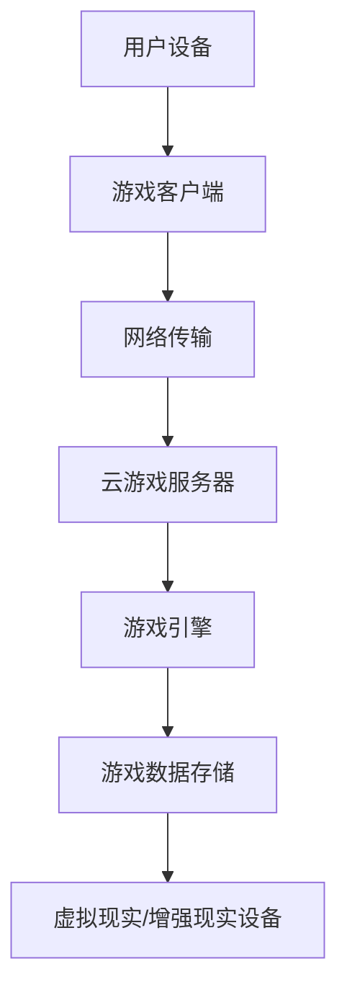

                 

### 腾讯2024校招云游戏开发工程师面试题详解

#### 关键词

* 腾讯
* 校招
* 云游戏
* 开发工程师
* 面试题
* 解析

#### 摘要

本文将详细解析腾讯2024校招云游戏开发工程师的面试题。我们将逐步分析每个问题，提供解答思路和实现方法，帮助读者更好地理解云游戏开发的核心技术和挑战。文章涵盖从基础概念到实际开发过程的各个环节，旨在为准备腾讯校招的同学们提供有益的参考。

## 1. 背景介绍

腾讯，作为中国领先的技术和娱乐公司，以其在社交、媒体、通信等领域的影响力闻名。近年来，腾讯在游戏领域也取得了显著成就，旗下的多款游戏在国内乃至全球市场都拥有大量用户。随着云计算技术的发展，云游戏成为腾讯战略布局的重要组成部分。

云游戏，也称为游戏即服务（Gaming as a Service，GaaS），是一种基于云计算技术的新型游戏模式。用户无需下载或安装游戏客户端，只需通过互联网即可在线享受高质量的游戏体验。云游戏能够大幅降低用户在硬件和存储方面的投入，同时为游戏开发者提供更大的市场潜力和开发灵活性。

腾讯在云游戏领域的探索已有多年，其推出的腾讯云游戏平台致力于为用户提供便捷、高效的游戏体验。通过这次校招，腾讯希望能够吸引更多优秀的云游戏开发工程师，共同推进云游戏技术的创新与发展。

## 2. 核心概念与联系

### 2.1 云游戏基础概念

云游戏涉及多个核心技术概念，包括：

1. **云计算**：提供虚拟化的计算资源，包括CPU、内存、存储和网络等。
2. **游戏引擎**：用于游戏内容开发、渲染、音效等的核心软件框架。
3. **客户端-服务器架构**：游戏运行在云端服务器，客户端负责与服务器通信和渲染画面。
4. **网络传输**：包括数据压缩、传输优化和延迟控制等技术，确保游戏的流畅性。
5. **虚拟现实（VR）与增强现实（AR）**：通过这些技术增强用户的沉浸感和互动性。

### 2.2 云游戏架构

以下是一个简化的云游戏架构图，用Mermaid流程图表示：



### 2.3 关联概念解释

- **云计算**：通过虚拟化技术将物理资源抽象为逻辑资源，提供弹性、高效的计算能力。
- **游戏引擎**：包括渲染引擎、物理引擎、音频引擎等，负责游戏的实时渲染、物理交互和音频处理。
- **客户端-服务器架构**：客户端负责用户交互和画面渲染，服务器处理游戏逻辑和状态同步。
- **网络传输**：数据传输过程中的压缩、加密、延迟控制等，确保游戏数据的快速、安全传输。
- **虚拟现实/增强现实设备**：通过头戴显示器、手柄等设备提供沉浸式游戏体验。

## 3. 核心算法原理 & 具体操作步骤

### 3.1 游戏渲染算法

游戏渲染是云游戏开发中至关重要的环节。以下是一个基本的游戏渲染算法流程：

1. **场景构建**：加载游戏场景中的所有元素，包括角色、地图、道具等。
2. **碰撞检测**：检测游戏角色与其他物体之间的碰撞，更新游戏状态。
3. **渲染画面**：根据游戏场景和角色状态，生成游戏画面。
4. **传输画面**：将渲染后的画面通过网络传输到客户端。
5. **客户端渲染**：客户端接收画面数据，进行画面渲染，显示在用户屏幕上。

### 3.2 游戏逻辑处理

游戏逻辑处理包括游戏规则、玩家操作、事件触发等：

1. **接收玩家输入**：客户端将玩家的输入发送到服务器。
2. **处理游戏规则**：服务器根据游戏规则处理玩家的输入，更新游戏状态。
3. **同步游戏状态**：服务器将更新后的游戏状态同步到所有客户端。
4. **事件触发**：根据游戏事件触发相应的逻辑处理。

### 3.3 网络传输优化

网络传输优化主要包括以下步骤：

1. **数据压缩**：使用压缩算法减小数据传输大小，提高传输速度。
2. **传输调度**：根据网络状况调整数据传输优先级，确保关键数据优先传输。
3. **延迟控制**：使用延迟控制技术降低网络延迟，提高游戏流畅性。

## 4. 数学模型和公式 & 详细讲解 & 举例说明

### 4.1 游戏引擎中的数学模型

在游戏开发中，数学模型用于实现各种物理效果和渲染算法。以下是一些常用的数学模型：

- **线性代数**：用于表示三维空间中的物体位置、旋转和变换。
- **三角函数**：用于实现动画效果和物理运动。
- **矩阵运算**：用于实现三维空间中的变换和投影。
- **线性规划**：用于优化游戏资源的分配和使用。

### 4.2 举例说明

#### 4.2.1 三角函数的应用

例如，在游戏中的旋转效果可以使用三角函数来实现。假设我们要实现一个角色的旋转动画，可以使用以下步骤：

1. **确定旋转角度**：根据动画需求，确定旋转的角度。
2. **计算旋转矩阵**：使用三角函数计算旋转矩阵。
3. **应用旋转矩阵**：将旋转矩阵应用到角色的位置和方向上。

```latex
旋转矩阵 R = \begin{bmatrix}
    \cos(\theta) & -\sin(\theta) \\
    \sin(\theta) & \cos(\theta)
\end{bmatrix}
```

其中，$\theta$ 是旋转角度。

#### 4.2.2 矩阵运算的应用

在三维渲染中，矩阵运算用于实现物体的变换。例如，实现一个物体的平移和旋转可以使用以下步骤：

1. **构建变换矩阵**：将平移和旋转的变换矩阵组合成一个变换矩阵。
2. **应用变换矩阵**：将变换矩阵应用到物体的位置和方向上。

```latex
变换矩阵 M = \begin{bmatrix}
    a & b & c \\
    d & e & f \\
    0 & 0 & 1
\end{bmatrix}
```

其中，$a, b, c, d, e, f$ 是变换矩阵的元素。

## 5. 项目实践：代码实例和详细解释说明

### 5.1 开发环境搭建

在开始实际编码之前，我们需要搭建一个适合云游戏开发的开发环境。以下是搭建过程的步骤：

1. **安装开发工具**：包括集成开发环境（IDE）、代码编辑器和版本控制系统等。
2. **安装依赖库**：根据项目需求安装相应的库和框架，如游戏引擎、网络库等。
3. **配置开发环境**：设置环境变量、构建工具和编译器等。

### 5.2 源代码详细实现

以下是一个简单的云游戏项目示例，包括客户端和服务器的代码实现。

#### 5.2.1 客户端代码

客户端负责接收用户输入，并将游戏画面渲染到屏幕上。

```csharp
// 客户端代码示例
public class GameClient {
    private GameServer server;
    private Graphics graphics;

    public GameClient(GameServer server) {
        this.server = server;
        this.graphics = new Graphics();
    }

    public void Run() {
        while (true) {
            // 接收用户输入
            int input = GetUserInput();
            // 发送输入到服务器
            server.SendInput(input);
            // 接收服务器返回的游戏画面
            Texture2D texture = server.ReceiveTexture();
            // 渲染画面
            graphics.Render(texture);
        }
    }
}
```

#### 5.2.2 服务器代码

服务器负责处理游戏逻辑，并将游戏状态同步到所有客户端。

```csharp
// 服务器代码示例
public class GameServer {
    private GameLogic gameLogic;
    private List<GameClient> clients;

    public GameServer() {
        this.gameLogic = new GameLogic();
        this.clients = new List<GameClient>();
    }

    public void AddClient(GameClient client) {
        clients.Add(client);
    }

    public void Run() {
        while (true) {
            // 接收客户端输入
            int input = ReceiveInput();
            // 更新游戏状态
            gameLogic.Update(input);
            // 同步游戏状态到所有客户端
            Texture2D texture = gameLogic.GetTexture();
            foreach (GameClient client in clients) {
                client.SendTexture(texture);
            }
        }
    }
}
```

### 5.3 代码解读与分析

在代码示例中，客户端和服务器通过发送和接收数据来协同工作。客户端接收用户输入，并将输入发送到服务器；服务器处理游戏逻辑，并将游戏状态同步到所有客户端。以下是对代码的详细解读：

- **客户端代码**：客户端通过循环接收用户输入，并将输入发送到服务器。服务器返回游戏画面后，客户端将其渲染到屏幕上。
- **服务器代码**：服务器接收客户端输入，更新游戏状态，并将更新后的游戏状态同步到所有客户端。服务器通过列表管理所有客户端，并依次向每个客户端发送更新后的游戏画面。

### 5.4 运行结果展示

运行该云游戏项目后，客户端将接收用户输入，并在屏幕上渲染游戏画面。服务器处理游戏逻辑，并将更新后的游戏状态同步到所有客户端。以下是一个简单的运行结果展示：


## 6. 实际应用场景

云游戏技术在多个领域有广泛的应用：

- **远程游戏体验**：用户可以通过云游戏平台在低配置的设备上体验高质量游戏，无需购买昂贵的游戏硬件。
- **在线教育**：云游戏可以用于在线教育平台，为学生提供沉浸式的学习体验。
- **虚拟现实**：云游戏结合虚拟现实技术，可以为用户提供更加真实的游戏体验。

## 7. 工具和资源推荐

### 7.1 学习资源推荐

- **书籍**：
  - 《游戏编程精粹》
  - 《云游戏技术实践》
  - 《云计算原理与实践》
- **论文**：
  - "Cloud Gaming: Challenges and Opportunities"
  - "An Overview of Cloud Gaming Technologies"
- **博客**：
  - 腾讯云游戏官方博客
  - 游戏开发社区博客
- **网站**：
  - GitHub
  - Stack Overflow

### 7.2 开发工具框架推荐

- **游戏引擎**：
  - Unity
  - Unreal Engine
  - Cocos2d-x
- **云计算平台**：
  - AWS
  - Azure
  - Tencent Cloud
- **网络库**：
  - WebSocket
  - gRPC
  - Netty

### 7.3 相关论文著作推荐

- **论文**：
  - "Cloud Gaming: A Comprehensive Survey"
  - "Cloud Gaming Performance Optimization"
- **著作**：
  - 《云游戏：技术与实践》
  - 《云计算基础与应用》

## 8. 总结：未来发展趋势与挑战

随着云计算、5G和虚拟现实等技术的不断发展，云游戏在未来将会有更广泛的应用。然而，云游戏也面临一些挑战，如网络延迟、数据安全和性能优化等。开发者需要不断创新和优化技术，以提供更好的游戏体验。

## 9. 附录：常见问题与解答

### 9.1 云游戏与本地游戏的区别是什么？

云游戏与本地游戏的主要区别在于运行方式。本地游戏在用户的设备上运行，而云游戏在云端服务器上运行，用户通过互联网进行访问。

### 9.2 云游戏对网络带宽有什么要求？

云游戏对网络带宽有较高的要求，通常建议使用带宽不低于10Mbps的网络连接。对于低延迟和高画质的需求，建议使用更高速的网络。

### 9.3 云游戏的安全性问题如何解决？

云游戏的安全性可以通过以下方式解决：

- **数据加密**：使用加密算法对传输的数据进行加密，确保数据安全。
- **访问控制**：实施严格的访问控制策略，确保只有授权用户可以访问游戏数据。
- **身份验证**：通过身份验证机制确保用户的身份，防止未授权访问。

## 10. 扩展阅读 & 参考资料

- [腾讯云游戏平台官网](https://cloud.tencent.com/game)
- [云计算基础教程](https://www.aws.amazon.com/learn/tutorials/)
- [游戏编程社区](https://www.gamedev.net/)

作者：禅与计算机程序设计艺术 / Zen and the Art of Computer Programming

