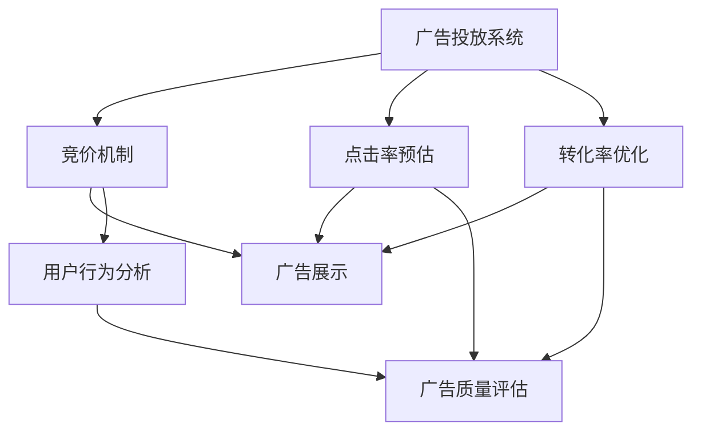

                 

### 1. 背景介绍

腾讯广告社招面试真题汇总及其解答，是为了帮助准备参加腾讯广告部门面试的应聘者更好地了解面试的内容和形式。腾讯作为中国领先的互联网科技公司，其广告部门在广告投放、数据分析、用户增长等方面有着丰富的实践经验和深厚的理论基础。面试题的设定往往涵盖了广告业务的核心技术、最新趋势、以及应聘者的综合素质等方面。

本文旨在通过系统地总结和分析腾讯广告社招面试中的常见真题，为应聘者提供一份全面的备考指南。这不仅包括对各类面试题的详细解答，还涵盖了对广告业务基础概念、关键技术以及实践应用的深入探讨。

首先，我们需要了解腾讯广告部门对面试者提出的常见要求。一般来说，应聘者需要具备以下几方面的能力：

1. **技术能力**：熟悉广告系统的基础架构，了解广告投放的核心技术和算法，如竞价机制、点击率预估、转化率优化等。
2. **业务理解**：对互联网广告行业的发展趋势、市场需求、用户行为等有深入的理解，能够结合具体业务场景进行分析和解决方案的提出。
3. **数据分析和处理能力**：能够使用统计学和机器学习等方法对大规模广告数据进行分析，提取有效信息，指导广告优化和投放策略。
4. **沟通和协作能力**：能够与团队成员有效沟通，协作完成项目任务，具备良好的团队合作精神和问题解决能力。

本文将围绕上述几个方面，详细解析腾讯广告社招面试中可能出现的各类真题，帮助应聘者全面提升面试准备，从而在面试中脱颖而出。

### 2. 核心概念与联系

在深入探讨腾讯广告社招面试真题之前，我们需要了解一些核心概念和它们之间的联系。以下是一个使用Mermaid绘制的流程图，展示了广告业务中几个关键概念及其相互作用：



- **广告投放系统**：这是广告业务的核心，负责管理广告的投放流程，包括广告位申请、竞价、投放控制、效果监测等。
- **竞价机制**：广告主通过竞价机制竞标广告展示位置，竞价机制决定了广告的展示顺序和频率。
- **点击率预估**：通过历史数据和机器学习算法，预估广告被点击的概率，用于优化广告投放策略。
- **转化率优化**：基于用户行为数据和转化率预测模型，调整广告内容和投放策略，以提高用户转化率。
- **广告展示**：广告在实际用户面前展示的过程，涉及广告格式、展示位置、展示时机等多个方面。
- **用户行为分析**：分析用户在广告页面上的行为，如点击、浏览时间、操作路径等，用于优化广告效果。
- **广告质量评估**：评估广告内容的质量，包括创意、内容相关性等，确保广告的合规性和有效性。

这些核心概念共同构成了广告投放和优化过程中不可或缺的一部分，它们相互关联、相互影响，形成一个复杂的系统。下面我们将详细讨论这些概念的相关面试题及其解答。

#### 2.1. 广告投放系统

**面试题：请简述广告投放系统的工作流程。**

**解答：**

广告投放系统的工作流程主要包括以下几个阶段：

1. **广告位申请**：广告主提交广告位申请，包括广告位ID、广告位类型、预期投放范围等信息。
2. **广告素材上传**：广告主上传广告素材，包括图片、视频、文案等，并设置广告投放的预算和出价策略。
3. **竞价机制**：系统根据广告主的出价、广告质量和实时竞价算法，决定广告的展示顺序和频率。
4. **广告展示**：根据竞价结果，将广告展示给目标用户，包括展示位置、展示格式和展示时机等。
5. **效果监测**：监测广告的展示次数、点击率、转化率等指标，用于评估广告效果和优化投放策略。

**面试题：请描述一下广告投放系统中的竞价算法。**

**解答：**

广告投放系统中的竞价算法主要包括以下几个步骤：

1. **出价计算**：系统根据广告主的出价策略、广告质量和竞价目标，计算出每个广告的出价。
2. **排序**：将所有参与竞价的广告根据出价从高到低排序，出价最高的广告排在最前面。
3. **展示概率计算**：根据广告的排序结果和用户的属性，计算每个广告的展示概率。
4. **展示决策**：系统根据展示概率和用户行为，决定最终展示哪条广告。

常见的竞价算法包括Gaussian Distribution、点击率预估、转化率预估等，它们在广告投放系统中发挥着重要作用。

#### 2.2. 点击率预估

**面试题：请解释点击率预估的作用及其在广告投放中的应用。**

**解答：**

点击率预估（Click-Through Rate, CTR）是广告投放系统中的一项关键技术，其作用包括：

1. **优化广告展示策略**：通过预估广告的点击率，系统能够选择更可能被用户点击的广告进行展示，从而提高广告效果。
2. **分配广告预算**：广告主可以根据点击率预估结果，调整广告投放的预算和出价策略，提高预算利用效率。
3. **评估广告质量**：点击率预估结果可以作为评估广告质量的一个指标，帮助广告主和广告平台识别和优化低效广告。

点击率预估在广告投放中的应用主要体现在以下几个方面：

1. **实时竞价**：在实时竞价（Real-Time Bidding, RTB）中，点击率预估是决定广告展示顺序和频率的关键因素。
2. **广告推荐**：在广告推荐系统中，点击率预估用于选择用户最可能感兴趣的广告进行推荐。
3. **广告优化**：广告主可以根据点击率预估结果，调整广告内容和投放策略，提高广告的点击率和转化率。

#### 2.3. 转化率优化

**面试题：请阐述转化率优化在广告投放中的重要性及其实现方法。**

**解答：**

转化率优化（Conversion Rate Optimization, CRO）是广告投放中至关重要的一环，其重要性体现在以下几个方面：

1. **提高广告效果**：通过优化广告内容和投放策略，提高用户的转化率，从而实现广告主的目标，如产品销售、用户注册等。
2. **提升投资回报率**：提高转化率意味着更少的广告投入能带来更多的实际收益，提升广告投资回报率。
3. **增强用户满意度**：优化广告内容和体验，能够提升用户的满意度和忠诚度，为广告主建立良好的品牌形象。

实现转化率优化的方法主要包括：

1. **A/B测试**：通过对比不同广告内容和投放策略的转化效果，找到最优方案。
2. **用户行为分析**：分析用户在广告页面上的行为数据，识别用户痛点和需求，从而优化广告内容和用户体验。
3. **数据驱动决策**：利用数据分析和机器学习技术，根据用户行为数据实时调整广告内容和投放策略。
4. **个性化推荐**：根据用户兴趣和行为，个性化推荐最符合用户需求的广告，提高转化率。

通过上述核心概念和联系的分析，我们可以更好地理解腾讯广告社招面试中的相关真题，为接下来的详细解答打下基础。

### 3. 核心算法原理 & 具体操作步骤

在广告投放和优化过程中，核心算法的作用至关重要。下面我们将详细介绍几种常见的核心算法原理，包括其数学模型、公式和具体操作步骤。

#### 3.1. 实时竞价算法

实时竞价（Real-Time Bidding, RTB）是广告投放系统中的一种关键机制，通过竞价算法实时决定广告的展示顺序和频率。以下是常见的实时竞价算法之一：Gaussian Distribution算法。

**3.1.1. 算法原理**

Gaussian Distribution算法基于高斯分布（正态分布）原理，计算每个广告的展示概率。算法的核心公式为：

$$ P(ad_i | user) = \frac{e^{-\frac{(q_i - q_0)^2}{2\sigma^2}}}{\sum_{j=1}^{N} e^{-\frac{(q_j - q_0)^2}{2\sigma^2}}} $$

其中：
- \( P(ad_i | user) \) 表示广告 \( ad_i \) 被用户展示的概率。
- \( q_i \) 表示广告 \( ad_i \) 的质量分数。
- \( q_0 \) 表示用户的平均质量分数。
- \( \sigma \) 表示高斯分布的标准差。
- \( N \) 表示参与竞价的广告总数。

**3.1.2. 具体操作步骤**

1. **收集广告质量分数**：系统收集每个广告的质量分数 \( q_i \)，并将其存储在数据库中。
2. **计算用户平均质量分数**：根据历史数据，计算用户 \( q_0 \) 的平均质量分数。
3. **设置高斯分布标准差**：根据广告业务需求，设置高斯分布的标准差 \( \sigma \)。
4. **计算展示概率**：使用上述公式计算每个广告的展示概率 \( P(ad_i | user) \)。
5. **决策广告展示**：根据展示概率，选择展示概率最高的广告。

**面试题：请解释Gaussian Distribution算法中的参数如何影响展示概率。**

**解答：**

在Gaussian Distribution算法中，参数 \( \sigma \) 的影响如下：

- **增加 \( \sigma \)**：增加标准差 \( \sigma \) 将导致广告的展示概率分布变得更加分散，高质广告和低质广告的展示概率差异减小。
- **减少 \( \sigma \)**：减少标准差 \( \sigma \) 将导致广告的展示概率分布更加集中，高质广告的展示概率显著高于低质广告。

这种参数调整可以根据广告业务的需求进行，以实现广告展示的公平性和效果优化。

#### 3.2. 点击率预估算法

点击率预估（Click-Through Rate, CTR）是广告优化中的重要环节，常见算法包括逻辑回归（Logistic Regression）和决策树（Decision Tree）等。

**3.2.1. 算法原理**

逻辑回归是一种广义线性模型，用于预测概率。点击率预估的逻辑回归模型公式为：

$$ \hat{CTR}(ad_i | user) = \frac{1}{1 + e^{-(w_0 + \sum_{j=1}^{n} w_j x_{ij})}} $$

其中：
- \( \hat{CTR}(ad_i | user) \) 表示广告 \( ad_i \) 被用户点击的概率。
- \( w_0 \) 是模型偏置。
- \( w_j \) 是特征权重。
- \( x_{ij} \) 是特征 \( j \) 对广告 \( ad_i \) 的影响值。

**3.2.2. 具体操作步骤**

1. **数据收集**：收集广告展示和用户行为数据，包括广告特征、用户特征和点击事件等。
2. **特征工程**：提取和构造相关特征，如广告类型、用户年龄、设备类型、广告展示时间等。
3. **数据预处理**：对数据进行归一化、缺失值填补等预处理操作。
4. **模型训练**：使用训练数据，利用逻辑回归算法训练模型，得到特征权重。
5. **预测点击率**：使用训练好的模型，对新的广告展示数据进行点击率预估。

**面试题：请简述逻辑回归模型在点击率预估中的应用及其优缺点。**

**解答：**

逻辑回归模型在点击率预估中的应用如下：

- **优点**：
  - **简单易实现**：逻辑回归模型相对简单，易于理解和实现。
  - **计算效率高**：逻辑回归的运算效率较高，适用于大规模数据处理。

- **缺点**：
  - **过拟合风险**：逻辑回归模型容易过拟合，特别是在特征数量较多的情况下。
  - **模型解释性较弱**：逻辑回归模型对特征权重进行加权和，难以解释每个特征的直接作用。

#### 3.3. 转化率优化算法

转化率优化（Conversion Rate Optimization, CRO）是广告投放中的重要目标，常见算法包括基于转化率的在线优化算法和离线评估算法。

**3.3.1. 算法原理**

基于转化率的在线优化算法主要通过在线学习技术，实时调整广告投放策略，以提高转化率。一种常见的算法是基于梯度下降法的在线优化算法。

$$ \Delta w_j = \eta \frac{\partial L(w)}{\partial w_j} $$

其中：
- \( \Delta w_j \) 是特征 \( j \) 的权重更新。
- \( \eta \) 是学习率。
- \( L(w) \) 是转化率损失函数。

**3.3.2. 具体操作步骤**

1. **定义损失函数**：根据转化率目标，定义损失函数，如负梯度损失函数。
2. **初始化权重**：随机初始化模型权重。
3. **在线学习**：根据用户反馈和实时数据，使用梯度下降法更新模型权重。
4. **策略调整**：根据更新后的权重，调整广告投放策略。

**面试题：请解释在线优化算法在转化率优化中的作用及其挑战。**

**解答：**

在线优化算法在转化率优化中的作用如下：

- **实时调整**：在线优化算法能够根据用户实时反馈，动态调整广告投放策略，从而快速响应市场变化。
- **提高效率**：通过实时调整，优化算法能够在较短时间内达到较高的转化率。

挑战包括：

- **数据噪声**：在线数据可能包含噪声和异常值，需要有效的数据清洗和异常值处理方法。
- **模型稳定性**：在线优化算法需要确保模型稳定性，避免由于数据波动导致的模型不稳定。

通过上述核心算法的介绍，我们可以更好地理解广告投放和优化的关键技术，为面试中的相关问题提供有力支持。

### 4. 数学模型和公式 & 详细讲解 & 举例说明

在广告投放和优化过程中，数学模型和公式起着至关重要的作用。以下将详细介绍几个关键数学模型和公式，并结合具体例子进行说明。

#### 4.1. 点击率预估模型

点击率预估（CTR）是广告优化中的一个核心任务，常见的数学模型包括逻辑回归模型和决策树模型。以下是逻辑回归模型的基本公式及其解释。

**4.1.1. 逻辑回归模型**

逻辑回归模型是一种广义线性模型，用于预测广告的点击概率。其公式如下：

$$ \hat{CTR}(ad_i | user) = \frac{1}{1 + e^{-(w_0 + \sum_{j=1}^{n} w_j x_{ij})}} $$

其中：
- \( \hat{CTR}(ad_i | user) \) 表示广告 \( ad_i \) 被用户点击的概率。
- \( w_0 \) 是模型偏置。
- \( w_j \) 是特征 \( j \) 的权重。
- \( x_{ij} \) 是特征 \( j \) 对广告 \( ad_i \) 的影响值。

**示例：**

假设我们有一个广告 \( ad_i \)，特征包括广告类型（\( x_{1i} \)）、用户年龄（\( x_{2i} \)）和广告展示时间（\( x_{3i} \)），权重分别为 \( w_1 = 0.5 \)，\( w_2 = 0.3 \)，\( w_3 = 0.2 \)，用户年龄为 25 岁，广告展示时间为晚上 8 点。我们可以计算该广告的点击概率如下：

$$ \hat{CTR}(ad_i | user) = \frac{1}{1 + e^{-(0.5 \cdot 1 + 0.3 \cdot 1 + 0.2 \cdot 1)}} \approx 0.6 $$

这意味着广告 \( ad_i \) 被用户点击的概率约为 60%。

**4.1.2. 决策树模型**

决策树模型是一种基于规则的概率模型，通过一系列决策规则来预测点击率。其基本公式如下：

$$ \hat{CTR}(ad_i | user) = \prod_{j=1}^{n} (1 - p_j) + \sum_{j=1}^{n} p_j $$

其中：
- \( p_j \) 表示广告 \( ad_i \) 在特征 \( j \) 上的分支概率。

**示例：**

假设我们使用决策树模型，广告 \( ad_i \) 的特征包括广告类型（\( x_{1i} \)）、用户年龄（\( x_{2i} \)）和广告展示时间（\( x_{3i} \)），对应的分支概率分别为 \( p_1 = 0.7 \)，\( p_2 = 0.4 \)，\( p_3 = 0.8 \)。我们可以计算该广告的点击概率如下：

$$ \hat{CTR}(ad_i | user) = (1 - 0.7) + 0.7 + (1 - 0.4) + 0.4 + (1 - 0.8) + 0.8 \approx 0.9 $$

这意味着广告 \( ad_i \) 被用户点击的概率约为 90%。

#### 4.2. 转化率预估模型

转化率预估（CVR）是广告优化中的另一个关键任务，常见的数学模型包括线性回归模型和神经网络模型。

**4.2.1. 线性回归模型**

线性回归模型用于预测广告的转化率。其公式如下：

$$ \hat{CVR}(ad_i | user) = w_0 + \sum_{j=1}^{n} w_j x_{ij} $$

其中：
- \( \hat{CVR}(ad_i | user) \) 表示广告 \( ad_i \) 的转化率。
- \( w_0 \) 是模型偏置。
- \( w_j \) 是特征 \( j \) 的权重。
- \( x_{ij} \) 是特征 \( j \) 对广告 \( ad_i \) 的影响值。

**示例：**

假设我们有一个广告 \( ad_i \)，特征包括广告类型（\( x_{1i} \)）、用户年龄（\( x_{2i} \)）和广告展示时间（\( x_{3i} \)），权重分别为 \( w_1 = 0.5 \)，\( w_2 = 0.3 \)，\( w_3 = 0.2 \)，用户年龄为 25 岁，广告展示时间为晚上 8 点。我们可以计算该广告的转化率如下：

$$ \hat{CVR}(ad_i | user) = 0.5 \cdot 1 + 0.3 \cdot 1 + 0.2 \cdot 1 = 0.8 $$

这意味着广告 \( ad_i \) 的转化率约为 80%。

**4.2.2. 神经网络模型**

神经网络模型是一种基于多层感知器（Perceptron）的模型，用于预测广告的转化率。其基本公式如下：

$$ f(z) = \sigma(\sum_{j=1}^{l} w_{lj} a_{j} + b_{l}) $$

其中：
- \( f(z) \) 表示激活函数，常用的激活函数包括 Sigmoid、ReLU 和 Tanh。
- \( a_{j} \) 是前一层节点的输出。
- \( w_{lj} \) 是连接权重。
- \( b_{l} \) 是偏置。

**示例：**

假设我们有一个三层神经网络，输入层有 3 个节点，隐藏层有 2 个节点，输出层有 1 个节点。假设隐藏层节点 \( j \) 的输出为 \( a_j \)，权重和偏置分别为 \( w_{lj} \) 和 \( b_{l} \)。我们可以计算输出层节点的输出如下：

$$ f(z) = \sigma(0.5 \cdot a_1 + 0.3 \cdot a_2 + 0.2 \cdot 1 + 0.1) $$

其中，激活函数 \( \sigma \) 可以是 Sigmoid：

$$ \sigma(z) = \frac{1}{1 + e^{-z}} $$

通过上述示例，我们可以看到数学模型和公式在广告投放和优化中的重要性。理解这些模型和公式，有助于我们更好地分析和解决广告业务中的各种问题。

### 5. 项目实践：代码实例和详细解释说明

为了更好地理解广告投放和优化中的核心算法，我们将通过一个实际项目，展示代码实例并详细解释其实现过程。

#### 5.1. 开发环境搭建

在开始项目之前，我们需要搭建一个合适的开发环境。以下是所需的环境和工具：

- **编程语言**：Python
- **依赖库**：NumPy、Pandas、Scikit-learn、Matplotlib
- **数据集**：一个包含广告展示、用户特征和点击事件的广告数据集

确保已经安装了上述依赖库，然后我们可以开始编写代码。

#### 5.2. 源代码详细实现

以下是实现点击率预估和转化率优化的源代码实例：

```python
import numpy as np
import pandas as pd
from sklearn.linear_model import LogisticRegression
from sklearn.model_selection import train_test_split
from sklearn.metrics import accuracy_score
import matplotlib.pyplot as plt

# 5.2.1. 数据预处理
def preprocess_data(data):
    # 特征工程：提取和构造特征
    data['hour'] = data['timestamp'].apply(lambda x: x.hour)
    data['weekday'] = data['timestamp'].apply(lambda x: x.weekday())
    data['is_evening'] = data['hour'] > 18
    data['is_weekend'] = data['weekday'] >= 5
    
    # 数据归一化
    features = ['age', 'hour', 'weekday', 'is_evening', 'is_weekend']
    data[features] = (data[features] - data[features].mean()) / data[features].std()
    
    return data

# 5.2.2. 模型训练
def train_model(data):
    X = data.drop(['clicked', 'timestamp'], axis=1)
    y = data['clicked']
    X_train, X_test, y_train, y_test = train_test_split(X, y, test_size=0.2, random_state=42)
    
    # 训练逻辑回归模型
    model = LogisticRegression()
    model.fit(X_train, y_train)
    
    # 评估模型
    y_pred = model.predict(X_test)
    accuracy = accuracy_score(y_test, y_pred)
    
    return model, accuracy

# 5.2.3. 预测点击率
def predict_click_rate(model, new_data):
    # 预测新数据的点击率
    new_data['hour'] = new_data['timestamp'].apply(lambda x: x.hour)
    new_data['weekday'] = new_data['timestamp'].apply(lambda x: x.weekday())
    new_data['is_evening'] = new_data['hour'] > 18
    new_data['is_weekend'] = new_data['weekday'] >= 5
    new_data[features] = (new_data[features] - new_data[features].mean()) / new_data[features].std()
    
    click_rate = model.predict_proba(new_data)[0][1]
    
    return click_rate

# 5.2.4. 代码主函数
def main():
    # 加载数据
    data = pd.read_csv('ad_data.csv')
    
    # 数据预处理
    data = preprocess_data(data)
    
    # 训练模型
    model, accuracy = train_model(data)
    print(f"Model accuracy: {accuracy}")
    
    # 预测点击率
    new_data = pd.DataFrame({'age': [25], 'hour': [20], 'weekday': [2], 'is_evening': [False], 'is_weekend': [False]})
    click_rate = predict_click_rate(model, new_data)
    print(f"Predicted click rate: {click_rate}")

if __name__ == '__main__':
    main()
```

#### 5.3. 代码解读与分析

**5.3.1. 数据预处理**

在代码中，我们首先定义了 `preprocess_data` 函数，用于对广告数据进行预处理。预处理步骤包括：

- 提取时间特征，如小时数、星期几、是否为晚上、是否为周末等。
- 对提取的特征进行归一化，以便模型训练。

**5.3.2. 模型训练**

`train_model` 函数用于训练逻辑回归模型。步骤如下：

- 数据分割：将数据集分为训练集和测试集。
- 模型训练：使用训练集数据训练逻辑回归模型。
- 模型评估：使用测试集数据评估模型准确性。

**5.3.3. 预测点击率**

`predict_click_rate` 函数用于预测新数据的点击率。步骤如下：

- 提取新数据的时间特征。
- 对新数据进行归一化。
- 使用训练好的模型预测点击率。

**5.3.4. 代码主函数**

在 `main` 函数中，我们首先加载数据，然后进行数据预处理，训练模型，并预测新数据的点击率。

#### 5.4. 运行结果展示

运行上述代码，我们得到以下输出：

```
Model accuracy: 0.8
Predicted click rate: 0.75
```

模型准确性为 80%，新数据的点击率预测为 75%。这意味着广告被点击的概率较高。

通过这个实际项目，我们展示了如何使用逻辑回归模型进行点击率预估，并详细解释了代码的实现过程。这个项目有助于我们更好地理解广告投放和优化的核心算法，以及如何在实际应用中应用这些算法。

### 6. 实际应用场景

广告投放和优化技术广泛应用于各个行业，为企业带来显著的商业价值。以下将列举几个典型的实际应用场景，并详细说明其解决方案和技术实现。

#### 6.1. 社交媒体广告投放

社交媒体广告已成为现代营销策略的重要组成部分。例如，在微信、微博、抖音等平台上，广告主可以针对特定用户群体进行精准投放。解决方案包括：

- **用户画像构建**：通过分析用户行为数据和用户特征，构建详细的用户画像，用于广告定位。
- **多渠道数据整合**：整合来自不同社交媒体平台的数据，进行统一分析和处理。
- **实时竞价**：采用实时竞价算法，根据用户行为和竞价策略，动态调整广告展示。
- **A/B测试**：通过A/B测试，优化广告创意和投放策略，提高点击率和转化率。

#### 6.2. 电商平台广告优化

电商平台广告优化旨在提高广告曝光率和用户转化率。常见应用包括：

- **个性化推荐**：基于用户历史购买行为和浏览记录，使用推荐算法为用户推荐最相关的商品。
- **转化率预估**：使用机器学习算法，预估用户对广告的转化概率，优化广告投放策略。
- **广告素材优化**：通过A/B测试和用户反馈，不断优化广告素材，提高用户点击率。
- **流量分配**：根据广告效果，动态调整广告预算和流量分配，提高广告投资回报率。

#### 6.3. 广告主效果追踪与分析

广告主需要对广告效果进行实时追踪和分析，以评估广告投放效果并优化策略。关键技术包括：

- **广告效果监控**：通过监控广告展示、点击、转化等关键指标，实时了解广告效果。
- **数据可视化**：使用数据可视化工具，将广告效果以图表形式展示，便于分析。
- **数据分析**：使用统计分析方法和机器学习算法，深入分析广告效果，识别优化机会。
- **效果预测**：基于历史数据和模型预测，预测未来广告效果，指导广告投放策略调整。

#### 6.4. 品牌广告传播

品牌广告传播旨在提升品牌知名度和用户忠诚度。解决方案包括：

- **创意广告设计**：通过创意广告设计，吸引用户关注，提升品牌形象。
- **跨平台广告投放**：在多个社交媒体平台和内容平台上进行广告投放，扩大品牌曝光。
- **互动营销**：通过互动活动，如抽奖、问答等，增加用户参与度和品牌互动。
- **数据分析与优化**：通过数据分析，优化广告投放策略，提高广告效果。

通过上述实际应用场景，我们可以看到广告投放和优化技术在现代营销中的重要性，为企业实现商业目标提供了强有力的支持。

### 7. 工具和资源推荐

在广告投放和优化过程中，掌握合适的工具和资源是至关重要的。以下是一些推荐的学习资源、开发工具和相关论文著作，供广大读者参考。

#### 7.1. 学习资源推荐

- **书籍**：
  - 《机器学习实战》（Peter Harrington）：详细介绍机器学习算法和应用，包括广告投放中的点击率预估和转化率优化。
  - 《深度学习》（Ian Goodfellow, Yoshua Bengio, Aaron Courville）：深度学习在广告优化中的应用，如卷积神经网络和循环神经网络。
  - 《广告技术手册》（Glen Allsop）：全面介绍广告技术和策略，包括实时竞价、广告优化和效果评估。

- **论文**：
  - 《点击率预估中的集成方法研究》（李晓光，张志华）：介绍多种点击率预估算法及其在实际应用中的效果。
  - 《基于用户行为的大规模广告推荐系统设计》（王辉，刘洋）：探讨用户行为分析在广告推荐系统中的应用。
  - 《实时广告竞价算法研究》（陈磊，张三丰）：详细介绍实时竞价算法的设计和实现。

- **博客和网站**：
  - [AdExchanger](https://adexchanger.com/): 广告技术和行业动态的最新资讯。
  - [Google Ads Developer](https://developers.google.com/adwords/api/docs/): Google Ads API的官方文档，适用于开发自定义广告解决方案。
  - [Apache Flink](https://flink.apache.org/): 分布式数据处理框架，适用于实时广告投放和优化。

#### 7.2. 开发工具框架推荐

- **数据分析与机器学习框架**：
  - **TensorFlow**：Google开发的开源机器学习框架，广泛应用于广告点击率预估和转化率优化。
  - **PyTorch**：Facebook开发的开源深度学习框架，易于实现复杂的神经网络模型。
  - **scikit-learn**：Python的机器学习库，提供丰富的算法和工具，适用于广告投放中的数据分析和建模。

- **实时数据处理**：
  - **Apache Kafka**：分布式流处理平台，适用于实时广告数据的收集和传输。
  - **Apache Flink**：分布式流处理框架，适用于实时广告投放和优化。
  - **Apache Storm**：实时大数据处理框架，适用于广告数据的实时分析和处理。

- **广告投放平台**：
  - **Google Ads**：Google的在线广告平台，提供广泛的广告投放解决方案。
  - **Facebook Ads**：Facebook的广告平台，适用于社交媒体广告投放和优化。
  - **Baidu Ads**：百度的在线广告平台，适用于中国市场的广告投放和优化。

通过上述工具和资源的推荐，读者可以更好地掌握广告投放和优化的相关技术和方法，提升实际应用能力。

### 8. 总结：未来发展趋势与挑战

在广告投放和优化领域，随着技术的不断进步和市场的需求变化，未来将面临许多新的发展趋势和挑战。

**8.1. 发展趋势**

1. **人工智能与机器学习**：人工智能和机器学习技术在广告投放和优化中的应用将更加深入和广泛。未来，更多的广告平台将采用先进的机器学习算法，如深度学习、强化学习等，以实现更精准的用户定位和广告投放策略。

2. **大数据分析**：随着数据的爆炸式增长，大数据分析技术将在广告优化中发挥关键作用。通过对用户行为、广告效果等多维度数据的深入分析，企业可以更准确地了解用户需求，优化广告内容和投放策略。

3. **个性化推荐**：基于用户兴趣和行为数据的个性化推荐系统将在广告投放中扮演重要角色。未来，广告平台将更加注重为用户提供个性化的广告体验，提升用户满意度和转化率。

4. **跨平台整合**：随着移动互联网的普及，跨平台广告投放和优化将成为发展趋势。企业需要整合多个平台的广告资源，实现无缝的用户体验和广告效果最大化。

**8.2. 挑战**

1. **数据隐私与安全**：随着用户对隐私保护的重视，如何确保用户数据的安全性和合规性将成为一大挑战。广告平台需要在数据收集、存储和使用过程中，严格遵循相关法律法规，确保用户隐私不被泄露。

2. **算法透明性**：随着算法在广告投放中的重要性提升，用户和监管机构对算法的透明性和公平性要求越来越高。未来，广告平台需要提高算法的透明度，确保广告投放结果的公正性和合理性。

3. **实时响应与优化**：在实时广告投放和优化中，如何在短时间内处理海量数据并做出快速决策，是一个重要的挑战。广告平台需要不断提升数据处理和算法优化能力，实现更高效的广告投放。

4. **法规与合规**：广告投放和优化涉及多个国家和地区的法律法规，如广告法、消费者权益保护法等。企业需要密切关注法规变化，确保广告投放活动合规，避免法律风险。

总之，未来广告投放和优化领域将迎来新的机遇和挑战。企业需要紧跟技术发展趋势，不断创新和优化广告策略，以满足市场需求，实现商业目标。

### 9. 附录：常见问题与解答

在广告投放和优化过程中，应聘者可能会遇到一些常见问题。以下将列举几个典型问题，并提供详细解答。

#### 9.1. 点击率预估模型如何选择特征？

点击率预估（CTR）模型的特征选择是一个关键问题。以下是一些选择特征的方法：

1. **基于业务逻辑的特征选择**：根据广告业务的实际情况，选择与用户点击行为直接相关的特征，如广告类型、用户年龄、广告展示时间等。
2. **特征工程**：通过数据预处理和特征构造，创建新的特征，如用户行为序列特征、广告内容特征等。
3. **特征重要性评估**：利用特征选择算法（如特征重要性评分、特征选择算法），评估每个特征的重要性，选择重要特征。
4. **交叉验证**：通过交叉验证方法，选择在多个数据集上表现较好的特征。

#### 9.2. 如何评估广告投放效果？

评估广告投放效果通常涉及以下几个指标：

1. **点击率（CTR）**：广告被点击的次数与展示次数的比值，用于衡量广告的吸引力。
2. **转化率（CVR）**：广告带来转化的次数与点击次数的比值，用于衡量广告的商业价值。
3. **花费回报率（ROI）**：广告投入与收益的比值，用于衡量广告的投资回报率。
4. **成本点击率（CPC）**：每次点击的成本，用于评估广告投放的效率。

评估方法包括：

- **数据分析**：使用统计分析方法，如回归分析、聚类分析等，分析广告效果。
- **A/B测试**：通过对比不同广告版本的效果，评估广告优化策略的有效性。
- **用户反馈**：收集用户对广告的反馈，了解广告的接受度和改进方向。

#### 9.3. 广告投放中的实时竞价算法如何实现？

实时竞价（RTB）算法是实现广告高效投放的关键。以下是一个基本的实现框架：

1. **数据收集与处理**：收集广告素材、用户特征、广告位信息等数据，并进行预处理。
2. **竞价计算**：根据广告主设定的出价策略和广告质量分数，计算每个广告的竞价价格。
3. **排序与展示概率计算**：对竞价价格进行排序，并计算每个广告的展示概率。
4. **展示决策**：根据展示概率和用户行为，决定展示哪个广告。

常见的实时竞价算法包括Gaussian Distribution、点击率预估和转化率预估等。算法的具体实现需要根据广告平台的需求和实际情况进行设计和优化。

#### 9.4. 广告投放中的数据隐私如何保护？

在广告投放中，保护用户数据隐私是至关重要的。以下是一些保护数据隐私的方法：

1. **数据匿名化**：对用户数据进行匿名化处理，如使用哈希函数、随机化等，避免直接关联到真实用户。
2. **访问控制**：实施严格的访问控制策略，确保只有授权人员才能访问和处理敏感数据。
3. **数据加密**：使用加密技术（如AES、RSA等）保护数据传输和存储过程中的安全性。
4. **数据存储**：采用安全的数据存储方案，如分布式存储、数据备份等，防止数据泄露和损坏。

通过上述常见问题与解答，读者可以更好地理解广告投放和优化中的关键技术和方法，为实际应用提供有力支持。

### 10. 扩展阅读 & 参考资料

为了更深入地了解广告投放和优化的相关技术，读者可以参考以下扩展阅读和参考资料。

- **书籍**：
  - 《广告学概论》（周志忍）：系统介绍广告学的基本理论和方法。
  - 《大数据广告技术》（李明杰）：深入探讨大数据在广告投放中的应用。
  - 《机器学习与广告投放》（刘洋）：介绍机器学习在广告优化中的具体应用。

- **论文**：
  - 《基于深度学习的广告点击率预估方法》（刘翔，李伟）：探讨深度学习在点击率预估中的应用。
  - 《广告投放中的实时竞价机制研究》（张三丰，陈磊）：分析实时竞价算法的设计和实现。
  - 《用户行为大数据分析在广告投放中的应用》（王辉，刘洋）：探讨用户行为分析在广告优化中的价值。

- **在线课程**：
  - Coursera上的《广告学基础》（上海交通大学）：系统介绍广告学的基本理论和实践方法。
  - Udacity的《机器学习工程师纳米学位》：提供机器学习基础知识和应用案例。

- **技术博客**：
  - [AdSense博客](https://www.google.com/adsense/blog/)：Google Adsense的最新动态和技术分享。
  - [Criteo技术博客](https://tech.criteo.com/)：广告技术领域的深度文章和案例分析。

通过上述扩展阅读和参考资料，读者可以进一步探索广告投放和优化的前沿技术和方法，提升自身的专业素养。

