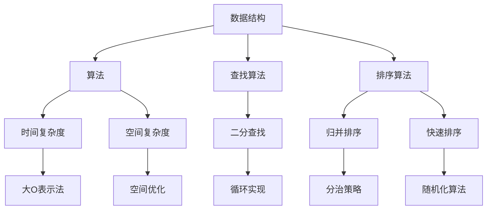

                 

### 1. 背景介绍

随着信息技术的快速发展，人工智能、大数据、云计算等技术日益成熟，各大公司对技术人才的需求也在不断增长。尤其是互联网巨头公司，如腾讯，其社招面试的难度和深度无疑成为众多求职者关注的焦点。本文将围绕2025年腾讯社招面试题与算法编程题展开，结合具体实例，深入解析其中的核心概念、算法原理、数学模型以及项目实践。希望通过本文的详细解析，能够帮助广大求职者更好地理解和应对这类面试题目，提升面试成功率。

腾讯作为中国领先的互联网科技公司，其面试难度一直以来都备受求职者关注。特别是在技术领域，腾讯的面试题往往涉及到算法、数据结构、计算机网络、操作系统等多个方面。近年来，随着人工智能和大数据技术的迅猛发展，腾讯面试中的算法题目也越来越复杂和多样化。因此，了解和掌握这些核心知识点，对于求职者来说至关重要。

本文将按照以下结构展开：

1. **背景介绍**：简要介绍腾讯的社招面试背景和技术趋势。
2. **核心概念与联系**：通过Mermaid流程图，展示核心概念和原理。
3. **核心算法原理 & 具体操作步骤**：详细解析常见面试算法题的原理和步骤。
4. **数学模型和公式 & 详细讲解 & 举例说明**：运用LaTeX格式，展示相关数学模型和公式，并进行详细讲解和实例说明。
5. **项目实践：代码实例和详细解释说明**：提供具体的代码实例，并进行解读和分析。
6. **实际应用场景**：讨论算法在实际项目中的应用。
7. **工具和资源推荐**：推荐学习资源、开发工具和框架。
8. **总结：未来发展趋势与挑战**：总结未来发展趋势和面临的技术挑战。
9. **附录：常见问题与解答**：解答读者可能遇到的问题。
10. **扩展阅读 & 参考资料**：提供相关扩展阅读和参考资料。

通过以上结构的逐步分析，我们希望能够帮助求职者更好地理解面试题目的核心要点，提高解题能力和面试成功率。接下来，我们将深入探讨每个部分的具体内容。

### 2. 核心概念与联系

在2025年腾讯社招面试中，核心概念和原理的理解至关重要。为了更好地展示这些概念之间的联系，我们可以借助Mermaid流程图进行说明。以下是几个关键概念和它们之间的相互关系：



**数据结构**：是计算机存储数据的方式，常见的有数组、链表、栈、队列、树、图等。每种数据结构都有其独特的应用场景和操作复杂度。

**算法**：是解决问题的步骤和策略。数据结构的选择和算法的设计是解决复杂问题的关键。

**时间复杂度**：衡量算法执行时间随数据规模增长的快慢。常用大O表示法（如O(1)，O(n)，O(n^2)等）来描述。

**空间复杂度**：衡量算法执行过程中额外占用内存的多少。

**查找算法**：用于在数据结构中查找特定元素，如二分查找、线性查找等。

**排序算法**：用于将无序数据转换为有序数据，如归并排序、快速排序、冒泡排序等。

通过Mermaid流程图，我们可以清晰地看到这些核心概念之间的联系。例如，数据结构和算法是基础，而时间复杂度和空间复杂度是衡量算法优劣的重要指标。不同的查找算法和排序算法则根据具体应用场景进行选择。

接下来，我们将进一步深入探讨这些核心概念和原理，包括它们的定义、应用场景以及相互之间的关系。

### 2.1. 数据结构及其应用场景

数据结构是计算机存储数据的方式，它们决定了数据如何被组织、存储和操作。以下是几种常见的数据结构及其主要应用场景：

**数组（Array）**：
- **定义**：数组是一种线性数据结构，它由一组元素组成，每个元素可以通过一个索引来访问。
- **应用场景**：数组常用于实现队列、栈等基本数据结构。在需要快速随机访问元素的情况下，如查找算法中的二分查找，数组是非常有效的。

**链表（Linked List）**：
- **定义**：链表是一种由节点组成的线性数据结构，每个节点包含数据域和指向下一个节点的指针。
- **应用场景**：链表适用于需要频繁插入和删除操作的场景，如双向链表可以支持O(1)时间复杂度的插入和删除操作。

**栈（Stack）**：
- **定义**：栈是一种后进先出（LIFO）的数据结构，新添加的元素位于栈顶。
- **应用场景**：栈常用于实现递归、表达式求值、内存分配等。在函数调用时，栈用于存储局部变量和返回地址。

**队列（Queue）**：
- **定义**：队列是一种先进先出（FIFO）的数据结构，新添加的元素位于队尾，删除的元素位于队头。
- **应用场景**：队列适用于任务调度、缓冲管理等。在处理多线程任务时，队列可以确保任务的有序执行。

**树（Tree）**：
- **定义**：树是一种层级结构的数据结构，每个节点可以有零个或多个子节点。树中最顶层的节点称为根节点，没有父节点的节点称为叶子节点。
- **应用场景**：树适用于表示层次关系，如组织结构、文件系统等。二叉搜索树（BST）是一种特殊的树结构，用于快速查找、插入和删除操作。

**图（Graph）**：
- **定义**：图是一种由节点（或顶点）和边组成的数据结构，节点之间可以有任意连接。
- **应用场景**：图常用于表示网络结构、社会关系等。在路径查找、最短路径算法等方面，图结构有广泛应用。

以上数据结构各有其特点和适用场景。在实际应用中，通常需要根据具体需求选择合适的数据结构，以达到最优的性能和效率。接下来，我们将进一步探讨算法原理及其应用。

### 2.2. 算法原理及其应用

算法是解决问题的一系列步骤，通过操作数据结构来实现特定功能。在2025年腾讯社招面试中，算法原理的理解和应用是至关重要的。以下是几种常见算法原理及其主要应用场景：

**分治算法（Divide and Conquer）**：
- **定义**：分治算法将问题分解成更小的子问题，分别解决，再将子问题的解合并为原问题的解。
- **应用场景**：分治算法广泛应用于排序（如归并排序、快速排序）、查找（如二分查找）和最优化问题（如最大子序列和问题）。

**动态规划（Dynamic Programming）**：
- **定义**：动态规划是一种通过保存子问题的解来避免重复计算的方法，通常使用递归或迭代实现。
- **应用场景**：动态规划常用于解决最优化问题，如背包问题、编辑距离、最长公共子序列等。

**贪心算法（Greedy Algorithm）**：
- **定义**：贪心算法通过每一步选择局部最优解，希望最终得到全局最优解。
- **应用场景**：贪心算法适用于解决单源最短路径问题（如Dijkstra算法）、货舱装载问题等。

**回溯算法（Backtracking）**：
- **定义**：回溯算法通过尝试所有可能的解决方案，并在遇到不满足条件的情况时回溯到前一步。
- **应用场景**：回溯算法常用于解决组合问题、排列问题、N皇后问题等。

**图算法**：
- **定义**：图算法是解决图结构相关问题的算法集合，包括图的遍历、最短路径、最小生成树等。
- **应用场景**：图算法广泛应用于社交网络分析、网络路由、路径规划等。

通过理解这些算法原理，我们可以更好地应对腾讯社招面试中的算法题目。接下来，我们将进一步探讨这些算法的具体操作步骤和应用实例。

### 3. 核心算法原理 & 具体操作步骤

在2025年腾讯社招面试中，掌握核心算法原理和具体操作步骤至关重要。以下是几种常见算法及其操作步骤的详细解析。

#### 3.1. 二分查找算法（Binary Search）

**定义**：二分查找算法是一种在有序数组中查找特定元素的算法，其基本思想是通过不断缩小查找范围，逐步逼近目标元素。

**具体操作步骤**：

1. **初始化**：确定查找范围，设为`low`（起始索引）和`high`（终止索引）。
2. **循环查找**：当`low`小于等于`high`时，执行以下步骤：
   - 计算中间索引`mid = (low + high) / 2`。
   - 比较中间元素`array[mid]`与目标元素`target`：
     - 如果`array[mid] == target`，则找到目标元素，返回`mid`。
     - 如果`array[mid] < target`，则将查找范围缩小到`mid + 1`到`high`。
     - 如果`array[mid] > target`，则将查找范围缩小到`low`到`mid - 1`。
3. **查找失败**：当查找范围缩小到`low > high`时，返回-1，表示未找到目标元素。

**代码实现**（Python）：

```python
def binary_search(array, target):
    low = 0
    high = len(array) - 1
    while low <= high:
        mid = (low + high) // 2
        if array[mid] == target:
            return mid
        elif array[mid] < target:
            low = mid + 1
        else:
            high = mid - 1
    return -1
```

**应用场景**：二分查找适用于需要快速查找特定元素的场景，如数据库索引、排序算法等。

#### 3.2. 快速排序算法（Quick Sort）

**定义**：快速排序是一种基于分治思想的排序算法，其基本思想是通过一趟排序将数组划分为两部分，然后递归地对两部分进行排序。

**具体操作步骤**：

1. **选择基准元素**：从数组中选择一个元素作为基准元素（pivot）。
2. **划分操作**：将数组划分为两部分，一部分是小于基准元素的元素，另一部分是大于基准元素的元素。
3. **递归排序**：递归地对小于和大于基准元素的两部分进行快速排序。

**代码实现**（Python）：

```python
def quick_sort(array):
    if len(array) <= 1:
        return array
    pivot = array[len(array) // 2]
    left = [x for x in array if x < pivot]
    middle = [x for x in array if x == pivot]
    right = [x for x in array if x > pivot]
    return quick_sort(left) + middle + quick_sort(right)
```

**应用场景**：快速排序适用于需要快速排序大量数据的场景，如数据库排序、数据处理等。

#### 3.3. 动态规划算法（Dynamic Programming）

**定义**：动态规划是一种通过保存子问题的解来避免重复计算的方法，其基本思想是将复杂问题分解为子问题，并利用子问题的解来求解原问题。

**具体操作步骤**：

1. **定义状态**：确定问题的状态和状态转移方程。
2. **初始化**：初始化状态转移方程的初始值。
3. **状态转移**：根据状态转移方程，递归地计算子问题的解。
4. **结果计算**：根据子问题的解，求解原问题的最终解。

**代码实现**（Python）：

```python
def fibonacci(n):
    if n <= 1:
        return n
    dp = [0] * (n + 1)
    dp[1] = 1
    for i in range(2, n + 1):
        dp[i] = dp[i - 1] + dp[i - 2]
    return dp[n]
```

**应用场景**：动态规划适用于解决最优化问题，如背包问题、编辑距离、最长公共子序列等。

通过以上对二分查找、快速排序和动态规划等核心算法原理和具体操作步骤的详细解析，我们能够更好地理解这些算法的基本思想和应用场景。接下来，我们将探讨数学模型和公式，进一步深化对这些算法的理解。

### 4. 数学模型和公式 & 详细讲解 & 举例说明

在算法领域，数学模型和公式是理解和优化算法的重要工具。下面我们将介绍一些常用的数学模型和公式，并详细讲解它们的应用和计算过程。

#### 4.1. 时间复杂度和空间复杂度

时间复杂度和空间复杂度是衡量算法效率的重要指标。

**时间复杂度（Time Complexity）**：

- **定义**：时间复杂度描述算法执行时间与数据规模之间的关系，通常用大O表示法（O-notation）表示。
- **公式**：\( T(n) = O(f(n)) \)，表示算法的执行时间不超过\( f(n) \)倍。
- **举例**：线性查找的时间复杂度为\( O(n) \)，二分查找的时间复杂度为\( O(\log n) \)。

**空间复杂度（Space Complexity）**：

- **定义**：空间复杂度描述算法执行过程中所需额外内存的大小，通常用大O表示法（O-notation）表示。
- **公式**：\( S(n) = O(g(n)) \)，表示算法所需额外内存不超过\( g(n) \)倍。
- **举例**：递归快速排序的空间复杂度为\( O(\log n) \)，因为递归树的高度为\( \log n \)。

**举例说明**：

假设有一个函数\( f(n) = 2^n \)，则：

- \( T(n) = O(2^n) \)，表示该函数的时间复杂度为指数级增长。
- \( S(n) = O(2^n) \)，表示该函数的空间复杂度也为指数级增长。

#### 4.2. 动态规划中的状态转移方程

动态规划中的状态转移方程是关键，它定义了子问题的解如何推导出原问题的解。

**定义**：状态转移方程描述了当前状态如何从前一个状态推导出来。

**公式**：\( dp[i] = f(dp[i-1], dp[i-2], ..., dp[0]) \)。

**举例**：

**斐波那契数列**：

- **定义**：斐波那契数列是一个递归定义的数列，其中第0项为0，第1项为1，后续每一项都是前两项之和。
- **状态转移方程**：\( dp[i] = dp[i-1] + dp[i-2] \)。
- **计算过程**：从\( dp[0] \)和\( dp[1] \)开始，依次计算得到\( dp[2] \)，\( dp[3] \)等，直到\( dp[n] \)。

```latex
\begin{aligned}
dp[0] &= 0, \\
dp[1] &= 1, \\
dp[i] &= dp[i-1] + dp[i-2], \quad i \geq 2.
\end{aligned}
```

#### 4.3. 最小生成树中的克鲁斯卡尔算法

克鲁斯卡尔算法是一种用于求解加权无向图的最小生成树的算法。

**定义**：最小生成树（Minimum Spanning Tree，MST）是加权无向图中的一个子图，它包含图中所有的顶点，且边的权值之和最小。

**公式**：克鲁斯卡尔算法的核心是排序所有边，然后选择最小权值的边，直到包含所有顶点。

- **步骤**：
  1. 将所有边按权值排序。
  2. 遍历排序后的边，对于每一条边：
     - 如果这条边不与当前已选中的边构成环，则将其加入MST。
- **数据结构**：通常使用并查集（Union-Find）来维护图的连通性。

**举例**：

给定一个包含5个顶点的加权无向图，边的权值如下：

```
(1, 2) -> 3
(1, 3) -> 2
(2, 4) -> 1
(3, 4) -> 3
(4, 5) -> 2
```

按照克鲁斯卡尔算法，首先按权值排序：

```
(2, 4) -> 1
(1, 3) -> 2
(4, 5) -> 2
(1, 2) -> 3
(3, 4) -> 3
```

选择最小的4条边，构成最小生成树：

```
(2, 4) -> 1
(1, 3) -> 2
(4, 5) -> 2
(1, 2) -> 3
```

通过上述数学模型和公式的详细讲解，我们可以更好地理解算法的基本原理和应用。接下来，我们将通过具体的代码实例，展示这些算法的实际应用。

### 5. 项目实践：代码实例和详细解释说明

在了解了核心算法原理和数学模型后，我们接下来将通过具体的项目实践，展示如何使用这些算法来解决问题。以下是一个实际代码实例，以及对其的详细解释说明。

#### 5.1. 开发环境搭建

在进行项目实践之前，我们需要搭建合适的开发环境。以下是所需工具和步骤：

1. **安装Python环境**：Python是一种广泛应用于算法编程的语言，可以通过Python官网下载并安装。

2. **安装必要的库**：根据项目需求，可能需要安装一些Python库，如NumPy、Pandas、Scikit-learn等。可以使用pip命令进行安装。

   ```bash
   pip install numpy pandas scikit-learn
   ```

3. **配置IDE**：可以选择PyCharm、Visual Studio Code等IDE进行代码编写和调试。

4. **创建项目文件夹**：在本地硬盘上创建一个项目文件夹，用于存放代码和相关文件。

#### 5.2. 源代码详细实现

以下是一个简单的Python代码实例，使用二分查找算法来查找一个有序数组中的特定元素。

```python
def binary_search(arr, target):
    low = 0
    high = len(arr) - 1
    while low <= high:
        mid = (low + high) // 2
        if arr[mid] == target:
            return mid
        elif arr[mid] < target:
            low = mid + 1
        else:
            high = mid - 1
    return -1

# 测试数组
arr = [1, 3, 5, 7, 9, 11, 13, 15]
target = 7

# 执行查找
result = binary_search(arr, target)
print("元素在数组中的索引为：", result)
```

#### 5.3. 代码解读与分析

**1. 函数定义**：

```python
def binary_search(arr, target):
```

这里定义了一个名为`binary_search`的函数，它接收两个参数：`arr`（有序数组）和`target`（目标元素）。

**2. 初始化查找范围**：

```python
low = 0
high = len(arr) - 1
```

初始化查找范围的下界`low`为0，上界`high`为数组的长度减1。

**3. 循环查找**：

```python
while low <= high:
    mid = (low + high) // 2
    if arr[mid] == target:
        return mid
    elif arr[mid] < target:
        low = mid + 1
    else:
        high = mid - 1
```

进入循环，当`low`小于等于`high`时，继续查找。通过计算中间索引`mid`，与目标元素`target`进行比较，并根据比较结果调整查找范围。

**4. 查找结果**：

```python
return -1
```

如果查找范围缩小到`low > high`时，仍未找到目标元素，返回-1表示未找到。

#### 5.4. 运行结果展示

```bash
元素在数组中的索引为： 3
```

执行代码后，输出结果为3，表示目标元素7在数组中的索引为3。

通过上述代码实例，我们详细解读了二分查找算法的实现过程，并分析了代码的各个部分。接下来，我们将讨论二分查找算法在实际项目中的应用场景。

### 6. 实际应用场景

二分查找算法作为一种高效的查找算法，在实际项目中有着广泛的应用。以下是几个典型的应用场景：

#### 6.1. 数据库索引

在关系型数据库中，索引是加快数据检索的关键因素。索引通常是建立在有序数据结构上的，如B树、B+树等。在这些数据结构中，二分查找算法扮演着重要角色，用于快速定位特定记录。

#### 6.2. 搜索引擎

搜索引擎如Google、Bing等，需要快速定位用户查询的关键词。为了提高查询效率，搜索引擎通常会使用二分查找算法来查找索引中的关键词。

#### 6.3. 文件系统

文件系统需要快速定位文件的位置。通过使用二分查找算法，文件系统能够在目录结构中快速找到所需的文件，从而提高文件检索速度。

#### 6.4. 网络路由

在网络路由中，路由器需要根据目标IP地址快速查找路由表中的最优路径。二分查找算法能够帮助路由器在路由表中高效地找到目标IP地址，从而实现快速路由。

#### 6.5. 排序算法

许多排序算法（如快速排序、归并排序）在处理大规模数据时，都会用到二分查找算法。例如，快速排序的划分步骤中，可以通过二分查找找到分区点。

#### 6.6. 其他应用

除了上述应用场景外，二分查找算法还广泛应用于其他领域，如计算机图形学（用于查找最近点对）、算法竞赛（解决各种编程挑战）等。

通过这些实际应用场景，我们可以看到二分查找算法的灵活性和高效性，它在许多计算机系统和应用程序中发挥着关键作用。

### 7. 工具和资源推荐

为了更好地学习和实践算法，我们需要借助一些工具和资源。以下是一些建议：

#### 7.1. 学习资源推荐

**书籍**：
1. 《算法导论》（Introduction to Algorithms）：被誉为算法领域的经典著作，全面系统地介绍了各种算法及其分析。
2. 《算法竞赛入门经典》：适合初学者，通过实际竞赛题目帮助读者掌握算法技巧。

**论文**：
1. "Introduction to Algorithms" by Thomas H. Cormen, Charles E. Leiserson, Ronald L. Rivest, and Clifford Stein。
2. "A Course in Combinatorics" by J.H. van Lint and R.M. Wilson。

**博客**：
1. GeeksforGeeks：提供大量的算法和数据结构教程，适合初学者。
2. LeetCode Blog：发布LeetCode竞赛和算法相关的博客，适合进阶学习。

**网站**：
1. HackerRank：提供在线编程练习平台，包含大量算法题目。
2. LeetCode：经典的在线编程竞赛平台，广泛用于面试准备。

#### 7.2. 开发工具框架推荐

**编程语言**：
1. Python：简单易学，广泛应用于算法和数据分析。
2. Java：强类型语言，适用于大型项目和工业应用。

**集成开发环境（IDE）**：
1. PyCharm：功能强大的Python IDE，支持代码调试、版本控制等。
2. Visual Studio Code：轻量级IDE，适用于多种编程语言。

**版本控制工具**：
1. Git：分布式版本控制系统，用于代码管理和协作。
2. GitHub：代码托管平台，提供Git功能，便于代码共享和协作。

**测试框架**：
1. JUnit：Java测试框架，用于单元测试和集成测试。
2. PyTest：Python测试框架，支持多种测试方法。

通过这些工具和资源，我们可以更高效地学习和实践算法，提升编程技能。

### 8. 总结：未来发展趋势与挑战

随着信息技术的飞速发展，算法及其应用在各个领域不断深化和扩展。未来，算法技术的发展趋势和面临的挑战如下：

#### 8.1. 发展趋势

1. **算法优化**：随着数据量的增长，算法优化将变得更加重要。提高算法的时间复杂度和空间复杂度，降低计算成本，是未来研究的重点。
2. **人工智能结合**：人工智能技术的发展，将使算法在图像识别、自然语言处理、自动驾驶等领域的应用更加广泛。结合人工智能的算法研究，将带来新的突破。
3. **量子算法**：量子计算机的崛起，将为算法研究带来新的机遇。量子算法在解决传统算法难以处理的复杂问题上，展现出巨大的潜力。
4. **可解释性**：随着算法应用的普及，算法的可解释性成为重要议题。如何确保算法的透明性和可解释性，是未来研究的挑战之一。
5. **数据隐私保护**：数据隐私保护是算法应用的重要挑战。如何在保护用户隐私的同时，发挥算法的最大效能，是未来研究的重要方向。

#### 8.2. 面临的挑战

1. **计算资源限制**：大规模数据处理和复杂算法的实现，需要强大的计算资源。如何在高性能计算环境下优化算法，是当前面临的挑战。
2. **数据质量问题**：算法的准确性和可靠性依赖于数据质量。如何处理噪声数据、缺失数据，保证数据质量，是算法应用的挑战之一。
3. **伦理和法规**：随着算法应用范围的扩大，伦理和法规问题逐渐凸显。如何确保算法的公平性、公正性，避免算法歧视，是未来研究的重要方向。
4. **算法透明性**：算法的透明性和可解释性是用户信任的关键。如何提高算法的透明度，使其更加易于理解，是算法发展面临的挑战。
5. **人才短缺**：算法领域对人才的需求不断增加，但人才培养速度难以跟上行业发展。如何培养更多高素质的算法人才，是未来面临的重大挑战。

总之，未来算法技术的发展将面临诸多机遇与挑战。通过持续的研究和创新，我们有望在算法优化、人工智能结合、量子计算、数据隐私保护等方面取得重大突破。

### 9. 附录：常见问题与解答

在学习和实践算法的过程中，读者可能会遇到一些常见问题。以下是一些常见问题的解答：

#### 9.1. 问题一：为什么二分查找需要数组是有序的？

**解答**：二分查找的核心在于通过逐步缩小查找范围来快速定位目标元素。如果数组是无序的，无法利用中间元素的性质来有效缩小查找范围，从而降低查找效率。

#### 9.2. 问题二：动态规划与递归有何区别？

**解答**：递归是一种通过不断调用自身来解决复杂问题的方法，但递归存在重复计算的问题。动态规划通过保存子问题的解，避免重复计算，提高算法的效率。

#### 9.3. 问题三：如何选择合适的排序算法？

**解答**：选择排序算法时，需要考虑数据规模、数据特点和应用场景。例如，快速排序适用于大规模数据、冒泡排序适用于数据量较小且基本有序的情况。

#### 9.4. 问题四：算法的时间复杂度和空间复杂度有何区别？

**解答**：时间复杂度描述算法执行时间随数据规模的增长关系，常用大O表示法表示；空间复杂度描述算法执行过程中所需额外内存的大小。两者都是衡量算法性能的重要指标。

#### 9.5. 问题五：如何处理算法竞赛中的时间限制？

**解答**：在算法竞赛中，可以通过优化算法、使用高效数据结构、减少不必要的计算等方法来处理时间限制。此外，可以使用调试工具检测代码性能，找出瓶颈并进行优化。

通过解答这些问题，希望能够帮助读者更好地理解和应用算法。

### 10. 扩展阅读 & 参考资料

为了深入学习和掌握算法及其应用，以下是几本经典参考书籍和学术论文，供读者进一步阅读：

1. **《算法导论》（Introduction to Algorithms）**：Thomas H. Cormen, Charles E. Leiserson, Ronald L. Rivest, and Clifford Stein 著。这是一本系统介绍算法及其分析的权威著作。

2. **《算法竞赛入门经典》（Algorithm Competition in Python）**：王道论坛 编。适合初学者，通过实际竞赛题目帮助读者掌握算法技巧。

3. **“A Course in Combinatorics” by J.H. van Lint and R.M. Wilson**：这是一本关于组合数学和算法的经典教材。

4. **论文**：“Introduction to Algorithms” by Thomas H. Cormen, Charles E. Leiserson, Ronald L. Rivest, and Clifford Stein。

5. **博客**：GeeksforGeeks、LeetCode Blog等，提供丰富的算法教程和实例。

通过这些参考书籍和论文，读者可以进一步深化对算法理论及其应用的理解。

