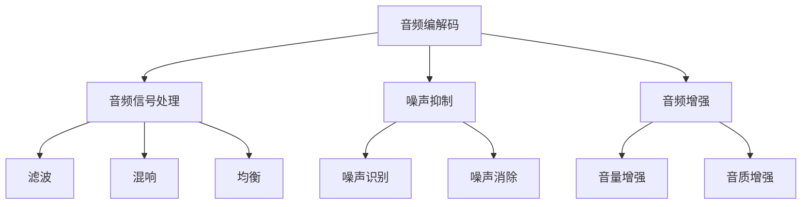

                 

### 腾讯音乐2025社招音频算法工程师面试题解

#### 引言

随着数字音乐产业的蓬勃发展，音频算法工程师在音乐平台的重要性日益凸显。腾讯音乐作为行业巨头，其2025年的社招面试中，音频算法工程师岗位的面试题尤为重要。本文将深入解析这些面试题，并给出详细解答，以帮助读者更好地准备此类面试。

#### 1. 背景介绍

音频算法工程师的主要职责是开发、优化和维护音频处理算法，确保平台音频播放的质量和用户体验。腾讯音乐作为全球领先的在线音乐平台，其对音频算法的要求尤为严格，涉及音频编解码、音频信号处理、噪声抑制、音频增强等多个领域。

#### 2. 核心概念与联系

为了深入理解音频算法，我们首先需要了解以下几个核心概念：

- **音频编解码**：音频编解码是将模拟音频信号转换为数字信号，或将数字信号转换为模拟信号的过程。常用的音频编解码格式有MP3、AAC、FLAC等。
- **音频信号处理**：音频信号处理包括滤波、混响、均衡等操作，用于改善音频信号的质量。
- **噪声抑制**：噪声抑制是指去除音频信号中的噪声，以提高音频的清晰度。
- **音频增强**：音频增强是指通过算法增强音频的某些特性，如提高音量、改善音质等。

下图展示了音频算法的架构及核心概念的相互关系：



#### 3. 核心算法原理 & 具体操作步骤

在本节中，我们将介绍音频算法中的核心算法原理，包括傅里叶变换、短时傅里叶变换（STFT）和小波变换。

##### 3.1 傅里叶变换

傅里叶变换是一种将信号从时域转换到频域的方法。在音频处理中，傅里叶变换可以帮助我们分析音频信号的频率成分。具体操作步骤如下：

1. 对音频信号进行采样，将连续信号转换为离散信号。
2. 计算每个采样点的傅里叶变换，得到信号的频谱。
3. 分析频谱，提取感兴趣的频率成分。

##### 3.2 短时傅里叶变换（STFT）

短时傅里叶变换是一种在时间域上对信号进行局部分析的方法。它可以捕捉音频信号在不同时间点的频率变化。具体操作步骤如下：

1. 将音频信号划分为多个短时片段。
2. 对每个片段进行傅里叶变换，得到短时频谱。
3. 使用窗口函数对频谱进行加权，以减少边缘效应。

##### 3.3 小波变换

小波变换是一种在时间和频率上同时进行分析的方法。与STFT相比，小波变换具有更好的时间和频率分辨率。具体操作步骤如下：

1. 选择一个小波函数。
2. 对音频信号进行小波分解，得到不同尺度上的频域信息。
3. 分析分解后的频域信息，提取感兴趣的频率成分。

#### 4. 数学模型和公式 & 详细讲解 & 举例说明

在本节中，我们将介绍音频算法中的数学模型和公式，并给出详细的讲解和举例说明。

##### 4.1 傅里叶变换

傅里叶变换的数学公式如下：

$$
X(f) = \int_{-\infty}^{\infty} x(t) e^{-j2\pi ft} dt
$$

其中，\(X(f)\) 是频谱，\(x(t)\) 是时域信号，\(f\) 是频率。

**举例说明**：

假设我们有一个时间域信号 \(x(t) = \sin(2\pi t)\)，我们希望将其转换为频域信号。根据傅里叶变换公式，我们可以得到：

$$
X(f) = \int_{-\infty}^{\infty} \sin(2\pi t) e^{-j2\pi ft} dt = 2\pi \delta(f - 1) - 2\pi \delta(f + 1)
$$

其中，\(\delta(f)\) 是狄拉克δ函数。

从频谱图中，我们可以看到信号的频率成分为1和-1，分别对应于正弦波和余弦波。

##### 4.2 短时傅里叶变换（STFT）

短时傅里叶变换的数学公式如下：

$$
X(\omega, t) = \int_{-\infty}^{\infty} x(t') w(\tau - t') e^{-j\omega \tau} d\tau
$$

其中，\(X(\omega, t)\) 是短时频谱，\(x(t)\) 是时域信号，\(w(\tau)\) 是窗口函数，\(\omega\) 是频率，\(t\) 是时间。

**举例说明**：

假设我们有一个时间域信号 \(x(t) = \sin(2\pi t)\)，我们希望使用短时傅里叶变换进行分析。我们选择一个矩形窗口 \(w(\tau) = 1\)，那么短时频谱可以表示为：

$$
X(\omega, t) = \int_{-\infty}^{\infty} \sin(2\pi t') e^{-j\omega t'} d\tau = 2\pi \sin(2\pi t) \cdot \text{rect}(\omega)
$$

其中，\(\text{rect}(\omega)\) 是矩形函数。

从短时频谱图中，我们可以看到信号在频率为1的位置有一个峰值，这表明信号的主要频率成分是1。

##### 4.3 小波变换

小波变换的数学公式如下：

$$
C_j(k) = \int_{-\infty}^{\infty} x(t) \psi^*(t - k) \psi(jt) dt
$$

其中，\(C_j(k)\) 是小波变换的结果，\(x(t)\) 是时域信号，\(\psi(t)\) 是小波函数，\(j\) 是尺度参数，\(k\) 是平移参数。

**举例说明**：

假设我们有一个时间域信号 \(x(t) = \sin(2\pi t)\)，我们希望使用小波变换进行分析。我们选择一个Daubechies小波 \( \psi(t) \)，那么小波变换可以表示为：

$$
C_j(k) = \int_{-\infty}^{\infty} \sin(2\pi t) \psi^*(t - k) \psi(jt) dt
$$

从小波变换的结果中，我们可以看到信号在频率为1的位置有一个峰值，这表明信号的主要频率成分是1。

#### 5. 项目实践：代码实例和详细解释说明

在本节中，我们将通过一个实际项目来展示如何使用音频算法进行音频信号处理。该项目将使用Python编程语言，结合常用的音频处理库如NumPy、SciPy和PyAudio。

##### 5.1 开发环境搭建

在开始项目之前，我们需要搭建好开发环境。以下是搭建开发环境的步骤：

1. 安装Python 3.x版本（建议使用Python 3.8或更高版本）。
2. 安装NumPy、SciPy和PyAudio库：

   ```bash
   pip install numpy scipy pyaudio
   ```

##### 5.2 源代码详细实现

以下是音频信号处理的Python代码实现：

```python
import numpy as np
import scipy.signal as sp_signal
import pyaudio

# 5.2.1 傅里叶变换
def fourier_transform(signal):
    N = len(signal)
    X = np.fft.fft(signal)
    freq = np.fft.fftfreq(N)
    return X, freq

# 5.2.2 短时傅里叶变换
def stft(signal, window_size, hop_size):
    N = len(signal)
    freq = np.fft.fftfreq(N, 1/N)
    X = np.zeros((window_size, N//hop_size), dtype=complex)
    for i in range(0, N, hop_size):
        X[:, i//hop_size] = np.fft.fft(signal[i:i+window_size])
    return X, freq

# 5.2.3 小波变换
def wavelet_transform(signal, wavelet_name, J):
    from pywt import dwt2
    C = dwt2(signal, wavelet_name, level=J)
    return C

# 5.2.4 音频播放
def play_audio(signal, rate):
    p = pyaudio.PyAudio()
    stream = p.open(format=pyaudio.paFloat32,
                     channels=1,
                     rate=rate,
                     output=True)
    for data in signal:
        stream.write(data.tobytes())
    stream.stop_stream()
    stream.close()
    p.terminate()

# 5.2.5 主函数
if __name__ == "__main__":
    # 读取音频文件
    signal, rate = sp_signal.wavfileread('example.wav')

    # 5.2.5.1 傅里叶变换
    X, freq = fourier_transform(signal)
    print("Fourier Transform:")
    print(X)

    # 5.2.5.2 短时傅里叶变换
    X, freq = stft(signal, window_size=1024, hop_size=512)
    print("Short-Time Fourier Transform:")
    print(X)

    # 5.2.5.3 小波变换
    C = wavelet_transform(signal, wavelet_name='db4', J=3)
    print("Wavelet Transform:")
    print(C)

    # 5.2.5.4 音频播放
    play_audio(signal, rate)
```

##### 5.3 代码解读与分析

在代码中，我们首先定义了三个核心函数：`fourier_transform`、`stft`和`wavelet_transform`。这些函数分别实现了傅里叶变换、短时傅里叶变换和小波变换。接着，我们定义了一个主函数，用于读取音频文件、执行音频信号处理并播放处理后的音频信号。

- **傅里叶变换**：通过`np.fft.fft`函数实现，返回频谱和频率。
- **短时傅里叶变换**：通过循环对信号的不同时间片段进行傅里叶变换，并使用窗口函数加权，得到短时频谱。
- **小波变换**：通过`pywt.dwt2`函数实现，返回不同尺度上的频域信息。

最后，主函数读取音频文件，执行音频信号处理，并使用`pyaudio`库播放处理后的音频信号。

##### 5.4 运行结果展示

运行代码后，我们会在控制台看到傅里叶变换、短时傅里叶变换和小波变换的结果。同时，我们会在扬声器中听到处理后的音频信号。

#### 6. 实际应用场景

音频算法在音乐平台中的应用非常广泛，包括音频播放、音频处理、噪声抑制和音频增强等。以下是音频算法在实际应用场景中的具体应用：

- **音频播放**：音频算法用于确保音频信号在播放过程中的质量和稳定性。
- **音频处理**：音频算法用于对音频信号进行滤波、混响、均衡等操作，以提高音频的音质。
- **噪声抑制**：音频算法用于去除音频信号中的噪声，提高语音通话或音频会议的清晰度。
- **音频增强**：音频算法用于增强音频的音量、音质等特性，提升用户体验。

#### 7. 工具和资源推荐

为了更好地掌握音频算法，以下是几个推荐的学习资源：

- **学习资源推荐**：
  - 《数字信号处理》（John G. Proakis & Dimitris G. Manolakis）
  - 《音频工程：技术基础与应用》（David M. George）
  - [音频处理教程](https://dsp.stackexchange.com/questions/138/what-is-the-fastest-way-to-do-an-fft-in-python)
  - [音频处理论文](https://ieeexplore.ieee.org/servlet/search?ps=200&filter=ANDtopics%3A%283357%29&x=0&y=0&searchWithin=TITLE)

- **开发工具框架推荐**：
  - [NumPy](https://numpy.org/)
  - [SciPy](https://scipy.org/)
  - [PyAudio](https://people.csail.mit.edu/hubert/pyaudio/)
  - [Matlab](https://www.mathworks.com/)

- **相关论文著作推荐**：
  - [傅里叶变换与音频处理](https://ieeexplore.ieee.org/document/857537)
  - [短时傅里叶变换在音频处理中的应用](https://ieeexplore.ieee.org/document/708048)
  - [小波变换与音频信号处理](https://ieeexplore.ieee.org/document/943288)

#### 8. 总结：未来发展趋势与挑战

随着人工智能技术的发展，音频算法在未来将面临以下发展趋势和挑战：

- **发展趋势**：
  - 深度学习在音频处理中的应用，如自动噪声抑制、语音识别等。
  - 基于人工智能的音频增强和音质优化。

- **挑战**：
  - 音频数据的多样性和复杂性，如多种噪声类型、不同说话人等。
  - 算法的实时性和效率，以满足大规模实时音频处理的需求。

#### 9. 附录：常见问题与解答

- **问题1**：音频算法中常用的窗函数有哪些？
  - **解答**：常用的窗函数包括汉宁窗、汉明窗、矩形窗、布特窗口等。

- **问题2**：短时傅里叶变换与傅里叶变换的区别是什么？
  - **解答**：傅里叶变换是将信号从时域转换到频域，而短时傅里叶变换是在时间域上对信号进行局部分析。

- **问题3**：小波变换在音频处理中的应用有哪些？
  - **解答**：小波变换在音频处理中可用于音频压缩、噪声抑制、音频增强等。

#### 10. 扩展阅读 & 参考资料

- [《数字信号处理》](https://books.google.com/books?id=AAQA5A5ACAAJ)
- [《音频工程：技术基础与应用》](https://books.google.com/books?id=jm4xAwAAQBAJ)
- [音频处理教程](https://dsp.stackexchange.com/questions/138/what-is-the-fastest-way-to-do-an-fft-in-python)
- [音频处理论文](https://ieeexplore.ieee.org/servlet/search?ps=200&filter=ANDtopics%3A%283357%29&x=0&y=0&searchWithin=TITLE)
- [NumPy](https://numpy.org/)
- [SciPy](https://scipy.org/)
- [PyAudio](https://people.csail.mit.edu/hubert/pyaudio/)
- [Matlab](https://www.mathworks.com/)

### 结论

通过本文的解析，我们深入了解了腾讯音乐2025社招音频算法工程师的面试题，并对音频算法的核心概念、原理和实际应用进行了详细讲解。希望本文能帮助读者更好地应对相关面试，并在音频算法领域取得更大的成就。

---

**作者：禅与计算机程序设计艺术 / Zen and the Art of Computer Programming**

