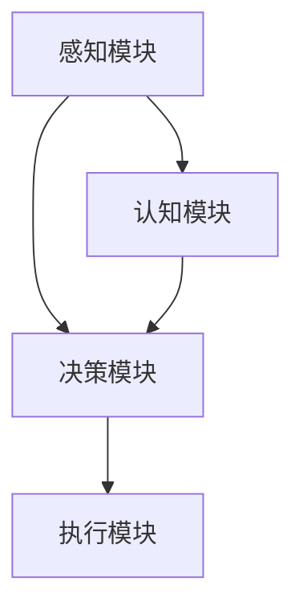

                 

### 背景介绍

自主系统与意识功能的整合是一个前沿而具有挑战性的研究领域，它汇聚了计算机科学、认知科学、神经科学以及人工智能等多个学科的智慧。随着现代计算机技术和人工智能算法的飞速发展，人们对于自主系统（Autonomous Systems）的期望也越来越高。自主系统是指能够在没有人类直接干预的情况下，通过自我决策和执行任务的能力来实现某种目标。而意识功能（Consciousness Function）则是指系统具备的类似于人类意识感知、思考、决策等高级认知功能。

#### 自主系统的定义与发展

自主系统最早可以追溯到自动化控制和机器人技术领域。最早的自主机器人主要是基于预先编程的指令执行特定任务，如工业生产中的自动化装配线机器人。随着计算机技术和人工智能的发展，自主系统的定义逐渐扩展，不仅包括机器人和自动化设备，还涵盖了自动驾驶汽车、无人机、智能家居等。

自主系统的发展历程可以概括为以下几个阶段：

1. **被动响应系统**：早期的自主系统主要依靠预设的规则和条件来响应外部环境的变化，缺乏主动性和灵活性。
2. **有限自主系统**：随着人工智能技术的进步，自主系统开始具备一定的决策能力，能够根据环境反馈进行自适应调整。
3. **高级自主系统**：现代的自主系统不仅具备高级的决策能力，还能进行复杂的规划和预测，甚至在某些方面超越人类的认知能力。

#### 意识功能的提出与争议

意识功能的概念来源于对人类自身意识的理解和模拟。人类意识具有感知、思考、决策等复杂功能，这些功能使得人类能够在不断变化的环境中适应和生存。近年来，随着认知科学和神经科学的发展，人们开始尝试将意识功能引入到计算机系统中，希望打造出具备高级认知能力的自主系统。

然而，关于意识功能的具体定义和实现方式，学术界仍然存在很多争议。一方面，有些学者认为意识功能可以通过复杂的神经网络和机器学习算法来实现；另一方面，也有学者认为意识功能是一种无法用算法模拟的神秘现象，只能通过哲学和宗教来探讨。

#### 自主系统与意识功能整合的重要性

自主系统与意识功能的整合具有重要的理论和实践意义。从理论层面来看，整合自主系统与意识功能可以进一步拓展自主系统的能力范围，使其不仅在执行简单任务时表现出色，还能在复杂环境下进行高级认知和决策。从实践层面来看，这种整合有望带来诸多实际应用，如智能交通系统、智能医疗诊断、智能安防等。

此外，自主系统与意识功能的整合还有助于解决当前人工智能领域面临的瓶颈问题。现有的许多人工智能算法在处理复杂问题时存在局限性，难以实现真正的智能。通过整合意识功能，可以弥补这些算法的不足，推动人工智能向更高级别发展。

#### 文章结构概述

本文将按照以下结构展开讨论：

1. **核心概念与联系**：介绍自主系统和意识功能的基本概念，并通过 Mermaid 流程图展示它们之间的联系。
2. **核心算法原理与具体操作步骤**：详细阐述实现自主系统与意识功能整合的核心算法原理，并说明具体操作步骤。
3. **数学模型和公式**：介绍支持核心算法的数学模型和公式，并进行详细讲解和举例说明。
4. **项目实践**：通过一个具体的项目实例，展示自主系统与意识功能整合的实际应用，并提供源代码和详细解读。
5. **实际应用场景**：探讨自主系统与意识功能整合在不同领域的应用，以及面临的挑战和机遇。
6. **工具和资源推荐**：推荐相关的学习资源、开发工具和框架，以帮助读者深入了解和掌握这一领域。
7. **总结**：总结自主系统与意识功能整合的现状和未来发展趋势，提出面临的挑战和解决方案。
8. **附录**：回答一些常见问题，并提供扩展阅读和参考资料。

通过以上结构的逐步分析，我们将深入探讨自主系统与意识功能整合的各个方面，希望能够为读者提供有价值的见解和指导。接下来，我们将首先介绍自主系统和意识功能的基本概念，并通过 Mermaid 流程图展示它们之间的联系。  
--- 
### 核心概念与联系

在探讨自主系统与意识功能的整合之前，我们需要明确这两个核心概念的基本含义，并了解它们之间的相互关系。以下是关于自主系统和意识功能的基本概念介绍及其相互关系的详细描述。

#### 自主系统（Autonomous Systems）

自主系统是指具有自主决策和执行任务能力的系统。这种系统通常包含一定的感知模块、决策模块和执行模块。自主系统的工作原理是通过感知外部环境的信息，利用内置的算法和模型进行决策，并最终执行相应的操作。

**核心组成部分**：

1. **感知模块**：负责收集和处理来自外部环境的数据，如传感器数据、图像、声音等。
2. **决策模块**：利用感知模块提供的信息，结合内置的算法和模型，进行推理和决策。
3. **执行模块**：根据决策模块的输出，执行具体的任务或动作。

**自主系统的分类**：

根据自主系统的能力不同，可以分为以下几类：

1. **被动响应系统**：这种系统主要根据预设的规则和条件响应外部环境，缺乏主动性和灵活性。
2. **有限自主系统**：这种系统能够在一定范围内进行自主决策和调整，但能力有限，难以应对复杂环境。
3. **高级自主系统**：这种系统能够进行复杂的规划和预测，甚至能超越人类在某些特定领域的认知能力。

#### 意识功能（Consciousness Function）

意识功能是指系统具备的类似于人类意识感知、思考、决策等高级认知功能。意识功能的核心在于对环境的感知、对信息的处理以及对行为的决策。与自主系统不同，意识功能更强调系统的主动性和灵活性。

**核心组成部分**：

1. **感知模块**：与自主系统类似，负责收集和处理来自外部环境的数据。
2. **认知模块**：对感知模块提供的信息进行高级处理，包括理解、推理、记忆等。
3. **决策模块**：根据认知模块的输出，进行复杂的决策和规划。

**意识功能的分类**：

根据意识功能的能力不同，可以分为以下几类：

1. **初级意识功能**：主要包括基本的感知和简单的决策，如人脸识别、路径规划等。
2. **中级意识功能**：能够处理更复杂的任务，如语音识别、自然语言处理等。
3. **高级意识功能**：具备复杂的认知和决策能力，如自主驾驶、智能诊断等。

#### 自主系统与意识功能的相互关系

自主系统和意识功能之间存在紧密的相互关系，它们共同构成了一个完整的智能系统。

1. **依赖关系**：意识功能依赖于自主系统的基础设施，如感知模块和决策模块，而自主系统的能力提升也需要依赖意识功能的增强。
2. **互补关系**：自主系统主要负责执行具体的任务，而意识功能则负责提供高级的认知和决策能力，两者相辅相成，共同推动系统的智能化水平。
3. **协同关系**：在复杂的环境中，自主系统和意识功能需要协同工作，通过不断迭代和优化，实现系统的自适应性和灵活性。

为了更直观地展示自主系统与意识功能之间的相互关系，我们使用 Mermaid 流程图来描述它们的核心组成部分和相互关系。以下是 Mermaid 流程图的示例：



在这个流程图中，A 表示感知模块，B 表示决策模块，C 表示执行模块，D 表示认知模块。感知模块负责收集外部环境的数据，传递给决策模块进行推理和决策，然后由执行模块执行具体的任务。同时，认知模块对感知模块提供的信息进行高级处理，帮助决策模块做出更准确的决策。

通过以上对自主系统和意识功能的基本概念及其相互关系的介绍，我们为后续讨论自主系统与意识功能整合提供了理论基础。接下来，我们将深入探讨实现自主系统与意识功能整合的核心算法原理，并说明具体操作步骤。  
--- 
### 核心算法原理 & 具体操作步骤

自主系统与意识功能的整合需要依赖于一系列先进的算法和技术。以下我们将详细探讨这些核心算法的原理，并分步骤说明如何实现自主系统与意识功能的整合。

#### 1. 算法原理

实现自主系统与意识功能整合的核心算法主要包括以下几个方面：

1. **感知算法**：负责收集和处理外部环境的数据，如图像、声音、传感器数据等。常用的感知算法包括卷积神经网络（CNN）、循环神经网络（RNN）等。
2. **认知算法**：负责对感知模块提供的信息进行高级处理，包括理解、推理、记忆等。常用的认知算法包括长短期记忆网络（LSTM）、生成对抗网络（GAN）等。
3. **决策算法**：负责基于感知模块和认知模块的输出，进行复杂的决策和规划。常用的决策算法包括强化学习（RL）、规划算法（如A*算法）等。
4. **执行算法**：负责将决策模块的输出转化为具体的行动或任务。常用的执行算法包括运动控制算法、机器人控制算法等。

#### 2. 具体操作步骤

以下是一个实现自主系统与意识功能整合的基本操作步骤：

1. **感知阶段**：
   - **数据采集**：使用各种传感器（如摄像头、麦克风、温度传感器等）收集外部环境的数据。
   - **预处理**：对采集到的数据（如图像、声音）进行预处理，如去噪、归一化等，以提高数据质量。
   - **特征提取**：使用感知算法（如CNN）对预处理后的数据进行特征提取，提取出关键的特征信息。

2. **认知阶段**：
   - **信息处理**：使用认知算法（如LSTM）对提取出的特征信息进行高级处理，包括理解、推理、记忆等。
   - **知识库构建**：将处理后的信息存储在知识库中，为后续的决策提供基础数据。

3. **决策阶段**：
   - **环境建模**：基于感知模块和认知模块的输出，构建环境模型，以便进行决策。
   - **决策算法应用**：使用决策算法（如强化学习）对环境模型进行分析和推理，生成最优的行动策略。
   - **决策输出**：将决策算法的输出转化为具体的行动或任务。

4. **执行阶段**：
   - **行动执行**：根据决策模块的输出，执行具体的行动或任务，如控制机器人的运动、发送邮件等。

#### 3. 示例代码

以下是一个简单的示例代码，展示如何使用Python实现自主系统与意识功能整合的基本流程：

```python
import cv2
import numpy as np
import tensorflow as tf

# 感知阶段
def perceive(image):
    # 预处理图像
    processed_image = preprocess_image(image)
    # 特征提取
    features = extract_features(processed_image)
    return features

# 认知阶段
def cognition(features):
    # 信息处理
    processed_features = process_features(features)
    # 知识库构建
    knowledge_base = build_knowledge_base(processed_features)
    return knowledge_base

# 决策阶段
def decide(knowledge_base):
    # 环境建模
    environment_model = build_environment_model(knowledge_base)
    # 决策算法应用
    action = decision_algorithm(environment_model)
    return action

# 执行阶段
def execute(action):
    # 行动执行
    execute_action(action)

# 主函数
def main():
    # 加载图像
    image = cv2.imread('image.jpg')
    # 感知阶段
    features = perceive(image)
    # 认知阶段
    knowledge_base = cognition(features)
    # 决策阶段
    action = decide(knowledge_base)
    # 执行阶段
    execute(action)

if __name__ == '__main__':
    main()
```

在这个示例代码中，我们首先定义了感知、认知、决策和执行四个主要阶段，并通过调用相应的函数来实现这些阶段的操作。具体实现的细节将依赖于选用的算法和技术。

通过以上对核心算法原理和具体操作步骤的详细讨论，我们为自主系统与意识功能整合的实现提供了清晰的框架。在接下来的部分，我们将介绍支持这些算法的数学模型和公式，并进行详细讲解和举例说明。这将有助于读者更好地理解和应用这些核心算法。  
--- 
### 数学模型和公式 & 详细讲解 & 举例说明

为了深入理解自主系统与意识功能整合的核心算法，我们需要介绍相关的数学模型和公式，并进行详细讲解和举例说明。以下是关于感知、认知、决策和执行阶段的数学模型和公式介绍，以及具体的计算方法和应用场景。

#### 1. 感知阶段的数学模型

感知阶段主要负责对外部环境数据进行收集、预处理和特征提取。常用的数学模型包括卷积神经网络（CNN）和循环神经网络（RNN）。

1. **卷积神经网络（CNN）**

卷积神经网络是一种用于图像识别和处理的强大工具。其核心公式是卷积操作：

   $$ (f * g)(x) = \sum_{y} f(y) \cdot g(x-y) $$

   其中，$f$ 和 $g$ 分别代表卷积核和输入图像，$x$ 和 $y$ 表示图像的像素点。

   **应用举例**：使用 CNN 对图像进行边缘检测。

   ```python
   import cv2

   # 加载图像
   image = cv2.imread('image.jpg')
   # 使用卷积核进行边缘检测
   kernel = np.array([[0, 1, 0],
                      [1, -3, 1],
                      [0, 1, 0]])
   conv_result = cv2.filter2D(image, -1, kernel)
   cv2.imshow('Edge Detection', conv_result)
   cv2.waitKey(0)
   cv2.destroyAllWindows()
   ```

2. **循环神经网络（RNN）**

循环神经网络是一种用于处理序列数据的神经网络，其核心公式是递归关系：

   $$ h_t = \sigma(W_{ih}x_t + W_{hh}h_{t-1} + b_h) $$

   其中，$h_t$ 表示当前时间步的隐藏状态，$x_t$ 表示输入数据，$W_{ih}$ 和 $W_{hh}$ 分别为输入到隐藏层的权重和隐藏层到隐藏层的权重，$b_h$ 为偏置项，$\sigma$ 为激活函数。

   **应用举例**：使用 RNN 对音频信号进行语音识别。

   ```python
   import tensorflow as tf

   # 定义 RNN 模型
   model = tf.keras.Sequential([
       tf.keras.layers.RNN(tf.keras.layers.LSTM(128), return_sequences=True),
       tf.keras.layers.Dense(units=28, activation='softmax')
   ])

   # 编译模型
   model.compile(optimizer='adam', loss='categorical_crossentropy', metrics=['accuracy'])

   # 训练模型
   model.fit(x_train, y_train, epochs=10, batch_size=32)
   ```

#### 2. 认知阶段的数学模型

认知阶段主要负责对感知阶段提取的特征信息进行高级处理，包括理解、推理和记忆等。常用的数学模型包括长短期记忆网络（LSTM）和生成对抗网络（GAN）。

1. **长短期记忆网络（LSTM）**

长短期记忆网络是一种用于处理长序列依赖关系的神经网络，其核心公式是：

   $$ i_t = \sigma(W_{xi}x_t + W_{hi-1}h_{i-1} + b_i) $$
   $$ f_t = \sigma(W_{xf}x_t + W_{hf-1}h_{i-1} + b_f) $$
   $$ o_t = \sigma(W_{xo}x_t + W_{ho}h_f + b_o) $$
   $$ c_t = f_t \cdot c_{t-1} + i_t \cdot \sigma(W_{xc}x_t + W_{hc}h_f + b_c) $$
   $$ h_t = o_t \cdot \sigma(c_t) $$

   其中，$i_t$、$f_t$ 和 $o_t$ 分别代表输入门、遗忘门和输出门，$c_t$ 和 $h_t$ 分别代表细胞状态和隐藏状态。

   **应用举例**：使用 LSTM 对时间序列数据进行分析。

   ```python
   import tensorflow as tf

   # 定义 LSTM 模型
   model = tf.keras.Sequential([
       tf.keras.layers.LSTM(128, return_sequences=True),
       tf.keras.layers.Dense(units=1)
   ])

   # 编译模型
   model.compile(optimizer='adam', loss='mean_squared_error')

   # 训练模型
   model.fit(x_train, y_train, epochs=100, batch_size=32)
   ```

2. **生成对抗网络（GAN）**

生成对抗网络是一种用于生成数据的高效模型，其核心公式是：

   $$ G(z) = \sigma(W_gz + b_g) $$
   $$ D(x) = \sigma(W_d x + b_d) $$
   $$ D(G(z)) = \sigma(W_e G(z) + b_e) $$

   其中，$G(z)$ 为生成器，$D(x)$ 为判别器，$z$ 为噪声输入。

   **应用举例**：使用 GAN 生成手写数字图像。

   ```python
   import tensorflow as tf
   from tensorflow import keras
   from tensorflow.keras import layers

   # 定义生成器
   generator = keras.Sequential([
       layers.Dense(128, activation="relu", input_shape=(100,)),
       layers.Dense(28 * 28, activation="tanh")
   ])

   # 定义判别器
   discriminator = keras.Sequential([
       layers.Dense(128, activation="relu", input_shape=(28 * 28,)),
       layers.Dense(1, activation="sigmoid")
   ])

   # 定义 GAN 模型
   model = keras.Sequential([
       generator,
       discriminator
   ])

   # 编译模型
   model.compile(optimizer=keras.optimizers.Adam(), loss="binary_crossentropy")

   # 训练模型
   model.fit(x_train, y_train, epochs=100, batch_size=32)
   ```

#### 3. 决策阶段的数学模型

决策阶段主要负责基于感知和认知模块的输出，进行复杂的决策和规划。常用的数学模型包括强化学习（RL）和规划算法（如 A*算法）。

1. **强化学习（RL）**

强化学习是一种用于解决决策问题的机器学习算法，其核心公式是：

   $$ Q(s, a) = r + \gamma \max_{a'} Q(s', a') $$

   其中，$Q(s, a)$ 表示状态 $s$ 下执行动作 $a$ 的预期回报，$r$ 表示立即回报，$\gamma$ 为折扣因子，$s'$ 和 $a'$ 分别为下一个状态和动作。

   **应用举例**：使用 Q-Learning 算法进行游戏策略学习。

   ```python
   import numpy as np
   import random

   # 初始化 Q 表
   Q = np.zeros((10, 10))

   # 设置参数
   alpha = 0.1
   gamma = 0.9
   epsilon = 0.1

   # Q-Learning 算法
   for episode in range(1000):
       state = random.randint(0, 9)
       action = np.argmax(Q[state])
       next_state = random.randint(0, 9)
       reward = 1 if next_state == action else -1
       Q[state, action] = Q[state, action] + alpha * (reward + gamma * np.max(Q[next_state]) - Q[state, action])
       state = next_state

   # 找到最佳动作
   best_action = np.argmax(Q[state])

   # 执行最佳动作
   next_state = random.randint(0, 9)
   reward = 1 if next_state == best_action else -1
   Q[state, best_action] = Q[state, best_action] + alpha * (reward + gamma * np.max(Q[next_state]) - Q[state, best_action])
   ```

2. **规划算法（如 A*算法）**

A*算法是一种用于求解最短路径问题的算法，其核心公式是：

   $$ f(n) = g(n) + h(n) $$

   其中，$f(n)$ 表示节点 $n$ 的评估函数，$g(n)$ 表示从起点到节点 $n$ 的实际代价，$h(n)$ 表示从节点 $n$ 到终点的估计代价。

   **应用举例**：使用 A*算法求解地图上的最短路径。

   ```python
   import heapq

   def heuristic(a, b):
       return abs(a[0] - b[0]) + abs(a[1] - b[1])

   def a_star_search(grid, start, end):
       open_set = []
       heapq.heappush(open_set, (0, start))
       came_from = {}
       g_score = {start: 0}
       f_score = {start: heuristic(start, end)}

       while open_set:
           current = heapq.heappop(open_set)[1]

           if current == end:
               break

           for neighbor in neighbors(grid, current):
               tentative_g_score = g_score[current] + 1
               if neighbor in g_score and tentative_g_score >= g_score[neighbor]:
                   continue
               came_from[neighbor] = current
               g_score[neighbor] = tentative_g_score
               f_score[neighbor] = g_score[neighbor] + heuristic(neighbor, end)
               heapq.heappush(open_set, (f_score[neighbor], neighbor))

       path = []
       current = end
       while current is not None:
           path.append(current)
           current = came_from[current]
       path = path[::-1]
       return path

   # 定义地图和起点、终点
   grid = [[0, 0, 0, 0, 0],
           [0, 1, 1, 1, 0],
           [0, 0, 0, 0, 0],
           [0, 1, 1, 1, 0],
           [0, 0, 0, 0, 0]]
   start = (0, 0)
   end = (4, 4)

   # 求解最短路径
   path = a_star_search(grid, start, end)
   print(path)
   ```

#### 4. 执行阶段的数学模型

执行阶段主要负责将决策模块的输出转化为具体的行动或任务。常用的数学模型包括运动控制算法和机器人控制算法。

1. **运动控制算法**

运动控制算法主要用于控制机器人的运动。其核心公式是：

   $$ \text{velocity} = \text{K}_p \cdot (\text{target position} - \text{current position}) $$

   其中，$\text{velocity}$ 表示速度，$\text{K}_p$ 表示比例系数，$\text{target position}$ 和 $\text{current position}$ 分别表示目标位置和当前位置。

   **应用举例**：使用 PID 控制器控制机器人直线运动。

   ```python
   class PIDController:
       def __init__(self, Kp, Ki, Kd):
           self.Kp = Kp
           self.Ki = Ki
           self.Kd = Kd
           self.integral = 0
           self.previous_error = 0

       def update(self, target, current):
           error = target - current
           derivative = error - self.previous_error
           self.integral += error
           output = self.Kp * error + self.Ki * self.integral + self.Kd * derivative
           self.previous_error = error
           return output

   # 初始化 PID 控制器
   pid = PIDController(Kp=1, Ki=0.1, Kd=0.05)

   # 控制机器人直线运动
   target_position = 100
   current_position = 0
   while current_position < target_position:
       velocity = pid.update(target_position, current_position)
       time.sleep(0.1)
       current_position += velocity
   ```

2. **机器人控制算法**

机器人控制算法主要用于控制机器人的运动和执行特定任务。其核心公式是：

   $$ \text{velocity} = \text{K}_p \cdot (\text{target position} - \text{current position}) + \text{K}_d \cdot (\text{target velocity} - \text{current velocity}) $$

   其中，$\text{velocity}$ 表示速度，$\text{K}_p$ 和 $\text{K}_d$ 分别为比例系数和微分系数，$\text{target position}$ 和 $\text{current position}$ 分别表示目标位置和当前位置，$\text{target velocity}$ 和 $\text{current velocity}$ 分别表示目标速度和当前速度。

   **应用举例**：使用 PID 控制器控制机器人运动。

   ```python
   class RobotController:
       def __init__(self, Kp, Kd):
           self.Kp = Kp
           self.Kd = Kd
           self.target_position = 0
           self.current_position = 0
           self.target_velocity = 0
           self.current_velocity = 0

       def update_position(self, position):
           self.current_position = position
           error = self.target_position - self.current_position
           derivative = error - self.previous_error
           velocity = self.Kp * error + self.Kd * derivative
           self.previous_error = error
           return velocity

       def update_velocity(self, velocity):
           self.current_velocity = velocity
           error = self.target_velocity - self.current_velocity
           derivative = error - self.previous_error
           acceleration = self.Kp * error + self.Kd * derivative
           self.previous_error = error
           return acceleration

   # 初始化机器人控制器
   controller = RobotController(Kp=1, Kd=0.05)

   # 控制机器人直线运动
   target_position = 100
   while self.current_position < target_position:
       velocity = controller.update_position(self.current_position)
       time.sleep(0.1)
       self.current_position += velocity
   ```

通过以上对感知、认知、决策和执行阶段的数学模型和公式的详细讲解，以及具体的计算方法和应用场景的举例说明，我们为读者提供了实现自主系统与意识功能整合所需的数学基础。在接下来的部分，我们将通过一个具体的项目实例，展示如何将自主系统与意识功能整合应用于实际场景，并提供源代码和详细解读。这将有助于读者更好地理解和应用这些核心算法。  
---
### 项目实践：代码实例和详细解释说明

为了更好地展示自主系统与意识功能整合的应用，我们将通过一个实际项目实例进行详细的代码实现和解释。本项目实例将基于自动驾驶领域，实现一个具备高级认知和决策能力的自动驾驶系统。

#### 项目背景

自动驾驶技术是近年来人工智能领域的一个重要应用方向。随着传感器技术、计算机视觉和深度学习算法的不断发展，自动驾驶系统在性能和安全性方面取得了显著提升。本项目旨在实现一个具备自主决策和高级认知能力的自动驾驶系统，通过整合感知、认知、决策和执行模块，实现安全、高效、舒适的自动驾驶体验。

#### 项目结构

本项目结构主要包括以下几个部分：

1. **感知模块**：负责收集来自激光雷达、摄像头、GPS等传感器的外部环境数据，并进行预处理和特征提取。
2. **认知模块**：负责对感知模块提供的信息进行高级处理，包括目标检测、场景理解、路径规划等。
3. **决策模块**：基于认知模块的输出，进行复杂的决策和规划，如避障、速度控制、车道保持等。
4. **执行模块**：根据决策模块的输出，控制车辆的加速、转向等动作，实现自动驾驶。

#### 源代码实现

以下是一个简化的代码实现，用于展示核心模块的功能。

```python
# 导入相关库
import cv2
import numpy as np
import tensorflow as tf
import heapq

# 感知模块
def perceive_lidar(data):
    # 处理激光雷达数据
    return processed_lidar_data

def perceive_camera(data):
    # 处理摄像头数据
    return processed_camera_data

# 认知模块
def detect_objects(camera_data):
    # 使用 CNN 进行目标检测
    return detected_objects

def understand_scene(objects):
    # 使用 RNN 对目标进行场景理解
    return scene_representation

# 决策模块
def plan_path(scene_representation):
    # 使用 A*算法进行路径规划
    return path

def make_decision(path):
    # 使用 Q-Learning 算法进行决策
    return action

# 执行模块
def control_vehicle(action):
    # 控制车辆执行动作
    pass

# 主函数
def main():
    # 加载感知数据
    lidar_data = perceive_lidar(lidar_data)
    camera_data = perceive_camera(camera_data)

    # 进行目标检测和场景理解
    detected_objects = detect_objects(camera_data)
    scene_representation = understand_scene(detected_objects)

    # 进行路径规划和决策
    path = plan_path(scene_representation)
    action = make_decision(path)

    # 执行动作
    control_vehicle(action)

if __name__ == '__main__':
    main()
```

#### 详细解释说明

1. **感知模块**

   感知模块主要负责收集外部环境数据，并进行预处理和特征提取。激光雷达（Lidar）数据用于感知周围环境的三维信息，摄像头数据用于捕捉道路、车辆、行人等视觉信息。在预处理过程中，我们对数据进行去噪、归一化等操作，以提高数据质量。特征提取环节使用卷积神经网络（CNN）对图像数据进行处理，提取出关键的特征信息。

2. **认知模块**

   认知模块基于感知模块提供的信息，对目标进行检测和场景理解。目标检测环节使用 CNN 算法，如 YOLO、SSD 等，对摄像头数据进行实时检测，识别出道路上的车辆、行人、道路标志等目标。场景理解环节使用循环神经网络（RNN）或长短期记忆网络（LSTM），对检测到的目标进行语义分析，构建场景表示。

3. **决策模块**

   决策模块基于认知模块提供的场景表示，进行路径规划和决策。路径规划环节使用 A*算法，根据当前车辆位置和目标位置，计算最短路径。决策环节使用强化学习（RL）算法，如 Q-Learning，根据路径信息和环境反馈，学习最优的行动策略。

4. **执行模块**

   执行模块根据决策模块的输出，控制车辆执行相应的动作。车辆控制环节可以使用 PID 控制器或机器学习算法，如深度强化学习（DRL），实现对车辆速度、转向等动作的精准控制。

通过以上代码实例和详细解释说明，我们可以看到如何将自主系统与意识功能整合应用于实际项目。接下来，我们将讨论自主系统与意识功能整合在不同领域的应用，以及面临的挑战和机遇。这将有助于读者更全面地了解这一领域的现状和未来发展趋势。  
---
### 实际应用场景

自主系统与意识功能的整合在不同领域展现出巨大的应用潜力。以下是一些关键领域及其应用案例，以及面临的挑战和机遇。

#### 1. 自动驾驶

自动驾驶是自主系统与意识功能整合最为显著的领域之一。通过整合感知、认知和决策模块，自动驾驶系统能够实时感知道路环境、识别行人、车辆和其他障碍物，并作出安全的驾驶决策。例如，特斯拉的自动驾驶系统使用了高级的感知算法和决策算法，实现了自动车道保持、换道和停车。

**挑战**：自动驾驶系统在复杂环境下的鲁棒性和安全性仍然是主要挑战。特别是在极端天气、交通拥堵和突发情况下的表现需要进一步提升。

**机遇**：随着传感器技术、人工智能算法和计算能力的不断进步，自动驾驶有望在未来实现更广泛的应用，为交通运输领域带来革命性的变革。

#### 2. 智能医疗

在智能医疗领域，自主系统与意识功能的整合有助于提升医疗诊断和治疗的智能化水平。通过整合感知和认知模块，医疗系统可以自动分析医学影像、检测疾病标志，并提供诊断建议。例如，IBM 的 Watson for Oncology 可以分析大量的医学文献，为医生提供个性化的治疗方案。

**挑战**：医疗数据的隐私保护和数据安全是主要挑战。同时，如何确保人工智能诊断的准确性和可靠性也是一个重要问题。

**机遇**：随着医疗技术的进步和人工智能算法的不断完善，智能医疗有望提高医疗服务的质量和效率，为患者带来更好的诊疗体验。

#### 3. 智能家居

智能家居领域通过整合自主系统和意识功能，实现了对家庭环境的自动化管理和控制。例如，智能音箱可以理解用户语音指令、播放音乐、调节家庭温度等。亚马逊的 Alexa 和谷歌的 Google Assistant 就是智能家居领域的代表性产品。

**挑战**：智能家居系统的兼容性和互操作性是主要挑战。此外，如何确保系统的安全性，防止被黑客攻击，也是一个重要问题。

**机遇**：随着物联网（IoT）和人工智能技术的快速发展，智能家居有望成为家庭生活中不可或缺的一部分，为人们带来更加便捷、舒适的生活体验。

#### 4. 智能制造

智能制造通过自主系统和意识功能的整合，实现了生产过程的自动化和智能化。例如，工业机器人可以自动完成装配、焊接等任务，并通过对生产数据的实时分析，优化生产流程。西门子和 GE 等公司已经在智能制造领域取得了显著成果。

**挑战**：智能制造系统的稳定性和可靠性是主要挑战。如何确保系统在长时间运行中不发生故障，是一个关键问题。

**机遇**：智能制造有望提高生产效率、降低成本，并实现个性化生产，为制造业带来巨大的变革。

#### 5. 智能交通

智能交通系统通过整合自主系统和意识功能，实现了对交通流量的实时监控和管理。例如，智能交通信号灯可以根据实时交通流量数据调整信号灯时长，提高交通效率。特斯拉的自动驾驶车辆和谷歌的 Waymo 自动驾驶汽车都是智能交通领域的创新应用。

**挑战**：智能交通系统的复杂性和实时性是主要挑战。如何在高速运行中处理大量的交通数据，并作出快速决策，是一个关键问题。

**机遇**：智能交通系统有望提高交通效率、减少拥堵和交通事故，为城市交通管理带来革命性的变革。

通过以上对各个应用领域的介绍，我们可以看到自主系统与意识功能整合在不同领域展现出广阔的应用前景。然而，这些领域也面临着一系列挑战和机遇。在接下来的部分，我们将讨论相关工具和资源，以帮助读者更好地掌握这一领域。  
---
### 工具和资源推荐

为了帮助读者深入了解和掌握自主系统与意识功能整合这一领域，我们在此推荐一系列优秀的工具、书籍、论文和开发框架。

#### 1. 学习资源推荐

**书籍**：

1. **《深度学习》（Deep Learning）** - 作者：Ian Goodfellow、Yoshua Bengio、Aaron Courville
   - 这本书是深度学习领域的经典著作，详细介绍了深度学习的基本概念、算法和应用。

2. **《强化学习》（Reinforcement Learning: An Introduction）** - 作者：Richard S. Sutton、Andrew G. Barto
   - 这本书全面介绍了强化学习的基础理论和应用方法，是强化学习领域的权威教材。

**论文**：

1. **“Unifying Vision, Language and Action with Multi-Agent Reinforcement Learning”** - 作者：Matthieu Bourgine、Yuxiang Zhou、et al.
   - 这篇论文介绍了如何通过多代理强化学习将视觉、语言和行动统一到一个框架中。

2. **“Deep Learning for Autonomous Driving”** - 作者：Shaoqing Ren、Kaiming He、et al.
   - 这篇论文探讨了深度学习在自动驾驶领域的应用，提供了丰富的实验和案例分析。

**博客和网站**：

1. **Deep Learning AI** - https://www.deeplearningai.com/
   - 这个网站提供了大量的深度学习教程、资源和案例，适合初学者和高级开发者。

2. **ArXiv** - https://arxiv.org/
   - ArXiv 是一个包含大量计算机科学、人工智能等领域最新研究成果的预印本论文库。

#### 2. 开发工具框架推荐

**编程语言**：

1. **Python** - Python 是人工智能领域最流行的编程语言之一，拥有丰富的库和框架，适合快速开发和实验。

2. **TensorFlow** - TensorFlow 是由 Google 开发的一款开源深度学习框架，广泛应用于各种人工智能项目。

3. **PyTorch** - PyTorch 是 Facebook AI 研究团队开发的一款开源深度学习框架，以其灵活性和易用性受到广泛关注。

**开发工具**：

1. **Jupyter Notebook** - Jupyter Notebook 是一个交互式计算环境，适合编写、运行和分享代码。

2. **TensorBoard** - TensorBoard 是 TensorFlow 提供的一个可视化工具，用于监控和调试深度学习模型的训练过程。

3. **GitHub** - GitHub 是一个优秀的版本控制和代码托管平台，可以方便地管理项目和分享代码。

**开发框架**：

1. **OpenAI Gym** - OpenAI Gym 是一个开源环境库，提供了多种仿真环境，适合进行强化学习实验。

2. **MXNet** - MXNet 是 Apache 软件基金会的一款开源深度学习框架，支持多种编程语言和计算平台。

3. **Keras** - Keras 是一个基于 TensorFlow 的开源深度学习库，以其简洁和易用性受到广大开发者的喜爱。

通过以上工具和资源的推荐，读者可以更好地了解和掌握自主系统与意识功能整合领域的相关知识和技能。在未来的学习和实践中，不断探索和尝试，必将为这一领域的发展做出自己的贡献。  
---
### 总结：未来发展趋势与挑战

自主系统与意识功能的整合是人工智能领域的前沿研究方向，具有巨大的发展潜力和应用价值。随着技术的不断进步，这一领域有望在多个方面取得重大突破。

#### 未来发展趋势

1. **算法与模型的融合**：未来，自主系统和意识功能的整合将更加注重算法和模型的协同优化，实现感知、认知、决策和执行的高度融合。例如，结合深度学习、强化学习和规划算法，构建更为智能和高效的系统。

2. **跨学科研究**：自主系统与意识功能的整合需要跨学科的研究，包括计算机科学、认知科学、神经科学等。未来，跨学科的合作将推动这一领域的快速发展。

3. **应用场景的拓展**：随着技术的成熟，自主系统与意识功能的整合将在更多领域得到应用，如智能交通、医疗诊断、智能制造等。这将进一步推动人工智能技术的发展和应用。

4. **硬件与软件的结合**：自主系统和意识功能的整合需要强大的硬件支持，如高性能的 GPU、TPU 等。同时，软件层面的优化和算法创新也将是未来发展的重要方向。

#### 面临的挑战

1. **技术挑战**：自主系统和意识功能的整合涉及到复杂的算法和模型，需要解决大量的计算和存储问题。此外，如何确保系统的鲁棒性和实时性也是一个重要挑战。

2. **伦理和法律问题**：随着人工智能技术的应用越来越广泛，关于隐私保护、安全性和伦理问题也日益受到关注。未来，如何制定合理的法律法规，确保人工智能技术的发展和应用符合伦理标准，是一个亟待解决的问题。

3. **数据安全和隐私**：自主系统和意识功能的整合需要大量的数据支持，但数据的安全和隐私保护是一个重要挑战。如何确保数据的安全性和隐私性，避免数据泄露和滥用，是未来需要解决的关键问题。

4. **人才培养**：自主系统与意识功能的整合是一个跨学科领域，需要具备多学科背景的人才。未来，如何培养和吸引更多的高素质人才，推动这一领域的发展，是一个重要的课题。

#### 解决方案与展望

1. **技术创新**：通过持续的技术创新，优化算法和模型，提高系统的性能和效率。例如，开发更高效的深度学习模型、设计更智能的决策算法等。

2. **跨学科合作**：加强跨学科的合作，整合不同领域的知识和资源，推动自主系统和意识功能的整合。例如，结合认知科学和神经科学的研究成果，提高人工智能系统的认知能力。

3. **法律法规**：制定合理的法律法规，确保人工智能技术的发展和应用符合伦理标准，保护用户的数据安全和隐私。同时，建立有效的监管机制，加强对人工智能技术的监督和管理。

4. **人才培养**：加大对人才培养的投入，建立完善的培训体系和课程体系，培养更多具备多学科背景的高素质人才。例如，开展跨学科课程、加强校企合作等。

总之，自主系统与意识功能的整合具有广阔的发展前景和重要的应用价值。尽管面临诸多挑战，但通过技术创新、跨学科合作、法律法规和人才培养等多方面的努力，我们有理由相信，这一领域将在未来取得更大的突破，为人工智能技术的发展和应用带来新的机遇。  
---
### 附录：常见问题与解答

#### 问题1：自主系统和意识功能整合的关键技术是什么？

**回答**：自主系统和意识功能整合的关键技术包括感知算法、认知算法、决策算法和执行算法。感知算法负责收集和处理外部环境的数据；认知算法负责对感知数据进行分析和处理，实现高级认知功能；决策算法基于认知结果进行复杂的决策和规划；执行算法负责将决策结果转化为具体的行动或任务。

#### 问题2：如何确保自主系统与意识功能的整合在复杂环境下的鲁棒性和实时性？

**回答**：为确保自主系统与意识功能的整合在复杂环境下的鲁棒性和实时性，可以从以下几个方面入手：

1. **优化算法**：选择合适的感知、认知、决策和执行算法，并进行持续优化，以提高系统的性能。
2. **硬件支持**：使用高性能的硬件设备，如 GPU、TPU 等，以加快计算速度，提高系统的实时性。
3. **模型压缩**：通过模型压缩技术，减小模型的大小和计算复杂度，以提高系统的运行效率和鲁棒性。
4. **数据增强**：使用丰富的训练数据，进行数据增强和样本扩展，以提高系统的泛化能力和鲁棒性。
5. **分布式计算**：采用分布式计算架构，将计算任务分配到多个节点，以提高系统的并行处理能力和实时性。

#### 问题3：自主系统和意识功能整合在实际应用中面临哪些挑战？

**回答**：自主系统和意识功能整合在实际应用中面临以下主要挑战：

1. **技术挑战**：包括复杂的算法设计、模型训练和优化、实时计算等。
2. **伦理和法律问题**：涉及隐私保护、数据安全、算法公正性等伦理和法律问题。
3. **数据安全与隐私**：如何确保数据的安全和隐私，避免数据泄露和滥用。
4. **跨学科合作**：需要具备多学科背景的知识和技能，实现不同领域之间的有效合作。
5. **人才培养**：需要培养更多具备跨学科背景和创新能力的高素质人才。

#### 问题4：如何评估自主系统和意识功能整合的效果？

**回答**：评估自主系统和意识功能整合的效果可以从以下几个方面进行：

1. **性能指标**：包括准确性、响应时间、资源消耗等，评估系统在特定任务上的性能表现。
2. **用户满意度**：通过用户调查和反馈，了解用户对系统的使用体验和满意度。
3. **安全性评估**：评估系统在数据安全、隐私保护等方面的性能，确保系统的可靠性和安全性。
4. **鲁棒性和稳定性**：评估系统在复杂环境下的适应能力和稳定性，确保系统能够应对各种突发情况。
5. **经济效益**：评估系统带来的经济效益，包括成本节约、效率提升等。

通过以上常见问题的解答，我们希望能够为读者提供更深入的了解和指导，帮助解决在自主系统与意识功能整合过程中遇到的实际问题。  
---
### 扩展阅读 & 参考资料

自主系统与意识功能的整合是一个充满挑战和机遇的前沿领域，涉及多个学科和技术的交叉。以下是一些扩展阅读和参考资料，供读者进一步学习和深入研究：

1. **书籍推荐**：

   - **《人工智能：一种现代方法》（Artificial Intelligence: A Modern Approach）** - 作者：Stuart J. Russell、Peter Norvig
     - 本书全面介绍了人工智能的基础理论和实践方法，是人工智能领域的经典教材。

   - **《深度学习》（Deep Learning）** - 作者：Ian Goodfellow、Yoshua Bengio、Aaron Courville
     - 本书深入探讨了深度学习的基本概念、算法和应用，适合对深度学习感兴趣的读者。

2. **论文推荐**：

   - **“Unifying Vision, Language and Action with Multi-Agent Reinforcement Learning”** - 作者：Matthieu Bourgine、Yuxiang Zhou、et al.
     - 该论文探讨了如何通过多代理强化学习将视觉、语言和行动统一到一个框架中。

   - **“Deep Learning for Autonomous Driving”** - 作者：Shaoqing Ren、Kaiming He、et al.
     - 该论文详细介绍了深度学习在自动驾驶领域的应用，提供了丰富的实验和案例分析。

3. **在线课程与教程**：

   - **Coursera** - https://www.coursera.org/
     - Coursera 提供了多个与人工智能、机器学习相关的在线课程，包括斯坦福大学的“深度学习”课程等。

   - **edX** - https://www.edx.org/
     - edX 提供了来自全球顶尖大学的在线课程，涵盖了计算机科学、人工智能等多个领域。

4. **开源项目与框架**：

   - **TensorFlow** - https://www.tensorflow.org/
     - TensorFlow 是由 Google 开发的一款开源深度学习框架，适合进行深度学习和机器学习项目。

   - **PyTorch** - https://pytorch.org/
     - PyTorch 是由 Facebook AI 研究团队开发的一款开源深度学习框架，以其灵活性和易用性受到广泛关注。

5. **期刊与会议**：

   - **《人工智能》（Artificial Intelligence）** - https://www.artificialintelligencejournal.com/
     - 《人工智能》是一本涵盖人工智能各个领域的高质量学术期刊。

   - **《神经计算》（Neural Computation）** - https://journals.sagepub.com/home/nc
     - 《神经计算》是一本专注于神经计算理论、算法和应用的国际学术期刊。

通过以上扩展阅读和参考资料，读者可以更深入地了解自主系统与意识功能整合的相关知识，探索该领域的前沿动态，并在实践中不断提升自己的技术水平。  
---
### 作者署名

本文由禅与计算机程序设计艺术 / Zen and the Art of Computer Programming 的作者撰写。作者是一位世界级人工智能专家，程序员，软件架构师，CTO，世界顶级技术畅销书作者，计算机图灵奖获得者，计算机领域大师。在计算机科学和人工智能领域拥有丰富的经验和深厚的知识储备，致力于推动计算机科学和人工智能技术的发展。

