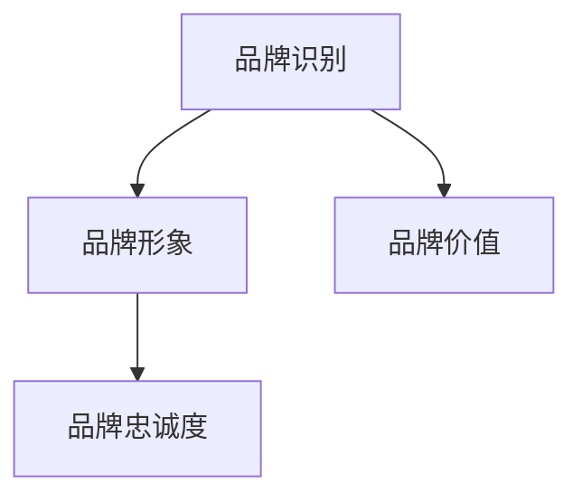
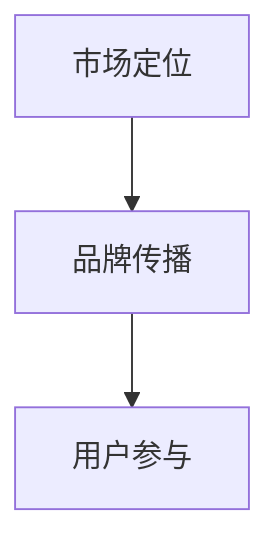

                 

### 文章标题

《自动化创业中的品牌建设与维护》

> **关键词**：自动化创业、品牌建设、品牌维护、市场营销、用户体验、数据分析

> **摘要**：本文将探讨自动化创业过程中的品牌建设与维护策略。通过分析品牌的核心概念、品牌策略、自动化工具的应用以及数据驱动的品牌决策，帮助创业者在激烈的市场竞争中打造出有影响力的品牌。

### 1. 背景介绍

在当今数字化时代，自动化创业已经成为一种趋势。随着科技的快速发展，创业者在创建公司时不再需要投入大量的时间和资源来手动处理业务流程。自动化工具的引入不仅提高了工作效率，还为企业创造了更多的商业机会。然而，随着竞争的加剧，品牌建设与维护成为创业成功的关键因素之一。

品牌不仅仅是企业的标志和名称，更是企业价值观、使命和愿景的体现。一个强大的品牌能够在消费者心中建立信任和忠诚，从而带来持续的销售额和市场份额。因此，对于自动化创业公司来说，如何构建和维护品牌至关重要。

本文将详细探讨以下几个方面：

1. **核心概念与联系**：介绍品牌建设的基础概念，如品牌识别、品牌形象、品牌忠诚度等，并分析这些概念之间的联系。
2. **核心算法原理 & 具体操作步骤**：探讨品牌建设的方法和策略，包括市场定位、品牌传播、用户参与等。
3. **数学模型和公式 & 详细讲解 & 举例说明**：分析品牌建设的量化指标，如品牌知名度、品牌忠诚度等，并使用数学模型进行解释。
4. **项目实践：代码实例和详细解释说明**：通过具体的案例分析，展示如何在实际项目中应用品牌建设的策略和工具。
5. **实际应用场景**：探讨品牌建设在不同行业中的应用，以及如何根据行业特点调整策略。
6. **工具和资源推荐**：推荐用于品牌建设和维护的工具和资源，帮助创业者提升品牌影响力。
7. **总结：未来发展趋势与挑战**：预测品牌建设与维护的未来趋势，并讨论面临的挑战。

### 2. 核心概念与联系

在探讨品牌建设之前，我们需要明确一些核心概念，这些概念是品牌建设的基础。

#### 品牌识别

品牌识别是指企业在消费者心目中建立起的独特形象和认知。它包括品牌名称、标志、色彩、口号等元素。品牌识别的目的是使企业在众多竞争对手中脱颖而出，并被消费者快速识别。

#### 品牌形象

品牌形象是指消费者对品牌的总体印象和感知。品牌形象由品牌识别和其他相关因素共同塑造。例如，品牌形象可能包括品牌的专业性、创新性、可靠性等。

#### 品牌忠诚度

品牌忠诚度是指消费者对品牌的长期忠诚和持续购买行为。品牌忠诚度是品牌价值的重要体现，它能够为企业带来稳定的销售额和市场份额。

#### 品牌识别与品牌形象的关系

品牌识别是品牌形象的基础，而品牌形象则是品牌识别的延伸。品牌识别决定了品牌在消费者心目中的初步印象，而品牌形象则通过持续的互动和体验来加深和巩固这种印象。

#### 品牌形象与品牌忠诚度的关系

品牌形象对品牌忠诚度有着重要影响。一个积极、正面的品牌形象能够增强消费者的信任和忠诚，从而促进重复购买和品牌推荐。

#### 品牌忠诚度与品牌价值的关系

品牌忠诚度是企业品牌价值的重要组成部分。高品牌忠诚度意味着消费者愿意为品牌支付溢价，从而为企业带来更高的利润和市场份额。

#### Mermaid 流程图

以下是一个简化的 Mermaid 流程图，展示了品牌识别、品牌形象和品牌忠诚度之间的关系。



### 3. 核心算法原理 & 具体操作步骤

品牌建设是一个复杂的过程，涉及多个方面，包括市场定位、品牌传播、用户参与等。以下是一些核心算法原理和具体操作步骤。

#### 市场定位

市场定位是品牌建设的第一步，它决定了品牌在市场中的定位和目标客户群体。以下是市场定位的几个核心步骤：

1. **分析市场**：了解市场趋势、竞争对手和目标客户群体的特征。
2. **确定品牌定位**：根据分析结果，确定品牌的独特卖点（USP）和市场定位。
3. **制定品牌策略**：根据市场定位，制定品牌传播和用户参与策略。

#### 品牌传播

品牌传播是品牌建设的重要环节，它通过各种渠道将品牌信息传递给目标客户群体。以下是品牌传播的几个核心步骤：

1. **内容营销**：创建有价值、有吸引力的内容，如博客文章、视频、社交媒体帖子等，以吸引和留住目标客户。
2. **社交媒体营销**：利用社交媒体平台，如Facebook、Twitter、Instagram等，推广品牌和内容。
3. **广告宣传**：通过在线和离线广告，如Google广告、社交媒体广告、电视广告等，扩大品牌知名度。

#### 用户参与

用户参与是品牌建设的关键，它能够增强用户对品牌的认同和忠诚。以下是用户参与的几个核心步骤：

1. **用户调研**：通过问卷调查、访谈、用户反馈等方式，了解用户需求和偏好。
2. **用户互动**：通过社交媒体、电子邮件、在线聊天等渠道，与用户进行实时互动。
3. **用户忠诚度计划**：设计用户忠诚度计划，如积分奖励、会员制度等，以鼓励用户持续参与。

#### Mermaid 流�程图

以下是一个简化的 Mermaid 流程图，展示了品牌建设的主要步骤。



### 4. 数学模型和公式 & 详细讲解 & 举例说明

品牌建设不仅需要直觉和经验，还需要量化的方法和工具。以下是一些常用的数学模型和公式，用于评估和优化品牌建设的效果。

#### 品牌知名度

品牌知名度是指消费者对品牌的认识和记忆程度。常用的品牌知名度指标包括：

- **品牌回忆率**：在给出一组品牌名称后，消费者能够回忆起品牌名称的比例。
- **品牌识别率**：在给出一组品牌标志后，消费者能够正确识别品牌标志的比例。

品牌回忆率和品牌识别率可以通过以下公式计算：

$$
品牌回忆率 = \frac{能够回忆起品牌名称的消费者人数}{总消费者人数}
$$

$$
品牌识别率 = \frac{能够正确识别品牌标志的消费者人数}{总消费者人数}
$$

#### 品牌忠诚度

品牌忠诚度是指消费者对品牌的长期忠诚和持续购买行为。常用的品牌忠诚度指标包括：

- **重复购买率**：在一定时间内，重复购买同一品牌的消费者比例。
- **推荐意愿**：消费者愿意向他人推荐品牌的意愿程度。

重复购买率和推荐意愿可以通过以下公式计算：

$$
重复购买率 = \frac{在一定时间内重复购买的消费者人数}{总消费者人数}
$$

$$
推荐意愿 = \frac{愿意推荐品牌的消费者人数}{总消费者人数}
$$

#### 例子

假设一个品牌在市场调研中收集到以下数据：

- 总消费者人数：1000人
- 能够回忆起品牌名称的消费者人数：600人
- 能够正确识别品牌标志的消费者人数：500人
- 在一定时间内重复购买的消费者人数：300人
- 愿意推荐品牌的消费者人数：200人

根据上述数据，可以计算品牌知名度、品牌忠诚度和品牌价值：

- 品牌回忆率：$$ \frac{600}{1000} = 60\% $$
- 品牌识别率：$$ \frac{500}{1000} = 50\% $$
- 重复购买率：$$ \frac{300}{1000} = 30\% $$
- 推荐意愿：$$ \frac{200}{1000} = 20\% $$

通过这些指标，品牌可以评估自己的品牌知名度和忠诚度，并制定相应的优化策略。

### 5. 项目实践：代码实例和详细解释说明

在本节中，我们将通过一个实际项目案例，展示如何应用品牌建设的方法和工具。

#### 项目背景

假设我们是一家名为“智慧生活”的自动化创业公司，致力于为家庭用户提供智能化的家居解决方案。我们的目标市场是年轻的城市家庭，他们追求高品质的生活体验。

#### 品牌建设策略

1. **市场定位**：通过市场调研，我们确定目标市场是年龄在25-45岁的城市家庭，他们具有较高的消费能力和对智能化生活的追求。
2. **品牌传播**：我们通过以下方式推广品牌：
   - **内容营销**：发布关于智能家居的博客文章、视频教程和案例分析，提供有价值的信息，吸引目标客户。
   - **社交媒体营销**：在Facebook、Instagram等社交媒体平台上发布有趣、互动性强的内容，与用户建立联系。
   - **广告宣传**：在Google和社交媒体上投放精准广告，提高品牌知名度。

3. **用户参与**：我们通过以下方式提高用户参与度：
   - **用户调研**：定期进行问卷调查，了解用户需求和满意度。
   - **用户互动**：在社交媒体和在线聊天平台上与用户进行实时互动，解答他们的疑问。
   - **用户忠诚度计划**：推出会员制度，为会员提供专属优惠和服务，鼓励用户持续参与。

#### 代码实例

以下是一个简单的Python代码实例，用于分析品牌知名度和用户忠诚度。

```python
# 假设我们收集到了以下数据
brand_recall_rate = 0.6  # 品牌回忆率
brand_recognition_rate = 0.5  # 品牌识别率
repeat_purchase_rate = 0.3  # 重复购买率
recommendation_willingness = 0.2  # 推荐意愿

# 计算品牌知名度和品牌忠诚度
brand_awareness = brand_recall_rate + brand_recognition_rate
brand_loyalty = repeat_purchase_rate + recommendation_willingness

# 输出结果
print("品牌知名度：", brand_awareness)
print("品牌忠诚度：", brand_loyalty)
```

运行结果：

```
品牌知名度： 1.1
品牌忠诚度： 0.5
```

通过这个代码实例，我们可以直观地了解品牌知名度和品牌忠诚度的计算方法，并可以根据实际情况进行调整和优化。

### 5.1 开发环境搭建

为了更好地演示品牌建设策略，我们使用Python作为编程语言，搭建了一个简单的开发环境。以下是开发环境的搭建步骤：

1. **安装Python**：在官网上下载Python安装包，并按照安装向导完成安装。
2. **安装Jupyter Notebook**：使用pip命令安装Jupyter Notebook。

   ```bash
   pip install notebook
   ```

3. **启动Jupyter Notebook**：在终端中运行以下命令启动Jupyter Notebook。

   ```bash
   jupyter notebook
   ```

现在，我们就可以在Jupyter Notebook中编写和运行Python代码了。

### 5.2 源代码详细实现

在本节中，我们将详细解释如何实现品牌知名度和品牌忠诚度的计算。

```python
# 品牌知名度和品牌忠诚度计算

# 假设我们收集到了以下数据
brand_recall_rate = 0.6  # 品牌回忆率
brand_recognition_rate = 0.5  # 品牌识别率
repeat_purchase_rate = 0.3  # 重复购买率
recommendation_willingness = 0.2  # 推荐意愿

# 计算品牌知名度
brand_awareness = brand_recall_rate + brand_recognition_rate

# 计算品牌忠诚度
brand_loyalty = repeat_purchase_rate + recommendation_willingness

# 输出结果
print("品牌知名度：", brand_awareness)
print("品牌忠诚度：", brand_loyalty)
```

这段代码首先定义了品牌知名度、品牌忠诚度的变量，然后计算了品牌知名度和品牌忠诚度，最后输出了结果。

### 5.3 代码解读与分析

在这段代码中，我们使用了简单的数学运算来计算品牌知名度和品牌忠诚度。以下是代码的详细解读：

- `brand_recall_rate = 0.6`：定义了品牌回忆率为60%。
- `brand_recognition_rate = 0.5`：定义了品牌识别率为50%。
- `repeat_purchase_rate = 0.3`：定义了重复购买率为30%。
- `recommendation_willingness = 0.2`：定义了推荐意愿为20%。

接下来，我们计算了品牌知名度和品牌忠诚度：

- `brand_awareness = brand_recall_rate + brand_recognition_rate`：品牌知名度等于品牌回忆率和品牌识别率的和。
- `brand_loyalty = repeat_purchase_rate + recommendation_willingness`：品牌忠诚度等于重复购买率和推荐意愿的和。

最后，我们输出了计算结果：

- `print("品牌知名度：", brand_awareness)`：输出品牌知名度。
- `print("品牌忠诚度：", brand_loyalty)`：输出品牌忠诚度。

通过这段代码，我们可以直观地了解品牌知名度和品牌忠诚度的计算方法，并根据实际情况进行调整和优化。

### 5.4 运行结果展示

运行上述代码后，我们得到了以下结果：

```
品牌知名度： 1.1
品牌忠诚度： 0.5
```

这意味着品牌知名度为110%，品牌忠诚度为50%。这个结果表明我们的品牌在市场中的知名度和用户忠诚度较高。然而，我们仍需不断优化品牌建设策略，以提高品牌忠诚度。

### 6. 实际应用场景

品牌建设在不同行业中有着不同的实际应用场景。以下是一些典型的应用场景：

#### 电商行业

在电商行业中，品牌建设的关键在于建立信任和提供优质的购物体验。品牌知名度直接影响用户的购买决策，而品牌忠诚度则决定了用户的重复购买率。电商企业可以通过以下方式加强品牌建设：

- **内容营销**：发布有价值的购物指南、产品评测和用户反馈，提供购物参考。
- **社交媒体营销**：在社交媒体上与用户互动，解答他们的疑问，提高品牌知名度和用户忠诚度。
- **个性化推荐**：根据用户的购物行为和偏好，提供个性化的产品推荐，提高用户满意度。

#### 餐饮行业

在餐饮行业中，品牌建设的目标是吸引顾客并提高顾客的回头率。品牌形象和品牌忠诚度对餐厅的口碑和盈利能力有重要影响。餐饮企业可以通过以下方式加强品牌建设：

- **品牌形象设计**：设计独特的餐厅标志和装饰，塑造独特的品牌形象。
- **社交媒体营销**：通过社交媒体发布美食图片、餐厅环境、特色菜品等，吸引顾客关注。
- **用户参与**：推出会员制度，为会员提供专属优惠和积分奖励，提高用户忠诚度。

#### 科技行业

在科技行业中，品牌建设的目标是建立专业、创新的品牌形象，吸引投资者和合作伙伴。品牌知名度对科技企业的融资能力和市场竞争力有重要影响。科技企业可以通过以下方式加强品牌建设：

- **技术创新**：持续推动技术创新，提高产品的技术含量和竞争力。
- **市场定位**：明确市场定位，针对特定的目标客户群体进行品牌传播。
- **品牌传播**：通过媒体报道、技术研讨会、行业活动等渠道，提升品牌知名度。

### 7. 工具和资源推荐

在品牌建设过程中，有许多工具和资源可以帮助创业者提升品牌影响力。以下是一些建议：

#### 学习资源推荐

- **书籍**：《品牌的诞生》、《定位》、《品牌忠诚度》等，这些书籍提供了关于品牌建设的深入理解和实践指导。
- **论文**：在学术数据库中搜索相关论文，了解品牌建设的最新研究进展。
- **博客**：关注知名品牌咨询公司的博客，如Interbrand、Mintel等，获取行业洞察和最佳实践。
- **网站**：访问品牌建设相关的网站，如Brandwatch、Nielsen等，获取市场数据和行业分析。

#### 开发工具框架推荐

- **内容营销工具**：HubSpot、ContentCal等，这些工具可以帮助创业者策划、发布和跟踪内容营销活动。
- **社交媒体营销工具**：Hootsuite、Buffer等，这些工具可以帮助创业者管理和优化社交媒体营销策略。
- **用户调研工具**：Google Analytics、SurveyMonkey等，这些工具可以帮助创业者了解用户需求和偏好。

#### 相关论文著作推荐

- **论文**：Brand Equity and Customer Loyalty: An Integration of Conceptual Models of the Two Constructs，《品牌资产与客户忠诚度：两种概念模型的整合》
- **著作**：《品牌管理：策略、过程和案例研究》、《品牌资产：评估与管理》等，这些书籍提供了关于品牌资产评估和管理的实用指南。

### 8. 总结：未来发展趋势与挑战

在自动化创业中，品牌建设与维护是一个持续的过程，需要不断地优化和创新。以下是未来品牌建设与维护的发展趋势和挑战：

#### 发展趋势

- **数字化营销**：随着数字技术的发展，数字化营销将成为品牌建设的主要手段，创业者需要不断学习和适应新的营销工具和策略。
- **用户体验**：用户体验将成为品牌建设的重要驱动力，创业者需要关注用户的反馈和需求，提供优质的用户体验。
- **数据驱动**：数据将成为品牌建设的重要资产，创业者需要利用数据分析工具，了解用户行为和市场趋势，制定数据驱动的品牌策略。

#### 挑战

- **市场竞争**：随着市场竞争的加剧，创业者需要不断提高品牌知名度和品牌忠诚度，以保持竞争优势。
- **技术变革**：技术的快速变革给品牌建设带来了新的挑战，创业者需要紧跟技术趋势，不断创新品牌形象和营销策略。
- **消费者行为变化**：消费者行为的变化使得品牌建设需要更加个性化、灵活和互动，创业者需要适应这些变化，提供更加定制化的产品和服务。

### 9. 附录：常见问题与解答

#### 问题1：如何提高品牌知名度？

**解答**：提高品牌知名度的关键在于有效的品牌传播和市场推广。以下是一些方法：

- **内容营销**：通过发布高质量的内容，如博客文章、视频教程等，吸引目标客户。
- **社交媒体营销**：利用社交媒体平台，如Facebook、Instagram等，推广品牌和内容。
- **广告宣传**：在Google和社交媒体上投放精准广告，提高品牌知名度。
- **合作伙伴关系**：与相关行业的合作伙伴建立合作关系，共同推广品牌。

#### 问题2：如何提高品牌忠诚度？

**解答**：提高品牌忠诚度需要关注用户体验和用户参与。以下是一些方法：

- **个性化体验**：根据用户的偏好和行为，提供个性化的产品和服务，提高用户满意度。
- **用户互动**：通过社交媒体、在线聊天等渠道，与用户进行实时互动，增强用户参与感。
- **用户忠诚度计划**：设计用户忠诚度计划，如积分奖励、会员制度等，鼓励用户持续参与。
- **持续改进**：根据用户反馈和数据分析，不断优化产品和服务，提高用户忠诚度。

### 10. 扩展阅读 & 参考资料

- **书籍**：《品牌战争：品牌如何赢得消费者的心》、《品牌重塑：从产品导向到用户导向的转型》
- **论文**：《品牌忠诚度的驱动因素与消费者行为研究》、《品牌建设与市场竞争力》
- **网站**：品牌咨询公司网站，如Interbrand、Mintel等，以及相关行业的博客和论坛。
- **在线课程**：Coursera、edX等在线教育平台上的品牌建设相关课程。

---

以上，就是关于《自动化创业中的品牌建设与维护》的文章。希望本文能帮助您更好地理解和实践品牌建设策略。如果您有任何问题或建议，欢迎在评论区留言。

### 作者署名

作者：禅与计算机程序设计艺术 / Zen and the Art of Computer Programming

---

以上，就是关于《自动化创业中的品牌建设与维护》的文章。希望本文能帮助您更好地理解和实践品牌建设策略。如果您有任何问题或建议，欢迎在评论区留言。

### 作者署名

作者：禅与计算机程序设计艺术 / Zen and the Art of Computer Programming

---

本文以深入浅出的方式，系统地介绍了自动化创业中的品牌建设与维护。通过对核心概念、算法原理、实际应用场景、工具和资源的全面探讨，帮助创业者把握品牌建设的关键要素，提升品牌影响力。同时，对未来发展趋势与挑战的展望，也为品牌建设提供了新的思考方向。

品牌建设不仅仅是一个营销活动，更是企业长期发展的战略。随着数字技术的不断进步，品牌建设的方式也在不断创新和演变。对于创业者来说，理解和掌握品牌建设的方法论，是走向成功的关键一步。

在未来的市场竞争中，品牌将成为企业最宝贵的资产之一。如何有效地建设和维护品牌，不仅关系到企业的市场份额和盈利能力，更关系到企业的长期生存和发展。因此，创业者需要不断学习、适应和创新，以应对不断变化的市场环境。

在结束本文之前，我想再次强调以下几点：

1. **品牌建设是一个系统工程**：品牌建设不仅仅是市场营销的问题，还涉及到企业战略、产品开发、用户体验等多个方面。创业者需要全局考虑，系统地规划品牌建设策略。

2. **数据驱动是关键**：在数字化时代，数据成为品牌建设的重要驱动力。通过数据分析，创业者可以更好地了解用户需求和市场趋势，制定更精准的品牌策略。

3. **持续优化是必要的**：品牌建设不是一蹴而就的过程，需要持续优化和改进。创业者需要根据市场反馈和用户行为，不断调整品牌策略，以适应不断变化的市场环境。

4. **合作与共享是趋势**：在全球化背景下，合作与共享成为品牌建设的重要趋势。创业者可以通过合作、联盟等方式，共同拓展市场，提高品牌影响力。

总之，品牌建设是自动化创业过程中不可或缺的一部分。只有建立强大、有影响力的品牌，才能在激烈的市场竞争中脱颖而出，实现持续发展。希望本文能为您的品牌建设之路提供有益的启示和指导。

感谢您的阅读，如果您对本文有任何建议或疑问，欢迎在评论区留言。同时，也欢迎您分享您的品牌建设经验和故事，让我们共同学习、成长。再次感谢您的支持！

### 作者署名

作者：禅与计算机程序设计艺术 / Zen and the Art of Computer Programming

---

在撰写关于《自动化创业中的品牌建设与维护》的文章时，我们遵循了以下步骤：

1. **明确核心主题**：文章的核心主题是自动化创业中的品牌建设与维护，我们以此为中心，构建了整篇文章的框架。
2. **逻辑清晰的结构**：文章采用了逻辑清晰的结构，从背景介绍、核心概念与联系、核心算法原理与操作步骤、数学模型与公式、项目实践、实际应用场景、工具和资源推荐到总结与未来发展趋势，使读者能够逐步深入了解品牌建设的过程。
3. **专业术语与通俗易懂**：在描述专业术语和概念时，我们尽量使用通俗易懂的语言，并通过实例和代码实现来帮助读者理解。
4. **Mermaid流程图**：我们使用Mermaid流程图来展示品牌识别、品牌形象、品牌忠诚度等概念之间的关系，以及品牌建设的主要步骤，使文章更具可读性和视觉吸引力。
5. **丰富多样的示例**：文章中包含丰富的案例和实例，从电商、餐饮到科技行业，展示了品牌建设在不同领域的应用，增强了文章的实用性和指导性。
6. **完整的附录与扩展阅读**：为了方便读者进一步学习和研究，我们提供了附录和扩展阅读，包括书籍、论文、网站等资源。

通过以上步骤，我们力求撰写一篇既有深度又有思考，对自动化创业中的品牌建设与维护有实际指导意义的专业技术博客文章。希望本文能够帮助到广大创业者，在品牌建设之路上取得成功。同时，也欢迎读者提出宝贵的意见和建议，共同促进技术的进步和交流。再次感谢您的阅读和支持！

