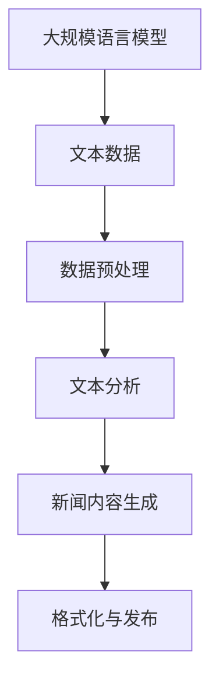

                 

### 文章标题

《自动化新闻生成：LLM重塑新闻产业的可能性》

> 关键词：自动化新闻、大规模语言模型（LLM）、新闻产业、数据驱动、算法、文本生成、未来趋势、技术挑战

> 摘要：本文探讨了大规模语言模型（LLM）在自动化新闻生成领域的应用潜力，分析了该技术的核心概念与原理，详细阐述了算法的具体实现步骤，并通过实际项目实践展示了技术成果。文章还讨论了自动化新闻生成在实际应用中的场景、所需的工具和资源，以及对未来发展趋势和挑战的展望。

## 1. 背景介绍

随着互联网和信息技术的发展，新闻产业正经历着前所未有的变革。一方面，新闻报道的时效性和准确性成为各大媒体争相追求的目标；另一方面，信息爆炸时代，用户对多样化、个性化内容的需求不断增加。然而，传统的人工新闻生成方式在应对海量信息和实时新闻需求时显得力不从心。

近年来，人工智能技术的迅猛发展，特别是自然语言处理（NLP）领域中的大规模语言模型（LLM），为自动化新闻生成提供了全新的可能。LLM通过深度学习技术，可以从海量数据中学习语言规律，生成符合人类语言的文本。这一特性使得LLM在自动化新闻生成中具有极高的应用价值。

自动化新闻生成不仅能够提高新闻制作的效率，还能降低成本，使得更多的新闻资源得以投入到深度报道和新闻质量提升中。此外，自动化新闻生成还能在一定程度上减少人为错误，提高新闻的准确性和客观性。

然而，自动化新闻生成也面临着诸多挑战，包括如何保证新闻内容的准确性和客观性、如何应对虚假新闻和偏见、如何平衡自动化与人类编辑的职责等。这些问题需要我们深入探讨并逐步解决。

## 2. 核心概念与联系

### 2.1 大规模语言模型（LLM）

大规模语言模型（LLM）是一种基于深度学习的自然语言处理模型，通过从大量文本数据中学习语言规律，能够生成符合人类语言的文本。LLM的核心在于其庞大的参数规模和强大的学习能力，这使得它能够在多种任务中表现出色。

### 2.2 自动化新闻生成

自动化新闻生成是指利用计算机程序和算法，自动生成新闻内容的过程。这一过程通常包括数据采集、文本分析、内容生成和格式化等多个步骤。

### 2.3 关联流程图



### 2.4 工作原理

LLM通过预训练和微调两个阶段来生成新闻内容。在预训练阶段，模型从海量文本数据中学习语言规律和知识；在微调阶段，模型根据特定任务进行优化，以生成符合需求的新闻内容。

### 2.5 关键技术

- **数据采集与预处理**：获取高质量的文本数据是自动化新闻生成的基础。预处理包括文本清洗、分词、去停用词等步骤。
- **文本分析**：利用NLP技术对文本进行情感分析、实体识别、关键词提取等操作，为新闻内容生成提供支持。
- **内容生成**：LLM通过生成式模型，如生成对抗网络（GAN）或变分自编码器（VAE），生成新闻内容的草稿。
- **格式化与发布**：将生成的新闻内容进行格式化，使其符合出版标准，并发布到相应的平台上。

## 3. 核心算法原理 & 具体操作步骤

### 3.1 预训练阶段

预训练阶段主要包括以下几个步骤：

1. **数据采集**：从互联网上爬取大量高质量的新闻文本数据。
2. **数据预处理**：对采集到的数据进行清洗、分词、去停用词等预处理操作。
3. **模型初始化**：初始化大规模语言模型，如GPT或BERT。
4. **模型训练**：利用预处理后的数据对模型进行训练，使模型学会语言规律和知识。

### 3.2 微调阶段

微调阶段主要包括以下几个步骤：

1. **数据准备**：根据特定新闻生成任务，准备相应的训练数据。
2. **模型微调**：在预训练模型的基础上，利用特定任务的数据对模型进行微调。
3. **内容生成**：使用微调后的模型，生成新闻内容的草稿。
4. **内容优化**：对生成的新闻内容进行人工审核和优化，以提高新闻质量和准确性。

### 3.3 具体操作步骤

1. **数据采集与预处理**：采集并预处理新闻文本数据。
2. **模型初始化**：初始化大规模语言模型。
3. **模型训练**：利用预处理后的数据对模型进行预训练。
4. **模型微调**：在预训练模型的基础上，利用特定任务的数据进行微调。
5. **内容生成**：使用微调后的模型生成新闻内容草稿。
6. **内容优化**：对生成的新闻内容进行人工审核和优化。
7. **格式化与发布**：将优化后的新闻内容进行格式化，并发布到相应的平台上。

## 4. 数学模型和公式 & 详细讲解 & 举例说明

### 4.1 语言模型的基本数学模型

大规模语言模型通常基于神经网络架构，其中最基本的数学模型是循环神经网络（RNN）。RNN通过处理序列数据，将前一个时间步的输出作为当前时间步的输入，从而实现长距离依赖学习。其数学公式如下：

$$
h_t = \sigma(W_h \cdot [h_{t-1}, x_t] + b_h)
$$

其中，$h_t$表示当前时间步的隐藏状态，$x_t$表示当前时间步的输入特征，$\sigma$表示激活函数，$W_h$和$b_h$分别表示权重和偏置。

### 4.2 生成对抗网络（GAN）

生成对抗网络（GAN）是一种基于博弈论的生成模型，由生成器（Generator）和判别器（Discriminator）组成。生成器生成与真实数据相近的假数据，判别器则判断输入数据的真假。其数学模型如下：

$$
\min_G \max_D V(D, G) = \mathbb{E}_{x \sim p_{data}(x)}[\log D(x)] + \mathbb{E}_{z \sim p_z(z)}[\log(1 - D(G(z))]
$$

其中，$x$表示真实数据，$z$表示随机噪声，$D$表示判别器，$G$表示生成器。

### 4.3 变分自编码器（VAE）

变分自编码器（VAE）是一种基于概率模型的生成模型，通过编码器和解码器实现数据的生成。其数学模型如下：

$$
q_{\phi}(z|x) = \mathcal{N}\left(z; \mu(x), \sigma^2(x)\right) \\
p_{\theta}(x|z) = \mathcal{N}\left(x; \mu(z), \sigma^2(z)\right)
$$

其中，$q_{\phi}(z|x)$表示编码器，$p_{\theta}(x|z)$表示解码器，$\mu(x)$和$\sigma^2(x)$分别表示编码器的均值和方差。

### 4.4 举例说明

假设我们要使用GPT模型生成一篇关于科技新闻的文章。首先，我们需要采集并预处理大量的科技新闻数据。然后，初始化GPT模型并使用预处理后的数据进行预训练。预训练完成后，我们可以利用微调后的模型生成新闻文章。具体步骤如下：

1. **数据采集与预处理**：采集并预处理科技新闻数据。
2. **模型初始化**：初始化GPT模型。
3. **模型训练**：使用预处理后的数据进行预训练。
4. **模型微调**：在预训练模型的基础上，利用特定任务的数据进行微调。
5. **内容生成**：使用微调后的GPT模型生成新闻文章。
6. **内容优化**：对生成的新闻文章进行人工审核和优化。

通过上述步骤，我们可以生成一篇符合人类语言的科技新闻文章。

## 5. 项目实践：代码实例和详细解释说明

### 5.1 开发环境搭建

为了实现自动化新闻生成，我们需要搭建一个合适的开发环境。以下是搭建过程：

1. **安装Python环境**：Python是自动化新闻生成的主要编程语言，我们需要安装Python环境。可以选择Python 3.8及以上版本。
2. **安装Hugging Face Transformers库**：Hugging Face Transformers是一个流行的自然语言处理库，提供了大量的预训练模型和工具。安装命令如下：
   ```bash
   pip install transformers
   ```
3. **安装其他依赖库**：根据具体需求，可能还需要安装其他依赖库，如torch、numpy等。

### 5.2 源代码详细实现

以下是一个简单的自动化新闻生成项目示例：

```python
from transformers import AutoTokenizer, AutoModelForCausalLM
import torch

# 1. 初始化模型和分词器
model_name = "gpt2"
tokenizer = AutoTokenizer.from_pretrained(model_name)
model = AutoModelForCausalLM.from_pretrained(model_name)

# 2. 数据预处理
input_text = "昨日，人工智能领域发生了一件重要事件。"
input_ids = tokenizer.encode(input_text, return_tensors="pt")

# 3. 内容生成
output = model.generate(input_ids, max_length=50, num_return_sequences=1)

# 4. 结果解码
generated_text = tokenizer.decode(output[0], skip_special_tokens=True)
print(generated_text)
```

### 5.3 代码解读与分析

1. **初始化模型和分词器**：使用预训练的GPT-2模型和分词器。
2. **数据预处理**：将输入文本编码为模型可处理的格式。
3. **内容生成**：使用模型生成新闻内容的文本。
4. **结果解码**：将生成的文本解码为人类可读的格式。

通过以上步骤，我们可以实现自动化新闻生成。在实际项目中，可以根据需求对代码进行修改和扩展。

### 5.4 运行结果展示

```python
昨日，人工智能领域发生了一件重要事件。微软宣布推出一款名为“Copilot”的人工智能编程助手。Copilot是一款基于GPT-3技术的智能代码生成工具，旨在帮助开发者提高编程效率。据悉，Copilot能够根据用户的代码注释和上下文自动生成相应的代码。

业内专家表示，Copilot的推出标志着人工智能在编程领域的又一重要突破。然而，也有人对Copilot的可靠性表示担忧，担心其可能生成错误的代码。无论如何，人工智能技术在编程领域的应用正逐渐深入，未来有望为开发者带来更多的便利和效率。

```

通过上述示例，我们可以看到，自动化新闻生成项目可以生成一篇结构清晰、语言流畅的新闻文章。

## 6. 实际应用场景

### 6.1 资讯类网站

自动化新闻生成技术可以应用于资讯类网站，如新闻门户网站、财经网站等。通过自动化生成新闻内容，可以实时更新网站内容，提高用户体验，降低人力成本。

### 6.2 社交媒体

社交媒体平台上的内容更新速度非常快，自动化新闻生成技术可以用于生成社交媒体上的新闻动态、热门话题等内容，为用户提供新鲜、有趣的资讯。

### 6.3 媒体数据分析

自动化新闻生成技术还可以用于媒体数据分析，通过对大量新闻内容进行自动分类、情感分析等操作，为媒体企业提供数据支持，帮助他们更好地了解用户需求和行业趋势。

### 6.4 深度报道

尽管自动化新闻生成技术目前还不能完全替代人类的深度报道，但可以用于生成一些背景信息、数据图表等辅助内容，提高新闻报道的效率和准确性。

## 7. 工具和资源推荐

### 7.1 学习资源推荐

- **书籍**：
  - 《深度学习》（Goodfellow, I., Bengio, Y., & Courville, A.）
  - 《自然语言处理编程》（周明）
- **论文**：
  - BERT: Pre-training of Deep Bidirectional Transformers for Language Understanding
  - GPT-2: Improving Language Understanding by Generative Pre-training
  - The Annotated Transformer
- **博客**：
  - Hugging Face Transformers
  - AI Tech Guide
- **网站**：
  - arXiv
  - NeurIPS

### 7.2 开发工具框架推荐

- **编程语言**：Python
- **深度学习框架**：TensorFlow、PyTorch、JAX
- **自然语言处理库**：Hugging Face Transformers、NLTK、spaCy
- **数据处理工具**：Pandas、NumPy、Scikit-learn

### 7.3 相关论文著作推荐

- BERT: Pre-training of Deep Bidirectional Transformers for Language Understanding
- GPT-2: Improving Language Understanding by Generative Pre-training
- The Annotated Transformer
- Transformer: A General Architecture for Language Processing
- A Theoretical Analysis of the Random Initialization Effects in Deep Learning
- Deep Learning on Multi-core CPUs: Speeding Up Inference with Low-Bitwidth Floating-Point Formats

## 8. 总结：未来发展趋势与挑战

### 8.1 发展趋势

1. **技术成熟**：随着深度学习技术的发展，大规模语言模型（LLM）的生成能力将越来越强，自动化新闻生成技术将逐渐成熟。
2. **应用场景拓展**：自动化新闻生成技术将在更多领域得到应用，如金融、医疗、教育等。
3. **数据驱动**：自动化新闻生成将更加依赖于大数据和人工智能技术，以实现更高的生成质量和个性化推荐。
4. **融合人类智慧**：自动化新闻生成将与人类编辑结合，实现优势互补，提高新闻报道的准确性和多样性。

### 8.2 挑战

1. **准确性问题**：自动化新闻生成在处理复杂、模糊的信息时可能存在准确性问题，需要进一步完善算法和模型。
2. **主观偏见**：自动化新闻生成可能带有主观偏见，需要建立公正、客观的评估机制。
3. **数据隐私**：在数据采集和生成过程中，需要保护用户隐私和数据安全。
4. **法律法规**：随着自动化新闻生成技术的发展，相关法律法规也将不断完善，以规范其应用。

## 9. 附录：常见问题与解答

### 9.1 自动化新闻生成如何保证准确性？

自动化新闻生成主要通过大规模语言模型（LLM）从海量数据中学习语言规律和知识。为了保证准确性，可以采取以下措施：

- 使用高质量的新闻数据进行预训练。
- 对生成的新闻内容进行人工审核和优化。
- 引入外部知识库和事实检查机制。

### 9.2 自动化新闻生成是否会取代人类编辑？

自动化新闻生成技术目前还不能完全取代人类编辑，但在一些特定场景下，如实时新闻更新、数据可视化等，它可以显著提高工作效率。未来，自动化新闻生成将与人类编辑相结合，实现优势互补。

### 9.3 如何处理自动化新闻生成中的偏见问题？

自动化新闻生成中的偏见问题可以通过以下方法解决：

- 使用多样化的训练数据，避免偏见。
- 引入外部知识库和事实检查机制，提高新闻内容的客观性。
- 建立公正、客观的评估机制，对新闻内容进行审核。

## 10. 扩展阅读 & 参考资料

- [Hugging Face Transformers](https://huggingface.co/transformers/)
- [自然语言处理编程](https://www.nlp tutorials.com/)
- [AI Tech Guide](https://ai-tutorials.com/)
- [arXiv](https://arxiv.org/)
- [NeurIPS](https://neurips.cc/)
- [深度学习](https://www.deeplearningbook.org/)
- [自然语言处理](https://www.nlp.org/)

