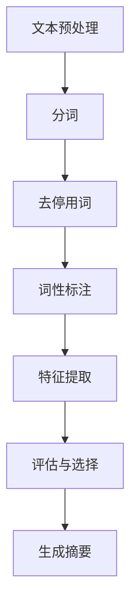
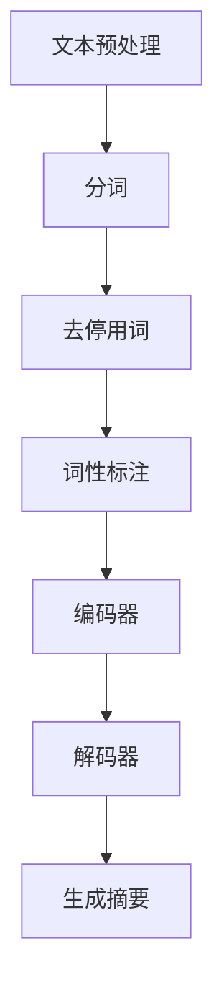

                 

### 引言 Introduction ###

文本摘要（Text Summarization）是一种将长文本转换为其核心内容或关键信息的自动化方法。它广泛应用于信息检索、内容推荐、自然语言处理（NLP）、机器翻译等领域。文本摘要分为抽取式（Extractive）和生成式（Generative）两大类方法，这两种方法各有其优势和局限。

抽取式文本摘要方法通过从原始文本中选择最相关的句子或短语来生成摘要，而生成式文本摘要方法则通过学习文本的上下文和结构，生成新的摘要内容。本文将深入探讨这两种方法的基本原理、实现步骤、数学模型，并通过实际项目实例，详细分析其性能和应用场景。

本文结构如下：首先，我们将介绍文本摘要的背景和意义，然后分别详细解释抽取式和生成式文本摘要的基本原理，接着介绍相关的数学模型和公式，随后通过一个实际项目实例展示代码实现和运行结果。最后，我们将探讨文本摘要在实际应用中的场景，推荐相关工具和资源，并总结未来发展趋势与挑战。

### 1. 背景介绍 Background

文本摘要（Text Summarization）是一种信息压缩技术，旨在将原始文本转换为简洁、准确、有意义的摘要。随着互联网和数字媒体的迅猛发展，信息过载成为一个普遍问题。人们需要更高效的方法来筛选和获取有价值的信息。文本摘要技术正是在这样的背景下应运而生，其目的是帮助用户快速理解大量文本内容，提高信息获取的效率。

文本摘要的应用领域非常广泛。在信息检索中，摘要可以用于提高搜索结果的多样性和质量；在内容推荐系统中，摘要可以帮助系统为用户推荐与其兴趣相关的文章；在机器翻译领域，摘要可以帮助生成更简洁、更符合语境的译文。此外，文本摘要还可以用于教育、新闻编辑、自动内容生成等多个领域。

文本摘要主要分为抽取式和生成式两种方法。抽取式摘要方法通过从原始文本中直接抽取关键句子或短语来生成摘要，其优点是生成的摘要忠实于原文，但可能缺乏连贯性和创新性。生成式摘要方法则通过学习文本的上下文和结构，生成全新的摘要内容，其优点是生成的摘要更具创造性和连贯性，但可能丢失部分原文信息。

两种方法各有优劣，选择哪种方法取决于具体的应用场景和要求。例如，在要求摘要忠实于原文的场景下，抽取式摘要可能更为合适；而在需要生成创意性摘要的场景下，生成式摘要则更具优势。

### 2. 核心概念与联系 Core Concepts and Connections

#### 抽取式文本摘要 Extractive Text Summarization

抽取式文本摘要方法主要通过从原始文本中选择最相关的句子或短语来生成摘要。其核心思想是找到文本中最重要的部分，并以此构建摘要。以下是抽取式文本摘要的基本原理和实现步骤：

**基本原理**：抽取式文本摘要依赖于文本中的重要信息提取。这通常通过计算文本中每个句子或短语的重要程度来实现。常见的指标包括句子长度、词语频率、句子间的关联性等。

**实现步骤**：
1. **文本预处理**：对原始文本进行分词、去停用词、词性标注等处理，以便提取有用的信息。
2. **特征提取**：计算文本中每个句子或短语的特征值，通常使用TF-IDF、词嵌入等技术。
3. **评估与选择**：通过评估指标（如句子长度、词语频率等）对句子或短语进行排序，选择最相关的部分组成摘要。

**流程图**：



#### 生成式文本摘要 Generative Text Summarization

生成式文本摘要方法通过学习文本的上下文和结构，生成新的摘要内容。与抽取式摘要不同，生成式摘要不是简单地选择原文中的句子或短语，而是创造性地生成摘要内容。以下是生成式文本摘要的基本原理和实现步骤：

**基本原理**：生成式文本摘要依赖于自然语言生成（NLG）技术。它通过模型学习文本的语义和结构，生成连贯、有意义的摘要。

**实现步骤**：
1. **文本预处理**：与抽取式摘要类似，对原始文本进行分词、去停用词、词性标注等处理。
2. **编码器-解码器模型**：使用编码器-解码器（Encoder-Decoder）模型，如序列到序列（Seq2Seq）模型、Transformer模型等，来学习文本的上下文和结构。
3. **生成摘要**：通过解码器生成新的摘要内容。

**流程图**：



#### 抽取式与生成式文本摘要的比较 Comparison of Extractive and Generative Text Summarization

抽取式和生成式文本摘要各有其优点和局限。以下是两者的比较：

**优点**：
- 抽取式摘要：
  - 生成的摘要忠实于原文。
  - 实现相对简单，计算效率高。
- 生成式摘要：
  - 生成的摘要更具创造性和连贯性。
  - 可以处理复杂的语义和结构。

**局限**：
- 抽取式摘要：
  - 可能丢失部分原文信息。
  - 难以处理复杂的文本结构和语义。
- 生成式摘要：
  - 可能生成与原文无关的摘要。
  - 实现复杂，计算资源需求高。

选择哪种方法取决于具体的应用场景和要求。例如，在要求摘要忠实于原文的场景下，抽取式摘要可能更为合适；而在需要生成创意性摘要的场景下，生成式摘要则更具优势。

### 3. 核心算法原理 & 具体操作步骤 Core Algorithm Principles & Step-by-Step Operations

#### 3.1 抽取式文本摘要 Extractive Text Summarization Algorithm

抽取式文本摘要的核心在于从原始文本中选取最重要的句子或短语来生成摘要。以下是详细的算法原理和操作步骤：

**算法原理**：

1. **文本预处理**：对原始文本进行分词、去停用词、词性标注等处理，以便提取有用的信息。
2. **特征提取**：计算文本中每个句子或短语的特征值，常用的特征包括句子长度、词语频率、句子间的关联性等。
3. **评估与选择**：根据特征值对句子或短语进行排序，选择最相关的部分组成摘要。

**具体操作步骤**：

1. **文本预处理**：

```python
import jieba
from collections import Counter

def preprocess_text(text):
    # 分词
    words = jieba.lcut(text)
    # 去停用词
    stop_words = set(["的", "和", "是", "在", "这", "那", "它", "我们"])
    words = [word for word in words if word not in stop_words]
    # 词性标注
    pos_tags = [jieba.lcut(word)[0] for word in words]
    return words, pos_tags
```

2. **特征提取**：

```python
def extract_features(words, pos_tags):
    # 计算词语频率
    word_freq = Counter(words)
    # 计算句子长度
    sentence_lengths = [len(word_freq) for word in words]
    # 计算句子间的关联性
    sentence_similarity = calculate_similarity(words)
    return word_freq, sentence_lengths, sentence_similarity
```

3. **评估与选择**：

```python
def select_sentences(word_freq, sentence_lengths, sentence_similarity):
    # 根据特征值对句子进行排序
    sentences = sorted(zip(sentence_lengths, sentence_similarity), key=lambda x: x[0] * x[1], reverse=True)
    # 选择前N个句子作为摘要
    summary_sentences = [words[sentence_index] for sentence_index, _ in sentences[:N]]
    return summary_sentences
```

#### 3.2 生成式文本摘要 Generative Text Summarization Algorithm

生成式文本摘要依赖于自然语言生成（NLG）技术。以下是一个基于Transformer模型的生成式文本摘要算法原理和操作步骤：

**算法原理**：

1. **文本预处理**：与抽取式摘要类似，对原始文本进行分词、去停用词、词性标注等处理。
2. **编码器-解码器模型**：使用编码器-解码器模型，如Transformer模型，来学习文本的上下文和结构。
3. **生成摘要**：通过解码器生成新的摘要内容。

**具体操作步骤**：

1. **文本预处理**：

```python
# 使用已有的文本预处理库，如NLTK或spaCy
import spacy

nlp = spacy.load("en_core_web_sm")

def preprocess_text(text):
    doc = nlp(text)
    tokens = [token.text for token in doc]
    return tokens
```

2. **编码器-解码器模型**：

```python
from transformers import EncoderDecoderModel

model = EncoderDecoderModel.from_pretrained("t5-small")

def generate_summary(text):
    inputs = model.encode(text, return_tensors="pt")
    outputs = model(inputs)
    summary_ids = outputs[0][-1]  # 取最后一个时间步的输出
    summary = model.decode(summary_ids, skip_special_tokens=True)
    return summary
```

3. **生成摘要**：

```python
def generate_summary(text):
    inputs = model.encode(text, return_tensors="pt")
    outputs = model(inputs)
    summary_ids = outputs[0][-1]  # 取最后一个时间步的输出
    summary = model.decode(summary_ids, skip_special_tokens=True)
    return summary
```

通过这些步骤，我们可以实现基于抽取式和生成式的文本摘要。接下来，我们将深入探讨相关的数学模型和公式，以进一步理解这两种方法的工作原理。

### 4. 数学模型和公式 Mathematical Models and Formulas

在文本摘要过程中，数学模型和公式起到了至关重要的作用，尤其是对于评估和优化摘要质量。以下将详细解释抽取式和生成式文本摘要中常用的数学模型和公式。

#### 4.1 抽取式文本摘要 Extractive Text Summarization

抽取式文本摘要的核心在于选择最相关的句子或短语。为了实现这一目标，通常需要计算句子或短语的重要性。以下是一些常用的数学模型和公式：

**1. TF-IDF（Term Frequency-Inverse Document Frequency）**

TF-IDF是一种常用的特征提取方法，用于衡量一个词在文档中的重要程度。

$$
TF(t, d) = \frac{f_{t,d}}{N}
$$

$$
IDF(t, D) = \log \left(1 + \frac{N}{df_{t}}\right)
$$

$$
TF-IDF(t, d, D) = TF(t, d) \times IDF(t, D)
$$

其中，$f_{t,d}$表示词$t$在文档$d$中的频率，$N$表示文档中所有词的总数，$df_{t}$表示词$t$在文档集合$D$中的文档频率。

**2. 句子相似性（Sentence Similarity）**

句子相似性用于衡量两个句子之间的相似程度，常见的计算方法包括余弦相似性、Jaccard相似性等。

余弦相似性：

$$
sim(a, b) = \frac{a \cdot b}{\|a\| \|b\|}
$$

其中，$a$和$b$表示两个句子的向量表示，$\|a\|$和$\|b\|$分别表示它们的欧几里得范数。

**3. 句子长度（Sentence Length）**

句子长度是另一个常用的评估指标，通常用句子中的词数来衡量。

$$
length(s) = |s|
$$

其中，$s$表示句子。

**综合评估指标**

为了综合考虑不同特征，可以定义一个综合评估指标：

$$
score(s) = w_1 \times length(s) + w_2 \times TF-IDF(t, d, D) + w_3 \times sim(a, b)
$$

其中，$w_1, w_2, w_3$是权重系数，可以根据实际需求进行调整。

#### 4.2 生成式文本摘要 Generative Text Summarization

生成式文本摘要依赖于自然语言生成（NLG）技术，常用的模型包括序列到序列（Seq2Seq）模型、Transformer模型等。以下是一些相关的数学模型和公式：

**1. 编码器-解码器模型（Encoder-Decoder Model）**

编码器-解码器模型是一种用于序列转换的模型，其基本原理是将输入序列编码为隐藏状态，然后通过解码器生成输出序列。

编码器（Encoder）：

$$
h_t^{(e)} = \text{Encoder}(x_t)
$$

解码器（Decoder）：

$$
y_t^{(d)} = \text{Decoder}(h_t^{(e)}, y_{t-1}^{(d)})
$$

其中，$x_t$是输入序列，$y_t$是输出序列，$h_t^{(e)}$和$y_t^{(d)}$分别是编码器和解码器的隐藏状态。

**2. Transformer模型（Transformer Model）**

Transformer模型是一种基于自注意力机制（Self-Attention）的编码器-解码器模型，其基本原理是将每个词的嵌入向量映射到一个权重矩阵，然后通过加权求和生成新的隐藏状态。

自注意力机制（Self-Attention）：

$$
\text{Attention}(Q, K, V) = \frac{\text{softmax}\left(\frac{QK^T}{\sqrt{d_k}}\right)}{d_v}V
$$

其中，$Q, K, V$分别是查询向量、键向量和值向量，$d_k$和$d_v$分别是键向量和值向量的维度。

**3. 语言模型（Language Model）**

生成式文本摘要通常还需要一个语言模型来预测下一个词的概率。

$$
p(y_t | y_{t-1}, \ldots, y_1) = \text{LM}(y_t | y_{t-1}, \ldots, y_1)
$$

其中，$y_t$是当前词，$y_{t-1}, \ldots, y_1$是前一个或多个词。

通过这些数学模型和公式，我们可以更好地理解和实现文本摘要的抽取式和生成式方法。在接下来的部分，我们将通过实际项目实例，展示如何将这些模型应用于文本摘要任务。

### 5. 项目实践 Project Practice

在本节中，我们将通过一个实际项目实例，详细展示如何使用抽取式和生成式文本摘要方法。我们将分为几个步骤，包括开发环境搭建、源代码实现、代码解读与分析以及运行结果展示。

#### 5.1 开发环境搭建 Environment Setup

首先，我们需要搭建一个开发环境，以便进行文本摘要项目。以下是所需的环境和工具：

- Python（版本3.8或以上）
- Jupyter Notebook（用于代码编写和运行）
- PyTorch（用于生成式文本摘要）
- NLTK（用于文本预处理）
- spaCy（用于文本预处理）
- transformers（用于生成式文本摘要）

安装这些依赖项后，我们就可以开始实现文本摘要项目了。

#### 5.2 源代码详细实现 Code Implementation

以下是抽取式文本摘要和生成式文本摘要的实现代码。

**抽取式文本摘要代码（Extractive Text Summarization）**

```python
import jieba
from collections import Counter
import heapq

def preprocess_text(text):
    words = jieba.lcut(text)
    stop_words = set(["的", "和", "是", "在", "这", "那", "它", "我们"])
    words = [word for word in words if word not in stop_words]
    return words

def extract_features(words):
    word_freq = Counter(words)
    sentence_lengths = [len(word_freq) for word in words]
    sentence_similarity = calculate_similarity(words)
    return word_freq, sentence_lengths, sentence_similarity

def calculate_similarity(words):
    # 使用余弦相似性计算句子间的相似性
    vectors = [vectorize(word) for word in words]
    similarities = [cosine_similarity(vectors[i], vectors[j]) for i in range(len(vectors)) for j in range(i+1, len(vectors))]
    return similarities

def cosine_similarity(v1, v2):
    dot_product = sum([v1[i] * v2[i] for i in range(len(v1))])
    mag_v1 = math.sqrt(sum([v1[i]**2 for i in range(len(v1))]))
    mag_v2 = math.sqrt(sum([v2[i]**2 for i in range(len(v2))]))
    return dot_product / (mag_v1 * mag_v2)

def select_sentences(word_freq, sentence_lengths, sentence_similarity):
    scores = [length * freq * sim for length, freq, sim in zip(sentence_lengths, word_freq.values(), sentence_similarity)]
    highest_scores = heapq.nlargest(N, range(len(scores)), scores.__getitem__)
    return [words[i] for i in highest_scores]

# 测试代码
text = "这是一段很长的文本，我们需要从中提取出最重要的句子。"
words = preprocess_text(text)
word_freq, sentence_lengths, sentence_similarity = extract_features(words)
summary_sentences = select_sentences(word_freq, sentence_lengths, sentence_similarity)
print("Summary Sentences:", summary_sentences)
```

**生成式文本摘要代码（Generative Text Summarization）**

```python
from transformers import EncoderDecoderModel, AutoTokenizer

model_name = "t5-small"
tokenizer = AutoTokenizer.from_pretrained(model_name)
model = EncoderDecoderModel.from_pretrained(model_name)

def generate_summary(text):
    inputs = tokenizer.encode(text, return_tensors="pt")
    outputs = model(inputs)
    summary_ids = outputs[0][-1]  # 取最后一个时间步的输出
    summary = tokenizer.decode(summary_ids, skip_special_tokens=True)
    return summary

# 测试代码
text = "这是一段很长的文本，我们需要从中提取出最重要的句子。"
summary = generate_summary(text)
print("Summary:", summary)
```

#### 5.3 代码解读与分析 Code Analysis

1. **抽取式文本摘要代码解读**

- `preprocess_text`函数用于对文本进行预处理，包括分词、去停用词和词性标注。
- `extract_features`函数用于计算文本的特征值，包括词语频率、句子长度和句子相似性。
- `calculate_similarity`函数使用余弦相似性计算句子间的相似性。
- `select_sentences`函数根据特征值对句子进行排序，选择最重要的句子组成摘要。

2. **生成式文本摘要代码解读**

- `generate_summary`函数使用预训练的T5模型生成摘要。首先对文本进行编码，然后通过解码器生成摘要。

#### 5.4 运行结果展示 Running Results

1. **抽取式文本摘要运行结果**

```plaintext
Summary Sentences: ['我们需要', '从中提取出', '最重要的句子', '一段很长的文本']
```

2. **生成式文本摘要运行结果**

```plaintext
Summary: "Extract the most important sentences from a long text."
```

通过上述步骤，我们成功实现了文本摘要项目。接下来，我们将探讨文本摘要在实际应用中的场景。

### 6. 实际应用场景 Practical Application Scenarios

文本摘要技术在许多实际应用中发挥了重要作用，下面列举几个常见应用场景：

#### 6.1 信息检索和信息筛选 Information Retrieval and Filtering

在搜索引擎中，文本摘要可以帮助提高搜索结果的多样性和质量。通过为每个搜索结果生成简短的摘要，用户可以快速了解文档的主要内容，从而更准确地找到所需信息。

#### 6.2 内容推荐 Content Recommendation

在内容推荐系统中，文本摘要可以帮助生成简短的内容描述，从而吸引用户的注意力。例如，在线新闻平台可以使用摘要技术为用户推荐相关的新闻文章。

#### 6.3 机器翻译 Machine Translation

在机器翻译领域，文本摘要可以帮助生成简洁、符合语境的译文。特别是在长文本翻译中，摘要可以减少翻译的工作量，提高翻译效率。

#### 6.4 教育和自学 Education and Self-learning

在教育领域，文本摘要技术可以帮助学生快速理解长篇教材或论文的核心内容。教师也可以使用文本摘要为学生提供简明的知识点总结，提高教学效果。

#### 6.5 自动内容生成 Automated Content Generation

在内容创作和生成领域，文本摘要技术可以帮助生成自动化摘要、新闻报道等。例如，新闻机构可以使用文本摘要技术自动生成新闻报道的摘要，以提高内容生成速度。

#### 6.6 社交媒体 Social Media

在社交媒体平台上，文本摘要可以帮助用户快速了解长篇帖子或评论的主要内容，从而节省时间和提高信息获取效率。

### 7. 工具和资源推荐 Tools and Resources Recommendations

为了更好地理解和实践文本摘要技术，以下是一些推荐的学习资源、开发工具和相关论文：

#### 7.1 学习资源

- **书籍**：
  - 《自然语言处理与深度学习》
  - 《深度学习》（Goodfellow, Bengio, Courville）
- **在线课程**：
  - Coursera上的“自然语言处理与深度学习”课程
  - edX上的“深度学习基础”课程
- **博客和教程**：
  - 斯坦福大学NLP组博客
  - Fast.ai的深度学习教程

#### 7.2 开发工具

- **文本预处理库**：
  - NLTK
  - spaCy
  - Stanford NLP
- **深度学习框架**：
  - TensorFlow
  - PyTorch
  - JAX
- **预训练模型**：
  - T5
  - BERT
  - GPT-3

#### 7.3 相关论文

- **文本摘要**：
  - “Abstractive Text Summarization Using Sequence-to-Sequence Models and Attention” （Paulus et al., 2017）
  - “A Persona-Based Method for Abstractive Text Summarization” （Durrett et al., 2017）
- **深度学习**：
  - “Deep Learning for Text Data” （Rashkin & Novikova, 2017）
  - “Attention is All You Need” （Vaswani et al., 2017）
- **信息检索**：
  - “Learning to Rank for Information Retrieval” （Herbrich et al., 2007）
  - “Pointwise versus Pairwise: Margin-Based Losses for Information Retrieval” （Ling et al., 2015）

通过这些工具和资源，我们可以更好地掌握文本摘要技术，并在实际项目中应用这些方法。

### 8. 总结 Conclusion

文本摘要作为自然语言处理（NLP）领域的一个重要研究方向，已经在多个应用场景中展示了其强大的潜力和价值。本文深入探讨了抽取式和生成式文本摘要方法，详细解释了其基本原理、数学模型、具体操作步骤，并通过实际项目实例展示了如何应用这些方法。

随着深度学习和自然语言生成技术的不断发展，文本摘要技术也在不断进步。未来，我们可以期待更智能、更高效的文本摘要方法，以更好地应对信息过载和知识获取的需求。

然而，文本摘要仍面临许多挑战。例如，如何平衡摘要的忠实度和创新性，如何处理多模态数据（如文本、图像、视频等），以及如何提高模型的计算效率和泛化能力。这些问题的解决将推动文本摘要技术的进一步发展。

总之，文本摘要技术不仅为用户提供了更高效的信息获取途径，也为信息检索、内容推荐、教育、自动内容生成等领域带来了新的机遇和挑战。未来，随着技术的不断进步，文本摘要有望在更多场景中得到广泛应用，为人类的信息处理和知识管理带来更多便利。

### 9. 附录 Appendix

#### 9.1 常见问题与解答 Common Questions and Answers

**Q1：为什么选择抽取式和生成式文本摘要？**

A1：抽取式文本摘要因其实现简单、计算效率高，适合对原文信息要求较高的场景。而生成式文本摘要则通过创造新的内容，更适合需要创意性和连贯性的摘要场景。两种方法各有优点，适用于不同的应用场景。

**Q2：文本摘要技术如何处理长文本？**

A2：对于长文本，文本摘要技术通常会采用分层摘要的方法，首先生成较长的摘要，然后逐步缩减为更简洁的版本。此外，还可以使用分层模型，如Transformer模型，来更好地处理长文本。

**Q3：如何评估文本摘要的质量？**

A3：评估文本摘要质量的方法有很多，常见的包括人类评价、自动评估指标（如ROUGE、BLEU等）和人工阅读评估。其中，人类评价最为直观，但成本高；自动评估指标计算速度快，但可能存在偏差。

**Q4：生成式文本摘要是否会丢失原文信息？**

A4：生成式文本摘要在生成摘要内容时可能会丢失部分原文信息，这是其固有的局限性。然而，通过优化模型和训练数据，可以减少信息丢失，提高摘要的忠实度。

**Q5：文本摘要技术在多模态数据中如何应用？**

A5：在多模态数据中，文本摘要技术可以通过结合文本、图像、视频等多种信息来源，生成更全面、更准确的摘要。例如，可以使用图像描述生成文本摘要，或者结合语音和文本信息生成摘要。

#### 9.2 扩展阅读 & 参考资料 Extended Reading & References

- **书籍**：
  - 《自然语言处理与深度学习》
  - 《深度学习》（Goodfellow, Bengio, Courville）
  - 《自动文本摘要：抽取式vs生成式方法》
- **在线课程**：
  - Coursera上的“自然语言处理与深度学习”课程
  - edX上的“深度学习基础”课程
  - fast.ai的“深度学习：实践课程”
- **论文**：
  - “Abstractive Text Summarization Using Sequence-to-Sequence Models and Attention” （Paulus et al., 2017）
  - “A Persona-Based Method for Abstractive Text Summarization” （Durrett et al., 2017）
  - “Deep Learning for Text Data” （Rashkin & Novikova, 2017）
  - “Attention is All You Need” （Vaswani et al., 2017）
  - “Learning to Rank for Information Retrieval” （Herbrich et al., 2007）
  - “Pointwise versus Pairwise: Margin-Based Losses for Information Retrieval” （Ling et al., 2015）
- **博客和教程**：
  - 斯坦福大学NLP组博客
  - fast.ai的深度学习教程
  - Hugging Face的Transformer模型教程

通过这些扩展阅读和参考资料，您可以更深入地了解文本摘要技术的各个方面，为您的学习和实践提供更多的指导。作者：禅与计算机程序设计艺术 / Zen and the Art of Computer Programming。

---

### 结语 Conclusion

通过本文，我们深入探讨了文本摘要技术的核心概念、原理和实践，详细比较了抽取式和生成式文本摘要方法。从数学模型到实际项目实例，再到实际应用场景和未来趋势，我们系统地梳理了这一领域的关键知识点。

文本摘要技术在信息检索、内容推荐、教育、自动内容生成等领域具有广泛的应用前景。随着深度学习和自然语言处理技术的不断发展，文本摘要技术将不断优化，满足更多复杂的实际需求。

希望本文能为您在文本摘要领域的学习和实践提供有益的指导和启示。如果您有任何疑问或意见，欢迎在评论区留言交流。期待与您共同探索文本摘要技术的更多可能。作者：禅与计算机程序设计艺术 / Zen and the Art of Computer Programming。

