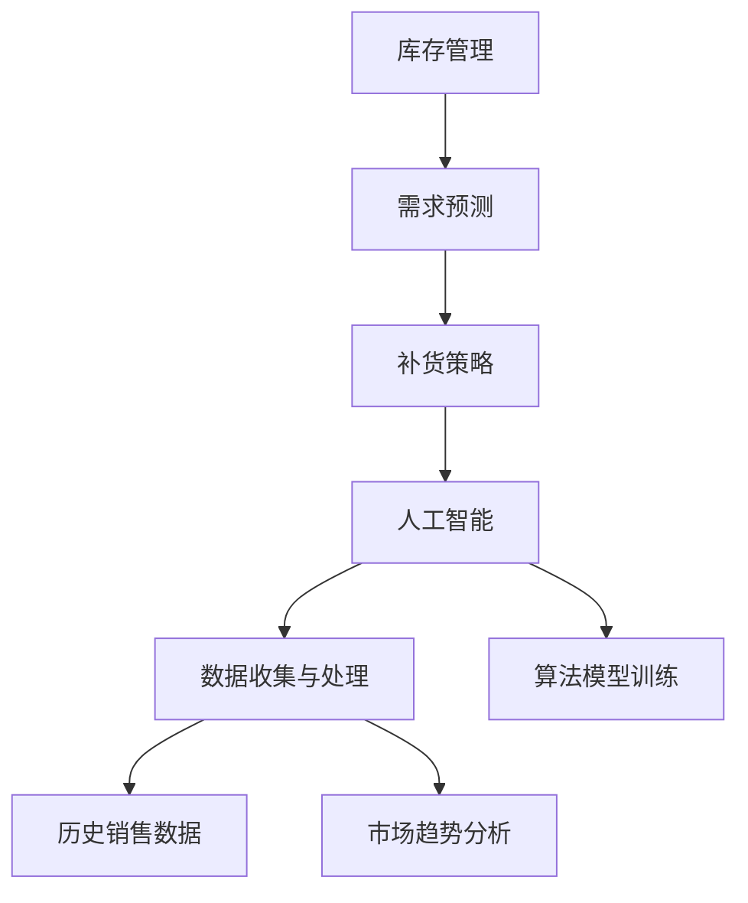

                 

### 文章标题

### 自动补货：AI如何确保库存充足

#### 关键词：自动补货、库存管理、人工智能、深度学习、机器学习、数据挖掘、预测算法

#### 摘要：
本文将探讨自动补货系统如何通过人工智能技术确保库存充足，以降低运营成本并提高客户满意度。我们将从背景介绍开始，逐步深入探讨核心概念、算法原理、数学模型、项目实践以及实际应用场景，最后总结未来发展趋势与挑战。

### 1. 背景介绍

库存管理是企业运营的核心环节之一。传统的库存管理依赖于人工经验和历史数据，往往难以应对市场波动和需求变化。随着电子商务的迅猛发展，库存管理变得更加复杂和重要。在这种背景下，人工智能（AI）技术的应用逐渐成为热点。

AI技术，特别是机器学习和深度学习，能够从大量历史数据中提取有价值的信息，预测未来的需求变化，从而实现自动补货。这不仅能够降低库存成本，还能够提高客户满意度，减少缺货风险。

本文将重点探讨AI技术在自动补货系统中的应用，分析其核心算法原理、数学模型，并通过实际项目实例展示其效果。

### 2. 核心概念与联系

要理解自动补货系统的工作原理，我们需要先了解以下几个核心概念：

- **库存管理**：库存管理涉及库存水平、库存周转率、库存周转时间等指标，旨在确保库存既不过剩也不短缺。

- **需求预测**：需求预测是通过历史销售数据、市场趋势等因素，预测未来某一时间段内的需求量。

- **补货策略**：补货策略决定了何时、如何补货，以保持库存水平在合理范围内。

- **人工智能**：人工智能是模拟人类智能的技术，包括机器学习、深度学习、自然语言处理等。

下面是一个Mermaid流程图，展示了自动补货系统的核心概念和联系：



### 3. 核心算法原理 & 具体操作步骤

自动补货系统的核心在于需求预测算法。以下是一种常用的基于机器学习的需求预测算法——时间序列分析。

#### 3.1 时间序列分析

时间序列分析是一种分析时间序列数据的方法，用于识别数据中的趋势、季节性和周期性。其主要步骤如下：

1. **数据预处理**：对历史销售数据进行清洗，去除异常值和噪声。

   $$ \text{数据清洗} = \text{原始数据} \cup \{\text{异常值}, \text{噪声}\} $$

2. **特征提取**：提取时间序列数据中的特征，如趋势、季节性和周期性。

   $$ \text{特征提取} = \text{趋势特征} \cup \{\text{季节性特征}, \text{周期性特征}\} $$

3. **模型训练**：使用提取到的特征训练机器学习模型，如ARIMA（自回归积分滑动平均模型）或LSTM（长短时记忆网络）。

   $$ \text{模型训练} = \text{特征数据} \rightarrow \text{模型参数} $$

4. **预测**：使用训练好的模型预测未来某一时间段的需求量。

   $$ \text{需求预测} = \text{模型参数} \times \text{特征数据} $$

#### 3.2 时间序列分析算法实例

我们以LSTM模型为例，介绍具体的操作步骤。

1. **数据收集与预处理**：

   收集过去一年的销售数据，包括销售量、日期等。对数据进行清洗，去除异常值和噪声。

2. **特征提取**：

   提取时间序列数据中的趋势、季节性和周期性特征。

3. **模型训练**：

   使用提取到的特征训练LSTM模型。具体步骤如下：

   - **输入层**：输入历史销售数据。
     $$ \text{输入层} = \{\text{销售量}_{t-1}, \text{销售量}_{t-2}, ..., \text{销售量}_{1}\} $$
   - **隐藏层**：隐藏层由多个神经元组成，用于处理时间序列数据的趋势、季节性和周期性。
     $$ \text{隐藏层} = \{\text{神经元}_{1}, \text{神经元}_{2}, ..., \text{神经元}_{n}\} $$
   - **输出层**：输出层预测未来某一时间段的需求量。
     $$ \text{输出层} = \{\text{需求量}_{t+1}, \text{需求量}_{t+2}, ..., \text{需求量}_{n}\} $$

4. **预测**：

   使用训练好的LSTM模型预测未来某一时间段的需求量。

### 4. 数学模型和公式 & 详细讲解 & 举例说明

#### 4.1 LSTM模型数学原理

LSTM（长短时记忆网络）是一种用于处理时间序列数据的深度学习模型。其核心在于能够记忆长期依赖关系。

LSTM模型包含输入门、遗忘门和输出门三个门控机制。

1. **输入门**：

   输入门决定哪些信息应该被存储在细胞状态中。

   $$ \text{输入门} = \sigma(\text{输入向量} \odot \text{遗忘门权重} + \text{前一个隐藏层状态} \odot \text{遗忘门权重}) $$

2. **遗忘门**：

   遗忘门决定哪些信息应该从细胞状态中遗忘。

   $$ \text{遗忘门} = \sigma(\text{输入向量} \odot \text{遗忘门权重} + \text{前一个隐藏层状态} \odot \text{遗忘门权重}) $$

3. **输出门**：

   输出门决定哪些信息应该输出。

   $$ \text{输出门} = \sigma(\text{输入向量} \odot \text{输出门权重} + \text{前一个隐藏层状态} \odot \text{输出门权重}) $$

#### 4.2 举例说明

假设我们有一个销售数据集，包括过去一年的销售量和日期。我们需要使用LSTM模型预测未来三个月的需求量。

1. **数据预处理**：

   - **数据清洗**：去除异常值和噪声。

     $$ \text{清洗数据} = \{\text{销售量}_{1}, \text{销售量}_{2}, ..., \text{销售量}_{n}\} $$

   - **特征提取**：提取趋势、季节性和周期性特征。

     $$ \text{特征提取} = \{\text{趋势特征}_{1}, \text{季节性特征}_{1}, ..., \text{周期性特征}_{1}\} $$

2. **模型训练**：

   - **输入层**：输入历史销售数据。

     $$ \text{输入层} = \{\text{销售量}_{t-1}, \text{销售量}_{t-2}, ..., \text{销售量}_{1}\} $$

   - **隐藏层**：隐藏层由多个神经元组成，用于处理时间序列数据的趋势、季节性和周期性。

     $$ \text{隐藏层} = \{\text{神经元}_{1}, \text{神经元}_{2}, ..., \text{神经元}_{n}\} $$

   - **输出层**：输出层预测未来三个月的需求量。

     $$ \text{输出层} = \{\text{需求量}_{t+1}, \text{需求量}_{t+2}, ..., \text{需求量}_{n}\} $$

3. **预测**：

   使用训练好的LSTM模型预测未来三个月的需求量。

### 5. 项目实践：代码实例和详细解释说明

#### 5.1 开发环境搭建

为了实现自动补货系统，我们需要搭建一个适合开发的环境。以下是所需的工具和步骤：

1. **工具**：

   - Python 3.8 或更高版本
   - TensorFlow 2.x
   - Keras 2.x

2. **步骤**：

   - 安装Python和pip。

     ```bash
     pip install tensorflow
     pip install keras
     ```

   - 安装必要的库。

     ```bash
     pip install numpy
     pip install pandas
     ```

#### 5.2 源代码详细实现

下面是自动补货系统的源代码实现。代码主要分为四个部分：数据预处理、模型训练、预测和结果分析。

```python
import numpy as np
import pandas as pd
from keras.models import Sequential
from keras.layers import LSTM, Dense, Dropout
from sklearn.preprocessing import MinMaxScaler
from sklearn.model_selection import train_test_split

# 5.2.1 数据预处理
def preprocess_data(data):
    # 数据清洗
    data = data.dropna()

    # 特征提取
    data['trend'] = data['sales'].diff().dropna()
    data['seasonality'] = data['sales'].rolling(window=12).mean().diff().dropna()
    data['cycle'] = data['sales'].rolling(window=30).mean().diff().dropna()

    # 数据标准化
    scaler = MinMaxScaler()
    data_scaled = scaler.fit_transform(data[['trend', 'seasonality', 'cycle']])

    return data_scaled

# 5.2.2 模型训练
def train_model(data):
    # 切分训练集和测试集
    X_train, X_test, y_train, y_test = train_test_split(data, test_size=0.2, shuffle=False)

    # 构建LSTM模型
    model = Sequential()
    model.add(LSTM(units=50, return_sequences=True, input_shape=(X_train.shape[1], 1)))
    model.add(Dropout(0.2))
    model.add(LSTM(units=50, return_sequences=False))
    model.add(Dropout(0.2))
    model.add(Dense(units=1))

    # 编译模型
    model.compile(optimizer='adam', loss='mean_squared_error')

    # 训练模型
    model.fit(X_train, y_train, epochs=100, batch_size=32, validation_data=(X_test, y_test), verbose=2)

    return model

# 5.2.3 预测
def predict(model, data):
    # 预测
    predicted_sales = model.predict(data)
    predicted_sales = scaler.inverse_transform(predicted_sales)

    return predicted_sales

# 5.2.4 结果分析
def analyze_results(actual_sales, predicted_sales):
    # 计算均方误差（MSE）
    mse = np.mean((actual_sales - predicted_sales) ** 2)
    print(f'MSE: {mse}')

    # 绘制实际销售和预测销售对比图
    plt.plot(actual_sales, label='Actual Sales')
    plt.plot(predicted_sales, label='Predicted Sales')
    plt.legend()
    plt.show()

# 5.3.1 主程序
if __name__ == '__main__':
    # 加载数据
    data = pd.read_csv('sales_data.csv')

    # 数据预处理
    data_scaled = preprocess_data(data)

    # 模型训练
    model = train_model(data_scaled)

    # 预测
    predicted_sales = predict(model, data_scaled)

    # 结果分析
    analyze_results(data['sales'], predicted_sales)
```

#### 5.3 代码解读与分析

1. **数据预处理**：

   数据预处理是自动补货系统的关键步骤。首先，我们使用Pandas库加载数据，然后进行数据清洗，去除异常值和噪声。接着，我们提取时间序列数据中的趋势、季节性和周期性特征，并使用MinMaxScaler进行数据标准化。

2. **模型训练**：

   在模型训练部分，我们使用Keras库构建LSTM模型。首先，我们定义输入层，然后添加两个LSTM层和两个Dropout层以防止过拟合。最后，我们添加输出层，并编译模型。接着，我们使用训练集训练模型，并使用测试集进行验证。

3. **预测**：

   在预测部分，我们使用训练好的LSTM模型对数据进行预测。首先，我们使用模型预测销售量，然后使用MinMaxScaler进行反标准化，得到实际预测销售量。

4. **结果分析**：

   在结果分析部分，我们计算均方误差（MSE），以评估模型的性能。然后，我们绘制实际销售和预测销售的对比图，以便直观地展示模型的效果。

### 6. 实际应用场景

自动补货系统在电子商务、制造业、零售业等多个领域都有广泛的应用。以下是一些实际应用场景：

1. **电子商务**：电商平台使用自动补货系统，可以根据用户行为和购买历史预测商品需求，从而确保库存充足，减少缺货风险。

2. **制造业**：制造企业使用自动补货系统，可以根据生产计划、原材料库存等数据预测原材料需求，优化生产流程，降低库存成本。

3. **零售业**：零售企业使用自动补货系统，可以根据销售数据、季节性因素等预测商品需求，优化库存管理，提高客户满意度。

### 7. 工具和资源推荐

#### 7.1 学习资源推荐

- **书籍**：

  - 《深度学习》（Deep Learning）—— Ian Goodfellow、Yoshua Bengio、Aaron Courville 著

  - 《Python深度学习》（Deep Learning with Python）—— François Chollet 著

- **论文**：

  - “Long Short-Term Memory” —— Sepp Hochreiter、Jürgen Schmidhuber 著

  - “A Theoretically Grounded Application of Dropout in Recurrent Neural Networks” —— Yarin Gal、Zoubin Ghahramani 著

- **博客**：

  - [Keras 官方文档](https://keras.io/)
  
  - [TensorFlow 官方文档](https://www.tensorflow.org/)

#### 7.2 开发工具框架推荐

- **工具**：

  - TensorFlow：用于构建和训练深度学习模型的强大工具。

  - Keras：基于TensorFlow的深度学习高级API。

- **框架**：

  - TensorFlow.js：在浏览器中运行深度学习模型。

  - PyTorch：另一个流行的深度学习框架。

### 8. 总结：未来发展趋势与挑战

自动补货系统在人工智能技术的推动下取得了显著成果，但仍然面临一些挑战。以下是一些未来发展趋势与挑战：

- **趋势**：

  - 多模型集成：结合多种预测模型，提高预测准确性。

  - 实时预测：实现实时需求预测，提高库存周转效率。

  - 智能供应链：将自动补货系统与供应链管理系统整合，实现全流程智能管理。

- **挑战**：

  - 数据质量：高质量的数据是准确预测的基础，但数据质量往往难以保证。

  - 模型可解释性：深度学习模型往往缺乏可解释性，难以理解预测结果的来源。

  - 计算资源：训练和部署深度学习模型需要大量计算资源，尤其是大规模数据集。

### 9. 附录：常见问题与解答

#### 9.1 什么是LSTM？

LSTM（长短时记忆网络）是一种用于处理时间序列数据的深度学习模型，具有记忆长期依赖关系的能力。

#### 9.2 自动补货系统的优势是什么？

自动补货系统的优势包括降低库存成本、提高客户满意度、减少缺货风险等。

#### 9.3 如何提高自动补货系统的预测准确性？

提高自动补货系统的预测准确性可以从以下几个方面入手：

- 多模型集成：结合多种预测模型，提高预测准确性。

- 特征工程：提取更多有价值的特征，提高模型性能。

- 数据质量：确保数据质量，去除异常值和噪声。

### 10. 扩展阅读 & 参考资料

- 《深度学习》（Deep Learning）—— Ian Goodfellow、Yoshua Bengio、Aaron Courville 著

- 《Python深度学习》（Deep Learning with Python）—— François Chollet 著

- [Keras 官方文档](https://keras.io/)

- [TensorFlow 官方文档](https://www.tensorflow.org/)

- [LSTM模型详解](https://www.deeplearning.net/tutorial/lstm.html)

- [自动补货系统案例研究](https://www.analyticsvidhya.com/blog/2019/09/auto-replenishment-systems-explained-with-python/)

以上，就是我们关于自动补货系统的探讨。希望对您有所帮助。作者：禅与计算机程序设计艺术 / Zen and the Art of Computer Programming。

