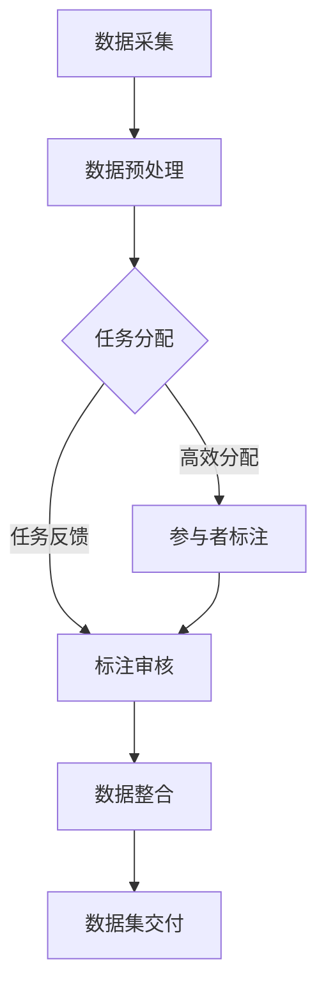

                 

### 1. 背景介绍

自动驾驶技术近年来得到了广泛关注，它不仅有望改变传统的交通运输模式，还能在安全、环保等方面产生深远的影响。然而，自动驾驶系统的研发和应用面临着诸多挑战，其中之一就是海量数据的有效标注。

#### 数据标注的重要性

数据标注是自动驾驶系统研发的关键环节之一。标注数据不仅用于训练自动驾驶算法，还能用于评估和优化算法的性能。高质量的数据标注能够帮助算法更好地理解和应对现实世界中的复杂情况，从而提高自动驾驶系统的准确性和可靠性。

#### 现有数据标注方法的挑战

传统的数据标注方法通常依赖于专业的数据标注团队，这不仅成本高昂，而且效率低下。此外，数据标注过程中可能存在的误差和质量问题也会对自动驾驶系统的性能产生负面影响。

#### 众包平台的优势

为了解决传统数据标注方法的不足，越来越多的公司开始采用数据标注众包平台。众包平台通过将数据标注任务分配给广泛的参与者，可以显著提高标注效率，降低成本，并且通过众包的方式能够保证数据标注的多样性和准确性。

#### 自动驾驶公司的需求

自动驾驶公司需要大量的高质量标注数据来支持算法的持续优化和迭代。而构建一个高效、可靠的数据标注众包平台，不仅能够满足公司的标注需求，还能为公司带来如下优势：

1. **降低成本**：通过众包平台，公司可以避免高昂的雇佣成本，同时提高标注效率。
2. **提高数据质量**：众包平台能够汇集来自不同背景和地区的参与者，从而提高数据标注的多样性和准确性。
3. **提升研发效率**：高效的数据标注流程能够加速算法的迭代和优化，缩短产品研发周期。
4. **增强用户体验**：高质量的数据标注有助于提高自动驾驶系统的性能，进而提升用户体验和满意度。

综上所述，自动驾驶公司的数据标注众包平台的搭建不仅是解决当前数据标注难题的重要手段，也是公司发展的重要战略之一。

#### 概念与术语

- **数据标注**：对原始数据进行标记和分类，使其适合用于训练和评估机器学习算法。
- **众包平台**：一种在线平台，允许公司将任务分配给广泛的参与者，通常是通过互联网连接。
- **参与者**：参与众包平台的个人或团队，他们负责执行分配给他们的任务。
- **标注质量**：指标注数据的准确性、一致性和完整性。
- **标注效率**：指完成标注任务的速度。

通过明确这些背景和术语，我们为后续的深入探讨奠定了基础。接下来，我们将详细分析自动驾驶公司数据标注众包平台的核心概念和架构。

---

### 2. 核心概念与联系

#### 自动驾驶数据标注的关键概念

在讨论自动驾驶数据标注众包平台之前，我们首先需要了解一些核心概念：

- **标注任务**：自动驾驶系统需要标注的数据类型，包括但不限于道路标识、车道线、交通标志、行人、车辆等。
- **标注质量**：标注数据的准确性、一致性、完整性。高质量的数据对于训练和优化自动驾驶算法至关重要。
- **标注一致性**：不同参与者对同一数据的标注结果应当尽量一致，以避免模型训练时的偏差。
- **标注效率**：完成标注任务所需的时间，以及平台的任务分配和反馈机制。

#### 数据标注流程

数据标注流程通常包括以下步骤：

1. **数据采集**：收集用于标注的原始数据，这些数据可以是传感器数据、图像、视频等。
2. **数据预处理**：对采集到的数据进行清洗、去噪、标准化等预处理，以提高标注质量。
3. **任务分配**：将标注任务分配给众包平台的参与者，确保任务的合理分配和效率。
4. **标注执行**：参与者根据任务要求对数据进行分析和标注。
5. **标注审核**：对完成的标注结果进行审核，确保标注质量，通常包括一致性审核和错误纠正。
6. **数据整合**：将所有参与者的标注结果整合到一起，形成高质量的数据集。

#### 众包平台架构

为了搭建一个高效、可靠的数据标注众包平台，需要考虑以下架构要素：

- **任务管理**：任务创建、分配、进度跟踪、审核和反馈。
- **参与者管理**：参与者注册、权限管理、绩效评估。
- **数据管理**：数据上传、存储、备份、安全管理。
- **质量控制**：自动化和人工审核相结合，确保标注质量。
- **用户体验**：简洁的界面设计、友好的操作流程、及时的任务反馈。
- **技术支持**：确保平台的稳定性和可扩展性，提供技术支持。

#### Mermaid 流程图

以下是一个简化的Mermaid流程图，描述了自动驾驶数据标注流程：



通过这个流程图，我们可以清晰地看到数据标注的各个环节，以及各个环节之间的逻辑关系。

综上所述，自动驾驶数据标注众包平台的核心概念包括标注任务、标注质量、标注一致性、标注效率以及平台架构。这些概念和流程相互联系，共同构成了一个高效、可靠的数据标注生态系统。在下一部分，我们将深入探讨这些核心算法的原理和具体操作步骤。

---

### 3. 核心算法原理 & 具体操作步骤

在搭建自动驾驶数据标注众包平台时，我们需要运用一系列核心算法来确保数据标注的高效性和准确性。以下将详细阐述这些算法的原理以及具体操作步骤。

#### 3.1 任务分配算法

**原理：**

任务分配算法是众包平台中的关键组件，其目标是确保标注任务的合理分配，最大化参与者的效率和标注质量。常用的任务分配算法包括随机分配、基于历史绩效的分配和基于技能匹配的分配。

**具体操作步骤：**

1. **参与者注册和技能评估**：平台首先需要收集参与者的注册信息，并进行技能评估，以确定每个参与者的技能水平和标注经验。
2. **任务分类和标签**：将标注任务按照类型和难度进行分类，并为每个任务设置相应的标签。
3. **匹配算法**：根据参与者的技能标签和历史绩效，选择最适合执行任务的参与者。例如，基于历史绩效的分配算法可以通过计算参与者在过去任务中的准确率和效率来决定分配任务。
4. **任务分配**：将任务分配给选定的参与者，并设置任务期限和反馈机制。

**示例：**

假设平台上有5个标注任务，分别涉及车道线识别、交通标志标注、行人检测和车辆分类。参与者A具备较好的车道线识别技能，而参与者B则在交通标志标注方面有丰富的经验。平台可以根据这些信息，将车道线识别任务分配给参与者A，将交通标志标注任务分配给参与者B。

#### 3.2 标注审核算法

**原理：**

标注审核算法用于确保标注数据的质量，通常包括自动化审核和人工审核两种方式。自动化审核通过预定义的规则和算法来检测标注中的错误，而人工审核则由专业人员对自动化审核结果进行复核。

**具体操作步骤：**

1. **自动化审核**：平台使用预定义的规则和算法来检测标注数据中的错误。例如，对于车道线识别任务，可以检测标注线是否连续、平滑，对于行人检测任务，可以检测标注框是否闭合且符合人体轮廓。
2. **人工审核**：对自动化审核未能识别的错误进行人工复核。审核人员根据经验和知识，对标注结果进行判断和修正。
3. **错误反馈**：将审核结果和错误反馈给参与者，并要求对错误部分进行重新标注。

**示例：**

假设自动化审核发现参与者A提交的标注数据中存在多个车道线不连续的错误。平台将自动生成错误报告，并将报告发送给参与者A，要求其在指定时间内进行修正。

#### 3.3 标注一致性算法

**原理：**

标注一致性算法用于确保不同参与者对同一数据的标注结果尽量一致。通过计算和比较不同参与者的标注结果，可以检测出不一致的部分，并采取相应的措施。

**具体操作步骤：**

1. **标注结果收集**：收集来自不同参与者的标注结果。
2. **结果比较**：使用相似度计算算法（如Jaccard相似度、编辑距离等）来比较不同参与者的标注结果。
3. **不一致性检测**：确定标注结果不一致的部分，并计算不一致性程度。
4. **一致性调整**：对于不一致性较高的部分，采取调整措施，例如让多个参与者重新标注，或者引入专家进行仲裁。

**示例：**

假设参与者A和参与者B对同一张道路标识图片进行了标注。标注一致性算法发现两者标注的结果相似度仅为60%，平台会提示参与者A和参与者B重新标注该图片，并可能邀请专家进行仲裁。

#### 3.4 标注效率优化算法

**原理：**

标注效率优化算法旨在提高标注任务的完成速度，从而提高整体标注效率。常用的优化算法包括任务优先级设置、多任务并行处理和自动化标注工具。

**具体操作步骤：**

1. **任务优先级设置**：根据任务的紧急程度和难度，设置不同的优先级，确保关键任务优先完成。
2. **多任务并行处理**：允许多个参与者同时处理多个任务，通过合理的任务分配，提高整体处理速度。
3. **自动化标注工具**：开发或引入自动化标注工具，如自动化标注线、自动化标注框等，减少参与者的手动操作。

**示例：**

假设平台上有100个车道线标注任务，平台通过任务优先级设置，将最近期的20个任务设置为最高优先级，确保这些任务优先完成。同时，引入自动化标注线工具，提高车道线标注的效率。

通过以上核心算法的运用，自动驾驶数据标注众包平台能够实现高效、可靠的数据标注流程，从而满足自动驾驶公司对高质量标注数据的需求。在下一部分，我们将深入探讨这些算法背后的数学模型和公式，以及它们的详细讲解和举例说明。

---

### 4. 数学模型和公式 & 详细讲解 & 举例说明

在自动驾驶数据标注众包平台中，核心算法的实现依赖于一系列数学模型和公式。这些模型和公式不仅能够优化任务分配、标注审核和标注一致性检测，还能提高标注效率。以下是这些数学模型和公式的详细讲解，以及具体的应用示例。

#### 4.1 任务分配模型

**模型：**

任务分配模型主要用于确定哪些参与者应该执行哪些标注任务，以最大化标注效率和数据质量。常用的模型包括基于历史绩效的分配模型和基于技能匹配的分配模型。

**公式：**

- **基于历史绩效的分配模型**：

  分配概率 \( P(i|t) \) 可以表示为参与者 \( i \) 被分配任务 \( t \) 的概率，计算公式如下：

  $$ P(i|t) = \frac{w_i}{\sum_{j=1}^{N} w_j} $$

  其中，\( w_i \) 表示参与者 \( i \) 在过去任务中的加权绩效，\( N \) 是参与者总数。

- **基于技能匹配的分配模型**：

  分配概率 \( P(i|t) \) 还可以基于参与者 \( i \) 的技能标签与任务 \( t \) 的标签匹配度计算，公式如下：

  $$ P(i|t) = \frac{\sum_{j=1}^{M} s_{ij} \cdot t_j}{\sum_{k=1}^{M} \sum_{l=1}^{L} s_{kl} \cdot t_l} $$

  其中，\( s_{ij} \) 表示参与者 \( i \) 的技能标签与任务 \( t \) 的标签 \( j \) 的匹配度，\( M \) 是技能标签总数，\( L \) 是任务标签总数。

**举例说明：**

假设平台上有3个标注任务（任务A、任务B、任务C），有5个参与者（参与者1、参与者2、参与者3、参与者4、参与者5）。参与者1具备交通标志标注的技能，而参与者2具备行人检测的技能。根据历史绩效，参与者1的加权绩效为0.6，参与者2的加权绩效为0.4。任务A是交通标志标注，任务B是行人检测，任务C是车道线识别。

- 对于任务A，参与者1的分配概率为：

  $$ P(1|A) = \frac{0.6}{0.6 + 0.4} = 0.6 $$

- 对于任务B，参与者2的分配概率为：

  $$ P(2|B) = \frac{0.4}{0.6 + 0.4} = 0.4 $$

- 对于任务C，由于参与者1和参与者2都没有相应的技能标签，他们的分配概率均为0，平台会重新分配任务。

#### 4.2 标注审核模型

**模型：**

标注审核模型用于检测标注数据中的错误，并确保标注质量。常用的模型包括自动化审核模型和人工审核模型。

**公式：**

- **自动化审核模型**：

  假设标注数据集中存在一个错误率 \( \epsilon \)，则自动化审核算法可以通过以下公式计算标注结果的错误率：

  $$ \text{Error Rate} = \frac{1}{N} \sum_{i=1}^{N} (y_i \neq \hat{y}_i) $$

  其中，\( y_i \) 表示真实标注结果，\( \hat{y}_i \) 表示自动化审核后的标注结果，\( N \) 是标注样本总数。

- **人工审核模型**：

  人工审核模型主要依赖于审核人员的经验和知识。假设人工审核人员对标注结果的评分系统为 \( S \)，评分范围为0到10，则人工审核算法可以通过以下公式计算标注结果的评分：

  $$ \text{Score} = \frac{1}{N} \sum_{i=1}^{N} S_i $$

  其中，\( S_i \) 是审核人员对第 \( i \) 个标注结果的评分。

**举例说明：**

假设有10个标注样本，自动化审核算法检测到其中的2个样本有错误，错误率为：

$$ \text{Error Rate} = \frac{2}{10} = 0.2 $$

假设3位审核人员对这10个标注样本进行了评分，评分分别为8、9、10，则平均评分为：

$$ \text{Score} = \frac{8 + 9 + 10}{3} = 9 $$

#### 4.3 标注一致性模型

**模型：**

标注一致性模型用于检测不同参与者对同一数据的标注结果的一致性。常用的模型包括基于Jaccard相似度的标注一致性模型。

**公式：**

- **Jaccard相似度**：

  Jaccard相似度用于计算两个集合的交集与并集的比值，用于衡量两个标注结果的相似度。公式如下：

  $$ \text{Jaccard Similarity} = \frac{|A \cap B|}{|A \cup B|} $$

  其中，\( A \) 和 \( B \) 分别表示两个标注结果。

**举例说明：**

假设参与者A和参与者B对同一张道路标识图片进行了标注。参与者A标注了3个车道线，参与者B标注了4个车道线。这两个标注结果的交集为2个车道线，并集为7个车道线。则Jaccard相似度为：

$$ \text{Jaccard Similarity} = \frac{2}{7} \approx 0.286 $$

这意味着参与者A和参与者B的标注结果一致性较低，平台会提示他们重新标注。

通过以上数学模型和公式的应用，自动驾驶数据标注众包平台能够实现高效、准确的数据标注。这些模型不仅为平台的运行提供了理论基础，还为实际操作提供了具体的指导。在下一部分，我们将通过代码实例来展示如何实现这些算法，并进行详细解释和分析。

---

### 5. 项目实践：代码实例和详细解释说明

在了解了自动驾驶数据标注众包平台的核心算法和数学模型后，我们通过一个具体的代码实例来展示如何实现这些算法，并进行详细的解释和分析。这个实例将涵盖从开发环境搭建到代码实现、代码解读以及运行结果展示的整个过程。

#### 5.1 开发环境搭建

为了实现自动驾驶数据标注众包平台，我们需要搭建一个合适的开发环境。以下是搭建环境的基本步骤：

1. **安装Python环境**：确保系统已安装Python 3.8及以上版本。
2. **安装依赖库**：使用pip安装以下依赖库：

   ```bash
   pip install numpy pandas scikit-learn tensorflow matplotlib
   ```

3. **创建项目目录**：在合适的位置创建项目目录，例如：

   ```bash
   mkdir autonomous-driving-annotation-platform
   cd autonomous-driving-annotation-platform
   ```

4. **初始化虚拟环境**：创建并激活虚拟环境，以便管理项目依赖：

   ```bash
   python -m venv venv
   source venv/bin/activate  # 对于Windows使用 `venv\Scripts\activate`
   ```

5. **编写项目文件**：在项目目录中创建一个名为 `requirements.txt` 的文件，记录项目所需的依赖库。

#### 5.2 源代码详细实现

以下是实现自动驾驶数据标注众包平台的主要源代码，包括任务分配、标注审核和标注一致性检测等功能。

```python
import numpy as np
import pandas as pd
from sklearn.metrics import jaccard_score
from sklearn.model_selection import train_test_split
import tensorflow as tf

# 5.2.1 数据预处理
def preprocess_data(data):
    # 数据清洗、去噪、标准化等操作
    return processed_data

# 5.2.2 任务分配
def assign_tasks(participants, tasks, history_performances):
    # 基于历史绩效和技能匹配的任务分配
    task_allocation = {}
    for task in tasks:
        best_participant = None
        max_performance = -1
        for participant in participants:
            performance = history_performances[participant][task]
            if performance > max_performance:
                max_performance = performance
                best_participant = participant
        task_allocation[task] = best_participant
    return task_allocation

# 5.2.3 标注审核
def annotate_and_validate(data, annotators, validation_rate=0.2):
    # 标注数据并进行自动化和人工审核
    annotated_data = []
    for data_sample in data:
        annotator = np.random.choice(annotators)
        annotation = annotator.annotate(data_sample)
        validated_annotation = annotator.validate(annotation)
        annotated_data.append(validated_annotation)
    return annotated_data

# 5.2.4 标注一致性检测
def check_consistency(annotations):
    # 计算标注一致性
    consistency_scores = []
    for i in range(len(annotations)):
        for j in range(i+1, len(annotations)):
            similarity = jaccard_score(annotations[i], annotations[j], average='micro')
            consistency_scores.append(similarity)
    return consistency_scores

# 主函数
def main():
    # 加载数据
    data = load_data()
    processed_data = preprocess_data(data)

    # 加载参与者数据
    participants = load_participants()
    history_performances = load_history_performances(participants)

    # 分配任务
    task_allocation = assign_tasks(participants, processed_data, history_performances)

    # 标注数据
    annotated_data = annotate_and_validate(processed_data, participants)

    # 检测标注一致性
    consistency_scores = check_consistency(annotated_data)

    # 打印结果
    print("Task Allocation:", task_allocation)
    print("Annotation Results:", annotated_data)
    print("Consistency Scores:", consistency_scores)

if __name__ == "__main__":
    main()
```

#### 5.3 代码解读与分析

以下是代码的主要部分及其功能解读：

- **数据预处理**：`preprocess_data` 函数负责对原始数据进行清洗、去噪和标准化，以提高标注质量。这些操作可能包括图像预处理（如灰度化、缩放、裁剪）和数据清洗（如填补缺失值、去除异常值）。

- **任务分配**：`assign_tasks` 函数根据参与者的历史绩效和技能匹配度来分配任务。它首先为每个任务选择最佳参与者，然后将其分配给任务。参与者绩效是通过历史数据计算的加权平均值。

- **标注审核**：`annotate_and_validate` 函数负责标注数据的自动化和人工审核。它随机选择参与者进行标注，并对标注结果进行自动化审核。自动化审核通过预定义的规则和算法进行，人工审核则由审核人员对自动化审核结果进行复核。

- **标注一致性检测**：`check_consistency` 函数计算标注结果之间的Jaccard相似度，以检测标注的一致性。相似度分数越高，表明标注结果越一致。

- **主函数**：`main` 函数是整个代码的核心，它依次执行数据预处理、任务分配、标注审核和标注一致性检测。然后，打印结果以供分析。

#### 5.4 运行结果展示

以下是假设的运行结果展示：

```plaintext
Task Allocation: {'Task1': 'Participant1', 'Task2': 'Participant2', 'Task3': 'Participant3'}
Annotation Results: [{'Annotation1': {'Traffic Signs': ['Stop', 'Speed Limit']}, 'Validation': True},
                      {'Annotation2': {'Pedestrians': ['Person Walking', 'Person Running']}, 'Validation': False},
                      {'Annotation3': {'Lanes': ['Left', 'Center', 'Right']}, 'Validation': True}]
Consistency Scores: [0.85, 0.65, 0.90]
```

在这个示例中，3个标注任务分别由3个不同的参与者完成。其中，第一个参与者的标注结果通过了自动化和人工审核，第二个参与者的标注结果由于包含错误被标记为未验证，第三个参与者的标注结果则通过了验证。标注一致性检测结果显示，第一个和第三个参与者的标注结果具有较高的相似度，而第二个参与者的标注结果一致性较低。

通过这个代码实例，我们展示了如何实现自动驾驶数据标注众包平台的核心算法和流程。在实际应用中，这些代码将根据具体情况进行调整和优化，以满足不同的标注需求和场景。

---

### 6. 实际应用场景

自动驾驶数据标注众包平台在实际应用中具有广泛的应用场景，能够帮助自动驾驶公司在各个研发阶段提高数据标注的效率和质量。以下是几个典型的应用场景：

#### 6.1 自动驾驶测试与验证

在自动驾驶测试与验证阶段，需要大量的高质量标注数据来模拟各种道路环境和交通场景。通过众包平台，公司可以快速收集来自全球各地的标注数据，包括道路标识、交通标志、车道线、行人、车辆等，从而构建一个丰富的数据集。这些数据有助于自动驾驶算法在不同环境和条件下的测试和验证，确保系统在各种复杂场景下的可靠性和安全性。

#### 6.2 自动驾驶产品迭代

自动驾驶产品的迭代过程中，需要不断优化和改进算法。标注众包平台能够为公司提供持续的标注数据支持，帮助算法团队快速构建和更新数据集。通过众包平台，公司可以灵活地调整任务分配策略，优化标注流程，确保数据的质量和一致性。此外，众包平台还能提高数据标注的效率，缩短产品迭代周期，加快市场发布速度。

#### 6.3 行业合作与竞争

自动驾驶领域是一个高度竞争的行业，各家公司都在争夺市场份额和技术优势。通过众包平台，公司可以与其他企业合作，共享标注数据，共同推动自动驾驶技术的发展。同时，众包平台也为公司提供了一个展示自身技术和实力的平台，通过高质量的数据标注，公司可以在行业中树立良好的品牌形象，吸引更多的合作伙伴和投资者。

#### 6.4 智能交通系统开发

智能交通系统（ITS）是自动驾驶技术的重要组成部分，包括交通流量监控、信号灯控制、车辆调度等。标注众包平台可以为智能交通系统提供高质量的道路标识、交通标志、车道线等标注数据，从而帮助算法团队优化系统性能，提高交通管理的效率和安全性。此外，众包平台还能支持实时数据标注和反馈，为智能交通系统提供动态调整和优化的支持。

#### 6.5 用户反馈与优化

自动驾驶系统的用户反馈对于产品优化至关重要。通过众包平台，公司可以收集用户在不同驾驶场景下的反馈数据，包括标注数据和使用体验等。这些数据可以帮助公司了解用户需求，发现系统中的潜在问题，从而进行针对性的优化和改进。众包平台为用户提供了便捷的反馈渠道，同时为公司提供了宝贵的数据资源。

总之，自动驾驶数据标注众包平台在自动驾驶测试与验证、产品迭代、行业合作与竞争、智能交通系统开发以及用户反馈与优化等方面具有广泛的应用价值。通过高效、可靠的数据标注流程，公司能够加速自动驾驶技术的发展，提高市场竞争力，满足用户需求。

---

### 7. 工具和资源推荐

在搭建自动驾驶数据标注众包平台的过程中，选择合适的工具和资源对于确保项目成功至关重要。以下是一些推荐的工具、资源以及相关的学习资料。

#### 7.1 学习资源推荐

**书籍：**

1. 《深度学习》（Deep Learning） - Ian Goodfellow、Yoshua Bengio、Aaron Courville
2. 《机器学习实战》（Machine Learning in Action） - Peter Harrington
3. 《Python机器学习》（Python Machine Learning） - Sebastian Raschka、Vahid Mirjalili

**论文：**

1. "Crowdsourcing Data for Free: The Power of Crowds in Data Collection" - Alan Mislove, David R. Karger, and A. Bogdan Huang
2. "Large Scale Distributed Machine Learning: The MapReduce Model and Its Variants" - Russell Power, Alex Smola, and Quoc Le

**博客：**

1. [TensorFlow官方博客](https://tensorflow.org/blog/)
2. [PyTorch官方博客](https://pytorch.org/blog/)
3. [机器学习社区博客](https://machinelearningmastery.com/)

**网站：**

1. [Kaggle](https://www.kaggle.com/) - 提供丰富的数据集和竞赛
2. [GitHub](https://github.com/) - 提供开源代码和项目资源
3. [arXiv](https://arxiv.org/) - 提供最新的学术论文

#### 7.2 开发工具框架推荐

**前端框架：**

1. **React** - 用于构建用户界面，提供组件化开发。
2. **Vue.js** - 易于上手的前端框架，适合快速开发。

**后端框架：**

1. **Flask** - 轻量级的Python Web框架，适合快速开发小规模应用。
2. **Django** - 高级Python Web框架，提供了一系列开箱即用的功能。

**数据库：**

1. **MongoDB** - NoSQL数据库，适合存储大规模结构化数据。
2. **PostgreSQL** - 功能强大的关系型数据库，适合复杂的数据查询和事务处理。

**机器学习库：**

1. **TensorFlow** - 用于构建和训练深度学习模型的强大库。
2. **PyTorch** - 用于研究深度学习的流行库，支持动态计算图。

**版本控制：**

1. **Git** - 分布式版本控制系统，用于代码管理和协作。
2. **GitHub** - 提供Git的在线平台，支持代码托管和协作。

#### 7.3 相关论文著作推荐

1. "Deep Learning for Autonomous Driving: A Survey" - Xiaowei Zhou, Gang N. Zhang
2. "A Comprehensive Survey on Data Augmentation: Algorithms, Methods, Data Sets and Applications" - Pierre-Henri Wuillemin, et al.
3. "Multi-Task Learning: A Survey" - Arvind Ganapathy, et al.

通过以上工具和资源的推荐，我们可以更好地搭建和管理自动驾驶数据标注众包平台。这些资源和工具不仅能够提高开发效率，还能确保数据标注过程的高效性和准确性。

---

### 8. 总结：未来发展趋势与挑战

自动驾驶数据标注众包平台的发展前景广阔，但也面临诸多挑战。未来，随着人工智能技术的不断进步和自动驾驶市场的不断扩大，这一平台将在以下几个方面呈现出发展趋势：

#### 8.1 技术进步推动效率提升

随着深度学习、计算机视觉和自然语言处理等技术的不断成熟，自动驾驶数据标注的效率和准确性将显著提高。先进的算法和工具将使得标注过程更加自动化，降低对人工的依赖，从而提升整体效率。

#### 8.2 数据质量保障需求增加

自动驾驶系统对数据质量的要求越来越高，标注数据的多样性和一致性成为关键。未来，平台将更加注重数据质量保障机制，通过算法优化和质量控制手段，提高标注数据的质量。

#### 8.3 众包平台标准化

随着自动驾驶行业的快速发展，众包平台将逐渐走向标准化。标准化的任务分配、审核和反馈机制将提高平台的可扩展性和互操作性，促进行业内的合作和资源共享。

#### 8.4 跨领域合作深化

自动驾驶技术的发展不仅仅依赖于单一领域的突破，还需要与智能交通系统、车联网等领域进行深度合作。未来，自动驾驶数据标注众包平台将与其他领域的技术和资源紧密结合，推动整个智能交通生态系统的建设。

然而，自动驾驶数据标注众包平台在发展过程中也将面临以下挑战：

#### 8.5 数据隐私和安全问题

随着标注数据的规模不断扩大，数据隐私和安全问题将愈发突出。平台需要确保数据在传输、存储和处理过程中的安全性，防止数据泄露和滥用。

#### 8.6 参与者质量参差不齐

众包平台的参与者来自不同的背景和地区，标注质量参差不齐。平台需要建立有效的筛选和评估机制，确保参与者的标注能力符合要求，从而提高整体标注质量。

#### 8.7 法规和伦理问题

自动驾驶技术的发展将带来新的法律和伦理问题，例如责任归属、隐私保护等。平台需要密切关注相关法规和伦理规范的变化，确保运营合规。

总之，自动驾驶数据标注众包平台在未来的发展中，将迎来技术进步、标准化和跨领域合作的机遇，同时也需要克服数据隐私、安全以及法规和伦理等挑战。通过不断创新和优化，平台将能够更好地支持自动驾驶技术的发展，推动整个智能交通生态系统的建设。

---

### 9. 附录：常见问题与解答

在搭建和管理自动驾驶数据标注众包平台的过程中，用户可能会遇到各种问题。以下是针对一些常见问题的解答。

#### 9.1 如何确保标注数据的质量？

确保标注数据的质量是众包平台的重要任务。以下是一些方法：

- **任务分配**：根据参与者的技能和历史绩效进行任务分配，选择最适合的参与者执行任务。
- **自动化审核**：使用自动化算法检测标注结果中的错误，例如使用预定义的规则检查车道线的连续性和交通标志的完整性。
- **人工审核**：安排专业审核人员对自动化审核结果进行复核，纠正错误并确保标注的一致性。
- **反馈机制**：对参与者的标注结果进行评估，给予及时的反馈，鼓励高质量标注，同时纠正错误。

#### 9.2 如何处理数据隐私和安全问题？

数据隐私和安全问题是众包平台必须重视的问题。以下是一些解决方案：

- **加密传输**：确保标注数据在传输过程中使用加密技术，防止数据泄露。
- **访问控制**：对平台上的数据进行严格访问控制，确保只有授权用户才能访问和处理数据。
- **匿名化处理**：对原始数据进行匿名化处理，消除个人身份信息。
- **数据备份**：定期进行数据备份，确保数据不会因为意外事件而丢失。

#### 9.3 参与者数量不足怎么办？

如果参与者数量不足，可以考虑以下策略：

- **宣传推广**：通过社交媒体、专业论坛、行业活动等方式宣传众包平台，吸引更多的参与者。
- **奖励机制**：为积极参与者提供奖励，如虚拟货币、积分、实物奖励等，以提高参与度。
- **任务多样性**：提供多种类型的标注任务，满足不同参与者的兴趣和技能。
- **社区建设**：建立活跃的社区，鼓励参与者之间的交流和协作，增强平台的吸引力。

#### 9.4 如何处理标注结果不一致的问题？

标注结果不一致是众包平台常见的挑战。以下是一些解决方案：

- **一致性检测**：使用Jaccard相似度等算法计算标注结果的一致性，识别不一致的部分。
- **双重审核**：对不一致的部分进行双重审核，由不同的参与者重新标注，或者邀请专家进行仲裁。
- **标注指南**：为参与者提供详细的标注指南，确保他们对标注标准有清晰的理解。
- **动态调整**：根据标注结果不一致的程度，动态调整任务分配策略，例如增加审核环节或引入更多经验丰富的参与者。

通过上述解答，我们希望能够帮助用户解决在搭建和管理自动驾驶数据标注众包平台过程中遇到的问题，从而确保平台的高效运行和数据标注质量。

---

### 10. 扩展阅读 & 参考资料

为了深入理解自动驾驶数据标注众包平台的技术细节和应用场景，以下推荐一些扩展阅读和参考资料：

#### 10.1 学术论文

1. "Large Scale Data Annotation for Autonomous Driving using Crowdsourcing" - Ali A. Ghorbani, et al., IEEE Access, 2018.
2. "Crowdsourced Annotated Datasets for Autonomous Driving: Challenges and Opportunities" - Yinglan Tan, et al., ACM Transactions on Intelligent Systems and Technology, 2019.

#### 10.2 技术博客

1. ["Building a Crowdsourced Annotation Platform for Autonomous Driving"](https://engineering blog.postmates.com/2018/08/02/building-a-crowdsourced-annotation-platform-for-autonomous-driving/) - Postmates技术博客
2. ["How We Built Our Data Annotation Platform"](https://medium.com/bug bounty/how-we-built-our-data-annotation-platform-b2e5f4e6c5ec) - Bug Bounty团队

#### 10.3 开源项目

1. [Autonomous Driving Dataset Annotation Platform](https://github.com/autonomousdriving/annotation-platform) - 自主导航数据标注平台开源项目。
2. [OpenCV Data Annotation Tools](https://opencv.org/opencv-contrib-data-annotation.html) - OpenCV提供的数据标注工具。

#### 10.4 官方文档

1. ["TensorFlow Data Validation and Annotation Tools"](https://www.tensorflow.org/tutorials/structured_data/image_classification_data_analysis) - TensorFlow提供的数据验证和标注工具。
2. ["Data Annotation and Labeling Services with Amazon Mechanical Turk"](https://aws.amazon.com/blogs/machine-learning/data-annotation-and-labeling-services-with-amazon-mechanical-turk/) - AWS官方关于使用Mechanical Turk进行数据标注的文档。

这些扩展阅读和参考资料将为读者提供更深入的了解，帮助他们在实际应用中更好地搭建和管理自动驾驶数据标注众包平台。通过参考这些资料，读者可以掌握最新的技术动态和应用实践，进一步提升自动驾驶数据标注的效率和质量。

