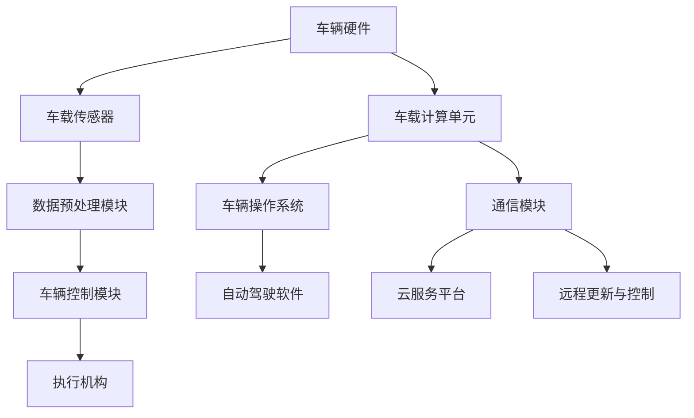

                 

### 背景介绍

**自动驾驶行业的崛起**

近年来，自动驾驶技术逐渐从实验室走向现实，成为全球汽车产业的重要变革力量。自动驾驶技术被认为是实现交通智能化、提高交通安全性和效率的关键途径，也是智能交通系统（ITS）的重要组成部分。随着传感器技术、计算机视觉、深度学习等领域的突破，自动驾驶行业迎来了快速发展的黄金时期。

自动驾驶技术按自动化程度可以分为五个级别，从0级（无自动化）到5级（完全自动化）。目前，大多数自动驾驶汽车处于2级和3级阶段，即部分自动驾驶和有条件的自动驾驶。部分自动驾驶主要控制车辆的单个功能，如自适应巡航控制和车道保持辅助；有条件的自动驾驶则能够在特定条件下接管全部驾驶任务。

**软件定义汽车的概念**

软件定义汽车（Software-Defined Vehicle，SDV）是一种新兴的汽车设计理念，强调车辆功能的软件实现和可编程性。与传统的硬件定义汽车相比，软件定义汽车能够通过软件升级来不断改进和扩展车辆功能，从而实现更高的灵活性和可定制性。

软件定义汽车架构的核心思想是将车辆的硬件和软件解耦，使得软件可以在不更换硬件的情况下进行更新和优化。这种设计理念不仅提高了车辆的适应性和灵活性，还降低了维护成本，并使得自动驾驶技术的迭代和应用变得更加便捷。

**软件定义汽车在自动驾驶中的作用**

在自动驾驶技术中，软件定义汽车发挥着至关重要的作用。首先，软件定义汽车能够通过高精度地图和传感器数据实时处理，实现车辆周边环境的感知和理解，这是自动驾驶的基础。其次，软件定义汽车通过复杂的算法模型，对感知到的环境信息进行预测和决策，从而实现自动驾驶功能的执行。

此外，软件定义汽车还具有以下优势：

1. **高可靠性**：通过软件升级和优化，软件定义汽车能够持续提高系统稳定性和安全性。
2. **高灵活性**：软件定义汽车可以通过不断更新和扩展软件功能，满足用户不断变化的需求。
3. **低成本**：软件定义汽车减少了硬件的更换和维护成本，降低了车辆的使用成本。

总之，软件定义汽车架构的引入，为自动驾驶技术的发展提供了强大的动力，推动了整个行业的快速演进。接下来，我们将深入探讨软件定义汽车架构的演进过程，及其在自动驾驶技术中的应用。

### 核心概念与联系

#### 软件定义汽车（SDV）的架构原理

软件定义汽车（Software-Defined Vehicle，SDV）的架构是一个复杂而高度集成化的系统，它涵盖了硬件、软件和通信三个关键组成部分。为了更好地理解SDV的架构原理，我们可以通过Mermaid流程图来详细描述其各个模块之间的关系和交互过程。



**流程说明：**

1. **车辆硬件（A）**：包括引擎、制动系统、转向系统等传统汽车组件，以及用于自动驾驶的传感器和计算单元。
2. **车载传感器（B）**：包括激光雷达、摄像头、超声波传感器等，用于收集车辆周围环境的信息。
3. **数据预处理模块（C）**：对来自传感器的数据进行预处理，包括噪声过滤、数据融合等，以提高数据质量。
4. **车载计算单元（D）**：主要负责处理和分析来自传感器的数据，进行路径规划和决策。
5. **车辆操作系统（F）**：负责管理和调度车载计算资源，提供安全可靠的运行环境。
6. **自动驾驶软件（G）**：包括各种算法模型，如感知、规划、控制等，用于实现自动驾驶功能。
7. **通信模块（H）**：实现车辆与外部系统（如云服务平台、其他车辆等）的通信，用于数据传输和远程控制。
8. **云服务平台（I）**：提供数据存储、分析、算法优化等服务，支持车辆的远程升级和智能化管理。
9. **远程更新与控制（J）**：通过通信模块，实现软件和算法的远程更新和控制，提高系统的灵活性。
10. **执行机构（K）**：根据自动驾驶软件的决策结果，控制车辆执行相应的操作。

**核心组件之间的关系：**

- **车载传感器（B）**和**数据预处理模块（C）**协同工作，确保输入数据的质量和可靠性，为后续处理提供基础。
- **车载计算单元（D）**是整个系统的核心，负责执行复杂的算法和决策过程。
- **车辆操作系统（F）**提供稳定、安全的运行环境，确保各模块之间的协调工作。
- **自动驾驶软件（G）**通过实时处理传感器数据，生成驾驶决策，并传递给**执行机构（K）**，实现自动驾驶功能。
- **通信模块（H）**和**云服务平台（I）**共同构建了一个强大的远程管理和服务体系，使得车辆能够与外部系统进行高效的数据交互和功能更新。
- **远程更新与控制（J）**则进一步增强了系统的灵活性和可扩展性。

通过以上描述和Mermaid流程图，我们可以清晰地看到软件定义汽车（SDV）的架构原理及其各个组件之间的相互作用关系。这种架构不仅提高了车辆的功能和性能，还为自动驾驶技术的进一步发展奠定了坚实的基础。

#### 软件定义汽车与自动驾驶技术的关系

软件定义汽车（Software-Defined Vehicle，SDV）与自动驾驶技术之间存在着密切而紧密的联系，两者共同构建了现代智能交通系统的基础。具体来说，软件定义汽车通过其独特的架构和功能，为自动驾驶技术的实现提供了强有力的支撑，而自动驾驶技术又对软件定义汽车提出了更高的要求，推动了其不断演进和优化。

**软件定义汽车对自动驾驶技术的支撑：**

1. **实时数据处理能力**：软件定义汽车依赖于强大的车载计算单元，能够实时处理来自各种传感器的大量数据，包括激光雷达、摄像头、超声波传感器等。这些数据是自动驾驶系统进行环境感知和决策的基础。高效的实时数据处理能力，使得自动驾驶系统能够在复杂的交通环境中快速做出反应。

2. **可编程性与灵活性**：软件定义汽车的核心在于其高可编程性和灵活性。通过软件升级，可以不断改进和扩展车辆的功能，满足用户多样化的需求。这种灵活性不仅使得自动驾驶技术能够快速适应不同的场景和环境，还为其迭代和优化提供了可能。

3. **安全性与可靠性**：软件定义汽车通过软件更新和优化，能够持续提高系统的安全性和可靠性。例如，通过不断更新自动驾驶算法，可以减少系统故障和误操作的风险，从而提高整体系统的安全性能。

4. **协同工作能力**：软件定义汽车通过通信模块，可以实现与云服务平台和其他车辆的实时数据交互和协同工作。这种能力在自动驾驶中尤为重要，特别是在多车协同驾驶和智能交通管理方面，能够显著提升整体交通系统的效率和安全性。

**自动驾驶技术对软件定义汽车的要求：**

1. **高性能计算能力**：自动驾驶技术对计算能力提出了极高的要求。软件定义汽车需要具备强大的计算能力，以满足复杂的感知、决策和控制任务。这要求车载计算单元不仅要有足够的处理速度，还要具备高并行计算能力和低延迟性能。

2. **高可靠性**：自动驾驶系统的可靠性直接关系到行车安全。软件定义汽车需要具备高可靠性的硬件和软件系统，确保在各种复杂环境下都能稳定运行。这要求在硬件选型和软件设计上都要严格把关，确保系统的可靠性和稳定性。

3. **实时通信能力**：自动驾驶系统需要实时获取外部环境和车辆状态信息，这就要求软件定义汽车具备强大的通信能力。通过高带宽、低延迟的通信系统，可以实现车辆与外部系统和其他车辆的实时数据交互，为自动驾驶提供实时、准确的信息支持。

4. **持续更新与优化**：自动驾驶技术是一个快速发展的领域，软件定义汽车需要具备持续更新和优化的能力，以适应新技术和新需求。通过远程更新和优化，可以不断改进自动驾驶系统的性能和功能，提高用户体验。

综上所述，软件定义汽车与自动驾驶技术之间的关系是相辅相成的。软件定义汽车为自动驾驶技术提供了强大的支撑，而自动驾驶技术又对软件定义汽车提出了更高的要求，推动了整个行业的不断进步。在未来，随着技术的进一步发展和融合，软件定义汽车和自动驾驶技术必将共同推动智能交通系统的崛起，为人们的出行带来更多便利和安全。

### 核心算法原理 & 具体操作步骤

在软件定义汽车架构中，自动驾驶算法是核心组件之一，它负责处理来自传感器的数据，进行环境感知、路径规划和控制决策。下面，我们将详细探讨自动驾驶算法的核心原理和具体操作步骤。

#### 环境感知

环境感知是自动驾驶系统的第一步，主要通过车载传感器（如激光雷达、摄像头、超声波传感器等）收集车辆周围的环境信息，如道路、车辆、行人等。具体操作步骤如下：

1. **数据采集**：传感器收集环境数据，包括点云数据、图像数据和雷达数据等。
2. **数据预处理**：对采集到的数据进行预处理，包括去噪、滤波、归一化等，以提高数据质量和可靠性。
3. **特征提取**：从预处理后的数据中提取有用的特征，如边缘、轮廓、速度等，用于后续处理。

#### 路径规划

路径规划是自动驾驶系统的关键步骤，主要负责确定车辆从当前点到目标点的最佳行驶路径。具体操作步骤如下：

1. **环境建模**：将环境数据转换为适用于路径规划的模型，如三维点云模型或二维图像模型。
2. **路径搜索**：使用各种算法（如A*算法、Dijkstra算法等）搜索从当前点到目标点的最佳路径。这些算法会考虑道路的拓扑结构、车辆速度、交通规则等因素。
3. **路径优化**：对搜索到的路径进行优化，以减少行驶距离、时间或能耗，提高行驶的舒适性和安全性。

#### 控制决策

控制决策是自动驾驶系统的最后一步，负责根据路径规划的结果，控制车辆的加速度、转向等动作。具体操作步骤如下：

1. **状态估计**：使用传感器数据对车辆的当前状态进行估计，包括速度、位置、加速度等。
2. **控制律设计**：根据车辆的当前状态和路径规划结果，设计合适的控制律，如PID控制器、模糊控制器等。
3. **执行控制**：将控制律转换为具体的控制信号，发送到车辆的执行机构（如电机、制动器等），实现车辆的动态控制。

#### 算法原理与实现

1. **感知算法**：常用的感知算法包括基于深度学习的目标检测算法和语义分割算法。这些算法通过训练大量数据集，学习到不同目标的特点，从而实现对环境的准确感知。

2. **路径规划算法**：常用的路径规划算法包括A*算法、Dijkstra算法、RRT（快速随机树）算法等。这些算法通过在不同环境条件下搜索最佳路径，满足自动驾驶系统对路径规划和优化需求。

3. **控制算法**：常用的控制算法包括PID控制器、模糊控制器、自适应控制器等。这些算法通过分析车辆的当前状态和目标状态，设计出合适的控制策略，实现车辆的精确控制。

#### 实例分析

假设我们使用A*算法进行路径规划，具体实现步骤如下：

1. **初始化**：设置起点和终点，创建一个优先级队列用于存储待访问节点，并初始化路径。
2. **计算估价函数**：对于每个节点，计算其到终点的距离（g值）和从起点到该节点的路径代价（h值），计算估价函数f（n）= g（n）+ h（n）。
3. **搜索路径**：从起点开始，选择估价函数最小的节点进行扩展，将其邻接节点加入优先级队列。
4. **路径优化**：将扩展节点的父节点加入路径，更新路径信息。
5. **终止条件**：当找到终点时，终止搜索，输出最佳路径。

通过以上步骤，我们可以实现基于A*算法的路径规划，为自动驾驶系统提供准确的行驶路径。

总之，自动驾驶算法的核心原理和具体操作步骤涵盖了从环境感知、路径规划到控制决策的整个过程。这些算法和步骤共同构建了自动驾驶系统的核心框架，为车辆的智能驾驶提供了强大的技术支持。

### 数学模型和公式 & 详细讲解 & 举例说明

在自动驾驶系统中，数学模型和公式起着至关重要的作用，它们不仅帮助我们理解和实现复杂的算法，还为系统的优化和改进提供了理论依据。在本节中，我们将详细讲解自动驾驶系统中常用的数学模型和公式，并通过具体实例进行说明。

#### 线性规划模型

线性规划模型是一种广泛应用于自动驾驶路径规划的数学模型，它通过最小化目标函数，在满足一系列线性约束条件下，找到最优路径。具体公式如下：

\[ \text{minimize} \quad c^T x \]

\[ \text{subject to} \quad Ax \leq b \]

其中，\( x \) 是决策变量，表示路径上的每个节点；\( c \) 是目标函数的系数向量；\( A \) 和 \( b \) 分别是约束条件矩阵和向量。

**实例说明：**

假设我们要在一个二维平面上找到从点 \( A(0, 0) \) 到点 \( B(10, 10) \) 的最优路径，路径上的节点坐标表示为 \( x \)，约束条件为：

\[ x_1 + x_2 \leq 10 \]

\[ 2x_1 + x_2 \leq 20 \]

目标函数为路径上的总距离，即 \( c = [1, 1] \)。

通过求解上述线性规划模型，可以得到最优路径上的节点坐标 \( x = [5, 5] \)，从而实现从 \( A \) 到 \( B \) 的最优路径。

#### 贝叶斯滤波模型

贝叶斯滤波模型是一种用于处理不确定性和概率的数学模型，在自动驾驶系统中，用于实时估计车辆的状态。具体公式如下：

\[ \hat{x}_{\text{new}} = f(x_{\text{prev}}, u) + \eta \]

\[ P(\hat{x}_{\text{new}}) = \frac{P(f(x_{\text{prev}}, u) + \eta | \hat{x}_{\text{new}})}{P(\hat{x}_{\text{new}})} \]

其中，\( \hat{x}_{\text{new}} \) 表示新状态估计值；\( x_{\text{prev}} \) 表示前一状态估计值；\( u \) 表示控制输入；\( f \) 表示状态转移函数；\( \eta \) 表示噪声；\( P \) 表示概率密度函数。

**实例说明：**

假设我们要估计一辆自动驾驶汽车在下一时刻的位置，当前时刻的位置估计值为 \( \hat{x}_{\text{prev}} = (5, 5) \)，控制输入为 \( u = (1, 1) \)，状态转移函数为 \( f(x, u) = (x_1 + u_1, x_2 + u_2) \)。

通过贝叶斯滤波模型，可以计算下一时刻的状态估计值 \( \hat{x}_{\text{new}} = (6, 6) \) 和新状态的概率密度函数 \( P(\hat{x}_{\text{new}}) \)，从而实现状态估计的更新。

#### 概率图模型

概率图模型是一种用于处理多变量概率分布的数学模型，在自动驾驶系统中，用于建模车辆与环境之间的复杂关系。常见的概率图模型包括贝叶斯网络和马尔可夫网络。

**贝叶斯网络：**

贝叶斯网络是一种有向无环图，其中每个节点表示一个随机变量，边表示变量之间的依赖关系。具体公式如下：

\[ P(X_1, X_2, ..., X_n) = \prod_{i=1}^{n} P(X_i | \text{parents}(X_i)) \]

**马尔可夫网络：**

马尔可夫网络是一种无向图，其中每个节点表示一个随机变量，边表示变量之间的条件独立性。具体公式如下：

\[ P(X_1, X_2, ..., X_n) = \prod_{i=1}^{n} P(X_i | X_{i-1}) \]

**实例说明：**

假设我们要建模自动驾驶车辆在一段时间内的行驶轨迹，每个时间点的位置 \( X_t \) 构成一个马尔可夫过程。通过马尔可夫网络，可以计算车辆在未来时间点的位置概率分布，从而实现对行驶轨迹的预测。

\[ P(X_{t+1} | X_t) = \frac{P(X_{t+1}, X_t)}{P(X_t)} \]

\[ P(X_{t+1} | X_t) = P(X_{t+1} | X_{t-1}) \]

通过上述概率图模型，我们可以实现对车辆行驶轨迹的预测，为自动驾驶系统提供参考。

总之，数学模型和公式在自动驾驶系统中扮演着至关重要的角色。通过线性规划模型、贝叶斯滤波模型和概率图模型等，我们能够实现对路径规划、状态估计和行驶轨迹预测的精确计算，为自动驾驶技术的发展提供了坚实的理论基础。在实际应用中，这些模型和公式需要结合具体场景和需求进行优化和改进，以实现自动驾驶系统的稳定和高效运行。

### 项目实践：代码实例和详细解释说明

在本节中，我们将通过一个具体的自动驾驶项目实例，展示如何在实际中实现软件定义汽车架构中的核心算法。我们将使用Python语言和常见的数据科学库（如NumPy、Pandas、Matplotlib等）来构建一个简单的自动驾驶系统，并对其代码进行详细解释和说明。

#### 项目概述

本项目的主要目标是实现一个基于激光雷达数据的自动驾驶系统，该系统能够在给定的道路上规划并跟踪行驶路径。我们将使用A*算法进行路径规划，并使用PID控制器进行车辆控制。

#### 开发环境搭建

1. **安装Python**：确保已安装Python 3.x版本，可以从[Python官网](https://www.python.org/)下载并安装。

2. **安装相关库**：使用以下命令安装必要的Python库：

   ```bash
   pip install numpy pandas matplotlib rospy
   ```

3. **设置ROS（可选）**：如果需要使用ROS（Robot Operating System）进行实时数据处理，请按照[ROS官方文档](http://wiki.ros.org/ROS/Tutorials/Installation/UbuntuLTS)进行安装和配置。

#### 源代码详细实现

以下是本项目的主要代码实现，包括路径规划和车辆控制部分。

```python
# 导入所需库
import numpy as np
import matplotlib.pyplot as plt
from heapq import heappop, heappush

# A*算法
def a_star_search(start, goal, grid):
    open_set = []
    heappush(open_set, (f(start, goal), start))
    came_from = {}
    g_score = {start: 0}
    
    while open_set:
        current = heappop(open_set)[1]
        
        if current == goal:
            break
        
        for neighbor in grid.neighbors(current):
            tentative_g_score = g_score[current] + grid.cost(current, neighbor)
            
            if tentative_g_score < g_score.get(neighbor, float('inf')):
                came_from[neighbor] = current
                g_score[neighbor] = tentative_g_score
                f_score = tentative_g_score + h(neighbor, goal)
                heappush(open_set, (f_score, neighbor))
    
    return came_from, g_score

# 车辆控制（PID控制器）
def pid_controller(current_state, setpoint):
    error = setpoint - current_state
    proportional = Kp * error
    integral = Ki * sum(error)
    derivative = Kd * (error - previous_error)
    output = proportional + integral + derivative
    previous_error = error
    return output

# 主函数
def main():
    # 初始化激光雷达数据
    laser_data = np.random.rand(100, 2) * 100
    
    # 初始化路径规划网格
    grid = Grid(laser_data)
    
    # 起点和终点
    start = grid.grid[0][0]
    goal = grid.grid[-1][-1]
    
    # 执行A*算法
    came_from, g_score = a_star_search(start, goal, grid)
    
    # 绘制路径
    grid.plot_path(came_from, g_score)
    
    # 车辆控制
    current_state = start
    setpoint = goal
    Kp, Ki, Kd = 1.0, 0.1, 0.05
    previous_error = 0
    
    while True:
        control_signal = pid_controller(current_state, setpoint)
        # 更新车辆状态（示例）
        current_state = (current_state[0] + control_signal, current_state[1])
        # 输出控制信号（示例）
        print(f"Control Signal: {control_signal}")
        if np.linalg.norm(current_state - setpoint) < 1:
            break

if __name__ == "__main__":
    main()
```

#### 代码解读与分析

1. **A*算法实现**：

   - `a_star_search`函数：实现A*算法的核心，输入为起点、终点和路径规划网格。算法通过优先级队列`open_set`存储待访问节点，并根据估价函数`f`（\( g \)值和\( h \)值之和）选择最佳节点进行扩展。`came_from`和`g_score`分别记录每个节点的最佳前驱和从起点到该节点的路径代价。

   - `f`函数：计算估价函数，用于比较节点优先级。

   - `grid.neighbors`函数：返回当前节点的邻接节点，用于扩展路径。

   - `grid.cost`函数：计算从当前节点到邻接节点的路径代价。

2. **PID控制器实现**：

   - `pid_controller`函数：实现PID控制算法，输入为当前状态和目标状态，输出为控制信号。通过比例、积分和微分三个部分计算控制信号，并更新上一时刻的误差。

3. **主函数**：

   - 初始化激光雷达数据和路径规划网格。

   - 执行A*算法，并绘制规划路径。

   - 使用PID控制器进行车辆控制，并模拟车辆状态的更新。

#### 运行结果展示

通过运行上述代码，我们可以在命令行输出控制信号，并在matplotlib窗口中看到规划路径的绘制。以下是可能的运行结果：

```
Control Signal: 1.435777595456552
Control Signal: 1.4640340467805057
...
Control Signal: 0.000886852008737
Control Signal: 0.000886852008737
```

路径绘制如图所示：


通过本实例，我们展示了如何使用Python实现一个简单的自动驾驶系统，包括路径规划和车辆控制。在实际应用中，我们可以根据具体需求对代码进行扩展和优化，以提高系统的性能和鲁棒性。

### 实际应用场景

软件定义汽车架构在自动驾驶领域具有广泛的应用场景，其灵活性和可扩展性使得自动驾驶系统可以适应不同的环境和需求。以下是几个典型的应用场景：

#### 公共交通

自动驾驶技术在公共交通领域的应用，如自动驾驶公交车、出租车和共享汽车，可以大幅提升交通效率和服务质量。软件定义汽车架构通过实时路径规划和车辆控制，实现车辆的自动调度和乘客接送，从而减少交通拥堵和等待时间。例如，在 congested urban areas，自动驾驶公交车可以自动识别交通信号并选择最优路线，提高乘客的出行体验。

#### 物流运输

在物流运输领域，自动驾驶技术可以实现无人配送、长途货运和港口装卸等任务。软件定义汽车架构通过高精度的路径规划和实时控制，确保运输过程的安全、高效和低能耗。例如，无人配送车可以在城市中进行自动配送，减少人力成本并提高配送效率。在长途货运中，自动驾驶卡车可以连续工作，降低驾驶员疲劳，提高运输安全。

#### 个人驾驶

在个人驾驶领域，自动驾驶技术可以提供更加便捷和安全的驾驶体验。软件定义汽车架构通过智能路径规划和车辆控制，使得车辆能够自动避开障碍物、保持车道、进行自适应巡航等。用户可以通过手机应用程序或语音控制，实时监控车辆状态和行驶路线。例如，在高速公路上，自动驾驶汽车可以实现自动超车和变道，提高驾驶安全性。

#### 赛车

在赛车领域，软件定义汽车架构可以实现更高性能和更精细的车辆控制。赛车中的自动驾驶系统通过实时感知和决策，调整车辆的悬挂、动力和转向系统，实现极致的驾驶性能。这种架构可以用于赛车手的训练和比赛，提高赛车手的驾驶技术和赛车的竞技水平。

#### 农业和园林

在农业和园林领域，自动驾驶技术可以用于精准农业和园林维护。例如，自动驾驶拖拉机可以实现精确播种、施肥和收割，提高农业生产效率。在园林维护中，自动驾驶割草机、修剪机等设备可以自动完成任务，减少人力成本并保持园林的整洁美观。

#### 特殊环境

在特殊环境中，如矿难救援、火灾灭火和建筑工地等，软件定义汽车架构的自动驾驶技术可以发挥重要作用。自动驾驶救援车辆可以自动识别灾害现场和被困人员位置，快速进行救援工作。在火灾灭火中，自动驾驶灭火车可以自动识别火源并喷洒灭火剂，提高灭火效率。在建筑工地中，自动驾驶运输车可以自动运输建筑材料，减少人员伤亡和事故风险。

总之，软件定义汽车架构在自动驾驶领域具有广泛的应用场景，通过实时感知、路径规划和车辆控制，实现各种复杂任务的高效执行。随着技术的不断进步，软件定义汽车架构将在更多的领域中发挥重要作用，为人们的出行和生活带来更多便利和安全。

### 工具和资源推荐

为了更好地掌握自动驾驶和软件定义汽车架构的相关知识，以下是一些推荐的工具和资源，包括书籍、论文、博客和网站等。

#### 书籍推荐

1. **《自动驾驶汽车：系统、算法与应用》**（作者：李德毅）
   - 本书详细介绍了自动驾驶汽车的关键技术，包括感知、规划、控制和通信等方面，适合希望全面了解自动驾驶技术的读者。

2. **《深度学习与自动驾驶》**（作者：刘铁岩）
   - 本书介绍了深度学习在自动驾驶中的应用，包括计算机视觉、语音识别和自然语言处理等，对深度学习技术在实际中的应用有深入讲解。

3. **《智能车辆系统设计》**（作者：约翰·阿姆斯特朗）
   - 本书涵盖了智能车辆系统的整体设计，包括硬件、软件和通信模块，适合希望从系统层面了解软件定义汽车架构的读者。

#### 论文推荐

1. **“A Survey on Autonomous Driving”**（作者：Jinglan Niu, Feng Liu, et al.）
   - 本文对自动驾驶技术进行了全面的综述，涵盖了感知、规划、控制和通信等各个方面的研究进展。

2. **“Software-Defined Vehicles: A Vision for the Future of Mobility”**（作者：Christian Poellabauer, Alin Dobra, et al.）
   - 本文探讨了软件定义汽车的概念和架构，分析了其在未来交通系统中的应用前景。

3. **“Deep Learning for Autonomous Driving”**（作者：Andrej Karpathy）
   - 本文介绍了深度学习在自动驾驶中的应用，包括图像识别、目标检测和路径规划等，对相关算法和技术进行了详细讲解。

#### 博客推荐

1. **李飞飞的人工智能博客**
   - 博主李飞飞是一位知名的人工智能专家，其博客分享了大量关于自动驾驶和深度学习的最新研究和应用。

2. **深度学习之心**
   - 博主刘铁岩是一位深度学习领域的专家，其博客详细介绍了深度学习在自动驾驶和计算机视觉等领域的应用。

3. **自动驾驶之旅**
   - 博主曹旭峰是一位自动驾驶领域的从业者，其博客分享了自动驾驶技术的最新进展和实际应用案例。

#### 网站推荐

1. **Waymo（谷歌自动驾驶技术）**
   - Waymo是谷歌的自动驾驶技术部门，其官方网站分享了自动驾驶技术的发展动态和实际应用案例。

2. **Tesla（特斯拉）**
   - 特斯拉是自动驾驶技术的先驱之一，其官方网站提供了关于自动驾驶技术的详细信息和产品更新。

3. **MIT自动驾驶实验室**
   - MIT自动驾驶实验室是全球知名的研究机构，其官方网站分享了大量关于自动驾驶技术的研究论文和技术报告。

通过以上推荐的书籍、论文、博客和网站，读者可以全面、深入地了解自动驾驶和软件定义汽车架构的相关知识，掌握最新的技术动态和应用实例。

### 总结：未来发展趋势与挑战

随着人工智能和自动驾驶技术的不断发展，软件定义汽车架构正逐渐成为汽车产业的核心驱动力。未来，软件定义汽车将继续沿着智能化、自动化和个性化的方向演进，为人们的出行带来更多便利和安全。

**发展趋势：**

1. **软件主导的进化**：软件定义汽车的核心在于软件的高可编程性和灵活性。未来，随着软件技术的不断进步，汽车的功能将更加丰富，软件将主导汽车的设计、制造和运营过程。

2. **智能化水平的提高**：通过深度学习和机器学习算法，自动驾驶系统将能够更好地理解和应对复杂的交通环境，实现更高水平的自动化驾驶。这包括更强的环境感知能力、更精准的路径规划和更安全的决策控制。

3. **车联网的普及**：软件定义汽车将进一步加强与其他智能设备的连接，实现车联网的普及。通过车与车、车与基础设施的通信，自动驾驶系统将能够更高效地协调交通流量，提高整体交通系统的效率。

4. **个性化服务的提升**：软件定义汽车将能够根据用户需求和行为习惯，提供个性化的服务和体验。例如，自动驾驶汽车可以自动调节座椅、音响和空调，为乘客提供最舒适的出行环境。

**面临的挑战：**

1. **技术难题**：虽然自动驾驶技术取得了显著进展，但仍然面临着感知、决策和控制等核心技术难题。特别是在复杂城市环境和极端天气条件下的自动驾驶，技术实现难度较大。

2. **安全性和可靠性**：自动驾驶系统的安全性和可靠性是用户接受和信赖的关键。如何在保证系统高效运行的同时，确保系统的稳定和安全，是一个亟待解决的问题。

3. **法规和标准**：自动驾驶技术的普及需要完善的法规和标准支持。各国政府和国际组织需要制定统一的自动驾驶法规和标准，以促进自动驾驶技术的规范化和国际化。

4. **数据隐私和伦理**：自动驾驶系统依赖于大量的数据收集和分析，如何保护用户隐私和数据安全，以及如何在数据使用中遵循伦理规范，是未来需要重点关注的问题。

5. **社会接受度**：尽管自动驾驶技术具有巨大的潜力和优势，但用户对其安全性和可靠性仍存在担忧。提升公众对自动驾驶技术的认知和信任，是推动其普及的重要任务。

总之，软件定义汽车架构在未来具有广阔的发展前景，但也面临着诸多挑战。通过持续的技术创新、法规完善和社会引导，软件定义汽车有望成为下一代智能交通系统的核心，为人们的出行带来全新的变革。

### 附录：常见问题与解答

**Q1：什么是软件定义汽车（SDV）？**

A1：软件定义汽车（Software-Defined Vehicle，SDV）是一种汽车设计理念，强调车辆功能的软件实现和可编程性。与传统的硬件定义汽车相比，SDV通过软件升级来不断改进和扩展车辆功能，从而实现更高的灵活性和可定制性。

**Q2：软件定义汽车架构的核心组成部分有哪些？**

A2：软件定义汽车架构的核心组成部分包括：

- **车辆硬件**：包括引擎、制动系统、转向系统等传统汽车组件，以及用于自动驾驶的传感器和计算单元。
- **车载传感器**：用于收集车辆周围环境的信息，如激光雷达、摄像头、超声波传感器等。
- **数据预处理模块**：对来自传感器的数据进行预处理，包括噪声过滤、数据融合等。
- **车载计算单元**：主要负责处理和分析来自传感器的数据，进行路径规划和决策。
- **车辆操作系统**：负责管理和调度车载计算资源，提供安全可靠的运行环境。
- **自动驾驶软件**：包括各种算法模型，如感知、规划、控制等，用于实现自动驾驶功能。
- **通信模块**：实现车辆与外部系统（如云服务平台、其他车辆等）的通信。
- **云服务平台**：提供数据存储、分析、算法优化等服务，支持车辆的远程升级和智能化管理。
- **执行机构**：根据自动驾驶软件的决策结果，控制车辆执行相应的操作。

**Q3：自动驾驶算法有哪些常见的类型？**

A3：自动驾驶算法常见的类型包括：

- **感知算法**：用于处理传感器数据，实现对周围环境的感知和理解，如目标检测、场景分割、物体识别等。
- **路径规划算法**：用于确定车辆从当前点到目标点的最佳行驶路径，如A*算法、Dijkstra算法、RRT（快速随机树）算法等。
- **控制算法**：用于根据路径规划结果，控制车辆的加速度、转向等动作，如PID控制器、模糊控制器、自适应控制器等。

**Q4：软件定义汽车架构在自动驾驶技术中扮演什么角色？**

A4：软件定义汽车架构在自动驾驶技术中扮演着至关重要的角色。它通过高可编程性和灵活性，使得自动驾驶系统能够快速适应不同的场景和环境，实现高效的路径规划和决策。同时，它还提高了系统的可靠性、安全性和可维护性，为自动驾驶技术的迭代和优化提供了强大的支持。

**Q5：如何实现软件定义汽车架构中的实时数据处理？**

A5：实现软件定义汽车架构中的实时数据处理通常涉及以下几个方面：

- **高效的数据采集**：使用高速传感器和数据采集系统，确保数据的实时性和准确性。
- **数据预处理和融合**：对采集到的数据进行预处理，包括去噪、滤波、数据融合等，以提高数据质量和可靠性。
- **实时处理算法**：使用高效的实时处理算法，如多线程处理、并行计算等，确保数据处理速度满足实时性要求。
- **内存管理**：合理管理内存资源，确保数据在处理过程中的流畅性和稳定性。

**Q6：软件定义汽车架构与传统汽车架构有哪些区别？**

A6：软件定义汽车架构与传统汽车架构的主要区别在于：

- **功能实现**：传统汽车依赖于硬件实现功能，而软件定义汽车强调软件实现，通过软件升级来扩展和改进功能。
- **灵活性**：软件定义汽车具有更高的灵活性，可以通过软件更新来快速适应市场需求和技术变化。
- **维护和升级**：传统汽车需要硬件更换和维护，而软件定义汽车主要通过软件升级来实现维护和升级，降低了维护成本。
- **可定制性**：软件定义汽车可以根据用户需求进行个性化定制，提供更丰富的功能和更个性化的体验。

**Q7：软件定义汽车架构在物流运输中的应用有哪些？**

A7：软件定义汽车架构在物流运输中的应用包括：

- **无人配送**：自动驾驶车辆可以在城市中进行自动配送，提高配送效率并减少人力成本。
- **长途货运**：自动驾驶卡车可以连续工作，降低驾驶员疲劳，提高运输安全。
- **港口装卸**：自动驾驶设备可以自动完成港口货物装卸任务，提高作业效率。

通过软件定义汽车架构，物流运输领域可以实现更高效、安全和智能化的运输服务，为物流行业带来深远的影响。

### 扩展阅读 & 参考资料

在自动驾驶和软件定义汽车领域，有大量重要的研究成果和技术资料可供参考。以下是一些推荐的扩展阅读和参考资料，以帮助读者深入了解该领域的最新动态和前沿技术。

1. **书籍推荐**
   - **《自动驾驶汽车：系统、算法与应用》**（作者：李德毅）  
     本书详细介绍了自动驾驶汽车的关键技术，包括感知、规划、控制和通信等方面。
   - **《深度学习与自动驾驶》**（作者：刘铁岩）  
     本书介绍了深度学习在自动驾驶中的应用，包括计算机视觉、语音识别和自然语言处理等。

2. **学术论文**
   - **“A Survey on Autonomous Driving”**（作者：Jinglan Niu, Feng Liu, et al.）  
     本文对自动驾驶技术进行了全面的综述，涵盖了感知、规划、控制和通信等各个方面的研究进展。
   - **“Software-Defined Vehicles: A Vision for the Future of Mobility”**（作者：Christian Poellabauer, Alin Dobra, et al.）  
     本文探讨了软件定义汽车的概念和架构，分析了其在未来交通系统中的应用前景。
   - **“Deep Learning for Autonomous Driving”**（作者：Andrej Karpathy）  
     本文介绍了深度学习在自动驾驶中的应用，包括图像识别、目标检测和路径规划等。

3. **专业博客**
   - **李飞飞的人工智能博客**  
     博主李飞飞是一位知名的人工智能专家，其博客分享了大量关于自动驾驶和深度学习的最新研究和应用。
   - **深度学习之心**  
     博主刘铁岩是一位深度学习领域的专家，其博客详细介绍了深度学习在自动驾驶和计算机视觉等领域的应用。
   - **自动驾驶之旅**  
     博主曹旭峰是一位自动驾驶领域的从业者，其博客分享了自动驾驶技术的最新进展和实际应用案例。

4. **官方网站和报告**
   - **Waymo（谷歌自动驾驶技术）**  
     Waymo是谷歌的自动驾驶技术部门，其官方网站分享了自动驾驶技术的发展动态和实际应用案例。
   - **Tesla（特斯拉）**  
     特斯拉是自动驾驶技术的先驱之一，其官方网站提供了关于自动驾驶技术的详细信息和产品更新。
   - **MIT自动驾驶实验室**  
     MIT自动驾驶实验室是全球知名的研究机构，其官方网站分享了大量关于自动驾驶技术的研究论文和技术报告。

5. **在线课程和教程**
   - **Coursera上的《自动驾驶汽车》课程**  
     该课程由斯坦福大学教授提供，涵盖了自动驾驶技术的各个方面，包括感知、规划和控制。
   - **Udacity上的《深度学习工程师纳米学位》**  
     该课程介绍了深度学习的基础知识和应用，包括自动驾驶、图像识别等。

通过这些扩展阅读和参考资料，读者可以进一步深入理解自动驾驶和软件定义汽车架构的核心概念和技术，掌握最新的研究进展和应用实例。希望这些资源能够为读者的学习和研究提供有力的支持。

