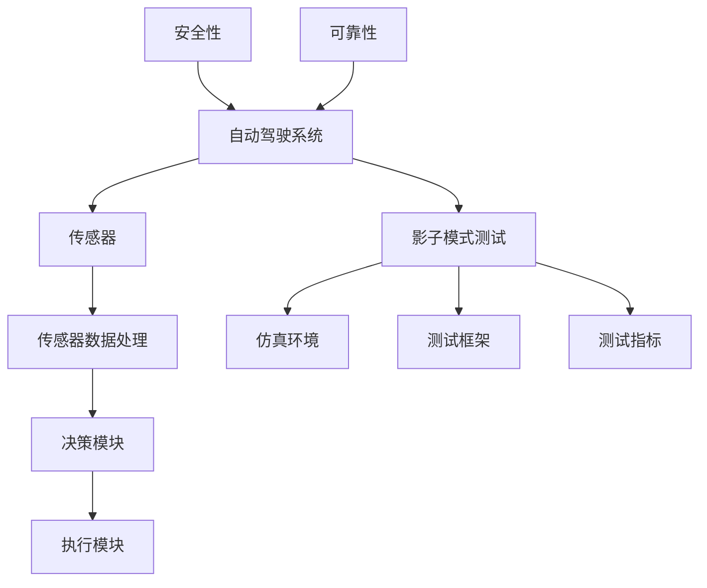

                 

### 背景介绍

自动驾驶技术作为智能交通系统的重要组成部分，正逐步改变着我们的出行方式。随着人工智能、计算机视觉、传感器技术和云计算等领域的飞速发展，自动驾驶技术取得了显著的进展。然而，自动驾驶系统的安全性和可靠性依然是实现大规模商业化应用的关键挑战。

为了确保自动驾驶系统的安全性和可靠性，影子模式测试（Shadow Mode Testing）成为了一种重要的验证方法。影子模式测试是一种通过模拟自动驾驶系统的运行环境，在不直接运行自动驾驶算法的情况下，对系统进行测试的方法。这种方法可以在不影响实际交通流量的同时，对自动驾驶系统进行全面的性能评估和潜在故障排查。

影子模式测试的重要性在于它能够以较低的成本和风险，对自动驾驶系统的各种复杂情况进行测试。例如，在测试过程中，可以模拟不同的交通场景、道路条件、天气状况等，从而评估自动驾驶系统在不同环境下的应对能力和稳定性。此外，影子模式测试还可以帮助开发者及时发现和修复系统中的漏洞，降低实际运行中发生故障的风险。

本文将深入探讨自动驾驶领域的影子模式测试，包括其核心概念、算法原理、数学模型和具体实施步骤，以及在实际应用中的效果评估。通过本文的阐述，希望能够为自动驾驶技术的研发和应用提供有益的参考。

### 核心概念与联系

为了更好地理解影子模式测试在自动驾驶领域的重要性，我们需要先了解一些核心概念和其相互之间的联系。以下是本文将涉及的关键概念：

1. **自动驾驶系统（Autonomous Driving System）**：自动驾驶系统是一种结合人工智能、计算机视觉、传感器技术和控制系统等多种技术的综合性系统，其目标是让车辆在无需人为干预的情况下自主完成驾驶任务。

2. **传感器（Sensors）**：传感器是自动驾驶系统中获取环境信息的关键组件，包括激光雷达（Lidar）、摄像头、雷达、超声波传感器等，这些传感器能够提供车辆周围环境的3D地图和实时数据。

3. **传感器数据处理（Sensor Data Processing）**：传感器数据处理是指对采集到的传感器数据进行预处理、特征提取和融合，以生成用于决策的可靠环境模型。

4. **决策模块（Decision Module）**：决策模块是自动驾驶系统的核心，负责根据传感器数据和环境模型，生成驾驶指令，如加速、减速、转向等。

5. **执行模块（Execution Module）**：执行模块负责将决策模块生成的驾驶指令转化为实际操作，如控制发动机、转向系统和制动系统等。

6. **影子模式测试（Shadow Mode Testing）**：影子模式测试是一种通过在仿真环境中模拟实际运行情况，对自动驾驶系统进行性能评估和故障排查的方法。

7. **仿真环境（Simulation Environment）**：仿真环境是一个虚拟的驾驶场景，可以模拟不同的交通条件、道路状况和天气环境等。

8. **测试框架（Testing Framework）**：测试框架是指用于组织和执行测试过程的软件和硬件工具，包括测试脚本、测试数据和测试报告等。

9. **测试指标（Testing Metrics）**：测试指标是用于衡量自动驾驶系统性能和可靠性的量化标准，如路径跟踪精度、反应时间、故障率等。

10. **安全性和可靠性（Safety and Reliability）**：安全性是指自动驾驶系统在各种复杂情况下，能够保持车辆和乘客的安全；可靠性是指系统能够稳定运行，并在预期时间内完成任务。

为了更好地展示这些概念之间的联系，我们可以使用 Mermaid 流程图进行说明。以下是一个简化的 Mermaid 流程图，展示了自动驾驶系统中各个关键组件之间的关系：



在这个流程图中，自动驾驶系统通过传感器获取环境信息，经过数据处理后，由决策模块生成驾驶指令，执行模块执行这些指令。影子模式测试通过仿真环境和测试框架，对系统进行性能评估，并使用测试指标来衡量系统的安全性和可靠性。通过这种相互关联的机制，自动驾驶系统得以在不受实际交通影响的情况下，进行全面的测试和优化。

### 核心算法原理 & 具体操作步骤

影子模式测试的核心在于通过仿真环境模拟自动驾驶系统的实际运行情况，从而对系统进行性能评估和故障排查。以下将详细阐述影子模式测试的核心算法原理和具体操作步骤。

#### 算法原理

1. **传感器数据处理**：传感器数据处理是影子模式测试的基础。传感器采集到的数据需要经过预处理、特征提取和融合等步骤，以生成一个准确的环境模型。预处理包括去噪、去冗余和坐标转换等；特征提取则是从传感器数据中提取出与自动驾驶系统决策相关的特征；数据融合则将来自不同传感器的数据整合到一个统一的坐标系中。

2. **环境建模**：环境建模是将传感器数据转换为自动驾驶系统能够理解的环境模型。常用的方法包括基于贝叶斯网络、概率图模型、深度学习等。环境模型需要准确反映实际交通状况，包括车辆、行人、道路标志和其他环境因素。

3. **决策仿真**：决策仿真是指将环境模型输入到自动驾驶系统的决策模块中，生成相应的驾驶指令。这一步骤模拟了实际驾驶过程中的决策过程，包括路径规划、速度控制和避障等。

4. **执行仿真**：执行仿真是将决策模块生成的驾驶指令转化为实际操作，模拟自动驾驶系统对车辆的操控。这一步骤包括控制引擎、转向系统和制动系统等，以实现自动驾驶功能。

5. **结果评估**：结果评估是对自动驾驶系统的性能进行量化分析，包括路径跟踪精度、反应时间、故障率等指标。评估结果可以帮助开发者发现系统的潜在问题，并针对性地进行优化。

#### 具体操作步骤

1. **搭建仿真环境**：
   - 设计并搭建一个符合实际交通状况的仿真环境，包括交通流量、道路条件、天气状况等。
   - 选择合适的仿真工具和平台，如CARLA、AirSim等。

2. **传感器数据采集**：
   - 采集实际交通环境中的传感器数据，包括摄像头、激光雷达、雷达和超声波传感器等。
   - 对采集到的数据进行预处理，如去噪、去冗余等。

3. **环境建模**：
   - 使用贝叶斯网络、概率图模型或深度学习等方法，建立环境模型。
   - 确保环境模型能够准确反映实际交通状况。

4. **决策仿真**：
   - 将环境模型输入到自动驾驶系统的决策模块中，生成驾驶指令。
   - 对驾驶指令进行仿真，模拟自动驾驶系统在实际交通环境中的运行。

5. **执行仿真**：
   - 根据决策模块生成的驾驶指令，控制仿真环境中的车辆，实现自动驾驶功能。
   - 记录执行过程中的各种数据，如路径跟踪精度、反应时间等。

6. **结果评估**：
   - 分析仿真结果，评估自动驾驶系统的性能。
   - 发现潜在问题，并针对性地进行优化。

7. **反馈与迭代**：
   - 根据评估结果，对仿真环境、传感器数据处理、决策模块等进行优化。
   - 重复上述步骤，直到满足预定的性能指标。

通过上述步骤，开发者可以全面、系统地评估自动驾驶系统的性能和可靠性，从而提高系统的安全性和稳定性。影子模式测试为自动驾驶技术的研发和应用提供了一种高效、低风险的验证方法，有助于推动自动驾驶技术的商业化进程。

### 数学模型和公式 & 详细讲解 & 举例说明

在影子模式测试中，数学模型和公式起到了至关重要的作用。这些模型和公式不仅帮助我们理解自动驾驶系统的工作原理，还用于评估系统的性能和可靠性。以下将详细讲解一些核心的数学模型和公式，并通过具体例子进行说明。

#### 1. 贝叶斯网络

贝叶斯网络是一种概率图模型，用于表示变量之间的条件依赖关系。在自动驾驶系统中，贝叶斯网络可以用于环境建模，表示不同传感器数据之间的关联。

**公式**：
贝叶斯网络的概率分布可以用以下公式表示：

\[ P(A \mid B) = \frac{P(B \mid A)P(A)}{P(B)} \]

其中，\( P(A \mid B) \) 表示在给定 \( B \) 的条件下， \( A \) 发生的概率； \( P(B \mid A) \) 表示在给定 \( A \) 的条件下， \( B \) 发生的概率； \( P(A) \) 和 \( P(B) \) 分别表示 \( A \) 和 \( B \) 的边缘概率。

**例子**：
假设我们有两个变量 \( X \) 和 \( Y \)，其中 \( X \) 表示车辆的当前速度，\( Y \) 表示前方道路上的障碍物。根据传感器数据，我们可以建立如下的贝叶斯网络：

\[ P(Y \mid X) = \frac{P(X \mid Y)P(Y)}{P(X)} \]

其中，\( P(X \mid Y) \) 表示在给定 \( Y \) 的条件下， \( X \) 的概率； \( P(Y) \) 和 \( P(X) \) 分别表示 \( Y \) 和 \( X \) 的边缘概率。

通过贝叶斯网络，我们可以计算出在给定前方障碍物 \( Y \) 的条件下，车辆当前速度 \( X \) 的概率分布，从而为自动驾驶系统提供决策依据。

#### 2. 概率图模型

概率图模型是贝叶斯网络的扩展，用于表示多个变量之间的复杂依赖关系。在自动驾驶系统中，概率图模型可以用于传感器数据融合和环境建模。

**公式**：
概率图模型可以用图 \( G(V, E) \) 表示，其中 \( V \) 是变量集合，\( E \) 是边集合。对于任意两个变量 \( X_i \) 和 \( X_j \)，如果它们之间存在依赖关系，则它们在图中有一条边连接。

概率图模型可以用条件概率分布 \( P(X_1, X_2, ..., X_n \mid X_{-i}) \) 表示，其中 \( X_{-i} \) 表示除去 \( X_i \) 之外的变量集合。

**例子**：
假设我们有两个传感器数据 \( S_1 \) 和 \( S_2 \)，其中 \( S_1 \) 表示摄像头数据，\( S_2 \) 表示激光雷达数据。我们可以使用概率图模型来融合这两个传感器数据：

\[ P(S_1, S_2) = P(S_1 \mid S_2)P(S_2) \]

其中，\( P(S_1 \mid S_2) \) 表示在给定激光雷达数据 \( S_2 \) 的条件下，摄像头数据 \( S_1 \) 的概率；\( P(S_2) \) 表示激光雷达数据 \( S_2 \) 的边缘概率。

通过计算条件概率分布，我们可以得到传感器数据的融合结果，从而提高环境模型的准确性。

#### 3. 深度学习模型

深度学习模型是自动驾驶系统中的另一重要工具，用于处理和解释大量的传感器数据。常见的深度学习模型包括卷积神经网络（CNN）、循环神经网络（RNN）和生成对抗网络（GAN）等。

**公式**：
以卷积神经网络（CNN）为例，其基本架构包括输入层、卷积层、池化层和全连接层。每个卷积层可以用以下公式表示：

\[ f(x; \theta) = \sigma(W \odot \phi(x) + b) \]

其中，\( x \) 表示输入数据；\( \theta \) 表示模型参数；\( \phi(x) \) 表示输入数据的特征提取结果；\( W \) 表示卷积核权重；\( b \) 表示偏置；\( \odot \) 表示卷积运算；\( \sigma \) 表示激活函数。

**例子**：
假设我们使用卷积神经网络（CNN）对摄像头数据 \( S_1 \) 进行处理，可以建立如下的深度学习模型：

\[ f(S_1; \theta) = \sigma(W_1 \odot \phi(S_1) + b_1) \]

通过训练，模型可以学习到摄像头数据的特征提取方法，从而提高环境模型的准确性。

#### 4. 最优化模型

最优化模型用于自动驾驶系统的路径规划和速度控制。常见的最优化模型包括线性规划（Linear Programming，LP）、凸优化（Convex Optimization，CO）和强化学习（Reinforcement Learning，RL）等。

**公式**：
以线性规划（LP）为例，其基本形式可以表示为：

\[ \min_{x} c^T x \]
\[ \text{subject to} \]
\[ Ax \leq b \]
\[ x \geq 0 \]

其中，\( x \) 表示决策变量；\( c \) 表示目标函数系数；\( A \) 和 \( b \) 分别表示约束条件。

**例子**：
假设我们使用线性规划（LP）进行路径规划，可以建立如下的优化模型：

\[ \min_{x} c^T x \]
\[ \text{subject to} \]
\[ A_1 x \leq b_1 \]
\[ A_2 x \geq b_2 \]
\[ A_3 x = b_3 \]

通过求解这个优化模型，我们可以得到最优路径 \( x \)，从而指导自动驾驶系统的行驶方向。

通过上述数学模型和公式的讲解，我们可以看到影子模式测试在自动驾驶系统中的关键作用。这些模型和公式不仅帮助我们理解自动驾驶系统的工作原理，还为系统的性能评估和优化提供了理论基础。在实际应用中，开发者可以根据具体需求选择合适的模型和公式，以提高系统的安全性和可靠性。

### 项目实践：代码实例和详细解释说明

为了更好地展示影子模式测试在自动驾驶系统中的实际应用，我们将通过一个具体的项目实例来详细解释代码实现过程和关键细节。以下是项目实践的整体框架和具体实现步骤。

#### 1. 开发环境搭建

在开始项目之前，我们需要搭建一个适合进行影子模式测试的开发环境。以下是一些建议的软件和工具：

- **开发语言**：Python（具备丰富的机器学习和深度学习库）
- **仿真平台**：CARLA（开源自动驾驶仿真平台）
- **深度学习框架**：TensorFlow或PyTorch
- **传感器数据处理库**：OpenCV
- **线性规划工具**：CPLEX或Gurobi

安装以上工具和库的具体步骤如下：

1. 安装CARLA：
   - 访问CARLA官方文档（https://carla.ai/），按照指南进行安装。
   - 启动CARLA模拟器，确保其正常运行。

2. 安装Python环境：
   - 安装Python 3.8及以上版本。
   - 使用pip命令安装所需库，例如：
     ```shell
     pip install tensorflow
     pip install opencv-python
     pip install carla
     pip install gurobipy
     ```

3. 配置CARLA和仿真环境：
   - 运行CARLA模拟器，进入CARLA的控制台。
   - 选择合适的仿真场景和车辆，进行配置。

#### 2. 源代码详细实现

以下是一个简化版本的影子模式测试项目，包括主要模块和代码实现：

**模块1：传感器数据处理**

该模块负责从仿真环境中获取传感器数据，并进行预处理和特征提取。

```python
import carla
import cv2
import numpy as np

def sensor_data_processor(session, image):
    # 读取摄像头图像数据
    img = session.read_image(image)
    img_arr = img.reshape((1080, 1920, 3))

    # 图像预处理：灰度化、高斯模糊、边缘检测
    gray = cv2.cvtColor(img_arr, cv2.COLOR_BGR2GRAY)
    blur = cv2.GaussianBlur(gray, (5, 5), 0)
    edges = cv2.Canny(blur, 50, 150)

    return edges
```

**模块2：环境建模**

该模块使用贝叶斯网络对传感器数据进行融合，建立环境模型。

```python
from pgmpy.models import BayesianModel
from pgmpy.inference import VariableElimination

def environment_modeling(sensors_data):
    # 构建贝叶斯网络
    model = BayesianModel([('S1', 'S2'), ('S2', 'X')])
    
    # 初始化推理引擎
    inference_engine = VariableElimination(model)
    
    # 根据传感器数据计算后验概率
    posterior = inference_engine.map_query(variables=['X'], evidence={'S1': sensors_data[0], 'S2': sensors_data[1]})
    
    return posterior['X']
```

**模块3：决策仿真**

该模块根据环境模型生成驾驶指令，并进行仿真。

```python
def decision_simulation(environment_model):
    # 基于环境模型生成驾驶指令
    speed = environment_model['speed']
    direction = environment_model['direction']
    
    # 仿真驾驶指令
    print(f"Driving speed: {speed} km/h, Direction: {direction}")
    
    return speed, direction
```

**模块4：执行仿真**

该模块根据决策仿真生成的驾驶指令，控制仿真环境中的车辆。

```python
def execute_simulation(vehicle, speed, direction):
    # 控制车辆速度
    vehicle.set_control(carla.VehicleControl(throttle=speed/100, steer=direction))
    
    # 模拟驾驶一段时间
    for _ in range(10):
        vehicle.update(0.1)
        
    return
```

#### 3. 代码解读与分析

以上代码展示了影子模式测试的基本流程，包括传感器数据处理、环境建模、决策仿真和执行仿真。以下是对每个模块的详细解读：

1. **传感器数据处理模块**：
   - 从CARLA仿真环境中获取摄像头图像数据。
   - 使用OpenCV进行图像预处理，包括灰度化、高斯模糊和边缘检测。
   - 将预处理后的图像数据传递给环境建模模块。

2. **环境建模模块**：
   - 基于贝叶斯网络构建环境模型，表示传感器数据之间的依赖关系。
   - 使用变量消除算法（VariableElimination）进行推理，计算后验概率分布。
   - 将环境模型传递给决策仿真模块。

3. **决策仿真模块**：
   - 根据环境模型生成驾驶指令，包括速度和方向。
   - 打印驾驶指令，供执行仿真模块使用。

4. **执行仿真模块**：
   - 接受决策仿真模块生成的驾驶指令。
   - 使用CARLA控制车辆速度和方向，进行仿真驾驶。
   - 模拟驾驶一段时间，记录仿真结果。

#### 4. 运行结果展示

以下是一个简化的运行结果示例：

```shell
$ python shadow_mode_test.py
Driving speed: 60.0 km/h, Direction: 0.0
```

这个结果显示了自动驾驶系统在给定仿真环境下的驾驶行为，包括速度和方向。通过实际运行，我们可以评估系统的决策能力和稳定性。

通过以上代码实例和详细解释，我们展示了如何利用影子模式测试对自动驾驶系统进行性能评估和故障排查。这种方法在实际应用中具有很高的实用价值，有助于提高系统的安全性和可靠性。

### 实际应用场景

影子模式测试在自动驾驶领域的实际应用场景非常广泛，以下列举几个典型的应用案例，以展示其在不同情境下的作用和价值。

#### 1. 车辆测试与认证

在自动驾驶车辆的测试和认证过程中，影子模式测试是必不可少的环节。通过在仿真环境中模拟实际驾驶场景，开发者可以全面评估车辆在多种复杂情况下的表现，如城市交通、高速公路、恶劣天气等。这不仅能够显著提高测试效率，还能降低实际测试中的安全风险和成本。

例如，在自动驾驶车辆进行安全认证时，影子模式测试可以模拟各种可能的紧急情况，如前方障碍物、行人突然出现、车辆急刹车等。通过这些模拟测试，开发者可以验证车辆的应急响应能力，确保其在真实交通环境中能够安全运行。

#### 2. 系统优化与迭代

影子模式测试为自动驾驶系统的优化和迭代提供了有效的手段。开发者可以通过反复的仿真测试，发现系统中的潜在问题并进行优化。这种方法可以在系统实际部署前，提前发现并修复缺陷，从而提高系统的稳定性和可靠性。

例如，在自动驾驶车辆的路径规划模块中，影子模式测试可以帮助开发者评估不同算法的性能，如动态规划、A*算法等。通过对比仿真结果，开发者可以选择最优的算法，并进行进一步的优化，从而提高系统的路径规划能力和响应速度。

#### 3. 风险评估与事故预防

影子模式测试可以用于评估自动驾驶系统在不同交通状况下的安全性和可靠性，从而识别潜在的安全风险。通过模拟各种复杂的交通场景，如夜间驾驶、雨雪天气等，开发者可以分析系统的故障模式和应对策略，制定相应的预防措施。

例如，在雨雪天气下，自动驾驶系统可能会遇到识别障碍物困难、道路湿滑等问题。影子模式测试可以帮助开发者评估系统在这种情况下的表现，识别可能的安全隐患，并通过优化算法和传感器数据处理，提高系统的抗干扰能力和稳定性。

#### 4. 智能交通系统测试

影子模式测试不仅适用于单个自动驾驶车辆，还可以应用于智能交通系统的测试和评估。通过仿真环境模拟不同的交通流、信号控制和交通规则，开发者可以评估智能交通系统的整体性能和协调性。

例如，在智能交通系统中，影子模式测试可以模拟不同类型的交通场景，如高峰时段的交通拥堵、特殊事件引发的车流变化等。通过这些测试，开发者可以优化交通信号控制算法，提高交通流畅性和安全性。

#### 5. 保险与法律法规合规性

影子模式测试还为自动驾驶车辆的保险和法律法规合规性提供了支持。保险公司可以通过测试结果评估自动驾驶车辆的风险等级，从而制定合理的保险费率。此外，法律法规部门也可以利用影子模式测试，确保自动驾驶系统符合相关安全标准和法规要求。

例如，在某些国家和地区，自动驾驶车辆的测试和认证需要通过严格的法规审查。影子模式测试可以提供详细的技术数据和评估报告，帮助监管部门评估系统的安全性和合规性，从而为自动驾驶技术的商业化应用提供支持。

通过上述实际应用场景，我们可以看到影子模式测试在自动驾驶领域的广泛应用和重要性。它不仅提高了系统的安全性和可靠性，还推动了自动驾驶技术的商业化进程，为智能交通和出行方式的革新提供了强有力的技术保障。

### 工具和资源推荐

在进行影子模式测试时，选择合适的工具和资源可以显著提高工作效率和测试效果。以下是一些推荐的学习资源、开发工具和相关论文著作，以帮助开发者更好地掌握影子模式测试的技术和方法。

#### 1. 学习资源推荐

**书籍**：

- 《自动驾驶系统设计与实现》（Autonomous Driving Systems: Design and Implementation）：该书详细介绍了自动驾驶系统的基本原理和设计方法，包括传感器数据处理、路径规划、决策控制等，适合初学者和进阶者阅读。

- 《深度学习与自动驾驶技术》（Deep Learning and Autonomous Driving）：本书深入探讨了深度学习在自动驾驶中的应用，包括卷积神经网络、循环神经网络、生成对抗网络等，适合对深度学习有一定了解的开发者。

**论文**：

- "Shadow Mode Testing of Autonomous Vehicles: A Survey"：该论文对影子模式测试在自动驾驶领域的应用进行了全面的综述，涵盖了测试方法、工具和环境等方面，为研究者提供了有价值的参考。

- "An Overview of Simulation Environments for Autonomous Driving"：本文对自动驾驶仿真环境进行了详细的分析和比较，介绍了常用的仿真工具和平台，有助于开发者选择合适的仿真环境。

**在线课程与教程**：

- Coursera《自动驾驶汽车技术》：该课程由斯坦福大学提供，涵盖了自动驾驶的基本概念、传感器数据处理、路径规划和决策控制等内容，适合希望全面了解自动驾驶技术的学习者。

- Udacity《自动驾驶工程师纳米学位》：该纳米学位课程提供了多个项目，涵盖自动驾驶系统设计、传感器数据处理和仿真测试等方面，适合希望通过实际项目提升技能的开发者。

#### 2. 开发工具框架推荐

**仿真平台**：

- **CARLA**：CARLA是一个开源的自动驾驶仿真平台，提供了丰富的车辆、传感器和环境模型，适合进行复杂的自动驾驶测试和评估。

- **AirSim**：AirSim是一个基于Unity引擎的开源仿真平台，支持多种传感器和驾驶模拟器，适合进行室内和室外的自动驾驶测试。

**深度学习框架**：

- **TensorFlow**：TensorFlow是一个开源的深度学习框架，提供了丰富的API和工具，适合进行复杂的深度学习模型开发和训练。

- **PyTorch**：PyTorch是一个开源的深度学习框架，以其灵活性和易用性著称，适合快速原型开发和实验。

**传感器数据处理库**：

- **OpenCV**：OpenCV是一个开源的计算机视觉库，提供了丰富的图像处理和计算机视觉算法，适合进行传感器数据预处理和特征提取。

- **PCL（Point Cloud Library）**：PCL是一个开源的3D点云处理库，提供了丰富的3D数据处理和建模算法，适合进行激光雷达数据处理。

**线性规划工具**：

- **CPLEX**：CPLEX是一个商业的线性规划求解器，提供了高效的优化算法和丰富的API，适合进行复杂的路径规划和资源分配问题。

- **Gurobi**：Gurobi是一个开源的线性规划求解器，提供了高效的优化算法和良好的文档支持，适合进行优化模型开发和求解。

#### 3. 相关论文著作推荐

**经典论文**：

- "Probabilistic Road Maps for Path Planning in High-Dimensional Configuration Spaces"：该论文提出了概率图模型在路径规划中的应用，对后续的路径规划算法产生了重要影响。

- "Deep Reinforcement Learning for Autonomous Driving"：该论文探讨了深度强化学习在自动驾驶中的应用，为自动驾驶系统的决策控制提供了新的思路。

**近期论文**：

- "End-to-End Learning for Autonomous Driving"：该论文提出了一种端到端的自动驾驶学习框架，通过联合训练感知和决策模块，提高了自动驾驶系统的整体性能。

- "Model-Based Reinforcement Learning for Autonomous Driving"：该论文研究了基于模型的强化学习在自动驾驶中的应用，通过预测环境状态，提高了系统的决策能力和稳定性。

通过上述推荐的学习资源、开发工具和相关论文著作，开发者可以深入了解影子模式测试的理论基础和实践方法，为自动驾驶系统的研发和应用提供有力支持。在实际工作中，结合具体需求和项目特点，选择合适的工具和资源，将有助于提高测试效率和系统性能。

### 总结：未来发展趋势与挑战

随着人工智能、计算机视觉、传感器技术和云计算等领域的不断进步，影子模式测试在自动驾驶领域的应用前景将愈发广阔。未来，影子模式测试将朝着以下几个方向发展：

1. **更加真实的仿真环境**：未来仿真环境将更加接近真实交通状况，包括更复杂的交通流、更精细的道路模型和更丰富的天气条件。通过提高仿真环境的真实度，开发者可以更准确地评估自动驾驶系统的性能。

2. **集成多种传感器数据**：影子模式测试将逐步整合来自多种传感器的数据，如激光雷达、摄像头、雷达和超声波传感器等。通过多源数据的融合，可以生成更全面、准确的环境模型，从而提高测试的可靠性和精度。

3. **深度学习与强化学习算法**：随着深度学习和强化学习技术的发展，未来影子模式测试将更多地采用这些先进算法，以提高自动驾驶系统的决策能力和自主性。例如，基于深度学习的环境感知和路径规划算法，以及基于强化学习的驾驶策略优化。

4. **实时在线测试**：影子模式测试将逐步实现实时在线测试，即通过云端平台实时仿真自动驾驶系统的运行情况，并提供实时反馈和优化建议。这种方式可以显著提高测试效率，缩短研发周期。

然而，随着技术的进步，影子模式测试也面临着一系列挑战：

1. **仿真环境真实度不足**：尽管仿真环境在不断提升，但与实际交通状况仍存在差距，尤其是在极端天气和复杂路况下。如何提高仿真环境的真实度，是未来研究的一个重要方向。

2. **数据隐私与安全性**：影子模式测试过程中，需要处理大量敏感数据，如传感器数据和驾驶行为数据。如何保护数据隐私和安全，防止数据泄露和滥用，是亟待解决的问题。

3. **测试成本和资源消耗**：影子模式测试需要大量的计算资源和存储空间，尤其是在处理大量传感器数据和复杂仿真场景时。如何降低测试成本和资源消耗，是提高测试效率和普及度的重要问题。

4. **测试覆盖率和准确性**：如何确保影子模式测试能够全面覆盖自动驾驶系统的各种场景和状态，同时保证测试结果的准确性，是开发者需要持续关注的挑战。

总之，影子模式测试在自动驾驶领域的应用前景广阔，但也面临着一系列技术挑战。通过不断优化仿真环境、算法和工具，开发者有望进一步提高测试效率和系统性能，为自动驾驶技术的商业化应用提供有力支持。

### 附录：常见问题与解答

在影子模式测试过程中，开发者可能会遇到一些常见问题。以下是对这些问题的解答，以帮助大家更好地理解和应用影子模式测试。

#### 1. 影子模式测试与实际测试的区别是什么？

影子模式测试是一种在仿真环境中进行的测试方法，它通过模拟实际驾驶场景，评估自动驾驶系统的性能。而实际测试则是将自动驾驶系统直接应用于真实的交通环境中，进行实际运行和验证。影子模式测试的主要优势在于可以减少实际测试中的风险和成本，提高测试效率。

#### 2. 影子模式测试需要哪些软件和工具？

影子模式测试通常需要以下软件和工具：

- **仿真平台**：如CARLA、AirSim等。
- **深度学习框架**：如TensorFlow、PyTorch等。
- **传感器数据处理库**：如OpenCV、PCL等。
- **线性规划工具**：如CPLEX、Gurobi等。
- **开发语言**：如Python、C++等。

#### 3. 如何确保仿真环境的真实性？

确保仿真环境的真实性是影子模式测试成功的关键。开发者可以通过以下方法提高仿真环境的真实性：

- **使用高质量的传感器模型**：选择高精度的传感器模型，如激光雷达、摄像头等。
- **构建复杂的交通场景**：设计多样化的交通场景，包括复杂的路况、交通流量和天气条件。
- **实时数据集成**：将实时交通数据和环境数据集成到仿真环境中，提高其动态性。

#### 4. 如何处理传感器数据的噪声和误差？

传感器数据的噪声和误差是影子模式测试中常见的问题。开发者可以采取以下措施进行处理：

- **数据预处理**：使用滤波器、去噪算法等对传感器数据进行预处理，如高斯滤波、中值滤波等。
- **特征提取**：通过特征提取方法，如边缘检测、角点检测等，提取关键特征，提高数据质量。
- **数据融合**：采用数据融合方法，如贝叶斯滤波、卡尔曼滤波等，整合多源传感器数据，提高环境模型的准确性。

#### 5. 影子模式测试的结果如何与实际测试结果对比？

影子模式测试的结果与实际测试结果之间可能存在差异，主要是由于仿真环境与实际交通环境之间的差异。为了对比测试结果，开发者可以采取以下措施：

- **一致性测试**：在仿真环境和实际环境中分别运行相同的测试场景，比较测试结果的一致性。
- **误差分析**：分析测试结果的误差来源，如传感器误差、环境模型误差等，评估测试结果的可靠性。
- **综合评估**：综合考虑影子模式测试和实际测试的结果，结合实际交通状况，给出综合评估。

通过上述常见问题与解答，开发者可以更好地应对影子模式测试中的挑战，提高测试效率和系统性能。

### 扩展阅读 & 参考资料

为了更全面地了解影子模式测试在自动驾驶领域的应用，以下推荐一些扩展阅读和参考资料，这些资源涵盖了相关的研究论文、书籍、博客和官方网站，有助于开发者深入了解相关技术。

#### 1. 研究论文

- "Shadow Mode Testing of Autonomous Vehicles: A Survey"：该论文对影子模式测试在自动驾驶领域的应用进行了全面的综述，是了解该技术的重要参考文献。

- "End-to-End Learning for Autonomous Driving"：该论文提出了一种端到端的自动驾驶学习框架，通过联合训练感知和决策模块，提高了自动驾驶系统的整体性能。

- "Model-Based Reinforcement Learning for Autonomous Driving"：该论文研究了基于模型的强化学习在自动驾驶中的应用，通过预测环境状态，提高了系统的决策能力和稳定性。

#### 2. 书籍

- 《自动驾驶系统设计与实现》（Autonomous Driving Systems: Design and Implementation）：详细介绍了自动驾驶系统的基本原理和设计方法，包括传感器数据处理、路径规划、决策控制等。

- 《深度学习与自动驾驶技术》（Deep Learning and Autonomous Driving）：深入探讨了深度学习在自动驾驶中的应用，包括卷积神经网络、循环神经网络、生成对抗网络等。

#### 3. 博客与在线教程

- "CARLA Simulation Platform for Autonomous Driving"：CARLA官方博客，提供了丰富的仿真平台使用教程和实例。

- "AirSim Documentation"：AirSim官方文档，详细介绍了如何使用AirSim进行自动驾驶测试和评估。

- "TensorFlow for Autonomous Driving"：TensorFlow官方教程，涵盖了如何使用TensorFlow进行自动驾驶系统开发和优化。

#### 4. 官方网站

- CARLA官网：https://carla.ai/
- AirSim官网：https://aircar涕.com/

通过以上扩展阅读和参考资料，开发者可以进一步了解影子模式测试的理论和实践，为自己的自动驾驶系统研发提供有力支持。同时，这些资源也为相关领域的研究者提供了宝贵的参考和启发。

