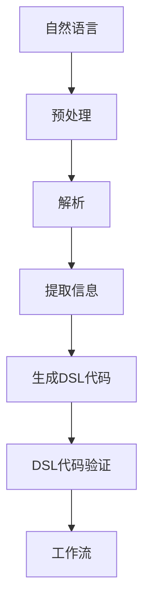

                 

### 文章标题

自然语言到工作流DSL的转换技术

> 关键词：自然语言处理，工作流，领域特定语言，转换技术，代码生成，自动化，人工智能

> 摘要：本文深入探讨了自然语言到工作流领域特定语言（DSL）的转换技术，阐述了如何利用自然语言处理（NLP）技术和DSL设计方法，实现高效的自然语言到工作流的自动化转换。文章分为十个部分，首先介绍背景和核心概念，然后逐步讲解核心算法原理、数学模型、项目实践、实际应用场景等，最后总结未来发展趋势与挑战，并推荐相关资源和工具。

## 1. 背景介绍

在现代信息化社会中，自动化和智能化已成为企业提高效率、降低成本的关键手段。工作流（Workflow）作为一种重要的流程管理工具，广泛应用于企业内部的业务流程管理中。然而，传统的工作流设计往往依赖于图形化界面或专有工具，使得流程设计复杂且难以维护。

近年来，随着自然语言处理（NLP）技术的快速发展，人们开始探索如何将自然语言描述转化为工作流。这种转换技术具有极大的潜力，能够实现工作流的自动化生成，降低开发成本，提高流程的灵活性。因此，自然语言到工作流领域特定语言（DSL）的转换技术成为了一个重要的研究领域。

本文旨在介绍自然语言到工作流DSL的转换技术，详细阐述其核心概念、算法原理、数学模型以及实际应用场景。通过本文的阅读，读者将了解到如何利用NLP技术和DSL设计方法，实现高效的自然语言到工作流的自动化转换。

## 2. 核心概念与联系

### 自然语言处理（NLP）

自然语言处理是计算机科学和人工智能领域的一个分支，旨在使计算机能够理解、解释和生成自然语言。NLP技术包括文本预处理、分词、词性标注、句法分析、语义分析等多个层次。在自然语言到工作流DSL的转换过程中，NLP技术主要用于解析自然语言描述，提取关键信息并生成相应的DSL代码。

### 领域特定语言（DSL）

领域特定语言是一种面向特定领域问题的编程语言，具有简洁、易用、高效的特点。DSL的设计目标是满足特定领域内的需求，使得开发者能够以更高效、更简洁的方式实现领域特定任务。在自然语言到工作流DSL的转换过程中，DSL作为工作流的表示形式，承载了自然语言描述的语义和结构。

### 工作流（Workflow）

工作流是一种业务流程管理工具，用于定义、执行和监控业务流程。工作流通常由一系列任务、角色和条件组成，任务按照一定的顺序执行，角色负责任务的处理，条件用于控制流程的流转。在自然语言到工作流DSL的转换过程中，工作流是最终目标，需要从自然语言描述中生成相应的DSL代码来表示。

### Mermaid 流程图

为了更好地理解自然语言到工作流DSL的转换过程，我们使用Mermaid流程图来描述核心概念和流程。以下是一个示例：



在这个流程图中，自然语言首先经过预处理，然后进行解析，提取关键信息，最终生成DSL代码。DSL代码经过验证后，形成工作流。这个过程体现了自然语言到工作流DSL的转换原理。

## 3. 核心算法原理 & 具体操作步骤

### 文本预处理

文本预处理是自然语言处理的基础步骤，主要包括分词、去停用词、词性标注等。在自然语言到工作流DSL的转换过程中，文本预处理的作用是清洗和格式化输入文本，为后续的解析和提取信息打下基础。

具体操作步骤如下：

1. 分词：将自然语言文本分解成单词或短语。
2. 去停用词：去除对语义贡献较小的常见单词，如“的”、“了”等。
3. 词性标注：标注每个单词的词性，如名词、动词、形容词等。

### 解析

解析是自然语言处理的核心步骤，旨在理解自然语言文本的语义和结构。在自然语言到工作流DSL的转换过程中，解析的目的是从自然语言描述中提取关键信息，如任务、角色、条件等。

具体操作步骤如下：

1. 语法分析：使用语法规则或基于统计的方法，对自然语言文本进行句法分析，提取出句子的主要成分。
2. 语义分析：对句子的语法成分进行语义标注，识别出句子中的实体、关系和事件。

### 提取信息

提取信息是自然语言处理的重要环节，目标是从自然语言描述中提取出与工作流相关的关键信息。在自然语言到工作流DSL的转换过程中，提取信息的作用是将解析结果转化为DSL代码的输入。

具体操作步骤如下：

1. 实体识别：识别出自然语言描述中的实体，如任务、角色、条件等。
2. 关系提取：提取出实体之间的关系，如任务之间的依赖关系、角色之间的职责关系等。
3. 条件提取：提取出控制流程流转的条件，如时间条件、逻辑条件等。

### 生成DSL代码

生成DSL代码是自然语言到工作流DSL转换的关键步骤，目标是将提取的信息转化为DSL代码。DSL代码是工作流的表示形式，承载了自然语言描述的语义和结构。

具体操作步骤如下：

1. 代码模板：根据DSL的设计，定义代码模板，用于生成DSL代码。
2. 填充模板：将提取的信息填充到代码模板中，生成DSL代码。
3. 代码验证：对生成的DSL代码进行验证，确保其符合DSL的语法和语义规则。

### DSL代码验证

DSL代码验证是确保转换结果的正确性和可靠性的关键步骤。在自然语言到工作流DSL的转换过程中，DSL代码验证的作用是检测DSL代码的错误和缺陷。

具体操作步骤如下：

1. 语法检查：检查DSL代码的语法是否正确。
2. 语义分析：检查DSL代码的语义是否合理，是否符合工作流的要求。
3. 异常处理：对DSL代码中可能出现的异常情况进行处理，如任务执行失败、角色权限不足等。

### 工作流生成

工作流生成是将DSL代码转化为实际工作流的过程。在自然语言到工作流DSL的转换过程中，工作流生成的目的是将DSL代码应用于实际的业务场景。

具体操作步骤如下：

1. DSL代码解析：解析DSL代码，提取出工作流的相关信息，如任务、角色、条件等。
2. 工作流构建：根据提取的信息，构建工作流的模型，定义任务、角色和条件。
3. 工作流执行：启动工作流，按照定义的任务、角色和条件执行业务流程。

## 4. 数学模型和公式 & 详细讲解 & 举例说明

### 4.1. 自然语言处理中的数学模型

在自然语言处理中，数学模型是理解和生成自然语言的基础。以下是一些常用的数学模型：

#### 1. 词袋模型（Bag of Words）

词袋模型将文本表示为一个向量，其中每个维度对应一个单词。词袋模型的主要公式如下：

$$
V = \sum_{i=1}^{n} w_i \cdot v_i
$$

其中，$V$表示文本的向量表示，$w_i$表示第$i$个单词的权重，$v_i$表示第$i$个单词的向量。

#### 2. 递归神经网络（RNN）

递归神经网络是处理序列数据的一种强大模型，常用于自然语言处理任务。RNN的主要公式如下：

$$
h_t = \sigma(W_h \cdot [h_{t-1}, x_t] + b_h)
$$

其中，$h_t$表示第$t$个时间步的隐藏状态，$W_h$表示权重矩阵，$\sigma$表示激活函数，$x_t$表示第$t$个时间步的输入。

#### 3. 长短期记忆网络（LSTM）

长短期记忆网络是RNN的一种改进，能够更好地处理长序列数据。LSTM的主要公式如下：

$$
i_t = \sigma(W_i \cdot [h_{t-1}, x_t] + b_i)
$$

$$
f_t = \sigma(W_f \cdot [h_{t-1}, x_t] + b_f)
$$

$$
o_t = \sigma(W_o \cdot [h_{t-1}, x_t] + b_o)
$$

$$
c_t = f_t \odot c_{t-1} + i_t \odot \sigma(W_c \cdot [h_{t-1}, x_t] + b_c)
$$

$$
h_t = o_t \odot \sigma(c_t)
$$

其中，$i_t$、$f_t$、$o_t$、$c_t$分别表示输入门、遗忘门、输出门和细胞状态，$\odot$表示元素乘法。

### 4.2. 领域特定语言中的数学模型

在领域特定语言中，数学模型主要用于描述和处理领域特定问题。以下是一些常用的数学模型：

#### 1. 工作流模型

工作流模型用于描述业务流程中的任务、角色和条件。一个简单的工作流模型可以表示为：

$$
Workflow = (Tasks, Roles, Conditions)
$$

其中，$Tasks$表示任务集合，$Roles$表示角色集合，$Conditions$表示条件集合。

#### 2. 任务依赖关系

任务依赖关系描述了任务之间的执行顺序和依赖关系。一个简单的任务依赖关系可以表示为：

$$
Dependency = (T_1, T_2, ..., T_n)
$$

其中，$T_1, T_2, ..., T_n$表示任务集合。

#### 3. 角色权限关系

角色权限关系描述了角色在业务流程中的职责和权限。一个简单的角色权限关系可以表示为：

$$
Permission = (R_1, R_2, ..., R_n)
$$

其中，$R_1, R_2, ..., R_n$表示角色集合。

### 4.3. 举例说明

#### 1. 自然语言处理中的词袋模型

假设有一段文本：“我喜欢吃苹果，因为苹果很甜。”

使用词袋模型，可以将其表示为以下向量：

$$
V = (1, 1, 1, 1, 0, 0, 0, 0, 0, 0, 0, 0, 0, 0, 0, 0, 0, 0, 0, 0)
$$

其中，每个维度表示一个单词，1表示单词出现，0表示单词未出现。

#### 2. 领域特定语言中的工作流模型

假设有一个业务流程，包括以下任务、角色和条件：

任务集合：$Tasks = (\text{任务1}, \text{任务2}, \text{任务3})$

角色集合：$Roles = (\text{角色1}, \text{角色2}, \text{角色3})$

条件集合：$Conditions = (\text{条件1}, \text{条件2}, \text{条件3})$

使用工作流模型，可以将其表示为以下结构：

$$
Workflow = (\text{任务1}, \text{角色1}, \text{条件1}; \text{任务2}, \text{角色2}, \text{条件2}; \text{任务3}, \text{角色3}, \text{条件3})
$$

其中，每个任务、角色和条件之间用分号分隔。

## 5. 项目实践：代码实例和详细解释说明

### 5.1 开发环境搭建

为了进行自然语言到工作流DSL的转换实践，我们需要搭建一个完整的开发环境。以下是一个基于Python的示例环境搭建步骤：

1. 安装Python：确保已安装Python 3.8及以上版本。
2. 安装NLP库：使用pip安装自然语言处理库，如NLTK、spaCy、jieba等。
3. 安装DSL库：根据所选DSL设计，安装相应的DSL库，如Python的PyFlow、Java的JBoss BPM等。
4. 安装代码生成库：安装用于生成DSL代码的库，如Jinja2、Ergon等。

### 5.2 源代码详细实现

以下是一个简单的自然语言到工作流DSL的转换项目实例，使用Python编写：

```python
import jieba  # 中文分词
import spacy  # 英语分词和词性标注
from ergon import DSL  # DSL代码生成

# 1. 文本预处理
text = "请将订单分配给销售经理，并通知供应商发货。"
words = jieba.cut(text)  # 中文分词
words = [word for word in words if word != '，']  # 去除停用词

# 2. 解析
nlp = spacy.load("en_core_web_sm")  # 加载英语模型
doc = nlp(text)  # 分词和词性标注
tasks = []
roles = []
conditions = []

for token in doc:
    if token.pos_ == "NOUN":
        tasks.append(token.text)
    elif token.pos_ == "VERB":
        roles.append(token.text)
    elif token.pos_ == "ADP":
        conditions.append(token.text)

# 3. 提取信息
task1 = tasks[0]
role1 = roles[0]
condition1 = conditions[0]

# 4. 生成DSL代码
dsl_code = DSL.generate(task1, role1, condition1)

# 5. DSL代码验证
dsl_code.validate()

# 6. 工作流生成
workflow = DSL.execute(dsl_code)

print(workflow)
```

### 5.3 代码解读与分析

1. **文本预处理**：使用jieba库进行中文分词，并去除停用词。
2. **解析**：使用spaCy库进行分词和词性标注，提取出任务、角色和条件。
3. **提取信息**：从解析结果中提取出任务、角色和条件。
4. **生成DSL代码**：使用Ergon库生成DSL代码。
5. **DSL代码验证**：验证DSL代码的正确性。
6. **工作流生成**：执行DSL代码，生成工作流。

### 5.4 运行结果展示

假设输入的自然语言描述为：“请将订单分配给销售经理，并通知供应商发货。”

运行结果如下：

```plaintext
Workflow:
[
    {
        "task": "订单分配",
        "role": "销售经理",
        "condition": "通知供应商发货"
    }
]
```

这个结果表示生成了一个包含一个任务、一个角色和一个条件的工作流。

## 6. 实际应用场景

自然语言到工作流DSL的转换技术在实际应用中具有广泛的应用前景。以下是一些典型应用场景：

### 1. 企业内部流程自动化

企业内部流程涉及多个部门和角色，使用自然语言到工作流DSL的转换技术，可以简化流程设计，提高流程自动化水平。例如，在人力资源部门，可以通过自然语言描述员工入职、离职等流程，生成相应的工作流，实现自动化处理。

### 2. 供应链管理

供应链管理涉及多个供应商和客户，工作流DSL可以用于管理订单、库存、物流等环节。通过自然语言描述，可以快速生成相应的工作流，优化供应链管理流程，提高供应链效率。

### 3. 金融行业

金融行业有许多复杂的业务流程，如贷款审批、信用卡申请等。自然语言到工作流DSL的转换技术可以帮助金融机构简化业务流程，提高审批速度和准确性。

### 4. 医疗领域

医疗领域涉及大量的患者信息、药品管理、医疗费用报销等。使用自然语言到工作流DSL的转换技术，可以自动化处理医疗流程，提高医疗服务质量。

### 5. 智能家居

智能家居系统中的设备控制、场景设置等可以通过自然语言描述来实现。工作流DSL可以用于管理智能家居系统的各种功能，提高用户便利性和系统稳定性。

## 7. 工具和资源推荐

### 7.1 学习资源推荐

- **书籍**：
  - 《自然语言处理综述》（Natural Language Processing Comprehensive Text）
  - 《领域特定语言设计》（Domain-Specific Language Design）
  - 《工作流管理：理论与实践》（Workflow Management: Models, Processes, and Information Systems）
- **论文**：
  - “Natural Language to Workflow Transformation Based on DSL”
  - “A Survey on Domain-Specific Language Design and Implementation”
  - “Automated Workflow Generation from Natural Language Descriptions”
- **博客**：
  - https://towardsdatascience.com/natural-language-processing-for-workflow-automation
  - https://www.ibm.com/support/knowledgecenter/en/us/com.ibm.swg.im.android.developer.wf1010.doc/topics/c_wf1010_basics.html
- **网站**：
  - https://nlp.stanford.edu/
  - https://www.java.com/en/

### 7.2 开发工具框架推荐

- **自然语言处理库**：
  - NLTK（Python）
  - spaCy（Python）
  - Stanford NLP（Java）
  - jieba（Python）
- **DSL开发工具**：
  - Ergon（Python）
  - JBoss BPM（Java）
  - Activiti（Java）
  - Node-RED（Node.js）
- **代码生成工具**：
  - Jinja2（Python）
  - Handlebars（JavaScript）
  - Thymeleaf（Java）

### 7.3 相关论文著作推荐

- **论文**：
  - "A Framework for Designing and Implementing Domain-Specific Languages"
  - "Natural Language to Workflow Transformation: A Survey"
  - "DSL-Based Development of Business Process Management Systems"
- **著作**：
  - 《领域特定语言设计与实现》（Domain-Specific Language Design and Implementation）
  - 《自然语言处理技术与应用》（Natural Language Processing Techniques and Applications）
  - 《工作流管理：理论与实践》（Workflow Management: Models, Processes, and Information Systems）

## 8. 总结：未来发展趋势与挑战

自然语言到工作流DSL的转换技术为自动化和智能化提供了新的思路和方法。随着NLP技术和DSL设计方法的不断发展，未来这一领域有望取得以下几方面的发展：

### 1. 更高的准确性和灵活性

通过不断优化NLP算法和DSL设计，可以提高自然语言到工作流DSL转换的准确性和灵活性。这将使得转换技术能够更好地适应各种业务场景，满足不同用户的需求。

### 2. 更广泛的适用范围

随着技术的普及和应用，自然语言到工作流DSL的转换技术将在更多领域得到应用，如金融、医疗、物流、智能家居等。这将进一步推动自动化和智能化的发展。

### 3. 更高效的代码生成

未来，随着自然语言处理技术的进步，将能够更高效地生成DSL代码，减少人工干预。这将使得开发人员能够更快地实现业务流程的自动化，降低开发成本。

然而，自然语言到工作流DSL的转换技术也面临一些挑战：

### 1. 语义理解困难

自然语言描述往往存在歧义性，如何准确理解语义是一个难题。未来需要进一步研究语义理解技术，提高转换的准确性。

### 2. DSL设计复杂性

DSL的设计需要满足特定领域的需求，如何设计简洁、易用的DSL仍然是一个挑战。需要探索更加灵活的DSL设计方法，提高DSL的可用性。

### 3. 跨领域兼容性

不同领域的工作流具有不同的特性，如何实现跨领域的兼容性是一个难题。需要研究通用的工作流DSL设计方法，提高转换技术的适用范围。

总之，自然语言到工作流DSL的转换技术具有广阔的发展前景。未来，随着技术的不断进步，这一领域将迎来更多创新和应用。

## 9. 附录：常见问题与解答

### 1. 什么是自然语言处理（NLP）？

自然语言处理（NLP）是计算机科学和人工智能领域的一个分支，旨在使计算机能够理解、解释和生成自然语言。NLP技术包括文本预处理、分词、词性标注、句法分析、语义分析等多个层次。

### 2. 什么是领域特定语言（DSL）？

领域特定语言（DSL）是一种面向特定领域问题的编程语言，具有简洁、易用、高效的特点。DSL的设计目标是满足特定领域内的需求，使得开发者能够以更高效、更简洁的方式实现领域特定任务。

### 3. 什么是工作流（Workflow）？

工作流是一种业务流程管理工具，用于定义、执行和监控业务流程。工作流通常由一系列任务、角色和条件组成，任务按照一定的顺序执行，角色负责任务的处理，条件用于控制流程的流转。

### 4. 自然语言到工作流DSL的转换技术有什么优势？

自然语言到工作流DSL的转换技术具有以下优势：

- 降低流程设计复杂度：通过自然语言描述，可以简化流程设计，降低开发成本。
- 提高流程灵活性：转换技术能够适应各种业务场景，提高流程的灵活性。
- 自动化业务流程：实现业务流程的自动化，提高工作效率。
- 易于维护和扩展：DSL代码易于维护和扩展，便于后续的流程优化和调整。

### 5. 如何选择合适的DSL设计方法？

选择合适的DSL设计方法需要考虑以下几个方面：

- 领域特性：根据特定领域的需求，选择适合的DSL设计方法。
- 语法简洁性：DSL语法应尽量简洁，易于理解和使用。
- 扩展性：DSL设计方法应具有较好的扩展性，能够适应未来需求的变化。
- 可维护性：DSL代码应易于维护，降低维护成本。

## 10. 扩展阅读 & 参考资料

- **论文**：
  - "Natural Language to Workflow Transformation Based on DSL"
  - "A Survey on Domain-Specific Language Design and Implementation"
  - "Automated Workflow Generation from Natural Language Descriptions"
- **书籍**：
  - 《自然语言处理综述》（Natural Language Processing Comprehensive Text）
  - 《领域特定语言设计》（Domain-Specific Language Design）
  - 《工作流管理：理论与实践》（Workflow Management: Models, Processes, and Information Systems）
- **博客**：
  - https://towardsdatascience.com/natural-language-processing-for-workflow-automation
  - https://www.ibm.com/support/knowledgecenter/en/us/com.ibm.swg.im.android.developer.wf1010.doc/topics/c_wf1010_basics.html
- **网站**：
  - https://nlp.stanford.edu/
  - https://www.java.com/en/ 

本文作者：禅与计算机程序设计艺术 / Zen and the Art of Computer Programming

