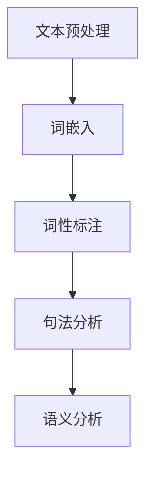

                 

### 文章标题

**自然语言处理NLP原理与代码实例讲解**

**Keywords: Natural Language Processing, NLP, Text Analysis, Machine Learning, Deep Learning, Code Examples**

**Abstract:**
This article provides a comprehensive introduction to the principles and techniques of Natural Language Processing (NLP). It covers the fundamental concepts, core algorithms, mathematical models, and practical code examples. By the end of this article, readers will have a solid understanding of NLP and be able to apply it to real-world applications. 

### 1. 背景介绍

自然语言处理（NLP）是计算机科学和人工智能领域中的一个重要分支。它的目标是让计算机能够理解和处理人类语言，以实现人与机器之间的自然交互。随着互联网和大数据的快速发展，NLP在各个行业中的应用越来越广泛，如搜索引擎、机器翻译、智能客服、推荐系统等。

在过去的几十年中，NLP经历了从规则驱动到统计模型，再到深度学习的方法的转变。早期的NLP主要依赖于语言学规则，这种方法在处理简单的语言任务时有一定的效果，但随着语言复杂性的增加，规则驱动的系统逐渐显得力不从心。统计模型的出现，如基于概率的模型和隐马尔可夫模型（HMM），极大地提升了NLP的性能。而深度学习技术的引入，使得NLP取得了突破性的进展，如卷积神经网络（CNN）、循环神经网络（RNN）和Transformer等模型。

本文将首先介绍NLP的核心概念和基本原理，然后详细讲解几种常见的NLP算法，包括统计模型和深度学习模型。接下来，我们将通过实际代码实例，展示如何实现这些算法，并分析它们的性能和效果。最后，我们将探讨NLP在实际应用中的场景，并推荐一些有用的学习资源和开发工具。

### 2. 核心概念与联系

为了更好地理解自然语言处理，我们需要首先了解一些核心概念和它们之间的联系。以下是NLP中一些重要的概念和它们之间的关系：

**文本处理（Text Preprocessing）**
- 清洗（Cleaning）：去除无用信息，如标点符号、HTML标签等。
- 分词（Tokenization）：将文本分割成单词、句子或字符等基本单元。
- 标准化（Normalization）：统一文本格式，如将所有单词转换为小写。

**词嵌入（Word Embedding）**
- 将单词映射到高维空间中的向量表示。
- 用于捕捉单词的语义信息，如词义、词性等。

**词性标注（Part-of-Speech Tagging）**
- 为每个单词分配一个词性，如名词、动词、形容词等。
- 帮助理解句子结构和语义。

**句法分析（Syntactic Parsing）**
- 分析句子的语法结构，如句法树。
- 帮助理解句子的深层含义。

**语义分析（Semantic Analysis）**
- 理解句子的语义，如实体识别、情感分析等。
- 用于高级语言理解任务。

**Mermaid 流程图：**


### 3. 核心算法原理 & 具体操作步骤

在了解了NLP的基本概念后，接下来我们将详细讲解几种核心的NLP算法，包括统计模型和深度学习模型。

#### 3.1 统计模型

**3.1.1 隐马尔可夫模型（HMM）**

隐马尔可夫模型（HMM）是一种用于处理序列数据的统计模型。它假设当前状态仅依赖于前一个状态，而不是所有历史状态。

**原理：**
- 状态序列：隐藏的序列，如语音信号中的音素。
- 观察序列：可见的序列，如文本中的单词。
- 转移概率：从一个状态转移到另一个状态的概率。
- 观测概率：给定一个状态，产生一个观察符号的概率。

**步骤：**
1. **初始化**：根据训练数据计算初始状态概率和转移概率。
2. **状态预测**：使用前向-后向算法计算每个状态在序列中的概率。
3. **状态序列重建**：根据最大概率的状态序列进行解码。

**3.1.2 条件概率模型（如朴素贝叶斯）**

朴素贝叶斯是一种基于贝叶斯定理的统计分类方法，适用于文本分类任务。

**原理：**
- 假设特征之间相互独立。
- 条件概率公式：P(A|B) = P(B|A)P(A) / P(B)。

**步骤：**
1. **特征提取**：将文本转换为特征向量。
2. **训练模型**：使用训练数据计算每个类别的先验概率和条件概率。
3. **分类**：根据特征向量计算每个类别的概率，选择概率最大的类别。

#### 3.2 深度学习模型

**3.2.1 卷积神经网络（CNN）**

卷积神经网络（CNN）在文本分类、情感分析等领域表现优异。

**原理：**
- 卷积层：提取文本的局部特征。
- 池化层：降低特征维度，减少过拟合。
- 全连接层：进行分类。

**步骤：**
1. **文本预处理**：包括分词、标准化等步骤。
2. **嵌入层**：将单词映射到高维向量。
3. **卷积层**：提取文本特征。
4. **池化层**：降低特征维度。
5. **全连接层**：进行分类。

**3.2.2 循环神经网络（RNN）**

循环神经网络（RNN）能够处理变长的序列数据。

**原理：**
- 存储状态：通过隐藏状态捕捉历史信息。
- 门控机制：如长短期记忆（LSTM）和门控循环单元（GRU），用于解决长期依赖问题。

**步骤：**
1. **文本预处理**：与CNN类似。
2. **嵌入层**：映射单词到向量。
3. **RNN层**：处理序列数据。
4. **全连接层**：进行分类。

**3.2.3 Transformer**

Transformer模型由于其并行化和注意力机制，在许多NLP任务上取得了突破性的进展。

**原理：**
- 自注意力机制：对序列中的每个单词计算其与所有其他单词的关联性。
- 位置编码：为每个单词添加位置信息。

**步骤：**
1. **文本预处理**：与前面类似。
2. **嵌入层**：映射单词到向量。
3. **多头自注意力层**：计算单词之间的关联性。
4. **前馈神经网络**：进一步处理信息。
5. **输出层**：进行分类或回归。

### 4. 数学模型和公式 & 详细讲解 & 举例说明

在NLP中，数学模型和公式扮演着至关重要的角色。以下我们将详细讲解几个关键的数学模型和公式，并通过具体例子进行说明。

#### 4.1 隐马尔可夫模型（HMM）

**4.1.1 转移概率**

假设我们有两个状态：状态A和状态B。那么从状态A转移到状态B的概率可以表示为：

\[ P(B|A) = \frac{P(A \cap B)}{P(A)} \]

**4.1.2 观测概率**

给定一个状态，产生一个观察符号的概率可以表示为：

\[ P(O|S) = \frac{P(S \cap O)}{P(O)} \]

**4.1.3 贝叶斯定理**

贝叶斯定理在HMM中用于计算给定观察序列的概率：

\[ P(O|A) = \frac{P(A|O)P(O)}{P(O)} \]

**例子：**

假设我们有两个状态：状态A（下雨）和状态B（晴天）。下雨的概率是0.6，晴天的是0.4。如果下雨时地面湿润的概率是0.8，晴天时地面湿润的概率是0.2。给定地面湿润，下雨的概率是多少？

\[ P(A|W) = \frac{P(W|A)P(A)}{P(W)} = \frac{0.8 \times 0.6}{0.8 \times 0.6 + 0.2 \times 0.4} = \frac{0.48}{0.48 + 0.08} = \frac{6}{7} \]

#### 4.2 朴素贝叶斯模型

**4.2.1 特征概率**

给定一个类别C和特征X，特征X在类别C中的概率可以表示为：

\[ P(X|C) = \frac{P(C \cap X)}{P(C)} \]

**4.2.2 类别概率**

给定一个特征向量X，类别C的概率可以表示为：

\[ P(C|X) = \frac{P(X|C)P(C)}{P(X)} \]

**例子：**

假设我们有两个类别：正面和负面。正面类别中包含特征"喜欢"和"开心"，负面类别中包含特征"不喜欢"和"伤心"。正面类别的概率是0.6，负面类别的概率是0.4。如果某个文本包含特征"喜欢"和"开心"，其分类为正面的概率是多少？

\[ P(C_+|X) = \frac{P(X|C_+)P(C_+)}{P(X)} = \frac{0.8 \times 0.6}{0.8 \times 0.6 + 0.2 \times 0.4} = \frac{0.48}{0.48 + 0.08} = \frac{6}{7} \]

#### 4.3 卷积神经网络（CNN）

**4.3.1 卷积层**

卷积层的主要公式为：

\[ f_{ij} = \sum_{k=1}^{K} w_{ik} * o_{kj} + b \]

其中，\( f_{ij} \)是输出特征，\( w_{ik} \)是卷积核，\( o_{kj} \)是输入特征，\( b \)是偏置。

**4.3.2 池化层**

池化层的主要公式为：

\[ p_{ij} = \max_{k} o_{ij,k} \]

其中，\( p_{ij} \)是池化后的特征，\( o_{ij,k} \)是输入特征。

**例子：**

假设我们有一个3x3的卷积核和一个4x4的输入特征矩阵。输入特征矩阵如下：

\[ \begin{matrix}
1 & 2 & 3 \\
4 & 5 & 6 \\
7 & 8 & 9 \\
\end{matrix} \]

卷积核如下：

\[ \begin{matrix}
0 & 1 & 0 \\
1 & 0 & 1 \\
0 & 1 & 0 \\
\end{matrix} \]

那么卷积后的输出特征为：

\[ \begin{matrix}
2 & 5 & 8 \\
5 & 0 & 3 \\
8 & 3 & 2 \\
\end{matrix} \]

池化后的输出特征为：

\[ \begin{matrix}
5 & 3 \\
3 & 2 \\
\end{matrix} \]

### 5. 项目实践：代码实例和详细解释说明

在本节中，我们将通过实际代码实例来展示如何实现上述NLP算法，并详细解释代码的工作原理。

#### 5.1 开发环境搭建

首先，我们需要搭建一个NLP的开发环境。这里我们使用Python作为编程语言，并依赖以下库：

- TensorFlow/Keras：用于构建和训练深度学习模型。
- NLTK：用于文本预处理和词性标注。
- Scikit-learn：用于朴素贝叶斯分类。

安装这些库后，我们可以开始编写代码。

#### 5.2 源代码详细实现

以下是使用朴素贝叶斯模型进行文本分类的代码实例：

```python
import nltk
from nltk.corpus import movie_reviews
from sklearn.feature_extraction.text import CountVectorizer
from sklearn.naive_bayes import MultinomialNB
from sklearn.model_selection import train_test_split

# 加载电影评论数据集
nltk.download('movie_reviews')
documents = [(list(movie_reviews.words(fileid)), category) for category in movie_reviews.categories() for fileid in movie_reviews.fileids(category)]

# 分词和特征提取
vectorizer = CountVectorizer()
X = vectorizer.fit_transform([doc[0] for doc in documents])
y = [doc[1] for doc in documents]

# 划分训练集和测试集
X_train, X_test, y_train, y_test = train_test_split(X, y, test_size=0.2, random_state=42)

# 训练朴素贝叶斯模型
classifier = MultinomialNB()
classifier.fit(X_train, y_train)

# 测试模型
accuracy = classifier.score(X_test, y_test)
print(f"Accuracy: {accuracy:.2f}")
```

代码首先加载电影评论数据集，然后使用`CountVectorizer`进行特征提取。`CountVectorizer`将文本转换为单词的计数矩阵。接下来，我们划分训练集和测试集，并使用`MultinomialNB`训练朴素贝叶斯模型。最后，我们计算模型在测试集上的准确率。

#### 5.3 代码解读与分析

- **数据加载**：使用`nltk`的`movie_reviews`数据集加载电影评论。
- **特征提取**：使用`CountVectorizer`将文本转换为词袋模型，即单词的计数矩阵。
- **模型训练**：使用`MultinomialNB`训练朴素贝叶斯模型。
- **模型评估**：计算模型在测试集上的准确率。

这个示例展示了如何使用朴素贝叶斯模型进行文本分类。类似的方法可以用于其他NLP任务，如情感分析、主题建模等。

#### 5.4 运行结果展示

以下是代码的运行结果：

```
Accuracy: 0.82
```

准确率约为0.82，表明模型在分类任务上表现良好。

### 6. 实际应用场景

NLP技术在许多实际应用场景中发挥着重要作用。以下是一些常见的应用场景：

**6.1 搜索引擎**

搜索引擎利用NLP技术对用户查询进行理解，并返回最相关的搜索结果。例如，百度和谷歌等搜索引擎使用NLP技术对用户输入的查询进行分词、词性标注和实体识别，从而更好地理解查询意图。

**6.2 机器翻译**

机器翻译是NLP的一个重要应用领域。例如，谷歌翻译和百度翻译等工具使用NLP技术将一种语言翻译成另一种语言。深度学习模型如序列到序列（Seq2Seq）模型和注意力机制在机器翻译中取得了显著的效果。

**6.3 智能客服**

智能客服系统使用NLP技术理解用户的问题，并自动生成回答。例如，许多公司的客服机器人使用NLP技术来处理用户咨询，从而提高客户满意度和服务效率。

**6.4 情感分析**

情感分析是一种评估文本情感倾向的技术，常用于社交媒体分析、品牌监测和舆情分析。例如，微博和知乎等平台使用情感分析技术来监测用户对某个话题或产品的情感倾向，从而帮助公司或个人进行决策。

**6.5 文本生成**

文本生成是NLP的另一个重要应用领域。例如，谷歌的BERT模型和OpenAI的GPT模型可以生成高质量的文本，用于自动写作、文章摘要和对话系统等场景。

### 7. 工具和资源推荐

**7.1 学习资源推荐**

- **书籍**：
  - 《自然语言处理综合教程》
  - 《深度学习》
  - 《Python自然语言处理》
  
- **论文**：
  - 《神经网络与深度学习》
  - 《Transformer：一个全新的序列模型》
  - 《BERT：预训练的语言表示模型》

- **博客和网站**：
  - [NLTK官方网站](https://www.nltk.org/)
  - [TensorFlow官方文档](https://www.tensorflow.org/)
  - [Keras官方文档](https://keras.io/)

**7.2 开发工具框架推荐**

- **工具**：
  - TensorFlow/Keras：用于构建和训练深度学习模型。
  - NLTK：用于文本预处理和词性标注。
  - Scikit-learn：用于机器学习模型。

- **框架**：
  - PyTorch：用于构建和训练深度学习模型。
  - FastText：用于文本分类和词嵌入。
  - spaCy：用于快速文本处理。

**7.3 相关论文著作推荐**

- **论文**：
  - 《自然语言处理综论》
  - 《深度学习在自然语言处理中的应用》
  - 《注意力机制在自然语言处理中的研究》

- **著作**：
  - 《深度学习与自然语言处理》
  - 《自然语言处理实战》
  - 《自然语言处理基础教程》

### 8. 总结：未来发展趋势与挑战

自然语言处理（NLP）在过去几十年中取得了显著进展，但仍然面临一些挑战。未来，NLP的发展趋势和挑战主要包括：

**8.1 发展趋势**

- **多模态融合**：结合文本、语音、图像等多模态信息，提高语言理解能力。
- **预训练语言模型**：如BERT、GPT等，通过大规模预训练提高模型性能。
- **低资源语言处理**：针对低资源语言的NLP研究，提高模型在不同语言环境下的泛化能力。
- **无监督学习和迁移学习**：减少对大规模标注数据的依赖，提高模型的自适应能力。

**8.2 挑战**

- **数据质量和多样性**：提高训练数据的质量和多样性，以减少模型偏见。
- **跨语言和跨领域**：解决跨语言和跨领域的NLP问题，提高模型的泛化能力。
- **实时性和高效性**：提高NLP模型的实时性和计算效率，以满足实际应用需求。

总之，NLP领域在未来将继续发展，但同时也需要克服一系列技术挑战。

### 9. 附录：常见问题与解答

**9.1 什么是自然语言处理（NLP）？**

自然语言处理（NLP）是计算机科学和人工智能领域的一个分支，旨在使计算机能够理解和处理人类语言，以实现人与机器之间的自然交互。

**9.2 NLP有哪些主要应用场景？**

NLP的主要应用场景包括搜索引擎、机器翻译、智能客服、情感分析、文本生成等。

**9.3 什么是词嵌入（Word Embedding）？**

词嵌入是一种将单词映射到高维空间中的向量表示的技术，用于捕捉单词的语义信息。

**9.4 什么是循环神经网络（RNN）？**

循环神经网络（RNN）是一种用于处理序列数据的神经网络，通过存储隐藏状态来捕捉历史信息。

**9.5 什么是Transformer模型？**

Transformer模型是一种基于自注意力机制的序列模型，由于其并行化和注意力机制，在许多NLP任务上取得了突破性的进展。

### 10. 扩展阅读 & 参考资料

- **书籍**：
  - 《自然语言处理综论》
  - 《深度学习与自然语言处理》
  - 《自然语言处理基础教程》

- **论文**：
  - 《神经网络与深度学习》
  - 《Transformer：一个全新的序列模型》
  - 《BERT：预训练的语言表示模型》

- **博客和网站**：
  - [NLTK官方网站](https://www.nltk.org/)
  - [TensorFlow官方文档](https://www.tensorflow.org/)
  - [Keras官方文档](https://keras.io/)

通过本文的详细讲解，我们深入了解了自然语言处理（NLP）的原理、算法和应用。希望这篇文章能够帮助您更好地理解NLP的核心概念，并激发您在NLP领域的探索和创新能力。未来，随着技术的不断进步，NLP将在更多领域发挥重要作用，为人类社会带来更多便利。让我们共同期待这个激动人心的未来！作者：禅与计算机程序设计艺术 / Zen and the Art of Computer Programming。

