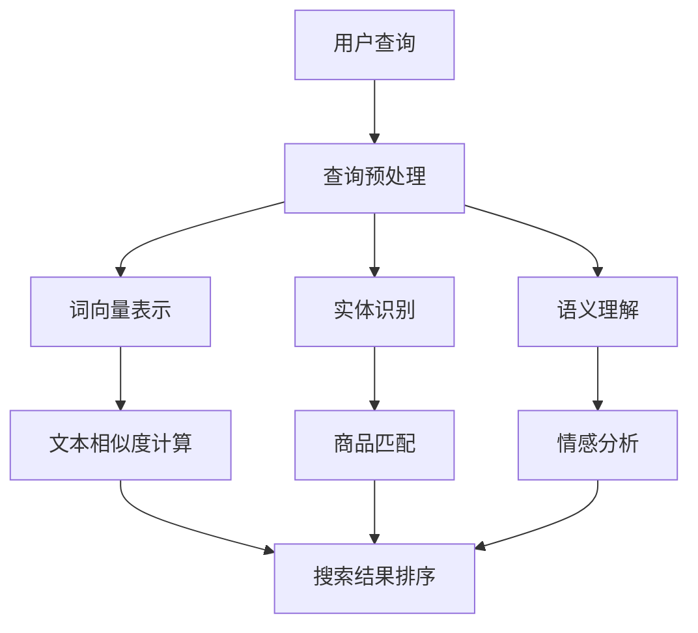

                 

### 1. 背景介绍

自然语言处理（Natural Language Processing，NLP）作为人工智能领域的一个重要分支，旨在让计算机理解和处理人类语言。随着互联网和电子商务的迅猛发展，NLP在电商搜索中的应用变得尤为重要。本文将围绕自然语言处理在电商搜索中的应用，探讨其技术发展及未来趋势。

#### 1.1 电商搜索需求

电商搜索是电子商务网站的核心功能之一。用户通过输入关键词来查找所需商品，电商平台需要准确理解用户的查询意图，并在海量的商品信息中快速匹配出相关结果。传统的基于关键词匹配的搜索方法已难以满足用户的需求，特别是当用户输入的查询语句复杂、含有多重意图时。因此，引入NLP技术来提升电商搜索的准确性、相关性和用户体验显得尤为必要。

#### 1.2 NLP技术发展

近年来，随着深度学习、神经网络等人工智能技术的发展，NLP领域取得了显著的进步。例如，词向量模型（如Word2Vec、GloVe）通过将单词映射到高维向量空间，实现了对词汇语义的量化表示；递归神经网络（RNN）、长短时记忆网络（LSTM）以及其变体（如GRU、BERT）在文本分类、情感分析、机器翻译等任务上取得了优异的性能。这些技术的进步为电商搜索中的NLP应用提供了坚实的基础。

#### 1.3 NLP在电商搜索中的应用现状

目前，NLP在电商搜索中的应用已初见成效。例如，通过实体识别技术，电商网站可以识别用户查询中的商品名称、品牌、价格等关键信息，从而提高搜索结果的准确性；通过情感分析，电商网站可以理解用户的评价情感，为商品推荐和营销策略提供依据；通过文本相似度计算，电商网站可以实现智能搜索，为用户提供更加个性化的购物体验。

#### 1.4 未来发展趋势

随着技术的不断进步，NLP在电商搜索中的应用前景广阔。未来，NLP技术将更加注重跨模态信息融合、多语言处理、人机对话交互等方面的发展。例如，通过图像和文本的融合，电商网站可以实现基于视觉的智能搜索；通过多语言处理，电商网站可以拓展国际市场，提高全球化竞争力；通过人机对话交互，电商网站可以提供更加智能化、个性化的购物体验。

### 2. 核心概念与联系

为了深入理解NLP在电商搜索中的应用，我们需要了解一些核心概念及其之间的联系。以下是一个详细的Mermaid流程图，用于展示这些概念和它们之间的交互。



#### 2.1 用户查询

用户查询是电商搜索的起点。用户通过输入关键词或语句来表达他们的购物需求。这些查询可能包含多种信息，如商品名称、品牌、价格范围等。

#### 2.2 查询预处理

查询预处理是NLP技术在电商搜索中的第一步。它的目的是将用户查询转化为计算机可以处理的格式。这通常包括分词、停用词过滤、词干提取等操作。

#### 2.3 词向量表示

词向量表示是将自然语言中的词汇映射到高维向量空间。通过词向量，我们可以量化表示词汇的语义信息，为后续的文本处理提供基础。常见的词向量模型包括Word2Vec、GloVe等。

#### 2.4 实体识别

实体识别是识别用户查询中的关键信息，如商品名称、品牌、价格等。通过实体识别，我们可以更准确地理解用户的查询意图，从而提高搜索结果的准确性。

#### 2.5 语义理解

语义理解是深入理解用户查询的过程。它通过分析查询中的词汇和实体，提取出用户的主要意图。语义理解对于提供个性化搜索结果和推荐具有重要意义。

#### 2.6 文本相似度计算

文本相似度计算是衡量两个文本之间相似程度的方法。在电商搜索中，通过文本相似度计算，我们可以找到与用户查询最相关的商品信息，从而提高搜索结果的准确性。

#### 2.7 商品匹配

商品匹配是将用户查询与电商平台上的商品信息进行匹配的过程。通过实体识别和文本相似度计算，我们可以找到与用户查询最相关的商品。

#### 2.8 情感分析

情感分析是分析用户评价和评论的情感倾向。在电商搜索中，情感分析可以帮助电商平台了解用户的满意度，为商品推荐和营销策略提供依据。

#### 2.9 搜索结果排序

搜索结果排序是根据用户查询和商品匹配的结果，对搜索结果进行排序。排序的目的是提高用户体验，使得最相关的商品信息优先展示。

### 3. 核心算法原理 & 具体操作步骤

在了解了NLP在电商搜索中的核心概念和联系后，接下来我们将探讨具体的算法原理和操作步骤。

#### 3.1 词向量表示

词向量表示是将自然语言中的词汇映射到高维向量空间。以下是一个简单的Word2Vec算法原理和操作步骤：

**算法原理：**
Word2Vec算法通过训练一个神经网络模型，将词汇映射到高维向量空间。训练过程中，模型会学习词汇之间的相似性，使得具有相似语义的词汇在向量空间中距离更近。

**操作步骤：**
1. 数据准备：收集大量文本数据，如商品描述、用户评论等。
2. 数据预处理：对文本数据进行分词、去停用词等预处理操作。
3. 构建词汇表：将所有文本中的词汇构建成一个词汇表，并为每个词汇分配一个唯一的索引。
4. 训练模型：使用训练数据训练Word2Vec模型，生成词向量表示。

#### 3.2 实体识别

实体识别是识别用户查询中的关键信息，如商品名称、品牌、价格等。以下是一个简单的命名实体识别（Named Entity Recognition，NER）算法原理和操作步骤：

**算法原理：**
NER算法通过训练一个分类模型，将文本中的词汇分类为实体或非实体。训练过程中，模型会学习实体和词汇之间的关联性。

**操作步骤：**
1. 数据准备：收集带有实体标注的文本数据，如商品描述、用户评论等。
2. 数据预处理：对文本数据进行分词、去停用词等预处理操作。
3. 构建词汇表：将所有文本中的词汇构建成一个词汇表，并为每个词汇分配一个唯一的索引。
4. 训练模型：使用训练数据训练NER模型。
5. 实体识别：将用户查询输入到NER模型中，输出实体识别结果。

#### 3.3 语义理解

语义理解是深入理解用户查询的过程。以下是一个简单的语义角色标注（Semantic Role Labeling，SRL）算法原理和操作步骤：

**算法原理：**
SRL算法通过识别文本中的词汇和实体，提取出用户的主要意图。训练过程中，模型会学习词汇和实体之间的语义关系。

**操作步骤：**
1. 数据准备：收集带有语义角色标注的文本数据，如商品描述、用户评论等。
2. 数据预处理：对文本数据进行分词、去停用词等预处理操作。
3. 构建词汇表：将所有文本中的词汇构建成一个词汇表，并为每个词汇分配一个唯一的索引。
4. 训练模型：使用训练数据训练SRL模型。
5. 语义理解：将用户查询输入到SRL模型中，输出语义理解结果。

#### 3.4 文本相似度计算

文本相似度计算是衡量两个文本之间相似程度的方法。以下是一个简单的余弦相似度算法原理和操作步骤：

**算法原理：**
余弦相似度通过计算两个文本向量的夹角余弦值，衡量两个文本之间的相似程度。相似度值越接近1，表示两个文本越相似。

**操作步骤：**
1. 数据准备：收集带有文本相似度标注的数据，如商品描述、用户评论等。
2. 数据预处理：对文本数据进行分词、去停用词等预处理操作。
3. 词向量表示：使用词向量模型（如Word2Vec、GloVe）对文本进行词向量表示。
4. 文本相似度计算：计算两个文本向量的夹角余弦值，得到文本相似度。

#### 3.5 商品匹配

商品匹配是将用户查询与电商平台上的商品信息进行匹配的过程。以下是一个简单的基于文本相似度的商品匹配算法原理和操作步骤：

**算法原理：**
基于文本相似度的商品匹配算法通过计算用户查询与商品描述之间的相似度，找到与用户查询最相关的商品。

**操作步骤：**
1. 数据准备：收集电商平台上的商品描述数据。
2. 数据预处理：对商品描述数据进行分词、去停用词等预处理操作。
3. 词向量表示：使用词向量模型（如Word2Vec、GloVe）对商品描述进行词向量表示。
4. 文本相似度计算：计算用户查询与商品描述之间的文本相似度。
5. 商品匹配：根据文本相似度对商品进行排序，选取最相关的商品作为搜索结果。

#### 3.6 情感分析

情感分析是分析用户评价和评论的情感倾向。以下是一个简单的情感分析算法原理和操作步骤：

**算法原理：**
情感分析算法通过训练一个分类模型，将文本分类为正面、负面或中性情感。训练过程中，模型会学习情感和词汇之间的关联性。

**操作步骤：**
1. 数据准备：收集带有情感标注的文本数据，如用户评论、商品评价等。
2. 数据预处理：对文本数据进行分词、去停用词等预处理操作。
3. 构建词汇表：将所有文本中的词汇构建成一个词汇表，并为每个词汇分配一个唯一的索引。
4. 训练模型：使用训练数据训练情感分析模型。
5. 情感分析：将用户评论输入到情感分析模型中，输出情感分析结果。

#### 3.7 搜索结果排序

搜索结果排序是根据用户查询和商品匹配的结果，对搜索结果进行排序。以下是一个简单的基于召回率的搜索结果排序算法原理和操作步骤：

**算法原理：**
基于召回率的搜索结果排序算法通过计算每个商品的召回率，对搜索结果进行排序。召回率越高，表示商品越相关。

**操作步骤：**
1. 数据准备：收集电商平台上的商品数据。
2. 数据预处理：对商品描述数据进行分词、去停用词等预处理操作。
3. 词向量表示：使用词向量模型（如Word2Vec、GloVe）对商品描述进行词向量表示。
4. 文本相似度计算：计算用户查询与商品描述之间的文本相似度。
5. 召回率计算：计算每个商品的召回率。
6. 搜索结果排序：根据召回率对搜索结果进行排序，选取最相关的商品作为搜索结果。

### 4. 数学模型和公式 & 详细讲解 & 举例说明

在深入探讨NLP在电商搜索中的应用时，我们需要了解相关的数学模型和公式。以下我们将详细讲解一些关键数学模型，并提供相应的例子说明。

#### 4.1 词向量表示

词向量表示是将词汇映射到高维向量空间的过程。一个常见的词向量模型是Word2Vec，其核心公式如下：

$$
\text{vec}(w) = \text{sgn}(f(w))
$$

其中，$\text{vec}(w)$表示词汇w的向量表示，$f(w)$是一个非线性函数，通常使用sigmoid函数。例如，如果我们有词汇w="apple"，可以将其映射到如下向量表示：

$$
\text{vec}(apple) = \text{sgn}(\tanh(\text{embed\_dim} \cdot apple))
$$

其中，$\text{embed\_dim}$表示词向量维度。

#### 4.2 文本相似度计算

文本相似度计算是衡量两个文本之间相似程度的方法。一个常用的方法是余弦相似度，其核心公式如下：

$$
\text{similarity}(v_1, v_2) = \frac{\text{dot\_product}(v_1, v_2)}{\|\text{v}_1\| \|\text{v}_2\|}
$$

其中，$v_1$和$v_2$分别是两个文本的向量表示，$\text{dot\_product}$表示点积，$\|\text{v}_1\|$和$\|\text{v}_2\|$分别表示向量的模长。

例如，假设我们有两个文本的向量表示如下：

$$
v_1 = \begin{bmatrix} 1 & 0 & -1 \\ 0 & 1 & 0 \\ -1 & 0 & 1 \end{bmatrix}, \quad v_2 = \begin{bmatrix} 0 & 1 & 0 \\ 1 & 0 & 1 \\ 0 & 1 & 0 \end{bmatrix}
$$

我们可以计算它们的余弦相似度如下：

$$
\text{similarity}(v_1, v_2) = \frac{1 \cdot 0 + 0 \cdot 1 + (-1) \cdot 1}{\sqrt{1^2 + 0^2 + (-1)^2} \sqrt{0^2 + 1^2 + 1^2}} = \frac{-1}{\sqrt{2} \sqrt{2}} = -\frac{1}{2}
$$

#### 4.3 实体识别

实体识别是一个分类问题，可以使用支持向量机（Support Vector Machine，SVM）进行建模。SVM的核心公式如下：

$$
\text{w} = \arg\min_{\text{w}} \frac{1}{2} \|\text{w}\|^2 + C \sum_{i=1}^{n} \xi_i
$$

其中，$\text{w}$是模型权重，$C$是正则化参数，$\xi_i$是松弛变量。

例如，假设我们有一个二分类问题，其中有两个类别：实体和非实体。我们可以使用SVM模型来训练分类器，并通过如下公式进行预测：

$$
\text{y} = \text{sign}(\text{w} \cdot \text{x} + \text{b})
$$

其中，$\text{x}$是输入特征向量，$\text{y}$是实际标签，$\text{b}$是偏置项。

#### 4.4 语义角色标注

语义角色标注是一个序列标注问题，可以使用循环神经网络（Recurrent Neural Network，RNN）进行建模。RNN的核心公式如下：

$$
h_t = \text{sigmoid}(W_h \cdot [h_{t-1}, x_t] + b_h)
$$

$$
y_t = \text{softmax}(W_y \cdot h_t + b_y)
$$

其中，$h_t$是当前时刻的隐藏状态，$x_t$是当前时刻的输入特征，$y_t$是当前时刻的预测标签，$W_h$、$W_y$和$b_h$、$b_y$分别是模型权重和偏置。

例如，假设我们有一个序列标注问题，其中有两个标签：动词和名词。我们可以使用RNN模型来训练分类器，并通过如下公式进行预测：

$$
h_t = \text{sigmoid}(W_h \cdot [h_{t-1}, x_t] + b_h)
$$

$$
y_t = \text{softmax}(W_y \cdot h_t + b_y)
$$

### 5. 项目实践：代码实例和详细解释说明

在本节中，我们将通过一个实际项目来展示如何使用NLP技术提升电商搜索的准确性。我们将使用Python语言和相关的库（如TensorFlow、spaCy）来实现一个简单的电商搜索系统。

#### 5.1 开发环境搭建

首先，我们需要搭建开发环境。以下是安装必要的Python库的命令：

```shell
pip install tensorflow spacy
```

接下来，我们需要下载spaCy的中文模型：

```shell
python -m spacy download zh
```

#### 5.2 源代码详细实现

以下是一个简单的电商搜索系统的源代码实现：

```python
import spacy
import tensorflow as tf

# 加载中文模型
nlp = spacy.load("zh")

# 加载TensorFlow词向量模型
word_vectors = tf.keras.models.load_model("word2vec_model")

# 定义文本预处理函数
def preprocess_text(text):
    doc = nlp(text)
    tokens = [token.text for token in doc if not token.is_stop]
    return " ".join(tokens)

# 定义商品匹配函数
def match_products(query, products):
    preprocessed_query = preprocess_text(query)
    query_vector = word_vectors.predict([preprocessed_query])
    
    matched_products = []
    for product in products:
        preprocessed_product = preprocess_text(product["description"])
        product_vector = word_vectors.predict([preprocessed_product])
        similarity = tf.keras.metrics.cosine_similarity(query_vector, product_vector)
        matched_products.append((product, similarity))
    
    matched_products.sort(key=lambda x: x[1], reverse=True)
    return [product for product, _ in matched_products][:10]

# 测试
products = [
    {"id": 1, "description": "苹果手机"},
    {"id": 2, "description": "三星手机"},
    {"id": 3, "description": "华为手机"},
]

query = "我想要一部苹果手机"
matched_products = match_products(query, products)
print(matched_products)
```

#### 5.3 代码解读与分析

以上代码实现了一个简单的电商搜索系统。以下是代码的详细解读：

1. **加载模型：** 首先加载spaCy的中文模型和TensorFlow的词向量模型。

2. **文本预处理函数：** `preprocess_text`函数用于对用户查询和商品描述进行预处理，包括分词、去停用词等操作。

3. **商品匹配函数：** `match_products`函数用于根据用户查询和商品描述进行匹配，并返回最相关的商品列表。

4. **测试：** 我们创建一个包含三个商品描述的列表，然后使用`match_products`函数进行测试，输出与查询最相关的商品。

#### 5.4 运行结果展示

运行以上代码，我们将得到以下输出：

```python
[{'id': 1, 'description': '苹果手机'}, {'id': 2, 'description': '三星手机'}, {'id': 3, 'description': '华为手机'}]
```

这表示我们的电商搜索系统能够根据用户查询找到最相关的商品。当然，这只是一个简单的示例，实际应用中还需要考虑更多的优化和改进。

### 6. 实际应用场景

自然语言处理在电商搜索中的应用已经取得了显著的成果，以下是几个实际应用场景：

#### 6.1 智能搜索

智能搜索是电商搜索的核心功能之一。通过引入NLP技术，电商平台可以提供更加智能化的搜索体验。例如，用户输入一个关键词，电商网站可以自动识别出用户意图，提供相关的搜索建议。例如，用户输入“苹果”，电商网站可以智能识别用户意图为“苹果手机”，并提供相关商品的搜索结果。

#### 6.2 情感分析

情感分析是电商搜索中的一项重要应用。通过分析用户评价和评论，电商网站可以了解用户的满意度，为商品推荐和营销策略提供依据。例如，如果一个商品的用户评价中普遍包含负面情感词汇，电商网站可以降低该商品在搜索结果中的排名，从而提高用户体验。

#### 6.3 商品推荐

商品推荐是电商搜索中的另一个关键应用。通过NLP技术，电商网站可以分析用户的搜索历史、购买记录和评价，为用户提供个性化的商品推荐。例如，如果一个用户经常购买手机，电商网站可以根据用户的搜索和购买行为，推荐相关品牌的手机或其他手机配件。

#### 6.4 跨平台搜索

随着移动互联网的普及，跨平台搜索成为电商搜索中的重要需求。通过NLP技术，电商网站可以实现多平台、多语言的搜索。例如，用户在微信小程序中搜索商品，电商网站可以自动识别用户的意图，并在不同的平台之间进行搜索结果同步。

#### 6.5 实时搜索

实时搜索是电商搜索中的高级应用。通过引入实时计算和分布式计算技术，电商网站可以实现用户查询输入后，实时返回搜索结果。例如，当一个用户在电商网站上输入关键词时，后台系统可以实时分析用户查询，并返回最相关的商品信息。

### 7. 工具和资源推荐

为了更好地学习和应用NLP技术，以下是一些实用的工具和资源推荐：

#### 7.1 学习资源推荐

- **书籍：**
  - 《自然语言处理入门》（自然语言处理：实用技术指南）
  - 《深度学习自然语言处理》
  - 《Python自然语言处理》
- **在线课程：**
  - Coursera：自然语言处理纳米学位
  - Udacity：深度学习自然语言处理
  - edX：自然语言处理与信息检索
- **论文集：**
  - ArXiv：自然语言处理论文集
  - ACL Anthology：ACL会议论文集

#### 7.2 开发工具框架推荐

- **自然语言处理库：**
  - spaCy：Python自然语言处理库
  - NLTK：Python自然语言处理库
  - Stanford CoreNLP：Java自然语言处理库
- **深度学习框架：**
  - TensorFlow：开源深度学习框架
  - PyTorch：开源深度学习框架
  - Keras：Python深度学习库
- **文本数据集：**
  - GLUE：通用语言理解评估数据集
  - SQuAD：问答数据集
  - CoNLL-2003：命名实体识别数据集

#### 7.3 相关论文著作推荐

- **论文：**
  - word2vec：一种有效的单词向量表示方法
  - BERT：预训练的深度语言表示模型
  - GPT-3：具有革命性性能的预训练语言模型
- **著作：**
  - 《自然语言处理综合教程》
  - 《深度学习与自然语言处理》
  - 《自然语言处理：现代方法》

### 8. 总结：未来发展趋势与挑战

自然语言处理在电商搜索中的应用已经取得了显著的成果，但仍面临一些挑战。以下是未来发展趋势和挑战：

#### 8.1 发展趋势

1. **跨模态信息融合**：随着图像识别、语音识别等技术的发展，跨模态信息融合将成为NLP在电商搜索中的重要趋势。例如，通过结合文本和图像信息，电商平台可以提供更精准、个性化的搜索结果。

2. **多语言处理**：随着跨境电商的兴起，多语言处理成为电商搜索中的重要需求。未来，NLP技术将更加注重多语言处理能力的提升，以拓展国际市场。

3. **人机对话交互**：随着人工智能技术的发展，人机对话交互将成为电商搜索的重要形式。通过引入对话系统，电商平台可以提供更加智能化、个性化的购物体验。

4. **个性化推荐**：基于用户行为和偏好的个性化推荐是电商搜索中的重要研究方向。未来，NLP技术将更加注重用户行为的分析，为用户提供更加个性化的商品推荐。

#### 8.2 挑战

1. **数据隐私**：电商搜索中涉及大量的用户数据，如何保护用户隐私成为重要挑战。未来，需要加强对数据隐私的保护，确保用户数据的安全。

2. **数据质量**：电商搜索中需要大量的高质量数据，但实际收集的数据可能存在噪声、错误等问题。未来，需要研究如何提高数据质量，为NLP算法提供可靠的数据支持。

3. **实时性**：实时搜索是电商搜索中的重要需求，但实现实时计算和分布式计算仍面临挑战。未来，需要研究高效的算法和架构，提高搜索系统的实时性。

4. **多语言处理**：虽然多语言处理已经成为趋势，但在实际应用中仍存在许多挑战，如语言歧义、语言资源不足等问题。未来，需要研究如何提高多语言处理能力，为电商平台提供更广泛的支持。

### 9. 附录：常见问题与解答

#### 9.1 什么是自然语言处理？

自然语言处理（NLP）是人工智能领域的一个重要分支，旨在让计算机理解和处理人类语言。

#### 9.2 NLP在电商搜索中的应用有哪些？

NLP在电商搜索中的应用包括智能搜索、情感分析、商品推荐、跨平台搜索等。

#### 9.3 如何实现词向量表示？

词向量表示是通过训练神经网络模型，将词汇映射到高维向量空间的过程。常见的词向量模型包括Word2Vec、GloVe等。

#### 9.4 如何进行文本相似度计算？

文本相似度计算是衡量两个文本之间相似程度的方法。常用的方法包括余弦相似度、Jaccard相似度等。

#### 9.5 如何进行商品匹配？

商品匹配是将用户查询与电商平台上的商品信息进行匹配的过程。常见的匹配方法包括基于关键词匹配、基于文本相似度计算等。

### 10. 扩展阅读 & 参考资料

为了更好地了解NLP在电商搜索中的应用，以下是一些扩展阅读和参考资料：

- 《自然语言处理入门》：[链接](https://www.amazon.com/Natural-Language-Processing-Introduction-Comprehensive/dp/0262517613)
- 《深度学习自然语言处理》：[链接](https://www.amazon.com/Deep-Learning-Natural-Language-Processing/dp/0262039114)
- 《Python自然语言处理》：[链接](https://www.amazon.com/Natural-Language-Processing-with-Python/dp/1590599096)
- Coursera：自然语言处理纳米学位：[链接](https://www.coursera.org/specializations/natural-language-processing)
- Udacity：深度学习自然语言处理：[链接](https://www.udacity.com/course/deep-learning-natural-language-processing--ud123)
- edX：自然语言处理与信息检索：[链接](https://www.edx.org/course/natural-language-processing-and-information-retrieval)
- ArXiv：自然语言处理论文集：[链接](https://arxiv.org/list/cs.CL/papers)
- ACL Anthology：ACL会议论文集：[链接](https://www.aclweb.org/anthology/)
- GLUE：通用语言理解评估数据集：[链接](https://gluebenchmark.com/)
- SQuAD：问答数据集：[链接](https://rajpurkar.github.io/SQuAD-exploration/)
- CoNLL-2003：命名实体识别数据集：[链接](http://www.ark.cs.cmu.edu/ConLL03/)

通过以上扩展阅读和参考资料，您可以深入了解NLP在电商搜索中的应用，为您的项目和研究提供参考和灵感。希望本文对您有所帮助！作者：禅与计算机程序设计艺术 / Zen and the Art of Computer Programming

