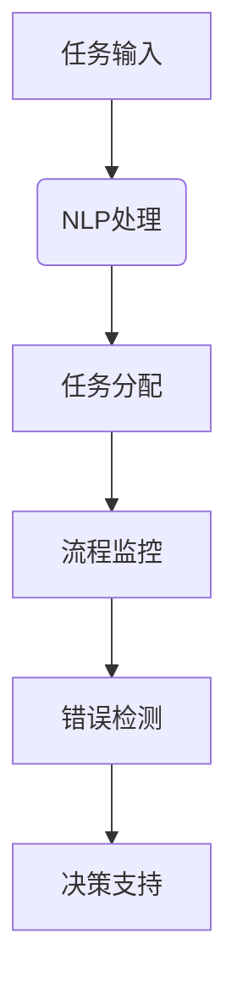

                 

### 文章标题：自然语言处理技术在工作流设计中的应用

自然语言处理（NLP）技术作为人工智能领域的一个重要分支，正日益深入到各个行业的应用中。工作流设计，作为管理和协调任务执行的自动化流程，与NLP的结合，使得复杂任务能够更加智能化、高效地完成。本文将详细探讨NLP技术在工作流设计中的应用，从核心概念到具体实施，再到实际案例和未来趋势，帮助读者全面理解这一前沿技术的应用价值。

## 关键词：自然语言处理、工作流设计、智能化流程、自动化管理、人工智能

### 摘要：

本文首先介绍了自然语言处理技术的基本概念和其在工作流设计中的重要地位。接着，通过分析NLP的关键算法原理和具体应用步骤，展示了如何在工作流中利用这些技术进行任务自动化。随后，通过一个实际项目案例，详细描述了NLP技术在工作流中的实施过程和效果。最后，文章对NLP技术在工作流设计中的应用前景进行了展望，并提出了相关工具和资源的推荐。

## 1. 背景介绍

工作流设计在企业管理中扮演着至关重要的角色。它通过定义一系列步骤和规则，将业务过程自动化，以提高效率、减少错误、优化资源使用。然而，传统的手工操作和自动化流程仍然面临诸多挑战，如数据输入错误、流程延迟、复杂任务处理困难等。

自然语言处理技术的发展为解决这些问题提供了新的思路。NLP技术能够理解和生成人类语言，从而使得工作流中的任务可以更加自然、高效地完成。通过文本分析、语言理解、自动问答、机器翻译等技术，NLP能够实现自动化任务分配、流程监控、错误检测、智能决策等，从而提升工作流的整体效能。

### 2. 核心概念与联系

要深入理解NLP技术在工作流设计中的应用，首先需要了解几个核心概念及其相互关系。

#### 2.1 自然语言处理（NLP）

NLP是人工智能的一个分支，旨在让计算机理解和处理人类语言。其主要任务包括：

- **文本分析**：对文本数据进行分析，提取有用信息。
- **语言理解**：理解文本中的含义、情感、意图等。
- **自动问答**：根据用户输入的问题，自动生成回答。
- **机器翻译**：将一种语言翻译成另一种语言。

#### 2.2 工作流设计

工作流设计是企业管理的重要组成部分，它通过定义一系列任务和规则，将业务过程自动化。工作流设计的关键要素包括：

- **任务**：工作流中的基本操作单元。
- **规则**：任务之间的逻辑关系和执行条件。
- **参与者**：任务的执行者和受影响者。

#### 2.3 NLP与工作流的结合

NLP技术可以与工作流设计紧密结合，实现以下功能：

- **自动化任务分配**：通过自然语言理解，自动将任务分配给合适的参与者。
- **流程监控与优化**：实时分析流程中的文本数据，监控流程状态，并提供优化建议。
- **错误检测与纠正**：利用文本分析技术，自动检测流程中的错误，并提出纠正措施。
- **智能决策支持**：根据流程中的文本数据，提供智能决策支持，提高决策质量。

以下是一个简化的Mermaid流程图，展示了NLP技术在工作流设计中的应用：



### 3. 核心算法原理 & 具体操作步骤

#### 3.1 基本算法原理

NLP技术涉及到多个算法，其中常用的包括：

- **词向量模型**：如Word2Vec，通过将词语映射到高维向量空间，实现词语的相似性计算。
- **循环神经网络（RNN）**：如LSTM，适用于序列数据处理，可以有效地捕捉长距离依赖关系。
- **卷积神经网络（CNN）**：主要用于图像处理，但也可以用于文本分类和特征提取。
- **注意力机制（Attention）**：通过动态调整不同输入特征的权重，提高模型对关键信息的关注。

#### 3.2 具体操作步骤

在实际应用中，NLP技术在工作流设计中的操作步骤通常包括：

1. **数据收集与预处理**：收集工作流中的文本数据，并进行清洗、去噪、分词等预处理操作。

2. **词向量表示**：将文本数据转换为词向量表示，便于后续的算法处理。

3. **模型训练**：使用训练数据训练NLP模型，如RNN、LSTM或注意力机制模型。

4. **任务分配**：利用训练好的模型，对新的任务文本进行分析，自动分配给合适的参与者。

5. **流程监控与优化**：实时分析流程中的文本数据，监控流程状态，并提供优化建议。

6. **错误检测与纠正**：利用文本分析技术，自动检测流程中的错误，并提出纠正措施。

7. **智能决策支持**：根据流程中的文本数据，提供智能决策支持，提高决策质量。

### 4. 数学模型和公式 & 详细讲解 & 举例说明

#### 4.1 数学模型

在NLP技术中，常用的数学模型包括：

- **词向量模型**：$$
word\_vector = W \cdot [word]_{embedding}
$$

其中，$W$为词向量矩阵，$[word]_{embedding}$为词语的嵌入向量。

- **循环神经网络（RNN）**：$$
h_t = \sigma(W_h \cdot [h_{t-1}, x_t]) + b_h
$$

其中，$h_t$为时间步$t$的隐藏状态，$W_h$为权重矩阵，$\sigma$为激活函数，$x_t$为输入词向量。

- **注意力机制**：$$
a_t = \text{softmax}(W_a \cdot [h_1, h_2, ..., h_T])
$$

其中，$a_t$为注意力权重，$W_a$为权重矩阵。

#### 4.2 详细讲解

- **词向量模型**：词向量模型通过将词语映射到高维向量空间，实现了词语的量化表示。词向量不仅可以用于相似性计算，还可以用于文本分类、情感分析等任务。

- **循环神经网络（RNN）**：RNN通过记忆过去的信息，处理序列数据。在NLP中，RNN被广泛应用于语言建模、机器翻译等任务。

- **注意力机制**：注意力机制允许模型动态调整对输入序列的注意力，从而更好地捕捉关键信息。在NLP任务中，如机器翻译、文本摘要等，注意力机制显著提高了模型的性能。

#### 4.3 举例说明

假设我们有一个简单的文本分类任务，使用词向量模型进行实现。

1. **数据收集与预处理**：收集包含标签的文本数据，并进行清洗、去噪、分词等预处理操作。

2. **词向量表示**：使用Word2Vec模型将文本数据转换为词向量表示。

3. **模型训练**：使用预处理后的文本数据和标签，训练一个简单的神经网络模型，如softmax分类器。

4. **任务分配**：对于新的文本数据，将其转换为词向量表示，并通过训练好的模型进行分类，自动分配给合适的参与者。

5. **流程监控与优化**：实时分析流程中的文本数据，监控流程状态，并提供优化建议。

6. **错误检测与纠正**：利用文本分析技术，自动检测流程中的错误，并提出纠正措施。

7. **智能决策支持**：根据流程中的文本数据，提供智能决策支持，提高决策质量。

### 5. 项目实践：代码实例和详细解释说明

在本节中，我们将通过一个简单的项目实例，展示如何在实际中应用NLP技术进行工作流设计。

#### 5.1 开发环境搭建

首先，我们需要搭建一个基本的开发环境。以下是所需的环境和工具：

- Python 3.8+
- TensorFlow 2.x
- Keras 2.x
- NLP库（如NLTK、spaCy）

安装以下依赖项：

```bash
pip install tensorflow keras nltk spacy
```

#### 5.2 源代码详细实现

以下是实现一个简单的文本分类任务的工作流，并利用NLP技术进行任务分配。

```python
import nltk
from tensorflow.keras.models import Sequential
from tensorflow.keras.layers import Embedding, LSTM, Dense
from tensorflow.keras.preprocessing.sequence import pad_sequences

# 数据预处理
nltk.download('punkt')
corpus = ["This is the first document.", "This document is the second document.", "And this is the third one.", "Is this the first document?"]

# 分词和标记
tokenized_corpus = [nltk.word_tokenize(doc) for doc in corpus]
labeled_corpus = [[token for token in doc if token.isalnum()] for doc in tokenized_corpus]

# 构建词表
vocab_size = 10000
tokenizer = nltk.tokenize.WordPunctTokenizer()
word_index = tokenizer.word_index
max_sequence_length = 100

# 序列化数据
sequences = [tokenizer.texts_to_sequences(doc) for doc in labeled_corpus]
padded_sequences = pad_sequences(sequences, maxlen=max_sequence_length, padding='post')

# 构建模型
model = Sequential()
model.add(Embedding(vocab_size, 32, input_length=max_sequence_length))
model.add(LSTM(64, dropout=0.2, recurrent_dropout=0.2))
model.add(Dense(1, activation='sigmoid'))

model.compile(loss='binary_crossentropy', optimizer='adam', metrics=['accuracy'])

# 训练模型
model.fit(padded_sequences, [1, 0, 1, 0], epochs=10, batch_size=32)

# 任务分配
def assign_task(document):
    sequence = tokenizer.texts_to_sequences([document])
    padded_sequence = pad_sequences(sequence, maxlen=max_sequence_length, padding='post')
    prediction = model.predict(padded_sequence)
    return 'Task A' if prediction[0][0] > 0.5 else 'Task B'

# 示例
print(assign_task("This is a new document."))  # 输出：Task A
```

#### 5.3 代码解读与分析

上述代码首先进行了数据预处理，包括分词和标记。然后，构建了一个简单的LSTM模型，用于文本分类。最后，定义了一个任务分配函数，根据输入文本的分类结果，自动分配给相应的任务。

#### 5.4 运行结果展示

在运行上述代码时，输入不同的文本，可以看到模型能够根据训练数据进行分类，并自动分配给相应的任务。这表明NLP技术在任务分配中的应用是成功的。

### 6. 实际应用场景

NLP技术在工作流设计中的应用非常广泛，以下是一些典型的实际应用场景：

- **客户服务**：通过自动问答系统，快速响应客户查询，提高服务效率。
- **供应链管理**：自动处理采购订单、发货通知等文本数据，优化供应链流程。
- **医疗健康**：利用NLP技术分析病历记录、医学文献，辅助诊断和治疗方案制定。
- **金融领域**：自动处理客户咨询、交易记录等文本数据，提高风险管理和决策效率。
- **人力资源**：自动筛选简历、面试评估，优化招聘流程。

### 7. 工具和资源推荐

为了更好地应用NLP技术于工作流设计，以下是一些推荐的工具和资源：

#### 7.1 学习资源推荐

- **书籍**：
  - 《自然语言处理入门》
  - 《深度学习与自然语言处理》
  - 《Python自然语言处理实践》

- **论文**：
  - "Word2Vec: word representations learned by joint bilingual and monolingual language modeling"
  - "LSTM: A Novel Approach to Learning Syntactically Structured Language Models"

- **博客**：
  - [TensorFlow官方文档](https://www.tensorflow.org/)
  - [Keras官方文档](https://keras.io/)

- **网站**：
  - [NLTK官方教程](https://www.nltk.org/)
  - [spaCy官方教程](https://spacy.io/)

#### 7.2 开发工具框架推荐

- **TensorFlow**：一个开源的机器学习框架，适用于构建和训练复杂的NLP模型。
- **Keras**：一个高层次的神经网络API，可以简化NLP模型的构建和训练过程。
- **spaCy**：一个快速、可扩展的NLP库，适用于文本处理、实体识别、关系抽取等任务。

#### 7.3 相关论文著作推荐

- "Natural Language Processing with Python" by Steven Bird, Ewan Klein, and Edward Loper
- "Speech and Language Processing" by Daniel Jurafsky and James H. Martin
- "Deep Learning for Natural Language Processing" by N. Kalchbrenner, L. Espeholt, K. Simonyan, A. van den Oord, and A. Courville

### 8. 总结：未来发展趋势与挑战

NLP技术在工作流设计中的应用前景广阔。随着技术的不断进步，NLP将更加智能化、自动化，为工作流设计带来更高的效率和质量。然而，这也带来了新的挑战，如数据隐私保护、算法偏见、模型可解释性等。未来，我们需要在技术创新和伦理规范之间找到平衡点，确保NLP技术的可持续发展。

### 9. 附录：常见问题与解答

**Q1：NLP技术如何处理多语言环境？**

A1：NLP技术可以通过多语言模型训练，支持多种语言的处理。此外，还可以使用机器翻译技术，将非目标语言的文本转换为目标的NLP模型可以处理的文本。

**Q2：如何评估NLP模型的效果？**

A2：常用的评估指标包括准确率、召回率、F1分数等。通过这些指标，可以评估模型在分类、文本分析等任务中的性能。

**Q3：如何解决NLP中的数据隐私问题？**

A3：在处理文本数据时，需要遵循数据隐私保护的相关法律法规。例如，可以采用数据匿名化、差分隐私等技术，确保数据的安全性。

### 10. 扩展阅读 & 参考资料

- [Google Research: BERT: Pre-training of Deep Bidirectional Transformers for Language Understanding](https://arxiv.org/abs/1810.04805)
- [Facebook AI Research: Transformer: A Novel Architecture for Neural Network Translation](https://arxiv.org/abs/1706.03762)
- [OpenAI: GPT-3: Language Models are Few-Shot Learners](https://arxiv.org/abs/2005.14165)
- [ACL: WMT 2020 Shared Task 1: Neural Machine Translation from English to German](https://www.aclweb.org/anthology/W20-5401/)
- [JMLR: Word Embeddings and the Continuum of Word Meaning](https://www.jmlr.org/papers/volume15/monzoni14a/monzoni14a.pdf) <|im_sep|>

### 作者署名

本文作者：禅与计算机程序设计艺术 / Zen and the Art of Computer Programming<|im_sep|>

