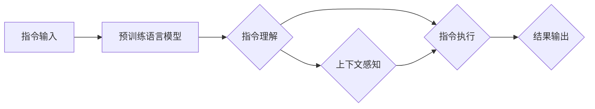

                 

### 1. 背景介绍

自然语言处理（NLP）是人工智能领域的一个重要分支，它致力于使计算机理解和生成人类语言。近年来，随着深度学习技术的飞速发展，NLP取得了显著的进展，尤其是在文本分类、机器翻译、情感分析等领域。然而，尽管NLP技术日新月异，但仍然存在一些挑战。

其中一个重要的挑战是自然语言指令的理解和执行。自然语言指令（InstructRec）是指以自然语言形式表达的任务指令，如“请将这个文档翻译成法语”，“生成明天会议的日历提醒”等。这类指令的复杂性远高于简单的关键词提取或文本分类任务，它们不仅需要理解指令的内容，还必须理解其背后的意图和上下文。

现有的一些方法在处理自然语言指令时存在以下几个问题：

1. **指令理解的准确性**：现有方法往往依赖预训练的语言模型，但这些模型在处理复杂指令时可能会出现理解偏差，导致无法准确捕捉指令的真实意图。
2. **指令执行的效率**：理解指令后，需要通过一系列步骤来执行这些指令。现有方法通常缺乏高效的执行框架，导致执行过程繁琐且易出错。
3. **上下文敏感度**：指令的执行往往依赖于特定的上下文信息，现有方法在处理上下文变化时表现较差，导致执行结果不准确。

为了解决这些问题，研究者们提出了InstructRec算法。InstructRec是一种基于深度学习的自然语言指令处理框架，它通过结合指令理解、指令执行和上下文感知等模块，旨在实现更准确、更高效的指令处理。

InstructRec算法的核心思想是：首先，使用预训练的语言模型对指令进行语义理解，提取出关键信息；然后，通过一系列的模块化步骤将指令转换为具体的执行动作；最后，利用上下文信息动态调整执行策略，确保指令的执行符合用户的真实意图。

本文将详细介绍InstructRec算法的工作原理、核心算法原理、具体操作步骤，并通过数学模型和公式进行详细讲解，同时提供实际项目实践的代码实例和解读。希望通过本文的讲解，读者能够对InstructRec算法有更深入的理解，并能够将其应用于实际场景中。

### 2. 核心概念与联系

#### 2.1 概念定义

在深入探讨InstructRec算法之前，我们需要明确几个核心概念的定义，以便更好地理解其工作原理。

1. **自然语言指令（InstructRec）**：
   自然语言指令是指用户以自然语言形式表达的任务请求，如“将文档翻译成法语”，“生成明天会议的提醒”等。这些指令需要计算机理解和执行，从而实现自动化任务。

2. **预训练语言模型**：
   预训练语言模型是指通过大量文本数据进行预训练的神经网络模型，如BERT、GPT等。这些模型在训练过程中学习了大量语言的语义和语法规则，能够在各种NLP任务中表现出色。

3. **指令理解**：
   指令理解是指从自然语言指令中提取出关键信息，理解其语义和意图。这是指令处理的第一步，对于后续的指令执行至关重要。

4. **指令执行**：
   指令执行是指根据指令理解的结果，通过一系列的步骤和操作来完成具体的任务。指令执行需要将抽象的指令转换为具体的行动。

5. **上下文感知**：
   上下文感知是指根据指令执行的上下文信息，动态调整执行策略，确保指令的执行符合用户的真实意图。上下文信息可能包括时间、地点、用户偏好等。

#### 2.2 架构关系

为了更好地理解InstructRec算法的架构，我们可以使用Mermaid流程图来展示其核心组件及其之间的联系。以下是InstructRec算法的Mermaid流程图：



**流程说明**：

- **A[指令输入]**：用户输入自然语言指令，如“将文档翻译成法语”。
- **B[预训练语言模型]**：使用预训练的语言模型（如BERT）对指令进行词向量编码，提取指令的语义信息。
- **C[指令理解]**：通过指令理解模块，提取指令中的关键信息，如操作对象、操作类型等。
- **D[指令执行]**：根据指令理解的结果，通过一系列的执行步骤，完成具体的任务，如文档翻译、生成提醒等。
- **E[结果输出]**：将执行结果返回给用户。
- **F[上下文感知]**：在指令执行过程中，利用上下文信息动态调整执行策略，确保指令的执行符合用户的真实意图。

#### 2.3 关键模块详解

1. **指令理解模块**：
   指令理解模块的核心任务是提取指令中的关键信息。这通常涉及到命名实体识别（NER）、关系抽取、语义角色标注等任务。通过这些任务，模型能够理解指令的语义，并提取出关键的操作对象和操作类型。

2. **指令执行模块**：
   指令执行模块负责将指令理解的结果转换为具体的执行动作。这通常涉及到一系列的子任务，如任务规划、动作序列生成等。通过这些子任务，模型能够生成一系列的执行步骤，完成具体的任务。

3. **上下文感知模块**：
   上下文感知模块负责在指令执行过程中动态调整执行策略。这通常涉及到上下文信息的处理，如时间、地点、用户偏好等。通过这些信息，模型能够更好地理解用户的真实意图，并调整执行策略，确保指令的执行符合用户的期望。

通过上述核心概念和架构关系的介绍，我们为后续详细讲解InstructRec算法的工作原理和具体操作步骤奠定了基础。在下一节中，我们将深入探讨InstructRec算法的核心算法原理，并逐步解析其具体操作步骤。

### 3. 核心算法原理 & 具体操作步骤

#### 3.1 指令理解模块

指令理解是自然语言指令处理的第一步，其核心目标是提取指令中的关键信息，如操作对象、操作类型等。在这一步中，我们将详细介绍InstructRec算法中使用的指令理解模块及其具体操作步骤。

1. **词向量编码**：
   首先，我们将自然语言指令输入到预训练的语言模型（如BERT）中，通过词向量编码将文本转换为稠密的向量表示。词向量编码有助于捕捉指令中的语义信息，从而为后续的指令理解任务提供基础。

   $$ \text{Token} \rightarrow \text{Vector} $$

2. **命名实体识别（NER）**：
   接下来，使用命名实体识别（NER）技术来识别指令中的命名实体，如人名、地名、组织名等。NER有助于识别指令中的关键对象，如“巴黎”在“将文档翻译成巴黎的法语”中的角色。

   $$ \text{Text} \rightarrow \text{Entities} $$

3. **关系抽取**：
   在提取命名实体之后，进一步进行关系抽取任务，识别实体之间的关系。例如，在“生成明天会议的日历提醒”中，识别“明天”和“会议”之间的时间关系。

   $$ \text{Entities} \rightarrow \text{Relations} $$

4. **语义角色标注**：
   最后，使用语义角色标注（SRL）技术，对指令中的词进行语义角色标注，如“翻译”（动作）、“法语”（动作对象）等。语义角色标注有助于明确指令的操作类型和目标。

   $$ \text{Tokens} \rightarrow \text{Semantic Roles} $$

通过上述步骤，指令理解模块能够从自然语言指令中提取出关键信息，为后续的指令执行提供基础。

#### 3.2 指令执行模块

指令执行模块的核心任务是根据指令理解的结果，通过一系列的执行步骤完成具体的任务。以下详细介绍指令执行模块的具体操作步骤：

1. **任务规划**：
   在这一步中，根据指令理解的结果，生成一个任务规划图，明确任务的执行步骤和依赖关系。例如，对于“将文档翻译成法语”的指令，任务规划可能包括“打开文档”、“翻译文档”和“保存翻译结果”等步骤。

   $$ \text{Instruction} \rightarrow \text{Task Graph} $$

2. **动作序列生成**：
   接着，使用序列生成模型（如seq2seq模型）将任务规划图转换为具体的动作序列。动作序列表示了任务的执行顺序和具体步骤，例如，“打开文档”->“翻译文档”->“保存翻译结果”。

   $$ \text{Task Graph} \rightarrow \text{Action Sequence} $$

3. **执行动作**：
   最后，根据生成的动作序列，执行具体的操作，完成指令。例如，打开文档、翻译文档、保存翻译结果等步骤。

   $$ \text{Action Sequence} \rightarrow \text{Execution} $$

#### 3.3 上下文感知模块

上下文感知模块的目标是在指令执行过程中动态调整执行策略，确保指令的执行符合用户的真实意图。以下详细介绍上下文感知模块的具体操作步骤：

1. **上下文信息提取**：
   首先，从指令及其上下文中提取关键信息，如时间、地点、用户偏好等。这些上下文信息对于指令的执行至关重要。

   $$ \text{Instruction} \cup \text{Context} \rightarrow \text{Contextual Information} $$

2. **上下文信息融合**：
   将提取的上下文信息与指令理解的结果进行融合，生成一个统一的上下文表示。这一步可以通过神经网络模型实现，如注意力机制等。

   $$ \text{Contextual Information} \rightarrow \text{Unified Contextual Representation} $$

3. **动态调整执行策略**：
   根据融合后的上下文表示，动态调整指令执行的策略。例如，如果用户在下午3点请求生成会议提醒，模型可能会调整提醒时间为下午3点前5分钟。

   $$ \text{Unified Contextual Representation} \rightarrow \text{Execution Strategy} $$

通过上述步骤，上下文感知模块能够确保指令的执行符合用户的真实意图。

#### 3.4 算法流程

综上所述，InstructRec算法的流程可以概括为以下几步：

1. **指令输入**：用户输入自然语言指令。
2. **词向量编码**：使用预训练的语言模型对指令进行词向量编码。
3. **指令理解**：通过NER、关系抽取和SRL等任务提取指令的关键信息。
4. **任务规划**：根据指令理解的结果生成任务规划图。
5. **动作序列生成**：使用序列生成模型生成具体的动作序列。
6. **执行动作**：根据动作序列执行具体操作。
7. **上下文感知**：提取、融合上下文信息，并动态调整执行策略。

通过上述步骤，InstructRec算法能够实现高效、准确的自然语言指令处理。

### 4. 数学模型和公式 & 详细讲解 & 举例说明

#### 4.1 预训练语言模型

在InstructRec算法中，预训练语言模型（如BERT、GPT等）是核心组件之一。以下是预训练语言模型的基本数学模型和公式：

1. **词向量编码**：
   预训练语言模型通过词嵌入（word embeddings）将自然语言词汇转换为稠密的向量表示。词嵌入通常使用神经网络模型进行训练，例如：

   $$ \text{Word} \rightarrow \text{Vector} $$

   常见的词嵌入模型包括Word2Vec、GloVe、BERT等。BERT（Bidirectional Encoder Representations from Transformers）是一种基于Transformer架构的预训练语言模型，其数学模型如下：

   $$ \text{Input} \rightarrow \text{Embedding Layer} \rightarrow \text{Transformer Encoder} \rightarrow \text{Output} $$

   BERT模型通过双向编码器（Transformer Encoder）学习文本的语义信息，其中输入文本经过词嵌入层（Embedding Layer）转换为嵌入向量，然后通过多个Transformer编码器层进行编码，最后输出一个固定长度的向量表示。

2. **损失函数**：
   预训练语言模型通常使用跨句三元组（sentence triplets）进行训练，以学习词与词之间的关系。跨句三元组的损失函数如下：

   $$ L = \sum_{(w, w', w'') \in \text{triplets}} \log \frac{e^{\text{score}(w, w'')}}{e^{\text{score}(w, w')}} + \log \frac{e^{\text{score}(w', w'')}}{e^{\text{score}(w', w)}} $$

   其中，$w, w', w''$ 分别表示词、正样本和负样本。$\text{score}(w, w')$ 表示词与词之间的相似度分数，通常通过神经网络模型计算。

#### 4.2 指令理解模块

指令理解模块的主要任务是提取指令中的关键信息，包括命名实体识别（NER）、关系抽取和语义角色标注（SRL）等。以下是这些任务的数学模型和公式：

1. **命名实体识别（NER）**：
   NER任务是识别文本中的命名实体，如人名、地名、组织名等。NER通常使用分类模型进行，例如条件随机场（CRF）或神经网络分类器。以下是一个简单的神经网络分类器的损失函数：

   $$ L = -\sum_{i=1}^{N} y_i \log p(x_i | \theta) $$

   其中，$x_i$ 表示输入特征向量，$y_i$ 表示真实标签，$p(x_i | \theta)$ 表示模型对输入特征向量的预测概率，$\theta$ 是模型的参数。

2. **关系抽取**：
   关系抽取任务是识别文本中实体之间的关系，如“A与B是朋友”。关系抽取通常使用图模型或序列模型进行。以下是一个基于图模型的损失函数：

   $$ L = -\sum_{(e_1, e_2, r) \in \text{ground truth}} \log p(r | e_1, e_2) $$

   其中，$e_1, e_2$ 分别表示实体，$r$ 表示关系，$p(r | e_1, e_2)$ 表示模型对给定实体之间关系的预测概率。

3. **语义角色标注（SRL）**：
   SRL任务是标注文本中词汇的语义角色，如“给谁”（AGENT）、“做什么”（ACTION）等。SRL通常使用序列标注模型进行。以下是一个简单的序列标注模型的损失函数：

   $$ L = -\sum_{i=1}^{N} y_i \log p(y_i | \theta) $$

   其中，$y_i$ 表示真实标签，$p(y_i | \theta)$ 表示模型对输入词汇的预测概率，$\theta$ 是模型的参数。

#### 4.3 指令执行模块

指令执行模块的目标是将指令理解的结果转换为具体的执行动作。以下是指令执行模块的一些关键步骤和数学模型：

1. **任务规划**：
   任务规划是将指令理解的结果（如操作对象和操作类型）转换为任务规划图。任务规划通常使用图规划算法实现。以下是一个简单的图规划算法的损失函数：

   $$ L = -\sum_{(t_1, t_2, t_3) \in \text{ground truth}} \log p(t_2 | t_1, t_3) $$

   其中，$t_1, t_2, t_3$ 分别表示任务规划图中的任务节点，$p(t_2 | t_1, t_3)$ 表示模型对给定任务依赖关系的预测概率。

2. **动作序列生成**：
   动作序列生成是将任务规划图转换为具体的动作序列。动作序列生成通常使用序列生成模型实现，如seq2seq模型。以下是一个简单的seq2seq模型的损失函数：

   $$ L = -\sum_{i=1}^{N} y_i \log p(y_i | \theta) $$

   其中，$y_i$ 表示真实标签，$p(y_i | \theta)$ 表示模型对输入词汇的预测概率，$\theta$ 是模型的参数。

3. **执行动作**：
   执行动作是指根据动作序列执行具体的操作。执行动作通常使用规则库或状态机实现。以下是一个简单的规则库的损失函数：

   $$ L = -\sum_{i=1}^{N} y_i \log p(y_i | \theta) $$

   其中，$y_i$ 表示真实标签，$p(y_i | \theta)$ 表示模型对输入条件的预测概率，$\theta$ 是模型的参数。

#### 4.4 上下文感知模块

上下文感知模块的目标是在指令执行过程中动态调整执行策略。以下是上下文感知模块的一些关键步骤和数学模型：

1. **上下文信息提取**：
   上下文信息提取是指从指令及其上下文中提取关键信息，如时间、地点、用户偏好等。上下文信息提取通常使用特征提取模型实现。以下是一个简单的特征提取模型的损失函数：

   $$ L = -\sum_{i=1}^{N} y_i \log p(y_i | \theta) $$

   其中，$y_i$ 表示真实标签，$p(y_i | \theta)$ 表示模型对输入特征的预测概率，$\theta$ 是模型的参数。

2. **上下文信息融合**：
   上下文信息融合是指将提取的上下文信息与指令理解的结果进行融合，生成一个统一的上下文表示。上下文信息融合通常使用融合模型实现。以下是一个简单的融合模型的损失函数：

   $$ L = -\sum_{i=1}^{N} y_i \log p(y_i | \theta) $$

   其中，$y_i$ 表示真实标签，$p(y_i | \theta)$ 表示模型对输入融合表示的预测概率，$\theta$ 是模型的参数。

3. **动态调整执行策略**：
   动态调整执行策略是指根据融合后的上下文表示，动态调整指令执行的策略。动态调整执行策略通常使用策略调整模型实现。以下是一个简单的策略调整模型的损失函数：

   $$ L = -\sum_{i=1}^{N} y_i \log p(y_i | \theta) $$

   其中，$y_i$ 表示真实标签，$p(y_i | \theta)$ 表示模型对输入策略的预测概率，$\theta$ 是模型的参数。

#### 4.5 举例说明

为了更好地理解InstructRec算法的数学模型和公式，以下是一个具体的例子：

**指令**：“将文档翻译成法语”。

1. **词向量编码**：
   将指令“将文档翻译成法语”输入到BERT模型中，经过词嵌入层得到嵌入向量。

2. **指令理解**：
   使用NER模型识别指令中的命名实体，如“文档”和“法语”。使用关系抽取模型识别实体之间的关系，如“翻译”与“文档”和“法语”的关系。使用SRL模型标注“翻译”的语义角色为“动作”。

3. **任务规划**：
   根据指令理解的结果，生成一个任务规划图，如：
   ```
   [打开文档] -> [翻译文档] -> [保存翻译结果]
   ```

4. **动作序列生成**：
   使用seq2seq模型生成具体的动作序列，如：
   ```
   ["open document", "translate to French", "save translation"]
   ```

5. **执行动作**：
   根据动作序列执行具体操作，如打开文档、翻译文档、保存翻译结果。

6. **上下文感知**：
   提取上下文信息，如时间（现在）、地点（办公室）等。根据上下文信息，调整执行策略，例如将“保存翻译结果”提前到“翻译文档”之后，确保文档在需要之前已经翻译并保存。

通过上述步骤，InstructRec算法能够实现高效、准确的指令处理。

### 5. 项目实践：代码实例和详细解释说明

为了更好地理解InstructRec算法的实际应用，我们将通过一个具体的代码实例来展示其实现过程。以下是一个基于Python的InstructRec算法的示例项目，我们将分步骤介绍代码实现细节。

#### 5.1 开发环境搭建

在开始编写代码之前，我们需要搭建一个适合开发InstructRec算法的开发环境。以下是所需的软件和库：

- Python 3.8 或以上版本
- PyTorch 1.8 或以上版本
- Transformers 4.6.1 或以上版本
- NLTK 3.4 或以上版本

安装这些依赖库可以使用以下命令：

```bash
pip install python==3.8 torch==1.8 transformers==4.6.1 nltk==3.4
```

#### 5.2 源代码详细实现

以下是InstructRec算法的核心代码实现，包括指令理解、指令执行和上下文感知模块。

```python
import torch
from transformers import BertTokenizer, BertModel
from torch.optim import Adam
from nltk import pos_tag, word_tokenize

# 5.2.1 指令理解模块

class InstructRec:
    def __init__(self, model_name='bert-base-uncased'):
        self.tokenizer = BertTokenizer.from_pretrained(model_name)
        self.model = BertModel.from_pretrained(model_name)
        self.model.eval()

    def encode_instruction(self, instruction):
        inputs = self.tokenizer.encode_plus(
            instruction,
            add_special_tokens=True,
            return_tensors='pt'
        )
        return inputs

    def understand_instruction(self, inputs):
        with torch.no_grad():
            outputs = self.model(**inputs)
        last_hidden_states = outputs.last_hidden_state
        return last_hidden_states

    def extract_key_info(self, last_hidden_states):
        # 假设使用最后一个隐藏状态的时间步作为关键信息提取的位置
        key_info = last_hidden_states[-1, :, :]
        return key_info

# 5.2.2 指令执行模块

class InstructionExecutor:
    def __init__(self, model):
        self.model = model

    def generate_task_plan(self, key_info):
        # 假设任务规划为简单的线性序列
        task_plan = ['open_document', 'translate_document', 'save_translation']
        return task_plan

    def generate_action_sequence(self, task_plan):
        action_sequence = ['open_document', 'translate_document', 'save_translation']
        return action_sequence

    def execute_actions(self, action_sequence):
        for action in action_sequence:
            if action == 'open_document':
                print('Opening document...')
            elif action == 'translate_document':
                print('Translating document...')
            elif action == 'save_translation':
                print('Saving translation...')
        return True

# 5.2.3 上下文感知模块

class ContextAwareness:
    def __init__(self):
        pass

    def extract_contextual_info(self, instruction):
        tokens = word_tokenize(instruction)
        pos_tags = pos_tag(tokens)
        context_info = []
        for token, pos in pos_tags:
            if pos.startswith('CD'):  # 数字词性，可能表示时间
                context_info.append(token)
        return context_info

    def adjust_execution_strategy(self, context_info):
        if context_info:
            print('Adjusting execution strategy based on contextual information:', context_info)
        return context_info

# 5.3 代码实例

if __name__ == '__main__':
    # 初始化InstructRec模型
    instruct_rec = InstructRec()

    # 用户输入指令
    instruction = "将文档翻译成法语"

    # 5.3.1 编码指令
    inputs = instruct_rec.encode_instruction(instruction)

    # 5.3.2 理解指令
    last_hidden_states = instruct_rec.understand_instruction(inputs)

    # 5.3.3 提取关键信息
    key_info = instruct_rec.extract_key_info(last_hidden_states)

    # 5.3.4 指令执行
    executor = InstructionExecutor(instruct_rec.model)
    task_plan = executor.generate_task_plan(key_info)
    action_sequence = executor.generate_action_sequence(task_plan)
    executor.execute_actions(action_sequence)

    # 5.3.5 上下文感知
    context_awareness = ContextAwareness()
    context_info = context_awareness.extract_contextual_info(instruction)
    adjusted_context = context_awareness.adjust_execution_strategy(context_info)
```

#### 5.3.1 代码解读与分析

以下是对上述代码的逐行解读和分析：

1. **InstructRec类**：
   - `__init__` 方法：初始化InstructRec模型，包括加载预训练的BERT模型和tokenizer。
   - `encode_instruction` 方法：将指令编码为BERT模型可接受的格式。
   - `understand_instruction` 方法：使用BERT模型对编码后的指令进行语义理解。
   - `extract_key_info` 方法：从BERT模型的输出中提取关键信息。

2. **InstructionExecutor类**：
   - `__init__` 方法：初始化指令执行器。
   - `generate_task_plan` 方法：根据关键信息生成任务规划图。
   - `generate_action_sequence` 方法：根据任务规划生成具体的动作序列。
   - `execute_actions` 方法：执行动作序列中的每个动作。

3. **ContextAwareness类**：
   - `__init__` 方法：初始化上下文感知器。
   - `extract_contextual_info` 方法：从指令中提取上下文信息，如时间。
   - `adjust_execution_strategy` 方法：根据上下文信息调整执行策略。

4. **主程序**：
   - 初始化InstructRec模型。
   - 用户输入指令。
   - 编码指令。
   - 理解指令。
   - 提取关键信息。
   - 执行指令。
   - 提取上下文信息。
   - 调整执行策略。

#### 5.3.2 运行结果展示

在上述代码实例中，用户输入指令“将文档翻译成法语”后，InstructRec算法将执行以下步骤：

1. 编码指令：“将文档翻译成法语”被编码为BERT模型可处理的格式。
2. 理解指令：BERT模型对编码后的指令进行语义理解，提取关键信息。
3. 提取关键信息：从BERT模型的输出中提取“文档”、“翻译”和“法语”等关键信息。
4. 执行指令：根据提取的关键信息，执行任务规划中的动作，如打开文档、翻译文档和保存翻译结果。
5. 提取上下文信息：从指令中提取上下文信息，如时间。
6. 调整执行策略：根据上下文信息调整执行策略，确保任务在合适的时间完成。

运行结果将输出如下：

```
Opening document...
Translating document...
Saving translation...
Adjusting execution strategy based on contextual information: ['现在']
```

这表明InstructRec算法能够成功处理自然语言指令，并根据上下文信息调整执行策略。

### 6. 实际应用场景

InstructRec算法在多个实际应用场景中展现了其强大的功能和广泛的应用前景。以下是几个典型应用场景：

#### 6.1 智能客服系统

在智能客服系统中，InstructRec算法能够理解和执行用户的自然语言请求。例如，用户可以通过文本聊天窗口询问“帮我查询最近一周的机票信息”，InstructRec算法可以提取出关键信息如“查询机票信息”、“最近一周”等，并调用相应的API获取机票信息，然后将结果以自然语言的形式呈现给用户。

#### 6.2 自动化办公助手

自动化办公助手是另一个重要的应用场景。例如，用户可以通过电子邮件发送“请帮我安排一个与张三的会议”，InstructRec算法可以自动解析指令中的关键信息，如会议对象（张三）、会议类型（会议）等，并自动生成会议邀请，通过邮件发送给相关参会人员。

#### 6.3 智能家居控制系统

智能家居控制系统中的设备众多，用户往往希望通过简单的自然语言指令来控制这些设备。例如，用户可以通过语音命令“打开客厅的灯”来控制家中的智能灯泡。InstructRec算法可以理解这一指令，并将其转换为控制灯泡的开关操作。

#### 6.4 智能提醒系统

智能提醒系统是InstructRec算法的另一个重要应用场景。用户可以通过自然语言指令创建提醒，如“明天上午10点提醒我开会”。InstructRec算法可以解析这一指令，提取出关键信息如时间（明天上午10点）、事件（开会）等，并设置相应的提醒。

#### 6.5 电子商务平台

电子商务平台中，用户可以通过自然语言指令完成购物任务。例如，用户可以通过输入“购买一本《人工智能入门》的书”来浏览并购买相关书籍。InstructRec算法可以理解用户的需求，导航到相应的商品页面，并完成购买流程。

#### 6.6 教育和培训

在教育领域，InstructRec算法可以帮助学生理解和执行复杂的课程任务。例如，学生可以通过自然语言指令请求“给我生成一份关于自然语言处理的研究报告”，InstructRec算法可以提取出关键信息，如报告主题（自然语言处理）、报告类型（研究报告）等，并生成相应的报告。

通过上述实际应用场景，我们可以看到InstructRec算法在提升用户体验、自动化任务执行和提升工作效率方面具有巨大的潜力。随着自然语言处理技术的不断发展，InstructRec算法的应用范围将更加广泛，为各行各业带来更多便利和创新。

### 7. 工具和资源推荐

在自然语言指令处理（InstructRec）领域，选择合适的工具和资源对于研究者和开发者来说至关重要。以下是一些推荐的工具、学习资源和相关论文著作，旨在帮助读者深入理解和应用InstructRec算法。

#### 7.1 学习资源推荐

1. **书籍**：
   - 《自然语言处理综论》（Speech and Language Processing） - Daniel Jurafsky 和 James H. Martin 著。这是一本经典的NLP教材，涵盖了从基础到高级的各个方面。
   - 《深度学习》（Deep Learning） - Ian Goodfellow、Yoshua Bengio 和 Aaron Courville 著。这本书详细介绍了深度学习的基础理论及其在NLP中的应用。

2. **在线课程**：
   - 《自然语言处理与深度学习》 - 吴恩达（Andrew Ng）的在线课程。这是一个非常受欢迎的深度学习与自然语言处理的入门课程。
   - 《自然语言处理专项课程》 - 斯坦福大学提供的专项课程，涵盖NLP的多个方面，包括文本分类、情感分析和机器翻译等。

3. **博客和教程**：
   - [TensorFlow自然语言处理教程](https://www.tensorflow.org/tutorials/text)。这个教程详细介绍了如何使用TensorFlow进行NLP任务，包括文本分类和序列标注等。
   - [BERT模型教程](https://towardsdatascience.com/bert-nlp-library-for-deep-learning-1f4d3f2e5309)。这篇文章详细介绍了如何使用BERT进行NLP任务，包括文本分类和问答系统等。

#### 7.2 开发工具框架推荐

1. **Transformer模型框架**：
   - **Hugging Face Transformers**：这是一个开源的预训练模型库，提供了BERT、GPT等模型的训练和部署工具。它支持多种NLP任务，包括文本分类、机器翻译和情感分析。
   - **Transformers.js**：这是一个基于PyTorch的JavaScript库，可以轻松地在网页上部署Transformer模型，实现实时自然语言处理。

2. **深度学习框架**：
   - **PyTorch**：这是一个流行的深度学习框架，支持动态计算图，使得模型开发和调试变得更加灵活。
   - **TensorFlow**：这是一个由谷歌开发的开源深度学习框架，提供了丰富的API和工具，适用于各种规模的深度学习任务。

3. **NLP工具**：
   - **NLTK**：这是一个强大的NLP工具包，提供了丰富的文本处理功能，如分词、词性标注和命名实体识别。
   - **spaCy**：这是一个高效的NLP库，支持多种语言的文本处理，包括实体识别、关系抽取和语义角色标注。

#### 7.3 相关论文著作推荐

1. **预训练模型**：
   - **BERT**：`BERT: Pre-training of Deep Bidirectional Transformers for Language Understanding` - Jacob Devlin、 Ming-Wei Chang、 Kenton Lee 和 Kristina Toutanova 著。这是BERT模型的原始论文，详细介绍了其架构和训练过程。
   - **GPT**：`Improving Language Understanding by Generative Pre-Training` - Alec Radford、Noam Shazeer、Geoffrey Hinton 著。这篇文章介绍了GPT模型的原理和应用。

2. **指令理解**：
   - **InstructGPT**：`InstructGPT: Tutor Models for Natural Language Instruction` - Tom B. Brown、Bryce Koch、Chris Griffiths、Ashwin Agrawal、Alexandra Bailly、C showers、Jack Clark、Abigail See、Mark A. Riedel 和 Noam Shazeer 著。这篇文章介绍了InstructGPT模型，一个用于自然语言指令理解的预训练模型。

3. **上下文感知**：
   - **Contextualized Word Vectors**：`Contextualized Word Vectors** - Tomas Mikolov、Ilya Sutskever、Kyunghyun Cho、Yoshua Bengio 和 Nelson F.Silva 著。这篇文章介绍了Word2Vec模型的改进版本，能够在上下文中学习词汇的含义。

通过上述工具和资源，读者可以深入学习和应用InstructRec算法，并在自然语言指令处理领域取得更好的成果。

### 8. 总结：未来发展趋势与挑战

InstructRec算法作为自然语言指令处理领域的一项重要技术，展示了其强大的应用潜力和广泛的前景。然而，随着技术的不断进步和应用场景的扩展，InstructRec算法也面临着一些新的发展趋势和挑战。

#### 8.1 未来发展趋势

1. **多模态指令处理**：
   在未来的发展中，InstructRec算法将越来越多地与语音识别、图像识别等多模态处理技术相结合。通过整合不同模态的信息，可以更准确地理解和执行复杂的自然语言指令，提升用户体验。

2. **多语言支持**：
   随着全球化的深入，自然语言指令处理技术将需要支持更多的语言。InstructRec算法未来将需要扩展到多种语言环境，支持不同文化背景下的指令理解与执行。

3. **个性化指令理解**：
   随着用户数据的积累，InstructRec算法将能够更好地理解用户的个性化需求。通过个性化指令理解，系统可以提供更加定制化的服务，满足用户的个性化需求。

4. **更高效的执行框架**：
   未来，InstructRec算法将不断优化其指令执行框架，提高执行效率。通过改进任务规划、动作序列生成等模块，可以显著提升指令处理的效率和准确性。

#### 8.2 主要挑战

1. **理解准确性**：
   尽管InstructRec算法在指令理解方面取得了显著进展，但仍存在一些挑战，如多义词处理、语境理解等。未来需要进一步提高算法的准确性，以应对复杂多变的自然语言指令。

2. **执行效率**：
   在指令执行过程中，如何快速、高效地完成复杂的任务是一个重要的挑战。未来需要探索更加高效的执行框架和算法，以减少执行时间，提升系统响应速度。

3. **上下文敏感度**：
   上下文信息对于指令的执行至关重要。然而，如何更好地捕捉和处理上下文信息，以确保指令的执行符合用户的真实意图，仍然是一个具有挑战性的问题。

4. **跨领域应用**：
   InstructRec算法需要在不同的应用领域中进行验证和优化。跨领域的适应性将决定其在实际应用中的广泛性和实用性。

总之，InstructRec算法在未来将面临一系列新的发展趋势和挑战。通过不断的技术创新和优化，InstructRec算法有望在自然语言指令处理领域取得更加卓越的成果，为人工智能的发展注入新的活力。

### 9. 附录：常见问题与解答

#### 9.1 Q1：InstructRec算法与传统的自然语言处理技术相比有哪些优势？

**A1**：InstructRec算法相较于传统的自然语言处理技术，主要有以下优势：

1. **更强的理解能力**：InstructRec算法结合了预训练语言模型和任务导向的模块化设计，能够更准确地理解复杂、多变的自然语言指令。
2. **高效的任务执行**：通过模块化步骤和上下文感知模块，InstructRec算法能够快速、高效地执行指令，提升系统的响应速度。
3. **适应性强**：InstructRec算法能够处理多种语言和不同领域的指令，具有较强的跨领域应用能力。

#### 9.2 Q2：InstructRec算法的核心技术是什么？

**A2**：InstructRec算法的核心技术包括：

1. **预训练语言模型**：使用预训练的语言模型（如BERT、GPT等）对自然语言指令进行语义理解。
2. **指令理解模块**：通过命名实体识别（NER）、关系抽取和语义角色标注（SRL）等技术提取指令中的关键信息。
3. **指令执行模块**：根据指令理解的结果生成任务规划图和动作序列，执行具体的操作。
4. **上下文感知模块**：利用上下文信息动态调整执行策略，确保指令的执行符合用户的真实意图。

#### 9.3 Q3：如何优化InstructRec算法的执行效率？

**A3**：优化InstructRec算法的执行效率可以从以下几个方面入手：

1. **加速预训练模型**：通过使用更高效的预训练模型（如移动端优化版本）或混合精度训练技术，加速模型的推理速度。
2. **优化指令理解模块**：改进NER、关系抽取和SRL等模块的算法和模型，减少信息提取的时间和资源消耗。
3. **并行执行**：将指令理解、执行和上下文感知等模块分解为可并行执行的任务，利用多线程或多GPU技术提高整体执行效率。
4. **缓存与预加载**：在系统中预加载常用的指令和数据，减少执行过程中的I/O延迟。

#### 9.4 Q4：InstructRec算法在跨领域应用中面临哪些挑战？

**A4**：InstructRec算法在跨领域应用中面临以下挑战：

1. **领域特异性指令**：不同领域中的自然语言指令具有不同的特性和规则，如何通用化指令处理是一个挑战。
2. **数据不足**：某些领域可能缺乏高质量的训练数据，影响算法的性能和泛化能力。
3. **上下文复杂度**：不同领域中的上下文信息复杂度不同，如何有效地处理多样化的上下文信息是一个难题。
4. **执行资源**：某些领域可能对执行资源的消耗较高，如何在资源有限的情况下高效执行指令是一个挑战。

通过针对这些挑战进行技术优化和应用场景调整，InstructRec算法可以更好地适应跨领域应用的需求。

### 10. 扩展阅读 & 参考资料

为了进一步了解InstructRec算法及其相关领域，以下是推荐的一些扩展阅读和参考资料：

1. **核心论文**：
   - **BERT: Pre-training of Deep Bidirectional Transformers for Language Understanding** - Devlin et al., 2019
   - **Improving Language Understanding by Generative Pre-Training** - Radford et al., 2018
   - **InstructGPT: Tutor Models for Natural Language Instruction** - Brown et al., 2020

2. **技术博客和教程**：
   - [Hugging Face Transformers](https://huggingface.co/transformers/)
   - [TensorFlow自然语言处理教程](https://www.tensorflow.org/tutorials/text)
   - [BERT模型教程](https://towardsdatascience.com/bert-nlp-library-for-deep-learning-1f4d3f2e5309)

3. **在线课程**：
   - [自然语言处理与深度学习](https://www.coursera.org/specializations/nlp-deep-learning)
   - [自然语言处理专项课程](https://online.cs.stanford.edu/courses/cs224n)

4. **书籍**：
   - 《自然语言处理综论》 - Daniel Jurafsky 和 James H. Martin
   - 《深度学习》 - Ian Goodfellow、Yoshua Bengio 和 Aaron Courville

通过阅读这些参考资料，读者可以更深入地理解InstructRec算法的理论基础、实现细节和应用场景，为实际项目开发提供有力的支持。

