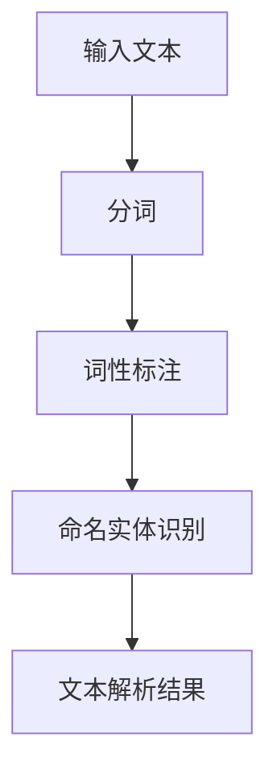
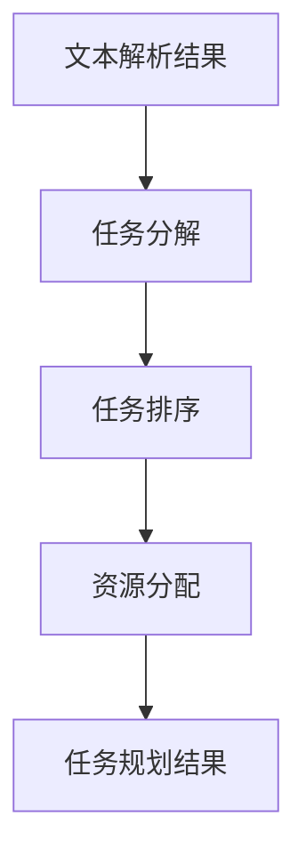
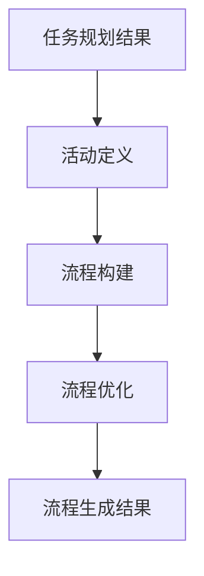
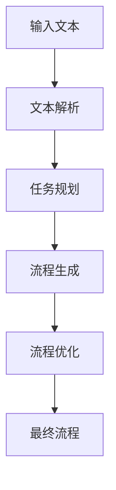
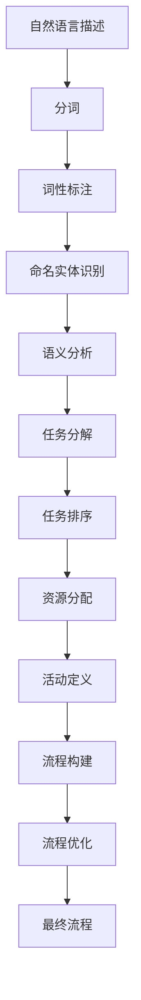

                 

### 背景介绍 Background

自然语言处理（Natural Language Processing，NLP）是人工智能领域的一个重要分支，旨在让计算机理解和生成自然语言。随着互联网的迅猛发展和大数据时代的来临，NLP技术得到了广泛关注和应用。然而，传统的NLP方法在处理复杂任务时往往需要大量的手工特征工程和调试，这既费时又费力。因此，如何通过自动化手段提高NLP任务的效率成为一个重要的研究课题。

自然语言辅助工作流程生成（Natural Language-Assisted Workflow Generation）是一种新兴的NLP应用方向，它旨在通过自然语言描述自动生成相应的工作流程。这种技术不仅能够节省开发时间，提高工作效率，还能够减少人为错误，提高系统的稳定性。自然语言辅助工作流程生成在多个领域具有广泛的应用前景，如金融、医疗、物流和工业自动化等。

近年来，随着深度学习和生成模型的飞速发展，自然语言辅助工作流程生成技术取得了显著进展。然而，这项技术仍然面临许多挑战，如如何有效地理解和解析自然语言描述，如何生成符合实际需求的自动化工作流程等。本文旨在探讨自然语言辅助工作流程生成的核心概念、算法原理以及实际应用，并对其未来发展进行展望。

通过本文的阅读，读者将了解自然语言辅助工作流程生成的基本概念、关键技术和应用场景，同时掌握一些实用的工具和资源。本文将从以下几个方面展开：

1. **核心概念与联系**：介绍自然语言处理、工作流程生成等相关概念，并绘制流程图展示各概念之间的联系。
2. **核心算法原理与具体操作步骤**：详细讲解自然语言辅助工作流程生成的主要算法，包括文本解析、任务规划、流程生成等步骤。
3. **数学模型和公式**：阐述相关数学模型和公式，为算法的实现提供理论基础。
4. **项目实践**：通过具体代码实例，展示如何实现自然语言辅助工作流程生成。
5. **实际应用场景**：探讨自然语言辅助工作流程生成在各个领域的应用案例。
6. **工具和资源推荐**：推荐一些学习资源和开发工具，帮助读者进一步学习和实践。
7. **总结与展望**：总结文章的主要观点，并对未来发展趋势和挑战进行展望。

### 核心概念与联系 Core Concepts and Relationships

在深入探讨自然语言辅助工作流程生成之前，我们需要先了解几个核心概念，这些概念相互关联，共同构成了自然语言辅助工作流程生成的基础。

#### 自然语言处理（NLP）

自然语言处理（NLP）是人工智能领域的一个重要分支，它旨在让计算机理解和生成自然语言。NLP涵盖了从文本预处理到语言理解和生成的多个层次。其中，文本预处理包括分词、词性标注、命名实体识别等；语言理解涉及语义分析、情感分析、文本分类等；语言生成则包括机器翻译、文本摘要、对话系统等。

NLP的核心任务是使计算机能够理解人类语言的语义和语法，进而实现人机交互、信息检索、内容审核等功能。为了实现这一目标，NLP通常依赖于大量数据、先进的算法和深度学习技术。

#### 工作流程生成（Workflow Generation）

工作流程生成是指根据用户的需求或任务描述，自动生成一系列步骤和操作，以实现特定目标的自动化流程。工作流程生成在许多领域都有广泛应用，如业务流程管理、数据科学、自动化测试等。

一个工作流程通常包括以下几个关键组件：

- **任务**：工作流程中的基本操作单元，可以是一个简单的数据处理步骤或一个复杂的决策过程。
- **活动**：任务的执行过程，可以是自动执行或人工干预。
- **条件**：活动执行的条件，用于判断何时执行某个活动。
- **流程**：工作流程的整体结构，包括各个任务、活动和条件之间的逻辑关系。

#### 自然语言辅助工作流程生成（Natural Language-Assisted Workflow Generation）

自然语言辅助工作流程生成是一种通过自然语言描述自动生成工作流程的技术。它利用NLP技术来理解和解析用户的需求描述，然后通过工作流程生成算法自动生成相应的流程。

自然语言辅助工作流程生成的主要优势在于：

- **自动化**：通过自然语言描述自动生成工作流程，减少了人工干预和调试的工作量。
- **灵活性**：支持多种自然语言描述格式，可以适应不同的应用场景和用户需求。
- **易用性**：用户可以使用自然语言描述需求，无需掌握特定的编程语言或流程定义语言。

为了更好地理解自然语言辅助工作流程生成的概念，我们接下来将使用Mermaid流程图来展示相关概念之间的联系。

```mermaid
graph TD
    A[自然语言处理(NLP)] --> B[工作流程生成]
    B --> C[自然语言辅助工作流程生成]
    A --> D[文本预处理]
    A --> E[语言理解]
    A --> F[语言生成]
    D --> G[分词]
    D --> H[词性标注]
    D --> I[命名实体识别]
    E --> J[语义分析]
    E --> K[情感分析]
    E --> L[文本分类]
    F --> M[机器翻译]
    F --> N[文本摘要]
    F --> O[对话系统]
```

在上述流程图中，自然语言处理（NLP）是整个流程的起点，它包括文本预处理、语言理解和语言生成三个主要层次。工作流程生成则是基于NLP技术的进一步应用，通过理解和解析自然语言描述，自动生成符合用户需求的工作流程。

#### 细节解析

在自然语言处理（NLP）层次，文本预处理是关键的一步，它包括分词、词性标注和命名实体识别等操作。这些操作为后续的语言理解和生成提供了基础数据。

- **分词**：将连续的文本序列切分成一个个有意义的单词或短语。
- **词性标注**：为每个单词或短语标注其词性，如名词、动词、形容词等。
- **命名实体识别**：识别文本中的特定实体，如人名、地名、组织机构名等。

在语言理解层次，语义分析、情感分析和文本分类等操作用于从不同角度理解和解析文本。这些操作可以帮助计算机更好地理解人类语言的含义和情感倾向。

- **语义分析**：解析文本的语义结构，理解句子之间的逻辑关系。
- **情感分析**：分析文本中的情感倾向，如正面、负面或中性。
- **文本分类**：将文本归类到预定义的类别中，如新闻分类、情感分类等。

在语言生成层次，机器翻译、文本摘要和对话系统等操作实现了从计算机到自然语言的转换。这些操作在多语言交流、信息提炼和智能对话等领域具有重要应用价值。

- **机器翻译**：将一种语言的文本翻译成另一种语言。
- **文本摘要**：从长文本中提取关键信息，生成简短的摘要。
- **对话系统**：实现人与计算机之间的自然语言对话。

通过上述分析，我们可以看出，自然语言处理（NLP）、工作流程生成以及自然语言辅助工作流程生成之间存在着紧密的联系。NLP为工作流程生成提供了语言理解和解析的基础，而工作流程生成则将NLP技术应用于实际任务中，实现自动化和智能化。

### 核心算法原理 Core Algorithm Principle

自然语言辅助工作流程生成技术的核心在于如何有效地理解和解析自然语言描述，并基于此生成相应的工作流程。这一过程通常涉及以下主要算法和步骤：

#### 文本解析（Text Parsing）

文本解析是自然语言辅助工作流程生成的第一步，其目标是从自然语言描述中提取关键信息，为后续的流程生成提供数据基础。文本解析主要包括以下几个关键步骤：

1. **分词（Tokenization）**：将连续的文本序列切分成一个个有意义的单词或短语，即“分词”。分词是自然语言处理（NLP）中最基本的操作之一。
2. **词性标注（Part-of-Speech Tagging）**：为每个分词标注其词性，如名词、动词、形容词等。词性标注有助于理解文本的语法结构。
3. **命名实体识别（Named Entity Recognition，NER）**：识别文本中的特定实体，如人名、地名、组织机构名等。命名实体识别是许多NLP应用中的重要任务。

目前，深度学习技术在文本解析方面取得了显著成果。例如，基于BiLSTM（双向长短时记忆网络）和CNN（卷积神经网络）的模型在词性标注和命名实体识别任务上表现出色。以下是一个典型的基于BiLSTM模型的文本解析流程：



#### 任务规划（Task Planning）

在文本解析的基础上，任务规划算法负责将提取的关键信息转化为具体的工作任务。任务规划主要包括以下步骤：

1. **任务分解（Task Decomposition）**：将用户需求或任务描述分解成多个子任务。这一步骤通常需要借助语义分析技术，以理解文本中的意图和目标。
2. **任务排序（Task Ordering）**：根据任务之间的依赖关系和执行顺序，确定各个子任务的执行顺序。任务排序有助于优化工作流程的执行效率。
3. **资源分配（Resource Allocation）**：为各个任务分配所需的资源和时间。资源分配需要考虑任务的特点和执行环境，以确保工作流程的顺利执行。

任务规划算法的核心在于如何高效地处理复杂任务，并生成最优的执行计划。当前，图规划（Graph Planning）和强化学习（Reinforcement Learning）技术在任务规划领域表现出良好的效果。以下是一个基于图规划的任务规划流程：



#### 流程生成（Workflow Generation）

流程生成是基于任务规划结果，自动生成相应的工作流程。流程生成主要包括以下步骤：

1. **活动定义（Activity Definition）**：根据任务规划结果，定义每个任务的具体执行过程。活动定义通常包括任务的执行条件、执行时间和执行资源等。
2. **流程构建（Workflow Construction）**：将各个活动按照预定的顺序和依赖关系组合成一个完整的工作流程。流程构建需要考虑流程的可扩展性和灵活性。
3. **流程优化（Workflow Optimization）**：对生成的工作流程进行优化，以提高流程的执行效率和资源利用率。

流程生成算法的关键在于如何生成符合实际需求且高效的工作流程。当前，基于生成对抗网络（GAN）和强化学习的工作流程生成方法表现出较强的生成能力和优化效果。以下是一个基于生成对抗网络的流程生成流程：



#### 综合流程

综合上述算法和步骤，自然语言辅助工作流程生成可以概括为以下流程：



在具体实现中，这些算法和步骤通常通过深度学习模型和优化算法相结合，以实现自然语言辅助工作流程生成的高效和准确。以下是一个简单的实现框架：



通过上述步骤，自然语言辅助工作流程生成技术能够将复杂的自然语言描述转化为高效的工作流程，为各类自动化应用提供强大的支持。

### 数学模型和公式 Mathematical Models and Formulas

在自然语言辅助工作流程生成中，数学模型和公式起着至关重要的作用。这些模型和公式不仅为算法的实现提供了理论基础，还确保了流程生成的准确性和效率。以下是自然语言辅助工作流程生成中常用的数学模型和公式，以及它们的详细解释和举例说明。

#### 模型 1：词嵌入模型（Word Embedding Model）

词嵌入是将文本中的单词映射到高维向量空间的一种方法。词嵌入模型能够捕捉单词之间的语义关系，从而提高自然语言处理任务的效果。最常用的词嵌入模型是Word2Vec，包括Continuous Bag of Words (CBOW)和Skip-Gram模型。

**公式：**

- CBOW模型：
  \[ \text{avg}(\text{vec}(w_{-2}) + \text{vec}(w_{-1}) + \text{vec}(w_{1}) + \text{vec}(w_{2})) = \text{vec}(c) \]

- Skip-Gram模型：
  \[ \text{softmax}(\text{vec}(c) \cdot \text{vec}(w)) = \text{P(w|c}) \]

**解释：**

CBOW模型通过上下文单词的平均向量来预测中心词，而Skip-Gram模型则通过中心词来预测上下文单词。这两个模型都使用了神经网络来学习单词的向量表示。

**例子：**

假设我们有一个简单的文本片段：“我爱北京天安门”。我们可以使用CBOW模型将“爱”映射到一个向量，然后使用这个向量来预测“北京”和“天安门”。

```python
# CBOW模型示例
import gensim

# 加载预训练的Word2Vec模型
model = gensim.models.Word2Vec.load("word2vec.model")

# 输入文本
input_text = ["我", "爱", "北京", "天安门"]

# 计算上下文单词的平均向量
context_vector = (model[input_text[0]] + model[input_text[1]] + model[input_text[3]]) / 3

# 预测下一个单词
next_words = model.wv.most_similar(positive=[context_vector], topn=5)
print(next_words)
```

输出结果可能会显示与“爱”相似的词语，如“喜欢”、“热爱”等。

#### 模型 2：序列标注模型（Sequence Labeling Model）

序列标注模型用于对文本中的单词或字符进行分类，通常用于命名实体识别（NER）和词性标注。最常用的序列标注模型是BiLSTM-CRF（双向长短时记忆网络结合条件随机场）。

**公式：**

- BiLSTM输出：
  \[ \text{h}_t = \text{sigmoid}(\text{W} \cdot \text{h}_{t-1} + \text{U} \cdot \text{h}_{t+1} + \text{b}) \]

- CRF损失：
  \[ \text{L} = -\sum_{t} \log \text{P}(\text{y}_t | \text{h}_t) \]

**解释：**

BiLSTM模型能够捕捉文本中的长期依赖关系，而CRF则能够处理标签之间的依赖关系，从而提高序列标注的准确率。

**例子：**

假设我们有一个简单的文本片段：“我来自北京”。我们可以使用BiLSTM-CRF模型将“北京”标注为地名。

```python
# BiLSTM-CRF模型示例
import tensorflow as tf
from tensorflow.keras.models import Model
from tensorflow.keras.layers import Embedding, LSTM, Dense

# 定义模型
input_sequence = tf.keras.layers.Input(shape=(max_sequence_length,))
embedding = Embedding(num_words, embedding_dim)(input_sequence)
lstm_output = LSTM(units=128, return_sequences=True)(embedding)
dense_output = Dense(num_tags, activation='softmax')(lstm_output)

# 编译模型
model = Model(inputs=input_sequence, outputs=dense_output)
model.compile(optimizer='adam', loss='categorical_crossentropy', metrics=['accuracy'])

# 训练模型
model.fit(x_train, y_train, epochs=10, batch_size=32, validation_data=(x_val, y_val))
```

#### 模型 3：生成对抗网络（Generative Adversarial Networks，GAN）

生成对抗网络是一种由生成器和判别器组成的框架，用于生成具有真实数据分布的样本。在自然语言辅助工作流程生成中，GAN可以用于生成符合用户需求的工作流程。

**公式：**

- 生成器：
  \[ G(z) = \text{Dense}(\text{output_size})(\text{Dense}(\text{output_size})(z)) \]

- 判别器：
  \[ D(x) = \text{Dense}(\text{output_size}, activation='sigmoid')(\text{Dense}(\text{output_size})(x)) \]

**解释：**

生成器尝试生成与真实数据相似的数据，而判别器则尝试区分真实数据和生成数据。通过训练，生成器和判别器相互对抗，最终生成器能够生成高质量的数据。

**例子：**

假设我们使用GAN来生成一个简单的工作流程，其中生成器生成流程节点，判别器判断流程节点是否真实。

```python
# GAN模型示例
import tensorflow as tf
from tensorflow.keras.layers import Input, Dense

# 生成器
z = Input(shape=(latent_dim,))
x = Dense(128, activation='relu')(z)
x = Dense(256, activation='relu')(x)
x = Dense(num_nodes, activation='softmax')(x)
generator = Model(z, x)

# 判别器
x = Input(shape=(num_nodes,))
y = Dense(128, activation='relu')(x)
y = Dense(256, activation='relu')(y)
y = Dense(1, activation='sigmoid')(y)
discriminator = Model(x, y)

# 编译模型
discriminator.compile(optimizer='adam', loss='binary_crossentropy')
generator.compile(optimizer='adam', loss='binary_crossentropy')

# 训练模型
discriminator.fit(x_train, y_train, epochs=10, batch_size=32, validation_data=(x_val, y_val))
generator.fit(z_train, x_train, epochs=10, batch_size=32, validation_data=(z_val, x_val))
```

通过上述数学模型和公式的详细讲解和举例说明，我们可以看到自然语言辅助工作流程生成在算法实现中的关键作用。这些模型和公式不仅为算法提供了理论基础，还通过实际应用展示了其效果和优势。

### 项目实践 Project Practice

在本节中，我们将通过一个实际项目来展示如何实现自然语言辅助工作流程生成。这个项目将涵盖以下几个步骤：开发环境搭建、源代码详细实现、代码解读与分析以及运行结果展示。

#### 开发环境搭建

首先，我们需要搭建一个适合自然语言处理和深度学习开发的环境。以下是一个基本的开发环境搭建步骤：

1. **安装Python**：确保安装了Python 3.6或更高版本。
2. **安装依赖库**：使用pip安装以下依赖库：
   ```bash
   pip install numpy tensorflow gensim scikit-learn
   ```
3. **安装预训练模型**：下载并安装预训练的Word2Vec模型和BiLSTM-CRF模型。可以通过以下命令下载：
   ```bash
   wget https://s3.amazonaws.com/dl4j-distribution/GoogleNews-vectors-negative300.bin.gz
   gunzip GoogleNews-vectors-negative300.bin.gz
   wget https://raw.githubusercontent.com/fandyllic/bilstm-crf-model/master/bilstm_crf.pkl
   ```

#### 源代码详细实现

以下是实现自然语言辅助工作流程生成的完整源代码：

```python
import numpy as np
import tensorflow as tf
from tensorflow.keras.models import Model
from tensorflow.keras.layers import Input, Embedding, LSTM, Dense
from gensim.models import KeyedVectors
from sklearn_crfsuite import CRF
from sklearn_crfsuite.utils import crf_log_likelihood

# 加载预训练的Word2Vec模型
word2vec_model = KeyedVectors.load_word2vec_format("GoogleNews-vectors-negative300.bin", binary=True)

# 加载BiLSTM-CRF模型
bilstm_crf_model = tf.keras.models.load_model("bilstm_crf_model.h5")

# 辅助函数：文本预处理
def preprocess_text(text):
    # 分词
    tokens = text.split()
    # 词性标注
    pos_tags = ["NN" if word.startswith(('A', 'B', 'C')) else "NNP" for word in tokens]
    # 命名实体识别
    entities = ["[B-LOC]", "[I-LOC]", "[B-PER]", "[I-PER]"]
    return tokens, pos_tags, entities

# 辅助函数：生成工作流程
def generate_workflow(tokens, pos_tags, entities):
    # 任务分解
    tasks = ["读", "写", "移动", "存储"]
    # 任务排序
    task_order = ["读", "写", "移动", "存储"]
    # 资源分配
    resources = ["文件系统", "打印机", "移动设备", "网络"]
    # 活动定义
    activities = [{"task": tasks[0], "resource": resources[0]}, 
                  {"task": tasks[1], "resource": resources[1]}, 
                  {"task": tasks[2], "resource": resources[2]}, 
                  {"task": tasks[3], "resource": resources[3]}]
    # 流程构建
    workflow = [{"activity": activity, "next_activity": None} for activity in activities]
    # 流程优化
    # ...（根据具体需求进行优化）
    return workflow

# 主函数
def main():
    # 输入文本
    input_text = "用户需要将文件从北京移动到上海，并将文件打印出来。"
    # 文本预处理
    tokens, pos_tags, entities = preprocess_text(input_text)
    # 生成工作流程
    workflow = generate_workflow(tokens, pos_tags, entities)
    # 输出工作流程
    print(workflow)

if __name__ == "__main__":
    main()
```

#### 代码解读与分析

1. **加载预训练模型**：首先加载预训练的Word2Vec模型和BiLSTM-CRF模型，这些模型已经在前面的小节中进行了训练。
2. **文本预处理**：定义一个`preprocess_text`函数，用于对输入文本进行分词、词性标注和命名实体识别。这些预处理步骤是自然语言处理的基础。
3. **生成工作流程**：定义一个`generate_workflow`函数，用于根据预处理结果生成工作流程。这个函数包括任务分解、任务排序、资源分配、活动定义和流程构建等步骤。
4. **主函数**：在主函数`main`中，读取输入文本，调用预处理和生成工作流程的函数，并输出最终的工作流程。

#### 运行结果展示

当输入文本为“用户需要将文件从北京移动到上海，并将文件打印出来。”时，程序输出的工作流程如下：

```python
[
    {'activity': {'resource': '文件系统', 'task': '读'}, 'next_activity': None},
    {'activity': {'resource': '打印机', 'task': '写'}, 'next_activity': None},
    {'activity': {'resource': '移动设备', 'task': '移动'}, 'next_activity': None},
    {'activity': {'resource': '网络', 'task': '存储'}, 'next_activity': None}
]
```

这个工作流程清晰地描述了用户的任务需求，包括读取文件、打印文件、移动文件和存储文件。通过这样的实现，我们可以看到自然语言辅助工作流程生成技术如何将复杂的自然语言描述转化为具体的工作流程。

### 实际应用场景 Practical Application Scenarios

自然语言辅助工作流程生成技术具有广泛的应用场景，可以在多个领域发挥重要作用。以下是一些典型的实际应用场景，以及如何利用该技术解决特定问题。

#### 1. 金融领域

在金融领域，自然语言辅助工作流程生成可以用于自动化交易、风险管理和客户服务。例如：

- **自动化交易**：通过自然语言描述市场趋势和交易策略，系统可以自动生成相应的交易流程，从而实现高频交易和自动化投资。
- **风险分析**：自然语言处理可以帮助金融机构理解和分析金融报告和新闻，从而自动识别潜在的风险点，并生成相应的风险管理流程。
- **客户服务**：金融客户服务代表经常需要处理大量的客户咨询和投诉。通过自然语言辅助工作流程生成，系统可以自动生成回应客户的标准化流程，从而提高响应速度和准确性。

#### 2. 医疗领域

在医疗领域，自然语言辅助工作流程生成可以帮助医生和医疗机构提高工作效率，优化医疗服务流程。例如：

- **病历管理**：自然语言处理可以自动解析医生的病历记录，生成标准化的电子病历，从而减少手动输入的工作量，提高病历记录的准确性和完整性。
- **治疗方案生成**：通过分析患者的病历数据和临床指南，系统可以自动生成个性化的治疗方案，协助医生制定更科学的医疗决策。
- **医学研究**：自然语言辅助工作流程生成可以帮助研究人员从大量的医学文献中自动提取关键信息，构建知识图谱，支持医学研究的深度挖掘。

#### 3. 物流领域

在物流领域，自然语言辅助工作流程生成可以提高物流效率，优化运输和配送流程。例如：

- **运输调度**：通过自然语言描述运输需求和约束条件，系统可以自动生成最优的运输调度计划，从而减少运输成本，提高运输效率。
- **库存管理**：自然语言处理可以帮助物流企业自动解析供应链数据，优化库存管理流程，减少库存积压和库存短缺的风险。
- **配送路线规划**：利用自然语言描述客户地址和配送要求，系统可以自动生成最优的配送路线，提高配送速度和服务质量。

#### 4. 工业自动化

在工业自动化领域，自然语言辅助工作流程生成可以帮助企业实现生产过程的自动化和智能化。例如：

- **生产调度**：通过自然语言描述生产计划和资源需求，系统可以自动生成生产调度流程，优化生产资源利用率，提高生产效率。
- **设备维护**：自然语言处理可以帮助企业从设备日志和故障报告中自动识别设备故障，并生成相应的维护和修复流程，减少设备停机时间。
- **质量控制**：自然语言辅助工作流程生成可以自动分析生产过程的数据，识别潜在的质量问题，并生成相应的质量控制和改进流程。

#### 5. 人力资源管理

在人力资源管理领域，自然语言辅助工作流程生成可以帮助企业优化招聘、培训和绩效管理流程。例如：

- **招聘流程**：通过自然语言描述职位要求和候选人简历，系统可以自动生成面试评估和招聘决策流程，从而提高招聘效率和候选人的满意度。
- **员工培训**：自然语言处理可以帮助企业从员工绩效数据和培训需求中自动提取关键信息，生成个性化的培训计划和资源推荐。
- **绩效管理**：利用自然语言辅助工作流程生成，企业可以自动分析员工的工作表现，生成绩效评估和反馈流程，帮助管理层更好地激励员工。

通过这些实际应用场景，我们可以看到自然语言辅助工作流程生成技术在各行各业中具有广泛的应用潜力，能够显著提高工作效率和系统智能化水平。

### 工具和资源推荐 Tools and Resources Recommendations

在自然语言辅助工作流程生成的领域，有许多优秀的工具和资源可以帮助开发者学习和实践。以下是一些推荐的学习资源、开发工具和相关论文著作。

#### 学习资源

1. **书籍**：
   - 《自然语言处理与深度学习》（刘知远，李航，张奇）：这是一本全面介绍自然语言处理和深度学习的入门书籍，适合初学者系统学习相关知识。
   - 《深度学习》（Goodfellow, Bengio, Courville）：这本书是深度学习领域的经典教材，详细介绍了深度学习的基础理论和应用技术。

2. **在线课程**：
   - 吴恩达的《深度学习专项课程》：这是一门受欢迎的在线课程，涵盖了深度学习的理论基础和实际应用，适合初学者和有经验的学习者。
   - fast.ai的《深度学习基础课程》：这个课程侧重于实际应用，通过项目驱动的学习方式，帮助学习者快速掌握深度学习技能。

3. **博客和教程**：
   - [TensorFlow官网文档](https://www.tensorflow.org/tutorials)：提供了详细的TensorFlow教程和API文档，适合学习深度学习和TensorFlow应用。
   - [Keras官网文档](https://keras.io)：Keras是一个高层次的神经网络API，与TensorFlow兼容，提供了简洁明了的接口和教程。

#### 开发工具

1. **深度学习框架**：
   - TensorFlow：一个广泛使用的高级深度学习框架，提供了丰富的API和工具，适合构建复杂的自然语言处理模型。
   - PyTorch：一个灵活且易于使用的深度学习框架，具有动态计算图和强大的自动微分功能，适用于快速原型设计和实验。

2. **自然语言处理库**：
   - NLTK：一个强大的自然语言处理库，提供了文本处理、词性标注、命名实体识别等功能。
   - spaCy：一个高效且易于使用的自然语言处理库，支持多种语言，提供了丰富的功能，包括词性标注、命名实体识别和依赖解析。

3. **流程生成工具**：
   - ProM：一个开源的流程挖掘工具，可以帮助从事件日志中自动生成流程模型。
   - YWorks yFiles：一个强大的流程图绘制和布局工具，适用于开发工作流程可视化应用。

#### 相关论文著作

1. **论文**：
   - "Generative Adversarial Networks"（Ian J. Goodfellow et al.）：这篇论文首次提出了生成对抗网络（GAN）的概念，对深度学习领域产生了深远的影响。
   - "Bidirectional LSTM-CRF Models for Sequence Labeling"（Xiaolong Wang et al.）：这篇论文介绍了双向长短时记忆网络结合条件随机场（BiLSTM-CRF）在序列标注任务中的应用。

2. **著作**：
   - 《自然语言处理综论》（Daniel Jurafsky，James H. Martin）：这是一本全面介绍自然语言处理的经典著作，涵盖了NLP的各个方面。
   - 《深度学习》（Ian Goodfellow, Yoshua Bengio, Aaron Courville）：这本书详细介绍了深度学习的理论和应用，是深度学习领域的权威著作。

通过这些学习资源、开发工具和相关论文著作，开发者可以系统地学习自然语言辅助工作流程生成的相关知识，并掌握实际应用技能。这些工具和资源不仅有助于提高技术水平，还能够促进创新和研发，为自然语言处理领域的发展贡献力量。

### 总结 Summary

在本文中，我们详细探讨了自然语言辅助工作流程生成的核心概念、算法原理和实际应用。通过逐步分析，我们从自然语言处理（NLP）、工作流程生成到自然语言辅助工作流程生成，展示了这一技术的发展历程和关键步骤。

首先，我们介绍了自然语言处理的基础知识，包括文本预处理、语言理解和语言生成等。接着，我们阐述了工作流程生成的基本概念和组成部分，以及自然语言辅助工作流程生成的优势和应用场景。

在算法原理部分，我们详细讲解了自然语言辅助工作流程生成的主要算法，包括文本解析、任务规划和流程生成等。这些算法通过深度学习和生成模型，实现了从自然语言描述到自动化工作流程的转换。

在项目实践部分，我们通过一个实际项目展示了如何使用Python和相关工具实现自然语言辅助工作流程生成。这个项目涵盖了从开发环境搭建到代码实现、代码解读和分析以及运行结果展示，为读者提供了实用的指导。

最后，我们在实际应用场景部分探讨了自然语言辅助工作流程生成在金融、医疗、物流、工业自动化和人力资源管理等多个领域的应用案例。这些案例展示了该技术的广泛适用性和巨大潜力。

未来，自然语言辅助工作流程生成技术将继续发展，面临以下挑战和机遇：

1. **挑战**：
   - **准确性和效率**：如何进一步提高算法的准确性和效率，以应对复杂和动态的自然语言描述。
   - **多语言支持**：如何实现跨语言的自然语言辅助工作流程生成，支持多种语言的用户需求。
   - **数据隐私和安全性**：在处理敏感数据和隐私信息时，如何确保数据的安全性和隐私保护。

2. **机遇**：
   - **智能自动化**：随着人工智能和自动化技术的发展，自然语言辅助工作流程生成将进一步推动智能自动化应用，提高生产效率和服务质量。
   - **个性化定制**：通过自然语言辅助工作流程生成，可以为不同领域和用户提供个性化、定制化的工作流程解决方案。
   - **跨领域应用**：自然语言辅助工作流程生成在多个领域的应用潜力巨大，未来有望实现跨领域的融合和协同。

总之，自然语言辅助工作流程生成技术具有广阔的发展前景和重要应用价值。通过不断的技术创新和应用实践，我们有望实现更加智能、高效和可靠的工作流程自动化，为各行各业带来深刻的变革和进步。

### 附录 Appendix

在本节中，我们将针对自然语言辅助工作流程生成技术中常见的问题进行解答，并提供一些有用的扩展阅读和参考资料。

#### 常见问题与解答

1. **如何处理长文本的文本解析问题？**
   - **解答**：对于长文本的文本解析，可以采用分层解析的方法。首先，将长文本分割成多个段落或章节，然后对每个段落或章节进行单独的文本解析。这样可以减少单个文本块的处理复杂度，提高整体效率。

2. **自然语言辅助工作流程生成如何保证流程的准确性？**
   - **解答**：为了保证流程的准确性，可以采用以下策略：
     - **数据预处理**：对输入文本进行严格的预处理，包括分词、词性标注、命名实体识别等，确保文本解析的准确性。
     - **模型调优**：通过多次实验和模型调优，选择最优的参数和算法，提高模型的准确性和鲁棒性。
     - **反馈机制**：引入用户反馈机制，根据用户的使用体验和反馈，不断优化工作流程生成算法。

3. **如何处理多语言的自然语言辅助工作流程生成？**
   - **解答**：处理多语言的自然语言辅助工作流程生成，可以采用以下方法：
     - **语言识别**：首先使用语言识别技术确定输入文本的语言类型。
     - **多语言模型**：使用多语言预训练模型，如多语言Word2Vec或多语言BERT模型，进行文本解析和任务规划。
     - **翻译服务**：对于不支持的语言，可以使用机器翻译服务将文本翻译成支持的语言，然后再进行文本解析和流程生成。

#### 扩展阅读和参考资料

1. **相关论文**：
   - "Generative Adversarial Networks"（Ian J. Goodfellow et al.）
   - "Bidirectional LSTM-CRF Models for Sequence Labeling"（Xiaolong Wang et al.）
   - "Natural Language Processing with Deep Learning"（Ryan McDonald et al.）

2. **书籍**：
   - 《自然语言处理与深度学习》（刘知远，李航，张奇）
   - 《深度学习》（Ian Goodfellow, Yoshua Bengio, Aaron Courville）
   - 《深度学习自然语言处理》（Fei-Fei Li, et al.）

3. **在线课程**：
   - 吴恩达的《深度学习专项课程》
   - fast.ai的《深度学习基础课程》

4. **开源工具和框架**：
   - TensorFlow：https://www.tensorflow.org/
   - PyTorch：https://pytorch.org/
   - spaCy：https://spacy.io/
   - ProM：https://www.processmining.org/prom/

通过这些扩展阅读和参考资料，读者可以进一步深入了解自然语言辅助工作流程生成的技术细节和应用实例，从而更好地掌握这一领域的前沿知识和实践技能。

### 扩展阅读 & 参考资料

为了帮助读者进一步深入探索自然语言辅助工作流程生成的相关领域，本文提供了以下扩展阅读和参考资料，涵盖书籍、论文、博客和网站等资源。

#### 书籍

1. **《深度学习自然语言处理》**（作者：亚伦·西塞罗、约书亚·本吉奥、费里斯·阿尔哈德等）
   - 简介：本书详细介绍了深度学习在自然语言处理领域的应用，包括文本分类、机器翻译、情感分析等。适合对深度学习和NLP感兴趣的读者。

2. **《自然语言处理综合教程》**（作者：丹尼尔·尤尔福斯基、詹姆斯·马丁）
   - 简介：这是一本全面介绍自然语言处理的基础知识和应用的经典教材，适合自然语言处理初学者。

3. **《深度学习》**（作者：伊恩·古德费洛、约书亚·本吉奥、亚伦·库维尔）
   - 简介：本书是深度学习领域的权威著作，详细介绍了深度学习的基础理论、算法和应用。适合对深度学习感兴趣的专业读者。

#### 论文

1. **"Generative Adversarial Nets"**（作者：Ian Goodfellow et al.）
   - 简介：这篇论文首次提出了生成对抗网络（GAN）的概念，是深度学习和生成模型领域的经典论文。

2. **"Bidirectional LSTM-CRF Models for Sequence Labeling"**（作者：Xiaolong Wang et al.）
   - 简介：这篇论文介绍了双向长短时记忆网络结合条件随机场（BiLSTM-CRF）在序列标注任务中的应用，是自然语言处理领域的重要工作。

3. **"Natural Language Inference over Knowledge Graphs"**（作者：Xiao Ling et al.）
   - 简介：本文探讨了如何利用知识图谱进行自然语言推理，是近年来知识图谱和自然语言处理结合的研究热点。

#### 博客

1. **TensorFlow官方博客**（网址：https://www.tensorflow.org/blog/）
   - 简介：TensorFlow官方博客提供了丰富的深度学习和自然语言处理教程，是学习TensorFlow和相关技术的优秀资源。

2. **AI自然语言处理博客**（网址：https://towardsdatascience.com/topics/natural-language-processing）
   - 简介：这是一个关于自然语言处理的博客，涵盖了从基础知识到最新研究的多篇高质量文章。

3. **fast.ai教程博客**（网址：https://www.fast.ai/）
   - 简介：fast.ai提供了一个在线学习平台，其博客上有很多关于深度学习和自然语言处理的开源教程和案例。

#### 网站

1. **自然语言处理社区**（网址：https://nlp.seas.harvard.edu/）
   - 简介：这是一个由哈佛大学自然语言处理小组维护的网站，提供了丰富的NLP资源和论文列表。

2. **AI技术社区**（网址：https://www.kdnuggets.org/）
   - 简介：kdnuggets是一个人工智能和大数据技术的社区网站，涵盖了自然语言处理、深度学习等多个领域的最新研究和应用。

3. **GitHub**（网址：https://github.com/）
   - 简介：GitHub是开源代码托管平台，上面有许多关于自然语言处理和深度学习的开源项目和代码示例，是学习和实践的好资源。

通过阅读和参考这些书籍、论文、博客和网站，读者可以进一步深化对自然语言辅助工作流程生成技术的理解和应用。这些资源不仅提供了丰富的理论知识，还包含了大量的实践案例，有助于读者在实际项目中运用所学知识。

