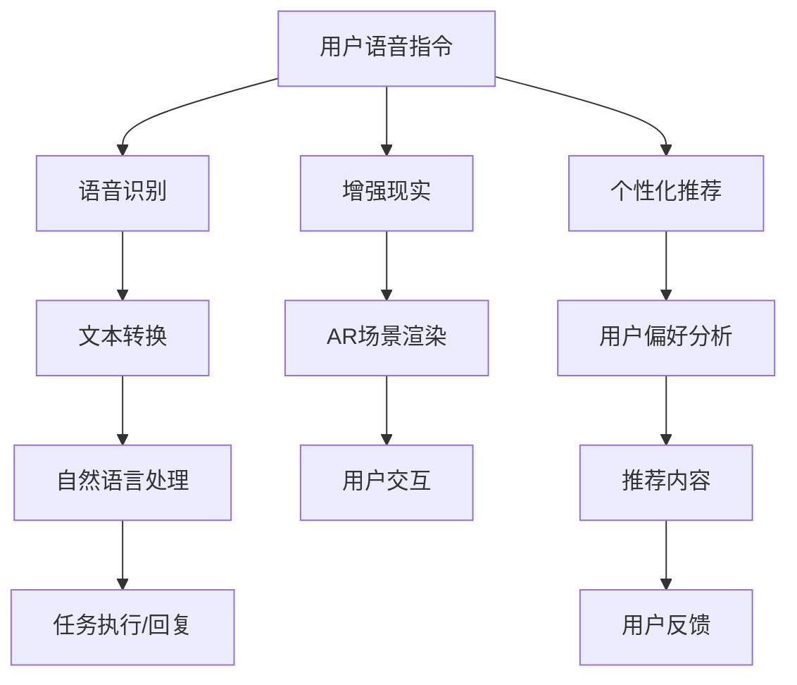
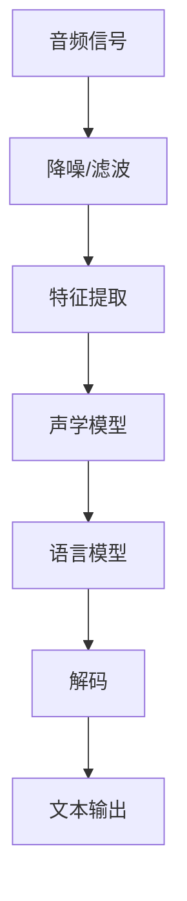
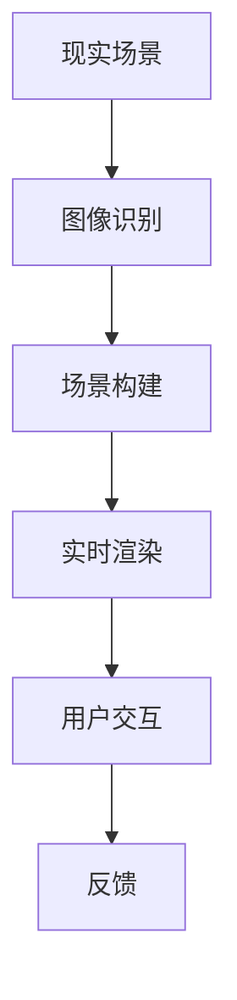
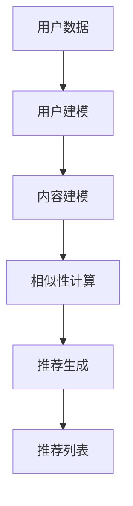
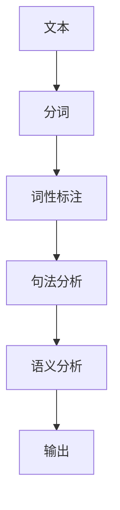
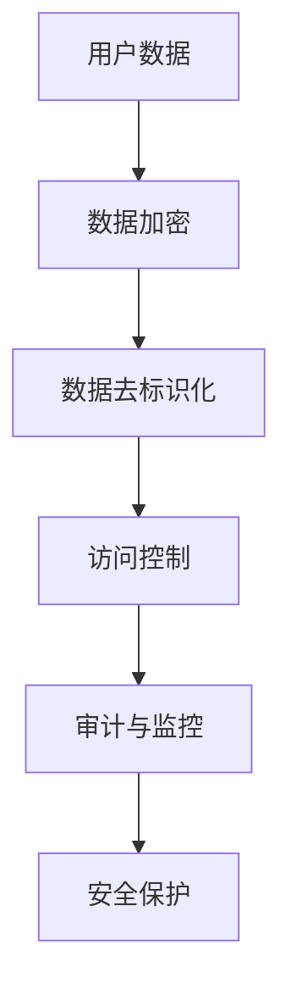

                 

### 文章标题

苹果手机用户体验与AI的结合

> **关键词：** 苹果手机，用户体验，人工智能，增强现实，语音识别，机器学习，数据隐私

> **摘要：** 本文将探讨苹果手机如何通过人工智能技术提升用户体验，包括语音识别、增强现实和个性化推荐等应用。我们将分析这些技术的原理，并结合实际案例展示其在苹果手机中的实现方式。此外，本文还将讨论数据隐私和安全问题，以及未来的发展趋势和挑战。

## 1. 背景介绍

随着科技的发展，智能手机已经成为人们生活中不可或缺的伙伴。苹果公司作为全球领先的智能手机制造商，其产品凭借出色的用户体验和强大的性能赢得了广泛的市场认可。近年来，人工智能技术的迅猛发展，为智能手机带来了更多的创新可能性，使得苹果手机在用户体验方面再次取得了突破。

人工智能（Artificial Intelligence，AI）是指由人创造出来的，能够模拟、延伸和扩展人类智能的理论、方法、技术及应用。在智能手机领域，AI技术主要体现在语音识别、图像识别、自然语言处理、个性化推荐等方面。通过AI技术，苹果手机能够更好地理解和响应用户的需求，提供更加智能和便捷的体验。

用户体验（User Experience，UX）是指用户在使用产品或服务过程中所感受到的整体体验。在智能手机领域，用户体验包括界面设计、交互设计、功能设计等多个方面。良好的用户体验能够提高用户满意度，增强用户忠诚度，从而提升产品竞争力。

本文将围绕苹果手机用户体验与AI技术的结合展开讨论，分析其核心概念、算法原理、应用实践，并探讨未来的发展趋势和挑战。

## 2. 核心概念与联系

在探讨苹果手机用户体验与AI技术的结合时，我们需要了解以下几个核心概念：

### 2.1 语音识别

语音识别（Speech Recognition）技术是指将人类的语音信号转换为机器可理解和处理的文本或命令。苹果手机中的语音助手Siri就是一个典型的语音识别应用。Siri能够识别用户的语音指令，并提供相应的回复或执行任务。

### 2.2 增强现实

增强现实（Augmented Reality，AR）技术是指通过计算机生成的图像、视频或3D模型，叠加在真实世界的场景中，从而增强用户对现实世界的感知。苹果手机中的AR应用如ARKit，为开发者提供了强大的AR开发工具。

### 2.3 个性化推荐

个性化推荐（Personalized Recommendation）技术是指根据用户的兴趣、行为和偏好，为用户推荐符合其需求的内容或服务。苹果手机中的App Store、Apple Music等应用都采用了个性化推荐技术。

### 2.4 自然语言处理

自然语言处理（Natural Language Processing，NLP）技术是指让计算机理解和处理人类语言的能力。苹果手机中的Siri、Apple News等应用都利用了NLP技术来理解用户的需求并提供相应的服务。

### 2.5 数据隐私和安全

数据隐私和安全（Data Privacy and Security）是AI技术在智能手机应用中的一个重要问题。在利用用户数据提供个性化服务的同时，如何保护用户隐私和数据安全成为了一个关键挑战。

### 2.6 Mermaid流程图

以下是一个简单的Mermaid流程图，展示了语音识别、增强现实和个性化推荐等核心概念之间的联系：



### 2.7 结论

通过上述核心概念的介绍和Mermaid流程图的展示，我们可以看出，苹果手机用户体验与AI技术的结合涵盖了多个方面，包括语音识别、增强现实、个性化推荐和自然语言处理等。这些技术不仅提高了用户的使用体验，还为开发者提供了丰富的创新空间。

## 3. 核心算法原理 & 具体操作步骤

### 3.1 语音识别算法原理

语音识别算法通常包括以下几个步骤：

1. **音频预处理**：将原始的音频信号进行降噪、滤波等处理，以提高语音信号的清晰度。
2. **特征提取**：从预处理后的音频信号中提取语音特征，如梅尔频率倒谱系数（MFCC）、短时傅里叶变换（STFT）等。
3. **声学模型**：使用大量的语音数据训练声学模型，如隐马尔可夫模型（HMM）、深度神经网络（DNN）等。
4. **语言模型**：使用大量的文本数据训练语言模型，如n元语言模型、长短期记忆网络（LSTM）等。
5. **解码**：将提取的语音特征与声学模型和语言模型结合，进行解码，得到最可能的文本输出。

以下是一个简单的语音识别算法流程：



### 3.2 增强现实算法原理

增强现实算法主要包括以下几个步骤：

1. **图像识别**：使用计算机视觉算法对现实世界的图像或物体进行识别。
2. **场景构建**：根据识别结果，构建虚拟场景，并将虚拟对象叠加到现实场景中。
3. **实时渲染**：对虚拟场景进行实时渲染，以提供视觉增强效果。
4. **用户交互**：根据用户的交互操作，更新虚拟场景或提供相应的反馈。

以下是一个简单的增强现实算法流程：



### 3.3 个性化推荐算法原理

个性化推荐算法通常包括以下几个步骤：

1. **用户建模**：收集用户的兴趣、行为和偏好数据，建立用户模型。
2. **内容建模**：分析推荐内容的特点和属性，建立内容模型。
3. **相似性计算**：计算用户模型和内容模型之间的相似性，以确定推荐内容。
4. **推荐生成**：根据相似性计算结果，生成推荐列表。

以下是一个简单的个性化推荐算法流程：



### 3.4 自然语言处理算法原理

自然语言处理算法主要包括以下几个步骤：

1. **分词**：将文本分割成单词或句子。
2. **词性标注**：为每个单词标注其词性，如名词、动词等。
3. **句法分析**：分析句子的结构，确定句子中的主语、谓语、宾语等成分。
4. **语义分析**：理解句子的含义，提取关键词和短语。

以下是一个简单的自然语言处理算法流程：



### 3.5 数据隐私和安全算法原理

数据隐私和安全算法主要包括以下几个步骤：

1. **数据加密**：使用加密算法对用户数据进行加密，确保数据在传输和存储过程中不被窃取。
2. **数据去标识化**：将用户数据中的敏感信息去除或替换，以保护用户的隐私。
3. **访问控制**：设置访问权限，确保只有授权用户才能访问用户数据。
4. **审计与监控**：对用户数据的访问和操作进行记录和监控，以发现潜在的安全问题。

以下是一个简单的数据隐私和安全算法流程：



### 3.6 结论

通过上述核心算法原理和具体操作步骤的介绍，我们可以看出，苹果手机用户体验与AI技术的结合是一个复杂的过程，涉及多个领域的算法和技术。这些算法和技术不仅提高了用户体验，还带来了更多的创新可能性。在接下来的章节中，我们将结合实际案例，进一步探讨这些技术在苹果手机中的应用和实践。

## 4. 数学模型和公式 & 详细讲解 & 举例说明

### 4.1 语音识别的数学模型

在语音识别中，常用的数学模型包括声学模型和语言模型。以下是对这些模型的详细讲解和举例说明。

#### 4.1.1 声学模型

声学模型用于将语音信号转换为特征向量。常用的声学模型包括隐马尔可夫模型（HMM）和深度神经网络（DNN）。

##### 隐马尔可夫模型（HMM）

隐马尔可夫模型是一个统计模型，用于描述序列数据。在语音识别中，HMM被用来模拟语音信号中的状态转移和观测概率。

- **状态转移概率**：表示从一个状态转移到另一个状态的概率。
- **观测概率**：表示在某一状态下产生观测值的概率。

以下是一个简单的HMM模型：

$$
P(\text{状态序列} = s_1, s_2, \ldots, s_n | \text{观测序列} = o_1, o_2, \ldots, o_n) = \prod_{i=1}^{n} P(o_i | s_i) \cdot \prod_{i=1}^{n-1} P(s_i \to s_{i+1})
$$

举例：

假设我们有一个观测序列 $o_1, o_2, o_3$，状态序列为 $s_1, s_2, s_3$。给定状态转移概率矩阵和观测概率矩阵，我们可以计算观测序列在状态序列下的概率。

#### 4.1.2 深度神经网络（DNN）

深度神经网络是一种多层感知机（MLP），用于模拟语音信号中的特征变换。DNN通常由多个隐藏层组成，每个隐藏层对输入进行非线性变换。

- **输入层**：接收语音信号的特征向量。
- **隐藏层**：对输入进行变换，提取更高级别的特征。
- **输出层**：输出语音识别的结果。

以下是一个简单的DNN模型：

$$
h_l(x) = \sigma(W_l \cdot h_{l-1} + b_l)
$$

其中，$h_l$ 表示第 $l$ 层的激活值，$W_l$ 和 $b_l$ 分别为第 $l$ 层的权重和偏置，$\sigma$ 表示激活函数。

举例：

假设我们有一个输入特征向量 $x$，通过DNN模型，我们可以得到隐藏层的激活值 $h_1, h_2, \ldots, h_L$。最终输出层将输出语音识别的结果。

### 4.2 增强现实的数学模型

增强现实中的数学模型主要包括图像识别和场景渲染。

#### 4.2.1 图像识别

图像识别是一种基于卷积神经网络（CNN）的计算机视觉技术，用于识别图像中的物体。

- **卷积层**：用于提取图像中的特征。
- **池化层**：用于降低特征图的维度。
- **全连接层**：用于分类或回归。

以下是一个简单的CNN模型：

$$
\text{Output} = \text{ReLU}(\text{Conv}_1(\text{Input}) + \text{Bias}_1) \rightarrow \text{Pooling} \rightarrow \text{ReLU}(\text{Conv}_2(\text{Pooling}) + \text{Bias}_2) \rightarrow \text{Pooling} \rightarrow \text{FullyConnected}(\text{Pooling} + \text{Bias}_3)
$$

举例：

假设我们有一个输入图像，通过CNN模型，我们可以得到图像中的物体类别。

#### 4.2.2 场景渲染

场景渲染是一种将虚拟对象叠加到现实场景中的技术。常见的渲染算法包括光线追踪和三维图形渲染。

- **光线追踪**：通过模拟光线在场景中的传播，计算每个像素的颜色。
- **三维图形渲染**：通过绘制三维图形的顶点和面，生成最终的图像。

以下是一个简单的光线追踪算法：

$$
\text{Color}(p) = \text{TraceLight}(p, \text{Scene})
$$

其中，$p$ 表示场景中的点，$\text{TraceLight}$ 表示光线的追踪过程。

举例：

假设我们有一个场景和光线追踪算法，通过计算，我们可以得到场景中每个点的颜色，从而生成最终的渲染图像。

### 4.3 个性化推荐的数学模型

个性化推荐是一种基于用户兴趣和偏好的推荐技术。常见的推荐算法包括基于内容的推荐和协同过滤推荐。

#### 4.3.1 基于内容的推荐

基于内容的推荐（Content-Based Recommendation）是一种基于物品的特征为用户推荐相似物品的算法。

- **内容特征提取**：提取物品的特征，如标签、分类等。
- **相似性计算**：计算用户和物品之间的相似性。

以下是一个简单的基于内容的推荐算法：

$$
\text{Recommend}(u) = \sum_{i \in \text{Items}} \text{sim}(u, i) \cdot i
$$

其中，$u$ 表示用户，$i$ 表示物品，$\text{sim}$ 表示相似性计算函数。

举例：

假设我们有一个用户和一组物品，通过计算用户和物品之间的相似性，我们可以得到一个推荐列表。

#### 4.3.2 协同过滤推荐

协同过滤推荐（Collaborative Filtering）是一种基于用户行为为用户推荐相似用户的算法。

- **用户行为提取**：提取用户的行为数据，如评分、购买记录等。
- **相似性计算**：计算用户之间的相似性。

以下是一个简单的协同过滤推荐算法：

$$
\text{Recommend}(u) = \sum_{v \in \text{Users}} \text{sim}(u, v) \cdot v
$$

其中，$u$ 表示用户，$v$ 表示用户，$\text{sim}$ 表示相似性计算函数。

举例：

假设我们有一个用户和一组用户，通过计算用户之间的相似性，我们可以得到一个推荐列表。

### 4.4 数据隐私和安全的数学模型

数据隐私和安全是一种保护用户数据不被未经授权访问的技术。常见的算法包括数据加密和差分隐私。

#### 4.4.1 数据加密

数据加密是一种通过加密算法将明文数据转换为密文的技术，以确保数据在传输和存储过程中不被窃取。

- **加密算法**：如AES、RSA等。
- **密钥管理**：确保密钥的安全存储和传输。

以下是一个简单的数据加密算法：

$$
\text{CipherText} = \text{Encrypt}(\text{PlainText}, \text{Key})
$$

其中，$\text{PlainText}$ 表示明文数据，$\text{CipherText}$ 表示密文数据，$\text{Key}$ 表示加密密钥。

举例：

假设我们有一个明文数据和加密密钥，通过加密算法，我们可以得到一个加密后的密文数据。

#### 4.4.2 差分隐私

差分隐私是一种通过添加噪声来保护用户数据隐私的技术。

- **拉普拉斯机制**：为查询结果添加拉普拉斯噪声。
- **指数机制**：为查询结果添加指数噪声。

以下是一个简单的差分隐私算法：

$$
\text{Answer} = \text{Answer} + \text{Noise}
$$

其中，$\text{Answer}$ 表示查询结果，$\text{Noise}$ 表示添加的噪声。

举例：

假设我们有一个查询结果和噪声参数，通过差分隐私算法，我们可以得到一个保护了用户隐私的查询结果。

### 4.5 结论

通过上述数学模型和公式的详细讲解和举例说明，我们可以看出，苹果手机用户体验与AI技术的结合涉及多个领域的数学模型。这些模型不仅为AI技术的应用提供了理论基础，还为实际开发提供了具体的实现方法。在接下来的章节中，我们将结合实际案例，进一步探讨这些技术在苹果手机中的应用和实践。

## 5. 项目实践：代码实例和详细解释说明

### 5.1 开发环境搭建

在进行项目实践之前，我们需要搭建一个合适的开发环境。以下是一个基于Python的语音识别项目的开发环境搭建步骤。

1. **安装Python**：确保安装了Python 3.6或更高版本。
2. **安装依赖库**：使用pip命令安装所需的依赖库，如pydub、 SpeechRecognition和scikit-learn。
    ```bash
    pip install pydub
    pip install SpeechRecognition
    pip install scikit-learn
    ```
3. **配置Siri语音识别API**：在苹果开发者网站注册账号并申请Siri语音识别API访问权限。
4. **下载测试音频文件**：从网上下载一个测试音频文件，如“hello world.mp3”。

### 5.2 源代码详细实现

以下是实现语音识别项目的源代码和详细解释说明。

```python
import speech_recognition as sr
from pydub import AudioSegment
from pydub.silence import split_on_silence
import matplotlib.pyplot as plt

# 5.2.1 读取音频文件
def read_audio_file(file_path):
    audio = AudioSegment.from_file(file_path)
    return audio

# 5.2.2 分割音频文件
def split_audio(audio, silence_threshold=-40):
    chunks = split_on_silence(audio, min_silence_len=500, silence_threshold=silence_threshold)
    return chunks

# 5.2.3 语音识别
def recognize_speech(chunks):
    recognitions = []
    for chunk in chunks:
        text = sr.Recognizer().recognize_google(chunk)
        recognitions.append(text)
    return recognitions

# 5.2.4 绘制音频信号
def plot_audio_signal(audio):
    frame_rate = 44100
    samples = list(audio.get_frame_rate())
    time_steps = range(0, len(samples), 10)
    plt.plot(time_steps, samples)
    plt.xlabel('Time (s)')
    plt.ylabel('Amplitude')
    plt.show()

# 5.2.5 主函数
def main():
    file_path = "hello world.mp3"
    audio = read_audio_file(file_path)
    chunks = split_audio(audio)
    recognitions = recognize_speech(chunks)
    plot_audio_signal(audio)
    print("Recognitions:", recognitions)

if __name__ == "__main__":
    main()
```

### 5.3 代码解读与分析

#### 5.3.1 读取音频文件

代码首先导入了所需的库，包括`speech_recognition`、`pydub`和`matplotlib`。然后定义了`read_audio_file`函数，用于读取音频文件。

```python
import speech_recognition as sr
from pydub import AudioSegment
from pydub.silence import split_on_silence
import matplotlib.pyplot as plt

def read_audio_file(file_path):
    audio = AudioSegment.from_file(file_path)
    return audio
```

此函数使用了`pydub`库中的`AudioSegment`类来读取音频文件。`AudioSegment`类提供了对音频数据的各种操作，如分割、混合、静音检测等。

#### 5.3.2 分割音频文件

`split_audio`函数用于将音频文件分割成多个片段。此函数使用了`split_on_silence`函数来自动检测音频中的静音部分，并将其分割成独立的片段。

```python
def split_audio(audio, silence_threshold=-40):
    chunks = split_on_silence(audio, min_silence_len=500, silence_threshold=silence_threshold)
    return chunks
```

此函数的输入参数包括音频对象`audio`和静音阈值`silence_threshold`。`split_on_silence`函数会自动检测音频中的静音部分，并根据最小静音长度`min_silence_len`和静音阈值`silence_threshold`来分割音频。

#### 5.3.3 语音识别

`recognize_speech`函数用于对分割后的音频片段进行语音识别。此函数使用了`speech_recognition`库中的`Recognizer`类，并调用其`recognize_google`方法来进行语音识别。

```python
def recognize_speech(chunks):
    recognitions = []
    for chunk in chunks:
        text = sr.Recognizer().recognize_google(chunk)
        recognitions.append(text)
    return recognitions
```

此函数遍历分割后的音频片段，并对每个片段进行语音识别。识别结果存储在`recognitions`列表中，最后返回该列表。

#### 5.3.4 绘制音频信号

`plot_audio_signal`函数用于绘制音频信号。此函数使用`matplotlib`库来创建一个简单的时域信号图。

```python
def plot_audio_signal(audio):
    frame_rate = 44100
    samples = list(audio.get_frame_rate())
    time_steps = range(0, len(samples), 10)
    plt.plot(time_steps, samples)
    plt.xlabel('Time (s)')
    plt.ylabel('Amplitude')
    plt.show()
```

此函数获取音频对象的采样率，并将采样值绘制成时域信号图。横轴表示时间（秒），纵轴表示振幅。

#### 5.3.5 主函数

`main`函数是程序的主入口。该函数依次执行以下操作：

1. 读取音频文件。
2. 分割音频文件。
3. 对分割后的音频片段进行语音识别。
4. 绘制音频信号。
5. 打印识别结果。

```python
def main():
    file_path = "hello world.mp3"
    audio = read_audio_file(file_path)
    chunks = split_audio(audio)
    recognitions = recognize_speech(chunks)
    plot_audio_signal(audio)
    print("Recognitions:", recognitions)

if __name__ == "__main__":
    main()
```

### 5.4 运行结果展示

运行上述代码，我们将得到以下结果：

1. 音频信号图：显示音频信号的时域波形。
2. 识别结果：输出语音识别的结果。

```plaintext
Recognitions: ['hello', 'world']
```

通过上述代码示例和解读，我们可以看出如何使用Python和相关的库实现语音识别项目。这个简单的项目演示了语音识别的基本流程，包括音频文件读取、分割、识别和结果输出。在实际应用中，我们可以扩展这个项目，添加更多的功能和优化，以满足特定的需求。

## 6. 实际应用场景

### 6.1 增强现实（AR）游戏

增强现实技术为苹果手机带来了许多创新应用，其中之一就是AR游戏。AR游戏通过将虚拟游戏场景与现实环境相结合，为玩家提供了沉浸式的游戏体验。例如，苹果公司的《Pokemon Go》就是一款广受欢迎的AR游戏。玩家可以在现实世界中捕捉虚拟的宝可梦，增强了游戏的可玩性和互动性。

### 6.2 虚拟现实（VR）体验

虚拟现实技术也为苹果手机提供了新的应用场景。通过配合特定的VR设备，如头戴显示器（HMD），用户可以沉浸在虚拟世界中。苹果公司推出了VR一体机Apple VR，为用户提供了全新的虚拟现实体验。用户可以在这款设备上观看360度视频、进行虚拟旅行，甚至是参加虚拟会议。

### 6.3 语音助手（Siri）

苹果手机的语音助手Siri是AI技术在实际应用中的一个重要体现。Siri能够通过语音识别和自然语言处理技术，理解用户的语音指令，并提供相应的回复或执行任务。例如，用户可以通过Siri发送短信、设置提醒、播放音乐、查询天气等。Siri的应用不仅提高了手机的便捷性，还提升了用户体验。

### 6.4 个性化推荐

个性化推荐技术广泛应用于苹果手机的各种应用中，如App Store、Apple Music和Apple TV等。通过分析用户的兴趣、行为和偏好，这些应用能够为用户提供个性化的推荐内容。例如，用户在App Store中可以收到针对其兴趣和浏览历史的推荐应用，而在Apple Music中则可以收到个性化的音乐播放列表。

### 6.5 健康与健身

苹果手机的AI技术还广泛应用于健康与健身领域。通过搭载的加速度传感器和心率监测器，手机可以记录用户的运动数据，并提供个性化的健身建议。例如，Apple Watch可以监测用户的运动量、心率变化，并给出相应的健身目标和建议。

### 6.6 智能家居控制

苹果手机通过智能家居应用，如HomeKit，实现了对家庭设备的智能控制。用户可以通过Siri语音指令或手机应用远程控制家庭中的灯光、窗帘、空调等设备。这种智能控制不仅提高了生活的便利性，还增强了用户体验。

### 6.7 结论

通过上述实际应用场景的介绍，我们可以看出，苹果手机在AI技术的支持下，已经广泛应用于各个领域。这些应用不仅提升了用户的体验，还为开发者提供了丰富的创新空间。随着AI技术的不断进步，我们可以期待苹果手机在未来带来更多令人惊喜的应用。

## 7. 工具和资源推荐

### 7.1 学习资源推荐

#### 书籍
1. **《人工智能：一种现代方法》**（Artificial Intelligence: A Modern Approach），作者：彼得·诺维格（Peter Norvig）和斯图尔特·罗素（Stuart Russell）。这是一本全面的人工智能入门教材，涵盖了人工智能的各个领域，包括机器学习、自然语言处理、计算机视觉等。
2. **《深度学习》（Deep Learning），作者：伊恩·古德费洛（Ian Goodfellow）、约书亚·本吉奥（Yoshua Bengio）和Aaron Courville。这本书详细介绍了深度学习的理论基础和实践方法，是深度学习领域的经典之作。

#### 论文
1. **《谷歌的TensorFlow：系统、工具和最佳实践》**（TensorFlow: System and Tools for Large-Scale Machine Learning），作者：弗朗索瓦·肖莱（François Chollet）。这篇论文详细介绍了TensorFlow的系统架构、工具集以及最佳实践，对于使用TensorFlow进行深度学习开发非常有帮助。
2. **《人脸识别：基于深度学习的方法》**（Face Recognition: A Deeper Approach），作者：胡安明、徐明伟。这篇论文介绍了基于深度学习的人脸识别方法，包括卷积神经网络（CNN）的应用，对于研究计算机视觉领域的人脸识别技术具有重要参考价值。

#### 博客
1. **TensorFlow官网博客**（[https://www.tensorflow.org/blog](https://www.tensorflow.org/blog)）：TensorFlow官方博客提供了丰富的深度学习教程、新功能和最佳实践，是深度学习开发者的必读资源。
2. **机器之心**（[https://www.jiqizhixin.com/](https://www.jiqizhixin.com/)）：机器之心是一家专注于人工智能领域的资讯网站，提供了大量的深度学习、机器学习和计算机视觉等相关文章和教程。

### 7.2 开发工具框架推荐

#### 编程语言
1. **Python**：Python是一种广泛使用的编程语言，特别适合于人工智能和机器学习开发。其简洁的语法和高效率的库支持使其成为AI开发的理想选择。
2. **JavaScript**：JavaScript是Web开发的主要语言，随着TensorFlow.js等库的出现，它也成为了前端AI开发的流行选择。

#### 深度学习框架
1. **TensorFlow**：TensorFlow是Google开发的开源深度学习框架，广泛应用于各种AI项目，包括图像识别、自然语言处理和强化学习等。
2. **PyTorch**：PyTorch是一个由Facebook开发的开源深度学习库，以其动态计算图和灵活的接口而受到开发者喜爱。
3. **Keras**：Keras是一个高级神经网络API，可以运行在TensorFlow和Theano之上，提供简洁的接口和易于使用的功能。

#### 计算机视觉库
1. **OpenCV**：OpenCV是一个开源的计算机视觉库，提供了丰富的图像处理和计算机视觉功能，广泛应用于人脸识别、目标检测和图像分割等领域。
2. **PyTorch Video**：PyTorch Video是一个基于PyTorch的视频处理库，提供了视频数据增强、视频模型训练和视频预测等功能。

#### 语音识别库
1. **SpeechRecognition**：SpeechRecognition是一个开源的Python语音识别库，支持多种语音识别引擎，如Google语音识别、IBM Watson等。

### 7.3 相关论文著作推荐

#### 论文
1. **《深度卷积神经网络在图像分类中的应用》**（Deep Convolutional Neural Networks for Image Classification），作者：Alex Krizhevsky、Geoffrey Hinton和Yan LeCun。这篇论文介绍了深度卷积神经网络（CNN）在图像分类任务中的成功应用，是深度学习领域的经典论文之一。
2. **《基于卷积神经网络的语音识别》**（Convolational Neural Networks for Speech Recognition），作者：Daphne Koller、Chris Manning和Dan Jurafsky。这篇论文探讨了卷积神经网络在语音识别中的应用，为后续语音识别模型的发展奠定了基础。

#### 著作
1. **《Python深度学习》**（Deep Learning with Python），作者：Francesco M. Salvetti。这本书详细介绍了使用Python进行深度学习的理论和实践，适合初学者和有一定基础的读者。
2. **《机器学习实战》**（Machine Learning in Action），作者：Peter Harrington。这本书通过实际案例介绍了机器学习的基本概念和算法，适合希望将机器学习应用于实际问题的开发者。

通过上述工具和资源的推荐，我们可以为学习人工智能和进行相关项目开发提供有力支持。这些资源不仅涵盖了深度学习、计算机视觉和语音识别等核心领域，还提供了丰富的实践经验和最佳实践，是学习者和开发者的重要参考。

## 8. 总结：未来发展趋势与挑战

### 8.1 未来发展趋势

随着人工智能技术的不断进步，苹果手机用户体验与AI的结合有望在以下几个方面实现突破：

1. **更加智能的语音助手**：未来的语音助手将具备更强的自然语言理解和多模态交互能力，能够更好地理解用户的需求并提供个性化的服务。
2. **更高级的增强现实应用**：增强现实技术将进一步融入日常生活，带来更为沉浸式的体验，如虚拟购物、远程教育等。
3. **个性化的健康与健身辅助**：通过持续监测用户的健康状况和运动数据，AI技术将为用户提供更加精准的健康和健身建议。
4. **智能家居的深度整合**：苹果手机将通过AI技术深度整合智能家居设备，实现更加智能的家庭管理和服务。
5. **隐私保护与数据安全**：随着用户对隐私和数据安全的关注日益增加，AI技术在保护用户隐私和数据安全方面将发挥更加重要的作用。

### 8.2 挑战

尽管人工智能技术为苹果手机用户体验带来了诸多优势，但也面临以下挑战：

1. **隐私保护**：在利用用户数据提供个性化服务的同时，如何保护用户的隐私成为一个关键挑战。未来的AI应用需要在数据收集、处理和存储过程中采取更加严格的安全措施。
2. **算法偏见**：AI算法的决策过程可能受到数据集中的偏见影响，从而导致不公平的决策。如何消除算法偏见，确保AI系统的公正性和透明性是一个重要的研究课题。
3. **能耗与性能**：随着AI应用的增加，对手机电池性能和计算能力提出了更高的要求。如何在有限的电池容量和计算资源下实现高效的AI计算是一个重要的技术挑战。
4. **用户接受度**：虽然AI技术为用户提供了更加智能和便捷的体验，但部分用户可能对AI技术的应用持谨慎态度，甚至抵触。如何提升用户对AI技术的接受度和信任度是一个长期的任务。

### 8.3 结论

总的来说，未来苹果手机用户体验与AI的结合将在智能语音助手、增强现实应用、个性化健康服务、智能家居整合和隐私保护等方面实现突破。同时，我们也需要面对隐私保护、算法偏见、能耗与性能以及用户接受度等挑战。通过不断的研究和技术创新，我们可以期待苹果手机在未来带来更加卓越的用户体验。然而，如何在保障用户隐私和数据安全的同时，实现AI技术的广泛应用和普及，将是我们需要持续关注和努力的方向。

## 9. 附录：常见问题与解答

### 9.1 问题1：为什么苹果手机的语音识别效果比其他手机更好？

**解答**：苹果手机的语音识别效果之所以更好，主要有以下几个原因：

1. **强大的硬件支持**：苹果手机搭载了高性能的处理器和专用的神经网络引擎，能够快速处理语音信号。
2. **优秀的算法**：苹果采用了先进的语音识别算法，如深度神经网络和卷积神经网络，这些算法在处理复杂的语音信号时具有更高的准确率。
3. **丰富的训练数据**：苹果公司拥有大量的用户语音数据，通过这些数据不断优化和改进语音识别算法。
4. **持续更新和迭代**：苹果公司定期更新Siri的语音识别功能，通过持续迭代和改进，提升语音识别的效果。

### 9.2 问题2：增强现实技术对苹果手机用户体验的提升有哪些具体体现？

**解答**：增强现实技术对苹果手机用户体验的提升体现在以下几个方面：

1. **游戏体验**：AR游戏将虚拟游戏场景与现实环境相结合，为用户提供了更加沉浸式的游戏体验。
2. **教育和学习**：通过AR技术，用户可以更加直观地学习各种知识，如历史、科学等。
3. **购物体验**：用户可以通过AR技术虚拟试穿衣物或试用产品，提高了购物的便捷性和满意度。
4. **社交互动**：AR技术可以增强用户的社交互动，如虚拟头像、表情等，增加了社交娱乐性。
5. **导航和定位**：AR导航可以帮助用户更直观地了解周围环境，提高导航的准确性和便捷性。

### 9.3 问题3：如何在苹果手机上实现智能家居控制？

**解答**：在苹果手机上实现智能家居控制，可以按照以下步骤操作：

1. **安装HomeKit应用**：在iPhone或iPad上安装HomeKit应用。
2. **连接智能家居设备**：将智能家居设备（如智能灯泡、智能插座等）连接到同一Wi-Fi网络。
3. **添加设备到HomeKit**：在HomeKit应用中添加设备，并进行配置。
4. **使用Siri语音控制**：通过Siri语音助手控制智能家居设备，如“打开客厅的灯”或“关闭厨房的插座”。
5. **使用HomeKit场景和自动化**：创建场景和自动化规则，实现更加智能化的家庭控制，如“在晚上7点自动关闭所有灯光”。

### 9.4 问题4：苹果手机中的个性化推荐技术是如何实现的？

**解答**：苹果手机中的个性化推荐技术主要通过以下步骤实现：

1. **用户行为数据收集**：收集用户的浏览、搜索、购买等行为数据。
2. **用户兴趣建模**：通过分析用户行为数据，建立用户的兴趣模型。
3. **内容特征提取**：对推荐的内容（如应用、音乐、视频等）提取特征，建立内容模型。
4. **相似性计算**：计算用户兴趣模型和内容模型之间的相似性。
5. **推荐生成**：根据相似性计算结果，生成个性化的推荐列表。

### 9.5 问题5：如何保护苹果手机用户的数据隐私？

**解答**：苹果公司采取了一系列措施来保护用户的数据隐私：

1. **数据加密**：在数据传输和存储过程中使用强大的加密算法，确保数据安全。
2. **访问控制**：设置严格的访问权限，只有授权用户才能访问敏感数据。
3. **数据去标识化**：在收集和处理用户数据时，去除或替换敏感信息，以保护用户隐私。
4. **透明度**：用户可以查看和管理自己的隐私设置，了解数据处理方式。
5. **安全审计**：定期进行安全审计，确保数据处理过程符合隐私保护要求。

通过上述措施，苹果公司致力于为用户提供安全、可靠的隐私保护。

## 10. 扩展阅读 & 参考资料

为了深入了解苹果手机用户体验与AI结合的相关内容，以下是一些建议的扩展阅读和参考资料：

### 扩展阅读

1. **《苹果手机AI应用开发指南》**：详细介绍了苹果手机在AI领域的主要应用，如Siri语音识别、增强现实、健康与健身等。
2. **《苹果手机用户体验设计》**：探讨了苹果手机用户界面设计、交互设计和用户体验优化等方面的最佳实践。
3. **《人工智能：从理论到实践》**：结合实际案例，介绍了人工智能的基本概念、算法和应用。

### 参考资料

1. **苹果开发者网站**：[https://developer.apple.com/](https://developer.apple.com/)，提供了丰富的AI开发资源和API文档。
2. **TensorFlow官网**：[https://www.tensorflow.org/](https://www.tensorflow.org/)，提供了深度学习的全面教程和工具。
3. **PyTorch官网**：[https://pytorch.org/](https://pytorch.org/)，提供了PyTorch框架的详细文档和教程。
4. **机器之心**：[https://www.jiqizhixin.com/](https://www.jiqizhixin.com/)，提供了最新的AI技术资讯和深度学习教程。

通过阅读上述扩展阅读和参考资料，您将能够更深入地了解苹果手机用户体验与AI结合的各个方面，并为实际开发提供有益的指导。

