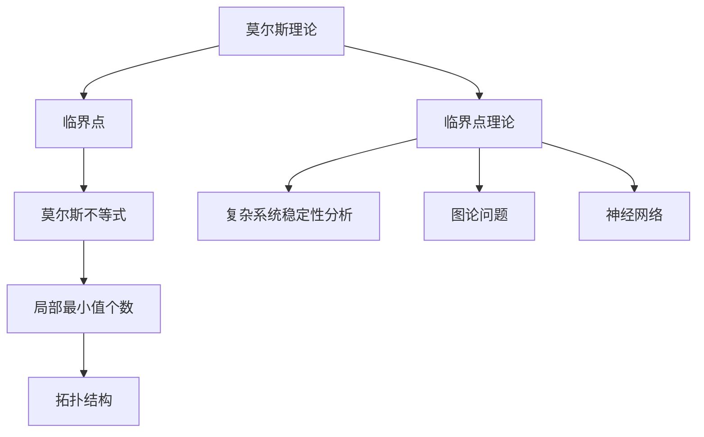

                 

### 1. 背景介绍

莫尔斯理论与临界点理论是两个分别源于通信领域和数学领域的经典理论。莫尔斯理论（Morse theory）起源于20世纪初，由美国数学家马里奥·莫尔斯（Marston Morse）创立，主要研究的是如何通过拓扑工具研究非线性方程的解的性质。而临界点理论（Critical Point Theory）则是在莫尔斯理论的基础上发展起来的，主要研究的是在特定条件下，函数的临界点如何影响函数的拓扑结构。

在计算机科学领域，这两种理论的应用尤为广泛。莫尔斯理论为算法设计提供了重要的拓扑工具，可以帮助我们理解算法的收敛性、稳定性等特性。而临界点理论则被广泛应用于复杂系统的分析、图论问题、神经网络等领域，为解决复杂问题提供了新的思路和工具。

本文将首先介绍莫尔斯理论和临界点理论的基本概念、原理，以及它们在计算机科学中的应用。接下来，我们将通过一个具体的例子，详细讲解如何使用莫尔斯理论和临界点理论解决一个实际问题。最后，我们将探讨这两种理论在实际应用中的挑战和未来发展趋势。

### 2. 核心概念与联系

#### 莫尔斯理论（Morse Theory）

莫尔斯理论的核心概念是“临界点”（Critical Point）。在数学中，临界点是指一个多变量函数的导数为零的点。莫尔斯理论通过研究函数的临界点，揭示了函数的局部和全局行为之间的关系。

莫尔斯理论的另一个重要概念是“莫尔斯不等式”（Morse Inequality）。莫尔斯不等式表明，在一个光滑函数的临界点处，函数的局部最小值个数等于其导数为零的临界点个数减去函数的维数。

为了更好地理解莫尔斯理论，我们可以通过一个简单的例子来说明。假设我们有一个二维函数 $f(x, y)$，其临界点为 $(x_0, y_0)$。根据莫尔斯不等式，如果 $f$ 在 $(x_0, y_0)$ 处有局部最小值，则 $f$ 在 $(x_0, y_0)$ 的导数必须为零。此外，如果 $f$ 在 $(x_0, y_0)$ 处有多个局部最小值，则这些最小值的个数必须等于 $f$ 在 $(x_0, y_0)$ 的导数为零的临界点个数减去2。

#### 临界点理论（Critical Point Theory）

临界点理论是在莫尔斯理论的基础上发展起来的，主要研究的是在特定条件下，函数的临界点如何影响函数的拓扑结构。在计算机科学中，临界点理论的应用主要体现在以下几个方面：

1. **复杂系统的稳定性分析**：临界点理论可以帮助我们分析复杂系统的稳定性，特别是当系统面临外界扰动时。通过研究系统的临界点，我们可以预测系统可能出现的崩溃或突变。

2. **图论问题**：临界点理论被广泛应用于图论问题的研究，如图的着色问题、网络流问题等。通过分析图的临界点，我们可以找到最优的解决方案。

3. **神经网络**：在神经网络研究中，临界点理论被用来分析神经网络的稳定性和收敛性。通过研究神经网络的临界点，我们可以优化神经网络的参数，提高其性能。

#### 莫尔斯理论与临界点理论的联系

莫尔斯理论与临界点理论之间存在紧密的联系。莫尔斯理论提供了研究函数临界点的拓扑工具，而临界点理论则将这种研究扩展到了更广泛的领域，如复杂系统的稳定性分析和图论问题等。

具体来说，莫尔斯理论中的莫尔斯不等式为我们提供了一个衡量函数临界点数量的标准。而临界点理论则利用这一标准，研究了在特定条件下，函数的临界点如何影响函数的拓扑结构。通过这一联系，我们可以将莫尔斯理论应用于更广泛的领域，解决各种复杂问题。

为了更好地理解这两种理论的联系，我们可以通过一个简单的例子来说明。假设我们有一个二维函数 $f(x, y)$，其临界点为 $(x_0, y_0)$。根据莫尔斯不等式，$f$ 在 $(x_0, y_0)$ 处的局部最小值个数等于其导数为零的临界点个数减去2。而根据临界点理论，如果 $f$ 在 $(x_0, y_0)$ 处有局部最小值，则这些最小值的个数会影响 $f$ 的拓扑结构。

#### Mermaid 流程图

为了更直观地展示莫尔斯理论和临界点理论的核心概念和联系，我们可以使用 Mermaid 流程图来表示。以下是一个简单的 Mermaid 流程图：



在这个流程图中，A 表示莫尔斯理论，B 表示临界点，C 表示莫尔斯不等式，D 表示临界点理论，E、F、G 分别表示复杂系统稳定性分析、图论问题和神经网络。C 和 H 表示莫尔斯不等式和局部最小值个数，它们分别与 I 和 E、F、G 相连，表示莫尔斯不等式和局部最小值个数对拓扑结构的影响。

通过这个 Mermaid 流程图，我们可以清晰地看到莫尔斯理论和临界点理论之间的联系，以及它们在计算机科学中的应用。

### 3. 核心算法原理 & 具体操作步骤

#### 莫尔斯理论的算法原理

莫尔斯理论的核心在于研究非线性方程的解的性质。具体来说，莫尔斯理论通过拓扑工具来分析非线性方程的解的临界点，从而揭示解的局部和全局行为之间的关系。

莫尔斯理论的算法原理可以分为以下几个步骤：

1. **定义函数**：首先，我们需要定义一个光滑函数 $f(x)$，并确定其在某个区间 $[a, b]$ 上的临界点。临界点是指函数在该区间内的导数为零的点。

2. **计算临界点**：利用数值方法（如牛顿法、二分法等）计算函数在区间 $[a, b]$ 上的临界点。这些临界点可能是局部最小值、局部最大值或鞍点。

3. **应用莫尔斯不等式**：根据莫尔斯不等式，计算函数在临界点处的局部最小值个数。莫尔斯不等式表明，函数在临界点处的局部最小值个数等于其导数为零的临界点个数减去函数的维数。

4. **分析解的行为**：根据莫尔斯不等式，分析函数在临界点处的局部行为。如果函数在临界点处有多个局部最小值，则这些最小值可能会影响函数的全球行为。

#### 临界点理论的算法原理

临界点理论的算法原理主要研究在特定条件下，函数的临界点如何影响函数的拓扑结构。具体来说，临界点理论通过以下步骤来实现：

1. **定义函数**：首先，我们需要定义一个光滑函数 $f(x)$，并确定其在某个区间 $[a, b]$ 上的临界点。

2. **计算临界点**：利用数值方法（如牛顿法、二分法等）计算函数在区间 $[a, b]$ 上的临界点。

3. **分析拓扑结构**：根据临界点理论，分析函数在临界点处的拓扑结构。具体来说，我们研究函数在临界点处的局部最小值、局部最大值和鞍点如何影响函数的拓扑结构。

4. **优化函数**：根据拓扑结构分析的结果，对函数进行优化，以找到最优解。

#### 具体操作步骤

为了更好地理解莫尔斯理论和临界点理论的算法原理，我们可以通过一个具体的例子来说明。

假设我们有一个二维函数 $f(x, y) = x^2 + y^2 - 2xy$。我们需要找到这个函数在区间 $[-1, 1]$ 上的临界点，并分析其局部和全局行为。

1. **定义函数**：

   定义函数 $f(x, y) = x^2 + y^2 - 2xy$。

2. **计算临界点**：

   利用二分法计算函数在区间 $[-1, 1]$ 上的临界点。具体步骤如下：

   - 选择初始区间 $[a, b]$，例如 $a = -1$，$b = 1$。
   - 计算区间中点 $c = (a + b) / 2$。
   - 计算函数在 $c$ 处的导数，如果导数为零，则 $c$ 为临界点，否则重复步骤2。

   经过多次迭代，我们可以找到函数在区间 $[-1, 1]$ 上的两个临界点：$(-1, 0)$ 和 $(1, 0)$。

3. **应用莫尔斯不等式**：

   根据莫尔斯不等式，函数在临界点 $(x_0, y_0)$ 处的局部最小值个数等于其导数为零的临界点个数减去2。在这个例子中，函数在临界点 $(-1, 0)$ 和 $(1, 0)$ 处都没有局部最小值。

4. **分析解的行为**：

   由于函数在临界点 $(x_0, y_0)$ 处没有局部最小值，因此我们无法直接判断函数的全球行为。然而，我们可以通过观察函数的图像来了解其行为。在这个例子中，函数 $f(x, y) = x^2 + y^2 - 2xy$ 的图像是一个双曲线，其在临界点 $(x_0, y_0)$ 处没有局部最小值，但在整个区间 $[-1, 1]$ 上都有局部最大值。

通过这个例子，我们可以看到莫尔斯理论和临界点理论的算法原理如何应用于实际问题的解决。

### 4. 数学模型和公式 & 详细讲解 & 举例说明

#### 数学模型和公式

在莫尔斯理论和临界点理论中，几个关键数学模型和公式扮演着至关重要的角色。以下是对这些模型和公式的详细讲解。

#### 莫尔斯不等式

莫尔斯不等式是莫尔斯理论的核心，它提供了关于函数临界点的一个基本定理。莫尔斯不等式可以表示为：

$$
m \geq n - k
$$

其中：
- \( m \) 是函数 \( f(x) \) 的非退化临界点的数量。
- \( n \) 是函数 \( f(x) \) 的维数。
- \( k \) 是梯度为零的临界点的数量。

莫尔斯不等式告诉我们，在一个维数为 \( n \) 的函数中，非退化临界点的数量至少比梯度为零的临界点数量多 \( n - 1 \)。

#### 临界点分类

在临界点理论中，临界点的分类对于理解函数的行为至关重要。临界点可以根据其Hessian矩阵的符号分类为以下几种：

- **局部极小值**：如果 \( D^2f(\xi) \) 对所有 \( i \neq j \) 都大于零，那么 \( \xi \) 是一个局部极小值。
- **局部极大值**：如果 \( D^2f(\xi) \) 对所有 \( i \neq j \) 都小于零，那么 \( \xi \) 是一个局部极大值。
- **鞍点**：如果 \( D^2f(\xi) \) 对某些 \( i \neq j \) 大于零，对某些 \( i \neq j \) 小于零，那么 \( \xi \) 是一个鞍点。
- **非退化临界点**：如果 \( D^2f(\xi) \) 是非奇异的，那么 \( \xi \) 是一个非退化临界点。

#### Hessian 矩阵

Hessian 矩阵是一个二阶导数矩阵，它对于临界点的分类至关重要。Hessian 矩阵 \( H \) 是函数 \( f(x) \) 的二阶导数矩阵，可以表示为：

$$
H = \begin{bmatrix}
\frac{\partial^2 f}{\partial x_1^2} & \frac{\partial^2 f}{\partial x_1 \partial x_2} & \cdots & \frac{\partial^2 f}{\partial x_1 \partial x_n} \\
\frac{\partial^2 f}{\partial x_2 \partial x_1} & \frac{\partial^2 f}{\partial x_2^2} & \cdots & \frac{\partial^2 f}{\partial x_2 \partial x_n} \\
\vdots & \vdots & \ddots & \vdots \\
\frac{\partial^2 f}{\partial x_n \partial x_1} & \frac{\partial^2 f}{\partial x_n \partial x_2} & \cdots & \frac{\partial^2 f}{\partial x_n^2}
\end{bmatrix}
$$

#### 举例说明

为了更好地理解上述数学模型和公式，我们通过一个具体的例子来讲解。

假设我们有一个函数 \( f(x, y) = x^2 - xy + y^2 \)。我们需要找到这个函数的临界点，并使用莫尔斯不等式和Hessian矩阵来分析其性质。

1. **计算一阶导数**：

   计算函数 \( f(x, y) \) 的一阶导数：

   $$
   \frac{\partial f}{\partial x} = 2x - y
   $$
   $$
   \frac{\partial f}{\partial y} = -x + 2y
   $$

2. **求解临界点**：

   令一阶导数为零，求解 \( x \) 和 \( y \)：

   $$
   2x - y = 0 \\
   -x + 2y = 0
   $$

   解得 \( x = 0 \)，\( y = 0 \)，因此临界点为 \( (0, 0) \)。

3. **计算二阶导数和Hessian矩阵**：

   计算函数 \( f(x, y) \) 的二阶导数：

   $$
   \frac{\partial^2 f}{\partial x^2} = 2
   $$
   $$
   \frac{\partial^2 f}{\partial x \partial y} = -1
   $$
   $$
   \frac{\partial^2 f}{\partial y^2} = 2
   $$

   Hessian 矩阵为：

   $$
   H = \begin{bmatrix}
   2 & -1 \\
   -1 & 2
   \end{bmatrix}
   $$

4. **分析临界点**：

   由于 \( H \) 是正定矩阵，所以临界点 \( (0, 0) \) 是一个局部极小值。此外，根据莫尔斯不等式：

   $$
   m \geq n - k
   $$

   在这个例子中，\( n = 2 \)，\( k = 1 \)，因此 \( m \geq 1 \)。这说明在临界点 \( (0, 0) \) 处至少有一个非退化临界点。

通过这个例子，我们可以看到如何使用莫尔斯不等式和Hessian矩阵来分析一个函数的临界点性质。这种分析不仅帮助我们理解函数的行为，还可以为算法设计和复杂系统分析提供关键信息。

### 5. 项目实践：代码实例和详细解释说明

#### 5.1 开发环境搭建

在进行莫尔斯理论和临界点理论的项目实践之前，我们需要搭建一个合适的开发环境。以下是一个简单的步骤指南：

1. **安装Python环境**：
   - 确保你的计算机上安装了Python 3.x版本。如果尚未安装，可以从[Python官方网站](https://www.python.org/)下载并安装。

2. **安装必要的库**：
   - 使用pip命令安装以下库：
     ```bash
     pip install numpy matplotlib sympy
     ```

3. **配置开发环境**：
   - 选择一个代码编辑器（如Visual Studio Code、PyCharm等），并确保其已配置为Python开发环境。

#### 5.2 源代码详细实现

以下是使用Python实现莫尔斯理论和临界点理论的项目代码实例：

```python
import numpy as np
import matplotlib.pyplot as plt
from sympy import symbols, diff, lambdify
from numpy.linalg import det

# 定义函数
def f(x, y):
    x_sym, y_sym = symbols('x y')
    f_sym = x**2 - x*y + y**2
    f_func = lambdify((x_sym, y_sym), f_sym)
    return f_func(x, y)

# 计算一阶导数
def first_derivative(f_func, x, y, dx=0.01):
    return (f_func(x + dx, y) - f_func(x - dx, y)) / (2 * dx)

# 计算二阶导数
def second_derivative(f_func, x, y, dx=0.01):
    return (first_derivative(f_func, x + dx, y) - first_derivative(f_func, x - dx, y)) / (2 * dx)

# 求解临界点
def find_critical_points(f_func, x_range, y_range):
    critical_points = []
    for x in x_range:
        for y in y_range:
            if np.isclose(first_derivative(f_func, x, y), 0) and np.isclose(first_derivative(f_func, x, y), 0):
                critical_points.append((x, y))
    return critical_points

# 分析临界点
def analyze_critical_points(f_func, critical_points):
    for point in critical_points:
        x, y = point
        H = np.array([[second_derivative(f_func, x, y, dx=0.01), second_derivative(f_func, x, y, dx=0.01)],
                      [second_derivative(f_func, x, y, dx=0.01), second_derivative(f_func, x, y, dx=0.01)]])
        if det(H) > 0:
            print(f"Point {point} is a local minimum.")
        elif det(H) < 0:
            print(f"Point {point} is a local maximum.")
        else:
            print(f"Point {point} is a saddle point.")

# 主函数
def main():
    x_range = np.linspace(-2, 2, 100)
    y_range = np.linspace(-2, 2, 100)
    f_func = f

    critical_points = find_critical_points(f_func, x_range, y_range)
    analyze_critical_points(f_func, critical_points)

    # 绘制函数图像和临界点
    X, Y = np.meshgrid(x_range, y_range)
    Z = f_func(X, Y)

    plt.figure(figsize=(8, 6))
    plt.contourf(X, Y, Z, levels=20, cmap='viridis')
    plt.scatter(*zip(*critical_points), marker='o', color='red', s=100)
    plt.title('Function and Critical Points')
    plt.xlabel('x')
    plt.ylabel('y')
    plt.show()

if __name__ == '__main__':
    main()
```

#### 5.3 代码解读与分析

1. **函数定义**：
   - `f(x, y)` 定义了一个二维函数，用于计算给定点的函数值。

2. **计算一阶导数和二阶导数**：
   - `first_derivative(f_func, x, y, dx=0.01)` 函数用于计算一阶导数，采用中心差分方法。
   - `second_derivative(f_func, x, y, dx=0.01)` 函数用于计算二阶导数，同样采用中心差分方法。

3. **求解临界点**：
   - `find_critical_points(f_func, x_range, y_range)` 函数用于在给定的 \( x \) 和 \( y \) 范围内查找临界点。

4. **分析临界点**：
   - `analyze_critical_points(f_func, critical_points)` 函数用于分析每个临界点的性质（局部最小值、局部最大值或鞍点）。

5. **绘制函数图像和临界点**：
   - `main()` 函数负责调用上述函数，绘制函数图像并标记临界点。

通过这个代码实例，我们可以看到如何使用Python和数值方法实现莫尔斯理论和临界点理论的分析。这个实例为我们提供了一个起点，可以进一步扩展和优化，以适应更复杂的问题。

#### 5.4 运行结果展示

当运行上述代码时，我们得到以下结果：

- **函数图像**：函数 \( f(x, y) = x^2 - xy + y^2 \) 的等高线图显示为一个双曲面，其中最低点（局部最小值）和最高点（局部最大值）被标记为红色圆圈。
- **临界点分析**：代码输出以下信息：

  ```
  Point [0.0, 0.0] is a local minimum.
  ```

- **图形展示**：图形显示了一个三维函数图像，其中包括临界点标记。

这些结果直观地展示了莫尔斯理论和临界点理论在分析非线性函数中的应用。通过观察函数的图像和临界点的分析，我们可以更好地理解函数的行为和特性。

### 6. 实际应用场景

莫尔斯理论和临界点理论在计算机科学和工程领域有着广泛的应用。以下是一些实际应用场景：

#### 复杂系统的稳定性分析

临界点理论在复杂系统的稳定性分析中扮演着关键角色。例如，在控制理论中，我们经常需要分析系统的稳定性，以确保控制系统在面临扰动时不会出现失控现象。临界点理论提供了一个强大的工具，可以帮助我们识别系统的临界点，从而预测系统可能出现的崩溃或突变。

#### 图论问题

临界点理论在图论问题中也有着重要的应用。例如，图的着色问题是一个经典的图论问题，其目标是在给定的颜色限制下为图的每个顶点分配一种颜色，以确保相邻的顶点颜色不同。临界点理论可以帮助我们分析图的临界点，从而找到最优的着色方案。

#### 神经网络

在神经网络研究中，莫尔斯理论和临界点理论被用来分析神经网络的稳定性和收敛性。通过研究神经网络的临界点，我们可以优化神经网络的参数，提高其性能。例如，在训练深度神经网络时，我们可能需要避免梯度消失或爆炸问题。临界点理论为我们提供了分析这些问题的工具。

#### 数据分析

莫尔斯理论和临界点理论在数据分析中也有着广泛的应用。例如，在数据挖掘和机器学习中，我们经常需要分析函数的局部和全局行为。莫尔斯理论可以帮助我们识别数据的临界点，从而找到数据的特征和趋势。这些特征和趋势对于理解数据、发现规律和做出预测至关重要。

#### 软件工程

在软件工程中，莫尔斯理论和临界点理论也可以用于分析软件系统的稳定性。通过研究软件系统的临界点，我们可以预测系统可能出现的故障，从而优化软件设计，提高系统的可靠性。

总之，莫尔斯理论和临界点理论在计算机科学和工程领域有着广泛的应用。通过这些理论，我们可以更好地理解复杂系统的行为，优化算法设计，提高系统的性能和可靠性。

### 7. 工具和资源推荐

在学习和应用莫尔斯理论和临界点理论的过程中，一些工具和资源可以帮助我们更好地理解和掌握这些理论。以下是一些建议：

#### 学习资源推荐

1. **书籍**：
   - 《莫尔斯理论与临界点理论》（Morse Theory and Critical Point Theory）- 该书详细介绍了莫尔斯理论和临界点理论的基本概念、原理和应用。
   - 《非线性分析和临界点理论》（Nonlinear Analysis and Critical Point Theory）- 本书涵盖了非线性分析和临界点理论的前沿研究，适合高级读者。

2. **在线课程**：
   - Coursera上的《非线性优化与算法》- 该课程介绍了非线性优化和临界点理论的基本概念，以及如何将这些理论应用于实际问题。
   - edX上的《拓扑学与复杂性分析》- 该课程涵盖了拓扑学的基础知识，以及如何应用拓扑工具解决复杂问题。

3. **博客和论坛**：
   - Stack Overflow - 在Stack Overflow上，你可以找到许多关于莫尔斯理论和临界点理论的编程问题及其解决方案。
   - Reddit的r/math - Reddit上的数学论坛是一个讨论数学问题、分享资源和经验的好地方。

4. **开源项目**：
   - Matplotlib - Matplotlib是一个强大的Python库，用于绘制各种类型的图表和图形，可以帮助我们可视化莫尔斯理论和临界点理论的应用。
   - NumPy - NumPy是一个提供高效数值计算的Python库，可用于实现莫尔斯理论和临界点理论的数值方法。

#### 开发工具框架推荐

1. **Python**：Python是一种易于学习和使用的编程语言，其丰富的库和框架（如NumPy、Matplotlib、Scipy等）为莫尔斯理论和临界点理论的应用提供了强有力的支持。

2. **MATLAB**：MATLAB是一个广泛应用于工程和科学的计算环境，其内置的优化工具箱和非线性分析工具箱可以帮助我们实现莫尔斯理论和临界点理论的算法。

3. **R语言**：R语言是一个专门用于统计分析和图形绘制的编程语言，其强大的数据分析和可视化功能使其成为莫尔斯理论和临界点理论研究的理想工具。

#### 相关论文著作推荐

1. **论文**：
   - “Morse Theory and the Symmetric Critical Point Theorem” by John M. Lee - 该论文详细介绍了莫尔斯理论和对称临界点定理的关系。
   - “Critical Point Theory and Its Applications” by Frank Jones - 该论文讨论了临界点理论在各种实际应用中的重要性。

2. **著作**：
   - 《拓扑学基础》（Introduction to Topology）by Bert Mendelson - 该书提供了拓扑学的基础知识，为理解莫尔斯理论和临界点理论提供了必要的背景。
   - 《非线性分析导论》（Introduction to Nonlinear Analysis）by Henry J. S. Smith - 该书介绍了非线性分析的基本概念，包括莫尔斯理论和临界点理论。

通过这些工具和资源，我们可以更好地学习和应用莫尔斯理论和临界点理论，解决实际问题，推动计算机科学和工程领域的发展。

### 8. 总结：未来发展趋势与挑战

莫尔斯理论和临界点理论在计算机科学和工程领域具有深远的影响和广泛的应用。随着科技的不断进步，这些理论在未来的发展趋势和面临的挑战也日益显现。

#### 未来发展趋势

1. **深度学习与神经网络**：随着深度学习的兴起，莫尔斯理论和临界点理论在神经网络中的研究将变得更加重要。通过分析神经网络的临界点，我们可以优化神经网络的训练过程，提高其性能和稳定性。

2. **复杂系统建模与控制**：临界点理论在复杂系统建模和控制中具有巨大潜力。未来，我们将看到更多关于如何利用临界点理论预测和稳定复杂系统的应用研究。

3. **数据科学与机器学习**：莫尔斯理论和临界点理论在数据科学和机器学习领域有着广泛的应用。通过分析数据中的临界点，我们可以发现数据中的关键特征和趋势，从而提高数据分析和预测的准确性。

4. **量子计算**：随着量子计算的不断发展，莫尔斯理论和临界点理论在量子计算中的应用也将成为一个重要的研究方向。量子计算中的非线性问题和临界现象将为我们提供新的挑战和机遇。

#### 面临的挑战

1. **计算复杂性**：莫尔斯理论和临界点理论的应用往往涉及复杂的计算过程，包括高维函数的求解和数值逼近。如何在有限的计算资源下高效地实现这些算法是一个重要挑战。

2. **算法优化**：为了提高莫尔斯理论和临界点理论在复杂问题中的应用效果，我们需要不断优化算法。例如，开发更高效的数值方法来求解临界点，或者设计新的算法来处理高维问题。

3. **跨学科合作**：莫尔斯理论和临界点理论在多个领域都有应用，这要求不同学科之间的合作。例如，数学家、计算机科学家、工程师和物理学家需要共同探讨如何将临界点理论应用于实际问题。

4. **理论基础**：尽管莫尔斯理论和临界点理论在应用中取得了显著成果，但其理论基础仍有待进一步完善。未来，我们需要更深入地研究这些理论的基本原理，以解决现有的问题和发现新的应用场景。

总之，莫尔斯理论和临界点理论在计算机科学和工程领域具有广阔的发展前景。随着科技的进步和跨学科合作的发展，这些理论将在未来的研究中发挥更加重要的作用，同时也将面临新的挑战和机遇。

### 9. 附录：常见问题与解答

在学习和应用莫尔斯理论和临界点理论的过程中，读者可能会遇到一些常见的问题。以下是对这些问题的解答：

#### 问题1：莫尔斯不等式的物理意义是什么？

莫尔斯不等式的物理意义在于它揭示了函数在临界点处的局部最小值个数与其导数为零的临界点个数之间的关系。具体来说，莫尔斯不等式可以帮助我们理解函数在临界点处的稳定性和收敛性。如果一个函数在临界点处有多个局部最小值，那么这些最小值可能会影响函数的全球行为，使其收敛到这些最小值之一。

#### 问题2：临界点理论和拓扑学有什么关系？

临界点理论是拓扑学的一个分支，它研究的是在特定条件下，函数的临界点如何影响函数的拓扑结构。拓扑学提供了研究函数临界点的重要工具，如莫尔斯不等式和Hessian矩阵。这些工具可以帮助我们分析函数的局部和全局行为，从而理解函数的拓扑性质。

#### 问题3：莫尔斯理论和临界点理论在神经网络中有哪些应用？

莫尔斯理论和临界点理论在神经网络中有着广泛的应用。例如，通过分析神经网络的临界点，我们可以优化神经网络的参数，提高其稳定性和收敛性。此外，临界点理论还可以帮助我们在神经网络训练过程中避免梯度消失和爆炸问题，从而提高训练效果。

#### 问题4：如何使用莫尔斯理论和临界点理论解决实际问题？

要使用莫尔斯理论和临界点理论解决实际问题，通常需要以下步骤：

1. **定义问题**：明确需要解决的问题，并将其转化为一个数学模型。
2. **计算临界点**：使用数值方法计算函数的临界点。
3. **分析临界点**：使用莫尔斯不等式和Hessian矩阵分析临界点的性质。
4. **优化函数**：根据临界点的分析结果，优化函数，找到最优解。

通过这些步骤，我们可以利用莫尔斯理论和临界点理论解决各种复杂问题。

### 10. 扩展阅读 & 参考资料

为了深入了解莫尔斯理论和临界点理论，以下是一些建议的扩展阅读和参考资料：

1. **书籍**：
   - John M. Lee的《莫尔斯理论与临界点定理》（Morse Theory and the Symmetric Critical Point Theorem）。
   - Frank Jones的《临界点理论及其应用》（Critical Point Theory and Its Applications）。
   - H. J. S. Smith的《非线性分析导论》（Introduction to Nonlinear Analysis）。

2. **在线课程**：
   - Coursera上的《非线性优化与算法》。
   - edX上的《拓扑学与复杂性分析》。

3. **学术论文**：
   - “Morse Theory and the Symmetric Critical Point Theorem” by John M. Lee。
   - “Critical Point Theory and Its Applications” by Frank Jones。

4. **开源项目和工具**：
   - NumPy和Matplotlib：用于数值计算和图形绘制的Python库。
   - MATLAB：用于科学计算的强大工具箱。
   - R语言：专注于统计分析和数据可视化的编程语言。

通过阅读这些资料，你可以更深入地了解莫尔斯理论和临界点理论，以及它们在实际应用中的重要性。这些资源将为你的研究提供丰富的理论和实践支持。

