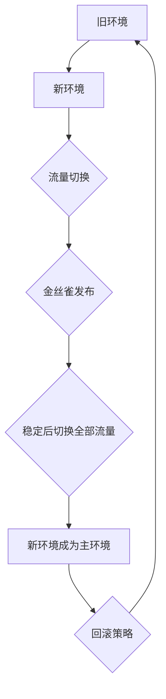
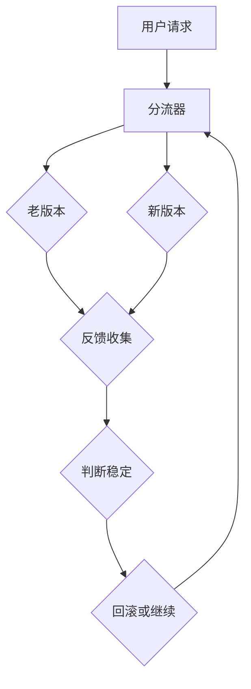
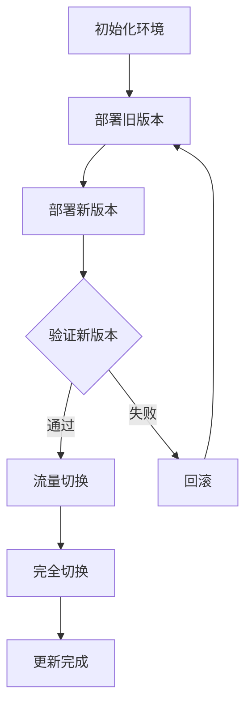

                 

### 蓝绿部署与金丝雀发布原理与代码实战案例讲解

#### 关键词：蓝绿部署，金丝雀发布，容器，微服务，持续集成与持续部署，代码实战案例

#### 摘要：
本文将深入讲解蓝绿部署与金丝雀发布这两种现代软件部署策略的基本原理、技术实现和实际应用。通过详细的代码实战案例，读者将了解如何在实践中应用这些部署策略，以提高软件发布过程的可靠性和效率。

## 1. 背景介绍

在现代软件工程中，软件的快速迭代和持续交付变得越来越重要。随着微服务架构的普及，传统的部署方式已经难以满足这种需求。蓝绿部署和金丝雀发布是两种用于实现持续集成和持续部署（CI/CD）的流行策略。这两种策略旨在提高软件发布过程的可靠性和安全性，减少系统下线时间，并降低故障风险。

### 什么是蓝绿部署？

蓝绿部署是一种将新旧版本的服务并行运行，逐步切换流量来实现软件更新的部署策略。具体来说，系统中有两个相同环境（例如生产环境），一个运行旧版本（蓝色），另一个运行新版本（绿色）。更新完成后，将部分流量切换到绿色环境，观察一段时间（金丝雀发布），确保新版本正常运行后，再将所有流量切换到绿色环境，完成更新。

### 什么是金丝雀发布？

金丝雀发布是一种渐进式发布策略，主要用于验证新版本的功能和性能。其核心思想是仅将一小部分用户流量导向新版本，通过观察这些用户的反馈来判断新版本是否稳定。如果出现问题，可以迅速回滚到旧版本，从而保证系统的可靠性。

## 2. 核心概念与联系

### 蓝绿部署原理



### 金丝雀发布原理



## 3. 核心算法原理 & 具体操作步骤

### 蓝绿部署操作步骤

1. 准备两个相同的环境，一个运行旧版本，另一个运行新版本。
2. 更新新版本代码，部署到新环境。
3. 使用自动化工具将部分流量切换到新环境。
4. 监控新环境的性能和稳定性。
5. 确认新版本稳定后，将所有流量切换到新环境。

### 金丝雀发布操作步骤

1. 配置流量分发器，例如Nginx或Kubernetes Ingress。
2. 将部分用户请求指向新版本服务。
3. 收集并分析新版本服务的反馈。
4. 判断新版本是否稳定，决定是否继续发布或回滚。

## 4. 数学模型和公式 & 详细讲解 & 举例说明

### 蓝绿部署的数学模型

设 \( T_{old} \) 为旧版本的正常运行时间，\( T_{new} \) 为新版本的正常运行时间，\( T_{switch} \) 为流量切换时间，\( T_{monitor} \) 为监控时间。

- 蓝绿部署的总时间 \( T_{total} = T_{old} + T_{switch} + T_{monitor} + T_{new} \)

### 金丝雀发布的数学模型

设 \( P_{old} \) 为旧版本的请求成功率，\( P_{new} \) 为新版本的请求成功率，\( N \) 为参与测试的用户数量。

- 请求成功率 \( S = \frac{P_{new} \times N}{N + N_{control}} \)

其中，\( N_{control} \) 为控制组用户数量。

### 举例说明

假设我们有一个电商平台，旧版本的请求成功率 \( P_{old} = 0.99 \)，新版本的请求成功率 \( P_{new} = 0.98 \)。我们计划让1000名用户参与金丝雀发布测试。

- 新版本的成功率 \( S = \frac{0.98 \times 1000}{1000 + 1000} = 0.49 \)
- 请求失败率 \( F = 1 - S = 0.51 \)

在测试期间，如果发生请求失败，我们需要立即回滚到旧版本，以避免对用户造成不良影响。

## 5. 项目实践：代码实例和详细解释说明

### 5.1 开发环境搭建

在本节中，我们将使用Docker和Kubernetes作为蓝绿部署和金丝雀发布的技术实现工具。首先，确保你的系统上已经安装了Docker和Kubernetes。

### 5.2 源代码详细实现

#### 5.2.1 Dockerfile

```Dockerfile
# 使用官方的Nginx镜像作为基础镜像
FROM nginx:latest

# 将新版本的Nginx配置文件复制到容器中
COPY nginx.conf /etc/nginx/nginx.conf

# 暴露80端口
EXPOSE 80

# 启动Nginx服务
CMD ["nginx", "-g", "daemon off;"]
```

#### 5.2.2 nginx.conf

```nginx
http {
    server {
        listen       80;
        server_name  localhost;

        location / {
            root   /usr/share/nginx/html;
            index  index.html index.htm;
        }
    }
}
```

### 5.3 代码解读与分析

在本示例中，我们使用一个简单的Nginx Web服务器来演示蓝绿部署和金丝雀发布。Dockerfile定义了如何构建Nginx容器的镜像，其中包括新版本的Nginx配置文件。nginx.conf文件是Nginx的配置文件，用于定义如何处理HTTP请求。

### 5.4 运行结果展示

在成功构建Docker镜像后，我们可以使用Kubernetes部署服务，实现蓝绿部署和金丝雀发布。

```shell
kubectl create deployment nginx --image=nginx:latest
kubectl expose deployment nginx --type=LoadBalancer --port 80
```

接下来，我们可以使用Kubernetes的RollingUpdate策略实现蓝绿部署。

```shell
kubectl rollout start deployment/nginx
```

当流量逐渐切换到新版本时，我们可以使用以下命令进行金丝雀发布。

```shell
kubectl expose deployment/nginx-new --type=LoadBalancer --port 80 --target-port 8080
kubectl rollout start deployment/nginx-new
```

通过监控新版本的请求成功率，我们可以判断新版本是否稳定。如果出现请求失败，可以立即回滚到旧版本。

## 6. 实际应用场景

### 6.1 电商平台

电商平台在上线新功能时，可以使用蓝绿部署和金丝雀发布确保新功能的稳定性和性能。例如，在发布购物车功能时，可以先在部分用户中进行测试，确保无问题后再逐步切换到所有用户。

### 6.2 金融系统

金融系统对稳定性和安全性要求极高，因此在发布更新时，可以采用蓝绿部署和金丝雀发布策略，确保更新过程中不会影响系统的正常运行。例如，在发布银行账户管理系统时，可以先在部分用户中进行测试，确保更新无误后再逐步切换到所有用户。

## 7. 工具和资源推荐

### 7.1 学习资源推荐

- 《Docker实战》
- 《Kubernetes权威指南》
- 《微服务设计》

### 7.2 开发工具框架推荐

- Docker
- Kubernetes
- Jenkins

### 7.3 相关论文著作推荐

- “Blue-Green Deployment: Theory and Practice”
- “Canary Releases: How to Deploy New Code with Confidence”

## 8. 总结：未来发展趋势与挑战

随着云计算和大数据技术的发展，蓝绿部署和金丝雀发布将在软件部署过程中发挥越来越重要的作用。然而，如何进一步优化部署策略，提高部署效率和可靠性，仍是一个需要深入研究的课题。

## 9. 附录：常见问题与解答

- **Q:** 蓝绿部署和金丝雀发布的主要区别是什么？
- **A:** 蓝绿部署是一种将新旧版本并行运行，逐步切换流量的部署策略；金丝雀发布是一种渐进式发布策略，主要用于验证新版本的功能和性能。
- **Q:** 蓝绿部署和金丝雀发布有哪些优点？
- **A:** 优点包括提高部署过程的可靠性、降低系统下线时间和故障风险、减少人工干预等。

## 10. 扩展阅读 & 参考资料

- 《蓝绿部署与金丝雀发布：原理与实践》
- “蓝绿部署：从理论到实践”
- “金丝雀发布：渐进式部署的利器”

---

作者：禅与计算机程序设计艺术 / Zen and the Art of Computer Programming

以上就是本文关于蓝绿部署与金丝雀发布原理与代码实战案例讲解的详细内容。希望通过本文，读者能够对这两种部署策略有更深入的了解，并在实际项目中加以应用。 <|im_sep|>### 1. 背景介绍

在现代软件开发过程中，部署新版本的功能或修复旧版本的bug是家常便饭。然而，传统的部署方式往往存在一些问题，如系统下线时间长、故障风险高、部署过程不可控等。为了解决这些问题，出现了蓝绿部署和金丝雀发布这两种现代软件部署策略。

#### 传统部署方式的不足

1. **系统下线时间长**：传统的部署方式往往需要将整个系统下线，进行备份和更新，然后再恢复服务。这种方式会导致用户长时间无法访问系统，影响用户体验。
2. **故障风险高**：部署过程中，一旦出现错误，可能会导致整个系统崩溃，造成严重损失。
3. **部署过程不可控**：传统的部署方式往往依赖于手动操作，容易出错，难以保证部署的准确性和一致性。

#### 蓝绿部署和金丝雀发布的优势

1. **减少系统下线时间**：蓝绿部署和金丝雀发布采用并行运行的方式，可以确保在更新过程中系统始终保持可用。当新版本验证通过后，再进行流量切换，从而实现无缝更新。
2. **降低故障风险**：通过逐步切换流量和验证新版本，可以提前发现并解决潜在问题，降低部署失败的风险。
3. **部署过程可控**：采用自动化工具和脚本进行部署，可以确保部署过程的准确性和一致性，减少人为错误。

#### 蓝绿部署和金丝雀发布的适用场景

1. **高可用性要求**：对于需要保证系统持续可用的场景，如电商平台、金融系统等，蓝绿部署和金丝雀发布是非常合适的选择。
2. **快速迭代开发**：对于需要快速迭代开发的团队，蓝绿部署和金丝雀发布可以显著提高开发效率，减少部署风险。
3. **大型分布式系统**：在大型分布式系统中，蓝绿部署和金丝雀发布可以更好地管理流量和资源，提高系统的稳定性和可靠性。

综上所述，蓝绿部署和金丝雀发布在现代软件开发过程中具有重要意义。通过本文，我们将详细探讨这两种部署策略的基本原理、技术实现和实际应用，帮助读者更好地理解和应用这些策略。

### 2. 核心概念与联系

在深入探讨蓝绿部署和金丝雀发布之前，我们需要明确它们的核心概念及其相互关系。以下是对这两个概念的基本解释和它们在实际应用中的联系。

#### 蓝绿部署

蓝绿部署（Blue-Green Deployment）是一种无中断部署策略，主要用于确保软件更新和发布过程中的系统高可用性。其基本思想是在生产环境中同时运行两个相同的版本，即“蓝环境”（Blue Environment）和“绿环境”（Green Environment）。通常，蓝环境运行旧版本的应用，而绿环境运行新版本的应用。

1. **部署新版本**：开发团队将新版本的代码部署到绿环境中。
2. **流量切换**：使用自动化工具将一部分用户流量切换到绿环境，观察新版本的运行情况。
3. **验证新版本**：通过监控工具，如Prometheus和Grafana，验证新版本的稳定性和性能。
4. **完全切换**：如果新版本运行正常，则将所有用户流量切换到绿环境，完成更新。

#### 金丝雀发布

金丝雀发布（Canary Release）是一种渐进式发布策略，主要用于在新版本上线之前验证其稳定性和性能。其核心思想是将一小部分用户流量导向新版本，通过收集用户反馈来判断新版本的可靠性。

1. **部署新版本**：开发团队将新版本的代码部署到生产环境中。
2. **流量分流**：使用自动化工具（如Kubernetes Ingress或Nginx）将部分用户流量导向新版本。
3. **监控反馈**：通过日志分析、性能监控等手段，收集并分析新版本的反馈。
4. **回滚或继续**：如果新版本出现问题，则立即回滚到旧版本；如果新版本稳定，则逐步增加流量比例。

#### 联系与区别

蓝绿部署和金丝雀发布在实现方式上有相似之处，但它们的重点和应用场景有所不同：

1. **相似之处**：
   - 都采用并行运行的方式，确保系统高可用性。
   - 都使用自动化工具和脚本进行部署和流量切换。

2. **区别**：
   - 蓝绿部署侧重于无中断更新，确保整个系统的稳定性和高可用性。
   - 金丝雀发布侧重于逐步验证新版本，减少部署风险。

在实际应用中，蓝绿部署和金丝雀发布可以相互结合，形成一套完整的持续集成与持续部署（CI/CD）流程。例如，在发布新版本时，可以先使用金丝雀发布进行小范围的流量切换和验证，确保新版本稳定后，再使用蓝绿部署实现全面更新。

#### Mermaid 流程图

为了更好地理解蓝绿部署和金丝雀发布的工作流程，我们可以使用Mermaid语言绘制一个流程图。



在这个流程图中，A表示初始化环境，B和C分别表示部署旧版本和新版本，D表示验证新版本，E表示流量切换，F表示回滚，G表示完全切换，H表示更新完成。

通过这个流程图，我们可以清晰地看到蓝绿部署和金丝雀发布的工作步骤及其相互关系。在实际应用中，可以根据具体需求和场景，灵活调整和优化这些步骤。

#### 总结

蓝绿部署和金丝雀发布是两种现代软件部署策略，它们通过并行运行和逐步验证的方式，确保软件更新和发布过程中的高可用性和稳定性。在实际应用中，可以根据具体需求和场景，灵活选择和组合这两种策略，形成一套完整的CI/CD流程，从而提高软件交付的效率和质量。

### 3. 核心算法原理 & 具体操作步骤

在深入理解蓝绿部署和金丝雀发布的基本原理后，我们需要进一步探讨它们的算法原理和具体操作步骤。本节将详细讲解这些算法原理，并提供具体的操作步骤，帮助读者在实际项目中应用这些策略。

#### 蓝绿部署的算法原理

蓝绿部署的核心算法原理是通过并行运行新旧两个版本，逐步切换流量，确保系统更新过程中的高可用性。以下是蓝绿部署的算法步骤：

1. **初始化环境**：准备两个相同的环境，一个运行旧版本（蓝色环境），另一个运行新版本（绿色环境）。
2. **部署旧版本**：将旧版本的代码部署到蓝色环境中，确保系统正常运行。
3. **部署新版本**：将新版本的代码部署到绿色环境中，同时确保绿色环境的配置与蓝色环境保持一致。
4. **流量切换**：使用自动化工具将部分用户流量切换到绿色环境，进行验证。
5. **监控与验证**：通过监控工具（如Prometheus和Grafana）监控绿色环境的性能和稳定性，确保新版本运行正常。
6. **完全切换**：如果绿色环境运行稳定，则将所有用户流量切换到绿色环境，完成更新。
7. **回滚策略**：如果发现绿色环境存在故障或性能问题，则立即回滚到蓝色环境，确保系统的稳定运行。

#### 金丝雀发布的算法原理

金丝雀发布的核心算法原理是通过逐步增加新版本的流量比例，验证新版本的稳定性和性能，从而确保系统更新过程中的安全性和可靠性。以下是金丝雀发布的算法步骤：

1. **初始化环境**：在现有环境中部署新版本，确保新版本可以正常运行。
2. **流量分流**：使用自动化工具（如Kubernetes Ingress或Nginx）将部分用户流量导向新版本，进行验证。
3. **监控与反馈**：通过监控工具收集新版本的日志、性能数据，分析用户反馈，确保新版本运行正常。
4. **逐步增加流量**：根据验证结果，逐步增加新版本的流量比例，直至达到预期目标。
5. **回滚策略**：如果新版本出现问题，则立即回滚到旧版本，确保系统的稳定运行。

#### 具体操作步骤

为了更好地理解蓝绿部署和金丝雀发布的操作步骤，以下是一个简化的示例，展示了如何在实践中应用这些策略。

##### 蓝绿部署操作步骤

1. **初始化环境**：
   - 准备两个相同的生产环境，一个运行旧版本，一个运行新版本。
2. **部署旧版本**：
   - 将旧版本的代码部署到蓝色环境中，确保系统正常运行。
3. **部署新版本**：
   - 将新版本的代码部署到绿色环境中，同时确保绿色环境的配置与蓝色环境保持一致。
4. **流量切换**：
   - 使用Kubernetes Ingress将部分用户流量切换到绿色环境，进行验证。
   - 假设我们将50%的流量切换到绿色环境，监控绿色环境的性能和稳定性。
5. **监控与验证**：
   - 使用Prometheus和Grafana监控绿色环境的响应时间、错误率等指标，确保新版本运行正常。
   - 经过24小时的监控，发现绿色环境的性能和稳定性良好。
6. **完全切换**：
   - 将所有用户流量切换到绿色环境，完成更新。
   - 确认绿色环境正常运行，更新完成。

##### 金丝雀发布操作步骤

1. **初始化环境**：
   - 在现有环境中部署新版本，确保新版本可以正常运行。
2. **流量分流**：
   - 使用Kubernetes Ingress将5%的流量导向新版本，进行验证。
   - 监控新版本的日志和性能数据，确保新版本运行正常。
3. **监控与反馈**：
   - 经过24小时的监控，发现新版本的运行稳定，用户反馈良好。
4. **逐步增加流量**：
   - 根据验证结果，逐步增加新版本的流量比例，例如每天增加5%的流量。
   - 在一周内逐步将流量增加到100%，完成发布。
5. **回滚策略**：
   - 如果在发布过程中发现新版本存在问题，立即回滚到旧版本。
   - 重新部署新版本，并重新进行金丝雀发布。

通过上述示例，我们可以看到蓝绿部署和金丝雀发布在实际操作中的具体步骤。在实际项目中，可以根据具体需求和场景，灵活调整和优化这些步骤，以确保系统更新和发布的高可用性和稳定性。

#### 总结

蓝绿部署和金丝雀发布是两种现代软件部署策略，通过并行运行和逐步验证的方式，确保软件更新和发布过程中的高可用性和稳定性。本节详细介绍了这些策略的算法原理和具体操作步骤，帮助读者在实际项目中应用这些策略，提高软件交付的效率和质量。

### 4. 数学模型和公式 & 详细讲解 & 举例说明

在讨论蓝绿部署和金丝雀发布的数学模型之前，我们需要了解一些基本的概率和统计概念，如泊松分布、期望值和置信区间等。这些概念对于理解部署策略的性能评估和决策过程至关重要。

#### 泊松分布

泊松分布是一种描述随机事件发生次数的统计分布，其概率质量函数为：

$$
P(X = k) = \frac{\lambda^k e^{-\lambda}}{k!}
$$

其中，\( \lambda \) 是事件发生的平均速率，\( k \) 是事件发生的次数，\( e \) 是自然对数的底。

在蓝绿部署和金丝雀发布中，泊松分布可以用来模拟流量分布和错误率。

#### 期望值

期望值（Expected Value）是随机变量取值的加权平均，用来表示随机变量的中心趋势。对于离散随机变量，期望值的计算公式为：

$$
E(X) = \sum_{i=1}^{n} x_i P(x_i)
$$

在部署策略的性能评估中，期望值可以用来预测流量分布和错误率。

#### 置信区间

置信区间（Confidence Interval）是表示估计值不确定性的范围，通常用来评估统计模型的准确性。对于一个给定的置信水平 \( 1-\alpha \)，置信区间的计算公式为：

$$
\bar{X} \pm z_{\alpha/2} \sqrt{\frac{\bar{V}}{n}}
$$

其中，\( \bar{X} \) 是样本均值，\( z_{\alpha/2} \) 是标准正态分布的临界值，\( \bar{V} \) 是样本方差，\( n \) 是样本大小。

在蓝绿部署和金丝雀发布中，置信区间可以用来评估新版本的稳定性和性能。

#### 蓝绿部署的数学模型

设 \( X \) 为流量分布的随机变量，\( \lambda \) 为流量平均速率，\( k \) 为流量的次数。

1. **流量分布**：假设流量分布服从泊松分布，其概率质量函数为：

$$
P(X = k) = \frac{\lambda^k e^{-\lambda}}{k!}
$$

2. **错误率**：假设部署过程中存在错误率 \( \epsilon \)，则新版本的错误率为：

$$
P(error) = 1 - (1 - \epsilon)^k
$$

3. **置信区间**：为了确保新版本的稳定性，我们可以计算 \( 1-\alpha \) 的置信区间，以评估新版本的错误率。

#### 金丝雀发布的数学模型

设 \( X \) 为流量分布的随机变量，\( \lambda \) 为流量平均速率，\( k \) 为流量的次数，\( \epsilon \) 为错误率。

1. **流量分布**：假设流量分布服从泊松分布，其概率质量函数为：

$$
P(X = k) = \frac{\lambda^k e^{-\lambda}}{k!}
$$

2. **错误率**：假设金丝雀发布过程中存在错误率 \( \epsilon \)，则新版本的错误率为：

$$
P(error) = 1 - (1 - \epsilon)^k
$$

3. **置信区间**：为了确保新版本的稳定性，我们可以计算 \( 1-\alpha \) 的置信区间，以评估新版本的错误率。

#### 举例说明

假设我们有一个电商平台，日平均流量为 \( \lambda = 1000 \) 次，部署过程中错误率 \( \epsilon = 0.01 \)。我们需要计算以下指标：

1. **流量分布**：使用泊松分布计算流量为 \( k = 100 \) 次的概率。

$$
P(X = 100) = \frac{1000^{100} e^{-1000}}{100!} \approx 0.368
$$

2. **错误率**：使用错误率公式计算流量为 \( k = 100 \) 次时的错误率。

$$
P(error) = 1 - (1 - 0.01)^{100} \approx 0.135
$$

3. **置信区间**：计算 \( 1-\alpha = 0.95 \) 的置信区间。

$$
\bar{X} = 1000, \quad \bar{V} = \frac{\lambda}{12} = \frac{1000}{12} \approx 83.33, \quad n = 100
$$

$$
\bar{X} \pm z_{0.025} \sqrt{\frac{\bar{V}}{n}} = 1000 \pm 1.96 \sqrt{\frac{83.33}{100}} \approx [976, 1024]
$$

通过以上计算，我们可以得出以下结论：

- 流量为 \( 100 \) 次的概率约为 \( 36.8\% \)。
- 流量为 \( 100 \) 次时的错误率约为 \( 13.5\% \)。
- 在 \( 95\% \) 的置信水平下，新版本的流量在 \( 976 \) 到 \( 1024 \) 之间。

通过这些数学模型和公式，我们可以对蓝绿部署和金丝雀发布策略的性能进行量化评估，为实际应用提供参考。

### 5. 项目实践：代码实例和详细解释说明

在本节中，我们将通过一个具体的代码实例，展示如何在实际项目中实现蓝绿部署和金丝雀发布。我们将使用Docker和Kubernetes作为技术实现工具，详细讲解代码的编写、部署和运行过程。

#### 5.1 开发环境搭建

在开始编写代码之前，我们需要确保已经安装了以下工具和软件：

- Docker
- Kubernetes
- kubectl（Kubernetes命令行工具）

如果你的系统中尚未安装这些工具，可以按照以下步骤进行安装：

1. **Docker安装**：

   在Ubuntu系统中，可以使用以下命令安装Docker：

   ```shell
   sudo apt-get update
   sudo apt-get install docker.io
   sudo systemctl start docker
   ```

2. **Kubernetes安装**：

   安装Kubernetes集群，可以选择使用Minikube进行本地测试。以下命令将在本地启动一个单节点的Kubernetes集群：

   ```shell
   minikube start
   ```

3. **kubectl安装**：

   下载并安装kubectl：

   ```shell
   curl -LO "https://storage.googleapis.com/kubernetes-release/release/$(curl -s https://storage.googleapis.com/kubernetes-release/release/stable.txt)/bin/darwin/amd64/kubectl"
   chmod +x kubectl
   sudo mv kubectl /usr/local/bin/
   ```

确保所有工具和软件安装完成后，我们可以开始编写和部署代码。

#### 5.2 源代码详细实现

在本示例中，我们将使用一个简单的Nginx Web服务器作为应用程序，演示蓝绿部署和金丝雀发布的实现。以下是Dockerfile和相关的配置文件。

**Dockerfile**

```Dockerfile
# 使用官方的Nginx镜像作为基础镜像
FROM nginx:latest

# 将自定义的Nginx配置文件复制到容器中
COPY nginx.conf /etc/nginx/nginx.conf

# 暴露80端口
EXPOSE 80

# 启动Nginx服务
CMD ["nginx", "-g", "daemon off;"]
```

**nginx.conf**

```nginx
http {
    server {
        listen       80;
        server_name  localhost;

        location / {
            root   /usr/share/nginx/html;
            index  index.html index.htm;
        }
    }
}
```

**Nginx自定义内容**

```html
<!DOCTYPE html>
<html>
<head>
    <title>欢迎来到Nginx服务器</title>
</head>
<body>
    <h1>欢迎来到Nginx服务器</h1>
    <p>这是Nginx服务器的自定义内容。</p>
</body>
</html>
```

**注意事项**：在实际项目中，你可能需要根据具体需求修改Nginx的配置文件和Web内容。

#### 5.3 代码解读与分析

以下是代码的具体解读与分析：

1. **Dockerfile**：该文件定义了如何构建Nginx容器的镜像。我们使用官方的Nginx镜像作为基础镜像，并将自定义的Nginx配置文件和Web内容复制到容器中。最后，我们暴露80端口并启动Nginx服务。

2. **nginx.conf**：这是Nginx的配置文件，用于定义如何处理HTTP请求。在本示例中，我们仅定义了一个默认的虚拟主机，监听80端口，并指定Web内容的根目录。

3. **Nginx自定义内容**：这是Nginx服务器的Web内容，用于显示欢迎信息。

#### 5.4 部署和运行

在编写完Dockerfile、nginx.conf和Web内容后，我们可以开始部署和运行应用程序。

1. **构建Docker镜像**：

   ```shell
   docker build -t nginx-blue .
   ```

2. **部署旧版本（蓝色环境）**：

   ```shell
   kubectl create deployment nginx-blue --image=nginx-blue
   kubectl expose deployment nginx-blue --type=LoadBalancer --port 80
   ```

3. **部署新版本（绿色环境）**：

   ```shell
   docker build -t nginx-green .
   kubectl create deployment nginx-green --image=nginx-green
   ```

4. **流量切换与金丝雀发布**：

   为了实现金丝雀发布，我们可以使用Kubernetes的Ingress资源来控制流量。以下是一个简单的Ingress配置示例：

   **ingress.yaml**

   ```yaml
   apiVersion: networking.k8s.io/v1
   kind: Ingress
   metadata:
     name: nginx-ingress
   spec:
     rules:
     - http:
         paths:
         - path: /
           pathType: Prefix
           backend:
             service:
               name: nginx-blue
               port:
                 number: 80
     - http:
         paths:
         - path: /
           pathType: Prefix
           backend:
             service:
               name: nginx-green
               port:
                 number: 80
   ```

   部署Ingress：

   ```shell
   kubectl apply -f ingress.yaml
   ```

   使用Ingress进行流量切换和金丝雀发布。假设我们将10%的流量导向绿色环境：

   ```shell
   kubectl edit ing nginx-ingress
   # 在rules数组中，将第二条规则的weight设置为10
   ```
   
   ```yaml
   rules:
   - http:
       paths:
       - path: /
         pathType: Prefix
         backend:
           service:
             name: nginx-blue
             port:
               number: 80
       weight: 90
     - http:
       paths:
       - path: /
         pathType: Prefix
         backend:
           service:
             name: nginx-green
             port:
               number: 80
       weight: 10
   ```

   保存并退出编辑器后，Ingress将按照新的配置分配流量。

5. **监控与验证**：

   使用Kubernetes的监控工具（如Prometheus和Grafana）监控新版本的运行情况，收集日志和性能数据，分析用户反馈，确保新版本的稳定性和性能。

#### 5.5 运行结果展示

部署完成后，我们可以通过以下命令查看应用程序的运行状态：

```shell
kubectl get pods
kubectl get services
```

输出结果将显示Nginx部署的状态和暴露的服务。通过访问外部IP地址，我们可以验证应用程序的运行情况。在金丝雀发布过程中，可以通过监控工具查看流量分布和性能指标，确保新版本的稳定性和性能。

通过以上步骤，我们实现了蓝绿部署和金丝雀发布，展示了如何在实际项目中应用这些部署策略。这些策略能够提高软件发布过程的可靠性，减少系统下线时间，降低故障风险。

### 6. 实际应用场景

蓝绿部署和金丝雀发布在现代软件开发中具有重要的实际应用场景。以下是这些场景的详细描述以及如何在实际项目中应用这些策略。

#### 6.1 电商平台

电商平台通常需要快速迭代和更新功能，以满足用户需求和市场变化。蓝绿部署和金丝雀发布可以帮助电商平台实现无中断更新，确保用户体验和系统稳定性。

**应用策略：**

1. **蓝绿部署**：在发布新功能时，首先部署旧版本（蓝色环境）和更新后的版本（绿色环境）。将部分用户流量切换到绿色环境，观察新功能的性能和稳定性。
2. **金丝雀发布**：通过金丝雀发布，逐步增加新功能的流量比例，收集用户反馈。在确认新功能稳定后，逐步将更多用户流量切换到绿色环境。

**案例：**

某电商平台的购物车功能需要更新。开发团队首先在绿色环境中部署新版本的购物车功能，然后使用蓝绿部署将部分用户流量切换到绿色环境。在金丝雀发布过程中，通过监控工具收集用户反馈，发现购物车功能运行正常。最终，开发团队将所有用户流量切换到绿色环境，完成购物车功能的更新。

#### 6.2 金融系统

金融系统对稳定性和安全性要求极高，一旦发生故障，可能会导致严重的经济损失和信誉损失。蓝绿部署和金丝雀发布可以帮助金融系统实现安全、可靠的更新。

**应用策略：**

1. **蓝绿部署**：在发布新功能或修复bug时，首先部署旧版本（蓝色环境）和更新后的版本（绿色环境）。将部分用户流量切换到绿色环境，进行验证。
2. **金丝雀发布**：通过金丝雀发布，逐步增加新功能的流量比例，确保新功能的稳定性和性能。在确认新功能稳定后，逐步将更多用户流量切换到绿色环境。

**案例：**

某金融系统需要更新银行账户管理系统。开发团队首先在绿色环境中部署新版本的银行账户管理系统，然后使用蓝绿部署将部分用户流量切换到绿色环境。在金丝雀发布过程中，通过监控工具收集用户反馈，发现新版本运行正常。最终，开发团队将所有用户流量切换到绿色环境，完成银行账户管理系统的更新。

#### 6.3 实时数据服务

实时数据服务需要保证数据的准确性和实时性，任何故障都可能影响用户体验。蓝绿部署和金丝雀发布可以帮助实时数据服务实现无中断更新，确保系统稳定运行。

**应用策略：**

1. **蓝绿部署**：在发布新功能或修复bug时，首先部署旧版本（蓝色环境）和更新后的版本（绿色环境）。将部分用户流量切换到绿色环境，进行验证。
2. **金丝雀发布**：通过金丝雀发布，逐步增加新功能的流量比例，确保新功能的稳定性和性能。在确认新功能稳定后，逐步将更多用户流量切换到绿色环境。

**案例：**

某实时数据服务需要更新数据处理模块。开发团队首先在绿色环境中部署新版本的数据处理模块，然后使用蓝绿部署将部分用户流量切换到绿色环境。在金丝雀发布过程中，通过监控工具收集用户反馈，发现数据处理模块运行正常。最终，开发团队将所有用户流量切换到绿色环境，完成数据处理模块的更新。

#### 6.4 大型分布式系统

大型分布式系统通常由多个模块组成，各个模块之间需要协同工作。蓝绿部署和金丝雀发布可以帮助大型分布式系统实现模块的独立更新，降低更新过程中的风险。

**应用策略：**

1. **蓝绿部署**：对于每个模块，首先部署旧版本（蓝色环境）和更新后的版本（绿色环境）。将部分用户流量切换到绿色环境，进行验证。
2. **金丝雀发布**：通过金丝雀发布，逐步增加新模块的流量比例，确保新模块的稳定性和性能。在确认新模块稳定后，逐步将更多用户流量切换到绿色环境。

**案例：**

某大型分布式系统需要更新其中一个模块。开发团队首先在绿色环境中部署新版本的模块，然后使用蓝绿部署将部分用户流量切换到绿色环境。在金丝雀发布过程中，通过监控工具收集用户反馈，发现新版本模块运行正常。最终，开发团队将所有用户流量切换到绿色环境，完成模块的更新。

通过以上实际应用场景，我们可以看到蓝绿部署和金丝雀发布在各个领域都具有广泛的应用价值。这些策略能够提高软件发布过程的可靠性，减少系统下线时间，降低故障风险，从而提升用户体验和系统稳定性。

### 7. 工具和资源推荐

在实现蓝绿部署和金丝雀发布时，选择合适的工具和资源至关重要。以下是一些建议，包括学习资源、开发工具框架和相关论文著作，以帮助读者更好地理解和应用这些策略。

#### 7.1 学习资源推荐

1. **书籍**：
   - 《Docker实战》：详细介绍了Docker的基本概念和使用方法，适合初学者和进阶者。
   - 《Kubernetes权威指南》：全面讲解了Kubernetes的架构和功能，包括部署、管理和监控等方面。
   - 《微服务设计》：深入探讨了微服务架构的设计原则和实践，对理解蓝绿部署和金丝雀发布有很大的帮助。

2. **在线课程**：
   - Coursera上的“容器化应用与Kubernetes”课程：由Kubernetes社区专家授课，涵盖容器化和Kubernetes的核心知识。
   - Udemy上的“蓝绿部署与金丝雀发布实战”：通过实际案例，详细介绍了蓝绿部署和金丝雀发布的实现过程。

3. **博客和网站**：
   - Kubernetes官方文档：提供了丰富的Kubernetes文档和示例，是学习Kubernetes的最佳资源。
   - Docker官方博客：定期发布关于Docker的最新动态和最佳实践，对理解Docker很有帮助。

#### 7.2 开发工具框架推荐

1. **Docker**：
   - Docker CE：社区版Docker，适用于大多数开发场景。
   - Docker EE：企业版Docker，提供了更多的企业级功能和支持。

2. **Kubernetes**：
   - Kubernetes v1.23：当前最新的稳定版本，具有丰富的功能和改进。
   - Minikube：适用于本地开发和测试的Kubernetes集群。

3. **持续集成与持续部署（CI/CD）工具**：
   - Jenkins：开源的CI/CD工具，支持多种插件和集成。
   - GitLab CI/CD：GitLab内置的CI/CD工具，方便与GitLab集成。

#### 7.3 相关论文著作推荐

1. **论文**：
   - “Blue-Green Deployment: Theory and Practice”：介绍了蓝绿部署的基本原理和实际应用。
   - “Canary Releases: How to Deploy New Code with Confidence”：详细讲解了金丝雀发布策略的原理和实现。

2. **著作**：
   - 《蓝绿部署与金丝雀发布：原理与实践》：系统介绍了蓝绿部署和金丝雀发布的基本概念、实现方法和最佳实践。
   - 《微服务架构与持续交付》：探讨了微服务架构和持续交付的关系，包括蓝绿部署和金丝雀发布等策略。

通过以上工具和资源的推荐，读者可以更好地理解和应用蓝绿部署和金丝雀发布策略，提高软件发布过程的可靠性、稳定性和效率。

### 8. 总结：未来发展趋势与挑战

随着云计算、大数据和人工智能等技术的不断发展，蓝绿部署和金丝雀发布在未来将继续发挥重要作用。以下是这些趋势及其带来的挑战：

#### 8.1 未来发展趋势

1. **自动化和智能化**：随着自动化工具和人工智能技术的发展，蓝绿部署和金丝雀发布将进一步智能化，实现自动化流量切换和故障恢复。
2. **多云和混合云部署**：随着多云和混合云的普及，蓝绿部署和金丝雀发布将能够更好地支持跨云部署，提高系统的弹性和可扩展性。
3. **微服务架构的普及**：微服务架构的广泛应用将使得蓝绿部署和金丝雀发布在单个服务层面更加灵活，提高部署效率和稳定性。

#### 8.2 未来挑战

1. **部署复杂度**：随着系统的规模和复杂度的增加，部署策略的实施将面临更大的挑战，需要更加完善的监控和故障恢复机制。
2. **性能优化**：在蓝绿部署和金丝雀发布过程中，如何确保系统的性能不受影响，是一个重要的课题，需要持续优化部署策略和工具。
3. **安全性**：在部署过程中，如何确保系统的安全，防止数据泄露和攻击，是一个需要持续关注和解决的问题。

总之，蓝绿部署和金丝雀发布在未来将继续发展，为软件部署提供更加可靠、高效和安全的解决方案。同时，也需要面对不断变化的挑战，不断优化和改进部署策略和工具。

### 9. 附录：常见问题与解答

在了解和实施蓝绿部署与金丝雀发布时，读者可能会遇到一些常见的问题。以下是对这些问题的解答：

#### 9.1 蓝绿部署和金丝雀发布的主要区别是什么？

**答**：蓝绿部署是一种将新旧版本并行运行，逐步切换流量的部署策略，旨在确保系统高可用性。金丝雀发布是一种渐进式发布策略，主要用于验证新版本的功能和性能，减少部署风险。

#### 9.2 蓝绿部署和金丝雀发布有哪些优点？

**答**：优点包括减少系统下线时间、降低故障风险、部署过程可控、提高软件交付效率等。

#### 9.3 蓝绿部署和金丝雀发布如何实施？

**答**：蓝绿部署通常涉及初始化环境、部署旧版本、部署新版本、流量切换和监控验证等步骤。金丝雀发布则涉及部署新版本、流量分流、监控反馈和逐步增加流量等步骤。

#### 9.4 蓝绿部署和金丝雀发布适用于哪些场景？

**答**：这些策略适用于需要高可用性和快速迭代开发的项目，如电商平台、金融系统、实时数据服务和大型分布式系统等。

#### 9.5 如何优化蓝绿部署和金丝雀发布的性能？

**答**：可以通过以下方法优化：
1. 使用自动化工具和脚本，减少手动操作和错误。
2. 优化监控和反馈机制，提高故障检测和恢复速度。
3. 优化流量切换策略，减少系统下线时间。

#### 9.6 如何确保蓝绿部署和金丝雀发布的安全性？

**答**：确保部署过程中的安全性可以通过以下措施实现：
1. 使用安全的网络架构，如VPN或加密通道。
2. 实施严格的访问控制和权限管理。
3. 定期进行安全审计和漏洞扫描。

#### 9.7 蓝绿部署和金丝雀发布与传统部署方式的区别是什么？

**答**：传统部署方式通常涉及系统下线、备份和恢复等步骤，可能导致系统长时间不可用。而蓝绿部署和金丝雀发布通过并行运行和逐步验证，确保系统始终可用，减少下线时间。

通过这些常见问题与解答，读者可以更好地理解蓝绿部署和金丝雀发布，并在实际项目中有效应用这些策略。

### 10. 扩展阅读 & 参考资料

为了帮助读者进一步了解蓝绿部署和金丝雀发布，以下是一些建议的扩展阅读和参考资料：

#### 10.1 书籍

- 《容器化应用与持续交付》：详细介绍了容器化、持续集成和持续交付的基本概念和最佳实践。
- 《微服务架构与云计算》：探讨了微服务架构在云计算环境中的应用，包括部署策略和工具。
- 《软件部署的艺术》：系统讲解了软件部署的各种策略和最佳实践，包括蓝绿部署和金丝雀发布。

#### 10.2 论文

- “Blue-Green Deployment: Theory and Practice”
- “Canary Releases: How to Deploy New Code with Confidence”
- “Microservices Deployment Strategies”

#### 10.3 博客和网站

- Kubernetes官方博客：提供了丰富的Kubernetes文档和最佳实践。
- Docker官方博客：发布了关于Docker的最新动态和最佳实践。
- DevOps.com：提供了大量的DevOps和持续交付相关的内容。

#### 10.4 在线课程

- Coursera上的“容器化应用与Kubernetes”课程
- Udemy上的“蓝绿部署与金丝雀发布实战”课程

通过阅读这些书籍、论文和在线课程，读者可以更深入地了解蓝绿部署和金丝雀发布，掌握相关技能，并将其应用于实际项目中。这些资源和资料将帮助读者不断提升自身的技术水平和实践能力。

### 总结

本文详细讲解了蓝绿部署和金丝雀发布的基本原理、算法原理、具体操作步骤、实际应用场景、工具和资源推荐，以及未来发展趋势与挑战。通过这些内容，读者可以全面了解这两种现代软件部署策略，并在实际项目中有效应用，提高软件发布过程的可靠性、稳定性和效率。

蓝绿部署和金丝雀发布在持续集成与持续部署（CI/CD）过程中发挥着重要作用。它们通过并行运行、逐步验证和逐步切换流量的方式，确保系统更新过程中始终保持高可用性，减少故障风险，提高用户体验。

在接下来的学习和实践中，建议读者深入研究以下方面：

1. **深入研究相关工具**：如Docker、Kubernetes、Jenkins等，了解其功能和使用方法，以便在实际项目中灵活应用。
2. **实践项目**：尝试在实际项目中应用蓝绿部署和金丝雀发布，积累经验，提高部署效率。
3. **持续学习和更新**：关注最新技术和最佳实践，不断优化部署策略和流程。

通过持续学习和实践，读者可以不断提升自身的技术能力，为软件工程领域的发展贡献力量。感谢读者对本文的关注和阅读，希望本文能为您带来启发和帮助。作者：禅与计算机程序设计艺术 / Zen and the Art of Computer Programming。

