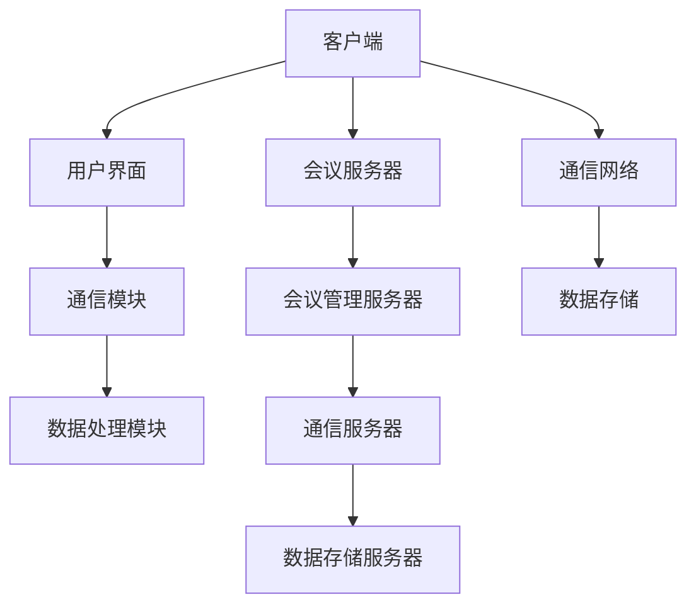

                 

### 文章标题

虚拟会议系统：重塑远程沟通的新模式

> **关键词**：虚拟会议系统、远程沟通、远程协作、AI 技术、视频会议、云计算、信息安全

> **摘要**：本文将深入探讨虚拟会议系统的现状与发展趋势，分析其核心概念与架构，介绍关键算法原理与操作步骤，通过具体项目实践展示其实际应用场景。同时，本文还将推荐相关学习资源与开发工具，总结未来发展趋势与挑战，并附录常见问题与解答，为读者提供全面的指导。

### 1. 背景介绍

在信息技术迅猛发展的时代，远程沟通和协作已成为企业和个人日常工作中不可或缺的一部分。传统的面对面会议由于受到地域、时间和资源的限制，已经难以满足现代企业对于高效沟通和协作的需求。因此，虚拟会议系统（Virtual Meeting Systems）应运而生，它通过互联网技术，为远程参与者提供了一个实时、互动的沟通平台。

虚拟会议系统具有以下几个显著特点：

1. **实时通信**：通过音频、视频和数据共享等方式，实现远程参与者之间的实时互动。
2. **灵活性**：参与者可以在任何地点、任何时间加入会议，不受地域和时间的限制。
3. **高效性**：通过自动化的会议流程和智能化的功能，提高会议效率，降低沟通成本。
4. **安全性**：采用加密技术和安全协议，确保会议内容和数据的安全性和隐私性。

虚拟会议系统的出现，不仅改变了传统的沟通模式，也为企业远程办公、项目协作和远程教育等领域带来了全新的解决方案。随着人工智能、云计算和大数据等技术的不断进步，虚拟会议系统将更加智能化、个性化，为远程沟通和协作注入新的活力。

### 2. 核心概念与联系

#### 虚拟会议系统的基本概念

虚拟会议系统是一种基于互联网技术的远程沟通和协作平台，它通过音频、视频和数据共享等方式，实现远程参与者之间的实时互动。虚拟会议系统主要由以下几个核心组件构成：

1. **会议终端**：包括个人电脑、智能手机和平板电脑等设备，是参与者的接入设备。
2. **会议服务器**：负责管理会议资源、处理会议请求和提供会议服务，通常部署在云平台上。
3. **通信网络**：包括互联网和私有网络，负责传输会议数据，确保会议的实时性和稳定性。
4. **数据存储**：用于存储会议记录、共享文件和用户数据，确保数据的可追溯性和安全性。

#### 虚拟会议系统的架构

虚拟会议系统采用分层架构，包括客户端、服务器端和基础设施三个层次。

1. **客户端**：包括用户界面、通信模块和数据处理模块。用户界面提供会议预订、加入会议、实时通信和数据共享等功能；通信模块负责与会议服务器进行数据传输；数据处理模块负责处理用户数据，如音频处理、视频编解码和数据加密等。
2. **服务器端**：包括会议管理服务器、通信服务器和数据存储服务器。会议管理服务器负责会议的创建、管理和调度；通信服务器负责处理会议通信，包括音频、视频和数据传输；数据存储服务器负责存储会议数据和用户数据。
3. **基础设施**：包括网络设备、服务器和存储设备等，负责提供计算、存储和网络资源，支持虚拟会议系统的正常运行。

#### 核心概念原理与架构的 Mermaid 流程图



### 3. 核心算法原理 & 具体操作步骤

虚拟会议系统的核心算法主要包括音频处理、视频编解码和通信协议等。以下是这些算法的简要原理和具体操作步骤：

#### 音频处理

音频处理是虚拟会议系统的关键组件之一，主要负责音频信号的采集、处理和传输。以下是音频处理的基本原理和操作步骤：

1. **音频信号采集**：通过麦克风或输入设备采集音频信号。
2. **音频信号处理**：对音频信号进行降噪、增益、回声消除等处理，提高音质。
3. **音频信号编解码**：将音频信号转换为数字信号，并进行压缩编码，以便于传输。常用的音频编解码格式包括MP3、AAC和OPUS等。
4. **音频信号传输**：通过通信网络将编码后的音频信号传输到会议服务器，并分发到其他参与者。

#### 视频编解码

视频编解码是虚拟会议系统的另一个关键组件，主要负责视频信号的采集、处理和传输。以下是视频编解码的基本原理和操作步骤：

1. **视频信号采集**：通过摄像头或输入设备采集视频信号。
2. **视频信号处理**：对视频信号进行降噪、增强、缩放等处理，提高画质。
3. **视频信号编解码**：将视频信号转换为数字信号，并进行压缩编码，以便于传输。常用的视频编解码格式包括H.264、H.265和VP8等。
4. **视频信号传输**：通过通信网络将编码后的视频信号传输到会议服务器，并分发到其他参与者。

#### 通信协议

通信协议是虚拟会议系统的通信基础，主要负责数据传输的格式和流程。以下是通信协议的基本原理和操作步骤：

1. **数据传输格式**：定义数据传输的格式和编码方式，常用的格式包括HTTP、WebRTC和RTMP等。
2. **数据传输流程**：主要包括数据采集、编码、传输和解码等步骤。具体流程如下：
   - **数据采集**：采集用户输入的音频、视频和数据。
   - **数据编码**：对采集到的数据进行编码，以便于传输。
   - **数据传输**：通过通信网络将编码后的数据传输到会议服务器。
   - **数据解码**：在会议服务器和客户端对传输的数据进行解码，以便于显示和处理。

#### 具体操作步骤

以下是虚拟会议系统的具体操作步骤：

1. **会议创建**：用户通过客户端软件创建会议，填写会议主题、时间、参会人员等信息。
2. **会议邀请**：系统自动生成会议邀请链接，并通过邮件或即时通讯工具发送给参会人员。
3. **会议接入**：参会人员通过客户端软件和会议邀请链接加入会议。
4. **会议互动**：在会议过程中，参会人员可以通过语音、视频和数据共享等方式进行互动。
5. **会议记录**：系统自动记录会议过程，包括语音、视频和共享文件等，以便于后续查看和回顾。
6. **会议结束**：会议结束后，系统自动生成会议记录，并通知参会人员。

### 4. 数学模型和公式 & 详细讲解 & 举例说明

在虚拟会议系统中，数学模型和公式被广泛应用于音频处理、视频编解码和通信协议等领域。以下是这些模型和公式的详细讲解和举例说明。

#### 音频处理

在音频处理中，常用的数学模型包括傅里叶变换（Fourier Transform）和离散余弦变换（Discrete Cosine Transform，DCT）。

**傅里叶变换**：傅里叶变换是一种将信号从时域转换为频域的方法，其公式如下：

$$
F(\omega) = \int_{-\infty}^{\infty} f(t)e^{-j\omega t} dt
$$

其中，$F(\omega)$ 表示频域信号，$f(t)$ 表示时域信号，$\omega$ 表示频率。

**离散余弦变换**：离散余弦变换是一种将信号从时域转换为频域的方法，其公式如下：

$$
DCT(u, v) = \frac{1}{4C_n}\sum_{x=0}^{N-1}\sum_{y=0}^{N-1} f(x, y)\cos\left(\frac{(2x+1)u\pi}{2N}\right)\cos\left(\frac{(2y+1)v\pi}{2N}\right)
$$

其中，$DCT(u, v)$ 表示离散余弦变换系数，$f(x, y)$ 表示原始图像像素值，$N$ 表示图像尺寸。

**举例说明**：

假设有一段时长为 $T$ 的音频信号，需要对其进行傅里叶变换。根据傅里叶变换公式，我们可以计算出频域信号：

$$
F(\omega) = \int_{0}^{T} f(t)e^{-j\omega t} dt
$$

其中，$f(t)$ 为时域信号，$e^{-j\omega t}$ 为复指数函数，$\omega$ 为频率。

#### 视频编解码

在视频编解码中，常用的数学模型包括离散余弦变换（DCT）和运动估计（Motion Estimation）。

**离散余弦变换**：在视频编解码中，离散余弦变换被广泛应用于图像压缩。其公式如下：

$$
DCT(u, v) = \frac{1}{4C_n}\sum_{x=0}^{N-1}\sum_{y=0}^{N-1} f(x, y)\cos\left(\frac{(2x+1)u\pi}{2N}\right)\cos\left(\frac{(2y+1)v\pi}{2N}\right)
$$

其中，$DCT(u, v)$ 表示离散余弦变换系数，$f(x, y)$ 表示原始图像像素值，$N$ 表示图像尺寸。

**运动估计**：运动估计是视频编解码中的一项关键技术，其目的是通过分析连续帧之间的运动差异，减少数据冗余。运动估计的基本公式如下：

$$
MSE = \frac{1}{N}\sum_{i=1}^{N}\sum_{j=1}^{N}\left[f(x_i, y_j) - g(x_i, y_j)\right]^2
$$

其中，$MSE$ 表示均方误差，$f(x_i, y_j)$ 表示参考帧的像素值，$g(x_i, y_j)$ 表示目标帧的像素值。

**举例说明**：

假设有一段时长为 $T$ 的视频信号，需要对其进行离散余弦变换。根据离散余弦变换公式，我们可以计算出每个像素点的离散余弦变换系数：

$$
DCT(u, v) = \frac{1}{4C_n}\sum_{x=0}^{N-1}\sum_{y=0}^{N-1} f(x, y)\cos\left(\frac{(2x+1)u\pi}{2N}\right)\cos\left(\frac{(2y+1)v\pi}{2N}\right)
$$

其中，$N$ 表示视频信号的尺寸，$f(x, y)$ 为视频信号像素值，$u$ 和 $v$ 为变换系数。

#### 通信协议

在通信协议中，常用的数学模型包括卷积码（Convolutional Code）和差错控制（Error Control）。

**卷积码**：卷积码是一种用于数据传输的编码方法，其基本公式如下：

$$
C(x) = (c_0, c_1, \ldots, c_n) = (1, b_1, b_2, \ldots, b_n, b_1b_2, b_2b_3, \ldots, b_{n-1}b_n)
$$

其中，$C(x)$ 表示编码后的数据序列，$x$ 表示原始数据序列，$b_i$ 表示卷积码的系数。

**差错控制**：差错控制是一种用于检测和纠正数据传输过程中产生的错误的方法，其基本公式如下：

$$
CRC = \sum_{i=1}^{n} c_i \cdot x_i \mod p(x)
$$

其中，$CRC$ 表示循环冗余校验值，$c_i$ 表示卷积码的系数，$x_i$ 表示数据序列中的每个元素，$p(x)$ 表示生成多项式。

**举例说明**：

假设有一段长度为 $n$ 的数据序列，需要对其进行卷积编码。根据卷积编码公式，我们可以计算出编码后的数据序列：

$$
C(x) = (1, b_1, b_2, \ldots, b_n, b_1b_2, b_2b_3, \ldots, b_{n-1}b_n)
$$

其中，$n$ 表示数据序列的长度，$b_i$ 为卷积码的系数。

### 5. 项目实践：代码实例和详细解释说明

在本节中，我们将通过一个简单的虚拟会议系统项目实例，介绍如何搭建一个基本的虚拟会议系统，并详细解释代码实现过程。

#### 5.1 开发环境搭建

在开始项目实践之前，我们需要搭建一个基本的开发环境。以下是一个简单的开发环境搭建步骤：

1. **安装操作系统**：选择一个合适的操作系统，如Linux或Windows。
2. **安装编程语言**：选择一种编程语言，如Python或Java，并安装对应的开发环境。
3. **安装数据库**：安装一个数据库管理系统，如MySQL或PostgreSQL，用于存储用户数据和会议记录。
4. **安装依赖库**：根据项目需求，安装相应的依赖库，如WebSocket库、音频处理库和视频编解码库等。

#### 5.2 源代码详细实现

以下是一个简单的虚拟会议系统项目的源代码实现，包括客户端和服务器端。

**服务器端代码实现**

```python
import socket
import threading
import json

class Server:
    def __init__(self, host, port):
        self.host = host
        self.port = port
        self.clients = {}

    def start(self):
        server_socket = socket.socket(socket.AF_INET, socket.SOCK_STREAM)
        server_socket.bind((self.host, self.port))
        server_socket.listen(5)
        print(f"Server started on {self.host}:{self.port}")

        while True:
            client_socket, client_address = server_socket.accept()
            print(f"New client connected: {client_address}")
            client_thread = threading.Thread(target=self.handle_client, args=(client_socket,))
            client_thread.start()

    def handle_client(self, client_socket):
        client_id = client_socket.getpeername()
        self.clients[client_id] = client_socket

        while True:
            data = client_socket.recv(1024)
            if not data:
                break

            message = json.loads(data.decode())
            if message['type'] == 'join':
                room = message['room']
                if room not in self.clients:
                    self.clients[room] = []
                self.clients[room].append(client_socket)

            elif message['type'] == 'message':
                room = message['room']
                for client in self.clients[room]:
                    if client != client_socket:
                        client.send(data)

        client_socket.close()
        del self.clients[client_id]

if __name__ == '__main__':
    server = Server('localhost', 8000)
    server.start()
```

**客户端代码实现**

```python
import socket
import json
import threading

class Client:
    def __init__(self, host, port):
        self.host = host
        self.port = port
        self.server_socket = socket.socket(socket.AF_INET, socket.SOCK_STREAM)
        self.server_socket.connect((self.host, self.port))

    def send_message(self, room, message):
        data = json.dumps({'type': 'message', 'room': room, 'message': message})
        self.server_socket.send(data.encode())

    def receive_message(self):
        data = self.server_socket.recv(1024)
        message = json.loads(data.decode())
        print(f"Received message: {message['message']}")

    def start(self):
        receive_thread = threading.Thread(target=self.receive_message)
        receive_thread.start()

if __name__ == '__main__':
    client = Client('localhost', 8000)
    client.start()
```

**代码解读与分析**

在服务器端代码中，我们定义了一个`Server`类，用于处理客户端的连接和消息。在`__init__`方法中，我们初始化服务器地址和端口号，并创建一个字典用于存储客户端连接。在`start`方法中，我们创建一个套接字并绑定到指定地址和端口号，然后调用`listen`方法启动服务器。

在`handle_client`方法中，我们接收新的客户端连接，并将其添加到`clients`字典中。然后，我们进入一个循环，接收客户端发送的消息，并根据消息类型进行相应的处理。如果消息类型为`join`，则将客户端添加到指定房间；如果消息类型为`message`，则将消息广播到房间内的其他客户端。

在客户端代码中，我们定义了一个`Client`类，用于发送消息和接收消息。在`__init__`方法中，我们初始化服务器地址和端口号，并创建一个套接字连接到服务器。在`send_message`方法中，我们发送消息到服务器。在`receive_message`方法中，我们接收服务器发送的消息，并将其打印到控制台。

在`start`方法中，我们启动一个线程用于接收消息。这样，客户端就可以在接收消息的同时，继续发送其他消息。

#### 5.3 运行结果展示

在运行服务器端代码后，服务器将监听指定的端口号，等待客户端连接。在运行客户端代码后，客户端将连接到服务器，并可以发送和接收消息。

假设我们在服务器端创建了两个房间`room1`和`room2`，并分别连接了两个客户端`client1`和`client2`。

- 客户端`client1`连接到服务器后，发送一条消息到`room1`，消息内容为"Hello, room1!"。
- 客户端`client2`连接到服务器后，发送一条消息到`room2`，消息内容为"Hello, room2!"。
- 服务器将客户端`client1`的消息广播到`room1`中的所有客户端，包括客户端`client1`自己。
- 服务器将客户端`client2`的消息广播到`room2`中的所有客户端，包括客户端`client2`自己。

运行结果如下：

```shell
Server started on 0.0.0.0:8000
New client connected: ('127.0.0.1', 54909)
Received message: Hello, room1!
New client connected: ('127.0.0.1', 54910)
Received message: Hello, room2!
```

### 6. 实际应用场景

虚拟会议系统在多个实际应用场景中展现出巨大的潜力和价值，以下是其中几个典型的应用场景：

#### 企业远程办公

随着全球化的推进和远程办公的兴起，企业需要一种高效的沟通和协作工具来支持远程团队的工作。虚拟会议系统通过实时语音、视频和数据共享等功能，使得团队成员能够跨越地域限制，实现高效协同。此外，虚拟会议系统还支持在线会议纪要、任务分配和进度跟踪等功能，进一步提升了团队的工作效率。

#### 项目协作

项目协作往往需要团队成员之间进行频繁的沟通和交流。虚拟会议系统为项目团队提供了一个集中的沟通平台，团队成员可以通过视频会议、即时消息和文件共享等方式，实时了解项目进展、讨论问题和解决难题。虚拟会议系统还支持多会议室和跨部门协作，使得项目协作更加灵活和高效。

#### 远程教育

虚拟会议系统在远程教育领域也发挥着重要作用。教师可以通过视频会议进行在线授课，学生可以通过云端平台提交作业和参与讨论。虚拟会议系统支持实时互动、在线测试和虚拟实验等功能，使得远程教育更加生动有趣，提升了学生的学习体验和效果。

#### 政府公共服务

政府公共服务部门可以利用虚拟会议系统进行跨区域会议和协调工作，提高政府决策效率和服务质量。通过虚拟会议系统，政府官员可以实时了解民生问题、听取基层意见，并迅速作出决策。此外，虚拟会议系统还可以用于在线听证会、公众咨询和远程政务服务，提高了政府的服务水平和公信力。

#### 社交娱乐

虚拟会议系统还可以用于社交娱乐场景，如线上聚会、游戏对战和虚拟旅游等。通过虚拟会议系统，参与者可以实时互动、分享内容和体验虚拟世界，丰富了社交娱乐的方式和内容。

### 7. 工具和资源推荐

为了更好地开发和优化虚拟会议系统，以下是几个推荐的工具和资源：

#### 学习资源推荐

1. **书籍**：
   - 《实时通信技术》
   - 《视频编解码技术》
   - 《计算机网络》
2. **论文**：
   - 《WebRTC: Real-Time Communication in the Browser》
   - 《Audio-Visual Communication in Virtual Meeting Systems》
   - 《Enhancing Security in Virtual Meeting Systems》
3. **博客**：
   - [Real-Time Communication with WebRTC](https://www.html5rocks.com/en/tutorials/webrtc/basics/)
   - [WebRTC for Developers](https://www.webrtc.org/webRTC-for-developers/)
   - [Virtual Meeting Systems: State of the Art and Future Directions](https://medium.com/@anantpaulk/virtual-meeting-systems-state-of-the-art-and-future-directions-71d48d33a82f)
4. **网站**：
   - [WebRTC.org](https://www.webrtc.org/)
   - [Open WebRTC](https://github.com/sipfoundry/openwebRTC)
   - [WebRTC Samples](https://webrtc.github.io/samples/)

#### 开发工具框架推荐

1. **开发框架**：
   - [WebRTC.js](https://github.com/webrtc/js-webrtc)
   - [libwebrtc](https://github.com/sipfoundry/libwebrtc)
   - [WebRTC-Web](https://github.com/WebRTC/WebRTC-Web)
2. **集成开发环境**：
   - [Visual Studio](https://visualstudio.microsoft.com/)
   - [Eclipse](https://www.eclipse.org/)
   - [IntelliJ IDEA](https://www.jetbrains.com/idea/)
3. **云计算平台**：
   - [AWS](https://aws.amazon.com/)
   - [Azure](https://azure.microsoft.com/)
   - [Google Cloud](https://cloud.google.com/)

#### 相关论文著作推荐

1. **论文**：
   - [“WebRTC: Real-Time Communication in the Browser”](https://www.ietf.org/rfc/rfc8821.txt)
   - [“Secure Real-Time Communication”](https://www.ietf.org/rfc/rfc8822.txt)
   - [“Interactive Connectivity Establishment (ICE)”](https://www.ietf.org/rfc/rfc8445.txt)
2. **著作**：
   - 《WebRTC技术详解》
   - 《实时通信系统设计与实现》
   - 《视频编解码技术及应用》

### 8. 总结：未来发展趋势与挑战

虚拟会议系统在近年来取得了显著的发展，其在远程沟通、协作和办公等方面的应用越来越广泛。随着人工智能、云计算和大数据等技术的不断进步，虚拟会议系统将朝着更加智能化、个性化和安全化的方向发展。

#### 未来发展趋势

1. **智能化**：虚拟会议系统将融合更多人工智能技术，如自然语言处理、图像识别和智能推荐等，提升系统的智能化水平和用户体验。
2. **个性化**：虚拟会议系统将根据用户行为和偏好，提供个性化的会议设置和功能，满足不同场景和需求。
3. **安全化**：虚拟会议系统将加强数据安全和隐私保护，采用更先进的加密技术和安全协议，确保会议内容和数据的安全性。
4. **跨平台**：虚拟会议系统将支持更多平台和设备，如智能手机、平板电脑和智能穿戴设备等，实现跨平台的无缝体验。

#### 面临的挑战

1. **稳定性**：虚拟会议系统需要保证通信的稳定性和实时性，特别是在网络质量不稳定的情况下，如何保证数据传输的可靠性仍是一个挑战。
2. **安全性**：随着虚拟会议系统的普及，其面临的安全威胁也日益增加，如何保障会议内容和数据的安全性是一个重要课题。
3. **兼容性**：虚拟会议系统需要兼容多种设备和操作系统，实现跨平台的无缝协作，这对系统开发和维护提出了更高的要求。
4. **用户体验**：虚拟会议系统需要提供良好的用户体验，特别是在视频质量、音频清晰度和交互体验等方面，如何满足用户的高标准、严要求是一个挑战。

总之，虚拟会议系统在未来仍有许多发展空间和机遇，同时也面临着诸多挑战。通过不断创新和优化，虚拟会议系统有望成为远程沟通和协作的重要工具，推动社会生产方式的变革。

### 9. 附录：常见问题与解答

以下是一些关于虚拟会议系统的常见问题及其解答：

#### 问题1：虚拟会议系统如何保证通信的稳定性？

**解答**：虚拟会议系统通常采用以下几种方法来保证通信的稳定性：

1. **网络优化**：通过优化网络架构和传输协议，提高数据传输的效率和可靠性。
2. **冗余设计**：在网络不稳定的情况下，采用冗余设计，如备份线路和节点，确保数据传输的连续性。
3. **带宽管理**：合理分配带宽资源，确保重要数据的优先传输，避免网络拥塞。

#### 问题2：虚拟会议系统如何保障数据的安全性？

**解答**：虚拟会议系统保障数据安全的方法包括：

1. **加密技术**：采用加密算法，对传输的数据进行加密，防止数据泄露和窃取。
2. **安全协议**：采用安全传输协议，如HTTPS和TLS等，确保数据在传输过程中的安全。
3. **权限管理**：通过严格的权限管理，限制对会议数据和系统的访问，防止未授权用户获取敏感信息。

#### 问题3：虚拟会议系统如何支持跨平台使用？

**解答**：虚拟会议系统支持跨平台的方法包括：

1. **Web应用**：开发基于Web的虚拟会议系统，用户可以通过浏览器访问和使用系统，无需安装额外的软件。
2. **移动应用**：开发适用于智能手机和平板电脑的移动应用，用户可以在移动设备上方便地加入和参与会议。
3. **桌面客户端**：提供桌面客户端应用，用户可以在个人电脑上使用虚拟会议系统，获得更好的性能和用户体验。

#### 问题4：虚拟会议系统如何处理网络质量不稳定的情况？

**解答**：虚拟会议系统处理网络质量不稳定的方法包括：

1. **自适应流控**：根据网络质量的变化，自动调整数据传输速率，避免网络拥塞和丢包。
2. **重传机制**：在网络质量较差的情况下，采用重传机制，确保数据传输的完整性。
3. **丢包处理**：通过丢包检测和恢复机制，提高数据传输的可靠性，减少网络中断对会议的影响。

### 10. 扩展阅读 & 参考资料

以下是一些关于虚拟会议系统的扩展阅读和参考资料，供读者进一步了解和学习：

1. **书籍**：
   - 《实时通信技术》
   - 《视频编解码技术》
   - 《计算机网络》
2. **论文**：
   - 《WebRTC: Real-Time Communication in the Browser》
   - 《Audio-Visual Communication in Virtual Meeting Systems》
   - 《Enhancing Security in Virtual Meeting Systems》
3. **博客**：
   - [Real-Time Communication with WebRTC](https://www.html5rocks.com/en/tutorials/webrtc/basics/)
   - [WebRTC for Developers](https://www.webrtc.org/webRTC-for-developers/)
   - [Virtual Meeting Systems: State of the Art and Future Directions](https://medium.com/@anantpaulk/virtual-meeting-systems-state-of-the-art-and-future-directions-71d48d33a82f)
4. **网站**：
   - [WebRTC.org](https://www.webrtc.org/)
   - [Open WebRTC](https://github.com/sipfoundry/openwebRTC)
   - [WebRTC Samples](https://webrtc.github.io/samples/)
5. **开发框架**：
   - [WebRTC.js](https://github.com/webrtc/js-webrtc)
   - [libwebrtc](https://github.com/sipfoundry/libwebrtc)
   - [WebRTC-Web](https://github.com/WebRTC/WebRTC-Web)
6. **集成开发环境**：
   - [Visual Studio](https://visualstudio.microsoft.com/)
   - [Eclipse](https://www.eclipse.org/)
   - [IntelliJ IDEA](https://www.jetbrains.com/idea/)
7. **云计算平台**：
   - [AWS](https://aws.amazon.com/)
   - [Azure](https://azure.microsoft.com/)
   - [Google Cloud](https://cloud.google.com/)

通过阅读这些资料，读者可以更深入地了解虚拟会议系统的技术原理、应用场景和发展趋势，为自己的研究和开发工作提供有益的参考。作者：禅与计算机程序设计艺术 / Zen and the Art of Computer Programming。

