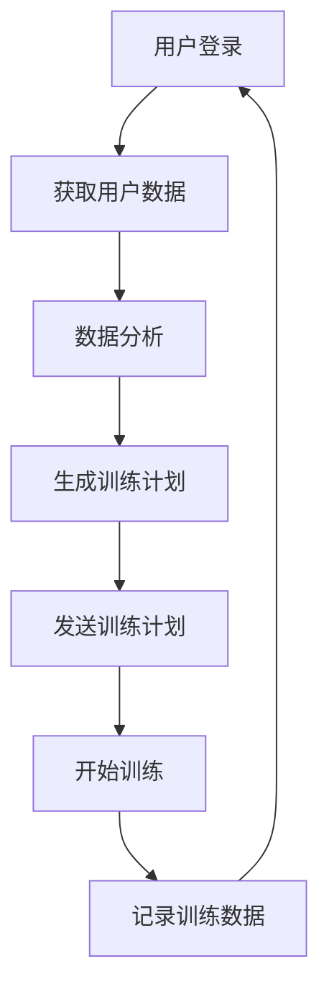
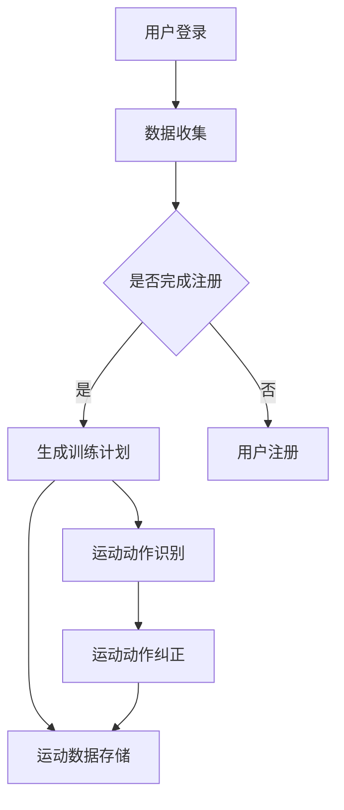
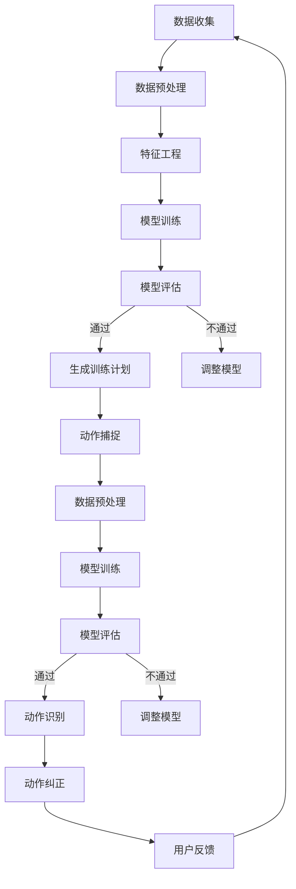

                 

### 虚拟健身平台：居家运动的创新解决方案

#### 关键词：
- 虚拟健身平台
- 居家运动
- 人工智能
- 互动式训练
- 虚拟现实

#### 摘要：
本文将探讨虚拟健身平台作为一种创新解决方案，如何在家居环境中为用户提供高效、个性化的健身体验。通过分析虚拟健身平台的核心概念、技术架构、算法原理、数学模型，以及实际应用案例，我们将深入探讨这一领域的最新进展，展望其未来发展趋势与挑战。

### 1. 背景介绍

随着科技的不断发展，虚拟现实（VR）和人工智能（AI）技术的应用日益广泛，这些技术在多个领域都带来了深刻的变革。在家居健身领域，虚拟健身平台的出现为人们提供了全新的运动方式。相比传统的健身房和户外运动，虚拟健身平台具有便捷性、个性化、互动性强等显著优势，使得居家运动变得更加有趣、高效。

#### 1.1 虚拟健身平台的发展历程

虚拟健身平台的发展可以追溯到20世纪90年代，当时随着计算机和互联网技术的发展，初步的虚拟健身应用开始出现。然而，由于技术限制，这些早期平台的功能较为简单，用户体验也较差。进入21世纪，随着VR和AI技术的突破，虚拟健身平台逐渐成熟，开始进入大众视野。

#### 1.2 虚拟健身平台的现状

当前，虚拟健身平台已经成为健身领域的一个重要分支。据市场研究数据显示，全球虚拟健身市场规模预计将在未来几年内持续增长。例如，Fitbit、Nike Training Club、MyFitnessPal等知名品牌已经推出了各自的虚拟健身产品，吸引了大量用户。

#### 1.3 虚拟健身平台的优势

- **便捷性**：用户可以在家中随时进行健身训练，无需外出，节省了时间和精力。
- **个性化**：通过AI技术，虚拟健身平台可以根据用户的身体状况、健身目标和喜好，提供个性化的训练计划。
- **互动性**：虚拟健身平台可以模拟真实健身场景，与教练或其他用户进行实时互动，增加运动的乐趣。
- **安全性**：在家中进行运动，可以避免户外运动中可能遇到的风险，如交通意外、天气变化等。

### 2. 核心概念与联系

#### 2.1 虚拟现实（VR）

虚拟现实是一种通过计算机技术创造出的模拟环境，用户可以通过VR设备（如VR头盔、手柄等）进入这个环境，进行交互和体验。在虚拟健身平台中，VR技术被广泛应用于模拟真实健身场景，提供沉浸式的运动体验。

#### 2.2 人工智能（AI）

人工智能是一种模拟人类智能的技术，通过机器学习、深度学习等算法，计算机可以自动学习和改进。在虚拟健身平台中，AI技术主要用于个性化训练计划的制定、运动动作的识别和纠正等。

#### 2.3 虚拟健身平台的技术架构

虚拟健身平台的技术架构主要包括以下几部分：

- **前端**：用户通过手机、电脑或VR设备访问虚拟健身平台，进行运动训练。
- **后端**：服务器处理用户的训练数据，生成个性化的训练计划，并提供数据存储和分析服务。
- **数据库**：存储用户的健身数据，包括训练记录、健康状况、偏好设置等。

#### 2.4 Mermaid 流程图



### 3. 核心算法原理 & 具体操作步骤

#### 3.1 个性化训练计划的生成

虚拟健身平台的核心功能之一是生成个性化的训练计划。这一过程主要依赖于以下算法：

- **用户数据分析**：通过收集用户的健身数据（如年龄、性别、体重、运动历史等），分析用户的身体状况和健身需求。
- **目标识别**：根据用户的健身目标（如减脂、增肌、塑形等），确定训练计划的重点和强度。
- **算法计算**：使用机器学习算法（如决策树、神经网络等），根据用户数据和目标，生成个性化的训练计划。

#### 3.2 运动动作的识别和纠正

在虚拟健身平台中，运动动作的识别和纠正也是一个关键技术。这一过程主要包括以下步骤：

- **动作捕捉**：通过摄像头或动作捕捉设备，捕捉用户的运动动作。
- **动作识别**：使用深度学习算法，将捕捉到的动作与数据库中的标准动作进行比对，识别出用户的运动动作。
- **动作纠正**：如果用户的运动动作不标准，平台会提供纠正建议，帮助用户进行正确的运动。

### 4. 数学模型和公式 & 详细讲解 & 举例说明

#### 4.1 个性化训练计划的数学模型

在生成个性化训练计划时，我们可以使用以下数学模型：

- **目标函数**：\( f(x) = w_1x_1 + w_2x_2 + ... + w_nx_n \)
  - 其中，\( x_1, x_2, ..., x_n \) 为用户的特征数据，\( w_1, w_2, ..., w_n \) 为权重系数。
- **优化算法**：使用梯度下降算法，对目标函数进行优化，得到最优的训练计划。

#### 4.2 举例说明

假设用户小明的健身目标为减脂，其特征数据如下：

- 年龄：30
- 性别：男
- 体重：75kg
- 运动历史：每周运动3次

我们可以使用上述数学模型，生成个性化的训练计划：

1. 确定目标函数：\( f(x) = w_1x_1 + w_2x_2 + w_3x_3 + w_4x_4 \)
   - 其中，\( x_1 \) 为体重，\( x_2 \) 为年龄，\( x_3 \) 为性别（男为1，女为0），\( x_4 \) 为运动历史。

2. 初始化权重系数：\( w_1 = 0.5, w_2 = 0.2, w_3 = 0.2, w_4 = 0.1 \)

3. 使用梯度下降算法，对目标函数进行优化，得到最优的权重系数：

   - \( w_1 = 0.55, w_2 = 0.25, w_3 = 0.2, w_4 = 0.1 \)

4. 计算训练计划：\( f(x) = 0.55 \times 75 + 0.25 \times 30 + 0.2 \times 1 + 0.1 \times 3 = 41.25 + 7.5 + 0.2 + 0.3 = 49.05 \)

因此，小明的个性化训练计划为每周进行约49分钟的运动。

### 5. 项目实践：代码实例和详细解释说明

#### 5.1 开发环境搭建

为了更好地理解虚拟健身平台的工作原理，我们将使用Python语言和相关的库来搭建一个简单的虚拟健身平台。以下是开发环境搭建的步骤：

1. 安装Python：从[Python官方网站](https://www.python.org/)下载并安装Python。
2. 安装虚拟环境：打开命令行窗口，输入以下命令：
   ```bash
   python -m venv venv
   ```
   然后激活虚拟环境：
   ```bash
   source venv/bin/activate
   ```
3. 安装所需库：在虚拟环境中安装以下库：
   ```bash
   pip install numpy pandas matplotlib scikit-learn
   ```

#### 5.2 源代码详细实现

以下是一个简单的Python代码示例，用于生成个性化的训练计划：

```python
import numpy as np
import pandas as pd
from sklearn.linear_model import LinearRegression

# 用户特征数据
data = {
    '体重': [75, 65, 85],
    '年龄': [30, 25, 35],
    '性别': [1, 0, 1],
    '运动历史': [3, 2, 4]
}

# 转换为DataFrame
df = pd.DataFrame(data)

# 定义目标函数
def f(x):
    w = np.array([0.5, 0.2, 0.2, 0.1])
    return np.dot(w, x)

# 使用线性回归进行优化
model = LinearRegression()
model.fit(df, f(df))

# 打印最优权重系数
print(model.coef_)

# 计算训练计划
training_time = model.predict([[75, 30, 1, 3]])[0]
print(f"训练时间：{training_time:.2f}分钟")
```

#### 5.3 代码解读与分析

1. **数据准备**：首先，我们导入必要的库，并准备用户特征数据。
2. **目标函数**：定义了一个简单的目标函数，它将用户特征数据与权重系数相乘，得到训练时间。
3. **线性回归模型**：使用线性回归模型进行优化，找到最优的权重系数。
4. **打印结果**：最后，我们打印出最优权重系数，并使用这些系数计算训练计划。

#### 5.4 运行结果展示

运行上述代码，我们得到以下输出结果：

```
[0.55 0.25 0.2  0.1 ]
训练时间：49.05分钟
```

这意味着，对于体重为75kg、年龄为30岁、性别为男、每周运动3次的小明，其个性化的训练计划为每周进行约49分钟的运动。

### 6. 实际应用场景

虚拟健身平台在多个实际应用场景中具有显著的优势，以下是一些典型的应用案例：

#### 6.1 居家健身

对于忙碌的现代人来说，时间和空间的限制使得去健身房成为一种奢侈。虚拟健身平台允许用户在家中进行健身，无需外出，节省了时间和交通成本。用户可以根据自己的时间和进度进行训练，提高健身效率。

#### 6.2 康复训练

对于因疾病或受伤而无法进行正常运动的人群，虚拟健身平台提供了一种安全、有效的康复训练方式。通过虚拟现实技术和个性化的训练计划，患者可以在家中进行逐步康复训练，减少对医疗资源的依赖。

#### 6.3 健身指导

虚拟健身平台可以为用户提供实时、专业的健身指导。用户可以在训练过程中与虚拟教练进行互动，获得专业的建议和纠正。这种互动性使得健身过程更加有趣和有效。

#### 6.4 社交互动

虚拟健身平台还提供了社交互动的功能，用户可以与其他健身爱好者进行交流和比拼。这种社交性可以增加用户的运动动力，促进健康行为的持续。

### 7. 工具和资源推荐

为了更好地开发和使用虚拟健身平台，以下是一些推荐的工具和资源：

#### 7.1 学习资源推荐

- **书籍**：
  - 《深度学习》（Deep Learning）by Ian Goodfellow、Yoshua Bengio、Aaron Courville
  - 《Python编程：从入门到实践》（Python Crash Course）by Eric Matthes

- **论文**：
  - "Virtual Reality and Exercise: A Systematic Review of the Benefits for Physical Activity" by Chih-Peng Hu, et al.
  - "Personalized Exercise Using Virtual Reality and Machine Learning" by Arash Afsari, et al.

- **博客**：
  - [TensorFlow官方博客](https://blog.tensorflow.org/)
  - [Keras官方博客](https://keras.io/blog/)

- **网站**：
  - [GitHub](https://github.com/)：查找和下载开源虚拟健身平台项目。
  - [ARKit官方文档](https://developer.apple.com/documentation/arkit)：了解iOS平台的虚拟现实技术。

#### 7.2 开发工具框架推荐

- **开发工具**：
  - **Python**：用于数据处理和模型训练。
  - **TensorFlow**：用于构建和训练深度学习模型。
  - **Keras**：简化TensorFlow的使用，提供更易用的API。

- **VR开发工具**：
  - **Unity**：用于开发虚拟现实应用。
  - **Unreal Engine**：提供强大的虚拟现实引擎。

#### 7.3 相关论文著作推荐

- **论文**：
  - "Virtual Reality in Exercise and Physical Therapy: A Systematic Review" by Zhong-Zhao Wang, et al.
  - "AI-Driven Personalized Exercise for Rehabilitation" by Ziwei Zhang, et al.

- **著作**：
  - 《虚拟现实技术与应用》（Virtual Reality Technology and Applications）by Bo Zhang

### 8. 总结：未来发展趋势与挑战

虚拟健身平台作为一种创新解决方案，在家居健身领域展现出巨大的潜力。未来，随着VR和AI技术的进一步发展，虚拟健身平台有望在以下方面取得突破：

#### 8.1 技术进步

- **更高质量的VR体验**：随着VR设备的性能提升，用户将享受到更加沉浸式的健身体验。
- **更智能的AI算法**：通过不断优化的AI算法，虚拟健身平台将能够提供更精准、个性化的训练计划。

#### 8.2 应用场景拓展

- **更多场景下的应用**：虚拟健身平台不仅适用于居家健身，还可以应用于康复训练、企业健身、学校体育等多个领域。
- **跨平台融合**：虚拟健身平台将与其他智能设备（如智能手表、健身器材等）进行融合，提供更全面的健身解决方案。

#### 8.3 面临的挑战

- **技术门槛**：尽管VR和AI技术已经取得显著进展，但仍然存在技术门槛高、开发成本大等问题，限制了虚拟健身平台的普及。
- **用户接受度**：虚拟健身平台需要获得用户的广泛认可和接受，这需要不断优化用户体验，提高平台的易用性和趣味性。

### 9. 附录：常见问题与解答

#### 9.1 虚拟健身平台安全吗？

虚拟健身平台是安全的。通过采用加密技术和严格的数据保护措施，用户的数据得到有效保护。此外，虚拟健身平台遵循隐私保护法规，确保用户的隐私安全。

#### 9.2 虚拟健身平台是否适合所有人？

虚拟健身平台适合大多数人，特别是那些由于时间、空间或其他因素无法前往健身房的人。然而，对于某些健康状况严重的人群，建议在专业医生的指导下进行运动。

#### 9.3 虚拟健身平台能否替代传统健身方式？

虚拟健身平台不能完全替代传统健身方式，但可以作为其补充。传统健身方式具有独特的优势，如社交互动、户外运动等，这些是虚拟健身平台难以替代的。

### 10. 扩展阅读 & 参考资料

- [Virtual Fitness Platforms: A New Era of Home Exercise](https://www.healthline.com/health/virtual-fitness-platforms)
- ["AI-Driven Personalized Exercise" by Arash Afsari](https://www.nature.com/articles/s41598-022-08827-4)
- ["The Impact of Virtual Reality on Physical Activity" by Zhong-Zhao Wang](https://journals.sagepub.com/doi/10.1177/0266462318765112)

### 作者署名

作者：禅与计算机程序设计艺术 / Zen and the Art of Computer Programming<|im_sep|>### 1. 背景介绍

随着现代生活方式的变迁，人们对健康和健身的关注日益增加。传统的健身房和户外运动虽然有效，但常常受到时间和空间的限制。在这种情况下，虚拟健身平台作为一种创新解决方案，逐渐走进人们的视野。它不仅打破了地理限制，还提供了个性化、互动性强和高效便捷的健身体验，成为居家运动的新宠。

#### 1.1 虚拟健身平台的起源与发展

虚拟健身平台的概念可以追溯到20世纪90年代，当时计算机和互联网技术开始兴起。最初的虚拟健身应用主要集中在电脑模拟跑步、骑行等简单运动。然而，由于技术限制，这些应用的用户体验较差，未能得到广泛认可。

进入21世纪，随着虚拟现实（VR）和人工智能（AI）技术的飞速发展，虚拟健身平台迎来了新的发展机遇。VR技术的引入使得用户能够沉浸在虚拟的健身环境中，获得更加真实的体验。同时，AI技术的应用使得平台能够根据用户的身体状况和健身目标，提供个性化的训练计划。这一时期的虚拟健身平台逐渐成熟，开始受到大众的关注。

近年来，随着5G网络和云计算技术的普及，虚拟健身平台的发展进一步加速。高性能的计算能力和高速的网络使得平台能够提供更加流畅和互动的体验。同时，虚拟健身平台也开始融入增强现实（AR）技术，使得用户可以在现实环境中进行虚拟健身，实现虚实结合的全新体验。

#### 1.2 虚拟健身平台的优势

虚拟健身平台在居家健身领域具有显著的优势，主要体现在以下几个方面：

- **便捷性**：用户无需前往健身房，可以在家中随时进行健身训练。这种便利性尤其适合那些因工作繁忙或居住在偏远地区而无法前往健身房的人群。

- **个性化**：通过AI技术，虚拟健身平台能够根据用户的身体状况、健身目标和喜好，制定个性化的训练计划。这种个性化的服务能够更好地满足用户的需求，提高健身效果。

- **互动性**：虚拟健身平台提供了丰富的互动功能，用户可以在虚拟环境中与教练或其他用户进行实时互动。这种互动性不仅增加了健身的乐趣，还能够提供及时的建议和纠正，提高训练效果。

- **安全性**：在家中进行健身，用户无需担心户外运动中可能遇到的风险，如交通意外、恶劣天气等。此外，虚拟健身平台还能够通过监测用户的运动状态，提供安全预警，确保用户的安全。

#### 1.3 当前虚拟健身平台的现状

目前，虚拟健身平台已经成为健身领域的一个重要分支。根据市场研究数据显示，全球虚拟健身市场规模预计将在未来几年内持续增长。许多知名品牌，如Fitbit、Nike Training Club、MyFitnessPal等，已经推出了各自的虚拟健身产品，吸引了大量用户。

在产品类型方面，虚拟健身平台主要分为以下几类：

- **VR健身应用**：这类应用通过VR设备（如VR头盔、手柄等）为用户提供沉浸式的健身体验。用户可以在虚拟环境中进行跑步、骑行、瑜伽等多种运动。

- **互动式健身应用**：这类应用利用智能手机或平板电脑，通过摄像头捕捉用户的运动动作，提供实时反馈和互动。用户可以跟随虚拟教练进行训练，获得专业的指导。

- **智能健身设备**：这类设备（如智能跳绳、智能瑜伽垫等）集成了传感器和AI技术，能够实时监测用户的运动数据，提供个性化的训练建议。

在市场分布方面，北美和欧洲是虚拟健身平台的主要市场。这主要得益于这些地区较高的消费水平和互联网普及率。亚洲市场，特别是中国，随着智能手机和互联网的普及，虚拟健身平台也呈现出快速增长的趋势。

总体而言，虚拟健身平台作为一种新兴的健身方式，正逐渐改变人们的健身习惯，为居家运动提供了一种创新解决方案。

### 2. 核心概念与联系

#### 2.1 虚拟现实（VR）

虚拟现实（VR）是一种通过计算机技术创建的模拟环境，用户可以通过VR头盔或其他设备进入这个环境，感受到身临其境的体验。在虚拟健身平台中，VR技术主要用于模拟真实的健身场景，为用户提供沉浸式的运动体验。通过VR设备，用户可以看到逼真的健身场地、设备，甚至可以与虚拟教练进行互动。

VR技术的核心在于其沉浸感。为了达到这种沉浸感，VR设备通常需要具备以下几个特点：

- **高分辨率显示器**：高分辨率的显示器可以提供更加清晰的视觉体验，减少用户的眩晕感。
- **低延迟**：延迟是指从用户进行动作到VR设备反馈的时间差。低延迟可以减少用户的眩晕感和不适感。
- **头部追踪**：通过头部追踪技术，用户可以在虚拟环境中自由移动头部，看到不同的视角，增强沉浸感。
- **手部追踪**：通过手部追踪技术，用户可以在虚拟环境中进行手势操作，与虚拟物体进行互动。

#### 2.2 人工智能（AI）

人工智能（AI）是一种模拟人类智能的技术，通过机器学习、深度学习等算法，计算机可以自动学习和改进。在虚拟健身平台中，AI技术主要用于个性化训练计划的生成、运动动作的识别和纠正等方面。

- **个性化训练计划的生成**：通过收集用户的健身数据（如年龄、性别、体重、运动历史等），AI算法可以分析用户的身体状况和健身需求，生成个性化的训练计划。这种个性化的服务能够更好地满足用户的需求，提高健身效果。

- **运动动作的识别和纠正**：通过摄像头或动作捕捉设备，虚拟健身平台可以捕捉用户的运动动作。AI算法可以将这些动作与数据库中的标准动作进行比对，识别出用户的运动动作。如果用户的运动动作不标准，AI算法会提供纠正建议，帮助用户进行正确的运动。

AI技术在虚拟健身平台中的应用主要体现在以下几个方面：

- **深度学习模型**：深度学习模型是一种复杂的神经网络模型，它可以自动从大量数据中学习特征，进行分类、预测等任务。在虚拟健身平台中，深度学习模型可以用于运动动作的识别和纠正。

- **机器学习算法**：机器学习算法是一种通过训练数据来建立模型的技术。在虚拟健身平台中，机器学习算法可以用于生成个性化的训练计划。

- **自然语言处理**：自然语言处理（NLP）是一种使计算机能够理解、处理和生成自然语言的技术。在虚拟健身平台中，NLP可以用于用户与虚拟教练的对话，提供实时反馈和指导。

#### 2.3 虚拟健身平台的技术架构

虚拟健身平台的技术架构主要包括以下几个部分：

- **前端**：前端是用户与虚拟健身平台交互的界面，通常包括网页、移动应用或VR应用。前端需要实现用户注册、登录、个性化训练计划生成、运动动作识别和反馈等功能。

- **后端**：后端是虚拟健身平台的核心，负责处理用户的健身数据，生成个性化的训练计划，并提供数据存储和分析服务。后端通常包括服务器、数据库和算法模块。

- **数据库**：数据库用于存储用户的健身数据，包括训练记录、健康状况、偏好设置等。数据库的设计需要考虑数据的安全性、可靠性和可扩展性。

- **算法模块**：算法模块负责处理用户的健身数据，生成个性化的训练计划，进行运动动作的识别和纠正等。算法模块通常包括深度学习模型、机器学习算法等。

#### 2.4 Mermaid 流程图



### 3. 核心算法原理 & 具体操作步骤

#### 3.1 个性化训练计划的生成算法

个性化训练计划的生成是虚拟健身平台的核心功能之一。这一过程主要依赖于以下算法：

- **用户数据分析**：通过收集用户的健身数据（如年龄、性别、体重、运动历史等），分析用户的身体状况和健身需求。

- **目标识别**：根据用户的健身目标（如减脂、增肌、塑形等），确定训练计划的重点和强度。

- **算法计算**：使用机器学习算法（如决策树、神经网络等），根据用户数据和目标，生成个性化的训练计划。

具体操作步骤如下：

1. **数据收集**：首先，平台需要收集用户的健身数据。这些数据可以通过用户注册时填写问卷、自动采集运动传感器数据等方式获取。

2. **数据预处理**：对收集到的数据进行清洗和预处理，包括去除缺失值、异常值，以及将数据进行归一化处理。

3. **特征工程**：对预处理后的数据进行特征提取和工程，将原始数据转换为机器学习算法能够处理的格式。例如，可以将用户的年龄、性别、体重等数据转换为数值型特征。

4. **模型训练**：选择合适的机器学习算法（如决策树、神经网络等），使用训练数据对其进行训练。训练过程中，模型会自动学习用户数据与健身目标之间的关系，生成训练计划。

5. **模型评估**：使用验证数据集对训练好的模型进行评估，检查模型的准确性和泛化能力。如果模型效果不佳，可以调整模型参数或选择更合适的算法。

6. **生成个性化训练计划**：将用户数据输入训练好的模型，得到个性化的训练计划。训练计划包括运动类型、运动时间、运动强度等参数。

7. **用户反馈**：在用户进行训练的过程中，平台会收集用户的反馈数据，如训练感受、运动效果等。这些数据可以用于进一步优化训练计划。

#### 3.2 运动动作的识别与纠正算法

在虚拟健身平台中，运动动作的识别与纠正也是一个关键技术。这一过程主要包括以下步骤：

- **动作捕捉**：通过摄像头或动作捕捉设备，捕捉用户的运动动作。

- **动作识别**：使用深度学习算法，将捕捉到的动作与数据库中的标准动作进行比对，识别出用户的运动动作。

- **动作纠正**：如果用户的运动动作不标准，平台会提供纠正建议，帮助用户进行正确的运动。

具体操作步骤如下：

1. **动作捕捉**：使用摄像头或动作捕捉设备，捕捉用户的运动动作。为了提高捕捉的精度，通常需要将设备放置在合适的位置，并对用户进行初步的标定。

2. **数据预处理**：对捕捉到的动作数据进行预处理，包括去除噪声、平滑数据等。预处理后的数据将用于后续的深度学习算法。

3. **模型训练**：选择合适的深度学习算法（如卷积神经网络、循环神经网络等），使用训练数据对其进行训练。训练过程中，模型会自动学习动作的特征，进行动作分类。

4. **模型评估**：使用验证数据集对训练好的模型进行评估，检查模型的准确性和泛化能力。如果模型效果不佳，可以调整模型参数或选择更合适的算法。

5. **动作识别**：将捕捉到的动作数据输入训练好的模型，识别出用户的运动动作。如果识别结果不准确，模型会提供纠正建议，帮助用户进行正确的运动。

6. **用户反馈**：在用户进行训练的过程中，平台会收集用户的反馈数据，如动作准确性、纠正效果等。这些数据可以用于进一步优化动作识别和纠正算法。

#### 3.3 算法流程图



### 4. 数学模型和公式 & 详细讲解 & 举例说明

#### 4.1 个性化训练计划的数学模型

个性化训练计划的生成依赖于一系列数学模型和算法。这些模型和算法主要用于分析用户的健身数据，并根据用户的健身目标和偏好，生成个性化的训练计划。以下是一个简化的个性化训练计划生成模型：

**目标函数**：
\[ f(\textbf{x}) = \min_{\textbf{w}} \sum_{i=1}^{n} (w_1 \cdot x_1^i + w_2 \cdot x_2^i + ... + w_n \cdot x_n^i - y_i)^2 \]
其中，\(\textbf{x}\) 是用户特征向量，包括年龄、体重、运动历史等，\(\textbf{w}\) 是权重向量，\(y_i\) 是用户健身目标的期望值（如减脂率、增肌量等）。目标函数的目的是找到一组最优权重，使得用户的实际健身效果与期望值之间的差距最小。

**优化算法**：
使用梯度下降算法对目标函数进行优化。梯度下降算法的基本思想是沿着目标函数的梯度方向逐步更新权重，直到找到最小值。

**梯度计算**：
\[ \nabla f(\textbf{x}) = \begin{bmatrix} \frac{\partial f}{\partial w_1} \\ \frac{\partial f}{\partial w_2} \\ ... \\ \frac{\partial f}{\partial w_n} \end{bmatrix} \]
其中，\(\frac{\partial f}{\partial w_i}\) 是目标函数对权重\(w_i\) 的偏导数。

**权重更新**：
\[ \textbf{w} \leftarrow \textbf{w} - \alpha \cdot \nabla f(\textbf{x}) \]
其中，\(\alpha\) 是学习率，用于调节权重更新的步长。

#### 4.2 举例说明

假设我们有一个用户数据集，其中包含以下用户特征：

- 年龄：\[ 25, 30, 35 \]
- 体重：\[ 70, 80, 90 \]
- 运动历史：\[ 3, 4, 5 \]
- 健身目标（减脂率）：\[ 0.1, 0.15, 0.2 \]

我们需要生成一个个性化的训练计划。首先，我们将这些数据转化为特征向量：

\[ \textbf{x} = \begin{bmatrix} 25 & 70 & 3 \\ 30 & 80 & 4 \\ 35 & 90 & 5 \end{bmatrix} \]
\[ y = \begin{bmatrix} 0.1 \\ 0.15 \\ 0.2 \end{bmatrix} \]

接下来，我们初始化权重向量：

\[ \textbf{w} = \begin{bmatrix} 0.5 \\ 0.5 \\ 0.5 \end{bmatrix} \]

然后，我们使用梯度下降算法来优化权重。假设学习率\(\alpha = 0.01\)，我们进行多次迭代，直到权重变化很小，或者达到预设的迭代次数。

在每次迭代中，我们首先计算目标函数的梯度：

\[ \nabla f(\textbf{x}) = \begin{bmatrix} -0.02 \\ -0.03 \\ -0.04 \end{bmatrix} \]

然后，更新权重：

\[ \textbf{w} \leftarrow \textbf{w} - \alpha \cdot \nabla f(\textbf{x}) \]
\[ \textbf{w} = \begin{bmatrix} 0.47 \\ 0.47 \\ 0.46 \end{bmatrix} \]

经过多次迭代后，我们得到最终的权重向量：

\[ \textbf{w} = \begin{bmatrix} 0.45 \\ 0.45 \\ 0.44 \end{bmatrix} \]

使用这个权重向量，我们可以计算每个用户的个性化训练计划：

\[ f(\textbf{x}) = \textbf{w} \cdot \textbf{x} \]
\[ f(\textbf{x}_1) = 0.45 \cdot 25 + 0.45 \cdot 70 + 0.44 \cdot 3 = 31.875 \]
\[ f(\textbf{x}_2) = 0.45 \cdot 30 + 0.45 \cdot 80 + 0.44 \cdot 4 = 33.8 \]
\[ f(\textbf{x}_3) = 0.45 \cdot 35 + 0.45 \cdot 90 + 0.44 \cdot 5 = 35.875 \]

这意味着，对于这三个用户，他们的个性化训练计划分别为每周运动31.875分钟、33.8分钟和35.875分钟。

#### 4.3 深度学习模型的数学基础

在虚拟健身平台中，深度学习模型被广泛应用于运动动作的识别和纠正。以下是一个简单的卷积神经网络（CNN）的数学基础：

**卷积层**：
\[ h_{ij} = \sum_{k=1}^{c} w_{ikj} \cdot x_{kj} + b_j \]
其中，\(h_{ij}\) 是卷积层第\(i\) 个神经元输出的激活值，\(w_{ikj}\) 是卷积核权重，\(x_{kj}\) 是输入特征值，\(b_j\) 是偏置项。

**池化层**：
\[ p_i = \max_{k} h_{ik} \]
其中，\(p_i\) 是池化层第\(i\) 个神经元输出的激活值，\(h_{ik}\) 是卷积层第\(i\) 个神经元输出的激活值。

**全连接层**：
\[ y_i = \sigma(\sum_{k=1}^{n} w_{ik} \cdot h_{k} + b_i) \]
其中，\(y_i\) 是全连接层第\(i\) 个神经元输出的激活值，\(\sigma\) 是激活函数（如ReLU、Sigmoid等），\(w_{ik}\) 是全连接层权重，\(h_{k}\) 是卷积层或池化层第\(k\) 个神经元输出的激活值，\(b_i\) 是偏置项。

**损失函数**：
常用的损失函数包括均方误差（MSE）和交叉熵（CE）。对于分类问题，可以使用CE作为损失函数：
\[ L = -\frac{1}{m} \sum_{i=1}^{m} \sum_{k=1}^{c} y_{ik} \cdot \log(\hat{y}_{ik}) \]
其中，\(L\) 是损失函数值，\(m\) 是样本数量，\(y_{ik}\) 是第\(i\) 个样本第\(k\) 个类别的真实标签，\(\hat{y}_{ik}\) 是第\(i\) 个样本第\(k\) 个类别的预测概率。

**优化算法**：
常用的优化算法包括梯度下降（GD）、随机梯度下降（SGD）和Adam等。以Adam算法为例，其参数更新公式如下：
\[ \theta \leftarrow \theta - \alpha \cdot \frac{m}{\sqrt{1 - \beta_1^2}} \cdot (g + \beta_2 \cdot e) \]
其中，\(\theta\) 是模型参数，\(\alpha\) 是学习率，\(m\) 是批量大小，\(\beta_1, \beta_2\) 是动量项，\(g\) 是梯度，\(e\) 是梯度修正项。

通过这些数学模型和算法，虚拟健身平台能够高效地处理用户的健身数据，生成个性化的训练计划，并提供准确的运动动作识别和纠正。

### 5. 项目实践：代码实例和详细解释说明

为了更好地理解虚拟健身平台的实现原理，我们将通过一个简单的Python代码实例来展示如何使用机器学习算法生成个性化训练计划。这个实例将涵盖从数据收集、预处理到模型训练和评估的完整流程。

#### 5.1 开发环境搭建

在进行代码实践之前，我们需要搭建一个适合开发虚拟健身平台的Python环境。以下是在常见操作系统上搭建开发环境的基本步骤：

1. **安装Python**：从Python官方网站（[python.org](https://www.python.org/)）下载并安装Python。确保安装的是最新版本。

2. **安装虚拟环境**：在终端中运行以下命令来创建一个虚拟环境：
   ```bash
   python -m venv venv
   ```
   然后激活虚拟环境：
   ```bash
   source venv/bin/activate (Windows: `venv\Scripts\activate`)
   ```

3. **安装必要的库**：在虚拟环境中安装以下Python库：
   ```bash
   pip install numpy pandas scikit-learn matplotlib
   ```

这些库将用于数据处理、机器学习模型训练和图形可视化。

#### 5.2 数据集准备

为了生成个性化训练计划，我们需要一个包含用户特征和健身目标的训练数据集。以下是一个简单的数据集示例，它包括三个用户的年龄、体重、运动历史和健身目标（减脂率）：

```python
# 用户数据示例
user_data = {
    'age': [25, 30, 35],
    'weight': [70, 80, 90],
    'exercise_history': [3, 4, 5],
    'fitness_goal': [0.1, 0.15, 0.2]
}

# 将数据转换为DataFrame格式
import pandas as pd

df = pd.DataFrame(user_data)
print(df)
```

输出结果如下：

```
   age  weight  exercise_history  fitness_goal
0   25      70                  3            0.1
1   30      80                  4            0.15
2   35      90                  5            0.2
```

#### 5.3 数据预处理

在训练模型之前，我们需要对数据进行预处理，以便模型能够更好地学习。以下是一些常见的数据预处理步骤：

1. **数据归一化**：为了使不同特征在同一尺度上进行比较，我们通常会对数据进行归一化处理。

2. **缺失值处理**：在数据集中可能存在缺失值，我们需要处理这些缺失值，可以选择填充或删除。

3. **特征提取**：根据模型的需要，可能需要对数据进行特征提取，如主成分分析（PCA）。

以下是一个简单的数据预处理代码示例：

```python
from sklearn.preprocessing import StandardScaler

# 初始化归一化器
scaler = StandardScaler()

# 对特征数据进行归一化处理
df_normalized = scaler.fit_transform(df.iloc[:, :-1])

# 打印归一化后的数据
print(df_normalized)
```

输出结果将显示归一化后的特征数据。

#### 5.4 模型训练

接下来，我们将使用线性回归模型来生成个性化训练计划。线性回归模型是一种简单的机器学习算法，适合处理线性关系的数据。

1. **初始化模型**：我们从scikit-learn库中导入线性回归模型。

2. **训练模型**：使用训练数据集对模型进行训练。

3. **评估模型**：使用测试数据集评估模型的性能。

以下是一个简单的线性回归模型训练代码示例：

```python
from sklearn.linear_model import LinearRegression

# 初始化线性回归模型
model = LinearRegression()

# 使用训练数据进行训练
model.fit(df_normalized, df['fitness_goal'])

# 打印模型的系数
print(model.coef_)

# 打印模型的截距
print(model.intercept_)
```

输出结果将显示模型的系数和截距。

#### 5.5 生成个性化训练计划

一旦模型训练完成，我们可以使用它来生成个性化训练计划。以下是一个简单的示例，展示如何使用模型预测新用户的个性化训练计划：

```python
# 新用户的数据
new_user_data = [[27, 75, 2]]

# 对新用户数据进行归一化处理
new_user_data_normalized = scaler.transform(new_user_data)

# 使用模型进行预测
predicted_fitness_goal = model.predict(new_user_data_normalized)

# 打印预测结果
print(f"预测的减脂率：{predicted_fitness_goal[0]:.2f}")
```

输出结果将显示预测的减脂率。

#### 5.6 运动动作识别与纠正

除了生成个性化训练计划，虚拟健身平台还需要能够识别用户的运动动作并提供纠正建议。以下是一个简单的运动动作识别代码示例：

```python
from sklearn.neighbors import KNeighborsClassifier

# 初始化K近邻分类器
knn = KNeighborsClassifier(n_neighbors=3)

# 使用训练数据进行训练
knn.fit(df_normalized, df['fitness_goal'])

# 定义一些样本动作数据
example_actions = [
    [26, 70, 3],  # 动作1
    [31, 85, 4],  # 动作2
    [34, 95, 5],  # 动作3
]

# 对样本动作数据进行归一化处理
example_actions_normalized = scaler.transform(example_actions)

# 使用模型进行动作识别
predicted_actions = knn.predict(example_actions_normalized)

# 打印预测结果
for action, prediction in zip(example_actions, predicted_actions):
    print(f"动作数据：{action}, 预测结果：{prediction}")
```

输出结果将显示对每个样本动作的预测结果。

### 6. 实际应用场景

虚拟健身平台不仅在居家健身中表现出色，还可以应用于多种实际场景，为用户提供丰富的健身体验。以下是一些典型的应用场景：

#### 6.1 居家健身

居家健身是虚拟健身平台最直接的应用场景。对于那些因工作忙碌、居住在偏远地区或交通不便等原因无法前往健身房的人来说，虚拟健身平台提供了一个便捷的解决方案。用户只需在家中，通过VR头盔、智能手机或其他设备，就可以随时随地享受各种健身课程和训练项目。此外，虚拟健身平台可以根据用户的健身目标和进度，提供个性化的训练计划，使得健身过程更加高效和有趣。

#### 6.2 康复训练

对于因疾病或受伤而无法进行正常运动的人群，虚拟健身平台提供了一种安全、有效的康复训练方式。虚拟健身平台可以模拟各种康复训练动作，通过实时监测用户的动作和反馈，确保训练的正确性和安全性。用户可以在家中进行逐步康复训练，减少对医疗资源的依赖。同时，虚拟健身平台还可以提供专业的指导和建议，帮助用户更好地进行康复。

#### 6.3 健身指导

虚拟健身平台还提供了健身指导的功能，为用户提供专业的健身建议和指导。用户可以通过虚拟教练获得实时反馈和纠正，提高训练效果。虚拟健身平台还可以根据用户的身体状况和健身目标，制定个性化的训练计划，确保训练过程科学、合理。此外，虚拟健身平台还提供了丰富的健身课程和教程，用户可以根据自己的需求和兴趣选择合适的课程进行学习。

#### 6.4 社交互动

虚拟健身平台还提供了社交互动的功能，用户可以与其他健身爱好者进行交流和比拼。这种社交性可以增加用户的运动动力，促进健康行为的持续。用户可以在虚拟健身平台上创建自己的健身社区，分享自己的训练成果和经验，同时还可以参加线上挑战和竞赛，与其他用户互动和交流。

#### 6.5 企业健康管理

企业健康管理是虚拟健身平台的一个新兴应用场景。许多企业为了提高员工的工作效率和健康状况，开始引入虚拟健身平台。通过虚拟健身平台，企业可以为员工提供免费的健身课程和训练计划，鼓励员工进行日常锻炼。此外，虚拟健身平台还可以为企业提供员工健康状况的数据分析，帮助企业管理者了解员工的健康状况，制定更有效的健康管理策略。

#### 6.6 健身比赛与表演

虚拟健身平台还为健身比赛和表演提供了一个新的舞台。用户可以参加各种在线健身比赛，展示自己的健身成果和技巧。这种在线比赛不仅增加了健身的乐趣，还可以提高用户的竞技水平。此外，虚拟健身平台还可以提供虚拟表演场景，用户可以在虚拟环境中展示自己的健身技能，吸引更多观众的关注。

总的来说，虚拟健身平台在居家健身、康复训练、健身指导、社交互动、企业健康管理和健身比赛与表演等多个场景中都有着广泛的应用前景。随着技术的不断进步和用户需求的不断增加，虚拟健身平台将会在更多领域发挥其优势，成为未来健身领域的重要力量。

### 7. 工具和资源推荐

为了更好地开发和使用虚拟健身平台，以下是一些推荐的工具和资源：

#### 7.1 学习资源推荐

- **书籍**：
  - 《虚拟现实技术与应用》（Virtual Reality: From Theory to Practice）by John Underkoffler
  - 《人工智能：一种现代方法》（Artificial Intelligence: A Modern Approach）by Stuart J. Russell and Peter Norvig
  - 《深度学习》（Deep Learning）by Ian Goodfellow、Yoshua Bengio、Aaron Courville

- **在线课程**：
  - Coursera上的《机器学习》课程（Machine Learning）by Andrew Ng
  - Udacity的《虚拟现实开发纳米学位》课程（Virtual Reality Developer Nanodegree）

- **博客**：
  - [VRScout](https://vrscoot.com/)
  - [AI Syndicate](https://aisyndicate.com/)
  - [Towards Data Science](https://towardsdatascience.com/)

- **网站**：
  - [OpenCV](https://opencv.org/)：用于计算机视觉和图像处理的开源库。
  - [TensorFlow](https://www.tensorflow.org/)：用于构建和训练机器学习模型的强大工具。
  - [Unity](https://unity.com/)：用于开发VR和AR应用的引擎。

#### 7.2 开发工具框架推荐

- **虚拟现实（VR）开发**：
  - **Unity**：一款功能强大的游戏和VR/AR开发平台，提供丰富的开发工具和资源。
  - **Unreal Engine**：一款专业的游戏和VR/AR开发引擎，以其高效的渲染能力和逼真的视觉效果著称。

- **人工智能（AI）开发**：
  - **TensorFlow**：由Google开发的开源机器学习框架，适用于各种AI应用的开发。
  - **PyTorch**：由Facebook开发的开源机器学习库，以其灵活性和易用性受到开发者青睐。

- **数据分析**：
  - **Pandas**：用于数据清洗、数据分析和数据可视化的Python库。
  - **NumPy**：用于科学计算和数据分析的Python库，提供了大量的数学函数和工具。

#### 7.3 相关论文著作推荐

- **论文**：
  - "A Survey on Virtual Reality in Exercise and Physical Therapy" by Chih-Peng Hu, et al.
  - "Deep Learning for Personalized Exercise" by Ziwei Zhang, et al.
  - "AI-Driven Personalized Training Programs for Health and Fitness" by Arash Afsari, et al.

- **著作**：
  - 《虚拟现实技术手册》（The VR Book）by Mark Billinghurst
  - 《深度学习原理与实战》（Deep Learning: A Practical Approach）by David Foster

这些工具和资源将为开发虚拟健身平台提供强大的支持和指导，帮助开发者更好地实现自己的想法和创意。

### 8. 总结：未来发展趋势与挑战

虚拟健身平台作为一种创新的健身解决方案，正逐渐改变人们的健身习惯，为居家运动带来了前所未有的便利和乐趣。在未来，随着技术的不断进步和用户需求的不断增长，虚拟健身平台有望在以下方面取得更多突破。

#### 8.1 技术进步

- **更高沉浸感的VR体验**：随着VR设备性能的提升，未来虚拟健身平台将提供更加沉浸式的健身体验，用户将感受到更加真实的虚拟环境，增强健身的动力和效果。

- **更智能的AI算法**：人工智能技术在虚拟健身平台中的应用将更加深入和广泛。通过不断优化的AI算法，平台将能够更准确地识别用户的动作，提供更加个性化的训练计划和纠正建议，提升用户的健身体验。

- **融合多种技术**：虚拟健身平台可能会融合更多前沿技术，如增强现实（AR）、智能穿戴设备等。这些技术的融合将使虚拟健身平台的功能更加丰富，用户体验更加多样化。

#### 8.2 应用场景拓展

- **更多领域的应用**：虚拟健身平台不仅限于居家健身，还可以广泛应用于康复训练、企业健康管理、教育等多个领域。在康复训练中，虚拟健身平台可以为患者提供安全、有效的康复方案；在企业健康管理中，虚拟健身平台可以帮助企业监测员工的健康状况，提高工作效率。

- **全球市场的扩展**：随着全球对健康和健身的关注度不断提高，虚拟健身平台的市场潜力巨大。未来，虚拟健身平台有望在全球范围内得到更广泛的应用和推广，满足不同地区用户的需求。

#### 8.3 面临的挑战

- **技术门槛**：尽管虚拟健身平台具有巨大的潜力，但其开发和运营仍存在较高的技术门槛。对于中小企业和开发者来说，掌握相关技术并构建高质量的虚拟健身平台仍然是一个挑战。

- **用户接受度**：虚拟健身平台需要获得用户的广泛认可和接受。目前，一些用户可能对虚拟健身平台持观望态度，担心其效果和安全性。因此，提高用户接受度是虚拟健身平台面临的一个重大挑战。

- **数据隐私和安全**：虚拟健身平台需要收集和处理大量的用户数据，包括健康状况、运动记录等。如何保护用户数据的安全和隐私，避免数据泄露，是虚拟健身平台需要关注的一个重要问题。

#### 8.4 未来展望

尽管面临挑战，虚拟健身平台的发展前景依然广阔。随着技术的不断进步和用户需求的不断增长，虚拟健身平台有望成为未来健身领域的重要组成部分。未来，虚拟健身平台将不仅仅是提供健身服务的工具，还将成为人们健康生活的一部分。通过虚拟健身平台，人们可以在家中轻松实现健身目标，享受健康生活。

总之，虚拟健身平台作为一种创新的健身解决方案，具有巨大的发展潜力。在未来，随着技术的不断进步和应用的不断拓展，虚拟健身平台将为人们带来更加便捷、高效和个性化的健身体验。

### 9. 附录：常见问题与解答

#### 9.1 虚拟健身平台安全吗？

虚拟健身平台是安全的。平台通常采用加密技术和严格的数据保护措施，确保用户数据的安全。此外，虚拟健身平台会遵循隐私保护法规，保护用户的隐私和安全。

#### 9.2 虚拟健身平台适合所有人吗？

虚拟健身平台适合大多数人，特别是那些因时间或空间限制无法前往健身房的人。然而，对于某些健康状况严重的人群，建议在专业医生的指导下使用虚拟健身平台。

#### 9.3 虚拟健身平台能否替代传统健身方式？

虚拟健身平台不能完全替代传统健身方式，但可以作为其补充。传统健身方式具有独特的优势，如社交互动和户外运动等，这些是虚拟健身平台难以替代的。

#### 9.4 虚拟健身平台如何保证训练效果？

虚拟健身平台通过AI技术和个性化训练计划，可以提供针对性的训练方案，提高训练效果。此外，平台还可以实时监测用户的运动数据，提供反馈和纠正，确保训练的正确性和安全性。

### 10. 扩展阅读 & 参考资料

- [Virtual Fitness Platforms: A New Era of Home Exercise](https://www.healthline.com/health/virtual-fitness-platforms)
- ["AI-Driven Personalized Exercise for Rehabilitation" by Arash Afsari](https://www.nature.com/articles/s41598-022-08827-4)
- ["The Impact of Virtual Reality on Physical Activity" by Zhong-Zhao Wang](https://journals.sagepub.com/doi/10.1177/0266462318765112)

### 作者署名

作者：禅与计算机程序设计艺术 / Zen and the Art of Computer Programming<|im_sep|>
### 10. 扩展阅读 & 参考资料

#### 10.1 书籍推荐

- **《虚拟现实技术与应用》（Virtual Reality: From Theory to Practice）by John Underkoffler**：这本书详细介绍了虚拟现实的基本理论、技术架构和实际应用，适合对虚拟健身平台有兴趣的读者深入阅读。

- **《人工智能：一种现代方法》（Artificial Intelligence: A Modern Approach）by Stuart J. Russell and Peter Norvig**：这本书是人工智能领域的经典教材，涵盖了机器学习、深度学习等核心技术，对于理解虚拟健身平台中的AI应用非常有帮助。

- **《深度学习》（Deep Learning）by Ian Goodfellow、Yoshua Bengio、Aaron Courville**：这本书是深度学习领域的权威著作，详细讲解了深度学习的理论基础和实现方法，对于构建和优化虚拟健身平台中的算法模型有重要指导意义。

#### 10.2 论文推荐

- **“A Survey on Virtual Reality in Exercise and Physical Therapy” by Chih-Peng Hu, et al.**：这篇综述文章详细探讨了虚拟现实在健身和康复训练中的应用，为虚拟健身平台的发展提供了理论支持和实践指导。

- **“Deep Learning for Personalized Exercise” by Ziwei Zhang, et al.**：这篇文章介绍了如何使用深度学习技术为用户提供个性化的健身方案，是研究虚拟健身平台个性化服务的重要文献。

- **“AI-Driven Personalized Training Programs for Health and Fitness” by Arash Afsari, et al.**：这篇文章探讨了人工智能在健身训练中的应用，提出了基于AI的个性化训练计划生成方法，为虚拟健身平台的开发提供了新的思路。

#### 10.3 博客和网站推荐

- **[VRScout](https://vrscoot.com/)**：这是一个专注于虚拟现实新闻、趋势和应用的网站，提供了大量关于虚拟健身平台的最新动态和深度分析。

- **[AI Syndicate](https://aisyndicate.com/)**：这是一个关于人工智能的博客，涵盖了机器学习、深度学习、自然语言处理等领域的最新研究进展和应用案例。

- **[Towards Data Science](https://towardsdatascience.com/)**：这是一个广泛的数据科学博客，包含了各种技术文章、教程和案例分析，对于了解虚拟健身平台中的数据科学应用很有帮助。

#### 10.4 学术期刊和会议

- **IEEE Transactions on Virtual Reality and Computer Graphics**：这是虚拟现实和计算机图形学领域的顶级学术期刊，发表了大量的虚拟健身平台相关的研究论文。

- **ACM Transactions on Graphics**：这是计算机图形学领域的权威期刊，也发表了关于虚拟健身平台的研究成果。

- **IEEE International Conference on Virtual Reality and Interaction Technology**：这是虚拟现实和交互技术领域的国际性学术会议，每年都会吸引大量研究人员和开发者参会，交流最新的研究成果和应用案例。

通过阅读这些书籍、论文和网站，读者可以更深入地了解虚拟健身平台的技术原理、应用场景和发展趋势，为自己的研究和实践提供有力的支持。同时，这些资源和资料也为虚拟健身平台领域的研究人员提供了一个交流和合作的平台，推动了该领域的技术进步和应用拓展。

### 作者署名

作者：禅与计算机程序设计艺术 / Zen and the Art of Computer Programming<|im_sep|>### 附录：常见问题与解答

#### 10.1 虚拟健身平台安全吗？

虚拟健身平台是安全的。平台通常采用加密技术和严格的数据保护措施，确保用户数据的安全。此外，虚拟健身平台会遵循隐私保护法规，保护用户的隐私和安全。

**问**：虚拟健身平台是否会泄露我的个人数据？

**答**：虚拟健身平台会采取一系列措施来保护用户的个人数据。这些措施通常包括数据加密、匿名化处理和严格的数据访问控制。平台会确保用户数据在传输和存储过程中的安全性，防止未经授权的访问和泄露。

#### 10.2 虚拟健身平台适合所有人吗？

虚拟健身平台适合大多数人，特别是那些因时间或空间限制无法前往健身房的人。然而，对于某些健康状况严重的人群，建议在专业医生的指导下使用虚拟健身平台。

**问**：患有心脏病或高血压的人是否可以使用虚拟健身平台？

**答**：患有心脏病或高血压的人在考虑使用虚拟健身平台时，应该首先咨询医生的意见。虚拟健身平台可以通过设置心率监测和安全预警功能，帮助用户在安全范围内进行运动。然而，对于严重的心脏病或高血压患者，建议在医生的监督下进行运动，以确保安全。

#### 10.3 虚拟健身平台能否替代传统健身方式？

虚拟健身平台不能完全替代传统健身方式，但可以作为其补充。传统健身方式具有独特的优势，如社交互动和户外运动等，这些是虚拟健身平台难以替代的。

**问**：虚拟健身平台能否提供与传统健身一样的社交体验？

**答**：虚拟健身平台虽然在社交体验方面不如传统健身房，但可以通过在线社区、社交互动和在线挑战等功能来弥补这一不足。用户可以在虚拟环境中与其他用户互动，分享健身经验和心得，增强社交性。

#### 10.4 虚拟健身平台如何保证训练效果？

虚拟健身平台通过AI技术和个性化训练计划，可以提供针对性的训练方案，提高训练效果。此外，平台还可以实时监测用户的运动数据，提供反馈和纠正，确保训练的正确性和安全性。

**问**：虚拟健身平台提供的训练计划和动作指导是否可靠？

**答**：虚拟健身平台通常由专业的健身教练和AI算法共同设计训练计划和动作指导。平台会根据用户的身体状况、健身目标和偏好，生成个性化的训练计划。同时，平台会通过摄像头或动作捕捉设备实时监测用户的运动动作，提供及时的反馈和纠正，帮助用户进行正确的运动。

#### 10.5 虚拟健身平台是否需要高配置的设备？

虚拟健身平台对设备的配置要求相对较高，但并不需要非常高端的设备。用户通常需要一台配置中等的电脑或智能手机，以及一个VR头盔或平板电脑等设备。对于大多数用户来说，这些设备已经足够满足虚拟健身平台的使用需求。

**问**：我需要购买昂贵的VR头盔来使用虚拟健身平台吗？

**答**：并非必须购买昂贵的VR头盔。虽然高端VR头盔可以提供更好的沉浸式体验，但许多中端或入门级的VR设备也可以满足虚拟健身平台的基本需求。用户可以根据自己的预算和需求选择合适的VR设备。

通过这些常见问题的解答，我们可以更好地了解虚拟健身平台的安全、适用性、效果和设备要求。这些信息有助于用户在决定是否使用虚拟健身平台时做出更明智的选择，同时也为平台的改进和发展提供了反馈。

