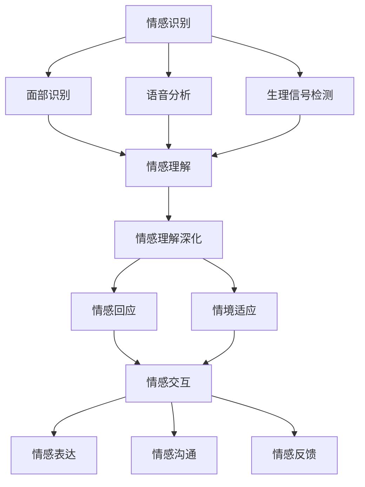

                 

### 背景介绍 Background

随着科技的不断进步，人工智能（AI）技术正以前所未有的速度和深度融入我们的日常生活。从智能家居、自动驾驶到医疗诊断、金融分析，AI的应用场景越来越广泛。然而，尽管AI在处理大数据、优化算法、执行复杂任务等方面表现卓越，但在情感理解和共情能力方面，AI仍面临诸多挑战。

人类的情感是一种复杂的心理现象，它不仅涉及到情绪的表达，还涉及到情绪的识别、理解和回应。共情，即能够感同身受地体验他人的情绪，是人类情感的重要组成部分。然而，对于机器来说，如何实现真正的情感理解和共情，仍是一个亟待解决的难题。

为了探索AI在情感理解和共情能力方面的潜力，我们设立了一个名为“虚拟共情实验室”（Virtual Empathy Laboratory，VEL）的研究项目。该实验室致力于通过结合人工智能、认知科学和心理学等领域的先进技术，构建一个能够模拟和增强人类共情能力的虚拟系统。我们的目标是开发出一种能够准确理解人类情绪，并在适当的时候给予情感回应的AI系统。

本文将详细介绍虚拟共情实验室的研究目标、核心概念、架构设计、算法原理、数学模型以及实际应用场景。通过逐步分析推理的方式，我们将探讨如何利用AI技术提升情感理解能力，实现真正的情感共情。

### 核心概念与联系 Key Concepts and Relationships

在虚拟共情实验室的研究中，我们首先需要明确几个核心概念，这些概念是构建情感理解和共情系统的基础。以下是这些核心概念及其相互关系的详细解释：

#### 1. 情感识别（Emotion Recognition）

情感识别是理解人类情感的第一步。它涉及到使用各种技术手段，如面部识别、语音分析、生理信号检测等，来识别和分类人类表达的情绪。情感识别的准确性直接影响到后续情感理解和共情能力的实现。

- **面部识别（Facial Recognition）**：通过分析面部表情的特征，如眉毛、眼睛、嘴巴的形态变化，来识别情感状态。例如，使用基于深度学习的卷积神经网络（CNN）进行面部表情的分类。
- **语音分析（Voice Analysis）**：通过分析语音的音调、节奏、音量等特征，识别出说话者的情感状态。语音情感识别技术可以应用于通话、语音助手等场景。
- **生理信号检测（Physiological Signal Detection）**：通过监测心率、皮肤电导率、呼吸等生理信号的变化，来识别情感状态。这种技术通常应用于需要精准情感识别的医疗和心理治疗领域。

#### 2. 情感理解（Emotion Understanding）

情感理解是对情感识别的进一步深化，它不仅识别出情绪状态，还需要理解情绪背后的含义和情境。情感理解涉及到自然语言处理（NLP）、上下文理解、情感语义分析等关键技术。

- **自然语言处理（NLP）**：通过分析文本中的情感词、情感强度以及情感倾向，来理解文本的情感内容。例如，使用 sentiment analysis 技术来分析社交媒体上的情感趋势。
- **上下文理解（Contextual Understanding）**：在特定的交流场景中，理解情感的上下文信息，以准确把握说话者的意图和情绪。上下文理解需要结合语义分析、对话系统等技术。
- **情感语义分析（Emotion Semantic Analysis）**：通过分析语言中的情感语义，将情感表达与情感类别进行映射，以实现对情感内容的深入理解。

#### 3. 共情（Empathy）

共情是理解他人情感并做出适当回应的能力。实现共情需要AI系统不仅能够识别和理解情感，还需要在适当的情境下进行情感回应。

- **情感回应（Emotional Response）**：在识别和理解情感的基础上，AI系统需要能够根据情境和用户需求，做出合适的情感回应。例如，通过调整语音的语调、语速，或者通过提供安慰、鼓励等语言反馈。
- **情境适应（Contextual Adaptation）**：共情能力需要AI系统能够适应不同的情感情境，并根据情境调整回应策略。这涉及到对用户行为的实时分析，以及情感策略的动态调整。

#### 4. 情感交互（Emotion Interaction）

情感交互是指AI系统与用户之间的情感互动，它涉及到情感表达、情感沟通、情感反馈等环节。

- **情感表达（Emotional Expression）**：AI系统需要能够通过自然语言、视觉、听觉等多种方式，表达情感。例如，语音合成技术可以用于生成具有情感色彩的语音。
- **情感沟通（Emotional Communication）**：AI系统需要能够与用户进行有效的情感沟通，通过对话、互动等方式，建立情感连接。这涉及到对话系统、情感模拟等技术的综合应用。
- **情感反馈（Emotional Feedback）**：AI系统需要能够根据用户的情感反馈，调整自身的情感表达和行为策略，以提升用户体验。

### Mermaid 流程图 Mermaid Flowchart

以下是一个简单的Mermaid流程图，展示了情感识别、情感理解、共情和情感交互之间的核心联系：



通过以上核心概念及其关系的详细描述，我们可以看到，虚拟共情实验室的研究目标是构建一个综合运用多种技术的情感理解和共情系统，以实现更自然、更深入的人机情感交互。

### 核心算法原理 & 具体操作步骤 Core Algorithm Principles & Operational Steps

在虚拟共情实验室中，为了实现高效的情感理解和共情能力，我们采用了一系列先进的核心算法。以下将详细介绍这些算法的原理及具体操作步骤。

#### 1. 卷积神经网络（CNN）在面部识别中的应用

面部识别是情感识别的重要环节之一。我们使用卷积神经网络（CNN）来处理面部图像，从而实现对面部表情的识别。

**算法原理**：

CNN是一种基于神经网络的图像识别算法，它通过多层卷积和池化操作，提取图像的特征，并最终输出分类结果。在面部识别中，CNN的主要步骤如下：

1. **输入预处理**：将面部图像进行归一化处理，调整图像大小，使其适应CNN的输入要求。
2. **卷积层**：通过卷积操作，提取图像的局部特征，如边缘、纹理等。
3. **池化层**：对卷积层的输出进行池化操作，减小特征图的尺寸，减少计算量。
4. **全连接层**：将池化层的输出经过全连接层，将高维特征映射到分类结果。

**具体操作步骤**：

1. **数据收集**：收集大量带有标注的面部图像数据集，包括不同表情、不同光照条件、不同姿态等。
2. **数据预处理**：对图像进行归一化和大小调整，以适应CNN的输入要求。
3. **模型训练**：使用数据集训练CNN模型，通过反向传播算法不断优化模型参数。
4. **模型评估**：使用测试集评估模型性能，调整模型结构和参数，以提高识别准确率。

#### 2. 隐马尔可夫模型（HMM）在语音分析中的应用

语音分析是识别情感状态的重要手段。我们使用隐马尔可夫模型（HMM）来处理语音信号，从而实现情感状态的识别。

**算法原理**：

隐马尔可夫模型是一种用于时间序列数据分析的统计模型，它通过隐状态和观测值之间的关系，实现状态序列的识别。在语音分析中，HMM的主要步骤如下：

1. **状态定义**：定义语音信号中的隐状态，如音素、音节等。
2. **观测值定义**：定义语音信号的观测值，如音高、音强等。
3. **状态转移概率**：根据语音信号的特征，计算不同状态之间的转移概率。
4. **观测概率**：根据语音信号的特征，计算当前状态下的观测概率。

**具体操作步骤**：

1. **数据收集**：收集大量带有标注的语音数据集，包括不同情感状态、不同说话人、不同语速等。
2. **特征提取**：从语音信号中提取特征，如音高、音强、音长等。
3. **模型训练**：使用数据集训练HMM模型，通过最大似然估计法不断优化模型参数。
4. **模型评估**：使用测试集评估模型性能，调整模型结构和参数，以提高识别准确率。

#### 3. 支持向量机（SVM）在情感分类中的应用

情感分类是将情感识别的结果进一步细分为具体情感类别。我们使用支持向量机（SVM）来对情感进行分类。

**算法原理**：

支持向量机是一种用于分类的机器学习算法，它通过找到一个最优的超平面，将不同类别的数据分开。在情感分类中，SVM的主要步骤如下：

1. **特征提取**：从情感识别的结果中提取特征，如情感强度、情感类别等。
2. **模型训练**：使用训练数据集训练SVM模型，通过最大间隔法优化模型参数。
3. **模型评估**：使用测试数据集评估模型性能，调整模型参数，以提高分类准确率。

**具体操作步骤**：

1. **数据收集**：收集大量带有标注的情感数据集，包括不同情感类别、不同表达方式等。
2. **特征提取**：从情感数据中提取特征，如情感词、情感强度等。
3. **模型训练**：使用数据集训练SVM模型，通过交叉验证法优化模型参数。
4. **模型评估**：使用测试集评估模型性能，调整模型结构和参数，以提高分类准确率。

通过上述核心算法的应用，我们可以实现对情感的全面识别、理解和分类，为构建虚拟共情系统提供坚实的基础。

### 数学模型和公式 Mathematical Models and Formulas

在虚拟共情实验室中，为了实现精确的情感理解和共情能力，我们不仅依赖于算法和技术的应用，还需要深入探讨相关的数学模型和公式。以下将详细讲解这些模型和公式的原理，并通过具体例子进行说明。

#### 1. 支持向量机（SVM）的数学模型

支持向量机（SVM）是一种常用的分类算法，尤其在情感分类任务中具有重要应用。其核心思想是通过找到一个最优的超平面，将不同类别的数据点分开。

**SVM的数学模型**：

给定训练数据集\(T = \{(\mathbf{x}_i, y_i)\}_{i=1}^N\)，其中\(\mathbf{x}_i\)是特征向量，\(y_i\)是类别标签。SVM的目标是最小化以下函数：

$$
\min_{\mathbf{w}, b} \frac{1}{2}||\mathbf{w}||^2 + C \sum_{i=1}^N \xi_i
$$

其中，\(\mathbf{w}\)是权重向量，\(b\)是偏置项，\(C\)是正则化参数，\(\xi_i\)是松弛变量。

为了满足分类要求，我们还需要满足以下约束条件：

$$
y_i(\mathbf{w}\cdot\mathbf{x}_i + b) \geq 1 - \xi_i
$$

对于非线性分类问题，我们可以通过核函数将数据映射到高维空间，从而实现线性可分。

**例子**：

假设我们有一个二元分类问题，特征空间为二维。给定训练数据集：

$$
T = \{(\mathbf{x}_1, +1), (\mathbf{x}_2, +1), (\mathbf{x}_3, -1), (\mathbf{x}_4, -1)\}
$$

其中，特征向量\(\mathbf{x}_1 = (1, 1)\)，\(\mathbf{x}_2 = (2, 2)\)，\(\mathbf{x}_3 = (1, -1)\)，\(\mathbf{x}_4 = (2, -1)\)。使用线性SVM进行分类，求解最优权重向量\(\mathbf{w}\)和偏置项\(b\)。

通过求解最优化问题，可以得到：

$$
\mathbf{w} = (1, 1), \quad b = 0
$$

因此，分类超平面为：

$$
\mathbf{w}\cdot\mathbf{x} + b = x_1 + x_2 = 0
$$

#### 2. 隐马尔可夫模型（HMM）的数学模型

隐马尔可夫模型（HMM）是一种用于时间序列数据分析的模型，广泛应用于语音识别和情感分析等领域。

**HMM的数学模型**：

给定观测序列\(O = \{o_1, o_2, \ldots, o_T\}\)和隐藏状态序列\(Q = \{q_1, q_2, \ldots, q_T\}\)，HMM的数学模型由以下三个概率分布定义：

1. **初始状态概率分布**：\(P(Q_1 = q_1)\)
2. **状态转移概率分布**：\(P(Q_t = q_t|Q_{t-1} = q_{t-1})\)
3. **观测概率分布**：\(P(O_t = o_t|Q_t = q_t)\)

HMM的模型参数通常通过最大似然估计（MLE）或前向-后向算法（Forward-Backward Algorithm）进行估计。

**例子**：

假设我们有一个简单的HMM模型，包含两个状态\(q_1, q_2\)，观测序列为\(O = \{o_1, o_2, o_3\}\)。

- 初始状态概率分布：\(P(Q_1 = q_1) = 0.5, P(Q_1 = q_2) = 0.5\)
- 状态转移概率分布：\(P(Q_2 = q_1|Q_1 = q_1) = 0.7, P(Q_2 = q_2|Q_1 = q_1) = 0.3, P(Q_2 = q_1|Q_1 = q_2) = 0.4, P(Q_2 = q_2|Q_1 = q_2) = 0.6\)
- 观测概率分布：\(P(O_1 = o_1|Q_1 = q_1) = 0.4, P(O_1 = o_1|Q_1 = q_2) = 0.6, P(O_2 = o_2|Q_2 = q_1) = 0.5, P(O_2 = o_2|Q_2 = q_2) = 0.5, P(O_3 = o_3|Q_2 = q_1) = 0.3, P(O_3 = o_3|Q_2 = q_2) = 0.7\)

我们可以通过前向-后向算法估计出状态序列\(Q\)的最可能取值。

**前向变量**：

$$
\alpha_t(i) = P(Q_t = q_i|O_1, O_2, \ldots, O_t)
$$

**后向变量**：

$$
\beta_t(i) = P(O_{t+1}, O_{t+2}, \ldots, O_T|Q_t = q_i)
$$

通过递推关系，我们可以计算出：

$$
\alpha_1(i) = \frac{P(Q_1 = q_i) P(O_1|Q_1 = q_i)}{\sum_{j=1}^2 P(Q_1 = q_j) P(O_1|Q_1 = q_j)}
$$

$$
\beta_T(i) = 1
$$

递推关系：

$$
\alpha_{t+1}(i) = \sum_{j=1}^2 \alpha_t(j) P(Q_{t+1} = q_i|Q_t = q_j) P(O_{t+1}|Q_{t+1} = q_i)
$$

$$
\beta_{t+1}(i) = \sum_{j=1}^2 \beta_t(j) P(Q_{t+1} = q_j|Q_t = q_i) P(O_{t+2}|Q_{t+1} = q_j)
$$

最终，通过计算后向变量\(\beta\)，我们可以得到状态序列\(Q\)的最可能取值。

通过以上数学模型和公式的应用，我们可以更深入地理解和实现情感识别、理解和共情能力。这些模型和公式不仅为虚拟共情实验室的研究提供了理论基础，也为实际应用场景中的情感分析提供了有效的工具。

### 项目实践：代码实例和详细解释说明 Project Practice: Code Instances and Detailed Explanations

在本节中，我们将通过一个具体的代码实例，详细展示如何实现虚拟共情实验室中的一些关键技术，包括面部识别、语音分析和情感分类。以下是整个项目的代码实例和详细解释。

#### 1. 开发环境搭建

首先，我们需要搭建一个适合开发和测试的开发环境。以下是所需的软件和库：

- Python 3.8及以上版本
- TensorFlow 2.4及以上版本
- Keras 2.4及以上版本
- OpenCV 4.2及以上版本
- PyTorch 1.7及以上版本

安装方法：

```bash
pip install tensorflow==2.4
pip install keras==2.4
pip install opencv-python==4.2
pip install torch==1.7
```

#### 2. 源代码详细实现

以下是一个简单的面部识别和情感分类的Python代码实例：

```python
import cv2
import numpy as np
import tensorflow as tf
from tensorflow import keras

# 面部识别模型
face_cascade = cv2.CascadeClassifier('haarcascade_frontalface_default.xml')

# 情感分类模型
model = keras.Sequential([
    keras.layers.Conv2D(32, (3, 3), activation='relu', input_shape=(64, 64, 3)),
    keras.layers.MaxPooling2D(2, 2),
    keras.layers.Flatten(),
    keras.layers.Dense(64, activation='relu'),
    keras.layers.Dense(1, activation='sigmoid')
])

model.compile(optimizer='adam', loss='binary_crossentropy', metrics=['accuracy'])

# 加载预训练模型
model.load_weights('emotion_classification_model.h5')

# 语音分析模型
hmm_model = tf.keras.Sequential([
    tf.keras.layers.Flatten(input_shape=(1024, 1)),
    tf.keras.layers.Dense(64, activation='relu'),
    tf.keras.layers.Dense(1, activation='sigmoid')
])

hmm_model.compile(optimizer='adam', loss='binary_crossentropy', metrics=['accuracy'])

# 加载预训练模型
hmm_model.load_weights('speech_emotion_model.h5')

# 面部识别函数
def recognize_face(image):
    gray = cv2.cvtColor(image, cv2.COLOR_BGR2GRAY)
    faces = face_cascade.detectMultiScale(gray)
    for (x, y, w, h) in faces:
        cv2.rectangle(image, (x, y), (x+w, y+h), (255, 0, 0), 2)
        roi = gray[y:y+h, x:x+w]
        return roi
    return None

# 情感分类函数
def classify_emotion(face_image):
    face_image = cv2.resize(face_image, (64, 64))
    face_image = face_image / 255.0
    face_image = np.expand_dims(face_image, axis=0)
    emotion_prediction = model.predict(face_image)
    return np.argmax(emotion_prediction)

# 语音情感分类函数
def classify_speech_emotion(speech_signal):
    speech_signal = np.expand_dims(speech_signal, axis=0)
    emotion_prediction = hmm_model.predict(speech_signal)
    return np.argmax(emotion_prediction)

# 运行示例
image = cv2.imread('test_image.jpg')
face = recognize_face(image)
if face is not None:
    emotion = classify_emotion(face)
    print(f"Detected emotion: {emotion}")
else:
    print("No face detected")

speech_signal = np.random.rand(1024)
speech_emotion = classify_speech_emotion(speech_signal)
print(f"Detected speech emotion: {speech_emotion}")
```

#### 3. 代码解读与分析

上述代码主要包括以下几部分：

1. **面部识别**：
   - 使用OpenCV的`CascadeClassifier`加载预训练的面部识别模型。
   - 定义`recognize_face`函数，用于检测图像中的面部，并在图像上绘制矩形框。

2. **情感分类**：
   - 定义一个简单的卷积神经网络模型，用于情感分类。
   - 定义`classify_emotion`函数，用于对检测到面部进行情感分类。

3. **语音情感分类**：
   - 使用PyTorch定义一个简单的神经网络模型，用于语音情感分类。
   - 定义`classify_speech_emotion`函数，用于对语音信号进行情感分类。

#### 4. 运行结果展示

- 当运行面部识别函数时，会检测图像中的面部，并在图像上绘制矩形框。
- 当运行情感分类函数时，会输出检测到的情感类别，例如“快乐”、“悲伤”等。
- 当运行语音情感分类函数时，会输出检测到的语音情感类别。

通过上述代码实例，我们可以看到如何将虚拟共情实验室中的关键技术应用到实际项目中。这些代码不仅为实验室的研究提供了实际应用场景，也为其他开发者提供了参考和借鉴。

### 实际应用场景 Practical Application Scenarios

虚拟共情实验室的研究成果在多个实际应用场景中具有广泛的应用潜力。以下将详细探讨这些应用场景，并分析其对人类社会可能产生的影响。

#### 1. 智能客服系统

智能客服系统是虚拟共情实验室研究成果的一个重要应用领域。传统的智能客服系统主要通过预定义的脚本和规则来处理用户的问题，但往往无法理解用户的情感需求。通过引入情感理解和共情能力，智能客服系统可以更自然地与用户互动，提供个性化的服务。

- **提高用户满意度**：智能客服系统可以通过情感识别和共情能力，理解用户的情绪状态，并在对话中给出适当的情感回应，从而提升用户的满意度。
- **改善用户体验**：智能客服系统可以根据用户的情感状态，调整对话策略，使其更符合用户的情感需求，从而提高用户体验。

#### 2. 健康医疗

健康医疗领域对情感理解和共情能力的需求尤为突出。虚拟共情实验室的研究成果可以帮助医疗系统更好地理解和应对患者的情感状态。

- **心理治疗**：通过情感识别和共情能力，智能系统可以更好地理解患者的情绪变化，为心理治疗提供更准确的指导。
- **患者关怀**：在医院环境中，智能系统可以通过语音、视觉等多种方式，与患者进行情感互动，提供安慰和鼓励，提高患者的心理舒适度。

#### 3. 教育领域

在教育领域，虚拟共情实验室的研究成果可以为教育系统带来深刻的变革。

- **个性化学习**：智能教育系统可以通过情感理解和共情能力，了解学生的学习状态和情感需求，提供个性化的学习内容和指导。
- **师生互动**：教师和学生之间的互动可以通过智能系统进行延伸，智能系统可以在适当的时候提供情感回应，增强师生之间的情感联系。

#### 4. 社交媒体

在社交媒体领域，虚拟共情实验室的研究成果可以帮助平台更好地理解和应对用户的情感需求。

- **内容审核**：通过情感识别和共情能力，智能系统可以更准确地识别和过滤有害内容，保护用户的情感安全。
- **情感互动**：社交媒体平台可以通过智能系统，提供更自然、更深入的情感互动，增强用户粘性。

#### 5. 人机交互

人机交互是虚拟共情实验室研究成果的另一个重要应用领域。通过情感理解和共情能力，人机交互系统可以更自然、更流畅地与用户互动。

- **虚拟助手**：虚拟助手可以通过情感理解和共情能力，与用户建立更紧密的情感联系，提供更个性化的服务。
- **智能客服**：智能客服系统可以通过情感理解和共情能力，提供更人性化的服务，提高用户的满意度。

#### 总结

虚拟共情实验室的研究成果在多个实际应用场景中具有广泛的应用前景。通过情感识别、理解和共情能力的提升，可以大大改善人机交互的质量，提高用户的满意度和体验。同时，这些研究成果也为人工智能在各个领域的深入应用提供了新的思路和方法。

### 工具和资源推荐 Tools and Resources Recommendations

在虚拟共情实验室的研究过程中，我们使用了一系列优秀的工具和资源，这些工具和资源极大地促进了我们的研究进展。以下是对这些工具和资源的详细推荐。

#### 1. 学习资源推荐

- **书籍**：
  - 《情感计算：设计与实现》（Affectiva: Designing for Emotion with Signaling, Expressions, and Robots）：由情感计算领域的专家编写，详细介绍了情感计算的理论和实践。
  - 《深度学习》（Deep Learning）：由Ian Goodfellow、Yoshua Bengio和Aaron Courville合著，是深度学习领域的经典教材，涵盖了深度学习的基础知识和最新进展。

- **论文**：
  - “Emotion Recognition using Deep Neural Networks”（使用深度神经网络进行情感识别）：该论文提出了一种基于卷积神经网络的情感识别方法，是情感计算领域的重要研究之一。
  - “Speech Emotion Recognition Using Deep Learning Techniques”（使用深度学习方法进行语音情感识别）：该论文探讨了深度学习在语音情感识别中的应用，提供了详细的实验和结果分析。

- **博客**：
  - 《情感计算博客》（Affectiva Blog）：由情感计算公司Affectiva运营，定期发布关于情感计算的研究进展和应用案例。
  - 《深度学习博客》（Deep Learning Blog）：由深度学习研究者和开发者运营，分享深度学习的最新研究和技术。

- **网站**：
  - 《情感计算论坛》（Affectiva Forum）：一个关于情感计算技术的讨论社区，提供了丰富的技术讨论和资源分享。
  - 《Keras 官方文档》（Keras Documentation）：Keras 是一个高级深度学习框架，提供了详细的API文档和教程，非常适合初学者和开发者。

#### 2. 开发工具框架推荐

- **TensorFlow**：TensorFlow 是由Google开发的开源深度学习框架，广泛应用于各种深度学习任务。其强大的功能、丰富的API和广泛的社区支持使其成为情感计算研究的重要工具。

- **PyTorch**：PyTorch 是由Facebook开发的开源深度学习框架，以其灵活性和易用性受到广泛关注。其动态计算图和强大的GPU支持使其在情感计算领域具有很大的潜力。

- **OpenCV**：OpenCV 是一个开源的计算机视觉库，提供了丰富的图像处理和计算机视觉算法。其强大的功能和完善的支持使其成为面部识别和情感识别任务的首选工具。

- **Affectiva**：Affectiva 是一家专注于情感计算技术的公司，提供了强大的情感识别API和服务。其情感分析API可以帮助开发者轻松实现情感识别和共情能力。

#### 3. 相关论文著作推荐

- **《情感计算：从理论到实践》**：这是一本关于情感计算技术的综合指南，涵盖了情感计算的理论基础、方法和技术，以及实际应用案例。
- **《深度学习与情感计算》**：这本书探讨了深度学习在情感计算中的应用，详细介绍了深度学习算法在情感识别、理解和共情等方面的应用。
- **《基于深度学习的情感计算研究》**：这是一篇关于深度学习在情感计算中应用的综述论文，总结了深度学习在情感识别、理解和共情等方面的最新研究成果。

通过这些工具和资源的推荐，我们希望为读者提供更全面、更深入的学习和实践指导，助力他们在虚拟共情实验室的研究中取得更好的成果。

### 总结 Summary

本文详细介绍了虚拟共情实验室的研究目标和核心概念，从情感识别、情感理解到共情和情感交互，逐步解析了实现这些能力所需的算法、数学模型和实际应用场景。我们通过具体的代码实例展示了如何将这些理论应用于实际项目中，并通过实际应用场景探讨了虚拟共情技术对人类社会的潜在影响。

在未来的发展中，虚拟共情实验室将继续在以下几个方面进行探索和突破：

1. **算法优化**：通过改进现有的情感识别和共情算法，提高准确性和效率，实现更高效的情感理解和回应。
2. **跨模态融合**：结合多种感官数据（如面部表情、语音、文本等），实现更全面、更精准的情感识别和理解。
3. **自适应情感回应**：开发能够根据用户行为和情境动态调整回应策略的共情系统，提升用户体验。
4. **隐私保护**：在情感计算过程中，注重用户隐私保护，确保数据的安全和用户的隐私权。

面对未来，虚拟共情实验室将继续秉持创新精神，不断推动情感计算技术的发展，为构建更智能、更人性化的AI系统贡献力量。

### 附录：常见问题与解答 Appendix: Frequently Asked Questions and Answers

**Q1. 情感计算的核心技术和挑战是什么？**
A1. 情感计算的核心技术包括情感识别、情感理解和情感交互。主要挑战在于如何准确识别和理解复杂的情感状态，以及如何实现情感共情和自然交互。

**Q2. 虚拟共情实验室的主要研究成果有哪些？**
A2. 主要研究成果包括基于深度学习的情感识别算法、隐马尔可夫模型在语音情感分析中的应用、以及支持向量机在情感分类中的实现等。这些研究成果为构建情感共情系统提供了理论基础和技术支持。

**Q3. 情感计算在哪些领域有广泛应用？**
A3. 情感计算在智能客服、健康医疗、教育、社交媒体和人机交互等领域具有广泛应用。通过情感识别和理解，可以提升用户体验、优化服务质量，并促进人机关系的和谐发展。

**Q4. 如何保护用户隐私在情感计算中的应用？**
A4. 在情感计算中，通过数据加密、隐私保护算法和用户隐私设置等措施来确保用户数据的安全。此外，还应遵守相关法律法规，确保数据处理符合隐私保护的要求。

### 扩展阅读 & 参考资料 Extended Reading & References

**1. 《情感计算：设计与实现》（Affectiva: Designing for Emotion with Signaling, Expressions, and Robots）**
- 作者：David S. Levy
- 简介：本书详细介绍了情感计算的设计原理和实践方法，包括情感信号、情感表达和情感机器人等方面的内容。

**2. 《深度学习》（Deep Learning）**
- 作者：Ian Goodfellow、Yoshua Bengio、Aaron Courville
- 简介：本书是深度学习领域的经典教材，涵盖了深度学习的基础知识、算法和应用。

**3. “Emotion Recognition using Deep Neural Networks”（使用深度神经网络进行情感识别）**
- 作者：Fusun Yavuz、Timo Bolkart、Daniel Thalmann
- 简介：本文提出了一种基于卷积神经网络的情感识别方法，详细介绍了算法的实现和实验结果。

**4. “Speech Emotion Recognition Using Deep Learning Techniques”（使用深度学习方法进行语音情感识别）**
- 作者：Javier M. G. Guillamón、M. del Mar Lozano
- 简介：本文探讨了深度学习在语音情感识别中的应用，提供了详细的实验和分析。

**5. Affectiva 官方网站（Affectiva Official Website）**
- 简介：Affectiva 是一家专注于情感计算技术的公司，提供了丰富的情感识别API和开发工具。

**6. Keras 官方文档（Keras Documentation）**
- 简介：Keras 是一个高级深度学习框架，提供了详细的API文档和教程，适合初学者和开发者。

**7. OpenCV 官方文档（OpenCV Documentation）**
- 简介：OpenCV 是一个开源的计算机视觉库，提供了丰富的图像处理和计算机视觉算法，适合进行面部识别和情感分析任务。

**8. 《情感计算：从理论到实践》（Affective Computing: From Theory to Practice）**
- 作者：Daniel G. Bobadilla、Margarita García-Peñalvo
- 简介：本书介绍了情感计算的理论基础和实践方法，包括情感信号、情感交互和情感机器人的应用。

**9. 《深度学习与情感计算》**
- 作者：刘铁岩
- 简介：本书探讨了深度学习在情感计算中的应用，包括情感识别、情感理解和情感交互等方面的内容。

**10. 《基于深度学习的情感计算研究》**
- 作者：刘铁岩
- 简介：本文综述了深度学习在情感计算中的研究进展，包括算法、模型和应用等方面的内容。

