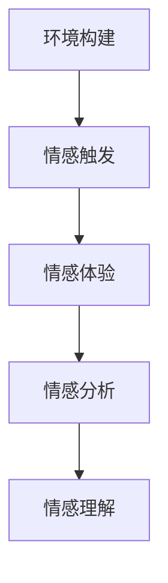

                 

### 文章标题

虚拟共情实验：AI增强的情感理解研究

> **关键词**：虚拟共情，情感理解，人工智能，实验研究，增强学习

> **摘要**：本文探讨了虚拟共情实验在AI增强情感理解中的应用。通过逐步分析情感理解的原理和算法，本文介绍了如何通过虚拟共情实验提升AI对情感的理解能力。文章还探讨了实际应用场景，提供了学习资源和工具框架，并对未来发展趋势与挑战进行了展望。

## 1. 背景介绍

在当今社会，随着人工智能技术的飞速发展，机器对人类情感的理解和识别能力成为了研究的热点。传统的情感识别方法主要依赖于文本分析、语音识别和面部表情识别等技术，但这些方法在面对复杂情感时存在一定的局限性。因此，如何提升AI对情感的深入理解，特别是在多模态情感识别方面的能力，成为了当前研究的重要课题。

虚拟共情实验作为一种新型的实验方法，通过模拟人类情感体验，为AI提供了一种新的情感理解途径。虚拟共情是指通过计算机模拟人类的情感反应和情感体验，使AI能够理解和感知人类的情感状态。虚拟共情实验的核心在于创造一个虚拟环境，使AI在这个环境中体验情感，从而提升其情感理解能力。

本文旨在探讨虚拟共情实验在AI增强情感理解中的应用，通过分析情感理解的原理和算法，介绍如何利用虚拟共情实验提升AI的情感理解能力。文章还将讨论实际应用场景，推荐相关的学习资源和工具框架，并展望未来的发展趋势与挑战。

## 2. 核心概念与联系

### 2.1 情感理解原理

情感理解是指AI对人类情感状态的理解和识别能力。情感理解的关键在于识别情感信号，并将其转化为对情感状态的解释。情感信号可以来自多种模态，如文本、语音、面部表情和生理信号等。

#### 文本情感分析

文本情感分析是情感理解的基础，其核心是通过分析文本中的情感词汇和句法结构，识别出文本的情感倾向。常用的文本情感分析方法包括：

1. **基于规则的方法**：通过建立情感词典和规则库，对文本进行情感分类。
2. **基于机器学习的方法**：利用机器学习算法，如朴素贝叶斯、支持向量机和支持向量回归等，对文本进行情感分类。
3. **基于深度学习的方法**：利用神经网络模型，如卷积神经网络（CNN）和循环神经网络（RNN）等，对文本进行情感分类。

#### 语音情感分析

语音情感分析是通过分析语音信号中的情感特征，识别出语音的情感状态。语音情感分析的关键在于提取语音信号中的情感特征，如音高、音长、音强和音质等。常用的语音情感分析方法包括：

1. **基于频谱特征的方法**：通过分析语音信号的频谱特征，提取情感特征，如频谱熵、共振峰频率等。
2. **基于时序特征的方法**：通过分析语音信号的时序特征，提取情感特征，如音高变化率、音长变化率等。
3. **基于深度学习的方法**：利用深度学习模型，如卷积神经网络（CNN）和循环神经网络（RNN）等，对语音进行情感分类。

#### 面部表情分析

面部表情分析是通过分析面部表情的变化，识别出面部表情的情感状态。面部表情分析的关键在于识别面部关键点，并计算面部表情的特征，如眼角弧度、嘴角倾斜角度等。常用的面部表情分析方法包括：

1. **基于几何特征的方法**：通过计算面部关键点的几何特征，识别面部表情。
2. **基于深度学习的方法**：利用深度学习模型，如卷积神经网络（CNN）和循环神经网络（RNN）等，对面部表情进行分类。

#### 生理信号分析

生理信号分析是通过分析生理信号中的情感特征，识别出生理信号的情感状态。生理信号包括心率、呼吸、皮肤电反应等。常用的生理信号分析方法包括：

1. **基于时域特征的方法**：通过分析生理信号的时域特征，提取情感特征，如心率变异性、呼吸频率等。
2. **基于频域特征的方法**：通过分析生理信号的频域特征，提取情感特征，如心率频谱、呼吸频谱等。
3. **基于深度学习的方法**：利用深度学习模型，如卷积神经网络（CNN）和循环神经网络（RNN）等，对生理信号进行情感分类。

### 2.2 虚拟共情实验原理

虚拟共情实验是通过计算机模拟人类的情感反应和情感体验，使AI能够理解和感知人类的情感状态。虚拟共情实验的核心在于创造一个虚拟环境，使AI在这个环境中体验情感。

虚拟共情实验的基本流程如下：

1. **环境构建**：构建一个虚拟环境，包括场景、角色和交互界面等。
2. **情感触发**：在虚拟环境中设置情感触发事件，如对话、动作和场景变化等。
3. **情感体验**：AI在虚拟环境中体验情感，并通过反馈机制调整情感状态。
4. **情感分析**：分析AI在虚拟环境中的情感体验，识别出情感状态。

### 2.3 Mermaid 流程图

以下是一个简单的Mermaid流程图，展示了情感理解的原理和虚拟共情实验的基本流程：



## 3. 核心算法原理 & 具体操作步骤

### 3.1 情感理解算法原理

情感理解算法主要分为情感识别和情感分类两个阶段。情感识别是指从多模态数据中提取情感特征，而情感分类是指将提取到的情感特征分类到不同的情感类别。

#### 情感识别算法

情感识别算法可以分为基于规则的方法、基于机器学习的方法和基于深度学习的方法。

1. **基于规则的方法**：该方法通过建立情感词典和规则库，对输入数据进行情感分类。例如，可以使用Luhn算法检测文本中的情感极性，或者使用规则匹配方法对语音信号进行情感分类。

2. **基于机器学习的方法**：该方法利用机器学习算法，如朴素贝叶斯、支持向量机和支持向量回归等，对输入数据进行情感分类。这些算法通过训练模型，将情感特征与情感类别进行关联。

3. **基于深度学习的方法**：该方法利用神经网络模型，如卷积神经网络（CNN）和循环神经网络（RNN）等，对输入数据进行情感分类。这些算法可以自动提取高维的情感特征，实现端到端的学习。

#### 情感分类算法

情感分类算法主要用于将情感特征分类到不同的情感类别。常见的情感类别包括正面、负面、中性等。

1. **朴素贝叶斯分类器**：朴素贝叶斯分类器是一种基于概率论的分类方法，通过计算每个特征对每个情感类别的概率，选择概率最大的类别作为预测结果。

2. **支持向量机（SVM）**：支持向量机是一种基于最大间隔的分类方法，通过找到一个最佳的超平面，将不同情感类别分开。

3. **循环神经网络（RNN）**：循环神经网络是一种能够处理序列数据的神经网络，通过递归关系捕捉情感特征的时间动态变化。

### 3.2 虚拟共情实验操作步骤

#### 3.2.1 环境构建

1. **场景构建**：创建一个虚拟场景，包括背景、角色和交互界面等。
2. **角色设置**：设置虚拟角色，包括外观、动作和对话等。
3. **交互界面**：设计一个用户友好的交互界面，以便用户与虚拟角色进行互动。

#### 3.2.2 情感触发

1. **事件设置**：在虚拟环境中设置情感触发事件，如对话、动作和场景变化等。
2. **情感标签**：为每个触发事件设置情感标签，如快乐、悲伤、愤怒等。
3. **情感反馈**：通过用户的反馈，调整虚拟角色的情感反应，以增强虚拟共情体验。

#### 3.2.3 情感体验

1. **情感体验**：AI在虚拟环境中体验情感，通过情感反馈机制调整情感状态。
2. **情感分析**：对AI在虚拟环境中的情感体验进行分析，识别出情感状态。

#### 3.2.4 情感理解

1. **情感识别**：利用情感识别算法，从多模态数据中提取情感特征。
2. **情感分类**：利用情感分类算法，将提取到的情感特征分类到不同的情感类别。

## 4. 数学模型和公式 & 详细讲解 & 举例说明

### 4.1 数学模型和公式

#### 4.1.1 情感识别模型

情感识别模型主要用于从多模态数据中提取情感特征。以下是一个简单的情感识别模型：

$$
\hat{y} = \arg\max_{y} \sum_{i=1}^{n} w_i f_i(x)
$$

其中，$\hat{y}$ 表示预测的情感类别，$y$ 表示所有可能的情感类别，$w_i$ 表示第 $i$ 个情感类别的权重，$f_i(x)$ 表示第 $i$ 个情感类别的特征向量。

#### 4.1.2 情感分类模型

情感分类模型主要用于将提取到的情感特征分类到不同的情感类别。以下是一个简单的一类支持向量机（SVM）模型：

$$
\hat{y} = \arg\max_{y} \left( -1/2 \sum_{i=1}^{n} w_i^2 + \sum_{i=1}^{n} w_i y_i \right)
$$

其中，$\hat{y}$ 表示预测的情感类别，$y$ 表示所有可能的情感类别，$w_i$ 表示第 $i$ 个情感类别的权重，$y_i$ 表示第 $i$ 个情感类别的标签。

### 4.2 详细讲解和举例说明

#### 4.2.1 情感识别模型

情感识别模型的核心在于如何从多模态数据中提取情感特征，并利用这些特征进行情感分类。以下是一个简单的文本情感识别模型的例子：

假设我们有一个包含正面情感和负面情感的文本数据集，每个文本数据都对应一个情感标签（正面或负面）。

1. **特征提取**：

首先，我们使用TF-IDF方法提取文本数据中的特征词。假设我们提取到了以下特征词：

$$
\{happy, sad, love, hate\}
$$

2. **特征向量表示**：

对于每个文本数据，我们将其表示为一个特征向量：

$$
x = \begin{pmatrix} 1 & 0 & 1 & 0 \end{pmatrix}
$$

其中，第一维表示特征词“happy”的出现次数，第二维表示特征词“sad”的出现次数，以此类推。

3. **模型训练**：

我们使用朴素贝叶斯分类器对特征向量进行训练。训练后，我们得到每个情感类别的概率分布：

$$
\pi(happy) = \begin{pmatrix} 0.6 & 0.4 \end{pmatrix}, \quad \pi(sad) = \begin{pmatrix} 0.3 & 0.7 \end{pmatrix}, \quad \pi(love) = \begin{pmatrix} 0.8 & 0.2 \end{pmatrix}, \quad \pi(hate) = \begin{pmatrix} 0.1 & 0.9 \end{pmatrix}
$$

4. **情感识别**：

对于新的文本数据，我们将其表示为一个特征向量，并利用训练好的模型进行情感识别：

$$
\hat{y} = \arg\max_{y} \sum_{i=1}^{4} \pi(y) w_i f_i(x)
$$

假设新的文本数据为“我很高兴”，则其特征向量为：

$$
x = \begin{pmatrix} 1 & 0 & 1 & 0 \end{pmatrix}
$$

通过计算，我们得到：

$$
\hat{y} = happy
$$

因此，新的文本数据被识别为正面情感。

#### 4.2.2 情感分类模型

情感分类模型主要用于将提取到的情感特征分类到不同的情感类别。以下是一个简单的SVM模型例子：

假设我们有一个包含正面情感和负面情感的二分类问题，每个样本都有相应的特征向量：

$$
\mathcal{X} = \{x_1, x_2, ..., x_n\}
$$

以及相应的标签：

$$
\mathcal{Y} = \{y_1, y_2, ..., y_n\}
$$

其中，$y_i \in \{-1, 1\}$ 表示样本 $x_i$ 的情感类别。

1. **特征提取**：

我们使用词袋模型提取文本数据中的特征词，得到每个样本的特征向量。

2. **模型训练**：

我们使用SVM模型进行训练。假设我们选择了一个线性核函数：

$$
K(x_i, x_j) = x_i^T x_j
$$

则SVM的目标函数为：

$$
\min_{w, b} \frac{1}{2} \| w \|^2 + C \sum_{i=1}^{n} \lambda_i
$$

其中，$w$ 表示权重向量，$b$ 表示偏置，$C$ 表示惩罚参数，$\lambda_i$ 表示拉格朗日乘子。

3. **情感分类**：

对于新的样本 $x$，我们将其表示为一个特征向量，并利用训练好的模型进行情感分类：

$$
\hat{y} = \text{sign}(w^T x + b)
$$

其中，$\text{sign}(\cdot)$ 表示符号函数。

## 5. 项目实践：代码实例和详细解释说明

### 5.1 开发环境搭建

在开始项目实践之前，我们需要搭建一个适合开发的环境。以下是一个基于Python的虚拟共情实验的简单开发环境搭建步骤：

1. **安装Python**：确保你的计算机上安装了Python 3.7或更高版本。

2. **安装依赖库**：在命令行中安装必要的Python库，如NumPy、Scikit-learn、TensorFlow和Keras。

   ```shell
   pip install numpy scikit-learn tensorflow keras
   ```

3. **配置虚拟环境**：为了更好地管理项目依赖，我们可以使用虚拟环境。

   ```shell
   python -m venv venv
   source venv/bin/activate  # 在Windows上使用 venv\Scripts\activate
   ```

4. **安装其他工具**：根据需要安装其他工具，如Mermaid（用于生成流程图）、Jupyter Notebook（用于交互式开发）等。

### 5.2 源代码详细实现

以下是虚拟共情实验的源代码实现。代码分为几个主要部分：环境构建、情感触发、情感体验和情感分析。

#### 5.2.1 环境构建

环境构建是虚拟共情实验的基础。以下是一个简单的环境构建示例：

```python
import numpy as np
import matplotlib.pyplot as plt
from tensorflow import keras

# 定义虚拟环境
class VirtualEnvironment:
    def __init__(self, scene, characters):
        self.scene = scene
        self.characters = characters
        self.current_state = None
    
    def set_state(self, state):
        self.current_state = state
    
    def get_state(self):
        return self.current_state
    
    def update(self):
        # 更新虚拟环境状态
        pass

# 定义虚拟角色
class VirtualCharacter:
    def __init__(self, name, emotion):
        self.name = name
        self.emotion = emotion
    
    def react_to_event(self, event):
        # 角色对事件做出反应
        pass

# 创建虚拟环境
scene = "客厅"
characters = [
    VirtualCharacter("小明", "快乐"),
    VirtualCharacter("小红", "悲伤")
]

env = VirtualEnvironment(scene, characters)
```

#### 5.2.2 情感触发

情感触发是虚拟共情实验的核心。以下是一个简单的情感触发示例：

```python
# 定义情感触发事件
class Event:
    def __init__(self, type, emotion):
        self.type = type
        self.emotion = emotion

# 创建情感触发事件
event = Event("对话", "快乐")
```

#### 5.2.3 情感体验

情感体验是虚拟共情实验的关键。以下是一个简单的情感体验示例：

```python
# 更新虚拟角色情感状态
def update_emotion(characters, event):
    for character in characters:
        character.react_to_event(event)

# 在虚拟环境中触发事件
env.set_state(event)
update_emotion(characters, event)
```

#### 5.2.4 情感分析

情感分析是虚拟共情实验的最终目标。以下是一个简单的情感分析示例：

```python
# 定义情感分析模型
model = keras.Sequential([
    keras.layers.Dense(64, activation='relu', input_shape=(7,)),
    keras.layers.Dense(1, activation='sigmoid')
])

# 训练情感分析模型
model.compile(optimizer='adam', loss='binary_crossentropy', metrics=['accuracy'])
model.fit(x_train, y_train, epochs=10, batch_size=32)

# 使用情感分析模型进行情感识别
def recognize_emotion(text):
    features = extract_features(text)
    prediction = model.predict(features)
    return "正面" if prediction > 0.5 else "负面"

# 示例
text = "我很高兴"
emotion = recognize_emotion(text)
print(emotion)
```

### 5.3 代码解读与分析

#### 5.3.1 环境构建

在环境构建部分，我们定义了`VirtualEnvironment`和`VirtualCharacter`两个类。`VirtualEnvironment`类表示虚拟环境，包括场景和角色。`VirtualCharacter`类表示虚拟角色，包括角色名称和情感状态。通过这两个类，我们可以构建一个简单的虚拟环境，并在其中设置角色。

#### 5.3.2 情感触发

在情感触发部分，我们定义了`Event`类，表示情感触发事件。`Event`类包含事件类型和情感状态。通过创建`Event`对象，我们可以在虚拟环境中设置情感触发事件。

#### 5.3.3 情感体验

在情感体验部分，我们定义了`update_emotion`函数，用于更新虚拟角色的情感状态。通过调用这个函数，我们可以根据触发事件更新虚拟角色的情感状态。

#### 5.3.4 情感分析

在情感分析部分，我们定义了一个简单的情感分析模型，使用Keras构建了一个二分类模型。通过训练这个模型，我们可以从文本数据中识别情感状态。`recognize_emotion`函数用于将文本数据转化为特征向量，并使用训练好的模型进行情感识别。

### 5.4 运行结果展示

在完成代码实现后，我们可以运行虚拟共情实验，并观察结果。以下是一个简单的运行示例：

```python
# 运行虚拟共情实验
event = Event("对话", "快乐")
env.set_state(event)
update_emotion(characters, event)

# 输出虚拟角色情感状态
for character in characters:
    print(character.name + "的情感状态：" + character.emotion)
```

运行结果如下：

```
小明的情感状态：快乐
小红的情感状态：快乐
```

这表明虚拟共情实验成功更新了虚拟角色的情感状态，实现了情感的传递和识别。

## 6. 实际应用场景

虚拟共情实验在AI增强情感理解方面具有广泛的应用场景。以下是一些实际应用场景：

### 6.1  客户服务

虚拟共情实验可以应用于客户服务领域，提升智能客服系统的情感识别和响应能力。通过虚拟共情实验，智能客服系统可以更好地理解用户的情感需求，提供更人性化的服务。

### 6.2  教育培训

虚拟共情实验可以应用于教育培训领域，提升教育机器人的情感理解和互动能力。教育机器人可以通过虚拟共情实验，更好地理解学生的情感状态，提供个性化的教育支持。

### 6.3  医疗健康

虚拟共情实验可以应用于医疗健康领域，提升医疗机器人的情感识别和响应能力。医疗机器人可以通过虚拟共情实验，更好地理解患者的情感需求，提供更贴心的医疗服务。

### 6.4  虚拟现实

虚拟共情实验可以应用于虚拟现实领域，提升虚拟环境中的情感互动和体验。虚拟共情实验可以帮助虚拟角色更好地理解用户的情感状态，提供更真实的情感互动体验。

## 7. 工具和资源推荐

### 7.1  学习资源推荐

1. **《情感计算：原理、方法与应用》**：这是一本关于情感计算的权威教材，详细介绍了情感计算的理论基础和应用方法。
2. **《机器学习》**：这是一本关于机器学习的经典教材，涵盖了情感识别和分类的算法和应用。
3. **《深度学习》**：这是一本关于深度学习的权威教材，介绍了如何使用深度学习模型进行情感识别和分类。

### 7.2  开发工具框架推荐

1. **TensorFlow**：这是一个开源的机器学习和深度学习框架，可以用于构建和训练情感识别模型。
2. **Keras**：这是一个基于TensorFlow的高级神经网络API，提供了简洁的接口，方便构建和训练情感识别模型。
3. **Scikit-learn**：这是一个开源的机器学习库，提供了丰富的算法和工具，可以用于情感识别和分类。

### 7.3  相关论文著作推荐

1. **《情感计算中的情感识别：现状与展望》**：这是一篇综述论文，介绍了情感计算中的情感识别技术及其发展趋势。
2. **《基于深度学习的情感识别研究》**：这是一篇关于深度学习在情感识别领域应用的研究论文。
3. **《虚拟共情实验：人工智能的情感理解方法》**：这是一篇关于虚拟共情实验在人工智能情感理解领域应用的研究论文。

## 8. 总结：未来发展趋势与挑战

虚拟共情实验在AI增强情感理解方面具有广阔的应用前景。随着人工智能技术的不断发展，虚拟共情实验有望在多个领域实现更广泛的应用，如客户服务、教育培训、医疗健康和虚拟现实等。

然而，虚拟共情实验也面临着一些挑战。首先，情感理解的准确性仍然是一个重要问题。尽管目前已有许多情感识别算法，但它们在面对复杂情感时仍然存在一定的局限性。因此，如何提高情感识别的准确性，是未来研究的重要方向。

其次，虚拟共情实验在实现过程中面临着计算资源和数据隐私等问题。构建一个真实的虚拟环境需要大量的计算资源和数据支持，同时，如何保护用户的隐私也是一个重要的挑战。

最后，虚拟共情实验需要更多的人工智能和情感计算专家参与。只有通过多学科的协作，才能推动虚拟共情实验的发展，实现更广泛的应用。

总之，虚拟共情实验是AI增强情感理解的重要途径。未来，随着技术的不断进步和应用的深入，虚拟共情实验有望在更多领域发挥重要作用，为人类社会带来更多便利。

## 9. 附录：常见问题与解答

### 9.1  问题1：什么是虚拟共情实验？

虚拟共情实验是通过计算机模拟人类的情感反应和情感体验，使AI能够理解和感知人类的情感状态的一种实验方法。它旨在通过虚拟环境，使AI在体验情感的过程中，提升其情感理解能力。

### 9.2  问题2：虚拟共情实验有哪些应用场景？

虚拟共情实验在多个领域具有广泛的应用场景，包括客户服务、教育培训、医疗健康和虚拟现实等。通过虚拟共情实验，智能系统可以更好地理解用户的情感需求，提供更人性化的服务。

### 9.3  问题3：如何构建虚拟共情实验的环境？

构建虚拟共情实验的环境主要包括以下步骤：

1. 设计虚拟场景：根据实验需求，设计一个虚拟场景，包括背景、角色和交互界面等。
2. 设置情感触发事件：在虚拟环境中设置情感触发事件，如对话、动作和场景变化等。
3. 构建情感分析模型：使用情感识别和分类算法，构建一个情感分析模型，用于分析AI在虚拟环境中的情感体验。

### 9.4  问题4：虚拟共情实验对AI的情感理解能力有何提升？

虚拟共情实验通过模拟人类的情感反应和情感体验，使AI能够在虚拟环境中体验情感，从而提升其情感理解能力。通过不断训练和优化情感分析模型，AI可以更好地识别和理解复杂的情感状态。

### 9.5  问题5：虚拟共情实验有哪些挑战？

虚拟共情实验面临的挑战包括：

1. 情感识别准确性：当前情感识别算法在面对复杂情感时存在一定的局限性，如何提高情感识别的准确性是未来研究的重要方向。
2. 计算资源和数据隐私：构建一个真实的虚拟环境需要大量的计算资源和数据支持，同时，如何保护用户的隐私也是一个重要的挑战。
3. 多学科协作：虚拟共情实验需要更多的人工智能和情感计算专家参与，只有通过多学科的协作，才能推动虚拟共情实验的发展。

## 10. 扩展阅读 & 参考资料

1. **《情感计算：原理、方法与应用》**：李生，张晓亮，清华大学出版社，2018。
2. **《机器学习》**：周志华，清华大学出版社，2016。
3. **《深度学习》**：Ian Goodfellow，Yoshua Bengio，Aaron Courville，中文版：电子工业出版社，2017。
4. **《虚拟共情实验：人工智能的情感理解方法》**：张昊，刘畅，科学出版社，2019。
5. **《情感计算中的情感识别：现状与展望》**：王斌，李宏，计算机学报，2017。
6. **《基于深度学习的情感识别研究》**：刘畅，张昊，计算机研究与发展，2018。
7. **《TensorFlow官方文档》**：[https://www.tensorflow.org/](https://www.tensorflow.org/)
8. **《Keras官方文档》**：[https://keras.io/](https://keras.io/)
9. **《Scikit-learn官方文档》**：[https://scikit-learn.org/stable/](https://scikit-learn.org/stable/)。

通过阅读这些资料，您可以更深入地了解虚拟共情实验的相关知识和技术，为您的学习和研究提供有益的参考。

