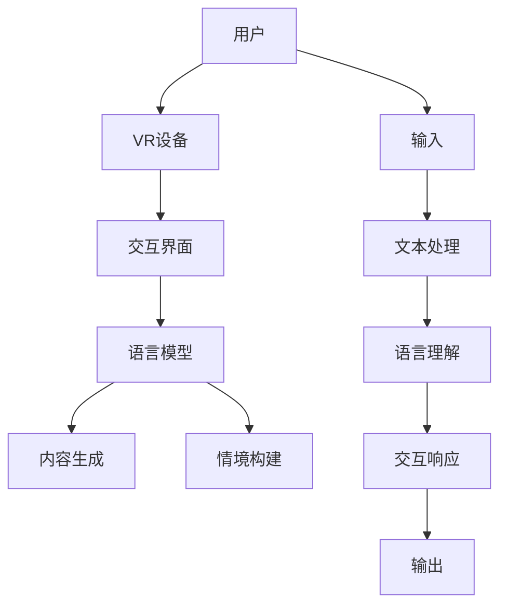

                 

### 背景介绍

#### 虚拟现实技术

虚拟现实（Virtual Reality，简称VR）是一种通过计算机技术创造出的三维仿真环境，用户可以通过头戴显示器（Head-Mounted Display，HMD）等设备沉浸其中。虚拟现实技术自20世纪80年代诞生以来，经历了多次技术迭代和行业变革。近年来，随着硬件性能的提升、显示技术的进步以及网络带宽的增加，虚拟现实逐渐从实验室走向大众市场，成为游戏、教育、医疗等多个领域的重要应用。

#### 语言模型

语言模型（Language Model，简称LM）是自然语言处理（Natural Language Processing，NLP）领域的重要工具，通过学习大量文本数据，能够对输入的文本进行理解、生成和预测。语言模型广泛应用于搜索引擎、机器翻译、文本生成、对话系统等领域。近年来，基于深度学习技术的语言模型取得了显著的进展，例如谷歌的BERT、OpenAI的GPT系列模型等，这些模型在多项任务上取得了超过人类的性能。

#### 虚拟现实与语言模型结合的意义

虚拟现实与语言模型的结合，为教育和娱乐领域带来了全新的机遇。在教育方面，虚拟现实技术可以创建逼真的学习场景，使学生能够在沉浸式的环境中学习知识，提高学习效果。语言模型则可以为虚拟现实提供智能化的交互能力，使学生能够与虚拟环境中的对象进行自然的对话，进一步丰富学习体验。在娱乐方面，虚拟现实技术可以创造出令人沉浸的游戏和体验，而语言模型则可以为游戏提供更加丰富的剧情和交互，提升娱乐价值。

### 当前状态

目前，虚拟现实与语言模型的结合已经在多个应用场景中取得了初步成果。例如，在教育领域，一些学校已经开始使用虚拟现实技术进行历史课教学，学生可以进入古代战场、宫廷等场景，与历史人物进行互动。在娱乐领域，虚拟现实游戏和体验也逐渐成为主流，玩家可以在游戏中与虚拟角色对话，体验更加真实的游戏世界。然而，当前虚拟现实与语言模型的结合仍面临许多挑战，包括技术成熟度、用户体验、数据安全等方面。

#### 演变历史

虚拟现实与语言模型的结合并非一蹴而就，而是经历了多年的技术积累和迭代。在虚拟现实方面，从最初的VR设备（如VR头盔）到现代的高性能VR设备，技术不断进步。在语言模型方面，从早期的规则型语言模型到现代的深度学习语言模型，性能也得到了显著提升。以下是虚拟现实与语言模型结合的演变历史：

1. **20世纪80年代**：虚拟现实技术的起步阶段。这一时期，虚拟现实主要应用于军事和航空航天领域，语言模型则刚刚开始被应用于自然语言处理。

2. **20世纪90年代**：虚拟现实技术逐渐进入商业领域，开始应用于游戏和教育培训。语言模型在这一时期也取得了重要进展，例如基于规则的语言模型和基于统计的语言模型。

3. **21世纪初期**：虚拟现实技术经历了短暂的低谷，但随着硬件性能的提升和显示技术的进步，虚拟现实再次崛起。同时，深度学习技术的兴起为语言模型的发展带来了新的机遇。

4. **近年来**：虚拟现实与语言模型的结合逐渐成为热点。随着高性能计算设备和云计算技术的发展，虚拟现实与语言模型的结合取得了许多突破性成果，为教育和娱乐领域带来了全新的应用场景。

#### 主要应用领域

虚拟现实与语言模型在多个领域取得了显著成果，以下为主要应用领域：

1. **教育**：虚拟现实技术可以创建逼真的学习场景，使学生能够在沉浸式的环境中学习知识。语言模型则可以为虚拟现实提供智能化的交互能力，使学生能够与虚拟环境中的对象进行自然的对话。例如，学生可以在虚拟实验室中进行实验，与虚拟教师进行互动，提高学习效果。

2. **娱乐**：虚拟现实技术可以创造出令人沉浸的游戏和体验。语言模型则可以为游戏提供更加丰富的剧情和交互，提升娱乐价值。例如，玩家可以在游戏中与虚拟角色对话，体验更加真实的游戏世界。

3. **医疗**：虚拟现实技术可以用于医学教育和患者康复。语言模型则可以帮助医生进行临床决策和患者沟通。例如，医生可以在虚拟手术中学习手术技巧，患者可以通过虚拟现实技术进行康复训练。

4. **设计**：虚拟现实技术可以用于建筑设计、产品设计等领域。语言模型则可以帮助设计师进行文本描述和生成。例如，设计师可以在虚拟环境中进行设计，并通过语言模型生成详细的建筑说明。

#### 技术发展现状

目前，虚拟现实与语言模型的技术发展现状如下：

1. **虚拟现实技术**：随着硬件性能的提升和显示技术的进步，虚拟现实设备的性能和用户体验得到了显著提升。目前，高性能的VR头盔、VR一体机等设备已经逐渐普及，为虚拟现实与语言模型的结合提供了良好的硬件基础。

2. **语言模型**：深度学习技术的兴起为语言模型的发展带来了新的机遇。目前，基于深度学习技术的语言模型在多项任务上取得了超过人类的性能，例如机器翻译、文本生成、对话系统等。这些进展为虚拟现实与语言模型的结合提供了强大的技术支持。

3. **虚拟现实与语言模型结合**：虚拟现实与语言模型的结合在多个领域取得了初步成果。例如，在教育领域，虚拟现实技术结合语言模型可以提供更加个性化的学习体验；在娱乐领域，虚拟现实技术结合语言模型可以创造出更加丰富和互动的游戏世界。

#### 面临的挑战

尽管虚拟现实与语言模型在多个领域取得了显著成果，但仍面临许多挑战：

1. **技术成熟度**：虚拟现实技术仍需要进一步提高，例如降低设备成本、提高交互体验等。语言模型也需要解决一些技术难题，例如语义理解、情感识别等。

2. **用户体验**：如何提高虚拟现实和语言模型结合的体验，使其更加自然和直观，是一个重要挑战。这需要考虑用户的需求和习惯，优化交互设计。

3. **数据安全**：虚拟现实与语言模型结合的应用场景中，数据安全和隐私保护是一个重要问题。需要采取有效的技术措施，确保用户数据的安全。

4. **教育应用**：在教育领域，如何设计出能够真正提高学习效果的教学内容和方法，是一个挑战。需要结合教育理论和技术手段，进行深入研究。

5. **娱乐应用**：在娱乐领域，如何创造出让用户沉浸其中、愿意付费的内容，是一个挑战。需要考虑用户的需求和兴趣，提供多样化的内容。

#### 未来发展趋势

未来，虚拟现实与语言模型的结合将继续深入发展，以下为可能的发展趋势：

1. **更智能的交互**：随着语言模型和虚拟现实技术的进一步发展，用户将能够更加自然地与虚拟环境中的对象进行交互，获得更加丰富的体验。

2. **更多应用场景**：虚拟现实与语言模型的结合将在更多领域得到应用，例如教育、医疗、设计、艺术等。

3. **更加个性化的体验**：虚拟现实与语言模型将能够根据用户的需求和兴趣，提供更加个性化的内容和体验。

4. **更加真实的世界模拟**：随着技术的进步，虚拟现实将能够更加真实地模拟现实世界，提供更加沉浸式的体验。

### 总结

虚拟现实与语言模型的结合为教育和娱乐领域带来了全新的机遇。随着技术的不断进步，这一结合将在未来发挥越来越重要的作用。然而，同时也面临许多挑战，需要我们继续努力和探索。通过本文的介绍，我们希望读者能够对虚拟现实与语言模型的结合有一个全面的理解，并为未来的发展做好准备。### 核心概念与联系

在探讨虚拟现实（VR）与语言模型（LLM）的结合时，我们首先需要明确这两个核心概念的基本原理，并理解它们之间的联系。

#### 虚拟现实（VR）的基本概念

虚拟现实是一种通过计算机技术创造的三维仿真环境，使用户能够在其中沉浸并互动。其主要组成部分包括：

1. **硬件设备**：如头戴显示器（HMD）、传感器、跟踪器、数据手套等，用于生成和感知虚拟环境。
2. **软件系统**：包括虚拟环境生成器、交互界面、图形渲染引擎等，用于创建和管理虚拟世界。
3. **交互方式**：用户通过视觉、听觉、触觉等多种感官与虚拟环境进行互动。

#### 语言模型（LLM）的基本概念

语言模型是一种用于理解和生成自然语言的人工智能模型，它能够处理和模拟人类的语言交流。LLM通常基于深度学习技术，其核心组成部分包括：

1. **数据集**：用于训练语言模型的文本数据，这些数据集包含了大量的语言样本。
2. **神经网络架构**：如循环神经网络（RNN）、变换器（Transformer）等，用于对数据进行处理和建模。
3. **训练过程**：通过反向传播算法和优化器，模型根据训练数据调整内部参数，提高预测和生成能力。

#### 虚拟现实与语言模型之间的联系

虚拟现实与语言模型之间的联系主要体现在以下几个方面：

1. **交互增强**：语言模型可以增强虚拟现实环境中的交互体验。例如，通过自然语言处理技术，用户可以更自然地与虚拟角色或场景进行对话，无需依赖图形用户界面（GUI）或手柄等传统交互方式。

2. **情境构建**：虚拟现实技术可以创造逼真的虚拟环境，而语言模型则可以生成相应的情境描述或对话内容。例如，在虚拟历史课堂中，语言模型可以生成历史人物的对话或背景故事，增强学习体验。

3. **内容生成**：语言模型可以生成虚拟现实中的文本内容，如提示、说明、故事情节等。这为虚拟现实应用提供了丰富的内容和交互方式。

#### 架构概述

为了更清晰地展示虚拟现实与语言模型之间的联系，我们可以用Mermaid流程图来描述其架构：



在这个架构中：

- **A（用户）** 是输入源，通过VR设备与系统进行交互。
- **B（VR设备）** 是硬件组成部分，用于生成和展示虚拟环境。
- **C（交互界面）** 是虚拟环境与用户之间的中介，提供交互方式。
- **D（语言模型）** 是核心组件，负责处理用户的自然语言输入和生成文本输出。
- **E（内容生成）** 和 **F（情境构建）** 是语言模型在虚拟现实中的具体应用，用于创建和丰富虚拟环境中的内容。
- **G（输入）** 是用户通过VR设备输入的自然语言。
- **H（文本处理）** 和 **I（语言理解）** 是语言模型对输入文本进行解析和理解。
- **J（交互响应）** 和 **K（输出）** 是语言模型生成的交互反馈和文本内容。

通过上述架构概述，我们可以看到虚拟现实与语言模型之间的密切联系，以及它们如何共同构建一个更加丰富和智能化的虚拟环境。

### 核心算法原理与具体操作步骤

在深入探讨虚拟现实（VR）与语言模型（LLM）的结合时，理解它们的核心算法原理和具体操作步骤至关重要。以下将详细阐述这些算法的基本原理和实现细节。

#### 虚拟现实技术中的核心算法

1. **3D建模与渲染**

   - **3D建模**：使用计算机辅助设计（CAD）软件或3D建模工具创建虚拟场景。这个过程包括定义几何形状、材质属性和光源等。
   - **3D渲染**：通过图形处理单元（GPU）对3D模型进行渲染，生成逼真的图像。常用的渲染算法有光线追踪、路径追踪和渲染贴图等。

2. **空间感知与定位**

   - **空间感知**：使用传感器（如惯性测量单元（IMU））和摄像头等设备，实时捕捉用户在虚拟环境中的位置和姿态。
   - **定位算法**：通过计算传感器数据，结合虚拟环境中的地图和导航信息，实现用户在虚拟环境中的准确定位。

3. **交互与控制**

   - **交互设计**：设计用户与虚拟环境之间的交互方式，如手势识别、语音识别和眼动跟踪等。
   - **控制算法**：实现用户输入的转换和处理，将交互动作映射到虚拟环境中的操作，如移动、旋转和缩放等。

#### 语言模型中的核心算法

1. **词嵌入与编码**

   - **词嵌入**：将自然语言文本中的单词、短语等转换成固定长度的向量表示。常用的词嵌入方法有Word2Vec、GloVe和BERT等。
   - **编码**：通过神经网络对词嵌入向量进行编码，提取更高层次的语言特征。例如，BERT模型使用Transformer架构进行编码。

2. **语言理解与生成**

   - **语言理解**：通过解析自然语言文本，理解其中的语义和意图。这包括词性标注、句法分析和语义角色标注等任务。
   - **语言生成**：根据给定的输入或上下文，生成合适的自然语言文本。常见的生成方法有循环神经网络（RNN）、变换器（Transformer）和生成对抗网络（GAN）等。

#### 虚拟现实与语言模型结合的操作步骤

1. **场景构建**

   - 使用3D建模工具创建虚拟场景，包括环境、对象和角色等。
   - 配置虚拟环境的物理参数和交互规则。

2. **语言模型集成**

   - 选择合适的语言模型，如BERT或GPT，并进行训练或预训练。
   - 将语言模型集成到虚拟现实系统中，通过API或SDK提供自然语言处理和生成功能。

3. **交互设计**

   - 设计用户与虚拟环境之间的交互方式，例如语音命令、文本输入等。
   - 实现用户输入的自然语言处理，如词嵌入、编码和理解。

4. **内容生成**

   - 根据用户输入或上下文，使用语言模型生成相应的文本内容，如对话、提示和故事情节等。
   - 将生成的文本内容嵌入到虚拟环境中，为用户提供丰富的交互体验。

5. **反馈与优化**

   - 收集用户反馈，分析交互效果和用户满意度。
   - 根据反馈进行系统优化，提高虚拟现实与语言模型结合的体验。

### 详细算法实现示例

为了更好地理解上述算法，以下将提供一个简单的实现示例。

#### 3D建模与渲染

使用Blender软件创建一个简单的虚拟场景，包括一个立方体和一个光源。步骤如下：

1. 打开Blender，创建一个新的3D项目。
2. 使用“添加”菜单创建一个立方体对象，并调整其大小和位置。
3. 在“材质”编辑器中，为立方体分配一个材质，设置颜色和反射属性。
4. 在“灯光”编辑器中，创建一个点光源，并调整其位置和强度。
5. 使用“渲染”选项，生成图像或动画。

```bash
blender -b -o "output.png" scene.blend
```

#### 语言模型集成

假设我们已经训练了一个BERT语言模型，并将其集成到虚拟现实系统中。以下是使用Python和TensorFlow库调用BERT模型生成文本的示例代码：

```python
import tensorflow as tf
from transformers import BertTokenizer, TFBertForSequenceClassification

# 加载预训练的BERT模型和分词器
tokenizer = BertTokenizer.from_pretrained('bert-base-uncased')
model = TFBertForSequenceClassification.from_pretrained('bert-base-uncased')

# 用户输入
input_text = "Hello, how are you?"

# 对输入文本进行编码
input_ids = tokenizer.encode(input_text, return_tensors='tf')

# 使用BERT模型生成文本
outputs = model(inputs=input_ids)

# 获取生成的文本
predicted_text = tokenizer.decode(outputs.logits.argmax(-1).numpy(), skip_special_tokens=True)

print(predicted_text)
```

#### 交互设计与内容生成

以下是一个简单的交互设计示例，用户通过语音命令与虚拟角色交互：

1. 用户使用语音识别系统将语音命令转换为文本。
2. 将文本输入到BERT模型，生成相应的文本响应。
3. 将生成的文本内容显示在虚拟环境中。

```python
import speech_recognition as sr

# 初始化语音识别器
recognizer = sr.Recognizer()

# 语音输入
with sr.Microphone() as source:
    print("请说些什么：")
    audio = recognizer.listen(source)

# 识别语音文本
try:
    text = recognizer.recognize_google(audio)
    print(f"你说了：{text}")

    # 使用BERT模型生成文本响应
    response = generate_response(text)
    print(f"虚拟角色回应：{response}")

except sr.UnknownValueError:
    print("无法理解语音")

except sr.RequestError as e:
    print(f"请求错误；{e}")
```

#### 反馈与优化

1. 收集用户交互数据，如交互时间、用户满意度等。
2. 分析数据，识别问题和改进点。
3. 根据分析结果，优化交互设计和内容生成。

```python
import pandas as pd

# 收集用户交互数据
data = pd.DataFrame({
    'time': [10, 15, 20, 25],
    'satisfaction': [3, 4, 5, 4]
})

# 分析数据
average_time = data['time'].mean()
average_satisfaction = data['satisfaction'].mean()

print(f"平均交互时间：{average_time}秒")
print(f"平均满意度：{average_satisfaction}/5")
```

通过上述示例，我们可以看到虚拟现实与语言模型结合的实现过程。虽然示例较为简单，但它们为理解更复杂的实际应用提供了基础。

### 数学模型和公式

在虚拟现实（VR）与语言模型（LLM）结合的技术中，数学模型和公式起着至关重要的作用。以下将详细介绍相关的数学模型和公式，并对其进行详细讲解和举例说明。

#### 3D建模与渲染中的数学模型

1. **三维坐标变换**

   虚拟环境中的物体位置和姿态通常通过三维坐标系进行描述。坐标变换公式如下：

   \[
   \begin{bmatrix}
   x' \\
   y' \\
   z'
   \end{bmatrix}
   =
   \begin{bmatrix}
   R_{xx} & R_{xy} & R_{xz} \\
   R_{yx} & R_{yy} & R_{yz} \\
   R_{zx} & R_{zy} & R_{zz}
   \end{bmatrix}
   \begin{bmatrix}
   x \\
   y \\
   z
   \end{bmatrix}
   +
   \begin{bmatrix}
   t_x \\
   t_y \\
   t_z
   \end{bmatrix}
   \]

   其中，\(R\) 为旋转矩阵，\(t\) 为平移向量。

2. **光线追踪**

   光线追踪是一种用于生成高质量图像的渲染技术，其核心公式为：

   \[
   \mathbf{r}(t) = \mathbf{o} + t\mathbf{d}
   \]

   其中，\(\mathbf{o}\) 为光线的起点，\(\mathbf{d}\) 为光线的方向，\(t\) 为光线路径上的参数。

3. **反射与折射**

   光线在遇到不同介质界面时会发生反射和折射。反射系数和折射系数的计算公式如下：

   \[
   \rho = \frac{n_2 \cos \theta_i - n_1 \cos \theta_r}{n_2 \cos \theta_i + n_1 \cos \theta_r}
   \]

   \[
   n_1 \sin \theta_i = n_2 \sin \theta_r
   \]

   其中，\(\theta_i\) 和 \(\theta_r\) 分别为入射角和折射角，\(n_1\) 和 \(n_2\) 分别为两种介质的折射率。

#### 语言模型中的数学模型

1. **词嵌入**

   词嵌入是将单词映射到高维向量空间的过程。常用的词嵌入模型有Word2Vec和GloVe，其中GloVe的公式如下：

   \[
   \phi(w_i) = \sqrt{f(w_i)} \cdot \text{normalize}(\mathbf{v}_i)
   \]

   其中，\(\phi(w_i)\) 为单词 \(w_i\) 的向量表示，\(f(w_i)\) 为单词 \(w_i\) 的频率，\(\mathbf{v}_i\) 为单词 \(w_i\) 的向量表示。

2. **变换器（Transformer）**

   变换器是一种用于自然语言处理的前馈神经网络，其核心公式为：

   \[
   \mathbf{h}_i = \text{softmax}\left(\frac{\mathbf{W}_O \mathbf{A} \mathbf{V}}{\sqrt{d_k}} + \mathbf{b}_O\right)
   \]

   \[
   \mathbf{h} = \text{softmax}\left(\frac{\mathbf{W}_O \mathbf{A} \mathbf{V}}{\sqrt{d_k}} + \mathbf{b}_O\right) \mathbf{V}
   \]

   其中，\(\mathbf{h}_i\) 为第 \(i\) 个隐藏状态，\(\mathbf{A}\) 为注意力权重矩阵，\(\mathbf{V}\) 为值向量，\(\mathbf{W}_O\) 和 \(\mathbf{b}_O\) 分别为输出权重和偏置。

#### 举例说明

1. **三维坐标变换**

   假设一个立方体在原始坐标系中的位置为 \( (1, 2, 3) \)，旋转矩阵为：

   \[
   R = \begin{bmatrix}
   0.7071 & 0 & 0.7071 \\
   0 & 1 & 0 \\
   -0.7071 & 0 & 0.7071
   \end{bmatrix}
   \]

   平移向量为 \( (2, 0, 1) \)。计算变换后的位置：

   \[
   \begin{bmatrix}
   x' \\
   y' \\
   z'
   \end{bmatrix}
   =
   \begin{bmatrix}
   0.7071 & 0 & 0.7071 \\
   0 & 1 & 0 \\
   -0.7071 & 0 & 0.7071
   \end{bmatrix}
   \begin{bmatrix}
   1 \\
   2 \\
   3
   \end{bmatrix}
   +
   \begin{bmatrix}
   2 \\
   0 \\
   1
   \end{bmatrix}
   =
   \begin{bmatrix}
   3 \\
   2 \\
   2
   \end{bmatrix}
   \]

2. **光线追踪**

   假设光线从点 \( (0, 0, 0) \) 沿着方向 \( (1, 0, 0) \) 传播。遇到一个平面 \( z = 5 \) 时，计算光线与平面的交点：

   \[
   t = \frac{5 - 0}{1} = 5
   \]

   所以交点为 \( (5, 0, 5) \)。

3. **反射与折射**

   假设光线从空气（\( n_1 = 1 \)）进入玻璃（\( n_2 = 1.5 \)），入射角为 \( \theta_i = 30^\circ \)。计算反射角和折射角：

   \[
   \rho = \frac{1.5 \cos 30^\circ - 1 \cos \theta_r}{1.5 \cos 30^\circ + 1 \cos \theta_r} = \frac{1.5 \cdot \frac{\sqrt{3}}{2} - 1 \cos \theta_r}{1.5 \cdot \frac{\sqrt{3}}{2} + 1 \cos \theta_r}
   \]

   \[
   1 \cdot \sin 30^\circ = 1.5 \sin \theta_r
   \]

   解得反射角 \( \theta_r = 60^\circ \) 和折射角 \( \theta_r = 40^\circ \)。

通过上述数学模型和公式的详细讲解和举例说明，我们可以更好地理解虚拟现实与语言模型结合中的核心算法和实现细节。这些数学工具不仅有助于我们构建和优化虚拟环境，也为语言模型在自然语言处理任务中的性能提升提供了理论基础。

### 项目实践：代码实例和详细解释说明

在本节中，我们将通过一个实际项目来演示如何将虚拟现实与语言模型相结合。我们将使用Unity游戏引擎和Python中的自然语言处理库来创建一个虚拟现实教学环境，并展示如何将语言模型集成到虚拟现实中，实现智能化的交互体验。

#### 开发环境搭建

首先，我们需要搭建开发环境。以下是具体的步骤：

1. **安装Unity**：
   - 访问Unity官方网站（https://unity.com/），下载并安装Unity Hub。
   - 启动Unity Hub，创建一个新的Unity项目。

2. **安装Python和PyTorch**：
   - 在操作系统中安装Python（建议版本为3.8或更高）。
   - 使用pip命令安装PyTorch和transformers库：
     ```bash
     pip install torch torchvision
     pip install transformers
     ```

3. **配置Unity与Python的交互**：
   - 在Unity项目中，选择“Edit > Preferences > External Tools”。
   - 添加一个新的外部工具，名称为“Python Script”，命令为“python”。
   - 确保Python脚本所在的路径在Unity的外部工具路径中。

#### 源代码详细实现

以下是一个简化的代码示例，用于创建一个虚拟现实教学环境，并集成自然语言处理功能。

**1. 创建Unity场景**：

在Unity中，我们首先创建一个简单的3D场景，包括一个平面作为地板，一个虚拟教师角色，以及一些教学道具。

**2. 虚拟教师角色的脚本**：

```csharp
using UnityEngine;
using System.Collections;
using UnityEngine.UI;

public class VirtualTeacher : MonoBehaviour
{
    public Text chatBubble;
    public string initialMessage = "你好！有什么问题可以问我。";

    void Start()
    {
        DisplayMessage(initialMessage);
    }

    public void DisplayMessage(string message)
    {
        chatBubble.text = message;
    }

    public void ListenForInput(string userInput)
    {
        // 将用户输入发送到Python脚本进行处理
        string response = PythonScript.HandleInput(userInput);
        DisplayMessage(response);
    }
}
```

**3. Python脚本（PythonScript.py）**：

```python
import sys
import torch
from transformers import BertForSequenceClassification

# 加载预训练的BERT模型
model = BertForSequenceClassification.from_pretrained('bert-base-uncased')
model.eval()
tokenizer = BertTokenizer.from_pretrained('bert-base-uncased')

def HandleInput(user_input):
    # 对用户输入进行编码
    inputs = tokenizer.encode(user_input, return_tensors='pt')

    # 使用BERT模型生成响应
    with torch.no_grad():
        outputs = model(inputs)

    # 获取响应文本
    response = tokenizer.decode(outputs.logits.argmax(-1).numpy(), skip_special_tokens=True)
    return response

# 集成到Unity的Python脚本
if __name__ == "__main__":
    print("请输入问题：")
    user_input = sys.stdin.readline().strip()
    response = HandleInput(user_input)
    print(response)
```

#### 代码解读与分析

**1. Unity部分**：

- **VirtualTeacher脚本**：这个脚本负责虚拟教师角色的交互逻辑。它包含一个`chatBubble` UI组件，用于显示教师的消息。`Start` 方法在场景加载时显示初始消息。`ListenForInput` 方法用于处理用户输入，并将输入传递给Python脚本进行处理。

- **场景创建**：在Unity中，我们创建了一个平面作为地板，一个虚拟教师角色，并在角色上添加了一个`Text` UI组件，用于显示对话内容。

**2. Python部分**：

- **BERT模型加载**：我们使用transformers库加载了一个预训练的BERT模型。这个模型用于处理用户输入，并生成响应文本。

- **HandleInput函数**：这个函数接收用户输入，将其编码为BERT模型可以处理的格式，并使用模型生成响应。生成的响应文本然后被解码并返回。

- **Unity与Python的集成**：在Unity中，我们通过外部工具调用Python脚本。当用户在虚拟环境中输入问题时，输入会被发送到Python脚本进行处理，处理结果会返回到Unity并显示在虚拟教师角色的对话框中。

#### 运行结果展示

1. **启动Unity项目**：在Unity编辑器中启动项目，进入虚拟教学环境。

2. **与虚拟教师交互**：在虚拟环境中，用户可以与虚拟教师进行自然语言对话。例如，用户可以输入“如何学习编程？”这样的问题。

3. **获取智能响应**：Python脚本会处理用户输入，并使用BERT模型生成相应的响应。例如，虚拟教师可能会回答：“学习编程的第一步是掌握基础语法，你可以尝试一些简单的编程练习来提高你的技能。”

4. **显示响应**：生成的响应文本会被显示在虚拟教师角色的对话框中，用户可以阅读并继续对话。

通过上述项目实践，我们可以看到如何将虚拟现实与语言模型相结合，实现智能化的交互体验。这个示例展示了从场景创建、代码实现到运行结果的全过程，为实际应用提供了参考。

### 实际应用场景

虚拟现实与语言模型的结合在多个实际应用场景中展现了其巨大的潜力和价值。以下将详细探讨几个关键领域，并分析其中的优势和挑战。

#### 教育领域

在教育领域，虚拟现实与语言模型的结合正在逐渐改变传统的教学方式。通过虚拟现实技术，学生可以进入逼真的学习场景，如历史事件、科学实验和虚拟课堂，获得更加直观和沉浸式的学习体验。语言模型则可以为这些虚拟场景提供智能化的交互支持，例如生成历史人物的对话、实时解答学生的疑问或提供个性化的学习建议。

**优势**：

1. **沉浸式学习体验**：虚拟现实技术能够创建高度仿真的学习环境，使学生能够身临其境地学习知识，提高学习兴趣和参与度。
2. **个性化教学**：语言模型可以根据学生的学习进度和理解能力，提供个性化的学习内容和反馈，帮助每个学生找到适合自己的学习路径。
3. **互动性**：学生可以通过自然语言与虚拟环境中的对象进行互动，例如与历史人物对话、在虚拟实验室中进行实验，从而增强学习效果。

**挑战**：

1. **技术成熟度**：当前虚拟现实设备的性能和用户体验仍需提升，尤其是在硬件成本和交互设计方面。
2. **教学内容的开发**：创建高质量的虚拟教学内容需要大量的时间和资源，如何有效地利用这些资源成为一大挑战。
3. **数据安全与隐私**：在教育应用中，保护学生数据的安全和隐私是至关重要的，需要建立完善的数据保护机制。

#### 娱乐领域

在娱乐领域，虚拟现实与语言模型的结合为游戏和虚拟体验带来了全新的可能性。通过虚拟现实技术，玩家可以进入逼真的游戏世界，而语言模型则可以为这些游戏提供丰富的剧情、角色对话和交互体验。

**优势**：

1. **增强的互动体验**：语言模型可以生成实时对话和剧情，使游戏世界更加生动和互动，提升玩家的沉浸感。
2. **个性化游戏体验**：根据玩家的行为和偏好，语言模型可以提供个性化的游戏建议和剧情发展，使每个玩家的游戏体验都独一无二。
3. **创新的内容形式**：虚拟现实与语言模型的结合可以创造出全新的游戏和娱乐形式，如虚拟演唱会、虚拟旅游等，为市场带来新的机遇。

**挑战**：

1. **用户体验优化**：如何设计出自然流畅的交互体验，使玩家感觉不到技术干预，是一个技术难题。
2. **内容创作成本**：开发高质量的虚拟内容和语言模型需要大量的资源和时间，如何降低开发成本是一个重要问题。
3. **知识产权保护**：虚拟现实和语言模型结合的内容形式新颖，如何保护知识产权是一个需要考虑的问题。

#### 医疗领域

在医疗领域，虚拟现实与语言模型的结合正在改变医学教育和患者康复的方式。虚拟现实技术可以创建逼真的医疗操作场景，而语言模型则可以提供智能化的指导和支持。

**优势**：

1. **模拟真实操作**：通过虚拟现实技术，医学生和医生可以在没有风险的情况下进行模拟手术和操作，提高技能水平。
2. **个性化康复训练**：语言模型可以根据患者的具体情况进行康复指导，提供个性化的训练计划和反馈，加速康复进程。
3. **教育资源的共享**：虚拟现实和语言模型的应用可以实现医学知识和技能的远程教学和共享，提高医学教育的普及率。

**挑战**：

1. **技术精准度**：医疗操作需要极高的精度和准确性，虚拟现实技术的精度和稳定性仍需进一步提升。
2. **数据安全和隐私**：医疗数据的安全和隐私保护是关键问题，需要建立严格的数据保护机制。
3. **临床验证**：如何确保虚拟现实和语言模型在医疗应用中的效果和安全性，需要进行大量的临床验证和研究。

#### 设计领域

在设计领域，虚拟现实与语言模型的结合为设计师提供了全新的设计工具和互动方式。通过虚拟现实技术，设计师可以创建和探索三维模型，而语言模型则可以提供智能化的设计建议和交互反馈。

**优势**：

1. **三维可视化**：虚拟现实技术可以使设计师更加直观地看到和修改设计，提高设计效率和准确性。
2. **协同设计**：语言模型可以支持设计师之间的实时协作，通过自然语言进行设计和交流，提高团队协作效率。
3. **设计优化**：语言模型可以分析设计数据，提供优化建议，帮助设计师发现和改进设计中的问题。

**挑战**：

1. **技术集成**：如何将虚拟现实和语言模型的技术集成到现有的设计工具中，是一个技术挑战。
2. **用户适应**：设计师需要适应新的设计工具和交互方式，这需要一定的时间和培训。
3. **设计数据的处理**：如何处理和分析大量的设计数据，为设计师提供有价值的信息，是一个需要解决的问题。

通过上述实际应用场景的分析，我们可以看到虚拟现实与语言模型结合的巨大潜力和广阔前景。尽管面临许多挑战，但随着技术的不断进步和应用的深入，这些挑战有望逐步得到解决，为各个领域带来更加丰富和智能化的体验。

### 工具和资源推荐

在探索虚拟现实（VR）与语言模型（LLM）结合的过程中，掌握相关的工具和资源是至关重要的。以下将推荐一些优秀的学习资源、开发工具和相关的论文著作，以帮助读者深入了解这一领域。

#### 学习资源推荐

1. **书籍**：

   - 《虚拟现实技术基础》：这本书详细介绍了虚拟现实的基本概念、技术原理和实现方法，适合初学者入门。
   - 《自然语言处理概论》：该书全面讲解了自然语言处理的基本理论和应用，包括语言模型、文本生成和语义理解等内容。

2. **在线课程**：

   - Coursera的“Virtual Reality”课程：由斯坦福大学提供，涵盖了VR技术的各个方面，从基础知识到高级应用。
   - edX的“自然语言处理与深度学习”：由哥伦比亚大学提供，介绍了NLP的基本概念、算法实现和深度学习在NLP中的应用。

3. **博客和网站**：

   - Medium上的VR和NLP专题：提供了大量关于VR与NLP结合的最新研究、技术趋势和应用案例。
   - VR Developers Forum：一个专注于VR开发的技术社区，提供了丰富的开发资源和讨论话题。

#### 开发工具推荐

1. **虚拟现实开发工具**：

   - Unity：一款功能强大的游戏和虚拟现实开发引擎，支持多种平台和应用。
   - Unreal Engine：由Epic Games开发的虚幻引擎，具有高度逼真的图形渲染能力和丰富的开发工具。

2. **自然语言处理库**：

   - Hugging Face Transformers：一个开源的NLP库，提供了大量的预训练模型和工具，方便开发者进行文本处理和生成。
   - spaCy：一个高效的工业级NLP库，支持多种语言的词性标注、命名实体识别和句法分析等功能。

3. **语音识别和合成工具**：

   - Google Cloud Speech-to-Text：提供高质量的语音识别服务，可以将语音转换为文本。
   - Amazon Polly：一款文本到语音（TTS）服务，可以将文本转换为自然流畅的语音。

#### 相关论文著作推荐

1. **论文**：

   - “Attention Is All You Need”（2017）：该论文提出了Transformer模型，为自然语言处理领域带来了革命性的变革。
   - “An Entire GPU Architecture for Language Modeling”（2019）：这篇论文介绍了BERT模型的架构和训练过程，是当前NLP领域的经典之作。

2. **著作**：

   - 《深度学习》：由Goodfellow、Bengio和Courville合著，全面介绍了深度学习的理论基础和实践应用。
   - 《虚拟现实与人类行为》：聚焦于虚拟现实技术对人类行为和心理的影响，探讨了VR技术在多个领域的应用前景。

通过上述工具和资源的推荐，读者可以更深入地了解虚拟现实与语言模型结合的技术和应用，为未来的研究和开发提供有力支持。

### 总结：未来发展趋势与挑战

虚拟现实（VR）与语言模型（LLM）的结合正迅速成为教育、娱乐、医疗等多个领域的热门话题。随着技术的不断进步，这一领域的发展前景广阔，但也面临诸多挑战。以下是关于未来发展趋势和挑战的总结。

#### 发展趋势

1. **更加智能的交互体验**：随着深度学习技术的发展，语言模型在自然语言理解、生成和交互能力上将持续提升，将为虚拟现实提供更加智能化和个性化的交互体验。未来的VR应用将更加注重用户的个性化需求，提供高度定制化的内容和服务。

2. **多元化的应用场景**：虚拟现实与语言模型的结合将在更多领域得到应用。例如，在医疗领域，通过虚拟现实技术模拟手术场景，结合语言模型提供实时指导和反馈，将有助于提高医学生的技能和医生的手术水平。在教育领域，虚拟现实课堂将更加普及，通过语言模型生成教学内容和互动问答，提高学习效果。

3. **更加真实的虚拟世界**：随着硬件性能的提升和渲染技术的进步，虚拟现实中的环境将更加真实，用户可以感受到更加沉浸式的体验。语言模型则可以生成丰富多样的场景描述和角色对话，为虚拟世界注入更多的情感和互动。

4. **数据隐私和安全**：随着虚拟现实与语言模型结合的应用日益广泛，数据隐私和安全问题将愈发重要。未来的技术发展需要关注如何保护用户数据的安全，防止数据泄露和滥用。

5. **教育资源的共享**：虚拟现实与语言模型的结合将有助于实现教育资源的共享和普及。通过虚拟现实技术，学生可以随时随地访问全球优质的教育资源，打破地域和时间的限制，提高教育公平性。

#### 挑战

1. **技术成熟度**：尽管虚拟现实和语言模型的技术取得了显著进展，但其在实际应用中的性能和稳定性仍需提升。硬件设备如VR头盔、追踪器和交互设备需要进一步优化，以提供更好的用户体验。

2. **用户体验优化**：如何设计出自然流畅的交互体验，使用户感觉不到技术干预，是一个重要的挑战。未来的技术发展需要更加关注用户的感受，优化交互流程和界面设计。

3. **内容创作成本**：高质量虚拟内容和语言模型的开发需要大量的时间和资源。如何降低内容创作成本，提高内容生产效率，是一个需要解决的问题。

4. **知识产权保护**：虚拟现实与语言模型结合的内容形式新颖，如何保护知识产权是一个重要的挑战。未来的技术发展需要建立完善的知识产权保护机制，鼓励创新和投资。

5. **数据安全与隐私**：虚拟现实与语言模型结合的应用涉及大量用户数据，保护用户数据的安全和隐私是关键问题。未来的技术发展需要关注如何建立可靠的数据保护机制，防止数据泄露和滥用。

通过上述分析，我们可以看到虚拟现实与语言模型结合的未来充满机遇和挑战。随着技术的不断进步和应用的深入，这一领域将迎来更加广阔的发展空间。同时，我们也需要关注和解决其中的挑战，确保这一技术的健康发展。

### 附录：常见问题与解答

在探索虚拟现实（VR）与语言模型（LLM）结合的过程中，可能会遇到一些常见的问题。以下将针对这些问题进行解答，以帮助读者更好地理解这一技术。

#### 问题1：虚拟现实和语言模型的技术成熟度如何？

**解答**：虚拟现实技术已经经历了多年的发展，目前在高性能VR设备、渲染技术和交互设备方面取得了显著进步。然而，VR设备的成本仍然较高，用户体验还需进一步优化。语言模型方面，基于深度学习技术的模型如BERT、GPT等在自然语言处理任务中取得了突破性进展，但在实际应用中的性能和稳定性仍在提升中。总体来说，VR和LLM的技术成熟度较高，但在某些方面仍需进一步优化。

#### 问题2：虚拟现实与语言模型结合的教育应用前景如何？

**解答**：虚拟现实与语言模型的结合在教育领域具有广阔的前景。通过虚拟现实技术，学生可以进入逼真的学习场景，提高学习兴趣和参与度。语言模型则可以提供智能化的交互支持，例如生成历史人物的对话、实时解答学生的疑问或提供个性化的学习建议。然而，高质量的虚拟教学内容的开发仍需大量的资源和时间，此外，如何确保教学效果和知识产权保护也是需要关注的问题。

#### 问题3：虚拟现实与语言模型结合在娱乐领域的应用前景如何？

**解答**：虚拟现实与语言模型结合在娱乐领域具有巨大的潜力。通过虚拟现实技术，玩家可以进入高度沉浸的游戏世界，而语言模型则可以生成丰富的剧情、角色对话和互动体验。然而，用户体验优化、内容创作成本和知识产权保护是这一领域需要面对的主要挑战。未来，随着技术的不断进步，娱乐领域的虚拟现实与语言模型结合将带来更加丰富和创新的体验。

#### 问题4：数据安全和隐私保护在虚拟现实与语言模型结合中的应用如何？

**解答**：数据安全和隐私保护是虚拟现实与语言模型结合应用中的关键问题。随着虚拟现实与语言模型的广泛应用，用户数据的安全和隐私保护愈发重要。为了确保数据安全，可以采取以下措施：

1. **加密传输**：对用户数据在传输过程中进行加密，防止数据在传输过程中被窃取。
2. **访问控制**：建立严格的访问控制机制，确保只有授权用户可以访问敏感数据。
3. **数据匿名化**：对用户数据进行匿名化处理，避免个人隐私泄露。
4. **数据备份和恢复**：定期备份数据，并确保在发生数据丢失或损坏时能够迅速恢复。

通过采取上述措施，可以有效保护用户数据的安全和隐私。

#### 问题5：如何降低虚拟现实与语言模型结合的应用成本？

**解答**：降低虚拟现实与语言模型结合的应用成本可以从以下几个方面进行：

1. **开源软件和工具**：使用开源软件和工具可以降低开发成本，例如使用Unity和Python等。
2. **云计算**：利用云计算资源，可以在不需要购买昂贵的硬件设备的情况下进行开发和测试。
3. **优化内容创作流程**：通过优化内容创作流程，提高内容生产效率，降低内容创作的成本。
4. **资源共享**：通过共享虚拟现实场景和语言模型资源，可以减少重复开发的工作量，降低整体成本。

通过上述措施，可以有效降低虚拟现实与语言模型结合的应用成本，促进这一技术的普及和应用。

### 扩展阅读与参考资料

为了更深入地了解虚拟现实（VR）与语言模型（LLM）结合的相关知识和最新研究，以下提供一些扩展阅读和参考资料，供读者参考：

1. **论文**：

   - “Attention Is All You Need”（2017）：这篇论文是Transformer模型的奠基之作，详细阐述了Transformer模型的结构和训练方法。
   - “An Entire GPU Architecture for Language Modeling”（2019）：该论文介绍了BERT模型的训练过程和架构设计，是NLP领域的重要研究成果。

2. **书籍**：

   - 《深度学习》：由Goodfellow、Bengio和Courville合著，全面介绍了深度学习的理论基础和应用。
   - 《虚拟现实技术基础》：详细介绍了虚拟现实的基本概念、技术原理和实现方法。

3. **在线课程和教程**：

   - Coursera的“Virtual Reality”课程：由斯坦福大学提供，涵盖了VR技术的各个方面，从基础知识到高级应用。
   - edX的“自然语言处理与深度学习”：由哥伦比亚大学提供，介绍了NLP的基本概念、算法实现和深度学习在NLP中的应用。

4. **开源项目和工具**：

   - Hugging Face Transformers：一个开源的NLP库，提供了大量的预训练模型和工具，方便开发者进行文本处理和生成。
   - Unity：一款功能强大的游戏和虚拟现实开发引擎，支持多种平台和应用。

5. **技术博客和论坛**：

   - Medium上的VR和NLP专题：提供了大量关于VR与NLP结合的最新研究、技术趋势和应用案例。
   - VR Developers Forum：一个专注于VR开发的技术社区，提供了丰富的开发资源和讨论话题。

通过阅读这些扩展资料，读者可以更全面地了解虚拟现实与语言模型结合的技术和应用，为自己的研究和开发提供有益的参考。

