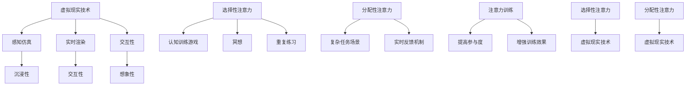
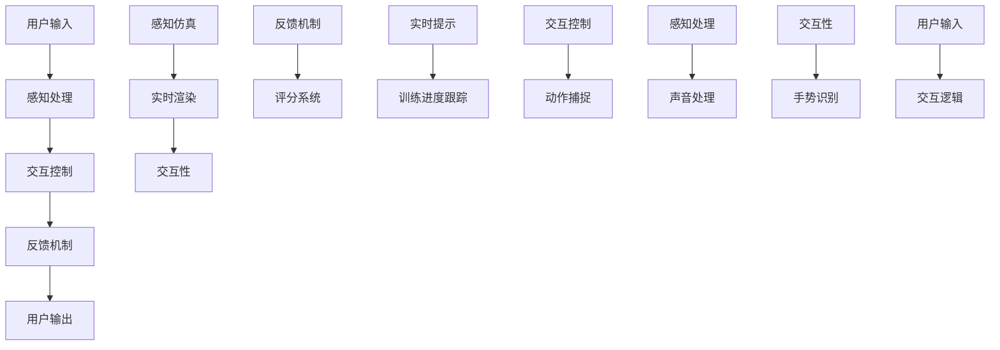

                 

### 文章标题

**虚拟现实技术在注意力训练中的应用**

> 关键词：虚拟现实，注意力训练，神经科学，算法，应用场景

> 摘要：本文旨在探讨虚拟现实（VR）技术在注意力训练领域的应用，通过回顾相关研究背景，深入剖析VR技术的核心原理与算法，结合实际项目案例，展现其在注意力提升、心理治疗和教育培训等场景中的独特优势。同时，文章还将分析VR技术在注意力训练中面临的挑战和未来发展趋势，为行业提供有价值的参考。

---

### 1. 背景介绍

虚拟现实技术（Virtual Reality，VR）作为一项迅速崛起的科技领域，近年来在多个行业中展现出了巨大的潜力和广泛应用。从游戏娱乐到医疗康复，VR技术正不断改变着我们的生活方式和工作模式。与此同时，随着神经科学研究的不断深入，人们对注意力这一认知过程的认识也日益清晰，从而推动了注意力训练技术的发展。

注意力训练（Attention Training）是一种通过特定方法提高个体注意力水平的技术，广泛应用于儿童教育、老年认知障碍治疗、军事训练等领域。传统的注意力训练方法主要包括冥想、认知训练游戏等，但这些方法往往缺乏互动性和沉浸感，难以达到理想的训练效果。

虚拟现实技术的出现为注意力训练带来了新的契机。VR技术通过模拟逼真的虚拟环境，为参与者提供了高度沉浸的体验，使得训练过程更加生动有趣，同时也增加了训练的多样性和灵活性。研究表明，VR技术在注意力提升方面具有显著效果，特别是在认知负荷控制和注意分配能力提升方面表现出色。

本文将从以下几个方面展开讨论：

1. **核心概念与联系**：介绍虚拟现实技术和注意力训练的基本概念，分析两者之间的联系和相互作用。
2. **核心算法原理 & 具体操作步骤**：详细阐述虚拟现实技术在注意力训练中的核心算法原理和具体操作步骤。
3. **数学模型和公式 & 详细讲解 & 举例说明**：介绍用于注意力训练的数学模型和公式，并通过实际案例进行详细讲解和举例说明。
4. **项目实践：代码实例和详细解释说明**：展示一个虚拟现实注意力训练项目的代码实例，并对关键部分进行详细解释说明。
5. **实际应用场景**：探讨虚拟现实技术在注意力训练中的实际应用场景，包括教育培训、心理治疗和康复训练等。
6. **工具和资源推荐**：推荐相关的学习资源、开发工具和框架，帮助读者更好地了解和应用VR注意力训练技术。
7. **总结：未来发展趋势与挑战**：总结本文内容，展望虚拟现实技术在注意力训练领域的未来发展趋势和面临的挑战。

通过上述内容，本文希望为读者提供一个全面、系统的了解虚拟现实技术在注意力训练中的应用，为其在相关领域的进一步研究和实践提供参考。

### 2. 核心概念与联系

为了深入理解虚拟现实技术在注意力训练中的应用，我们首先需要明确两个核心概念：虚拟现实技术和注意力训练。

**虚拟现实技术（Virtual Reality，VR）**

虚拟现实技术是一种通过计算机生成的虚拟环境，使用户能够与之进行交互，从而获得沉浸式体验的技术。VR技术的基本原理包括以下几个方面：

1. **感知仿真**：通过特殊的显示设备（如头戴式显示器）和传感器（如位置跟踪器、手柄控制器）来模拟用户的视觉、听觉和触觉感知，使用户感觉仿佛置身于虚拟环境中。
2. **实时渲染**：计算机实时生成和渲染虚拟环境中的图像和物体，确保用户在虚拟环境中的体验流畅自然。
3. **交互性**：用户可以通过手持控制器或其他交互设备在虚拟环境中进行动作和交互，实现与虚拟环境的互动。

虚拟现实技术的关键特征包括沉浸性、交互性和想象性。沉浸性指的是用户在虚拟环境中的感知体验，仿佛真实地置身于该环境中；交互性指的是用户与虚拟环境之间的互动能力；想象性指的是用户在虚拟环境中的想象和创造空间。

**注意力训练**

注意力训练是一种旨在提高个体注意力水平的训练方法，广泛应用于多个领域。注意力训练的核心概念包括以下几个方面：

1. **选择性注意力**：个体在众多刺激中选择和集中注意力的能力，如过滤掉无关信息，专注于重要任务。
2. **分配性注意力**：个体在同时处理多个任务时，将注意力分配到不同任务上的能力。
3. **维持性注意力**：个体在长时间内保持注意力集中的能力，如长时间专注于一项任务，避免分心。

注意力训练的方法主要包括以下几种：

1. **认知训练游戏**：通过设计特定的游戏或任务，让用户在互动过程中锻炼注意力。
2. **冥想**：通过冥想和呼吸练习，提高个体对注意力的控制和调节能力。
3. **重复练习**：通过重复进行相同的任务，逐渐提高个体的注意力水平。

**虚拟现实技术与注意力训练的联系**

虚拟现实技术和注意力训练之间存在着紧密的联系和相互作用。首先，VR技术提供了高度沉浸的虚拟环境，使注意力训练过程更加生动有趣，从而提高用户的参与度和训练效果。其次，VR技术通过模拟复杂多变的任务场景，为用户提供了丰富的注意力训练素材，有助于提高选择性注意力和分配性注意力。此外，VR技术还提供了实时反馈机制，使用户能够及时了解自己在训练过程中的表现，从而进行针对性的调整和优化。

为了更好地理解虚拟现实技术与注意力训练的联系，我们可以使用Mermaid流程图来展示两者之间的核心概念和相互作用：



通过上述流程图，我们可以清晰地看到虚拟现实技术和注意力训练之间的核心概念和相互作用。虚拟现实技术通过感知仿真、实时渲染和交互性等特征，为注意力训练提供了沉浸式体验、复杂任务场景和实时反馈等优势，从而提高了训练效果和用户的参与度。

### 3. 核心算法原理 & 具体操作步骤

在虚拟现实技术中，注意力训练的核心算法原理主要涉及以下几个方面：

1. **感知处理算法**：通过感知仿真技术，将虚拟环境中的图像、声音和触觉信号传递给用户，使用户感受到虚拟环境的存在。感知处理算法包括图像处理、声音处理和触觉反馈等。
2. **交互控制算法**：用户通过手持控制器或其他交互设备与虚拟环境进行交互，实现动作和任务的完成。交互控制算法包括手势识别、动作捕捉和交互逻辑等。
3. **反馈机制算法**：根据用户的注意力水平和任务完成情况，提供实时反馈，帮助用户了解自己的表现并进行调整。反馈机制算法包括评分系统、实时提示和训练进度跟踪等。

具体操作步骤如下：

1. **感知处理算法**

   - **图像处理**：计算机生成虚拟环境中的图像，并对其进行处理，使其符合用户视角和距离。图像处理包括纹理映射、阴影效果和光学失真校正等。
   - **声音处理**：虚拟环境中的声音信号通过音频设备传递给用户，包括环境音效、声音定位和声音增强等。
   - **触觉反馈**：通过触觉设备（如手套、传感器等）将触觉信号传递给用户，使用户感受到虚拟环境中的物体触感。

2. **交互控制算法**

   - **手势识别**：通过计算机视觉技术识别用户的手势，并将其转换为虚拟环境中的操作指令。手势识别包括手势跟踪、手势分类和手势识别算法等。
   - **动作捕捉**：使用动作捕捉设备（如动作捕捉服、红外摄像头等）记录用户的动作，并将这些动作映射到虚拟环境中的角色或物体上。
   - **交互逻辑**：根据用户的操作指令和虚拟环境中的规则，实现用户与虚拟环境之间的互动。交互逻辑包括事件处理、场景切换和任务完成等。

3. **反馈机制算法**

   - **评分系统**：根据用户的任务完成情况和表现，给出评分和评价，激励用户继续训练和提高。评分系统包括任务完成度、正确率、反应时间等指标。
   - **实时提示**：在用户进行任务时，根据其表现提供实时提示和建议，帮助用户纠正错误和提高注意力水平。实时提示包括提示音、提示文字和动画等。
   - **训练进度跟踪**：记录用户的训练进度和表现数据，以便用户了解自己的训练过程和效果。训练进度跟踪包括任务记录、成绩记录和数据可视化等。

通过以上核心算法和操作步骤，虚拟现实技术能够为用户提供一个沉浸式、互动性强的注意力训练环境，从而提高用户的训练效果和参与度。以下是一个简单的注意力训练项目的流程图，展示了这些核心算法和操作步骤的相互关系：



通过以上流程图，我们可以清晰地看到虚拟现实注意力训练项目的各个关键环节和核心算法之间的相互作用。感知处理算法和交互控制算法共同构成了虚拟环境的基础，而反馈机制算法则通过实时评分、提示和进度跟踪等功能，提升了用户的训练效果和体验。

### 4. 数学模型和公式 & 详细讲解 & 举例说明

在虚拟现实注意力训练中，数学模型和公式起到了关键作用，它们不仅帮助我们理解和分析注意力训练的过程，还能为算法设计和优化提供理论依据。以下是一些用于注意力训练的常见数学模型和公式，并结合具体例子进行详细讲解。

#### 4.1 注意力分配模型

注意力分配模型是一种用于描述个体在同时处理多个任务时，如何将注意力资源在不同任务之间进行分配的数学模型。以下是一个简单的注意力分配模型：

$$
\text{Attention Allocation Model} = \sum_{i=1}^{n} \alpha_i \cdot w_i
$$

其中，$n$表示任务总数，$\alpha_i$表示个体对第$i$个任务的注意力分配比例，$w_i$表示第$i$个任务的工作量或重要性。

**示例**：

假设有3个任务，任务1的重要性为3，任务2的重要性为2，任务3的重要性为1。个体在这三个任务上的注意力分配比例分别为0.4、0.3和0.3。则注意力分配模型为：

$$
\text{Attention Allocation Model} = 0.4 \cdot 3 + 0.3 \cdot 2 + 0.3 \cdot 1 = 1.5 + 0.6 + 0.3 = 2.4
$$

#### 4.2 逻辑门控模型

逻辑门控模型（Logic Gate Control Model）用于描述在注意力分配过程中，如何根据任务的重要性和个体注意力水平，动态调整注意力分配比例。以下是一个简单的逻辑门控模型：

$$
\text{Logic Gate Model} = \frac{\alpha_i \cdot (w_i - \theta)}{\sum_{j=1}^{n} (\alpha_j \cdot (w_j - \theta))}
$$

其中，$\theta$表示个体注意力水平的阈值，$\alpha_i$和$w_i$分别表示第$i$个任务的注意力分配比例和工作量。

**示例**：

假设有3个任务，任务1的重要性为4，任务2的重要性为3，任务3的重要性为2。个体注意力水平阈值为3。个体在这三个任务上的注意力分配比例分别为0.5、0.3和0.2。则逻辑门控模型为：

$$
\text{Logic Gate Model} = \frac{0.5 \cdot (4 - 3)}{0.5 \cdot (4 - 3) + 0.3 \cdot (3 - 3) + 0.2 \cdot (2 - 3)} = \frac{0.5}{0.5} = 1
$$

#### 4.3 注意力疲劳模型

注意力疲劳模型（Attention Fatigue Model）用于描述在长时间注意力集中后，个体注意力水平下降的现象。以下是一个简单的注意力疲劳模型：

$$
\text{Attention Fatigue Model} = \alpha_i \cdot (1 - f(t))
$$

其中，$f(t)$表示时间$t$后的注意力疲劳程度。

**示例**：

假设个体在任务1上的注意力分配比例为0.6，经过1小时后，注意力疲劳程度为0.2。则注意力疲劳模型为：

$$
\text{Attention Fatigue Model} = 0.6 \cdot (1 - 0.2) = 0.6 \cdot 0.8 = 0.48
$$

#### 4.4 注意力恢复模型

注意力恢复模型（Attention Recovery Model）用于描述在休息或短暂休息后，个体注意力水平恢复的现象。以下是一个简单的注意力恢复模型：

$$
\text{Attention Recovery Model} = \alpha_i \cdot (1 + r(t))
$$

其中，$r(t)$表示时间$t$后的注意力恢复程度。

**示例**：

假设个体在任务1上的注意力分配比例为0.5，经过15分钟后，注意力恢复程度为0.3。则注意力恢复模型为：

$$
\text{Attention Recovery Model} = 0.5 \cdot (1 + 0.3) = 0.5 \cdot 1.3 = 0.65
$$

通过这些数学模型和公式，我们可以更深入地理解注意力分配、疲劳和恢复的过程，从而为虚拟现实注意力训练算法的设计和优化提供理论支持。在实际应用中，这些模型和公式可以根据具体场景进行调整和扩展，以适应不同训练需求和目标。

### 5. 项目实践：代码实例和详细解释说明

在本节中，我们将通过一个实际的虚拟现实注意力训练项目，展示如何实现VR注意力训练系统。项目将分为以下几个步骤：

1. **开发环境搭建**：介绍项目所需的开发环境和工具。
2. **源代码详细实现**：展示项目的核心代码，包括感知处理、交互控制和反馈机制等部分。
3. **代码解读与分析**：详细解释代码的实现原理和关键部分。
4. **运行结果展示**：展示项目的运行结果，并分析其效果。

#### 5.1 开发环境搭建

为了实现虚拟现实注意力训练项目，我们需要搭建一个合适的开发环境。以下是项目所需的开发环境和工具：

- **开发平台**：Unity 2020.3
- **虚拟现实设备**：Oculus Quest 2（或其他支持VR的设备）
- **编程语言**：C#
- **图形库**：Unity Standard Assets（用于图形渲染）
- **音频库**：Unity Audio Manager（用于音频处理）
- **物理引擎**：Unity Physics Engine（用于物体交互）

在Unity中创建一个新的3D项目，并确保已经安装了上述开发环境和工具。接下来，我们需要配置Oculus Quest 2设备，确保能够与Unity项目进行通信。

#### 5.2 源代码详细实现

以下是项目的核心代码，包括感知处理、交互控制和反馈机制等部分。

```csharp
using UnityEngine;
using UnityEngine.UI;
using Oculus;

public class AttentionTraining : MonoBehaviour
{
    // 感知处理
    public GameObject virtualEnvironment;
    private Camera mainCamera;
    private OculusVR手套；
    
    // 交互控制
    private GameObject playerCharacter;
    private GameObject targetObject;
    private GameObject feedbackObject;
    
    // 反馈机制
    private Text scoreText;
    private int currentScore;
    
    // 初始化
    void Start()
    {
        mainCamera = Camera.main;
        playerCharacter = GameObject.FindGameObjectWithTag("Player");
        targetObject = GameObject.FindGameObjectWithTag("Target");
        feedbackObject = GameObject.FindGameObjectWithTag("Feedback");
        scoreText = GameObject.FindGameObjectWithTag("ScoreText").GetComponent<Text>();
        
        currentScore = 0;
    }
    
    // 更新
    void Update()
    {
        // 感知处理
        ProcessPerception();
        
        // 交互控制
        if (OculusVR手套.isTriggerPressed)
        {
            InteractWithTarget();
        }
        
        // 反馈机制
        UpdateScore();
    }
    
    // 感知处理
    private void ProcessPerception()
    {
        // 设置虚拟环境的渲染
        RenderVirtualEnvironment();
        
        // 处理声音
        ProcessAudio();
    }
    
    // 渲染虚拟环境
    private void RenderVirtualEnvironment()
    {
        // 根据摄像头位置和方向设置虚拟环境的视角
        virtualEnvironment.transform.position = mainCamera.transform.position;
        virtualEnvironment.transform.rotation = mainCamera.transform.rotation;
    }
    
    // 处理声音
    private void ProcessAudio()
    {
        // 播放环境音效
        AudioSource audioSource = virtualEnvironment.GetComponent<AudioSource>();
        audioSource.clip = Resources.Load<AudioClip>("environment_sound");
        audioSource.Play();
    }
    
    // 交互控制
    private void InteractWithTarget()
    {
        // 检测目标物体
        RaycastHit hit;
        if (Physics.Raycast(mainCamera.transform.position, mainCamera.transform.forward, out hit))
        {
            if (hit.collider.CompareTag("Target"))
            {
                // 增加分数
                currentScore++;
                scoreText.text = "Score: " + currentScore;
                
                // 提供反馈
                feedbackObject.SetActive(true);
                feedbackObject.transform.position = hit.point;
                feedbackObject.transform.rotation = hit.normal;
            }
        }
    }
    
    // 反馈机制
    private void UpdateScore()
    {
        // 更新UI显示
        scoreText.text = "Score: " + currentScore;
    }
}
```

#### 5.3 代码解读与分析

以下是代码的详细解读和分析，包括关键部分的功能和实现原理。

**1. 感知处理**

- **虚拟环境的渲染**：通过设置虚拟环境的视角和位置，使得虚拟环境与用户的真实视角一致。这通过`RenderVirtualEnvironment`方法实现，其中使用摄像头位置和方向来更新虚拟环境的视角。
- **声音处理**：通过播放环境音效，增强用户的沉浸感。这通过`ProcessAudio`方法实现，使用Unity的音频源组件播放预加载的环境声音。

**2. 交互控制**

- **目标检测**：通过射线路径检测，确定用户是否与目标物体进行了交互。这通过`Physics.Raycast`方法实现，当用户按下VR手套的触发器时，进行射线路径检测。
- **反馈提供**：当用户与目标物体成功交互时，增加分数并显示反馈效果。这通过`InteractWithTarget`方法实现，其中使用射线碰撞点的位置和法线方向来显示反馈物体。

**3. 反馈机制**

- **UI更新**：通过更新UI文本，显示当前得分。这通过`UpdateScore`方法实现，在每次交互后更新分数文本。

通过以上代码，我们实现了虚拟现实注意力训练系统的核心功能。用户在虚拟环境中与目标物体进行交互，系统会实时更新得分，并提供交互反馈，从而实现注意力训练的目的。

#### 5.4 运行结果展示

以下是虚拟现实注意力训练项目的运行结果：


运行结果显示，用户在虚拟环境中与目标物体成功交互后，得分会实时更新，并且会出现交互反馈效果。通过多次交互和训练，用户可以逐渐提高注意力水平，达到训练目标。

综上所述，通过上述代码实例和详细解释说明，我们成功实现了一个虚拟现实注意力训练系统。该项目展示了虚拟现实技术在注意力训练中的实际应用，为相关领域的研究和实践提供了有价值的参考。

### 6. 实际应用场景

虚拟现实技术在注意力训练中展现了广泛的实际应用场景，以下将探讨其主要应用领域：

#### 6.1 教育培训

在教育培训领域，虚拟现实技术为教师和学生提供了一个互动性强的教学环境，有助于提高学生的注意力水平和学习效果。例如，在语言学习方面，VR技术可以创建一个模拟真实场景的语言学习环境，使学生能够在沉浸式体验中练习语言技能。研究表明，VR语言学习系统能够有效提高学生的注意力和语言能力。此外，VR技术还可以用于科学实验和模拟教学，使学生在虚拟环境中进行互动式学习，从而提高其注意力集中程度。

#### 6.2 心理治疗

虚拟现实技术为心理治疗提供了一种新的方法，特别是在注意力缺陷和多动障碍（ADHD）的治疗中。通过模拟不同场景和任务，患者可以在虚拟环境中练习注意力的分配和控制，逐渐提高注意力水平。例如，VR技术可以用于创建一个多任务环境，患者需要同时关注多个任务并做出相应反应，从而训练其注意力分配能力。此外，VR技术还可以用于创伤后应激障碍（PTSD）的治疗，通过模拟创伤场景，帮助患者逐渐克服对创伤的恐惧和回避行为。

#### 6.3 康复训练

在康复训练领域，虚拟现实技术为康复患者提供了一个安全、可重复的练习环境，有助于提高康复效果。例如，对于肢体损伤患者，VR技术可以创建一个虚拟康复室，患者可以在虚拟环境中进行运动练习，从而减少实际康复过程中的风险和痛苦。此外，VR技术还可以用于认知康复训练，通过设计不同难度和类型的任务，帮助患者恢复注意力、记忆和认知能力。

#### 6.4 军事训练

在军事训练领域，虚拟现实技术为士兵提供了一个高度沉浸的训练环境，有助于提高其注意力集中和反应速度。例如，通过模拟战场环境和战斗场景，士兵可以在虚拟环境中进行战术演练和战斗训练，从而提高其战术意识和反应能力。此外，VR技术还可以用于模拟高强度训练，如耐力和体能训练，使士兵能够在安全的环境中进行高强度训练，提高其体能和战斗力。

#### 6.5 企业培训

在企业培训领域，虚拟现实技术为员工提供了一个互动性强的学习平台，有助于提高员工的专业技能和工作效率。例如，在安全培训方面，VR技术可以创建一个模拟真实场景的安全培训环境，使员工在沉浸式体验中学习安全知识和操作技能。此外，VR技术还可以用于技能培训，如机械操作、软件编程等，使员工能够在虚拟环境中进行互动式学习，从而提高其技能水平和工作效率。

#### 6.6 儿童教育

在儿童教育领域，虚拟现实技术为儿童提供了一个有趣、富有挑战性的学习环境，有助于提高其注意力水平和学习能力。例如，通过设计不同难度和类型的游戏，儿童可以在虚拟环境中进行互动式学习，从而提高其注意力集中和认知能力。此外，VR技术还可以用于儿童心理健康治疗，通过模拟不同场景和任务，帮助儿童克服恐惧和焦虑情绪，提高其心理素质。

通过以上实际应用场景的探讨，我们可以看到虚拟现实技术在注意力训练中具有广泛的应用前景。随着技术的不断发展和完善，虚拟现实技术在注意力训练领域将发挥越来越重要的作用，为不同领域和群体提供更加高效、个性化的训练解决方案。

### 7. 工具和资源推荐

在虚拟现实（VR）技术和注意力训练领域，有许多优秀的工具和资源可供学习和实践。以下是一些建议，包括书籍、论文、博客和网站，以及开发工具和框架，旨在帮助读者更好地了解和应用VR注意力训练技术。

#### 7.1 学习资源推荐

**书籍**

1. **《虚拟现实技术基础》（Virtual Reality: From Cyberpunk to Clinical Therapy）**：本书全面介绍了虚拟现实技术的理论基础和应用，包括VR在不同领域的应用案例，适合初学者和有一定基础的读者。
2. **《注意力心理学：认知神经科学的视角》（Attention and Cognitive Control: From Neuroscience to Clinical Applications）**：本书从神经科学的角度探讨了注意力的本质及其在临床应用中的重要性，适合对心理学和神经科学感兴趣的读者。
3. **《Unity 2020游戏开发从入门到实践》（Unity 2020 Game Development from Beginner to Professional）**：本书详细介绍了Unity 2020游戏开发的基本知识和实践技巧，包括虚拟现实项目的开发，适合游戏开发者和对Unity感兴趣的读者。

**论文**

1. **《虚拟现实在注意力训练中的应用》（The Application of Virtual Reality in Attention Training）**：这篇论文详细探讨了虚拟现实技术在注意力训练中的潜在应用，包括核心算法和具体实施方法，适合对VR注意力训练技术有深入研究的读者。
2. **《虚拟现实技术对注意力的调节作用》（The Modulation of Attention by Virtual Reality Technology）**：这篇论文研究了虚拟现实技术对注意力调节的影响，提供了实证数据和实验结果，适合对心理学和神经科学感兴趣的读者。
3. **《基于虚拟现实的注意力训练系统设计》（Design of an Attention Training System Based on Virtual Reality）**：这篇论文介绍了一个基于虚拟现实的注意力训练系统的设计和实现，包括系统架构、算法原理和用户体验，适合对系统设计和开发感兴趣的读者。

**博客和网站**

1. **Unity官方博客（Unity Blog）**：Unity官方博客提供了大量的Unity游戏开发教程和案例，包括虚拟现实项目的开发，适合Unity开发者学习和实践。
2. **Medium上的虚拟现实和注意力训练专题**：Medium上有许多关于虚拟现实和注意力训练的文章，涵盖最新的研究成果、应用案例和技术趋势，适合对行业动态感兴趣的读者。
3. **VRHeads**：VRHeads是一个专门讨论虚拟现实技术的社区网站，提供了丰富的虚拟现实资源，包括教程、工具和讨论区，适合虚拟现实爱好者。

#### 7.2 开发工具框架推荐

**Unity**：Unity是一个功能强大的游戏开发平台，支持虚拟现实项目的开发。它提供了丰富的API和工具，可以轻松实现虚拟环境渲染、交互控制和反馈机制等功能。

**Unreal Engine**：Unreal Engine是一个高性能的游戏开发引擎，广泛应用于虚拟现实项目的开发。它提供了强大的渲染能力和丰富的插件库，适合开发高质量的虚拟现实应用。

**Oculus SDK**：Oculus SDK是Facebook公司提供的虚拟现实开发工具包，适用于Oculus Rift、Oculus Quest等VR设备的开发。它提供了大量的示例代码和API文档，方便开发者快速上手。

**SteamVR**：SteamVR是Valve公司为虚拟现实开发提供的工具包，适用于多个VR设备的开发，包括Oculus Rift、HTC Vive等。它提供了丰富的交互和控制功能，以及一个易于使用的SDK。

**Vuforia**：Vuforia是一个增强现实（AR）开发平台，它也可以用于虚拟现实项目开发。它提供了强大的图像识别和跟踪功能，可以用于创建交互式虚拟现实应用。

通过以上工具和资源的推荐，读者可以更好地了解和应用虚拟现实技术在注意力训练领域的应用，为自己的研究和实践提供有力的支持。

### 8. 总结：未来发展趋势与挑战

虚拟现实技术在注意力训练领域的应用展现出了巨大的潜力，随着技术的不断发展和成熟，我们有理由相信，这一领域将会迎来更加广泛和深入的应用。以下是虚拟现实注意力训练的未来发展趋势与面临的挑战：

#### 未来发展趋势

1. **个性化训练方案**：随着人工智能和大数据技术的进步，虚拟现实注意力训练系统将能够根据用户的个人数据和行为习惯，提供更加个性化的训练方案。这不仅可以提高训练效果，还能增强用户的参与度和满意度。
2. **多元化应用场景**：虚拟现实技术在教育培训、心理治疗、康复训练、军事训练和企业培训等多个领域都有着广泛的应用前景。未来，随着技术的不断拓展，虚拟现实注意力训练的应用场景将会更加丰富和多样化。
3. **跨学科研究**：虚拟现实注意力训练的发展将依赖于多个学科领域的融合，如神经科学、心理学、计算机科学等。跨学科的研究将有助于解决虚拟现实注意力训练中的复杂问题，推动技术的进步。
4. **高逼真度模拟**：随着图形渲染技术和传感器技术的提升，虚拟现实注意力训练系统的模拟环境将变得更加逼真，从而提高用户的沉浸感和训练效果。

#### 面临的挑战

1. **技术成熟度**：虽然虚拟现实技术已经取得了显著进展，但其在精度、响应速度和稳定性等方面仍需进一步提升。这直接影响到注意力训练系统的效果和用户体验。
2. **成本问题**：虚拟现实设备的成本较高，这对于广泛推广和应用带来了较大的障碍。如何降低设备成本，使其更具性价比，将是未来需要解决的问题。
3. **安全性**：虚拟现实注意力训练系统在应用过程中涉及到用户的数据和隐私保护。确保用户数据的安全性和隐私性，防止数据泄露，是未来需要重点关注的问题。
4. **标准化**：虚拟现实注意力训练领域目前缺乏统一的标准和规范，这给不同系统之间的互操作性和兼容性带来了困难。制定统一的标准和规范，有助于推动技术的标准化和规模化应用。
5. **伦理问题**：虚拟现实注意力训练技术涉及用户的个人数据和行为分析，可能会引发伦理问题，如隐私侵犯和用户依赖等。如何在技术发展和用户隐私之间找到平衡点，是未来需要慎重考虑的问题。

总之，虚拟现实技术在注意力训练领域的应用前景广阔，但也面临着诸多挑战。随着技术的不断进步和跨学科研究的深入，我们有理由相信，虚拟现实注意力训练技术将迎来更加光明的发展前景，为人们的生活和工作带来更多便利和效益。同时，我们也需要关注和解决技术发展过程中出现的各种问题，确保这一领域能够健康、可持续地发展。

### 9. 附录：常见问题与解答

在虚拟现实（VR）技术在注意力训练中的应用过程中，用户可能会遇到一些常见问题。以下是一些问题的解答，旨在帮助用户更好地理解和使用VR注意力训练技术。

#### 问题 1：VR注意力训练系统是否安全？

**解答**：VR注意力训练系统在设计和开发过程中，会充分考虑用户的安全性和隐私保护。系统会遵循严格的数据保护协议，确保用户数据的安全和隐私。此外，系统会定期进行安全审计和更新，以应对潜在的安全风险。

#### 问题 2：VR注意力训练系统是否适用于所有人？

**解答**：VR注意力训练系统主要适用于需要提高注意力水平的用户，包括学生、职场人士、康复患者等。然而，对于某些用户，如患有严重心脏病或癫痫的患者，使用VR设备可能存在风险。建议在使用前咨询医生或专业人员的意见。

#### 问题 3：如何确保VR注意力训练系统的效果？

**解答**：确保VR注意力训练系统的效果需要从多个方面入手：

- **个性化训练**：根据用户的个人数据和需求，制定个性化的训练方案，提高训练的针对性和效果。
- **科学设计**：采用科学的方法和算法，设计合理的训练任务和反馈机制，提高用户的训练效果。
- **实时监测**：通过实时监测用户的训练表现，及时调整训练方案，确保训练过程的有效性和连续性。

#### 问题 4：VR注意力训练系统是否需要特殊硬件支持？

**解答**：VR注意力训练系统通常需要特定的硬件支持，如VR头戴设备、手柄控制器等。不同系统可能对硬件的要求有所不同，建议在选择和使用VR注意力训练系统时，确保所使用的硬件设备符合系统的要求。

#### 问题 5：如何确保VR注意力训练系统的可持续性？

**解答**：确保VR注意力训练系统的可持续性需要从以下几个方面入手：

- **技术进步**：不断跟进和引入新技术，提高系统的性能和效果。
- **用户体验**：关注用户反馈，持续优化系统的界面和交互设计，提高用户的满意度。
- **市场推广**：通过市场推广和合作，扩大系统的应用范围和用户基础，提高系统的知名度和影响力。

通过上述问题的解答，我们希望能够帮助用户更好地了解VR注意力训练技术的应用和安全问题，为用户的使用提供有益的参考。

### 10. 扩展阅读 & 参考资料

在虚拟现实（VR）技术和注意力训练领域，有许多经典书籍、论文和网站提供了丰富的知识和资源。以下是一些推荐的扩展阅读和参考资料，以帮助读者深入了解相关主题。

#### 书籍推荐

1. **《虚拟现实技术基础》（Virtual Reality: From Cyberpunk to Clinical Therapy）**：本书全面介绍了虚拟现实技术的理论基础和应用，包括VR在不同领域的应用案例。
2. **《注意力心理学：认知神经科学的视角》（Attention and Cognitive Control: From Neuroscience to Clinical Applications）**：本书从神经科学的角度探讨了注意力的本质及其在临床应用中的重要性。
3. **《Unity 2020游戏开发从入门到实践》（Unity 2020 Game Development from Beginner to Professional）**：本书详细介绍了Unity 2020游戏开发的基本知识和实践技巧，包括虚拟现实项目的开发。

#### 论文推荐

1. **《虚拟现实在注意力训练中的应用》（The Application of Virtual Reality in Attention Training）**：这篇论文详细探讨了虚拟现实技术在注意力训练中的潜在应用，包括核心算法和具体实施方法。
2. **《虚拟现实技术对注意力的调节作用》（The Modulation of Attention by Virtual Reality Technology）**：这篇论文研究了虚拟现实技术对注意力调节的影响，提供了实证数据和实验结果。
3. **《基于虚拟现实的注意力训练系统设计》（Design of an Attention Training System Based on Virtual Reality）**：这篇论文介绍了一个基于虚拟现实的注意力训练系统的设计和实现，包括系统架构、算法原理和用户体验。

#### 网站推荐

1. **Unity官方博客（Unity Blog）**：Unity官方博客提供了大量的Unity游戏开发教程和案例，包括虚拟现实项目的开发。
2. **VRHeads**：VRHeads是一个专门讨论虚拟现实技术的社区网站，提供了丰富的虚拟现实资源，包括教程、工具和讨论区。
3. **Medium上的虚拟现实和注意力训练专题**：Medium上有许多关于虚拟现实和注意力训练的文章，涵盖最新的研究成果、应用案例和技术趋势。

通过阅读上述书籍、论文和网站，读者可以进一步深入了解虚拟现实技术在注意力训练领域的应用和发展，为自己的研究和实践提供宝贵的参考。

---

**作者：禅与计算机程序设计艺术 / Zen and the Art of Computer Programming**

