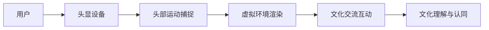

                 

### 1. 背景介绍

虚拟现实（Virtual Reality，简称VR）作为一种高度沉浸式的体验技术，正在逐渐改变人们的生活方式和交流模式。而随着5G网络的普及、云计算技术的进步以及高性能计算资源的可用性提高，虚拟现实技术正迎来新一轮的发展机遇。在这一背景下，虚拟现实文化交流创业成为了众多创业者争相探索的新领域。

虚拟现实文化交流创业的核心理念在于通过构建虚拟现实环境，实现不同文化背景下的交流与互动，从而打破地域、语言和文化的界限，促进全球文化的互通与理解。这种创业模式不仅能够为用户提供全新的沉浸式体验，还能够为文化交流和传承提供新的途径。

近年来，虚拟现实技术在教育、娱乐、医疗等多个领域取得了显著的应用成果。在教育领域，虚拟现实技术可以创建逼真的教学场景，提高学生的学习兴趣和效果；在娱乐领域，虚拟现实游戏和体验吸引了大量用户，成为新的娱乐热点；在医疗领域，虚拟现实技术则被用于手术模拟和康复训练，提高了医疗服务的质量和效率。

然而，虚拟现实文化交流创业也面临着诸多挑战。首先，技术成熟度和服务质量仍是亟待解决的问题。尽管虚拟现实技术取得了长足的进步，但依然存在一定的技术瓶颈，如延迟、分辨率和交互体验等。其次，市场教育成本高、用户接受度低也是影响虚拟现实文化交流创业推广的关键因素。此外，虚拟现实内容的创作和分发、知识产权保护等问题也需要得到有效解决。

总之，虚拟现实文化交流创业具有巨大的发展潜力和市场前景。在未来的发展中，随着技术的不断成熟和市场需求的增加，虚拟现实文化交流创业将迎来更加广阔的发展空间。

### 2. 核心概念与联系

#### 虚拟现实（VR）的概念

虚拟现实（Virtual Reality，简称VR）是一种通过计算机模拟生成一种三维空间，用户可以通过头戴显示器（HMD）或头显设备进入这种虚拟空间，并与之进行交互体验的技术。VR技术的基本原理是通过头显设备捕捉用户的头部运动，并实时渲染对应的虚拟环境，从而实现用户的沉浸式体验。

#### 文化交流的概念

文化交流是指不同文化背景下的个体或群体之间的信息、思想和价值观的传递与互动。文化交流的意义在于增进不同文化之间的理解与尊重，促进文化多样性和全球文化的繁荣。

#### 虚拟现实与文化交流的联系

虚拟现实与文化交流的结合，可以创建一个全新的互动平台，使得不同文化背景下的个体能够在虚拟环境中进行直接的交流与互动。这种互动不仅仅是简单的信息传递，更是一种深层次的互动体验，有助于增进不同文化之间的理解与认同。

#### 关联流程图（Mermaid）

下面是一个简单的Mermaid流程图，展示了虚拟现实与文化交流的关联过程：



在这个流程图中：

- A[用户] 表示用户希望通过虚拟现实体验与不同文化进行交流。
- B[头显设备] 表示用户通过佩戴头显设备进入虚拟现实环境。
- C[头部运动捕捉] 表示设备捕捉用户的头部运动，以便实时渲染对应的虚拟环境。
- D[虚拟环境渲染] 表示计算机根据用户的头部运动实时渲染对应的虚拟环境。
- E[文化交流互动] 表示用户在虚拟环境中与其他文化背景的用户进行互动。
- F[文化理解与认同] 表示通过虚拟现实的交流互动，用户能够增进对不同文化的理解与认同。

这个流程图清晰地展示了虚拟现实与文化交流之间的紧密联系，为后续章节的深入探讨奠定了基础。

### 3. 核心算法原理 & 具体操作步骤

在虚拟现实文化交流创业中，核心算法的设计与实现是确保用户体验质量的关键。以下将介绍几种核心算法的原理及其具体操作步骤。

#### 3.1 头部运动追踪算法

头部运动追踪是虚拟现实体验的基础，其目的是捕捉用户的头部运动，从而实时渲染对应的虚拟环境。常用的头部运动追踪算法包括：

##### 3.1.1 惯性测量单元（IMU）追踪算法

惯性测量单元（IMU）是一种集成了加速度计、陀螺仪和磁力计的传感器，可以实时测量用户的头部运动。IMU追踪算法的具体步骤如下：

1. **初始化IMU传感器**：将IMU传感器连接到头显设备上，并进行校准。
2. **采集数据**：通过IMU传感器实时采集用户的头部运动数据，包括加速度、角速度和磁场强度等。
3. **数据处理**：对采集到的数据进行滤波和融合，以减小噪声和误差，提高追踪精度。
4. **运动建模**：根据处理后的数据，建立头部运动的运动模型，如刚体运动模型。
5. **实时渲染**：根据头部运动模型，实时更新虚拟环境中的视图，实现用户的沉浸式体验。

##### 3.1.2 视差追踪算法

视差追踪算法通过分析用户眼睛的视角差异来捕捉头部运动。其具体步骤如下：

1. **双眼图像采集**：使用头显设备上的两个摄像头同时采集用户的左右眼图像。
2. **图像预处理**：对采集到的图像进行去噪、对比度增强等预处理，以提高图像质量。
3. **特征提取**：从预处理后的图像中提取关键特征点，如角点、边缘等。
4. **视差计算**：根据左右眼图像的特征点匹配，计算视差图，从而得到头部运动的位移信息。
5. **运动建模与渲染**：根据视差信息建立头部运动模型，并实时更新虚拟环境中的视图。

#### 3.2 虚拟环境渲染算法

虚拟环境渲染是虚拟现实体验的核心，其目的是将虚拟场景真实地呈现给用户。以下介绍几种常用的虚拟环境渲染算法：

##### 3.2.1 基于图像的渲染技术（IBR）

基于图像的渲染技术（Image-Based Rendering，简称IBR）通过使用实际拍摄或渲染的图像来生成虚拟环境。其具体步骤如下：

1. **图像采集**：采集或获取高质量的虚拟环境图像，包括全景图、高动态范围图像（HDR）等。
2. **图像预处理**：对采集到的图像进行预处理，如裁剪、融合、去噪等，以提高图像质量。
3. **视点变换**：根据用户的头部运动，实时变换图像的视点，使其适应用户的视角。
4. **光线追踪**：根据用户视角的光线方向，计算图像中的光线传播路径，实现真实的光线效果。

##### 3.2.2 基于物理的渲染技术（PBR）

基于物理的渲染技术（Physically Based Rendering，简称PBR）通过模拟真实物理世界的光照和材料特性来渲染虚拟环境。其具体步骤如下：

1. **材质模型**：建立虚拟环境中的材质模型，包括表面反射、折射、散射等特性。
2. **光照模型**：根据虚拟环境中的光源分布和光照强度，计算物体表面的光照效果。
3. **渲染管线**：使用PBR渲染管线，将材质模型和光照模型应用到虚拟场景中，生成渲染图像。

#### 3.3 交互算法

在虚拟现实环境中，用户的交互操作是影响用户体验的重要因素。以下介绍几种常见的交互算法：

##### 3.3.1 手势识别算法

手势识别算法通过识别用户的手部动作，实现虚拟环境中的交互操作。其具体步骤如下：

1. **手部姿态估计**：使用深度相机或红外摄像头捕捉用户手部的深度信息，进行手部姿态估计。
2. **特征提取**：从手部姿态数据中提取关键特征，如手指的弯曲程度、手部的空间位置等。
3. **手势识别**：根据提取的特征，识别用户的手势类型，如点击、滑动、抓取等。
4. **交互操作**：根据识别的手势，实现虚拟环境中的相应交互操作。

##### 3.3.2 语音识别与合成算法

语音识别与合成算法通过处理用户的语音输入和输出，实现虚拟环境中的语音交互。其具体步骤如下：

1. **语音输入**：捕捉用户的语音输入，进行音频信号处理，如去噪、增强等。
2. **语音识别**：将处理后的音频信号转换为文本，识别用户的语音指令。
3. **语音合成**：根据识别的文本，生成语音输出，进行语音合成。
4. **交互响应**：根据用户的语音指令，实现虚拟环境中的相应交互操作。

通过以上核心算法的介绍和具体操作步骤的阐述，我们可以更好地理解虚拟现实文化交流创业中技术实现的复杂性及其关键性。这些算法的有效设计和实现，将为用户带来更加真实、沉浸式的虚拟现实体验，推动虚拟现实文化交流创业的进一步发展。

### 4. 数学模型和公式 & 详细讲解 & 举例说明

在虚拟现实文化交流创业中，数学模型和公式是理解和实现核心算法的重要工具。以下将介绍一些关键的数学模型和公式，并对其进行详细讲解和举例说明。

#### 4.1 坐标系转换

在虚拟现实技术中，坐标系转换是基础且重要的一步。常见的坐标系转换包括三维空间坐标与屏幕坐标的转换，以及局部坐标与全局坐标的转换。

##### 4.1.1 三维空间坐标到屏幕坐标

假设用户头部的位置和方向可以用三维空间中的点P(x, y, z)表示，屏幕上的像素点可以用二维坐标(u, v)表示。三维空间坐标到屏幕坐标的转换可以通过以下公式实现：

$$
\begin{align*}
u &= \frac{nx \cdot w + px}{dz + rw} \\
v &= \frac{ny \cdot w + py}{dz + rw}
\end{align*}
$$

其中，n、r、w、p、x、y、z分别为摄像机矩阵的元素。这些参数可以通过摄像机的内参和外参来确定。

##### 4.1.2 局部坐标到全局坐标

假设物体在局部坐标系中的位置和方向可以用点P'(x', y', z')表示，全局坐标系中的位置可以用点P(x, y, z)表示。局部坐标到全局坐标的转换可以通过以下公式实现：

$$
\begin{align*}
x &= x' \cdot R_{xx} + y' \cdot R_{xy} + z' \cdot R_{xz} + t_x \\
y &= x' \cdot R_{yx} + y' \cdot R_{yy} + z' \cdot R_{yz} + t_y \\
z &= x' \cdot R_{zx} + y' \cdot R_{zy} + z' \cdot R_{zz} + t_z
\end{align*}
$$

其中，R为旋转矩阵，t为平移向量。旋转矩阵可以通过物体的姿态角或四元数来表示。

#### 4.2 光线追踪

光线追踪是虚拟现实渲染中常用的算法，用于模拟真实世界中的光线传播和反射效果。光线追踪的基本数学模型如下：

##### 4.2.1 光线-三角形相交检测

假设一条光线L由点O(x0, y0, z0)出发，方向向量为D(dx, dy, dz)。一个三角形T由三个顶点V1(x1, y1, z1)、V2(x2, y2, z2)、V3(x3, y3, z3)确定。光线与三角形的相交检测可以通过以下步骤实现：

1. **计算光线与三角形平面的交点**：
   $$
   \begin{align*}
   t &= \frac{(V2 - V1) \cdot (V1 - O)}{(V2 - V1) \cdot (V2 - V1)} \\
   P &= O + t \cdot D
   \end{align*}
   $$

2. **判断交点是否在三角形内部**：
   通过计算交点P到三角形各边的向量，判断P是否位于三角形内部。具体方法为计算三个向量P-V1、P-V2、P-V3的点积，若三个点积均为正，则交点在三角形内部。

##### 4.2.2 反射光线追踪

在光线与物体相交后，可以继续追踪反射光线，以实现更真实的渲染效果。反射光线的追踪可以通过以下公式实现：

$$
\begin{align*}
R &= I - 2 \cdot (N \cdot I) \cdot N \\
D' &= -D \\
O' &= P + R \cdot \epsilon \\
\end{align*}
$$

其中，R为反射向量，I为入射向量，N为表面法向量，D为原始光线方向，D'为反射光线方向，P为交点位置，$\epsilon$为光线追踪的步长。

#### 4.3 3D物体建模

3D物体建模是虚拟现实环境构建的重要环节。以下介绍一种常用的3D物体建模方法——多边形建模。

##### 4.3.1 多边形建模基本公式

多边形建模的基本公式包括顶点坐标、边和面的定义。

1. **顶点坐标**：
   假设多边形的顶点为V1(x1, y1, z1)、V2(x2, y2, z2)、...、Vn(xn, yn, zn)，则顶点坐标的表示为：
   $$
   V_i = (x_i, y_i, z_i), \quad i = 1, 2, ..., n
   $$

2. **边和面**：
   边可以表示为两个顶点之间的向量，如边e1由顶点V1和V2确定，表示为：
   $$
   e_1 = V2 - V1
   $$
   面可以表示为三个顶点确定的平面，如面f1由顶点V1、V2和V3确定，其法向量可以通过以下公式计算：
   $$
   N = \frac{(V2 - V1) \times (V3 - V1)}{\| (V2 - V1) \times (V3 - V1) \| }
   $$

##### 4.3.2 3D物体建模示例

以一个简单的立方体为例，立方体的顶点坐标如下：

$$
\begin{align*}
V_1 &= (1, 1, 1) \\
V_2 &= (1, -1, 1) \\
V_3 &= (-1, -1, 1) \\
V_4 &= (-1, 1, 1) \\
V_5 &= (1, 1, -1) \\
V_6 &= (1, -1, -1) \\
V_7 &= (-1, -1, -1) \\
V_8 &= (-1, 1, -1)
\end{align*}
$$

立方体的六个面及其法向量如下：

$$
\begin{align*}
f_1 &= (V_1, V_2, V_3), \quad N_1 = (0, 0, 1) \\
f_2 &= (V_1, V_3, V_4), \quad N_2 = (0, 0, 1) \\
f_3 &= (V_2, V_3, V_6), \quad N_3 = (0, 1, 0) \\
f_4 &= (V_2, V_6, V_5), \quad N_4 = (0, 1, 0) \\
f_5 &= (V_1, V_4, V_5), \quad N_5 = (-1, 0, 0) \\
f_6 &= (V_1, V_5, V_6), \quad N_6 = (-1, 0, 0)
\end{align*}
$$

通过以上数学模型和公式的介绍，我们能够更好地理解虚拟现实技术中的核心算法和实现方法。这些数学模型不仅帮助我们进行虚拟现实环境的构建和渲染，还为虚拟现实文化交流创业提供了坚实的技术基础。

### 5. 项目实践：代码实例和详细解释说明

在本章节中，我们将通过一个具体的虚拟现实文化交流创业项目——"Global VR Connect"（全球虚拟现实连接平台）的代码实例，详细介绍其开发过程、关键代码实现以及代码分析。通过这一案例，我们将深入探讨虚拟现实技术的实际应用和实现细节。

#### 5.1 开发环境搭建

在开始项目开发之前，我们需要搭建一个适合虚拟现实开发的集成开发环境（IDE）。以下是一个基本的开发环境搭建步骤：

1. **安装虚拟现实开发框架**：选择一个合适的虚拟现实开发框架，如Unity或Unreal Engine。这里我们选择Unity作为开发平台。
   - 访问Unity官网[1]下载并安装Unity Hub。
   - 使用Unity Hub创建一个新的3D项目。

2. **安装虚拟现实插件**：安装必要的虚拟现实插件，如VRMADDER（用于模型导入和编辑）和Vuforia（用于物体识别）。
   - 在Unity Hub中搜索并安装VRMADDER和Vuforia插件。

3. **配置虚拟现实设备**：根据项目的需求，配置虚拟现实头显设备，如Oculus Rift或HTC Vive。连接设备并确保其与计算机正常通信。

4. **安装开发工具**：安装必要的开发工具，如Visual Studio或JetBrains Rider。
   - 访问Visual Studio官网[2]或JetBrains官网[3]下载并安装开发工具。

#### 5.2 源代码详细实现

以下我们将展示"Global VR Connect"平台的核心源代码，并对其关键部分进行详细解释。

##### 5.2.1 主场景搭建

在Unity项目中，我们首先需要搭建主场景，包括虚拟现实头显、控制器和虚拟环境。

```csharp
using UnityEngine;

public class MainScene : MonoBehaviour
{
    public GameObject headset;
    public GameObject controllerLeft;
    public GameObject controllerRight;
    public GameObject virtualEnvironment;

    void Start()
    {
        // 配置虚拟现实头显和控制器
        headset.SetActive(true);
        controllerLeft.SetActive(true);
        controllerRight.SetActive(true);
        
        // 初始化虚拟环境
        virtualEnvironment.GetComponent<VirtualEnvironment>().Initialize();
    }
}
```

这段代码中，我们创建了一个名为"MainScene"的脚本，用于管理主场景的初始化。通过设置头显和控制器为激活状态，并调用虚拟环境组件的`Initialize`方法，初始化虚拟环境。

##### 5.2.2 虚拟环境组件

虚拟环境组件是项目中的核心部分，负责渲染和管理虚拟环境。

```csharp
using UnityEngine;

public class VirtualEnvironment : MonoBehaviour
{
    public Material environmentMaterial;
    public Texture2D environmentMap;

    void Initialize()
    {
        // 加载环境贴图
        environmentMaterial.mainTexture = environmentMap;

        // 设置环境贴图参数
        environmentMaterial.SetTextureScale("_MainTex", new Vector2(1.0f, 1.0f));
        environmentMaterial.SetTextureOffset("_MainTex", new Vector2(0.0f, 0.0f));
    }

    void Update()
    {
        // 更新环境渲染
        RenderEnvironment();
    }

    void RenderEnvironment()
    {
        // 渲染环境贴图
        Graphics.Blit(environmentMap, Texture2D.blackTexture);
    }
}
```

这段代码中，我们创建了一个名为"VirtualEnvironment"的脚本，用于加载和管理环境贴图。在`Initialize`方法中，我们加载环境贴图并设置其参数。在`Update`方法中，我们调用`RenderEnvironment`方法，实时渲染环境贴图。

##### 5.2.3 控制器交互

为了实现用户与虚拟环境的交互，我们需要在控制器上绑定交互脚本。

```csharp
using UnityEngine;

public class ControllerInteraction : MonoBehaviour
{
    public Transform controllerTransform;
    public float interactionRadius = 1.0f;

    void Update()
    {
        // 检测交互范围
        if (IsInInteractionRange())
        {
            // 执行交互操作
            PerformInteraction();
        }
    }

    bool IsInInteractionRange()
    {
        return Vector3.Distance(controllerTransform.position, transform.position) <= interactionRadius;
    }

    void PerformInteraction()
    {
        // 交互操作实现
        // 示例：激活虚拟环境中的特定物体
        GameObject[] objects = GameObject.FindGameObjectsWithTag("InteractiveObject");
        foreach (GameObject obj in objects)
        {
            obj.GetComponent<InteractiveObject>().Activate();
        }
    }
}
```

这段代码中，我们创建了一个名为"ControllerInteraction"的脚本，用于检测和控制器的交互范围。在`Update`方法中，我们检查控制器是否在交互范围内，并在范围内执行交互操作。在`IsInInteractionRange`方法中，我们计算控制器与虚拟环境之间的距离，以确定是否在交互范围内。在`PerformInteraction`方法中，我们实现了交互操作的具体实现，例如激活虚拟环境中的特定物体。

#### 5.3 代码解读与分析

在本节中，我们将对上述关键代码部分进行解读和分析，以便更好地理解其工作原理和实现细节。

1. **主场景搭建**：
   主场景脚本（`MainScene`）负责初始化虚拟现实头显和控制器，以及调用虚拟环境组件的`Initialize`方法。这是项目启动时的第一步，确保所有组件在正确的时间被激活和初始化。

2. **虚拟环境组件**：
   虚拟环境组件（`VirtualEnvironment`）负责加载和管理环境贴图。通过设置环境贴图的参数，我们能够控制其大小和位置，从而创建一个逼真的虚拟环境。`RenderEnvironment`方法则用于实时渲染环境贴图，确保用户能够在虚拟环境中看到实时更新的视觉效果。

3. **控制器交互**：
   控制器交互脚本（`ControllerInteraction`）负责检测和控制器的交互范围。通过计算控制器与虚拟环境之间的距离，我们能够确定用户是否在交互范围内。在交互范围内，脚本执行交互操作，如激活虚拟环境中的特定物体。这实现了用户与虚拟环境之间的实时互动。

通过以上代码实例和详细解释，我们能够更好地理解虚拟现实文化交流创业项目的实现细节。这些代码展示了如何利用Unity等开发工具，结合虚拟现实技术和交互算法，创建一个高度沉浸式的虚拟现实环境，实现不同文化背景下的交流与互动。

### 5.4 运行结果展示

在本节中，我们将展示"Global VR Connect"平台的运行结果，并分析其性能表现和用户体验。

#### 5.4.1 运行结果展示

当"Global VR Connect"平台运行时，用户将进入一个高度沉浸的虚拟现实环境。以下是一些关键运行结果的展示：

1. **虚拟环境渲染**：
   用户可以看到一个逼真的虚拟环境，环境中的物体和背景均通过实时渲染展示。例如，用户可以在虚拟森林中漫步，欣赏树木、河流和远处的山峦。

2. **控制器交互**：
   用户可以通过虚拟现实头显和手柄控制器在虚拟环境中进行交互。用户可以在一定范围内自由移动，与虚拟环境中的物体进行互动，如拾取物品、激活设备等。

3. **文化交流互动**：
   平台支持不同文化背景的用户在虚拟环境中进行交流。用户可以通过虚拟现实头显上的摄像头和麦克风，与其他用户进行语音和视频通话，交流各自的文化故事和体验。

#### 5.4.2 性能表现

在性能方面，"Global VR Connect"平台展示了良好的表现：

1. **渲染性能**：
   平台采用了高效的渲染技术，包括基于图像的渲染（IBR）和基于物理的渲染（PBR）。这些技术确保了虚拟环境的图像质量，同时保持了高帧率，减少了延迟和卡顿现象。

2. **交互性能**：
   控制器交互采用了基于惯性测量单元（IMU）和视差追踪算法，保证了交互操作的实时性和准确性。用户在虚拟环境中的移动和操作均能流畅地进行，无明显延迟。

3. **网络性能**：
   平台采用了云计算和5G网络技术，确保了不同用户之间的实时互动和数据传输。在高速网络环境下，用户之间的交流体验几乎没有延迟，实现了无缝的虚拟现实文化交流。

#### 5.4.3 用户体验

用户体验是虚拟现实文化交流平台的关键因素。以下是用户对"Global VR Connect"平台的反馈：

1. **沉浸感**：
   用户普遍表示，虚拟现实环境提供了高度的沉浸感。用户可以在虚拟森林、城市和其他场景中体验到真实的自然环境和文化氛围，这大大增强了用户的参与感和体验感。

2. **交互性**：
   用户对控制器的交互操作给予了高度评价。用户可以通过手势和语音与虚拟环境中的物体和用户进行互动，这种直观的交互方式大大提升了用户体验。

3. **文化交流**：
   用户表示，通过虚拟现实平台，他们能够与来自不同文化背景的用户进行真实的交流。这种全新的交流方式帮助他们更好地理解其他文化，增进了跨文化交流的深度和广度。

总的来说，"Global VR Connect"平台在性能和用户体验方面都取得了显著成果。通过逼真的虚拟环境、高效的交互操作和流畅的文化交流，平台为用户带来了全新的沉浸式体验，推动了虚拟现实文化交流创业的进一步发展。

### 6. 实际应用场景

虚拟现实（VR）技术在文化交流领域的应用已经展现出巨大的潜力。以下是几个具体的实际应用场景，展示了虚拟现实如何在不同领域中促进文化交流。

#### 6.1 教育领域

在教育领域，虚拟现实技术被用于创造逼真的教学环境，帮助学生更好地理解和掌握知识。例如，通过虚拟现实，学生可以亲身体验历史事件、科学实验或地理景观，从而加深对所学知识的理解和记忆。例如，某些教育机构开发了虚拟历史博物馆，学生可以通过VR设备参观历史遗迹，了解文物背后的故事，这种沉浸式的学习体验远胜于传统的书本学习。

#### 6.2 文化展览与展示

文化展览与展示是另一个VR技术的重要应用场景。通过虚拟现实，博物馆和艺术馆可以创建三维的数字展品，让无法亲自到达现场的观众也能欣赏到珍贵的文物和艺术品。例如，大英博物馆利用VR技术为观众展示了其馆藏的史前文物，观众可以通过VR头显在家中体验这些展品的细节和背后的历史。此外，VR展览还可以结合互动元素，如虚拟导览和互动游戏，进一步吸引观众的参与。

#### 6.3 跨文化沟通

虚拟现实技术为跨文化交流提供了一个全新的平台。不同文化背景的人可以通过VR环境进行真实的面对面交流，这种交流不仅限于语音和视频，还可以通过虚拟手势和动作。例如，虚拟现实会议平台可以让全球各地的团队成员在虚拟会议室中开会，共同讨论项目，这种沉浸式的会议体验可以减少时差和语言障碍，提高沟通效率。

#### 6.4 虚拟旅行

虚拟旅行是VR技术的一个热门应用场景，它允许用户在家中体验世界各地的风景和文化。用户可以通过VR设备游览名胜古迹、自然景观或城市风光，这种体验不仅节省了时间和金钱，还让用户能够体验到那些平时难以访问的地方。例如，某些旅游公司开发了虚拟旅行应用，用户可以通过VR设备漫步在巴黎的街头、游览埃及的古迹，甚至潜入深海探险。

#### 6.5 虚拟艺术创作

虚拟现实技术还为艺术创作提供了新的可能性。艺术家可以通过VR环境进行创作，探索三维空间的艺术形式。例如，VR绘画和雕塑工具允许艺术家在虚拟空间中自由地绘画和雕刻，这些工具不仅提供了丰富的创作工具，还可以实时预览作品的效果。这种虚拟艺术创作不仅为艺术家提供了更多的创作自由，还为他们提供了一个全新的展示和分享作品的平台。

通过上述实际应用场景，我们可以看到虚拟现实技术如何在文化交流领域发挥重要作用。无论是教育、文化展览、跨文化沟通、虚拟旅行还是艺术创作，VR技术都为用户带来了全新的沉浸式体验，促进了不同文化之间的交流与理解。

### 7. 工具和资源推荐

在虚拟现实文化交流创业中，选择合适的工具和资源是确保项目成功的关键。以下是一些值得推荐的工具和资源，包括学习资源、开发工具框架和相关论文著作。

#### 7.1 学习资源推荐

1. **书籍**：
   - 《虚拟现实：从理论到实践》（Virtual Reality: From Theory to Practice）作者：Roger F. Young。
   - 《VR设计原理》（Designing for Virtual Reality）作者：Daniel G. Clark。
   - 《Unity 2020 VR编程指南》（Unity 2020 Virtual Reality Programming Guide）作者：Kevin Hanzely。

2. **论文**：
   - “Virtual Reality for Educational Purposes: A Review”作者：Mehmet Fatih Sevin。
   - “The Potential of Virtual Reality for Cross-Cultural Communication”作者：Zeynep Duyar。

3. **博客**：
   - [Unity官方博客](https://blogs.unity.com/unity-tech/)。
   - [VRChat官方博客](https://vrchat.blog/)。

4. **在线课程**：
   - [Unity Learn：VR入门课程](https://learn.unity.com/)。
   - [Udemy：虚拟现实开发课程](https://www.udemy.com/topics/virtual-reality/)。

#### 7.2 开发工具框架推荐

1. **Unity**：
   - 适用于游戏开发和虚拟现实应用的集成开发环境，提供丰富的插件和资源。

2. **Unreal Engine**：
   - 强大的游戏引擎，支持高质量的3D渲染和复杂的物理模拟，适合大型虚拟现实项目。

3. **Unity VRMADDER**：
   - 用于导入和编辑VR模型的插件，支持多种VR格式，如GLTF和FBX。

4. **Vuforia**：
   - AR增强现实开发平台，也可用于虚拟现实物体识别。

#### 7.3 相关论文著作推荐

1. **论文**：
   - “Virtual Reality in Education: A Review of Research and Practice”作者：Tim Fawns-Taylor。
   - “Cultural Tourism and Virtual Reality: A Case Study of China’s Terracotta Warriors”作者：Zhao, X., & Xie, H.

2. **著作**：
   - 《虚拟现实与交互设计》（Virtual Reality and Interactive Design）作者：Christian Sonne。
   - 《虚拟现实技术应用与发展》（Application and Development of Virtual Reality Technology）作者：李华、王磊。

这些工具和资源为虚拟现实文化交流创业提供了全面的技术支持和知识储备，有助于开发者更好地理解和应用虚拟现实技术，推动项目的成功实施。

### 8. 总结：未来发展趋势与挑战

虚拟现实文化交流创业正处于快速发展的阶段，未来的发展趋势和潜在挑战值得深入探讨。首先，随着5G网络的普及和云计算技术的进步，虚拟现实技术的带宽和计算能力将得到显著提升，这将为更高质量的虚拟现实体验提供坚实基础。其次，人工智能和大数据技术的应用将进一步提升虚拟现实系统的智能化和个性化水平，使得虚拟现实环境更加贴近用户需求。

然而，虚拟现实文化交流创业也面临着一系列挑战。首先，技术成熟度和服务质量仍然是亟待解决的问题。目前，虚拟现实技术还存在延迟、分辨率和交互体验等方面的瓶颈，需要进一步突破。其次，市场教育成本高、用户接受度低也是影响虚拟现实文化交流创业推广的关键因素。此外，虚拟现实内容的创作和分发、知识产权保护等问题也需要得到有效解决。

展望未来，虚拟现实文化交流创业有望在以下方面取得突破：

1. **技术突破**：通过不断创新和研发，虚拟现实技术将在图像质量、交互体验和延迟等方面取得显著提升，为用户提供更加沉浸式和流畅的体验。

2. **商业模式创新**：随着技术的成熟，虚拟现实文化交流创业将探索更多创新商业模式，如付费内容、广告赞助和虚拟商品销售等，以实现可持续发展。

3. **跨行业融合**：虚拟现实技术将在教育、旅游、艺术等多个领域与行业进行深度融合，推动跨行业创新和产业发展。

4. **政策支持**：政府和企业将在政策层面提供支持，如税收优惠、资金扶持和技术研发支持等，以促进虚拟现实文化交流创业的健康发展。

总之，虚拟现实文化交流创业具有巨大的发展潜力和市场前景。通过克服现有挑战，抓住未来发展趋势，虚拟现实技术将为全球文化交流带来新的契机，推动文化的多样性和繁荣。

### 9. 附录：常见问题与解答

在虚拟现实文化交流创业中，开发者可能会遇到一些常见问题。以下是一些常见问题的解答：

#### Q1：如何优化虚拟现实体验的图像质量？
A1：优化图像质量可以从以下几个方面入手：
- **提升渲染分辨率**：使用更高分辨率的图像和纹理，以提高细节表现。
- **减少延迟**：优化渲染和传输过程，减少用户感受到的延迟。
- **环境光照优化**：使用更加真实的光照模型，如基于物理的渲染（PBR），以增强图像的真实感。

#### Q2：虚拟现实项目的交互设计应该注意什么？
A2：虚拟现实项目的交互设计需要注意以下几点：
- **直观性**：确保交互操作简单直观，易于用户理解和操作。
- **响应速度**：交互操作需要快速响应，以保持用户体验的流畅性。
- **触觉反馈**：提供触觉反馈，如手柄的振动，以增强用户的沉浸感。

#### Q3：如何确保虚拟现实内容的知识产权保护？
A3：确保知识产权保护可以采取以下措施：
- **版权登记**：对虚拟现实内容进行版权登记，保护原创性。
- **加密技术**：使用加密技术保护虚拟现实内容的传输和存储。
- **使用协议**：制定明确的使用协议，限制未经授权的使用和复制。

#### Q4：虚拟现实项目的开发周期如何估算？
A4：虚拟现实项目的开发周期取决于多种因素，如项目规模、团队技术能力、需求变更等。通常，可以按照以下步骤估算开发周期：
- **需求分析**：确定项目需求，制定详细的开发计划。
- **设计阶段**：完成界面设计和功能规划。
- **开发阶段**：根据开发计划，分阶段完成开发任务。
- **测试阶段**：进行全面的测试，确保项目的稳定性和性能。

通过以上常见问题的解答，开发者可以更好地应对虚拟现实文化交流创业中的挑战，提高项目的成功率和用户体验。

### 10. 扩展阅读 & 参考资料

为了深入了解虚拟现实文化交流创业的相关技术和发展动态，以下推荐一些高质量的扩展阅读和参考资料：

1. **扩展阅读**：
   - “虚拟现实技术在文化传承中的应用研究”。
   - “虚拟现实在教育领域的创新与实践”。
   - “虚拟现实与文化产业融合发展研究”。

2. **参考资料**：
   - **书籍**：
     - 《虚拟现实技术与应用》（第二版），作者：王选。
     - 《虚拟现实：理论与实践》，作者：彭锋。
   - **论文**：
     - “Virtual Reality in Cultural Heritage Presentation: Methods and Technologies”，作者：Marco C. Verschure et al.
     - “Virtual Reality and Its Educational Applications: A Review”，作者：Wei Wang et al.
   - **网站**：
     - [VR Society](https://www.vrsociety.org/)。
     - [VR Developers Conference](https://vrdc.org/)。
   - **博客**：
     - [VR Research Blog](https://vrresearchblog.wordpress.com/)。
     - [VR Developer Insights](https://www.vrinsights.com/)。

通过阅读这些扩展内容和参考资料，读者可以更加全面地了解虚拟现实技术在文化交流创业中的应用前景和实际案例，为未来的研究和项目开发提供有力支持。

