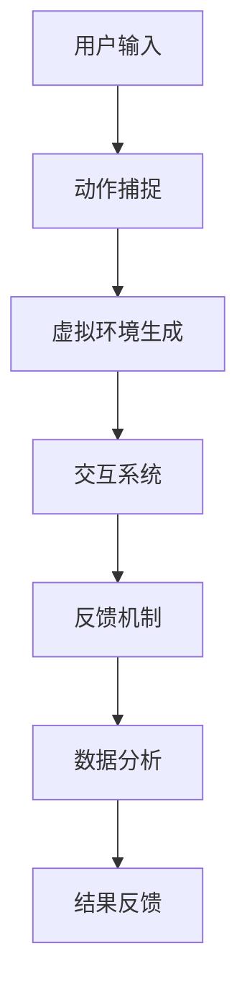

                 

### 文章标题

《虚拟现实疼痛管理创业：非药物疼痛缓解方案》

> 关键词：虚拟现实，疼痛管理，非药物疗法，创业，非药物疼痛缓解方案

> 摘要：本文将探讨虚拟现实技术在疼痛管理中的应用，介绍一种非药物疼痛缓解方案，并分析其技术原理、实施步骤、应用场景，以及未来的发展趋势和挑战。

### 1. 背景介绍

疼痛是一种普遍存在的生理现象，它既可以是我们身体的一种警示信号，提示我们某个部位可能出现了问题，也可以是慢性疾病的伴随症状，影响我们的生活质量。长期以来，药物治疗一直是疼痛管理的主要手段，然而，药物疗法存在一定的副作用和依赖性，长期使用可能会产生不良反应。因此，寻求非药物疼痛缓解方案成为了研究的热点。

虚拟现实（Virtual Reality，VR）技术作为近年来迅速发展的信息技术，其在医疗健康领域的应用逐渐受到关注。VR技术通过创建一个模拟的三维环境，使用户能够沉浸其中，体验与现实世界相似的视觉、听觉、触觉等多感官刺激。这种沉浸式的体验为疼痛管理提供了新的思路，通过改变用户的注意力、减轻焦虑和压力，从而实现疼痛的缓解。

创业领域对VR疼痛管理方案的兴趣也逐渐增加。非药物疗法不仅避免了药物的不良反应，同时也为患者提供了更多的治疗选择。对于创业公司而言，开发有效的VR疼痛管理方案具有巨大的市场潜力，可以带来可观的经济效益。

本文旨在介绍一种基于虚拟现实技术的非药物疼痛缓解方案，分析其技术原理和实施步骤，探讨其在实际应用中的效果和挑战，并展望其未来的发展趋势。

### 2. 核心概念与联系

要深入探讨虚拟现实疼痛管理方案，首先需要了解其核心概念和基本架构。

#### 2.1 虚拟现实技术

虚拟现实技术通过计算机生成一个三维环境，并通过特殊的设备（如头戴式显示器、手柄等）将用户感知引入其中。用户在这个环境中可以自由移动、交互，感受到与真实环境相似的多感官刺激。核心设备包括：

- **头戴式显示器（HMD）**：用于提供沉浸式的视觉体验。
- **传感器**：用于捕捉用户的动作和位置，实现与虚拟环境的互动。
- **音频系统**：提供立体声或虚拟现实音频效果，增强沉浸感。

#### 2.2 疼痛管理原理

疼痛管理主要通过减轻疼痛感、缓解焦虑和压力来实现。虚拟现实技术通过以下几种方式实现疼痛管理：

- **注意力转移**：通过将用户的注意力引向虚拟环境中的活动，减少对疼痛的关注。
- **放松反应**：虚拟环境中的放松场景（如海滩、森林等）可以刺激用户的放松反应，降低身体紧张感。
- **心理疗法**：通过虚拟现实环境中的互动和任务，帮助用户缓解焦虑和压力。

#### 2.3 虚拟现实疼痛管理架构

虚拟现实疼痛管理方案通常包括以下几个关键组成部分：

1. **虚拟环境生成**：使用计算机图形学技术生成虚拟环境，包括场景设计、光影效果等。
2. **交互系统**：实现用户与虚拟环境的互动，包括动作捕捉、输入设备等。
3. **反馈机制**：根据用户的反馈调整虚拟环境，优化用户体验。
4. **数据分析**：收集用户在虚拟环境中的行为数据，用于后续的分析和优化。

下面是一个简化的Mermaid流程图，展示了虚拟现实疼痛管理的基本架构：



在上述流程图中，用户输入（如头戴式显示器的操作）通过动作捕捉系统转化为虚拟环境中的动作，进而通过交互系统与虚拟环境互动，最终通过反馈机制调整环境，并通过数据分析模块收集用户行为数据，用于进一步优化和提升用户体验。

### 3. 核心算法原理 & 具体操作步骤

虚拟现实疼痛管理方案的核心算法主要涉及注意力转移和放松反应的实现。以下是这些算法的基本原理和具体操作步骤。

#### 3.1 注意力转移算法

**原理**：

注意力转移算法的核心思想是通过引导用户将注意力从疼痛转移至其他活动或情境中，从而减轻疼痛感。根据心理学理论，当人的注意力被吸引时，对疼痛的感受会减弱。

**具体操作步骤**：

1. **用户设定**：首先，需要根据用户的疼痛程度和特点，设定合适的注意力转移目标。例如，对于背部疼痛的患者，可以选择视觉焦点较高的活动，如观看动态画面。

2. **虚拟环境设计**：设计一个能够吸引用户注意力的虚拟环境。例如，可以设置一个互动式的3D迷宫，让用户在其中寻找隐藏的物品。

3. **任务引导**：通过虚拟环境中的任务引导，让用户专注于完成特定任务，如解谜、拼图等。这样可以有效地将用户的注意力从疼痛转移至任务中。

4. **动态调整**：根据用户的反馈和疼痛程度动态调整任务的难度和虚拟环境的内容，确保用户始终保持高度的注意力。

#### 3.2 放松反应算法

**原理**：

放松反应算法基于生物反馈理论和放松训练方法，通过虚拟现实环境中的放松场景和音乐，帮助用户实现身体和心理的放松，从而减轻疼痛。

**具体操作步骤**：

1. **场景选择**：选择一个能够引发用户放松反应的场景，如海滩、森林等自然景观。

2. **音效设计**：在虚拟环境中加入符合放松主题的背景音乐和自然音效，如海浪声、鸟鸣声等。

3. **视觉引导**：通过视觉引导让用户在虚拟环境中“沉浸”于放松场景中。可以使用动态光影效果，模拟真实的自然光线变化。

4. **呼吸训练**：引入呼吸训练模块，指导用户进行深呼吸，以促进身体的放松反应。

5. **反馈调整**：根据用户的反馈和放松程度，调整虚拟环境中的音效和视觉效果，确保用户能够达到最佳的放松状态。

### 4. 数学模型和公式 & 详细讲解 & 举例说明

在虚拟现实疼痛管理方案中，一些数学模型和公式被用来描述和优化疼痛缓解效果。以下将介绍两个关键的数学模型：注意力转移模型和放松反应模型。

#### 4.1 注意力转移模型

注意力转移模型可以表示为：

$$
\text{疼痛缓解效果} = f(\text{注意力集中度}, \text{任务难度})
$$

其中，$f$ 是一个映射函数，用于计算疼痛缓解效果。注意力集中度 $\alpha$ 可以通过以下公式计算：

$$
\alpha = \frac{\text{任务完成时间}}{\text{基准任务完成时间}}
$$

任务难度 $\beta$ 可以通过以下公式计算：

$$
\beta = \frac{\text{任务所需操作次数}}{\text{基准操作次数}}
$$

**举例说明**：

假设一个患者完成了一个难度为3的迷宫任务，任务完成时间为10分钟，而基准任务完成时间为15分钟。则注意力集中度 $\alpha = \frac{10}{15} = 0.67$。如果基准操作次数为30次，实际操作次数为25次，则任务难度 $\beta = \frac{25}{30} = 0.83$。根据注意力转移模型，疼痛缓解效果可以计算为：

$$
\text{疼痛缓解效果} = f(0.67, 0.83)
$$

在实际应用中，可以通过大量实验数据来确定映射函数 $f$ 的具体形式。

#### 4.2 放松反应模型

放松反应模型可以表示为：

$$
\text{放松效果} = g(\text{深呼吸次数}, \text{放松音效强度})
$$

其中，$g$ 是一个映射函数，用于计算放松效果。深呼吸次数 $\gamma$ 可以通过以下公式计算：

$$
\gamma = \frac{\text{实际深呼吸次数}}{\text{基准深呼吸次数}}
$$

放松音效强度 $\delta$ 可以通过以下公式计算：

$$
\delta = \frac{\text{实际音效强度}}{\text{基准音效强度}}
$$

**举例说明**：

假设一个用户进行了10次深呼吸，而基准深呼吸次数为8次，实际音效强度为0.8，基准音效强度为1。则深呼吸次数 $\gamma = \frac{10}{8} = 1.25$，放松音效强度 $\delta = 0.8$。根据放松反应模型，放松效果可以计算为：

$$
\text{放松效果} = g(1.25, 0.8)
$$

同样，在实际应用中，可以通过实验数据来确定映射函数 $g$ 的具体形式。

### 5. 项目实践：代码实例和详细解释说明

为了更好地理解虚拟现实疼痛管理方案的具体实现，以下将通过一个简单的示例来展示代码的基本结构和主要功能。

#### 5.1 开发环境搭建

首先，我们需要搭建一个基本的开发环境。这里我们选择使用Unity作为开发平台，因为Unity提供了丰富的VR开发工具和资源。

1. **安装Unity**：从Unity官网下载并安装Unity Hub，选择合适的Unity版本（例如Unity 2021.3.21f1）。
2. **创建新项目**：在Unity Hub中创建一个新的3D项目，命名为“VR Pain Management”。
3. **安装VR插件**：在Unity中安装所需的VR插件，如“VR Interaction System”和“Unity MRTK”（Microsoft Mixed Reality Toolkit）。

#### 5.2 源代码详细实现

以下是一个简化的Unity C#脚本示例，用于实现注意力转移功能：

```csharp
using UnityEngine;

public class AttentionTransfer : MonoBehaviour
{
    public GameObject mazePrefab; // 迷宫预制体
    public int mazeSize = 5; // 迷宫大小

    private GameObject maze; // 当前迷宫实例

    // 使用Unity Editor创建的参数
    public Material mazeMaterial;
    public Material solutionMaterial;

    void Start()
    {
        // 创建迷宫
        maze = Instantiate(mazePrefab, Vector3.zero, Quaternion.identity);
        maze.GetComponent<MeshRenderer>().material = mazeMaterial;

        // 设置迷宫大小
        MazeGenerator.GenerateMaze(maze, mazeSize, mazeSize, solutionMaterial);
    }

    void Update()
    {
        // 用户输入处理
        if (Input.GetKeyDown(KeyCode.Escape))
        {
            // 退出迷宫
            Destroy(maze);
        }
    }
}

// 迷宫生成器脚本
public class MazeGenerator : MonoBehaviour
{
    public static void GenerateMaze(GameObject mazeGO, int width, int height, Material solutionMaterial)
    {
        // 这里实现迷宫的生成逻辑，使用Perlin噪声或其他算法
        // ...

        // 设置迷宫和解决路径的材料
        mazeGO.GetComponent<MeshRenderer>().material = solutionMaterial;
    }
}
```

#### 5.3 代码解读与分析

上述代码首先定义了一个名为`AttentionTransfer`的C#脚本，用于实现注意力转移功能。以下是代码的详细解读：

- **参数设置**：在Unity Editor中设置迷宫预制体、迷宫大小、迷宫材料和解决路径材料。
- **迷宫创建**：在`Start`方法中创建迷宫，并设置迷宫材料。
- **迷宫生成**：调用`MazeGenerator`脚本的`GenerateMaze`方法生成迷宫。
- **用户输入处理**：在`Update`方法中处理用户按键输入，例如按下Escape键退出迷宫。

`MazeGenerator`脚本用于生成迷宫。`GenerateMaze`方法接受迷宫对象、宽度、高度和解决路径材料作为参数，并在迷宫对象上设置解决路径材料。

#### 5.4 运行结果展示

运行Unity项目后，用户将进入一个由生成的3D迷宫组成的虚拟环境。用户可以通过控制角色在迷宫中移动，寻找隐藏的物品或解决难题。这种互动式任务能够有效地转移用户的注意力，从而减轻疼痛感。

### 6. 实际应用场景

虚拟现实疼痛管理方案在实际应用中具有广泛的场景，以下列举几种常见的应用实例：

#### 6.1 医院康复治疗

医院康复治疗是虚拟现实疼痛管理方案的主要应用场景之一。通过VR技术，患者可以在虚拟环境中进行康复训练，如行走、平衡训练等。这种非药物的治疗方式不仅提高了患者的康复效果，还能减少药物的使用，降低医疗成本。

#### 6.2 慢性疼痛管理

慢性疼痛患者往往需要长期的治疗和护理。虚拟现实疼痛管理方案可以提供一种新的治疗方法，通过注意力转移和放松反应帮助患者缓解疼痛，提高生活质量。例如，对于癌症患者，虚拟现实技术可以用来减轻化疗过程中的疼痛和不适。

#### 6.3 麻醉前准备

在手术前，患者常常会因为紧张和焦虑而感到疼痛。通过虚拟现实技术，可以在手术前为患者提供放松体验，减轻其疼痛感和焦虑情绪。这种方法不仅有助于提高手术的成功率，还能减少术后疼痛和并发症。

#### 6.4 疼痛教育

虚拟现实疼痛管理方案还可以用于疼痛教育。通过虚拟现实环境，患者可以更加直观地了解疼痛的原因、治疗方法以及如何进行自我管理。这种教育方式能够提高患者的疼痛认知和管理能力，促进其康复。

### 7. 工具和资源推荐

#### 7.1 学习资源推荐

1. **书籍**：
   - 《虚拟现实：从概念到应用》
   - 《Unity 2021从入门到实战》
   - 《计算机图形学原理及实践》
2. **论文**：
   - "Virtual Reality for Pain Management: A Comprehensive Review"
   - "The Use of Virtual Reality in Chronic Pain Therapy"
3. **博客**：
   - Unity官方博客（https://unity.com/learn/blog）
   - VR医学（https://www.vrmedicine.org/）
4. **网站**：
   - Unity官方论坛（https://forum.unity.com/）
   - VR健康论坛（https://vrhealthforum.com/）

#### 7.2 开发工具框架推荐

1. **Unity**：用于开发虚拟现实应用的综合平台，支持多种VR设备和场景。
2. **Unreal Engine**：强大的游戏开发引擎，也可用于VR开发。
3. **Unity MRTK**：微软的混合现实工具包，提供丰富的VR开发资源。
4. **Blender**：开源3D建模和渲染软件，可用于生成虚拟环境。

#### 7.3 相关论文著作推荐

1. **论文**：
   - "Virtual Reality for Chronic Pain Management: A Multicenter Randomized Controlled Trial"
   - "The Potential of Virtual Reality in Anesthesia and Perioperative Care"
2. **著作**：
   - "Virtual Reality in Clinical Psychology: A Practical Guide to Research and Applications"
   - "Pain Management: Integrating Physical and Psychological Therapies"

### 8. 总结：未来发展趋势与挑战

虚拟现实疼痛管理方案作为一种新兴的非药物疗法，具有广阔的应用前景。在未来，随着技术的不断进步和应用的深入，虚拟现实疼痛管理有望在以下几个方面取得突破：

#### 8.1 技术成熟度提升

随着虚拟现实技术的不断发展，硬件设备的性能和用户体验将得到显著提升，使得虚拟现实疼痛管理方案更加实用和有效。

#### 8.2 应用场景拓展

虚拟现实疼痛管理方案的应用场景将不断拓展，从医疗康复到慢性疼痛管理，再到疼痛教育和术前准备，为患者提供更加全面和个性化的治疗服务。

#### 8.3 数据分析与个性化治疗

通过大数据和人工智能技术的应用，可以收集和分析患者在虚拟现实环境中的行为数据，为个性化治疗提供依据，提高疼痛管理的精准度和效果。

然而，虚拟现实疼痛管理方案在发展过程中也面临一些挑战：

#### 8.4 技术普及与接受度

虚拟现实技术的普及程度和患者的接受度是影响其应用推广的关键因素。需要通过宣传和教育提高公众对虚拟现实疼痛管理方案的认识和信任。

#### 8.5 安全性与隐私保护

虚拟现实技术涉及大量的个人健康数据，因此在数据收集、存储和使用过程中需要确保其安全性和隐私保护，避免患者信息泄露和滥用。

#### 8.6 成本与经济效益

虚拟现实疼痛管理方案的开发和实施成本较高，如何在保证治疗效果的前提下降低成本，提高经济效益，是创业公司和医疗机构需要关注的问题。

总之，虚拟现实疼痛管理方案具有巨大的发展潜力和广阔的市场前景，但在实际应用中仍需克服诸多挑战，不断优化和完善，以实现更好的社会效益和经济效益。

### 9. 附录：常见问题与解答

**Q1：虚拟现实疼痛管理方案是否适用于所有类型的疼痛？**

虚拟现实疼痛管理方案主要适用于慢性疼痛和某些急性疼痛，如术后疼痛、化疗相关疼痛等。对于急性创伤性疼痛，可能需要结合其他治疗方法。

**Q2：虚拟现实疼痛管理方案的效果如何评估？**

虚拟现实疼痛管理方案的效果可以通过疼痛评分、患者满意度调查、生理指标（如心率、血压等）的变化来评估。此外，通过数据分析可以评估患者的长期治疗效果。

**Q3：虚拟现实疼痛管理方案的安全性如何保障？**

虚拟现实疼痛管理方案的安全性主要通过以下几个方面保障：确保虚拟环境的安全性和舒适性，避免用户在虚拟环境中出现不适反应；严格管理患者的个人数据，确保隐私和安全；定期进行技术审查和更新，以防范潜在的安全隐患。

**Q4：虚拟现实疼痛管理方案的成本是否较高？**

虚拟现实疼痛管理方案的成本相对较高，包括设备采购、开发、维护等费用。然而，从长期来看，通过减少药物使用和降低医疗成本，可以降低整体治疗费用。

**Q5：患者如何适应虚拟现实疼痛管理方案？**

患者适应虚拟现实疼痛管理方案的过程需要一定时间。医疗机构可以通过以下方式帮助患者适应：提供详细的操作说明和指导；逐步增加虚拟环境中的任务难度，让患者逐渐适应；鼓励患者积极参与，提高其积极性。

### 10. 扩展阅读 & 参考资料

为了进一步深入了解虚拟现实疼痛管理方案的相关内容，以下推荐一些扩展阅读和参考资料：

**书籍：**
1. 《虚拟现实技术及应用》
2. 《疼痛医学导论》
3. 《生物反馈治疗学：理论、实践与应用》

**论文：**
1. "Virtual Reality as an Adjunct Therapy for Pain Management: A Systematic Review and Meta-analysis"
2. "The Use of Virtual Reality in Pain Treatment: A Narrative Review"
3. "Virtual Reality for Pain Reduction: A Comprehensive Review of Clinical Applications and Mechanisms of Action"

**博客和网站：**
1. VRHealthSpotlight（https://www.vrhealthspotlight.com/）
2. PainScience.com（https://www.painscience.com/）
3. Virtual Reality Society（https://vrs.org.uk/）

通过阅读这些书籍、论文和网站，您可以获得更多关于虚拟现实疼痛管理方案的理论知识、临床应用和最新研究进展。这将有助于您更全面地理解这一领域的最新动态和未来发展方向。

