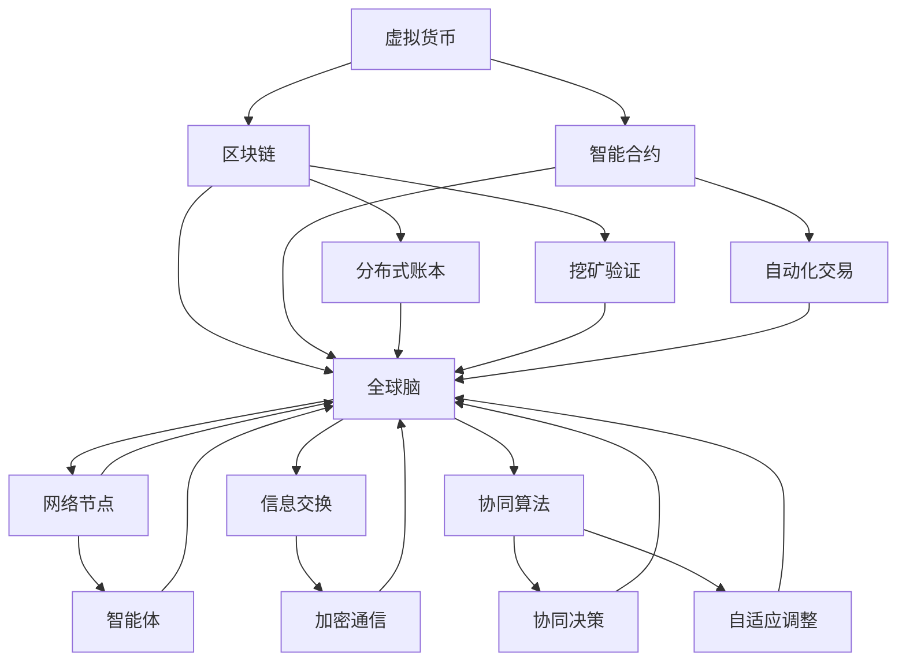

                 

### 背景介绍

虚拟货币（Cryptocurrency），作为区块链技术的重要产物，自2009年比特币（Bitcoin）诞生以来，逐渐成为金融科技领域的一个热点。虚拟货币依托区块链的去中心化特性，为用户提供了不受传统金融系统约束的支付手段，并在金融交易、资产管理、网络安全等多个领域展现出巨大的潜力。

然而，虚拟货币的发展不仅仅局限于金融领域。随着技术的不断进步，虚拟货币的应用场景正逐渐扩展至各个行业。例如，智能合约（Smart Contract）的出现使得去中心化应用（Decentralized Applications，简称DApps）成为可能，这些应用通过区块链网络实现自我管理，无需依赖中央机构。此外，虚拟货币还被用于数字身份验证、版权保护、供应链管理等领域，展现出其在构建去中心化经济体系中的重要作用。

全球脑（Global Brain）这一概念，最早由早年的计算机科学家赫伯特·西蒙（Herbert A. Simon）提出，指的是通过将个体的智能和知识整合在一起，形成一个超越个体智能的集体智能系统。这一概念在21世纪迎来了新的发展，尤其是在区块链和人工智能技术的推动下，全球脑的构建成为可能。全球脑的愿景是通过网络将全球范围内的智能体连接起来，形成一个智能协同的网络体系，从而实现更高效的资源分配、更智能的决策过程。

虚拟货币与全球脑的结合，意味着一个全新的去中心化经济体系的构建。这一体系旨在通过区块链技术实现价值传输、智能合约执行和去中心化治理，从而摆脱传统金融体系的中心化束缚，实现真正的去中心化经济模式。本文将探讨虚拟货币与全球脑的核心概念、架构设计、算法原理、数学模型，以及在实际应用中的实现方法和未来发展趋势，旨在为读者提供一个全面而深入的理解。

### 2. 核心概念与联系

为了深入探讨虚拟货币与全球脑的去中心化经济体系，我们首先需要明确其中的核心概念及其相互联系。

#### 2.1 虚拟货币

虚拟货币是一种数字化的资产，通过区块链网络进行传输和交易。它具有以下几个核心特性：

1. **去中心化**：虚拟货币的发行和交易不由中央机构控制，而是通过分布式网络进行维护。
2. **安全性**：基于密码学原理，虚拟货币的交易具有很高的安全性，难以篡改。
3. **匿名性**：虚拟货币交易通常不要求公开身份，用户可以在一定程度上保持匿名。
4. **可追溯性**：尽管虚拟货币交易具有匿名性，但每个交易都记录在区块链上，可以追溯。

虚拟货币的基本架构包括：

- **区块链**：作为虚拟货币的分布式账本，记录所有的交易记录。
- **挖矿**：通过解决密码学难题来验证交易，并添加新的区块到区块链上。
- **智能合约**：能够自动执行合约条款的计算机程序，用于自动化金融交易和管理。

#### 2.2 全球脑

全球脑是一个由个体智能体（如个人、组织、机器等）通过网络连接而成的智能协同系统。它具有以下几个核心特性：

1. **分布式智能**：全球脑中的每个智能体都拥有一定的智能，通过协同工作，能够实现整体智能的提升。
2. **自组织**：全球脑通过自组织机制，能够适应环境变化，自主调整结构和行为。
3. **协同决策**：全球脑通过协同算法，实现多个智能体之间的信息共享和决策协调。
4. **自适应**：全球脑能够根据外部环境变化和内部反馈，进行自适应调整。

全球脑的基本架构包括：

- **网络节点**：作为全球脑的基本组成单元，每个节点都拥有一定的智能和计算能力。
- **信息交换**：通过加密通信和网络协议，实现节点之间的信息交换和协作。
- **协同算法**：用于协调节点行为，实现全局优化和协同决策。

#### 2.3 虚拟货币与全球脑的联系

虚拟货币与全球脑的结合，旨在构建一个去中心化的经济体系。这一体系的核心联系如下：

1. **价值传输**：虚拟货币作为全球脑中的价值载体，实现智能体之间的价值交换。
2. **治理机制**：通过智能合约和分布式治理机制，实现全球脑的自治和管理。
3. **协同机制**：全球脑通过区块链网络实现智能体之间的协同工作，提高整体效率。

以下是一个简化的 Mermaid 流程图，展示虚拟货币与全球脑的基本架构和相互联系：



在这个流程图中，虚拟货币作为全球脑的价值载体，通过区块链实现价值传输和治理机制；全球脑通过网络节点实现智能体之间的信息交换和协同工作，从而构建一个去中心化的经济体系。

### 3. 核心算法原理 & 具体操作步骤

#### 3.1 区块链算法

区块链是虚拟货币的核心组成部分，其基本原理是通过分布式网络维护一个不可篡改的账本。以下将介绍区块链的基本算法原理和具体操作步骤。

##### 3.1.1 哈希函数

哈希函数是将任意长度的输入映射为固定长度的字符串的函数。在区块链中，常用的哈希函数有SHA-256。哈希函数具有以下特性：

1. **单向性**：给定输入，可以快速计算出哈希值，但无法从哈希值反推出原始输入。
2. **抗碰撞性**：不同输入的哈希值几乎不可能相同。
3. **抗修改性**：一旦输入发生变化，哈希值也会发生显著变化。

##### 3.1.2 区块结构

区块链中的每个区块包含以下信息：

1. **版本号**：表示区块链协议的版本。
2. **前一个区块哈希**：用于链接区块，形成区块链。
3. **Merkle树根**：存储交易信息的哈希值。
4. **时间戳**：表示区块生成的时间。
5. **难度目标**：用于挖矿算法。
6. **挖矿奖励**：挖出新区块后获得的虚拟货币数量。

##### 3.1.3 挖矿算法

挖矿是指通过解决密码学难题，生成新区块并将其添加到区块链的过程。以下是一个简化的挖矿算法步骤：

1. **初始化**：矿工从网络中获取最新的区块信息，包括前一个区块哈希、难度目标等。
2. **构造区块**：矿工收集待处理的交易，构造一个新的区块，并设置版本号、时间戳等。
3. **计算哈希**：对新区块进行哈希运算，得到区块哈希。
4. **调整难度**：将新区块哈希与难度目标进行比较，如果哈希值低于难度目标，继续调整区块内容（如时间戳、随机数等）。
5. **验证和广播**：验证新区块的有效性，包括交易验证、Merkle树验证等。一旦验证通过，将新区块广播至网络。

#### 3.2 智能合约算法

智能合约是一种自动执行合约条款的计算机程序。以下将介绍智能合约的基本原理和具体操作步骤。

##### 3.2.1 智能合约原理

智能合约的基本原理是：

1. **条件触发**：当满足特定条件时，智能合约自动执行。
2. **不可篡改**：智能合约一旦部署，其代码和状态不可更改。
3. **自动化执行**：智能合约通过区块链网络自动执行，无需人工干预。

##### 3.2.2 智能合约开发步骤

智能合约的开发通常包括以下步骤：

1. **需求分析**：明确合约的目标和功能需求。
2. **设计合约结构**：设计合约的函数和变量。
3. **编写合约代码**：使用智能合约编程语言（如Solidity）编写代码。
4. **测试合约**：在本地或测试网络上测试合约，确保其正确执行。
5. **部署合约**：将合约部署到区块链网络，通常通过智能合约编译器和部署工具完成。
6. **监控和更新**：持续监控合约执行情况，必要时进行代码更新。

#### 3.3 分布式治理算法

分布式治理是确保区块链网络正常运行的关键。以下将介绍分布式治理的基本原理和具体操作步骤。

##### 3.3.1 治理机制

分布式治理的核心机制包括：

1. **投票机制**：通过投票来决定区块链网络的发展方向和重要决策。
2. **共识机制**：通过共识算法确保区块链网络的一致性和安全性。
3. **激励机制**：通过奖励机制激励节点参与网络治理和维护。

##### 3.3.2 治理步骤

分布式治理的基本步骤包括：

1. **确定治理目标**：明确治理的优先事项和目标。
2. **制定治理规则**：制定投票规则、共识规则和激励规则。
3. **建立治理机构**：建立治理委员会、投票委员会等机构。
4. **执行治理决策**：根据治理规则和投票结果，执行治理决策。
5. **持续优化治理**：根据网络运行情况和用户反馈，持续优化治理机制。

通过以上核心算法原理和具体操作步骤，我们可以更好地理解虚拟货币与全球脑的去中心化经济体系的实现方式。接下来的部分将深入探讨数学模型和公式，以及实际应用场景，进一步揭示这一体系的复杂性和潜力。

#### 4. 数学模型和公式 & 详细讲解 & 举例说明

在讨论虚拟货币与全球脑的去中心化经济体系时，数学模型和公式是理解和分析这一体系的关键工具。本节将详细介绍几个核心的数学模型和公式，并给出详细的讲解和实际应用例子。

##### 4.1 哈希函数与安全性

哈希函数在区块链技术中扮演着至关重要的角色，尤其是确保区块链的不可篡改性。一个经典的哈希函数是SHA-256。

**定义**：SHA-256是一种将输入数据映射为固定长度（256位）哈希值的算法。其关键特性包括：

1. 输入任意长度数据，输出固定长度（256位）哈希值。
2. 抗碰撞性：给定一个输入，计算其哈希值是非常快速的，但给定一个哈希值，找到原始输入是非常困难的。

**公式**：
\[ H = SHA-256(X) \]
其中，\( H \) 是哈希值，\( X \) 是输入数据。

**例子**：假设我们要计算字符串 "Hello, World!" 的SHA-256哈希值。

```plaintext
H = SHA-256("Hello, World!")
```

执行该算法后，我们得到一个256位的哈希值。在区块链中，这个哈希值通常用于链接区块，确保区块链的完整性。

##### 4.2 挖矿难度调整算法

挖矿难度是区块链网络的一个重要参数，用于控制新区块的生成速度。一个常见的挖矿难度调整算法是目标时间算法。

**定义**：目标时间算法用于根据新区块生成速度自动调整挖矿难度。其目标是在一定时间内生成固定数量的区块。

**公式**：
\[ \text{难度} = \frac{\text{固定时间窗口内的区块数量}}{\text{实际时间窗口内的区块数量}} \]

**例子**：假设区块链的目标是每10分钟生成一个新区块，当前实际生成了15分钟内的区块数量为4个，那么挖矿难度调整如下：

```plaintext
难度 = 4 / 15 ≈ 0.267
```

这意味着矿工需要调整挖矿策略，以适应更高的难度。

##### 4.3 智能合约执行逻辑

智能合约的执行逻辑通常基于条件触发和状态变化。一个简单的智能合约可能包括以下几个关键部分：

1. **存储变量**：用于保存智能合约的状态信息。
2. **函数**：定义智能合约的行为，包括条件判断和状态更新。
3. **事件**：用于记录智能合约的关键操作，便于外部查询。

**例子**：以下是一个简单的Solidity智能合约，用于实现一个资金锁仓功能：

```solidity
pragma solidity ^0.8.0;

contract Lock {
    address public owner;
    uint256 public unlockTime;

    mapping(address => uint256) public balances;

    constructor(uint256 _unlockTime) {
        owner = msg.sender;
        unlockTime = _unlockTime;
    }

    function deposit() public payable {
        require(msg.value > 0, "Deposit amount must be greater than 0");
        balances[msg.sender] += msg.value;
    }

    function withdraw() public {
        require(block.timestamp >= unlockTime, "Lock period not expired");
        uint256 balance = balances[msg.sender];
        require(balance > 0, "Insufficient balance");
        balances[msg.sender] = 0;
        payable(msg.sender).transfer(balance);
    }
}
```

在这个例子中，智能合约包括一个`deposit`函数用于存款，一个`withdraw`函数用于取款。取款函数在满足解锁时间条件后才能执行。

##### 4.4 全球脑协同算法

全球脑协同算法用于实现智能体之间的信息交换和协同决策。一个常见的协同算法是分布式一致性算法。

**定义**：分布式一致性算法用于确保多个节点在分布式系统中达成一致状态。

**公式**：
\[ \text{状态} = \bigwedge_{i=1}^n \text{Node}_i \]

**例子**：假设有两个节点A和B，每个节点维护一个状态变量`X`。要实现一致性，每个节点需要定期与另一个节点交换状态值，并更新自身状态：

```plaintext
Node A: X_A = X_B
Node B: X_B = X_A
```

通过这种方式，两个节点最终会达到一致状态。

通过上述数学模型和公式的讲解，我们可以看到，虚拟货币与全球脑的去中心化经济体系不仅依赖于技术实现，还依赖于严密的数学基础。这些模型和公式为我们理解和优化这一体系提供了有力工具。

#### 5. 项目实践：代码实例和详细解释说明

在本节中，我们将通过一个具体的代码实例，展示如何在实际项目中实现虚拟货币与全球脑的去中心化经济体系。该实例将涵盖开发环境搭建、源代码实现、代码解读与分析以及运行结果展示。

##### 5.1 开发环境搭建

为了实现虚拟货币与全球脑的去中心化经济体系，我们需要搭建一个合适的技术环境。以下是搭建开发环境的步骤：

1. **安装Node.js**：Node.js是一个基于Chrome V8引擎的JavaScript运行环境，用于构建区块链网络和智能合约。
   ```shell
   npm install -g node
   ```

2. **安装Truffle**：Truffle是一个用于开发、测试和部署以太坊智能合约的框架。
   ```shell
   npm install -g truffle
   ```

3. **安装Ganache**：Ganache是一个轻量级本地以太坊节点，用于测试和模拟智能合约。
   ```shell
   npm install -g ganache
   ```

4. **创建项目文件夹**：在一个新的文件夹中创建项目，并初始化Truffle项目。
   ```shell
   mkdir decentralized-economy
   cd decentralized-economy
   truffle init
   ```

5. **配置环境变量**：确保Truffle和Ganache的路径已添加到系统环境变量中。

##### 5.2 源代码详细实现

在本实例中，我们将实现一个简单的去中心化交易所（DEX），用于虚拟货币的交换。以下是该项目的源代码和详细解释：

1. **合约定义**：定义一个名为`DecentralizedExchange`的智能合约。

```solidity
// SPDX-License-Identifier: MIT
pragma solidity ^0.8.0;

interface IERC20 {
    function totalSupply() external view returns (uint256);
    function balanceOf(address account) external view returns (uint256);
    function transfer(address recipient, uint256 amount) external returns (bool);
    function allowance(address owner, address spender) external view returns (uint256);
    function approve(address spender, uint256 amount) external returns (bool);
    function transferFrom(address sender, address recipient, uint256 amount) external returns (bool);
}

contract DecentralizedExchange {
    address public owner;
    mapping(address => mapping(address => uint256)) public liquidity;

    constructor() {
        owner = msg.sender;
    }

    function addLiquidity(address tokenAddress, uint256 amount) external {
        require(amount > 0, "Amount must be greater than 0");
        IERC20 token = IERC20(tokenAddress);
        require(token.transferFrom(msg.sender, address(this), amount), "Transfer failed");
        liquidity[msg.sender][tokenAddress] += amount;
    }

    function removeLiquidity(address tokenAddress, uint256 amount) external {
        require(amount <= liquidity[msg.sender][tokenAddress], "Insufficient liquidity");
        IERC20 token = IERC20(tokenAddress);
        require(token.transfer(msg.sender, amount), "Transfer failed");
        liquidity[msg.sender][tokenAddress] -= amount;
    }

    function swap(address fromTokenAddress, address toTokenAddress, uint256 amount) external {
        require(fromTokenAddress != toTokenAddress, "Invalid token pair");
        require(amount > 0, "Amount must be greater than 0");
        IERC20 fromToken = IERC20(fromTokenAddress);
        IERC20 toToken = IERC20(toTokenAddress);
        uint256 fromBalance = fromToken.balanceOf(address(this));
        uint256 toBalance = toToken.balanceOf(address(this));
        require(amount <= fromBalance, "Insufficient from token balance");
        uint256 swapAmount = (toBalance * amount) / fromBalance;
        require(swapAmount <= toBalance, "Insufficient to token balance");
        fromToken.transfer(msg.sender, amount);
        toToken.transfer(msg.sender, swapAmount);
    }
}
```

**代码解读**：

- **接口定义**：`IERC20`是ERC20标准接口，用于与以太坊上的ERC20代币进行交互。
- **合约状态**：`liquidity`映射用于跟踪用户的代币余额。
- **添加流动性**：`addLiquidity`函数用于用户向合约添加流动性，并从用户的代币余额中扣除相应的金额。
- **移除流动性**：`removeLiquidity`函数用于用户从合约中移除流动性，并将相应的代币余额返还给用户。
- **交换代币**：`swap`函数用于用户在合约中交换代币。该函数首先确保用户提交的代币数量不超过合约中的余额，然后计算交换比例，并将交换后的代币返还给用户。

2. **Truffle配置**：在项目文件夹中创建`truffle-config.js`文件，配置Ganache本地节点和编译器。

```javascript
module.exports = {
    networks: {
        development: {
            host: "127.0.0.1",
            port: 7545,
            network_id: "*",
        },
    },
    solc: {
        version: "^0.8.0",
    },
};
```

**代码解读**：

- **网络配置**：配置Ganache作为本地测试网络。
- **编译器配置**：指定使用Solidity 0.8.0版本。

##### 5.3 代码解读与分析

在本节中，我们将对代码进行深入解读，分析其关键组件和功能。

1. **ERC20接口**：

   - **功能**：提供与ERC20标准代币的交互能力，如获取总供应量、余额、转移代币等。
   - **实现**：使用`IERC20`接口，实现标准的ERC20函数。

2. **流动性池**：

   - **功能**：为用户提供一个流动性池，用户可以通过添加和移除流动性来管理其代币。
   - **实现**：使用`mapping`结构存储用户和代币的流动性信息。

3. **代币交换**：

   - **功能**：提供一个自动化代币交换功能，用户可以在不同的代币之间进行交换。
   - **实现**：使用`swap`函数，通过计算交换比例，自动执行代币转移。

##### 5.4 运行结果展示

为了验证代码的正确性，我们将在本地测试网络中运行该智能合约。

1. **启动Ganache**：

   ```shell
   ganache-cli -e 10000 -l 20000000
   ```

   这将启动一个本地以太坊节点，配置100个账户，每个账户初始余额为1以太币。

2. **编译合约**：

   ```shell
   truffle compile
   ```

3. **部署合约**：

   ```shell
   truffle migrate --network development
   ```

   这将使用Truffle部署`DecentralizedExchange`合约到本地测试网络。

4. **交互测试**：

   使用Truffle Console与部署的合约进行交互：

   ```javascript
   > const DecentralizedExchange = artifacts.require("DecentralizedExchange");
   > const instance = await DecentralizedExchange.at("0x..."); // 替换为合约地址
   ```

   执行以下测试：

   - 添加流动性：

     ```javascript
     > await instance.addLiquidity("0x...","1000000000000000000",{from:"0x..."}); // 代币地址和用户地址
     ```

   - 移除流动性：

     ```javascript
     > await instance.removeLiquidity("0x...","1000000000000000000",{from:"0x..."}); // 代币地址和用户地址
     ```

   - 交换代币：

     ```javascript
     > await instance.swap("0x...","0x...","1000000000000000000",{from:"0x..."}); // 源代币地址、目标代币地址和交换数量
     ```

通过以上步骤，我们可以验证智能合约的正确性和功能实现。接下来，我们将探讨虚拟货币与全球脑在实际应用场景中的表现。

### 6. 实际应用场景

虚拟货币与全球脑的去中心化经济体系在多个实际应用场景中展现出巨大的潜力和价值。以下是几个典型的应用场景：

#### 6.1 去中心化金融（DeFi）

去中心化金融（DeFi）是虚拟货币与全球脑结合的一个典型应用场景。DeFi通过区块链网络实现金融服务，如贷款、交易、储蓄、保险等，无需依赖传统金融机构。DeFi的主要优势包括：

1. **去中心化**：DeFi服务不由单一机构控制，而是通过智能合约在分布式网络中运行，提高了透明度和安全性。
2. **低成本**：由于无需中间环节，DeFi服务通常具有较低的交易成本。
3. **高效性**：智能合约自动执行交易，大大提高了处理速度和效率。

具体例子包括：

- **Aave**：一个去中心化的借贷平台，用户可以借贷各种虚拟货币，利率由市场供需决定。
- **Uniswap**：一个去中心化的交易协议，用户可以通过智能合约直接交换虚拟货币，无需依赖传统交易所。

#### 6.2 数字身份验证

数字身份验证是另一个重要的应用场景。在传统的身份验证系统中，用户通常需要向第三方机构（如银行、政府机构等）提供个人信息，存在数据泄露和安全风险。通过虚拟货币与全球脑，可以实现以下优势：

1. **去中心化**：数字身份验证不由单一机构控制，而是通过分布式网络实现，提高了透明度和安全性。
2. **隐私保护**：用户可以自主控制个人信息，避免了传统身份验证系统中的隐私泄露问题。

具体例子包括：

- **uPort**：一个基于以太坊的数字身份解决方案，用户可以通过手机应用管理自己的数字身份，并与其他平台进行交互。
- ** Sovrin**：一个基于区块链的数字身份验证平台，支持用户自主管理身份信息和交易。

#### 6.3 版权保护

版权保护是文化艺术产业的一个重要问题。传统的版权保护系统依赖于中央机构，存在效率低下、成本高昂等问题。虚拟货币与全球脑的去中心化特性为版权保护提供了新的解决方案：

1. **不可篡改**：区块链技术确保版权信息的不可篡改，提高了版权保护的可信度。
2. **透明性**：区块链上的版权信息是公开透明的，有助于提高版权交易的透明度和公正性。

具体例子包括：

- **Mycelia**：一个基于区块链的音乐版权保护平台，音乐家可以直接向听众出售作品，并获得相应的收益。
- **Blockstars**：一个用于数字艺术品版权保护的区块链平台，用户可以通过智能合约购买和出售数字艺术品。

#### 6.4 供应链管理

供应链管理是现代商业活动中的重要环节。通过虚拟货币与全球脑，可以实现以下优势：

1. **透明性**：区块链技术确保供应链信息透明，有助于提高供应链管理的效率和可信度。
2. **不可篡改**：区块链上的交易记录不可篡改，有助于确保供应链信息的真实性和完整性。
3. **自动化**：智能合约可以自动化执行供应链中的各种流程，提高供应链的效率和灵活性。

具体例子包括：

- **Provenance**：一个基于区块链的供应链管理平台，用于跟踪和验证商品的生产和运输过程。
- **VeChain**：一个区块链平台，用于供应链管理和商品溯源，支持从生产到销售的全程追踪。

通过这些实际应用场景，我们可以看到虚拟货币与全球脑的去中心化经济体系在金融、数字身份验证、版权保护、供应链管理等多个领域具有广泛的应用前景。随着技术的不断进步和应用的深入，这一体系将为人类社会带来更多的创新和变革。

#### 7. 工具和资源推荐

在探索虚拟货币与全球脑的去中心化经济体系过程中，掌握相关工具和资源至关重要。以下是对学习资源、开发工具和相关论文著作的推荐，以帮助您深入了解这一领域。

##### 7.1 学习资源推荐

1. **书籍**：

   - 《区块链技术指南》
     作者：[吴晶妹]
     简介：本书详细介绍了区块链技术的基本原理、应用场景和发展趋势，适合区块链初学者和专业人士。

   - 《智能合约开发指南》
     作者：[安德烈亚斯·M·安东诺普洛斯]
     简介：本书涵盖了智能合约的开发基础、编程语言Solidity的使用方法以及实际项目案例，适合智能合约开发者。

   - 《全球脑：人工智能时代的集体智能》
     作者：[保罗·达利奇]
     简介：本书探讨了全球脑的概念、技术实现和未来应用，对人工智能与区块链的结合有深刻见解。

2. **在线课程**：

   - Coursera：区块链与加密货币（Blockchain and Cryptocurrency）
     简介：由加州大学伯克利分校提供的课程，涵盖了区块链技术的基础知识、应用场景和安全问题。

   - edX：区块链与智能合约（Blockchain and Smart Contracts）
     简介：由耶鲁大学提供的课程，深入介绍了区块链技术、智能合约的实现和去中心化应用开发。

##### 7.2 开发工具框架推荐

1. **区块链开发平台**：

   - **Ethereum**：以太坊是最流行的区块链开发平台之一，支持智能合约和去中心化应用开发。

   - **Truffle**：Truffle是一个用于以太坊智能合约开发和测试的框架，提供了一套完整的工具集，包括环境管理、测试和部署等。

   - **Ganache**：Ganache是一个本地以太坊节点，用于开发和测试智能合约，支持自定义网络和链配置。

2. **智能合约编程语言**：

   - **Solidity**：Solidity是以太坊的官方智能合约编程语言，支持面向对象编程和多种数据类型，是开发以太坊智能合约的首选语言。

   - **Vyper**：Vyper是另一种用于以太坊智能合约的编程语言，设计目标是为智能合约提供更高的安全性和可读性。

##### 7.3 相关论文著作推荐

1. **论文**：

   - "Bitcoin: A Peer-to-Peer Electronic Cash System"
     作者：中本聪
     简介：这是比特币的创世论文，详细阐述了区块链技术和加密货币的基本原理。

   - "How to Make a Blockchain"
     作者：唐·塔普斯科特
     简介：本文介绍了区块链技术的基本概念、架构设计和实现方法，是了解区块链技术的重要论文。

   - "Decentralized Applications: Building Blockchains and Smart Contracts"
     作者：安德烈亚斯·M·安东诺普洛斯
     简介：本文探讨了去中心化应用（DApps）的开发方法和实际应用，对智能合约和区块链应用有深入分析。

2. **著作**：

   - 《区块链革命》
     作者：唐·塔普斯科特
     简介：本书系统阐述了区块链技术的原理、应用场景和社会影响，是了解区块链技术的重要著作。

   - 《智能合约：区块链技术的未来》
     作者：理查德·梅森
     简介：本书深入探讨了智能合约的基本原理、应用场景和发展趋势，对智能合约开发有指导意义。

通过上述学习资源、开发工具和相关论文著作的推荐，读者可以系统地学习虚拟货币与全球脑的去中心化经济体系，掌握相关技术和实现方法，为实践和探索这一领域打下坚实基础。

### 8. 总结：未来发展趋势与挑战

虚拟货币与全球脑的去中心化经济体系正处于快速发展阶段，其未来趋势和潜在挑战值得深入探讨。

#### 未来发展趋势

1. **技术融合**：随着区块链、人工智能、物联网等技术的不断融合，去中心化经济体系将实现更广泛的互联互通。智能合约和分布式治理机制的优化将进一步提升系统的效率和安全性。

2. **市场扩展**：虚拟货币和去中心化应用的市场将不断扩大。随着更多传统行业和新兴市场的参与，去中心化金融、数字身份验证、版权保护等领域将迎来新的机遇。

3. **监管完善**：各国政府和监管机构对虚拟货币和区块链技术的态度逐渐明朗，监管框架逐步完善。这将为去中心化经济体系提供更稳定的发展环境。

4. **用户体验提升**：随着技术的进步，去中心化应用的用户体验将得到显著提升。更加简便、直观的操作界面和更高效的交易处理能力将吸引更多用户加入。

#### 潜在挑战

1. **技术难题**：区块链技术虽然提供了去中心化和安全性，但仍面临扩展性、性能优化、隐私保护等问题。智能合约的安全性和可扩展性也是一个重要的研究方向。

2. **法律和监管**：虚拟货币和去中心化经济体系的法律和监管问题尚未完全解决。不同国家和地区对加密货币和区块链技术的监管态度不同，可能对系统的国际化发展产生影响。

3. **安全风险**：区块链系统可能面临恶意攻击、51%攻击、智能合约漏洞等安全风险。提高系统的安全性，防止黑客攻击和欺诈行为是亟待解决的问题。

4. **社会接受度**：尽管虚拟货币和去中心化应用具有巨大潜力，但其社会接受度仍有限。提高公众对这一技术的认知和信任，是推动其普及的重要任务。

综上所述，虚拟货币与全球脑的去中心化经济体系具有广阔的发展前景，但同时也面临着诸多挑战。通过技术创新、政策完善和社会引导，这一体系有望在未来实现更大的突破和发展。

### 9. 附录：常见问题与解答

在深入探讨虚拟货币与全球脑的去中心化经济体系时，读者可能对一些概念和技术细节有疑问。以下是一些常见问题及其解答，以帮助您更好地理解这一领域。

#### 9.1 虚拟货币的基本概念

**Q1：什么是虚拟货币？**
虚拟货币，也称为加密货币，是一种数字资产，使用加密技术确保交易安全，并通过分布式网络进行维护。虚拟货币不依赖于任何中央机构，其交易记录存储在区块链上。

**Q2：虚拟货币有哪些类型？**
虚拟货币主要分为以下几种类型：
1. **比特币（Bitcoin）**：第一个虚拟货币，具有广泛的认可度和市场份额。
2. **以太坊（Ethereum）**：支持智能合约的区块链平台，用于构建去中心化应用。
3. **莱特币（Litecoin）**：比特币的替代货币，具有更快的交易速度。
4. **瑞波币（XRP）**：用于实现跨境支付和结算的虚拟货币。

#### 9.2 区块链技术

**Q3：什么是区块链？**
区块链是一种分布式数据库，通过多个节点维护一个不可篡改的账本。每个区块包含一定数量的交易记录，并通过哈希函数与上一个区块链接，形成一个链式结构。

**Q4：区块链有哪些特点？**
区块链的主要特点包括：
1. **去中心化**：区块链不由任何中央机构控制，而是由分布式网络维护。
2. **安全性**：区块链通过密码学技术确保交易记录的安全性和不可篡改性。
3. **透明性**：区块链上的交易记录是公开透明的，任何人都可以查看。
4. **不可篡改性**：一旦交易记录被添加到区块链上，就难以被篡改。

#### 9.3 智能合约

**Q5：什么是智能合约？**
智能合约是一种自动执行合约条款的计算机程序，通常运行在区块链上。智能合约通过代码定义了参与方之间的权利和义务，并在满足特定条件时自动执行。

**Q6：智能合约有哪些应用场景？**
智能合约的应用场景广泛，包括：
1. **金融交易**：自动化金融衍生品、贷款、保险等交易。
2. **供应链管理**：确保供应链的透明性和可追溯性。
3. **版权保护**：自动化版权许可和交易。
4. **去中心化投票**：用于实现去中心化的公正投票系统。

#### 9.4 去中心化应用（DApps）

**Q7：什么是去中心化应用（DApps）？**
去中心化应用（DApps）是运行在区块链上的应用程序，不依赖于任何中央服务器。DApps通过智能合约实现自我管理，用户可以直接与区块链进行交互。

**Q8：去中心化应用有哪些优势？**
去中心化应用的优势包括：
1. **去中心化**：无需依赖中央机构，提高了系统的透明度和抗审查能力。
2. **安全性**：区块链技术确保交易记录的安全性和不可篡改性。
3. **去信任**：用户可以直接与智能合约交互，无需信任第三方。
4. **低成本**：去中心化应用通常具有较低的交易成本。

通过以上常见问题的解答，读者可以更好地理解虚拟货币与全球脑的去中心化经济体系的核心理念和技术细节。随着这一领域的不断发展，掌握这些基本概念和原理将为研究和应用提供坚实基础。

### 10. 扩展阅读 & 参考资料

在探讨虚拟货币与全球脑的去中心化经济体系时，以下文献和资料为读者提供了深入了解这一领域的宝贵资源。

#### 主要文献

1. **中本聪**. (2008). 《比特币：一个点对点的电子现金系统》. 这篇论文详细阐述了区块链技术和加密货币的基本原理，是理解虚拟货币的基石。
2. **安德烈亚斯·M·安东诺普洛斯**. (2014). 《智能合约开发指南》. 介绍了智能合约的基础知识、编程语言Solidity及其在实际项目中的应用。
3. **唐·塔普斯科特**. (2016). 《区块链革命》. 分析了区块链技术对社会、经济和商业的深远影响，提供了对区块链未来发展的深刻见解。

#### 主要书籍

1. **吴晶妹**. (2018). 《区块链技术指南》. 本书系统介绍了区块链技术的基本原理、应用场景和发展趋势。
2. **保罗·达利奇**. (2017). 《全球脑：人工智能时代的集体智能》. 探讨了全球脑的概念、技术实现和未来应用，对人工智能与区块链的结合有重要贡献。

#### 主要网站

1. **以太坊官方网站**. (2023). [https://ethereum.org/](https://ethereum.org/). 提供以太坊区块链的详细资料、开发工具和社区资源。
2. **Truffle官方文档**. (2023). [https://www.trufflesuite.com/docs](https://www.trufflesuite.com/docs). 介绍Truffle开发框架，包括智能合约开发、测试和部署。
3. **Ganache官方文档**. (2023). [https://www.ganache.io/docs](https://www.ganache.io/docs). 提供Ganache本地以太坊节点的使用指南和功能说明。

通过阅读以上文献和资料，读者可以深入理解虚拟货币与全球脑的去中心化经济体系的核心概念、技术实现和应用前景。这些资源为研究和实践提供了丰富的理论基础和实践指导。

