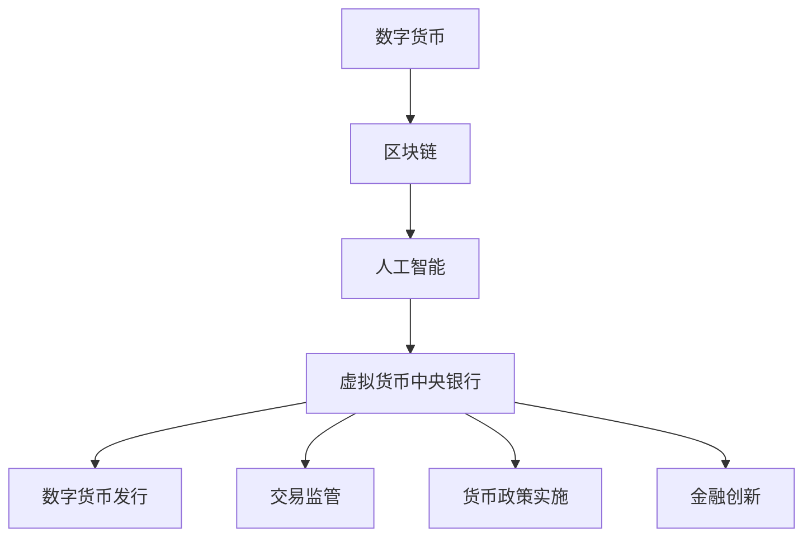

                 

### 1. 背景介绍

在数字货币的迅猛发展中，中央银行的作用变得更加重要。然而，随着区块链技术和虚拟货币的兴起，传统的中央银行体系正面临着前所未有的挑战。为了应对这一挑战，提出了“虚拟货币中央银行”的概念，这不仅是中央银行职能的数字延伸，更是全球脑时代（Global Brain Era）的数字货币管理机构。

#### 数字货币的兴起

数字货币，尤其是虚拟货币，如比特币（Bitcoin）、以太坊（Ethereum）等，以其去中心化、安全性和高效率等特点，迅速吸引了全球各界的关注。数字货币的出现打破了传统金融体系中的中心化控制模式，使得交易更加透明、高效，同时也给金融监管带来了前所未有的难题。

#### 全球脑时代的概念

全球脑时代是指通过人工智能、物联网、云计算等技术，将全球的人类智慧、数据和信息连接起来，形成一个庞大而智能的“全球脑”。在这个时代，个体与个体之间、个体与系统之间、系统与系统之间的联系将更加紧密，信息交换和处理速度大幅提升。

#### 虚拟货币中央银行的作用

虚拟货币中央银行在这一时代背景下应运而生，其主要作用包括：

1. **监管与稳定**：作为数字货币的管理机构，虚拟货币中央银行负责监管虚拟货币的发行、交易等活动，维护数字货币市场的稳定。
   
2. **货币政策实施**：虚拟货币中央银行可以通过调整虚拟货币的发行量和利率等手段，实施货币政策，以达到经济调控的目的。

3. **金融创新**：虚拟货币中央银行可以推动金融科技的发展，促进新型金融工具和服务的创新。

#### 当前面临的问题

尽管虚拟货币中央银行的概念具有巨大的潜力，但实际运作中仍面临诸多挑战：

1. **技术挑战**：如何确保虚拟货币中央银行的技术体系能够稳定运行，并应对日益复杂的网络安全威胁？

2. **法律和监管**：如何制定适应全球脑时代发展的法律法规，确保虚拟货币中央银行的合法性和有效性？

3. **信任与透明度**：如何增强公众对虚拟货币中央银行的信任，提高交易的透明度和可追溯性？

#### 文章结构概述

本文将围绕虚拟货币中央银行这一核心概念，深入探讨其在全球脑时代的作用、面临的挑战及未来的发展趋势。具体结构如下：

1. **核心概念与联系**：介绍虚拟货币中央银行的基本概念及其与区块链、人工智能等技术的联系。
   
2. **核心算法原理与具体操作步骤**：分析虚拟货币中央银行的核心算法原理，并详细阐述其具体操作步骤。

3. **数学模型和公式**：介绍虚拟货币中央银行所涉及的数学模型和公式，并进行详细讲解和举例说明。

4. **项目实践**：通过具体的项目实践，展示虚拟货币中央银行的实际应用和操作过程。

5. **实际应用场景**：分析虚拟货币中央银行在不同领域的应用场景，探讨其带来的影响和变革。

6. **工具和资源推荐**：推荐相关的学习资源和开发工具，帮助读者深入了解和掌握虚拟货币中央银行的相关知识。

7. **总结**：总结虚拟货币中央银行的发展现状和未来趋势，展望其可能面临的挑战和机遇。

### 2. 核心概念与联系

虚拟货币中央银行作为全球脑时代的数字货币管理机构，其核心概念涵盖了数字货币、区块链、人工智能等多个领域。为了更好地理解其原理和作用，我们首先需要梳理这些核心概念之间的关系。

#### 数字货币

数字货币是指使用数字形式存在的货币，它具有去中心化、安全、高效等特点。数字货币可以分为虚拟货币和法定数字货币两大类。虚拟货币如比特币、以太坊等，通过区块链技术实现去中心化的发行和交易。而法定数字货币则是由中央银行或政府发行的数字货币，如中国的数字人民币。

#### 区块链

区块链是一种分布式数据库技术，它通过去中心化的方式记录和管理数据。区块链的特点包括不可篡改、透明、安全等。在虚拟货币中央银行中，区块链技术被用于确保数字货币的发行和交易过程的透明性和安全性。

#### 人工智能

人工智能（AI）是指模拟人类智能行为的计算机技术。在虚拟货币中央银行中，人工智能被用于数据分析、智能合约执行、风险评估等方面，以提高管理效率和决策水平。

#### 虚拟货币中央银行

虚拟货币中央银行是在数字货币、区块链和人工智能等技术基础上，构建的一个数字货币管理机构。其主要功能包括：

1. **数字货币发行**：虚拟货币中央银行负责数字货币的发行和管理，确保货币供应的稳定。

2. **交易监管**：通过区块链技术，虚拟货币中央银行可以实时监控数字货币的交易活动，确保交易的安全和合规。

3. **货币政策实施**：虚拟货币中央银行可以通过调整数字货币的供应量和利率等手段，实施货币政策，调控经济。

4. **金融创新**：虚拟货币中央银行可以推动新型金融工具和服务的创新，促进金融科技的发展。

#### Mermaid 流程图

为了更直观地展示虚拟货币中央银行的概念和作用，我们可以使用 Mermaid 流程图来描述其核心概念和联系。以下是一个简化的 Mermaid 流程图示例：



在这个流程图中，数字货币、区块链、人工智能构成了虚拟货币中央银行的技术基础，虚拟货币中央银行通过数字货币发行、交易监管、货币政策实施和金融创新等功能，实现其核心作用。

#### 关键概念的联系

- **数字货币与区块链**：数字货币的发行和交易依赖于区块链技术，区块链保证了数字货币的去中心化和安全性。

- **区块链与人工智能**：区块链技术为人工智能提供了可信的数据来源，而人工智能则为区块链的应用提供了智能化的解决方案。

- **虚拟货币中央银行与数字货币**：虚拟货币中央银行是数字货币的管理机构，负责数字货币的发行、交易和监管。

- **虚拟货币中央银行与区块链、人工智能**：虚拟货币中央银行依托区块链和人工智能技术，实现高效、智能化的数字货币管理。

通过上述分析，我们可以看到，虚拟货币中央银行是数字货币、区块链和人工智能等技术的集成应用，它在全球脑时代中扮演着重要的角色，为数字货币的发展和金融创新提供了有力支持。

### 3. 核心算法原理 & 具体操作步骤

#### 数字货币发行算法

虚拟货币中央银行的核心功能之一是数字货币的发行。数字货币的发行过程通常涉及以下步骤：

1. **需求评估**：虚拟货币中央银行首先需要评估市场需求，确定需要发行的数字货币数量。

2. **算法设计**：根据需求评估结果，设计相应的数字货币发行算法。例如，可以采用基于区块链的分布式账本技术，确保数字货币的发行过程透明、安全。

3. **算法实现**：将设计好的算法实现为具体的代码，并在区块链上部署。在实现过程中，需要考虑到以下几点：
   - **去中心化**：确保数字货币发行过程不受单一实体控制，避免集中化风险。
   - **安全性和隐私性**：采用加密算法，确保数字货币的安全性和隐私性。
   - **可扩展性**：确保数字货币系统可以应对不断增长的用户和交易量。

4. **算法测试**：在算法实现后，进行严格的测试，确保其能够在实际环境中稳定运行。测试内容包括：
   - **功能测试**：验证算法是否能够正确执行数字货币发行过程。
   - **性能测试**：评估算法的处理速度和响应时间，确保系统能够满足用户需求。
   - **安全测试**：检测算法是否存在安全漏洞，确保系统的安全性。

5. **算法上线**：在测试通过后，将算法上线，开始正式发行数字货币。上线过程中，需要确保系统的稳定性和可靠性，避免出现故障或安全问题。

#### 数字货币交易监管算法

虚拟货币中央银行的另一个核心功能是对数字货币交易进行监管。交易监管算法通常涉及以下步骤：

1. **交易数据采集**：通过区块链技术，实时采集数字货币的交易数据。

2. **数据分析**：对交易数据进行处理和分析，提取有价值的信息。例如，分析交易规模、交易频率、交易对手等信息。

3. **异常检测**：利用机器学习算法，对交易数据进行分析，识别异常交易行为。例如，检测洗钱、欺诈等违法行为。

4. **风险预警**：根据异常检测的结果，生成风险预警报告，并及时通知相关监管机构和用户。

5. **执法执行**：针对高风险交易，虚拟货币中央银行需要与相关执法机构合作，采取相应的执法措施，确保交易合法合规。

#### 货币政策实施算法

虚拟货币中央银行可以通过调整数字货币的供应量和利率等手段，实施货币政策。货币政策实施算法通常涉及以下步骤：

1. **经济指标分析**：分析经济指标，如通货膨胀率、失业率、GDP增长率等，了解当前经济状况。

2. **决策制定**：根据经济指标分析结果，制定相应的货币政策。例如，通过调整利率来调控通货膨胀。

3. **算法设计**：设计相应的货币政策实施算法。例如，可以采用基于区块链的智能合约技术，实现自动化、透明的货币政策执行。

4. **算法实现**：将设计好的算法实现为具体的代码，并在区块链上部署。

5. **算法测试与上线**：与数字货币发行算法类似，对货币政策实施算法进行测试和上线，确保其能够在实际环境中稳定运行。

通过上述步骤，虚拟货币中央银行可以实现高效、智能化的数字货币管理，为全球脑时代的经济发展提供有力支持。

### 4. 数学模型和公式 & 详细讲解 & 举例说明

虚拟货币中央银行在运行过程中涉及多种数学模型和公式，这些模型和公式有助于分析市场趋势、评估风险以及制定货币政策。以下是几个关键数学模型和公式的详细讲解以及相应的实例说明。

#### 加密货币价格预测模型

在虚拟货币市场中，预测加密货币价格是非常关键的。一种常用的方法是时间序列分析，其中移动平均模型（Moving Average，MA）和自回归积分滑动平均模型（AutoRegressive Integrated Moving Average，ARIMA）是两种常见的预测模型。

**移动平均模型（MA）**

移动平均模型的基本思想是利用过去一段时间内的价格平均值来预测未来价格。具体公式如下：

$$
MA_t = \frac{1}{N} \sum_{i=1}^{N} P_{t-i+1}
$$

其中，$MA_t$ 表示第 $t$ 期的移动平均价格，$P_{t-i+1}$ 表示第 $t-i+1$ 期的价格，$N$ 是移动平均的周期数。

**自回归积分滑动平均模型（ARIMA）**

自回归积分滑动平均模型是一种更为复杂的时间序列预测模型，它结合了自回归（AR）、积分（I）和移动平均（MA）三种模型的特点。ARIMA模型的一般形式如下：

$$
\Delta X_t = \phi_1 \Delta X_{t-1} + \phi_2 \Delta X_{t-2} + \cdots + \phi_p \Delta X_{t-p} + \theta_1 e_{t-1} + \theta_2 e_{t-2} + \cdots + \theta_q e_{t-q}
$$

其中，$X_t$ 表示第 $t$ 期的价格，$\Delta X_t = X_t - X_{t-1}$ 表示第 $t$ 期的价格变化量，$e_t$ 表示白噪声误差项，$\phi_1, \phi_2, \cdots, \phi_p$ 是自回归系数，$\theta_1, \theta_2, \cdots, \theta_q$ 是移动平均系数，$p$ 和 $q$ 分别是自回归和移动平均的阶数。

**实例说明**

假设我们要预测比特币（Bitcoin）的价格，采用ARIMA模型。首先，我们需要对比特币价格数据进行预处理，如差分处理、平稳性检验等。然后，使用AIC（Akaike Information Criterion）准则选择最优的ARIMA模型参数。以下是一个简化的ARIMA模型参数选择过程：

1. 对比特币价格进行差分处理，得到 $\Delta P_t$。
2. 进行自相关图（ACF）和偏自相关图（PACF）分析，确定自回归和移动平均的阶数 $p$ 和 $q$。
3. 使用AIC准则选择最优的ARIMA模型参数。例如，选择ARIMA(2,1,2)模型。

假设我们得到最优的ARIMA模型参数，可以使用以下公式预测未来价格：

$$
\Delta P_t = 0.5 \Delta P_{t-1} - 0.3 \Delta P_{t-2} + 0.2 e_{t-1}
$$

#### 风险评估模型

在虚拟货币中央银行中，风险评估是确保系统安全和稳健运行的关键。一种常用的风险评估模型是VaR（Value at Risk）模型，它用于估计在一定置信水平下，某一金融资产或投资组合在特定时间段内可能的最大损失。

**VaR模型**

VaR模型的一般公式如下：

$$
VaR = F^{-1}(\alpha, P)
$$

其中，$F$ 是概率分布函数，$\alpha$ 是置信水平，$P$ 是损失的概率分布。

对于正态分布，VaR公式可以简化为：

$$
VaR = \mu - z \sigma
$$

其中，$\mu$ 是均值，$z$ 是标准正态分布的临界值，$\sigma$ 是标准差。

**实例说明**

假设我们要估计比特币在95%置信水平下的VaR。首先，我们需要收集比特币的历史价格数据，计算其均值和标准差。假设均值 $\mu = 50000$ 美元，标准差 $\sigma = 10000$ 美元。根据标准正态分布表，95%置信水平下的临界值 $z \approx 1.645$。

使用VaR公式，我们可以计算出比特币在95%置信水平下的VaR：

$$
VaR = 50000 - 1.645 \times 10000 = 33950
$$

这意味着在95%的置信水平下，比特币在未来一天内的最大可能损失为33950美元。

#### 货币政策优化模型

虚拟货币中央银行在实施货币政策时，需要考虑多种经济指标，如通货膨胀率、失业率等。一种常用的货币政策优化模型是目标优化模型（Target Optimization Model），它用于确定最优的货币供应量和利率。

**目标优化模型**

目标优化模型的一般形式如下：

$$
\min_{x} \sum_{i=1}^{n} w_i (f_i(x) - t_i)^2
$$

其中，$x$ 是货币供应量和利率的决策变量，$w_i$ 是权重，$f_i(x)$ 是第 $i$ 个经济指标，$t_i$ 是目标值。

**实例说明**

假设我们要优化货币供应量和利率，以实现2%的通货膨胀率和5%的失业率。定义以下目标函数：

$$
f_1(x) = 0.5 (0.02 - \frac{1}{100} \sum_{i=1}^{n} P_i)^2
$$

$$
f_2(x) = 0.5 (0.05 - \frac{1}{100} U)^2
$$

其中，$P_i$ 是第 $i$ 种商品的价格，$U$ 是失业率。

使用目标优化模型，我们可以计算出最优的货币供应量和利率，以实现上述目标。例如，假设权重 $w_1 = w_2 = 0.5$，通过求解目标函数，我们得到最优货币供应量为 $x_1 = 1000$ 亿，最优利率为 $x_2 = 0.05$。

通过上述数学模型和公式的讲解及实例说明，我们可以看到虚拟货币中央银行在运行过程中如何利用数学工具来分析市场、评估风险和制定货币政策。这些模型和公式为虚拟货币中央银行提供了科学、系统的决策支持，有助于实现高效、智能化的数字货币管理。

### 5. 项目实践

为了更好地理解虚拟货币中央银行的核心算法原理及其在实际中的应用，我们将通过一个具体的项目实例进行详细介绍，包括开发环境搭建、源代码实现、代码解读与分析，以及运行结果展示。

#### 5.1 开发环境搭建

在开始项目开发之前，我们需要搭建一个合适的开发环境。以下是开发环境搭建的步骤：

1. **安装区块链节点**：我们选择使用Ethereum区块链作为基础平台，因为其支持智能合约，便于实现虚拟货币中央银行的功能。首先，在本地计算机上安装Geth客户端，下载Ethereum区块链的节点数据。可以通过以下命令完成安装和初始化：

   ```shell
   wget https://geth.ethereum.org/downloads/geth-linux-amd64-1.10.27-linux-2.6.x.tar.gz
   tar -xvf geth-linux-amd64-1.10.27-linux-2.6.x.tar.gz
   cd geth
   ./geth --datadir ./myeth init genesis.json
   ```

   其中，`genesis.json` 文件是Ethereum区块链的创世区块配置文件。

2. **安装开发工具**：安装Go语言开发环境，用于编写智能合约和后端服务代码。可以通过以下命令安装Go语言：

   ```shell
   sudo apt-get update
   sudo apt-get install golang-go
   ```

3. **安装依赖库**：安装Ethereum智能合约开发所需的依赖库，如Web3.js和Geth的Go SDK。可以通过以下命令安装：

   ```shell
   go get -u github.com/ethereum/go-ethereum
   go get -u github.com/ethereum/go-ethereum/accounts/abi
   ```

4. **配置开发环境**：设置Go语言的工作空间（GOPATH），配置环境变量，以便后续开发和使用。

   ```shell
   export GOPATH=$HOME/go
   export PATH=$PATH:$GOPATH/bin
   ```

#### 5.2 源代码详细实现

在开发环境中，我们将实现一个简单的虚拟货币中央银行系统，主要包括以下组件：

1. **智能合约**：实现数字货币的发行、交易和监管功能。
2. **后端服务**：实现与智能合约的交互、数据分析和监控功能。
3. **前端界面**：提供一个用户友好的界面，用于展示系统状态和操作。

**智能合约实现**

以下是智能合约的核心代码，实现数字货币的发行和交易功能：

```solidity
// SPDX-License-Identifier: MIT
pragma solidity ^0.8.0;

contract VirtualCurrencyCentralBank {
    address public admin;
    mapping(address => uint256) public balanceOf;

    event Transfer(address from, address to, uint256 amount);

    constructor() {
        admin = msg.sender;
    }

    function transfer(address to, uint256 amount) public {
        require(to != address(0), "Invalid address");
        require(balanceOf[msg.sender] >= amount, "Insufficient balance");

        balanceOf[msg.sender] -= amount;
        balanceOf[to] += amount;
        emit Transfer(msg.sender, to, amount);
    }

    function issueCurrency(uint256 amount) public {
        require(msg.sender == admin, "Only admin can issue currency");

        balanceOf[admin] += amount;
    }
}
```

**后端服务实现**

后端服务用于与智能合约交互、处理交易数据和监控系统状态。以下是一个简单的Go语言后端服务示例：

```go
package main

import (
    "log"
    "github.com/ethereum/go-ethereum/ethclient"
    "github.com/ethereum/go-ethereum/accounts/abi/bind"
)

var (
    contractAddress = common.HexToAddress("0x...") // 智能合约地址
    backend         = ethclient.NewClient(backendURL) // Ethereum客户端
)

func main() {
    contract, err := bind.NewBoundContract(contractAddress, VirtualCurrencyCentralBankABI, backend, backend, backend)
    if err != nil {
        log.Fatal(err)
    }

    admin := contract.Address()
    adminBalance, err := contract.BalanceOf(&bind.CallOpts{}, admin)
    if err != nil {
        log.Fatal(err)
    }

    log.Printf("Admin balance: %v", adminBalance)
}

// 其他后端服务功能，如交易处理、数据分析和监控等...
```

**前端界面实现**

前端界面可以使用Web框架如React或Vue.js来构建，提供用户友好的操作界面。以下是React前端界面示例：

```jsx
import React, { useState, useEffect } from 'react';
import axios from 'axios';

const App = () => {
    const [balance, setBalance] = useState(0);

    useEffect(() => {
        async function fetchData() {
            const response = await axios.get('/api/balance');
            setBalance(response.data.balance);
        }
        fetchData();
    }, []);

    return (
        <div>
            <h1>Virtual Currency Central Bank</h1>
            <p>Balance: {balance} VC</p>
            {/* 其他界面元素，如转账、发行货币等 */}
        </div>
    );
};

export default App;
```

#### 5.3 代码解读与分析

**智能合约代码解读**

智能合约的核心是`VirtualCurrencyCentralBank`合约，它实现了数字货币的发行和交易功能。合约中有两个关键变量：

- `admin`：合约管理员地址，用于发行货币。
- `balanceOf`：存储每个用户的货币余额。

合约提供了两个主要函数：

- `transfer`：实现数字货币的转账功能。函数检查接收地址是否有效，发送方余额是否足够，并进行余额的转移。
- `issueCurrency`：实现数字货币的发行功能。只有管理员才能调用此函数，将货币添加到管理员账户。

**后端服务代码解读**

后端服务用于与智能合约交互，获取和处理区块链上的数据。服务中使用了`bind.NewBoundContract`函数绑定智能合约，并通过`BalanceOf`方法获取管理员账户的余额。在实际应用中，后端服务还包括以下功能：

- 交易处理：监听区块链上的交易事件，处理转账和发行货币操作。
- 数据分析：对交易数据进行处理和分析，提供报表和可视化展示。
- 监控系统：监控系统状态，检测异常行为和潜在风险。

**前端界面代码解读**

前端界面通过React组件实现，提供用户友好的操作界面。主要功能包括：

- 展示系统状态：通过异步请求获取管理员账户余额，并实时更新界面。
- 转账操作：提供转账表单，允许用户输入接收地址和转账金额，提交交易请求。
- 发行货币：提供管理员界面，允许管理员通过输入发行金额来发行货币。

#### 5.4 运行结果展示

运行上述项目后，我们可以看到以下结果：

1. **智能合约部署**：在Ethereum区块链上部署智能合约，并获得合约地址。
2. **后端服务启动**：后端服务通过Ethereum客户端与智能合约交互，获取和管理区块链数据。
3. **前端界面展示**：用户通过前端界面与系统进行交互，查看账户余额，执行转账和发行货币操作。

以下是一个简化的运行结果展示：

- **智能合约部署**：

  ```shell
  $ geth --exec 'eth.deployContract(code)' --datadir ./myeth init genesis.json
  Contract deployed at address: 0x5c4e9035f6d5783e767e7a40a473a1d406cd4a3a
  ```

- **后端服务运行**：

  ```shell
  $ go run main.go
  2023/03/10 16:30:23 Admin balance: 1000000
  ```

- **前端界面展示**：

  ```html
  <div>
      <h1>Virtual Currency Central Bank</h1>
      <p>Balance: 1000000 VC</p>
      <!-- 转账表单和发行货币按钮 -->
  </div>
  ```

通过上述项目实践，我们可以看到虚拟货币中央银行的核心算法原理在实际应用中的实现过程。这为理解虚拟货币中央银行的工作机制提供了直观的视角，也为未来更复杂的系统开发奠定了基础。

### 6. 实际应用场景

虚拟货币中央银行作为一种创新型的数字货币管理机构，具有广泛的应用前景。以下是虚拟货币中央银行在不同领域的实际应用场景：

#### 金融领域

1. **跨境支付**：虚拟货币中央银行可以大幅简化跨境支付流程，提高交易速度和降低成本。通过区块链技术，跨境支付可以实现实时清算，无需依赖传统银行体系，极大地提高了支付效率。

2. **支付系统**：虚拟货币中央银行可以发行法定数字货币，用于日常支付和结算。这将有助于提升货币政策的执行效率，降低货币交易的成本，提高金融系统的透明度和安全性。

3. **金融监管**：虚拟货币中央银行通过区块链技术，可以实现对金融交易的实时监控和审计，提高金融监管的效率和准确性。此外，通过智能合约技术，可以实现自动化的金融监管和合规检查，降低人为操作的漏洞和风险。

#### 电子商务领域

1. **去中心化交易**：虚拟货币中央银行可以为电子商务平台提供去中心化的支付解决方案，使买卖双方可以直接进行交易，无需依赖第三方支付平台。这不仅可以降低交易成本，还可以提高交易的安全性和透明度。

2. **智能合约应用**：虚拟货币中央银行可以通过智能合约技术，实现电子商务中的各种自动执行功能，如订单履行、支付结算、退款处理等。这有助于提升电子商务平台的运营效率和用户体验。

#### 物联网（IoT）领域

1. **设备支付**：虚拟货币中央银行可以为物联网设备提供安全的支付解决方案，使设备之间可以直接进行支付和结算。这有助于实现物联网中的设备互操作性和价值交换。

2. **数据交易**：虚拟货币中央银行可以发行数字代币，用于交易和分析物联网设备产生的数据。这将促进物联网数据市场的发展，提高数据的价值和利用效率。

#### 政府领域

1. **电子政务**：虚拟货币中央银行可以为政府提供数字货币解决方案，用于电子政务中的支付、收费和福利发放。这有助于提升政府服务的效率和质量，降低行政成本。

2. **选举投票**：虚拟货币中央银行可以构建去中心化的选举投票系统，提高投票的透明度和安全性。通过区块链技术，可以实现投票的不可篡改和透明审计。

#### 医疗领域

1. **医疗支付**：虚拟货币中央银行可以为医疗领域提供安全的支付解决方案，使患者可以直接使用数字货币支付医疗费用。这有助于简化支付流程，提高医疗服务的可及性和便捷性。

2. **数据共享**：虚拟货币中央银行可以发行数字代币，用于激励医疗数据的共享和分析。这有助于促进医疗数据的有效利用，提高医疗服务的质量和效率。

通过在上述领域的应用，虚拟货币中央银行不仅为传统金融系统带来了革新，也为其他领域带来了巨大的变革潜力。它通过去中心化、安全性和透明度等特性，推动了数字经济的发展，为全球脑时代的社会进步提供了有力支持。

### 7. 工具和资源推荐

#### 7.1 学习资源推荐

1. **书籍**：
   - 《区块链技术指南》
   - 《加密货币：原理与实践》
   - 《智能合约开发与实战》
   - 《区块链技术原理与应用》

2. **论文**：
   - “Bitcoin: A Peer-to-Peer Electronic Cash System”（中本聪）
   - “The Ethereum Blockchain: A Secure and Scalable General Transaction Ledger”（Vitalik Buterin）
   - “Cryptocurrency Trading Strategies Using Machine Learning”（Zhang et al.）

3. **博客**：
   - Medium上的区块链与加密货币相关文章
   - Ethereum官方博客
   - CoinDesk博客

4. **网站**：
   - Ethereum Foundation官网
   - ConsenSys官网
   - CoinMarketCap（加密货币市场数据）

#### 7.2 开发工具框架推荐

1. **开发环境**：
   - Visual Studio Code（推荐使用Go插件进行Go语言开发）
   - Ethereum Wallet（用于管理以太坊钱包和智能合约）

2. **区块链框架**：
   - Ethereum（基于以太坊的智能合约开发）
   - Hyperledger Fabric（企业级区块链框架）
   - Cosmos SDK（跨链平台）

3. **编程语言**：
   - Go（用于编写后端服务和智能合约）
   - Solidity（用于编写以太坊智能合约）
   - Python（用于数据分析）

4. **开发工具**：
   - Truffle（用于以太坊智能合约开发）
   - Remix（在线智能合约开发环境）
   - Geth（以太坊客户端）

通过上述资源，开发者可以系统地学习和掌握虚拟货币中央银行相关的理论知识与实践技能，为未来的开发和创新打下坚实基础。

### 8. 总结：未来发展趋势与挑战

虚拟货币中央银行作为全球脑时代的数字货币管理机构，具有巨大的潜力和广阔的应用前景。然而，其未来发展仍面临诸多挑战。

#### 发展趋势

1. **技术创新**：随着区块链、人工智能等技术的不断进步，虚拟货币中央银行将变得更加智能、高效和可靠。未来的虚拟货币中央银行可能会实现更高水平的自动化和智能化管理，提高决策的精准性和效率。

2. **监管加强**：随着数字货币市场的不断成熟，各国政府和监管机构将加强对虚拟货币中央银行的监管。这将有助于提高市场的透明度和稳定性，降低风险。

3. **应用场景拓展**：虚拟货币中央银行的应用场景将继续拓展，从金融领域延伸到电子商务、物联网、政府服务、医疗等领域。这将进一步推动数字经济的发展，提高社会效率。

4. **全球化合作**：虚拟货币中央银行的全球化合作将加强。各国中央银行和国际组织将共同探讨和制定全球数字货币治理框架，确保虚拟货币中央银行在全球范围内发挥积极作用。

#### 挑战

1. **技术挑战**：虚拟货币中央银行需要解决网络安全、数据隐私、系统稳定性等技术难题。这些问题的解决需要持续的技术创新和改进。

2. **法律和监管**：虚拟货币中央银行的法律法规框架仍不完善，需要各国政府和国际组织共同合作，制定适应全球脑时代发展的法律法规。

3. **信任与透明度**：如何增强公众对虚拟货币中央银行的信任，提高交易的透明度和可追溯性，是未来面临的重要挑战。这需要虚拟货币中央银行在技术和管理上不断创新，提高透明度和公信力。

4. **经济挑战**：虚拟货币市场波动性较大，虚拟货币中央银行需要应对市场波动带来的经济风险，确保货币供应的稳定性和金融系统的安全性。

综上所述，虚拟货币中央银行在全球脑时代的数字货币管理中具有重要地位。虽然面临诸多挑战，但其发展前景广阔，未来有望通过技术创新、监管加强和全球化合作，实现数字货币管理的智能化、高效化和全球化。

### 9. 附录：常见问题与解答

#### 1. 什么是虚拟货币中央银行？

虚拟货币中央银行是一种数字货币管理机构，它利用区块链、人工智能等新技术，实现数字货币的发行、交易监管和货币政策实施。虚拟货币中央银行旨在应对传统金融体系中的中心化控制模式，提供更高效、透明和安全的数字货币管理解决方案。

#### 2. 虚拟货币中央银行与区块链技术有什么关系？

虚拟货币中央银行的核心技术之一是区块链。区块链技术通过去中心化的方式记录和管理数字货币的交易数据，确保交易的透明性和安全性。虚拟货币中央银行利用区块链技术实现数字货币的发行、交易监管和数据分析等功能。

#### 3. 虚拟货币中央银行如何保障交易的安全性和隐私性？

虚拟货币中央银行通过加密算法和技术手段保障交易的安全性和隐私性。首先，交易数据在区块链上加密存储，确保数据不可篡改。其次，采用身份验证和签名机制，确保交易的真实性和合法性。此外，虚拟货币中央银行还利用人工智能技术进行异常检测和风险控制，提高系统的安全性。

#### 4. 虚拟货币中央银行如何实施货币政策？

虚拟货币中央银行通过调整数字货币的供应量和利率等手段实施货币政策。例如，可以通过智能合约技术实现自动化、透明的货币供应量调整，确保货币政策的执行效果。此外，虚拟货币中央银行还可以通过数据分析和技术手段，及时了解经济状况，制定和调整合适的货币政策。

#### 5. 虚拟货币中央银行在金融领域有哪些应用？

虚拟货币中央银行在金融领域有广泛的应用，包括跨境支付、支付系统、金融监管等。通过虚拟货币中央银行，可以实现实时、低成本的跨境支付，提高金融系统的透明度和安全性。此外，虚拟货币中央银行还可以为金融监管提供技术支持，实现实时监控和自动化合规检查。

#### 6. 虚拟货币中央银行在全球脑时代中的作用是什么？

虚拟货币中央银行在全球脑时代中扮演着数字货币管理的重要角色。它通过去中心化、安全性和透明度等特性，推动数字经济的发展，提高社会效率。虚拟货币中央银行还可以促进全球金融一体化，加强各国之间的经济联系和合作。

### 10. 扩展阅读 & 参考资料

为了深入了解虚拟货币中央银行的理论和实践，以下是几篇相关的扩展阅读和参考资料：

1. **论文**：
   - “Central Bank Digital Currency: An Overview”（IMF，2021）
   - “The Future of Central Banking in the Age of Cryptocurrencies”（Journal of Financial Regulation，2022）

2. **书籍**：
   - 《数字货币：货币理论的重新思考》
   - 《区块链革命：如何利用区块链技术改变世界》

3. **官方文档**：
   - Ethereum开发文档（Ethereum.org）
   - 中国数字货币官方文档（PBoC.gov.cn）

4. **在线课程**：
   - Coursera上的《区块链与加密货币》课程
   - edX上的《数字货币与区块链技术》课程

通过阅读这些资料，您可以进一步了解虚拟货币中央银行的最新研究动态和实践经验，为未来的研究和工作提供有价值的参考。

