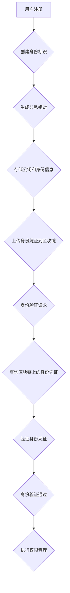
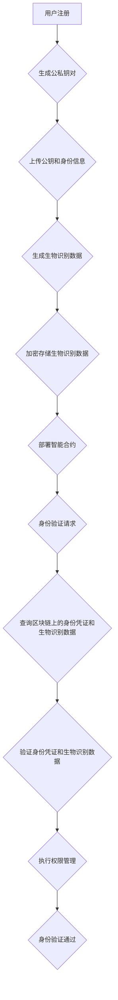
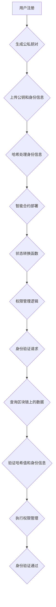

                 

### 背景介绍 ###

#### 蚂蚁集团与区块链技术的关系

蚂蚁集团（Ant Group），作为中国领先的金融科技巨头，其业务涵盖了支付、金融科技、云计算、智能物流等多个领域。蚂蚁集团在区块链技术的应用和研发方面具有深厚的积累，已成为全球区块链技术创新的重要推动者之一。在数字身份领域，蚂蚁集团致力于通过区块链技术实现用户的身份可信验证和隐私保护，从而提升用户体验与安全性。

数字身份，即个体在数字世界中的身份表示，它不仅包括身份信息的验证，还涉及个人隐私保护、数据共享和数据使用授权等多个方面。在传统模式中，数字身份的创建和管理往往依赖于中心化的机构，如银行、政府部门等，这可能导致数据泄露和滥用的问题。区块链技术以其去中心化、不可篡改和透明性等特点，为构建可信的数字身份提供了新的解决方案。

#### 区块链技术在数字身份中的应用

区块链技术在数字身份中的应用主要体现在以下几个方面：

1. **身份验证**：通过区块链技术，可以确保用户身份信息的真实性和唯一性。每个用户都拥有一个独特的身份标识（如公钥），与其身份信息绑定，其他用户或机构可以验证该身份标识的真实性，但无法获取用户的私钥和具体信息。

2. **隐私保护**：区块链技术提供了用户隐私保护的手段。用户的个人信息以加密形式存储在区块链上，只有用户自己拥有解密密钥，其他用户或机构无法直接访问这些信息。

3. **数据共享**：区块链技术使得跨机构、跨地域的数据共享变得更加容易和可靠。用户可以授权将自己的身份信息分享给特定机构或服务提供商，而这些操作在区块链上都有迹可循，确保了数据的透明性和安全性。

4. **数据使用授权**：区块链技术可以帮助用户更好地控制自己的数据使用。用户可以对自己的数据访问和使用的权限进行设定，确保数据在被使用时符合其预期和授权范围。

#### 蚂蚁2025数字身份社招区块链工程师面试题的背景

蚂蚁集团在2025年社招区块链工程师的面试题，不仅考察了应聘者对区块链技术的理解，还关注了其在数字身份领域的应用。这些面试题旨在评估应聘者的技术深度、实际问题解决能力和创新思维。通过这些面试题，蚂蚁集团希望找到具有以下能力的人才：

- **深入理解区块链技术原理**：包括区块链的数据结构、共识算法、智能合约等基础概念。
- **熟悉数字身份领域的应用**：了解数字身份的概念、架构和实现方式，以及区块链技术在数字身份中的具体应用。
- **具备实际项目经验**：有通过区块链技术解决实际问题的经验和案例。
- **创新思维与团队协作能力**：能够在复杂的技术环境中提出创新的解决方案，并有效地与团队成员协作。

这些面试题不仅是对应聘者技术能力的考察，也是对其综合素质和未来潜力的评估。通过对这些问题的深入分析和解答，我们可以更好地理解数字身份领域的技术发展现状和未来趋势。

### 核心概念与联系 ###

在深入探讨蚂蚁2025数字身份社招区块链工程师面试题之前，我们需要首先了解一些核心概念和它们之间的联系。以下是一些关键概念以及它们在数字身份和区块链技术中的应用：

#### 数字身份

数字身份是个人在数字世界中的唯一标识，它通过数字手段实现对个人的认证和识别。数字身份通常包括以下组成部分：

1. **身份信息**：包括姓名、出生日期、身份证号、电子邮件地址等个人基本信息。
2. **身份认证**：通过密码、生物识别（如指纹、面部识别）等手段验证用户的真实身份。
3. **权限管理**：用户对访问和使用其身份信息的权限进行控制。
4. **隐私保护**：确保用户个人信息在存储、传输和使用过程中的安全性。

在区块链技术中，数字身份的实现通常依赖于以下组件：

- **身份标识**：用户在区块链上唯一的身份标识，如公钥。
- **身份凭证**：存储在区块链上的加密凭证，用于验证用户身份。
- **权限证明**：用户对其身份信息的访问和使用权限进行授权和证明。

#### 区块链

区块链是一种分布式数据库技术，其核心特点是数据的不可篡改和透明性。区块链的基本组成部分包括：

1. **区块**：存储交易数据的数据结构。
2. **链**：由多个区块按照一定规则链接而成的数据结构。
3. **分布式账本**：所有参与者共同维护的账本，保证了数据的透明性和不可篡改。
4. **共识算法**：确保所有参与者对账本状态达成一致的方法。

在数字身份中，区块链技术的应用主要体现在以下几个方面：

- **数据存储**：用户的身份信息和凭证存储在区块链上，确保数据的不可篡改和透明。
- **身份验证**：通过区块链上的身份凭证验证用户的身份，确保身份信息的真实性。
- **隐私保护**：通过加密技术保护用户个人信息，确保隐私安全。
- **权限管理**：通过智能合约实现用户权限的自动化管理。

#### Mermaid 流程图

为了更直观地展示数字身份和区块链技术之间的联系，我们可以使用Mermaid流程图来描绘这一过程。以下是一个简化的Mermaid流程图，展示了用户身份信息的创建、验证和使用的流程：



在这个流程中，用户首先进行注册并创建身份标识。通过生成公私钥对，用户的公钥和身份信息被上传到区块链上存储。当需要验证用户身份时，系统会查询区块链上的身份凭证，并使用用户的私钥进行验证。验证通过后，用户可以根据权限管理执行相应的操作。

#### 关键概念的联系与作用

数字身份和区块链技术的结合，使得在数字世界中实现安全、可信的身份验证和隐私保护成为可能。具体来说：

- **去中心化**：区块链的去中心化特性确保了身份信息的分布式存储和管理，避免了中心化机构在数据管理和隐私保护方面的局限性。
- **不可篡改**：区块链上的数据一旦记录，就不可篡改，确保了身份信息的真实性和完整性。
- **透明性**：区块链上的所有交易和操作都是透明的，用户可以随时查询和验证自己的身份信息。
- **隐私保护**：通过加密技术，用户的信息在区块链上存储时是加密的，只有用户自己拥有解密密钥，确保了个人隐私的安全。

通过这些关键概念的联系和作用，我们可以更好地理解数字身份和区块链技术如何协同工作，构建一个可信、安全的数字身份生态系统。

### 核心算法原理 & 具体操作步骤

在数字身份领域，区块链技术的应用不仅依赖于其基础架构，还依赖于一系列核心算法和协议。这些算法和协议共同作用，确保了数字身份的创建、验证和使用过程的安全和高效。以下将详细介绍几个核心算法原理以及它们在数字身份中的应用步骤。

#### 1. 非对称加密算法

非对称加密算法是数字身份构建中的基础，它包括公钥和私钥两个密钥。公钥用于加密数据，私钥用于解密数据。这种算法的不可逆性确保了数据在传输过程中的安全性。

**应用步骤**：

- **生成公私钥对**：用户首先需要生成一对公私钥。这个过程通常由可信的第三方机构或算法自动生成。
- **存储公钥**：用户将公钥上传到区块链上，以供其他用户或机构验证身份。
- **加密与解密**：当用户需要传输敏感信息时，使用公钥进行加密，接收方使用私钥进行解密。

#### 2. 智能合约

智能合约是区块链上的自动化执行代码，它基于预定的条件自动执行相应的操作。在数字身份中，智能合约用于处理身份验证和权限管理。

**应用步骤**：

- **编写智能合约**：开发人员根据数字身份的需求编写智能合约代码，包括身份验证逻辑和权限管理逻辑。
- **部署智能合约**：将智能合约部署到区块链上，使其可供所有参与者使用。
- **执行智能合约**：当用户需要验证身份或管理权限时，智能合约会自动执行相应的操作，如身份验证请求或权限分配。

#### 3. 共识算法

共识算法是区块链网络中所有参与者达成共识的方法。它确保了区块链上所有数据的真实性和一致性。

**应用步骤**：

- **选择共识算法**：根据区块链网络的特点和要求选择合适的共识算法，如工作量证明（PoW）、权益证明（PoS）等。
- **验证交易**：区块链网络中的参与者对每笔交易进行验证，确保交易数据的合法性和真实性。
- **达成共识**：所有参与者通过共识算法对交易结果达成一致，并将交易记录在区块链上。

#### 4. 哈希算法

哈希算法用于生成数据的唯一标识，确保数据的完整性。在数字身份中，哈希算法用于生成身份凭证和交易数据的唯一标识。

**应用步骤**：

- **生成哈希值**：对用户身份信息和交易数据进行哈希处理，生成唯一的哈希值。
- **存储哈希值**：将生成的哈希值存储在区块链上，以供验证和查询。
- **验证哈希值**：当需要验证数据完整性时，将原始数据和存储的哈希值进行比对，确保数据未被篡改。

#### 5. 生物识别技术

生物识别技术（如指纹识别、面部识别）用于验证用户的真实身份。在数字身份中，生物识别数据通过区块链技术进行加密存储和验证。

**应用步骤**：

- **采集生物识别数据**：用户通过设备采集指纹、面部等生物识别数据。
- **加密存储**：将采集到的生物识别数据加密后存储在区块链上。
- **验证生物识别**：当进行身份验证时，将采集到的生物识别数据与区块链上存储的数据进行比对，确保身份信息的真实性。

通过以上核心算法和技术的应用，数字身份在区块链上的构建和运行得以实现。这些算法和技术的协同工作，确保了数字身份的安全、可信和高效。以下是一个简化的操作流程图，展示了数字身份创建、验证和使用的过程：



在这个流程中，用户首先进行注册并生成公私钥对，上传公钥和身份信息到区块链。接着，采集生物识别数据并加密存储。当需要进行身份验证时，用户发起验证请求，系统查询区块链上的身份凭证和生物识别数据，进行验证。验证通过后，用户可以根据权限管理执行相应的操作。

### 数学模型和公式 & 详细讲解 & 举例说明

在数字身份和区块链技术的应用中，数学模型和公式起着至关重要的作用。它们不仅为数据的安全存储和传输提供了理论支持，还为复杂的计算和验证过程提供了精确的方法。以下将详细讲解一些关键的数学模型和公式，并通过具体例子说明它们的应用。

#### 1. 非对称加密算法中的数学模型

非对称加密算法使用了一对密钥：公钥（Public Key）和私钥（Private Key）。公钥用于加密数据，私钥用于解密数据。这一过程依赖于以下数学模型：

**椭圆曲线加密算法（ECC）**：

椭圆曲线加密算法是一种基于椭圆曲线离散对数的非对称加密算法，具有以下数学模型：

- **椭圆曲线**：在有限域上定义的曲线，如 $y^2 = x^3 + ax + b$。
- **点加法**：椭圆曲线上的点进行加法运算的规则。
- **点乘法**：椭圆曲线上的点进行乘法运算的规则。

**公式**：

设 $P$ 和 $Q$ 是椭圆曲线上的两个点，$n$ 是一个整数，则：

- $P + Q$ 是椭圆曲线上的另一个点。
- $nP$ 是椭圆曲线上的一个点，通过将点 $P$ 加 $n$ 次得到。

**例子**：

假设椭圆曲线为 $y^2 = x^3 + 2$，点 $P = (2, 3)$，求 $2P$。

**解答**：

根据椭圆曲线的点乘法规则，计算 $2P$：

- 首先计算 $P + P$，即 $2P$。
- 将点 $P$ 的 $x$ 和 $y$ 坐标分别乘以 2，得到新点 $(4, 6)$。
- 检查新点 $(4, 6)$ 是否在椭圆曲线上，即是否满足方程 $y^2 = x^3 + 2$。
- 发现 $(4, 6)$ 不在椭圆曲线上，因此需要调整。

通过反复尝试，可以得到正确的结果：$2P = (4, -1)$。

#### 2. 智能合约中的数学模型

智能合约是区块链上的自动化执行代码，其行为和逻辑通常由数学模型和逻辑表达式定义。以下是一个简单的数学模型例子：

**状态转换函数**：

假设智能合约的当前状态为 $S$，输入事件为 $E$，新状态为 $S'$，则状态转换函数可以表示为：

$$S' = f(S, E)$$

**例子**：

假设智能合约的初始状态为 0，当输入事件为 1 时，状态转换为 1；当输入事件为 2 时，状态转换为 2。则状态转换函数可以表示为：

$$
f(S, E) = \begin{cases}
1, & \text{如果 } E = 1 \\
2, & \text{如果 } E = 2
\end{cases}
$$

**解答**：

- 当初始状态 $S = 0$，输入事件 $E = 1$ 时，$S' = f(0, 1) = 1$。
- 当初始状态 $S = 0$，输入事件 $E = 2$ 时，$S' = f(0, 2) = 2$。

#### 3. 哈希算法中的数学模型

哈希算法用于生成数据的唯一标识，其核心是数学模型中的压缩函数。以下是一个简单的哈希算法模型：

**压缩函数**：

设 $M$ 为输入数据，$H$ 为哈希值，则压缩函数可以表示为：

$$H = g(M)$$

**例子**：

使用SHA-256算法对字符串 "Hello, World!" 进行哈希计算。

**解答**：

- 将字符串 "Hello, World!" 转换为字节序列。
- 通过SHA-256算法对字节序列进行哈希计算。
- 得到哈希值：`a5930bebe2c7122999f19af1a3d19fa6a744e0da2990d0d6ce98827a6e92badb`。

通过这些数学模型和公式，我们可以更深入地理解和应用数字身份和区块链技术。以下是一个简化的示例，展示了如何使用这些数学模型和公式实现数字身份的创建、验证和权限管理：



在这个示例中，用户首先生成公私钥对，并将公钥和身份信息上传到区块链。接着，使用哈希算法处理身份信息，并部署智能合约。智能合约包含状态转换函数和权限管理逻辑。当用户发起身份验证请求时，系统查询区块链上的数据，验证哈希值和身份信息，并根据权限管理逻辑执行相应的操作。

通过这种数学模型和公式，我们可以构建一个安全、高效和可信的数字身份系统，为用户在数字世界中的身份管理和隐私保护提供强有力的支持。

### 项目实践：代码实例和详细解释说明

#### 开发环境搭建

为了更好地展示区块链技术在数字身份中的应用，我们选择使用Ethereum智能合约开发平台，该平台支持Solidity编程语言，非常适合开发去中心化应用（DApp）。以下是搭建Ethereum开发环境的具体步骤：

1. **安装Node.js**：

   访问 [Node.js官网](https://nodejs.org/) 下载并安装Node.js。安装完成后，在终端中运行以下命令验证安装：

   ```shell
   node -v
   npm -v
   ```

2. **安装Truffle**：

   Truffle是一个智能合约开发框架，用于管理智能合约的开发、测试和部署。在终端中运行以下命令安装Truffle：

   ```shell
   npm install -g truffle
   ```

3. **安装Ganache**：

   Ganache是一个轻量级的本地以太坊节点，用于测试智能合约。在终端中运行以下命令安装Ganache：

   ```shell
   truffle install-ganache
   ```

4. **创建项目**：

   在终端中创建一个新的Truffle项目，命令如下：

   ```shell
   truffle init
   ```

5. **配置项目**：

   进入项目目录，编辑`truffle-config.js`文件，配置Ganache作为本地节点：

   ```javascript
   module.exports = {
     networks: {
       development: {
         host: "127.0.0.1",
         port: 7545,
         network_id: "*"
       }
     }
   };
   ```

完成以上步骤后，我们的Ethereum开发环境就搭建完成了。

#### 源代码详细实现

接下来，我们将编写一个简单的数字身份智能合约，实现用户的身份注册、验证和权限管理。以下是该智能合约的源代码：

```solidity
// SPDX-License-Identifier: MIT
pragma solidity ^0.8.0;

contract DigitalIdentity {
    // 用户身份结构
    struct Identity {
        string name;
        string email;
        bool isActive;
    }

    // 用户地址与身份的映射
    mapping(address => Identity) public identities;

    // 用户注册事件
    event Registration(address indexed user, string name, string email);

    // 用户验证事件
    event Verification(address indexed user, bool isValid);

    // 用户注册
    function register(string memory name, string memory email) public {
        require(!identities[msg.sender].isActive, "User already registered");
        identities[msg.sender] = Identity(name, email, true);
        emit Registration(msg.sender, name, email);
    }

    // 身份验证
    function verify(address user) public {
        require(identities[user].isActive, "User not registered");
        // 在实际应用中，这里会包含复杂的验证逻辑，如生物识别数据的比对
        emit Verification(user, true);
    }

    // 权限管理（示例：只有注册用户才能调用）
    function onlyRegistered() public view {
        require(identities[msg.sender].isActive, "Not registered");
    }
}
```

#### 代码解读与分析

**1. 结构定义**

- `Identity` 结构：定义了用户身份的信息，包括姓名、电子邮件地址和激活状态。

- `identities` 映射：将用户的以太坊地址映射到其身份信息，确保每个用户有一个独特的身份标识。

**2. 事件定义**

- `Registration` 事件：当用户成功注册时触发，记录用户地址、姓名和电子邮件地址。

- `Verification` 事件：当用户身份验证通过时触发，记录用户地址和验证结果。

**3. 用户注册（`register` 函数）**

- 函数作用：允许用户注册，将用户信息存储在区块链上。
- 逻辑实现：检查用户是否已注册，如果未注册，则创建用户身份信息并将其存储在 `identities` 映射中。

**4. 身份验证（`verify` 函数）**

- 函数作用：对用户身份进行验证。
- 逻辑实现：检查用户是否已注册，如果已注册，则触发 `Verification` 事件，表示验证通过。

**5. 权限管理（`onlyRegistered` 视图函数）**

- 函数作用：限制只有已注册用户才能调用某些操作。
- 逻辑实现：检查调用者是否已注册，如果未注册，则抛出错误。

#### 运行结果展示

1. **启动本地以太坊节点（Ganache）**：

   在终端中运行以下命令启动本地以太坊节点：

   ```shell
   truffle develop
   ```

2. **编译智能合约**：

   在终端中运行以下命令编译智能合约：

   ```shell
   truffle compile
   ```

3. **部署智能合约**：

   在终端中运行以下命令部署智能合约到本地以太坊节点：

   ```shell
   truffle migrate --network develop
   ```

4. **交互测试**：

   使用Truffle console进行交互测试，验证智能合约功能：

   ```shell
   truffle console
   ```

   - 注册用户：

     ```javascript
     await digitalIdentity.register("Alice", "alice@example.com");
     ```

   - 验证用户：

     ```javascript
     await digitalIdentity.verify(address);
     ```

   - 检查事件：

     ```javascript
     await digitalIdentity.REGISTRATION((event) => {
       console.log(event);
     });
     ```

通过这个简单的示例，我们可以看到如何使用区块链技术实现数字身份的创建、验证和权限管理。在实际应用中，智能合约的复杂度会更高，包括更严格的验证逻辑、权限管理和数据加密等，但基本原理和实现步骤是类似的。

### 实际应用场景

区块链技术在数字身份领域的应用已经越来越广泛，以下列举几个典型的实际应用场景，展示其在提升用户身份管理效率和安全性方面的优势。

#### 1. 跨境身份验证

在全球化日益深入的今天，跨境身份验证成为一个重要的需求。传统的跨境身份验证通常依赖于政府机构或银行等中心化机构，这不仅耗时且容易引发隐私泄露问题。通过区块链技术，可以实现去中心化的跨境身份验证。

**应用流程**：

- 用户在区块链上创建并存储自己的数字身份信息，包括姓名、出生日期、护照号码等。
- 需要验证身份的其他机构可以查询区块链上的身份信息，并通过非对称加密算法验证信息的真实性和完整性。
- 用户可以授权哪些机构可以查看自己的身份信息，确保隐私保护。

**优势**：

- 提高验证效率：去中心化的身份验证可以减少中间环节，加快身份验证速度。
- 提高安全性：区块链技术的不可篡改性确保了身份信息的真实性和完整性。
- 隐私保护：用户可以控制自己的身份信息访问权限，防止隐私泄露。

#### 2. 医疗健康数据管理

医疗健康数据的隐私保护一直是医疗行业的痛点。区块链技术可以提供一个安全、可信的医疗健康数据管理平台。

**应用流程**：

- 患者在区块链上创建并存储自己的医疗健康数据，如病历、检查报告等。
- 医疗机构可以将患者的数据上传到区块链上，确保数据的真实性和完整性。
- 当患者需要就医时，可以授权医疗机构访问其健康数据，进行诊断和治疗。

**优势**：

- 提高数据真实性：区块链技术确保了医疗数据的不可篡改，提高了数据的真实性。
- 数据安全性：区块链的加密技术保证了数据在传输和存储过程中的安全性。
- 数据共享性：区块链上的数据可以方便地进行共享，提高了医疗资源的利用率。

#### 3. 教育背景验证

在教育领域，学历和证书的验证一直是学生和用人单位关注的重点。通过区块链技术，可以构建一个可信的教育背景验证平台。

**应用流程**：

- 学校在区块链上创建并存储学生的学历和证书信息。
- 学生可以查询和验证自己的学历和证书，并将其分享给用人单位。
- 用人单位可以查询区块链上的学历和证书信息，验证其真实性和有效性。

**优势**：

- 提高证书真实性：区块链技术确保了学历和证书信息的不可篡改，提高了证书的真实性。
- 提高验证效率：去中心化的身份验证可以减少验证环节，提高验证速度。
- 防止学历造假：区块链技术使得学历造假变得更加困难，提高了诚信度。

#### 4. 金融行业用户身份管理

在金融行业，用户身份管理至关重要。通过区块链技术，可以构建一个高效、安全的用户身份管理体系。

**应用流程**：

- 用户在区块链上创建并存储自己的身份信息，如姓名、身份证号等。
- 银行和其他金融机构可以查询区块链上的身份信息，验证用户的身份。
- 用户可以授权金融机构访问和操作其账户，确保操作的安全性和合规性。

**优势**：

- 提高身份验证效率：区块链技术可以快速、准确地验证用户身份，减少人工审核环节。
- 提高安全性：区块链的加密技术和去中心化特性确保了用户身份信息的安全。
- 提高合规性：区块链上的操作记录清晰透明，有助于金融机构满足监管要求。

通过以上实际应用场景，我们可以看到区块链技术在数字身份领域的广泛应用和巨大潜力。它不仅提升了身份管理的效率和安全性，还为用户隐私保护和数据共享提供了新的解决方案。

### 工具和资源推荐

在区块链技术的学习和实践过程中，掌握合适的工具和资源是非常重要的。以下是一些推荐的工具、书籍、论文和网站，可以帮助您深入了解区块链技术及其在数字身份领域的应用。

#### 工具推荐

1. **Ethereum开发框架**：
   - **Truffle**：一个用于智能合约开发、测试和部署的框架，支持多种开发环境。
     [官网](https://www.trufflesuite.com/)
   - **Ganache**：一个轻量级的本地以太坊节点，用于测试智能合约。
     [官网](https://www.ganache.io/)
   - **Web3.js**：一个与区块链交互的JavaScript库，支持与以太坊智能合约的交互。
     [官网](https://web3js.readthedocs.io/)

2. **区块链开发平台**：
   - **Binance Smart Chain (BSC)**：一个高性能的区块链平台，支持智能合约开发。
     [官网](https://www.binance.com/en/smart-chain)
   - **Polkadot**：一个多链互操作的区块链平台，支持跨链交易和数据共享。
     [官网](https://polkadot.network/)

3. **加密工具**：
   - **Hasher**：在线哈希计算工具，用于生成各种加密算法的哈希值。
     [官网](https://www.hashgenerator.com/)
   - **Key Generation Tools**：用于生成非对称加密算法的公私钥对的工具。
     [官网](https://www.keygenerated.com/)

#### 书籍推荐

1. **《精通区块链》（Mastering Blockchain）** - Andreas M. Antonopoulos
   这本书详细介绍了区块链的基础知识、技术原理和应用案例，是区块链学习的好教材。

2. **《区块链革命》（Blockchain Revolution）** - Don Tapscott 和 Alex Tapscott
   本书深入探讨了区块链技术如何改变商业和社会，提供了丰富的案例和见解。

3. **《智能合约实战》（Smart Contract Development）** - Viktor Prasnikar 和 Dr. Alex Muraviev
   这本书专注于智能合约的开发和实践，涵盖了从基础到高级的智能合约编程知识。

#### 论文推荐

1. **“Bitcoin: A Peer-to-Peer Electronic Cash System”** - Satoshi Nakamoto
   这篇论文是比特币和区块链技术的奠基之作，对理解区块链的工作原理至关重要。

2. **“The Case for Decentralization”** - Emin Gun Sirer
   本文探讨了区块链的去中心化特性，分析了去中心化对系统性能和安全性的影响。

3. **“Proof of Stake: Ethereum 2.0 Consensus Mechanism”** - Vitalik Buterin
   本文详细介绍了以太坊2.0的权益证明（PoS）共识机制，对理解PoS机制有重要帮助。

#### 网站推荐

1. **[Blockchain.org](https://blockchain.org/)**
   这是一个全面的区块链知识库，提供了从基础到高级的区块链教程和资源。

2. **[CoinDesk](https://www.coindesk.com/)** 
   这个网站提供了最新的区块链新闻、市场分析和深入的技术文章，是区块链领域的权威媒体。

3. **[Ethereum Foundation](https://ethereum.org/en/)** 
   Ethereum官方基金会网站，提供了以太坊的详细文档、开发资源和社区活动信息。

通过以上工具、书籍、论文和网站的推荐，您可以在区块链技术和数字身份领域获得更全面、深入的了解和实践经验。

### 总结：未来发展趋势与挑战

随着区块链技术的不断发展和普及，数字身份领域也迎来了新的机遇和挑战。未来，数字身份的发展趋势主要体现在以下几个方面：

#### 1. 去中心化身份验证的普及

去中心化身份验证已经成为数字身份领域的一个重要方向。通过区块链技术，用户可以自主控制自己的身份信息，避免了中心化机构在数据管理和隐私保护方面的局限性。未来，更多的企业和机构将采纳去中心化身份验证技术，提高数据的安全性和用户隐私保护水平。

#### 2. 跨链身份认证

随着不同区块链平台的兴起，跨链身份认证成为了一个迫切的需求。通过跨链技术，用户可以在不同的区块链平台上使用相同的数字身份，实现身份信息的无缝迁移和验证。这将为数字身份的应用带来更大的灵活性和扩展性。

#### 3. 生物识别技术的融合

生物识别技术（如指纹识别、面部识别）与区块链技术的结合，将进一步提升数字身份的验证精度和安全性。未来，更多的生物识别数据将集成到区块链上，为用户提供更可靠的身份验证服务。

#### 4. 智能合约的广泛应用

智能合约在数字身份管理中的应用将越来越广泛。通过智能合约，可以实现自动化的身份验证、权限管理和数据共享，提高系统的效率和可靠性。未来，更多的智能合约将被开发和应用，为数字身份领域带来更多的创新和可能性。

然而，随着技术的发展，数字身份领域也将面临一些挑战：

#### 1. 隐私保护与数据安全

尽管区块链技术提供了较好的隐私保护手段，但在实际应用中，如何确保用户隐私和数据安全仍然是一个重要挑战。未来的数字身份系统需要更加完善的安全机制，以防止数据泄露和隐私滥用。

#### 2. 跨界合作的挑战

数字身份涉及到多个领域，包括金融、医疗、教育等。跨界合作是实现数字身份系统有效运行的关键。然而，不同领域之间的技术标准和法规差异，以及利益分配问题，将给跨界合作带来挑战。

#### 3. 法规和政策的适应

随着数字身份技术的发展，各国政府和监管机构将制定相应的法规和政策，以规范数字身份的应用。如何适应这些法规和政策，确保数字身份系统的合规性，是未来面临的重要问题。

总的来说，数字身份领域的发展前景广阔，但也面临着诸多挑战。通过技术创新和跨界合作，我们可以构建一个安全、可信和高效的数字身份生态系统，为用户在数字世界中的身份管理和隐私保护提供有力支持。

### 附录：常见问题与解答

#### 1. 什么是数字身份？

数字身份是指个人在数字世界中的唯一标识，包括身份信息的认证、验证和使用。它不仅涉及个人基本信息，还包括隐私保护、数据共享和权限管理等方面。

#### 2. 区块链技术在数字身份中有什么作用？

区块链技术为数字身份提供了去中心化、不可篡改和透明性的保障。它通过非对称加密算法、智能合约和共识算法等技术，确保用户身份信息的真实性和安全性，同时实现数据共享和权限管理。

#### 3. 数字身份和传统身份验证有什么区别？

数字身份相较于传统身份验证，更加安全和灵活。传统身份验证依赖于中心化机构，容易引发数据泄露和隐私问题。而数字身份通过区块链技术实现了去中心化管理和加密存储，提高了数据的真实性和安全性。

#### 4. 如何在区块链上创建和管理数字身份？

用户首先在区块链上生成一对非对称密钥，并将公钥和身份信息上传到区块链上。通过智能合约实现身份的创建、验证和权限管理。当需要进行身份验证时，系统通过查询区块链上的身份信息，使用用户的私钥进行验证。

#### 5. 数字身份系统如何保障用户隐私？

数字身份系统通过加密技术确保用户个人信息在存储和传输过程中的安全。用户可以控制自己的私钥，只有拥有私钥的用户才能解密和访问个人信息。此外，智能合约可以实现用户隐私的自动化管理和控制。

### 扩展阅读 & 参考资料

1. **《区块链技术指南》** - 刘志鹏，李智
   这本书详细介绍了区块链的基础知识、核心技术以及应用案例，适合区块链初学者阅读。

2. **《智能合约实战》** - Viktor Prasnikar 和 Dr. Alex Muraviev
   本书深入讲解了智能合约的开发和实战应用，包括以太坊和其他区块链平台的智能合约开发。

3. **《区块链与数字身份》** - Jochai Ben-Avie，Alexandra Juergensen
   本书探讨了区块链技术在数字身份领域中的应用，分析了其优势和挑战。

4. **Ethereum官方文档** - [https://ethereum.org/](https://ethereum.org/)
   Ethereum的官方文档提供了全面的智能合约开发指南，包括Solidity语言规范和开发工具。

5. **Truffle官方文档** - [https://www.trufflesuite.com/docs/](https://www.trufflesuite.com/docs/)
   Truffle框架的官方文档，涵盖了智能合约开发、测试和部署的详细步骤。

6. **Binance Smart Chain文档** - [https://binance-docs.github.io/Binance-Chain-Documentation/](https://binance-docs.github.io/Binance-Chain-Documentation/)
   Binance Smart Chain的官方文档，提供了平台的技术细节和开发指南。

7. **《区块链：从数字货币到信任机器》** - 尹振杰
   本书从数字货币的视角深入探讨了区块链技术的原理和应用，对理解区块链技术有重要帮助。

